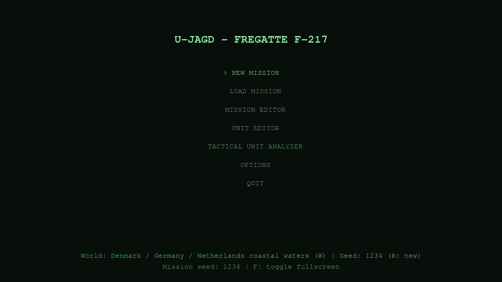
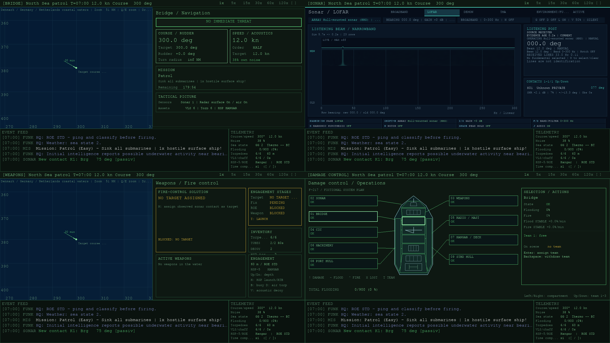
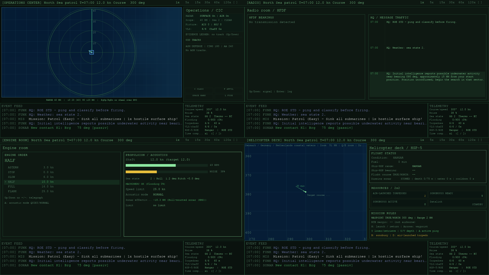
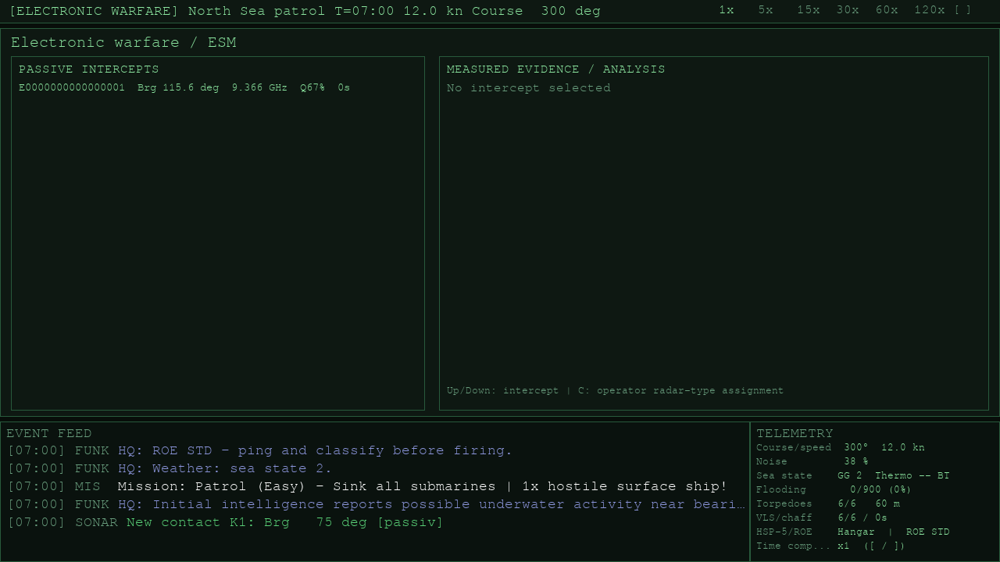

[Deutsche README](README.de.md)

# U-Jagd

U-Jagd is a real-time anti-submarine warfare tactics game for Linux, designed
around the ClockworkPi uConsole's 1280 x 720 workspace. You command a fictional
frigate and move between nine workstations to navigate, search, classify,
engage, and keep the ship operational.

Current release: **0.2.1**

Release 0.2.1 adds deterministic wind, rain, visibility and changing sea state;
weather effects on sensors and helicopter operations; station Autocrew; fuel and
expanded Engineering controls; the uConsole-hosted Remote Crew hotspot; and
animated native and browser weather instruments. Save format v10 and Commander
protocols v1/v2 remain unchanged.

This is an early playable release. It is a game, not a training or navigation
product. Its systems are simplified and do not claim to reproduce classified
capabilities, data, or doctrine.

## Screenshots









Full-resolution workstations: [Bridge](docs/screenshots/station-bridge.png),
[Sonar](docs/screenshots/station-sonar.png),
[Weapons](docs/screenshots/station-weapons.png),
[Damage Control](docs/screenshots/station-damage-control.png),
[OPZ/CIC](docs/screenshots/station-opz-cic.png),
[Radio](docs/screenshots/station-radio.png),
[Engineering](docs/screenshots/station-engineering.png),
[Helicopter](docs/screenshots/station-helicopter.png), and
[Electronic Warfare/ESM](docs/screenshots/station-eloka.png).

Damage-control example with authored flooding, fire, lost zones and repair teams:
[F-217 damage schematic](docs/screenshots/damage-control-alert.png).

Commander browser: [OPZ/CIC at 1920 x 1080](docs/screenshots/commander-overview.png),
[Sonar at 2560 x 1440](docs/screenshots/commander-wide.png), and the
[complete English/German desktop and mobile matrix](docs/screenshots/commander-captures.md).
[Local Commander options](docs/screenshots/commander-options.png).

## Highlights

- Nine stations: Bridge, Sonar, Weapons, Damage Control, OPZ/CIC, Radio,
  Engineering, Helicopter Deck, and Electronic Warfare/ESM.
- Four built-in scenarios, three difficulty levels, pause, and 1x, 5x, 15x,
  30x, 60x, and 120x time acceleration.
- Passive HMS and towed-array sonar, active sonar, broadband and LOFAR
  displays, DEMON analysis, bathythermograph readings, and bearing-only TMA.
- Surface and air radar, AIS, ESM, HFDF, manual classification and affiliation,
  and a common operational picture.
- Ship and helicopter torpedoes, sonobuoys, hostile missiles, ESSM, CIWS, and
  chaff.
- Civilian shipping, hostile surface ships, aircraft, biological contacts, and
  acoustic decoys.
- Flooding, fire, nine selectable zones in a procedural F-217 system schematic,
  and three assignable repair teams. The schematic is fictional, not a real
  F123 compartment plan.
- Five local save slots with deterministic world snapshots.
- English and German interface catalogs, system-language detection, and an
  options screen.
- Context tooltips on all nine stations: hover for a temporary explanation,
  or left-click a displayed item to pin its tooltip. `Esc` clears a pin before
  opening the quit dialog.
- A native 1280 x 720 interface, aspect-correctly letterboxed when necessary.
  Maps and symbols are drawn by Pygame; audio is synthesized at runtime.
- Optional trusted-LAN Remote Crew: multiple authenticated browser clients can
  hold exclusive station roles, switch among their retained roles, operate the
  same observation-led controls, and use separately granted direct fire.
- Conservative station Autocrew with local `F2` control and an `F3` overview.
  Remote Crew temporarily suspends Autocrew only for the leased station.
- Deterministic marine weather with wind, rain, visibility and smooth sea-state
  transitions. Weather affects radar, lookout, sonar and helicopter limits but
  does not add hidden wind drift.
- Modeled fuel consumption, endurance, range and repair trends in Engineering.

## Requirements

- Linux
- Python 3.11 or newer
- Pygame 2.6 or newer
- NumPy 2.0 or newer
- A Pygame-supported display
- An audio device is optional; startup continues silently if audio is
  unavailable

## Quick Start

```sh
git clone https://github.com/db9979/uconsole_asw_game.git
cd uconsole_asw_game
python3 -m venv .venv
. .venv/bin/activate
python -m pip install --upgrade pip
python -m pip install -r requirements.txt
python main.py
```

For ClockworkPi uConsole system packages, updates, and troubleshooting, see
[`docs/install-uconsole.en.md`](docs/install-uconsole.en.md).

## Command Line

The default launch uses fullscreen according to the saved preference and picks
a random mission seed:

```sh
python main.py
```

The supported arguments are:

```sh
python main.py 12345
python main.py 12345 --windowed
python main.py --no-audio
python main.py --version
```

`--windowed` and `--no-audio` override the corresponding saved options for that
launch. There is no `--fullscreen` or command-line language option. After a
package installation, the same entry point is available as `u-jagd`, for
example `u-jagd --windowed`.

## Starting a Game

The main menu provides new game, load, mission editor, unit editor, options,
and quit entries. A new game leads through scenario selection and, for the
random scenario, difficulty selection.

- `W` switches between the seed-selected real sector and the fixed legacy
  reference map.
- `R` generates a new seed.
- `F` toggles fullscreen from the menu.
- Arrow keys select an entry; `Enter` or `Space` confirms it.

A seed selects one of 128 real-data-derived 500 NM coastal sectors and produces
the same generated world for the same world mode. The fixed legacy map remains
available as a separate stylized option.

At mission start, Radio receives coarse, static intelligence about possible
underwater or hostile surface activity. Bearing and range are deliberately
rounded, the position is explicitly unconfirmed, and the report is not a sensor
fix. If no useful initial position exists, HQ directs the crew to develop the
picture with onboard sensors.

## Controls

Press `F1` in the game for context-sensitive help. A printable complete local
keyboard reference is available as
[`docs/station-shortcuts.de.pdf`](docs/station-shortcuts.de.pdf), with its text
source at [`docs/station-shortcuts.de.md`](docs/station-shortcuts.de.md). The
most important global controls are:

| Input | Action |
|---|---|
| `1` to `9` | Bridge, Sonar, Weapons, Damage, OPZ/CIC, Radio, Engineering, Helicopter, Electronic Warfare/ESM; press the active station number again to advance its page when available |
| `Tab` / `Shift+Tab` | Next / previous station |
| `P` | Pause / resume |
| `F1` | Context-sensitive help |
| `F2` / `F3` | Toggle Autocrew for the current station / open the Autocrew overview |
| `F4` | Open SimLog when enabled |
| `F8` | Open the tactical unit analyzer; cycles a visible Commander proposal when applicable |
| `F10` | Options; while paused, `O` also opens options |
| `F9` | Local Commander LAN administration |
| `S` / `L` | Save / load using slots 1 to 5; at OPZ/CIC, `L` is the contextual fusion command |
| `Z` / `X` or `[` / `]` | Slower / faster time acceleration |
| `+` / `-` | Engine telegraph |
| `Alt+Enter` | Toggle fullscreen |
| `Ctrl+Enter` | Primary weapon action at Weapons, OPZ/CIC, or Helicopter; normal readiness checks apply |
| `Q` / `E` or mouse wheel | Zoom visible maps on Bridge, Weapons, and Helicopter stations |
| Mouse drag | Pan a visible map and disable camera follow |
| `K` | Toggle camera follow on a visible map |
| `Esc` | Clear a pinned tooltip, cancel the current view/input, or open quit confirmation |

Station keys are deliberately contextual. For example, `Shift+A` sends an active
ping at Sonar, plain `A` selects Broadband listening there, and `A` changes
acoustic mode in Engineering. Use `F1` rather than
assuming that a key has the same meaning at every station.

In help, Left/Right switches category; Up/Down or Page Up/Page Down scrolls its
contents. Existing station weapon shortcuts remain available. Held course and
torpedo-depth adjustments use real time, not the selected simulation multiplier.

At Damage Control, click a zone or its label to select it and attempt to assign
the currently selected team. With tooltips enabled, the click also pins its
details. Up/Down selects a team, Enter assigns it, and Backspace withdraws it.
Flood and fire trends show the
model's net rate, including difficulty and multi-team effectiveness.

## Sonar Notes

Passive sonar produces uncertain bearings, not ground-truth positions or
depths. TMA needs a bearing history and own-ship maneuvering before it can
produce a useful position and motion estimate. Active echoes provide measured
bearing, range, and depth with uncertainty after the modeled sound-travel delay;
they are retained on the `ACTIVE` page and fade with age. An active fix expires,
and transmitting can alert submarines at a greater distance than the frigate
can receive an echo. Coastline occlusion, sea state, thermocline geometry, own
noise, and array selection affect results.

TMA and sonobuoy fixes also expire independently of continued passive hearing.
Historical plot tooltips inspect the displayed sample. Active returns retain
frozen transmit-time geometry; the separate outbound wave and moving-receiver
intercept are not simulated, and submarine ping warnings remain immediate.

At 1x, sonar audition consumes the receiver's bounded block handoff in order and
retries an unaccepted block when the playback queue is full. An overrun restarts
the stream rather than joining discontinuous samples. Above 1x, sonar audition is
muted and receiver blocks are
discarded rather than replayed later. Analysis remains independent of playback
availability and volume. DSP deliberately warms up again after loading a save;
saved tactical observations are retained.

Sonar controls include:

- `Shift+A`: transmit an active ping; the transmitter has a 30-second cooldown.
- `Shift+B`: select HMS or TAS as the receiving/transmitting array.
- `A` / `B` / `H`: select Broadband, Filtered or Heterodyne listening.
- `Y`: deploy or retrieve TAS.
- `U` / `V`: adjust TAS/VDS target depth after deployment.
- `Page Up` / `Page Down`: move through Broadband, LOFAR, DEMON, TMA,
  Environment, and ACTIVE pages.
- `2` while already at Sonar: advance to the next sonar page.

TAS handling progresses only between 3 and 12 kn. Deployment takes six
simulation minutes, retrieval takes eight, and the fully streamed array needs
30 more seconds to settle before reaching full performance. Handling pauses
outside the 3-12 kn envelope. Exceeding 20 kn while the cable is out faults the
array for the rest of the current game. TAS depth is also constrained by ship
speed.

Selecting TAS does not make it available: a TAS ping can produce echoes only
after enough cable is streamed. Pressing `Shift+A` while TAS is unavailable is
rejected without transmitting or consuming the shared ping cooldown. TAS active
range is lower than HMS active range; its primary advantage is passive bearing
accuracy and performance against suitably layered contacts after it has
settled.

## Radar Notes

At OPZ/CIC, `Page Up` and `Page Down` only select display scales of **10, 20, 40,
80, or 120 NM**; they do not change pages or sensor power. The modeled
clear-weather detection limits are 30 NM for surface radar and 100 NM for air
radar, with degradation from sea state 5 and rain clutter. Surface and air radar can be
controlled separately with `R` and `Shift+R`.

## Language and Options

On first launch, U-Jagd selects German for a German system locale and English
for English or unsupported locales. The options screen switches explicitly
between `en` and `de` and controls fullscreen, audio, large text, and tooltips.

Language, fullscreen, audio, large-text, and tooltip preferences are written to
`~/.u-jagd/settings.json`. Tooltip state is therefore global and is also stored
in v10 game saves for deterministic restoration of existing sessions.

## Commander LAN Co-op

Use **F10 > Commander LAN**, or **F9**, on the uConsole. Select an explicit
private IPv4 while the service is off, then enable it. Open the displayed URL on
each crew device. The default `127.0.0.1:8765` is local-only, not reachable from
another device. No router forwarding is needed or supported.

Alternatively, the uConsole can create a temporary WPA2 Remote Crew hotspot.
Install its narrowly scoped privileged helper once with
`sudo ./packaging/uconsole/install-hotspot-helper.sh`, select the hotspot network
mode in F9, and enable the service. U-Jagd generates a fresh SSID and Wi-Fi
password each time, starts the listener only after the private hotspot address is
ready, and stores neither credential. Stopping Remote Crew removes the hotspot
and restores the previous Wi-Fi connection. The game itself must not run with
`sudo`.

Pair using the six-character code: **three digits followed by three uppercase
letters**, for example `482KMT`. Codes expire after five minutes; five wrong
guesses in a rolling minute temporarily block further attempts. Lowercase browser
input is normalized to uppercase. The example is not a functioning credential.

After pairing, each browser requests one or more stations. The host grants each
station exclusively; ordinary station operation is enabled on approval, while
sonar audio and direct fire remain separate grants. A browser displays one active
station at a time, requests another through **Add station**, and retains its other
leases for quick switching through the station selector. An approved added station
opens automatically. Every
command is revalidated on the main
simulation thread against station damage, observation freshness, inventory,
readiness, ROE, and the current world generation. Communication still relies on
external voice; no microphone or chat is included.

While a browser owns a station lease, matching station input on the uConsole is
read-only. Host administration, pause, and switching to another station remain
available; revoking the lease restores local operation immediately.

The service starts **off on every launch**. Access and grants are not saved.
World replacement revokes active authority on the next main-thread frame. Manual
pause, focus loss, save/load, quit, nations, real editors, menus and splash lock
browser changes. With an active crew station, F1 help, the in-game F8 analyzer,
F9 crew administration and F10 options keep simulation and browser stations live.
Browser sonar sound requires an explicit host grant and a local user gesture;
reconnecting does not replay old audio. Its Broadband, Filtered, and Heterodyne
listening modes use the selected band, notch, and gain controls. Clicking or
tapping the Broadband waterfall sets Sonar's manual listening bearing; LOFAR
does not. The same local sound toggle also enables synthesized own-ship cavitation
noise on the Bridge; it uses only the projected cavitation warning and never
controls host audio.
Hover over an unavailable browser control to see its current localized reason,
such as a missing grant, damaged station, cooldown, empty inventory, pending
order, or the TAS handling-speed limit.

**Security:** HTTP is unencrypted. Use only a trusted LAN. No Internet hosting,
wildcard binding, CDN, remote ROE/time/save controls, or hidden entity data are
exposed. See [Remote Crew setup](docs/commander-coop.md) and
[protocol/security](docs/commander-protocol.md).

## Editors and Current Limits

The main menu exposes a Mission Editor and Unit Editor. They provide read-only
built-in libraries, user-content browsing, validation, cloning, editable typed
fields, and a deterministic static mission preview. Mission authors can edit
exact placements, seeded random groups, objectives, and timed events. Unit
authors can create all six profile kinds and edit nested acoustic and list data
through safe structured input. `Ctrl+E` and `Ctrl+I` expose bundle export and
import. JSON templates under `data/editor_templates/` describe the accepted
schemas; user files are stored under `~/.u-jagd/missions/` and
`~/.u-jagd/units/`.

Validated does not mean runtime-effective. In release 0.2.1:

- A user mission can be started with `F5` from the Mission Editor browser only
  when it uses the supported runtime subset.
- Effective mission values are the seed and name; 500 NM fixed-world placement
  sectors; player position, course, and speed; sea state, start time, and
  thermocline depth; exact built-in submarine and surface profiles with their
  placement, course, speed, and submarine depth; and `sink` or `survive`
  objectives with a time limit.
- A runtime mission must specify a 500 NM `fixed` world and `clear` weather.
  Alternate world sizes and reference worlds are rejected. The editor's world
  definition does not replace the game's coast dataset.
- Submarine placements must be hostile. For a `sink` objective, its target list
  must exactly match all placed submarines.
- Random groups, timed events, `protect` and `reach` objectives, aircraft,
  animals, torpedoes, decoys, and user-created unit profiles are rejected for
  runtime play rather than silently ignored.
- Unit Editor output is validation/authoring data only. No user unit-profile
  field currently changes the running simulation.

## Saves and User Data

Release 0.2.1 writes and loads save format **v10** only. V10 requires the exact
`u-jagd-save-v10` schema, including the current runtime catalog snapshot and all
deterministic continuation state. Older, newer, malformed, or incomplete saves
are rejected without replacing the running game.

The five slots are `~/.u-jagd/slot1.json` through `slot5.json`. Saves include a
snapshot of coastline geometry and synthetic bathymetry so an existing game is
not regenerated against a later world generator.

## World Data and Disclaimer

`data/coastlines/real_sectors.json.gz` contains exactly 128 prevalidated 500 NM
sectors derived from Natural Earth country geometry and a Wikidata airbase
coordinate snapshot. Real place, country, and military-base names and source
coordinates may therefore appear. Friendly, hostile, neutral, and civil roles
are assigned independently as fictional exercise roles and do not describe the
real states or facilities.

Bathymetry is synthetic and all tactical ranges, platform performance,
acoustics, affiliations, and exercise roles are game-model data. Nothing in the
repository is suitable for navigation, surveying, identification of real-world
capability, or operational planning. U-Jagd is not affiliated with or endorsed
by Natural Earth, Wikidata, their contributors, any platform manufacturer,
military organization, government, or source rights holder.

Exact provenance, versions, hashes, transformation notes, and licenses are in
[`THIRD_PARTY_NOTICES.md`](THIRD_PARTY_NOTICES.md). Private WaveOps/MNW material
is not a repository source. No text, images, layouts, data, imitation,
transcription, or derived material from it is used.

## Development and Tests

The workstation/model review, delivered corrections, remaining modeling limits,
and hardware acceptance checklist are documented in
[`docs/workstation-review.md`](docs/workstation-review.md).
Current work is tracked in [`docs/plan-0.1.8.md`](docs/plan-0.1.8.md) and
[`docs/resume.md`](docs/resume.md). The completed 0.1.6 stabilization plan remains
available in [`docs/plan-0.1.6.md`](docs/plan-0.1.6.md).

Install the project and development dependency, then run the test suite:

```sh
python -m pip install -e '.[dev]'
pytest
```

Validate the generated contact catalog with:

```sh
python tools/gen_contacts.py --check
```

Build a wheel with a PEP 517 frontend:

```sh
python -m pip install build
python -m build
```

## License and Credits

Project code and project-specific documentation are licensed under the MIT
License; see [`LICENSE`](LICENSE). Pygame, NumPy, geographic source data, and any
future assets retain their own licenses and attribution requirements. See
[`THIRD_PARTY_NOTICES.md`](THIRD_PARTY_NOTICES.md) and
[`assets/README.md`](assets/README.md).
