[Deutsche README](README.de.md)

# U-Jagd

[](https://buymeacoffee.com/zquu1xu570)

U-Jagd is a real-time anti-submarine warfare game, built for the ClockworkPi
uConsole (1280 x 720) and also available for Windows and macOS. You command
the frigate F-217 with nine stations, or a submarine with seven, and hunt or
evade the other side. Friends can crew stations from a browser on the same
network.

Current release: **1.3.237**

Release 1.3.237 makes the optional voice speak numbers the way a watch
does: digit by digit. The executive officer, the coach, the crew reports and
the voice test now say 431 as "four three one" and 0.9 as "zero point
niner" (in German "vier drei eins", "null Komma neun"), whether or not the
text is cleaned before speaking. The voice also starts sooner: a long
answer is sent sentence by sentence, so the first sentence plays while the
rest is still being made, and audio a service streams (OpenAI does) plays
while it still arrives. Keys are unchanged. Saves are v53; v38 to
v52 saves still load.

Earlier releases: [CHANGELOG.md](CHANGELOG.md).

U-Jagd is a hobby project by a single developer. It is a game, not a training
or navigation product, and its systems are deliberately simplified.

## Screenshots

### uConsole (1280 x 720)

<table>
<tr>
<td width="50%" align="center"><a href="docs/screenshots/frigate-binoculars-day.png">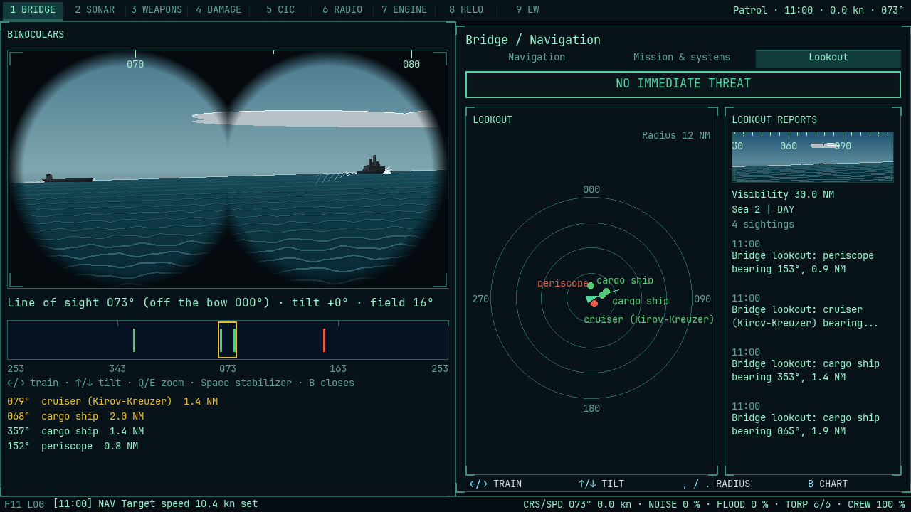</a><br><sub>Frigate binoculars, day</sub></td>
<td width="50%" align="center"><a href="docs/screenshots/uboot-periscope-night.png">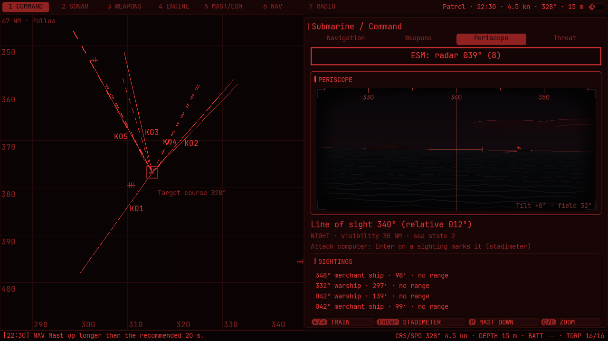</a><br><sub>Submarine periscope, night</sub></td>
</tr>
</table>

Frigate stations:

<table>
<tr>
<td width="33%" align="center"><a href="docs/screenshots/station-bridge.png">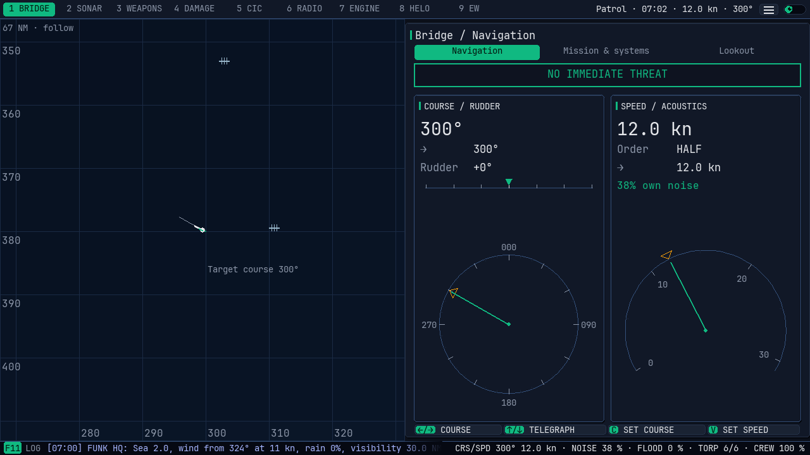</a><br><sub>Bridge</sub></td>
<td width="33%" align="center"><a href="docs/screenshots/station-sonar.png">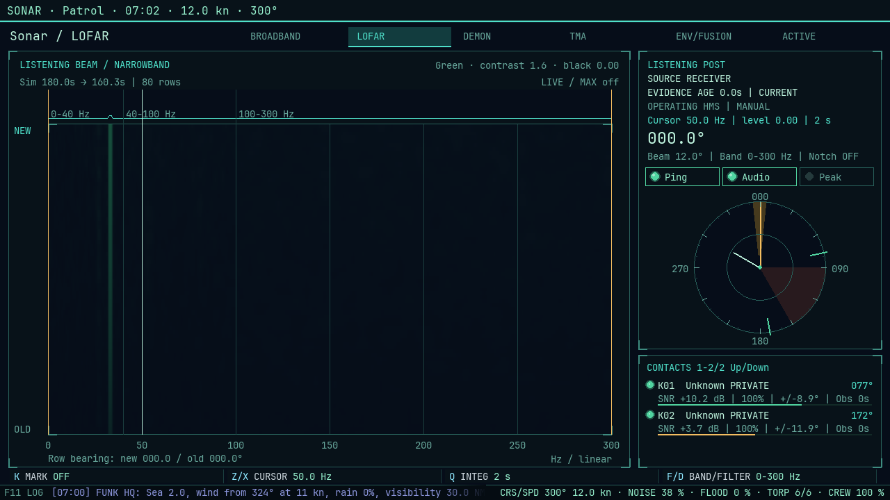</a><br><sub>Sonar</sub></td>
<td width="33%" align="center"><a href="docs/screenshots/station-weapons.png">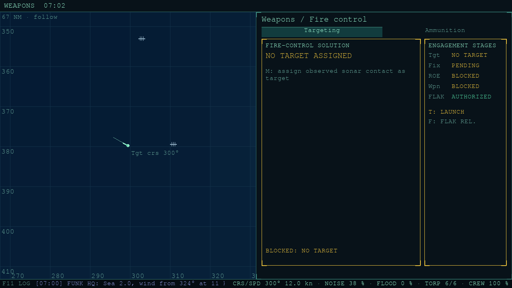</a><br><sub>Weapons</sub></td>
</tr>
<tr>
<td width="33%" align="center"><a href="docs/screenshots/station-opz-cic.png">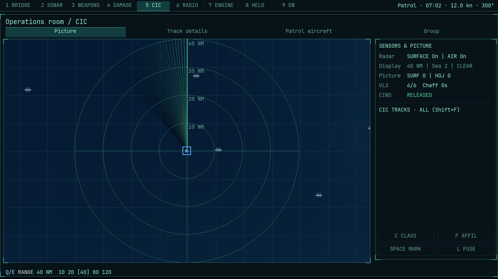</a><br><sub>OPZ/CIC</sub></td>
<td width="33%" align="center"><a href="docs/screenshots/station-eloka.png">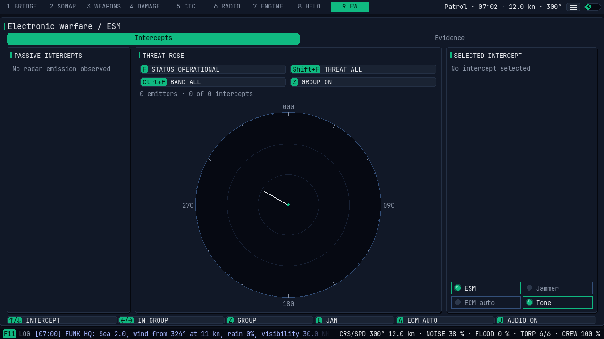</a><br><sub>Electronic Warfare/ESM</sub></td>
<td width="33%" align="center"><a href="docs/screenshots/station-helicopter.png">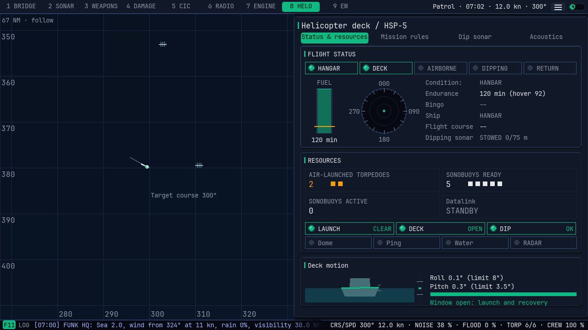</a><br><sub>Helicopter</sub></td>
</tr>
</table>

Submarine stations:

<table>
<tr>
<td width="33%" align="center"><a href="docs/screenshots/uboot-command.png">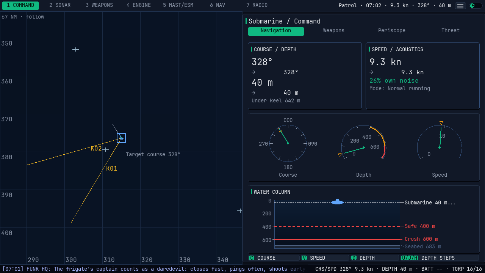</a><br><sub>Command</sub></td>
<td width="33%" align="center"><a href="docs/screenshots/uboot-sonar.png">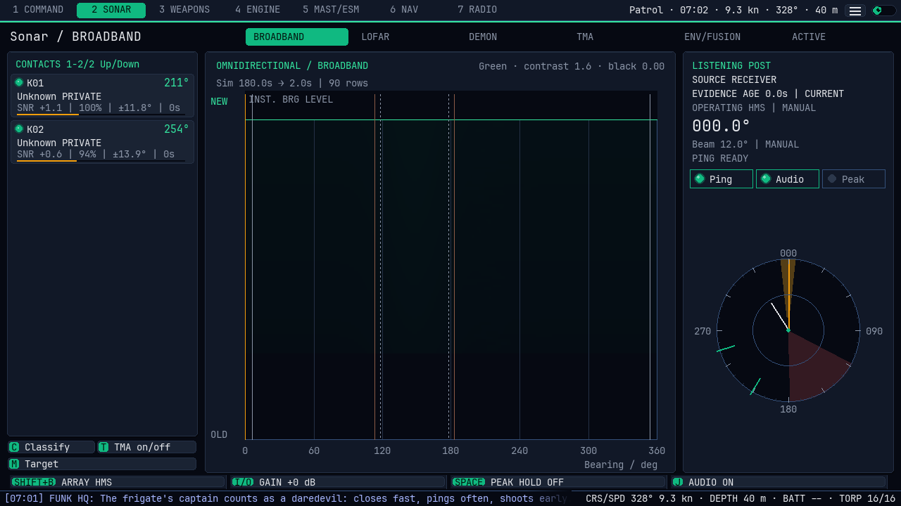</a><br><sub>Sonar</sub></td>
<td width="33%" align="center"><a href="docs/screenshots/uboot-navigation.png">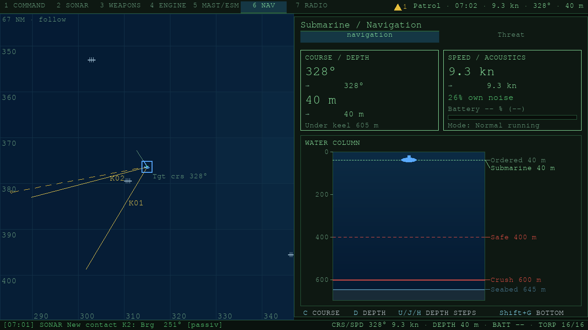</a><br><sub>Navigation</sub></td>
</tr>
</table>

More: [damage control](docs/screenshots/station-damage-control.png), [radio](docs/screenshots/station-radio.png), [engine room](docs/screenshots/station-engineering.png), [submarine weapons](docs/screenshots/uboot-weapons.png), [submarine engine room](docs/screenshots/uboot-engine.png), [main menu](docs/screenshots/main-menu.png) and [Mission Editor](docs/screenshots/mission-editor-detail.png).

### Browser (1920 x 1080)

<table>
<tr>
<td width="50%" align="center"><a href="docs/screenshots/commander-v2-en-opz-desktop.png">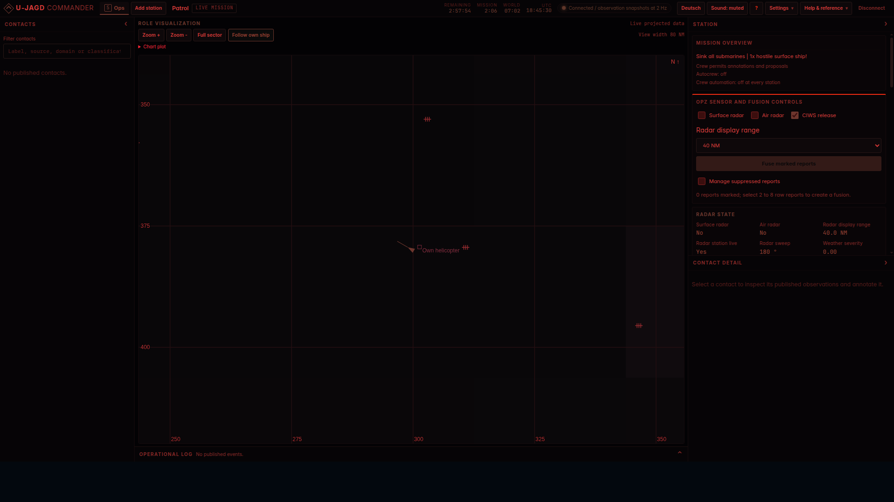</a><br><sub>OPZ/CIC</sub></td>
<td width="50%" align="center"><a href="docs/screenshots/commander-v2-en-sonar-desktop.png">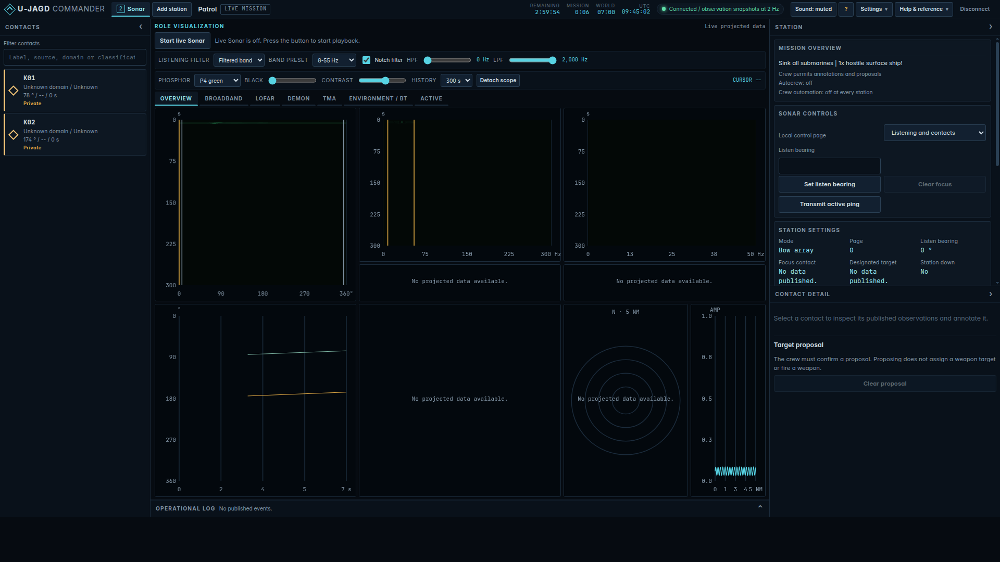</a><br><sub>Sonar</sub></td>
</tr>
</table>

More: the [complete English/German browser gallery](docs/screenshots/commander-captures.md).

## Features

- Two sides: the frigate F-217 (nine stations) or a submarine (seven stations).
- Twelve scenarios per side, including a free patrol, plus training lessons,
  a daily mission, a campaign and short missions.
- Passive and active sonar with towed array and variable-depth sonar, LOFAR,
  DEMON and bearing-only target motion analysis; radar, ESM and radio.
- Helicopter, patrol aircraft, torpedoes, depth charges and an escort
  destroyer; damage control with fire, flooding and wounded crew.
- Always real time: no pause and no time acceleration. Free stations are
  manned by the AI crew.
- Multiplayer in the browser: each player takes one or more stations, phones
  can join as lookouts by QR code.
- Mission and unit editors with sharing; English and German; light, dark and
  high-contrast colour schemes.
- An optional language model add-on for radio wording and an executive
  officer; the game works fully offline without it.

## Download and Install

### Windows

Download `U-Jagd-Windows.exe` from the
[latest release](https://github.com/db9979/uconsole_asw_game/releases/latest)
and run it. The program is not code-signed, so SmartScreen may warn on the
first start ("More info", "Run anyway").

### macOS (Apple silicon)

Download `U-Jagd-macOS-arm64.zip` from the
[latest release](https://github.com/db9979/uconsole_asw_game/releases/latest),
unzip it and move `U-Jagd.app` to Applications. The app is not notarized:
open it once with right-click, **Open** (macOS 15: **System Settings > Privacy
& Security > Open Anyway**). There is no build for Intel Macs.

### uConsole and Linux

One command installs the game on the uConsole with a menu entry:

```sh
curl -fsSL https://raw.githubusercontent.com/db9979/uconsole_asw_game/main/packaging/uconsole/install.sh | sh
```

On any other Linux system (Python 3.11 or newer):

```sh
git clone https://github.com/db9979/uconsole_asw_game.git
cd uconsole_asw_game
python3 -m venv .venv
. .venv/bin/activate
python -m pip install -r requirements.txt
python main.py
```

Details and troubleshooting: [uConsole installation guide](docs/install-uconsole.en.md).

### Updates

Nothing is installed automatically. When a newer release exists, the start
screen and the main menu show its changelog entry and offer **Update now**.
Saves and settings in `~/.u-jagd/` are kept.

## Playing Together

Choose **Multiplayer** in the main menu. The lobby shows an address, a
pairing code and a QR code; other players open it in a browser on the same
network and take stations, and the AI crews the rest. `python main.py --server`
lets every player use a browser. Plain HTTP is for a trusted home network
only. Setup and security: [Remote Crew guide](docs/commander-coop.md) and
[web-host guide](docs/web-host.de.md) (German).

## Documentation

- In the game, `F1` opens context help and the full manual.
- Manual: [Markdown](docs/manual/manual.en.md), PDF in [English](docs/manual/manual.en.pdf)
  and [German](docs/manual/handbuch.de.pdf).
- Printable key reference (German): [station shortcuts](docs/station-shortcuts.de.pdf).
- Remote Crew protocol and security: [protocol](docs/commander-protocol.md).
- Version history: [CHANGELOG.md](CHANGELOG.md).

## Development

```sh
python -m pip install -e '.[dev]'
pytest
```

Architecture, rules and all checks are described in [AGENTS.md](AGENTS.md).

## World Data and Disclaimer

The coasts come from 128 sectors derived from Natural Earth and Wikidata, so
real place and base names can appear. Their roles in the game are fictional,
and bathymetry, ranges and platform data are game-model values. Nothing here
is suitable for navigation or operational planning. Sources and licenses:
[`THIRD_PARTY_NOTICES.md`](THIRD_PARTY_NOTICES.md).

## Support

U-Jagd is free. If you enjoy it, you can support it at
[buymeacoffee.com/zquu1xu570](https://buymeacoffee.com/zquu1xu570).

## License

Code and project documentation are MIT licensed, see [`LICENSE`](LICENSE).
Pygame, NumPy, source data and fonts keep their own licenses, see
[`THIRD_PARTY_NOTICES.md`](THIRD_PARTY_NOTICES.md).
