[Deutsche README](README.de.md)

# U-Jagd

[](https://buymeacoffee.com/zquu1xu570)

An optional browser-only LAN room is available with `--web-host` behind a
separate HTTPS reverse proxy. See the [German web-host guide](docs/web-host.de.md).

U-Jagd is a real-time anti-submarine warfare tactics game for Linux, designed
around the ClockworkPi uConsole's 1280 x 720 workspace. You command a fictional
frigate and move between nine workstations to navigate, search, classify,
engage, and keep the ship operational.

Current release: **1.3.187**

Release 1.3.187 makes runs and saves more dependable. Two games with the
same seed now play out the same even when started one after the other without
restarting the program (the patrol aircraft's radar and MAD, contact reports
and submarine sightings no longer depend on internal numbering). Every save
is checked before it is written, so a broken state can no longer overwrite
the last good slot or the autosave; the periodic autosave does that check in
the background so the game keeps running smoothly. The submarine's objective
line now uses the dead-reckoned position instead of the true one. Unused
thresholds are removed, and the manual now says AI submarines report
contacts from the last 4 minutes. Keys follow the common scheme more closely: the submarine's F shot fires only
with Ctrl+Enter (Enter confirms the range), C classifies on the submarine's
ESM page, W sets the helicopter's waypoint on the selected contact, Enter
accepts the selected task on the radio Tasks page, Backspace on CIC page 5
resets only the chosen row (Shift+Backspace resets all), Shift+A at the
submarine's Command pings on the uConsole too, and the real-sector choice
moves from PgUp/PgDn to [ and ]. W, R and F no longer act unseen in the
lobby, logbook and other menu pages. F1 shows the submarine's own global
keys aboard, and the logbook lists its keys at the bottom. Saves are v50; v38 to v49
saves still load.

Earlier releases: [CHANGELOG.md](CHANGELOG.md).

This is a hobby project built by a single developer. It is a game, not a training or navigation
product. Its systems are simplified and do not claim to reproduce classified
capabilities, data, or doctrine.

## Screenshots

### uConsole (1280 x 720)

The lookout's binoculars on the frigate and the submarine's periscope, by day and by night, with the ships in the eyepiece:

<table>
<tr>
<td width="50%" align="center"><a href="docs/screenshots/frigate-binoculars-day.png"></a><br><sub>Frigate binoculars, day</sub></td>
<td width="50%" align="center"><a href="docs/screenshots/frigate-binoculars-night.png">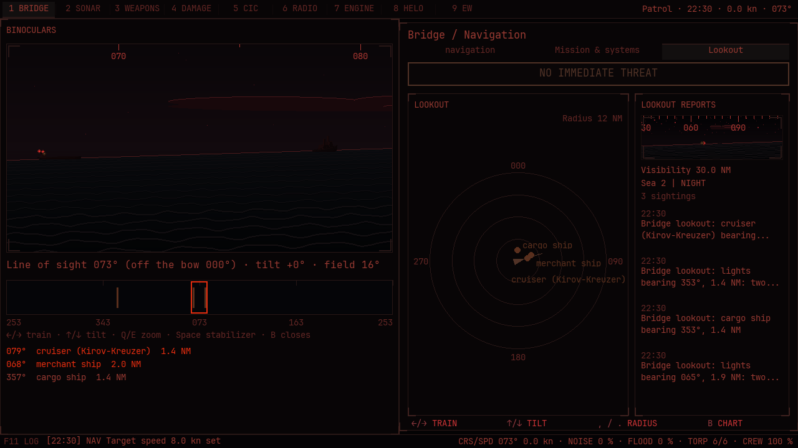</a><br><sub>Frigate binoculars, night</sub></td>
</tr>
<tr>
<td width="50%" align="center"><a href="docs/screenshots/uboot-periscope-day.png">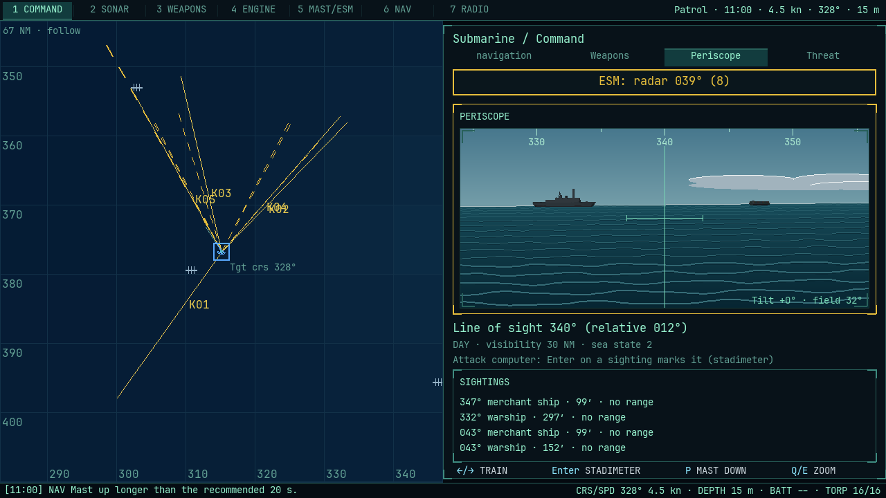</a><br><sub>Submarine periscope, day</sub></td>
<td width="50%" align="center"><a href="docs/screenshots/uboot-periscope-night.png"></a><br><sub>Submarine periscope, night</sub></td>
</tr>
</table>

Frigate workstations:

<table>
<tr>
<td width="33%" align="center"><a href="docs/screenshots/station-bridge.png"></a><br><sub>Bridge</sub></td>
<td width="33%" align="center"><a href="docs/screenshots/station-sonar.png"></a><br><sub>Sonar</sub></td>
<td width="33%" align="center"><a href="docs/screenshots/station-weapons.png"></a><br><sub>Weapons</sub></td>
</tr>
<tr>
<td width="33%" align="center"><a href="docs/screenshots/station-opz-cic.png"></a><br><sub>OPZ/CIC</sub></td>
<td width="33%" align="center"><a href="docs/screenshots/station-eloka.png"></a><br><sub>Electronic Warfare/ESM</sub></td>
<td width="33%" align="center"><a href="docs/screenshots/station-damage-control.png">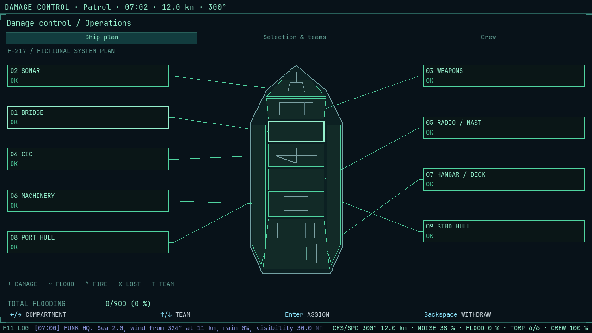</a><br><sub>Damage Control</sub></td>
</tr>
<tr>
<td width="33%" align="center"><a href="docs/screenshots/station-radio.png">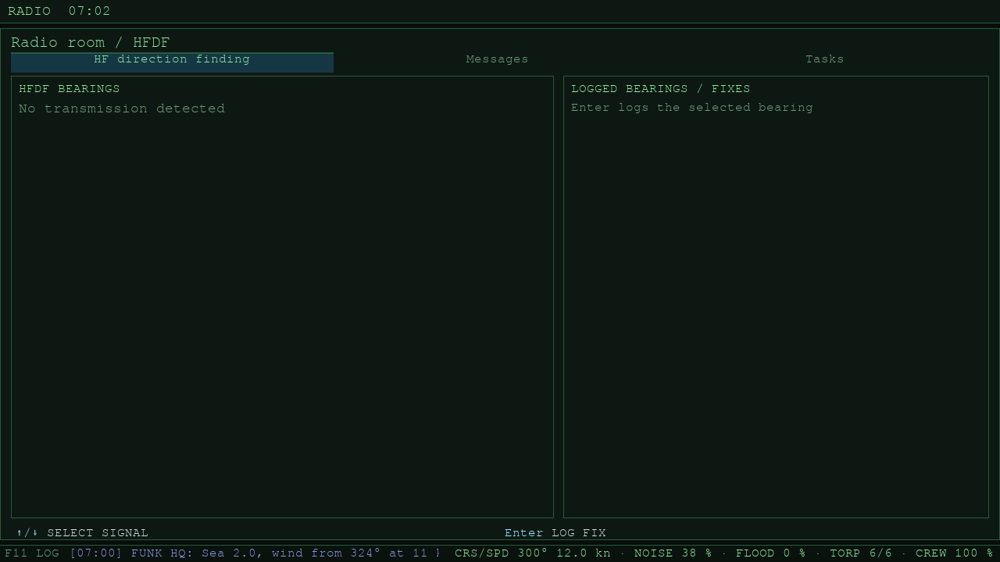</a><br><sub>Radio</sub></td>
<td width="33%" align="center"><a href="docs/screenshots/station-engineering.png">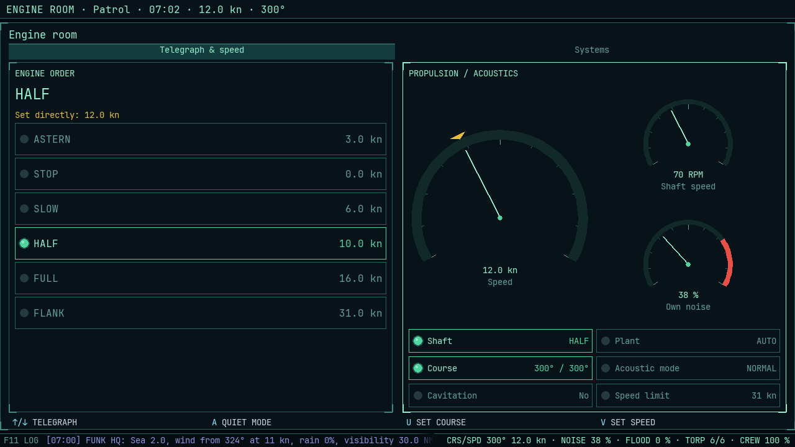</a><br><sub>Engineering</sub></td>
<td width="33%" align="center"><a href="docs/screenshots/station-helicopter.png"></a><br><sub>Helicopter</sub></td>
</tr>
</table>

Playing the submarine (`--play-sub`):

<table>
<tr>
<td width="33%" align="center"><a href="docs/screenshots/uboot-command.png"></a><br><sub>Command</sub></td>
<td width="33%" align="center"><a href="docs/screenshots/uboot-sonar.png"></a><br><sub>Sonar</sub></td>
<td width="33%" align="center"><a href="docs/screenshots/uboot-weapons.png">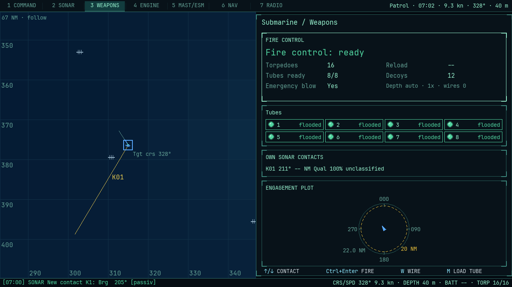</a><br><sub>Weapons</sub></td>
</tr>
<tr>
<td width="33%" align="center"><a href="docs/screenshots/uboot-engine.png">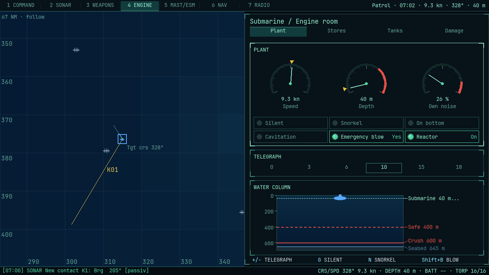</a><br><sub>Engine room</sub></td>
<td width="33%" align="center"><a href="docs/screenshots/uboot-mast-esm.png">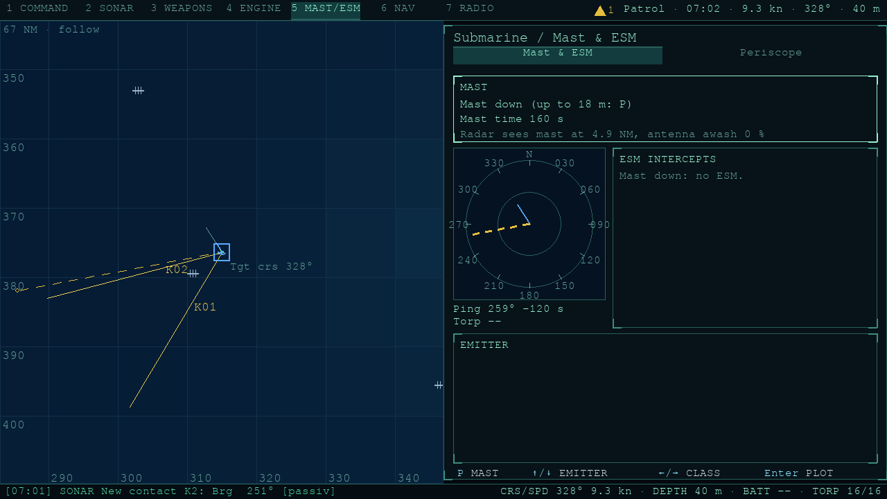</a><br><sub>Mast & ESM</sub></td>
<td width="33%" align="center"><a href="docs/screenshots/uboot-navigation.png"></a><br><sub>Navigation</sub></td>
</tr>
</table>

Menus and editors:

<table>
<tr>
<td width="33%" align="center"><a href="docs/screenshots/main-menu.png">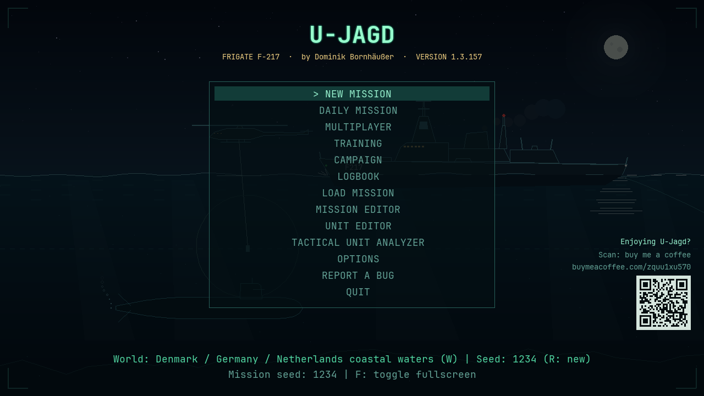</a><br><sub>Main menu</sub></td>
<td width="33%" align="center"><a href="docs/screenshots/mission-briefing.png">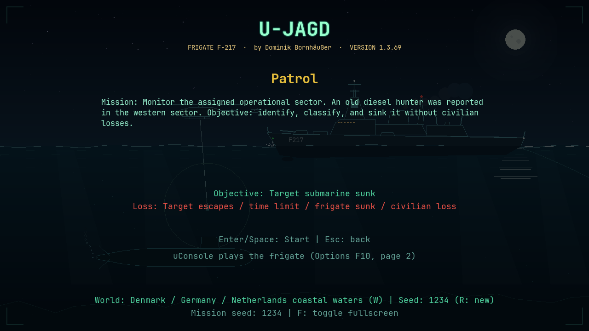</a><br><sub>Briefing</sub></td>
<td width="33%" align="center"><a href="docs/screenshots/mission-editor-detail.png">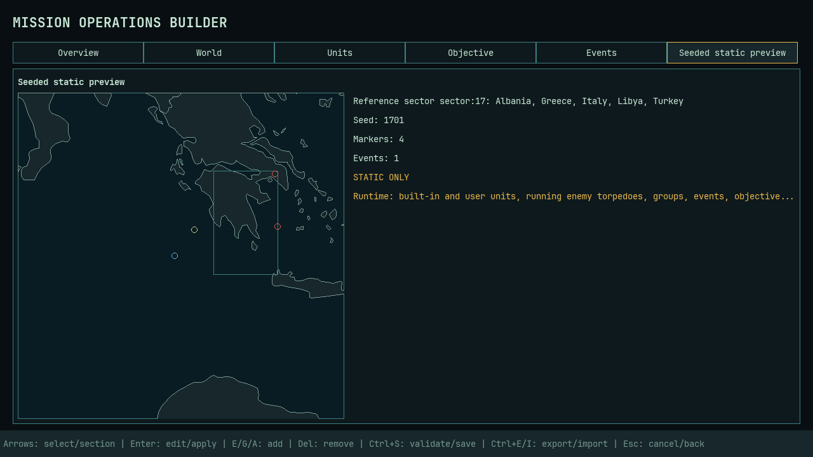</a><br><sub>Mission Editor preview</sub></td>
</tr>
</table>

More: [submarine radio room](docs/screenshots/uboot-radio.png), [damage-control example](docs/screenshots/damage-control-alert.png), [submarine damage control](docs/screenshots/uboot-damage-control.png), [scenario selection](docs/screenshots/mission-scenario-selection.png), [options](docs/screenshots/options.png), [Mission Editor](docs/screenshots/mission-editor.png), [Unit Editor](docs/screenshots/unit-editor.png) and the [tactical unit analyzer](docs/screenshots/contact-analyzer.png).

### Remote Crew browser (1920 x 1080)

<table>
<tr>
<td width="50%" align="center"><a href="docs/screenshots/commander-v2-en-binoculars-day.png">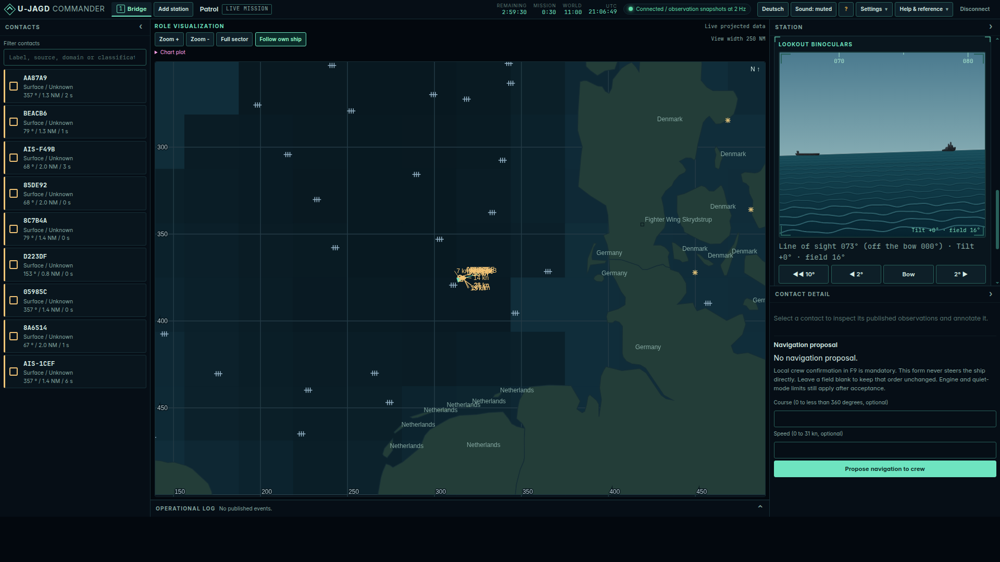</a><br><sub>Bridge: lookout binoculars, day</sub></td>
<td width="50%" align="center"><a href="docs/screenshots/commander-v2-en-periscope-night.png">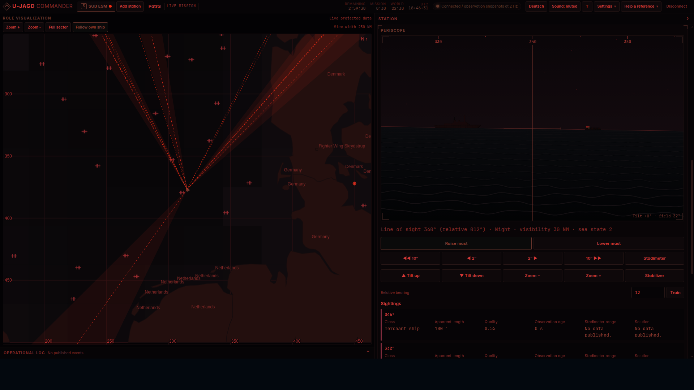</a><br><sub>Submarine Mast & ESM: periscope, night</sub></td>
</tr>
<tr>
<td width="50%" align="center"><a href="docs/screenshots/commander-v2-en-opz-desktop.png"></a><br><sub>OPZ/CIC</sub></td>
<td width="50%" align="center"><a href="docs/screenshots/commander-v2-en-sonar-desktop.png"></a><br><sub>Sonar</sub></td>
</tr>
<tr>
<td colspan="2" align="center"><a href="docs/screenshots/commander-v2-en-uboot-engine-desktop.png">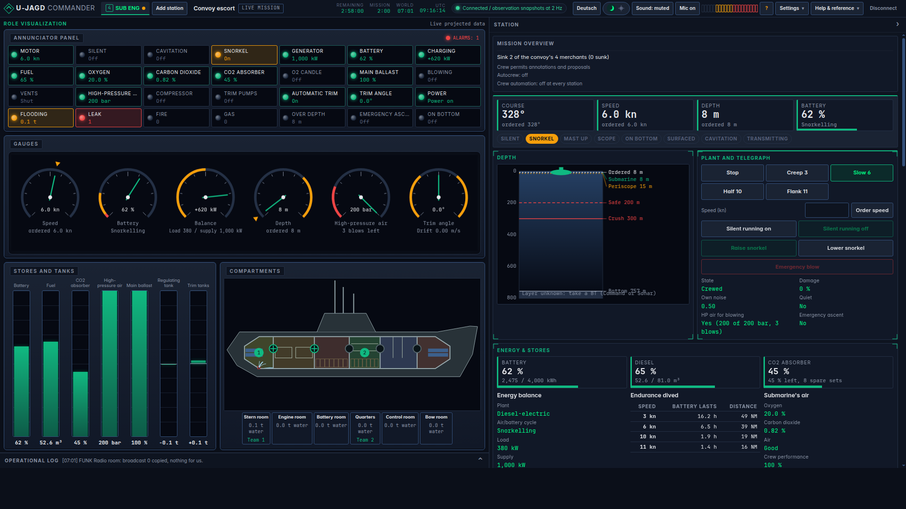</a><br><sub>Submarine engine room: machinery control console</sub></td>
</tr>
</table>

More: [binoculars at night](docs/screenshots/commander-v2-en-binoculars-night.png), [periscope by day](docs/screenshots/commander-v2-en-periscope-day.png), [Sonar at 2560 x 1440](docs/screenshots/commander-wide.png), the [complete English/German desktop and mobile matrix](docs/screenshots/commander-captures.md) and the [local Remote Crew options](docs/screenshots/commander-options.png).

To regenerate every image after an update: `python tools/capture_screenshots.py`
(uConsole views, headless) and `python tools/capture_commander.py` (browser
views; needs an installed Chromium on `PATH`).

## Highlights

- Nine stations: Bridge, Sonar, Weapons, Damage Control, OPZ/CIC, Radio,
  Engineering, Helicopter Deck, and Electronic Warfare/ESM.
- Four built-in scenarios, fully configurable custom difficulty, and continuous real-time simulation (no pause, no time acceleration).
- Passive HMS and towed-array sonar, active sonar, broadband and LOFAR
  displays, DEMON analysis, bathythermograph readings, and bearing-only TMA.
- Surface and air radar, AIS, ESM, HFDF, manual classification and affiliation,
  and a common operational picture.
- Ship and helicopter torpedoes, sonobuoys, hostile missiles, ESSM, CIWS, and
  chaff.
- Civilian shipping, hostile surface ships, aircraft, biological contacts, and
  acoustic decoys.
- Flooding, fire, nine selectable zones in a procedural F-217 system schematic,
  and three assignable repair teams. The schematic is fictional, not a real
  F123 compartment plan.
- Five local save slots with deterministic world snapshots.
- English and German interface catalogs, system-language detection, and an
  options screen.
- Context tooltips on all nine stations: hover for a temporary explanation,
  or left-click a displayed item to pin its tooltip. `Esc` clears a pin before
  opening the quit dialog.
- A native 1280 x 720 interface, aspect-correctly letterboxed when necessary.
  Maps and symbols are drawn by Pygame; audio is synthesized at runtime.
- Optional trusted-LAN Remote Crew: multiple authenticated browser clients can
  hold exclusive station roles, switch among their retained roles, operate the
  same observation-led controls, and use separately granted direct fire.
  The browser console is a one-viewport combat-information-centre layout for
  large desktop monitors: status bar, central instrument and collapsible docks.
  `python main.py --solo-crew` (or the F9 "Crew mode" row) lets one browser run
  all nine stations plus save/load and new game while the
  uConsole stays the simulation server; see [Remote Crew setup](docs/commander-coop.md).
- Conservative station Autocrew with local `F2` control and an `F3` overview.
  Remote Crew temporarily suspends Autocrew only for the leased station.
- Deterministic marine weather with wind, rain, visibility and smooth sea-state
  transitions. Weather affects radar, lookout, sonar and helicopter limits but
  does not add hidden wind drift.
- Modeled fuel consumption, endurance, range and repair trends in Engineering.

## Windows program

Download `U-Jagd-Windows.exe` from the
[latest release](https://github.com/db9979/uconsole_asw_game/releases/latest)
and run it; no Python installation is needed. The starter window lets you
choose crew mode (several browsers, one station each) or solo mode (one
browser runs every station), whether this PC plays the submarine, window or
full screen, sound and the port, and the **Language** box at the top switches
the starter, the game and the crew browsers between English and Deutsch (saved
in the settings); then **Start server** opens the game window
with Remote Crew already listening on the PC's private LAN address. The
starter shows the browser address, the join code and a QR code; station
requests are approved in the game window (F9) as on the uConsole. Windows may
ask once whether U-Jagd may use private networks: allow it, otherwise other
devices cannot connect. **Stop server** ends the game (unsaved progress is
lost), and the link at the bottom opens the "Buy me a coffee" page; the game log is kept in `%USERPROFILE%\.u-jagd\logs\server.log`.

At every start the program asks GitHub whether a newer release exists; the
game's start screen and main menu then show its changelog entry (and a warning
when saves of this version will not load in it) and offer **Update now**.
Nothing is installed before that button is pressed: then it downloads the new
file in the background (progress on the button), checks its size and SHA-256
digest, closes, replaces itself and starts the new version (a
leftover `U-Jagd-Windows.exe.new` is deleted at the next start). The build is not code-signed,
so Windows SmartScreen may warn on the first start ("More info", "Run
anyway"). Saves and settings live in `%USERPROFILE%\.u-jagd\` as on Linux.

The workflow `.github/workflows/windows.yml` builds the program with
PyInstaller (`packaging/windows/u-jagd-windows.spec`) on every push and pull
request, runs its headless self-test (a short mission plus the Remote Crew
pages) and, on `main`, publishes release `v<APP_VERSION>` once per version and then deletes every older
release and its `vX.Y.Z` git tag, so only the newest release and tag stay.
To build locally on Windows: `python -m pip install -e ".[windows]"` and
`pyinstaller packaging/windows/u-jagd-windows.spec`.

## macOS app

Download `U-Jagd-macOS-arm64.zip` (Apple silicon) or `U-Jagd-macOS-x86_64.zip`
(Intel Mac) from the
[latest release](https://github.com/db9979/uconsole_asw_game/releases/latest),
unzip it and move `U-Jagd.app` to Applications (or any folder you can write
to); no Python installation is needed. The app starts straight into the game
like the Windows program. It is not signed with an Apple developer certificate
or notarized, so the first start needs one extra step: right-click (or
Control-click) the app, choose **Open** and confirm **Open** (on macOS 15 and
later: open it once, then **System Settings > Privacy & Security > Open
Anyway**), or remove the download quarantine in Terminal with
`xattr -dr com.apple.quarantine /Applications/U-Jagd.app`. macOS may ask
whether U-Jagd may find devices on the local network and accept incoming
connections: allow both for Remote Crew. Keys are the same as on the other
systems (`Ctrl`, not `Cmd`).

**Update now** works as in the Windows program: the app downloads the zip for
its processor, checks its size and SHA-256 digest, unpacks the new
`U-Jagd.app` beside itself, closes, swaps the bundle (the old one is deleted
only once the new one is in place) and opens the new version. An app run from
the quarantined download folder or a folder you cannot write to opens the
release page instead. Saves and settings live in `~/.u-jagd/` as on Linux; an
update never touches them.

The same workflow builds `U-Jagd.app` with PyInstaller
(`packaging/macos/u-jagd-macos.spec`) natively for arm64 and x86_64 (pygame
and NumPy publish no universal2 wheels), self-tests it, zips it with
`ditto -c -k --keepParent` and, on `main`, a final job attaches both zips and
the Windows program to the same release. To build locally on a Mac:
`python -m pip install -e ".[macos]"` and
`pyinstaller packaging/macos/u-jagd-macos.spec`.

## Requirements

- Linux (or Windows or macOS with the packaged [Windows program](#windows-program)
  or [macOS app](#macos-app))
- Python 3.11 or newer
- Pygame 2.6 or newer
- NumPy 2.0 or newer
- A Pygame-supported display
- An audio device is optional; startup continues silently if audio is
  unavailable

## Quick Start

On the ClockworkPi uConsole, one command installs the game with a menu entry.
A newer release is never installed on its own: the start screen shows it with
its changelog entry and installs it when you press **Update now** (offline no
notice appears):

```sh
curl -fsSL https://raw.githubusercontent.com/db9979/uconsole_asw_game/main/packaging/uconsole/install.sh | sh
```

Manual setup on any Linux system:

```sh
git clone https://github.com/db9979/uconsole_asw_game.git
cd uconsole_asw_game
python3 -m venv .venv
. .venv/bin/activate
python -m pip install --upgrade pip
python -m pip install -r requirements.txt
python main.py
```

For the installer's details, ClockworkPi uConsole system packages, manual
updates, and troubleshooting, see
[`docs/install-uconsole.en.md`](docs/install-uconsole.en.md).

## Command Line

The default launch uses fullscreen according to the saved preference and picks
a random mission seed:

```sh
python main.py
```

The supported arguments are:

```sh
python main.py 12345
python main.py 12345 --windowed
python main.py --no-audio
python main.py --version
```

`--windowed` and `--no-audio` override the corresponding saved options for that
launch. There is no `--fullscreen` or command-line language option. After a
package installation, the same entry point is available as `u-jagd`, for
example `u-jagd --windowed`.

`python main.py --remote-crew` starts Remote Crew in crew mode on the first
private LAN address at launch, as the F9 row would (`--solo-crew` does the same
in solo mode; `--web-port` picks the port, default 8765). `--status-file PATH`
writes the Remote Crew address and join code as JSON to `PATH` whenever they
change; the Windows starter reads it.

## Starting a Game

The main menu provides new game, load, mission editor, unit editor, options,
and quit entries. A new game leads through scenario selection and, for the
random scenario, a custom difficulty screen (submarine stealth, repair rate,
torpedo count and hit tolerance, enemy aggression, starting sea state,
submarine/warship/traffic counts, air raid frequency, and time limit).

- `W` cycles through the seed-selected real sector, the fixed legacy reference
  map, and a fixed selectable real sector.
- `Page Up`/`Page Down` select the coast in the fixed real-sector mode.
- `R` generates a new seed while retaining the selected fixed real sector.
- `F` toggles fullscreen from the menu.
- Arrow keys select an entry; `Enter` or `Space` confirms it.

A seed selects one of 128 real-data-derived 500 NM coastal sectors and produces
the same generated world for the same world mode. The fixed legacy map remains
available as a separate stylized option.

At mission start, Radio receives coarse, static intelligence about possible
underwater or hostile surface activity. Bearing and range are deliberately
rounded, the position is explicitly unconfirmed, and the report is not a sensor
fix. If no useful initial position exists, HQ directs the crew to develop the
picture with onboard sensors.

## Controls

Press `F1` (or `?`) in the game for context-sensitive help; its fourth category
is the full player manual (quickstart, one chapter per station with displays,
keys, standard procedure and tips, plus reference data). The same manual is
exported to [`docs/manual/manual.en.md`](docs/manual/manual.en.md) /
[`manual.de.md`](docs/manual/manual.de.md) and served by Remote Crew at
`/manual-en` and `/manual-de`. Printable PDFs are
[`docs/manual/manual.en.pdf`](docs/manual/manual.en.pdf) /
[`handbuch.de.pdf`](docs/manual/handbuch.de.pdf) (`python tools/build_manual_pdf.py`,
needs a local Chromium). A printable complete local
keyboard reference is available as
[`docs/station-shortcuts.de.pdf`](docs/station-shortcuts.de.pdf), with its text
source at [`docs/station-shortcuts.de.md`](docs/station-shortcuts.de.md). The
most important global controls are:

| Input | Action |
|---|---|
| `1` to `9` | Bridge, Sonar, Weapons, Damage, OPZ/CIC, Radio, Engineering, Helicopter, Electronic Warfare/ESM; press the active station number again to advance its page when available |
| `F` / `Shift+F` / `B` at ESM | Cycle signal-status, minimum-threat, and frequency-band filters |
| `Tab` / `Shift+Tab` | Next / previous station |
| `F1` / `?` | Context-sensitive help; category 4 is the full player manual |
| `0` | Weather and sonar analysis panel over any station |
| `F11` | Full event log and telemetry over the station (keeps running) |
| `N` | Nations and units (at Sonar: notch filter) |
| `P` | Plot mode on the Bridge/Weapons/Helicopter map and OPZ chart: marks, rulers, bearing lines, circles, DR lines (`M R B C D`, `Enter`/click, `Backspace`) |
| `F2` / `F3` | Toggle Autocrew for the current station / open the Autocrew overview |
| `F4` | Open SimLog when enabled |
| `F8` | Open the tactical unit analyzer; cycles a visible Commander proposal when applicable |
| `F10` | Options |
| `F9` | Local Commander LAN administration |
| `S` / `L` | Save / load using slots 1 to 5; at OPZ/CIC, `L` is the contextual fusion command |
| `+` / `-` | Engine telegraph |
| `Alt+Enter` | Toggle fullscreen |
| `Ctrl+Enter` | Primary weapon action at Weapons, OPZ/CIC, or Helicopter; normal readiness checks apply |
| `Q` / `E` or mouse wheel | Zoom maps on Bridge, Weapons, and Helicopter; the OPZ chart uses the mouse wheel |
| Mouse drag | Pan a visible map, including the OPZ chart, and disable its independent camera follow |
| `K` | Toggle camera follow on the current map or OPZ chart |
| `Esc` | Clear a pinned tooltip, cancel the current view/input, or open quit confirmation (back to game, save and exit, main menu, exit without saving) |
| `R` / `M` after the mission ends | Restart with the same seed / return to the main menu |

Station keys are deliberately contextual. For example, `Shift+A` sends an active
ping at Sonar, plain `A` selects Broadband listening there, and `A` changes
acoustic mode in Engineering. Use `F1` rather than
assuming that a key has the same meaning at every station.

In help, Left/Right switches category; Up/Down or Page Up/Page Down scrolls its
contents. Existing station weapon shortcuts remain available. Held course and
torpedo-depth adjustments use real time.

The bottom event feed is shared by all stations. It retains operational reports,
completed orders, and alerts—including mission outcome, weapon and defensive
events, damage, radio traffic, and navigation. Short-lived
input prompts, invalid-entry hints, selections, and display settings remain in
the transient status banner instead of displacing operational history.

At Damage Control, click a zone or its label to select it and attempt to assign
the currently selected team. With tooltips enabled, the click also pins its
details. Up/Down selects a team, Enter assigns it, and Backspace withdraws it.
Flood and fire trends show the
model's net rate, including difficulty and multi-team effectiveness.

## Sonar Notes

Passive sonar produces uncertain bearings, not ground-truth positions or
depths. TMA needs a bearing history and own-ship maneuvering before it can
produce a useful position and motion estimate. Active echoes provide measured
bearing, range, and depth with uncertainty after the modeled sound-travel delay;
they are retained on the `ACTIVE` page and fade with age. An active fix expires,
and transmitting can alert submarines at a greater distance than the frigate
can receive an echo. Coastline occlusion, sea state, thermocline geometry, own
noise, and array selection affect results.

TMA and sonobuoy fixes also expire independently of continued passive hearing.
Historical plot tooltips inspect the displayed sample. Active returns retain
frozen transmit-time geometry; the separate outbound wave and moving-receiver
intercept are not simulated, and submarine ping warnings remain immediate.

Sonar audition consumes the receiver's bounded block handoff in order and
retries an unaccepted block when the playback queue is full. An overrun restarts
the stream rather than joining discontinuous samples. Analysis remains independent of playback
availability and volume. DSP deliberately warms up again after loading a save;
saved tactical observations are retained.

Sonar controls include:

- `Shift+A`: transmit an active ping; the transmitter has a 30-second cooldown.
- `Shift+B`: select HMS, TAS or VDS as the receiving/transmitting array.
- `A` / `B` / `H`: select Broadband, Filtered or Heterodyne listening.
- `Y`: deploy or retrieve TAS.
- `Shift+Y`: lower or recover the VDS (3-15 kn, sea state up to 5).
- `U` / `V`: adjust TAS/VDS target depth after deployment.
- `Page Up` / `Page Down`: move through Broadband, LOFAR, DEMON, TMA,
  Environment, and ACTIVE pages.
- `2` while already at Sonar: advance to the next sonar page.

TAS handling progresses only between 3 and 12 kn. Deployment takes six
simulation minutes, retrieval takes eight, and the fully streamed array needs
30 more seconds to settle before reaching full performance. Handling pauses
outside the 3-12 kn envelope. Exceeding 20 kn while the cable is out faults the
array for the rest of the current game. TAS depth is also constrained by ship
speed.

Selecting TAS does not make it available: a TAS ping can produce echoes only
after enough cable is streamed. Pressing `Shift+A` while TAS is unavailable is
rejected without transmitting or consuming the shared ping cooldown. TAS active
range is lower than HMS active range; its primary advantage is passive bearing
accuracy and performance against suitably layered contacts after it has
settled.

## Radar Notes

At OPZ/CIC, `Page Up` and `Page Down` select the ship-centred radar range of
**10, 20, 40, 80, or 120 NM**; they do not move or zoom the chart and do not
change pages or sensor power. The full-height, north-up OPZ chart has its own
camera: the mouse wheel zooms around the pointer down to a 5 NM radius, dragging
free chart space pans, and `K` toggles own-ship follow. Its initial view is about
a 40 NM radius. The event feed and telemetry continue collecting while hidden
on this station and reappear unchanged elsewhere. The modeled
clear-weather detection limits are 30 NM for surface radar and 100 NM for air
radar, with degradation from sea state 5 and rain clutter. Surface and air radar can be
controlled separately with `R` and `Shift+R`.

## Language and Options

On first launch, U-Jagd selects German for a German system locale and English
for English or unsupported locales. The options screen switches explicitly
between `en` and `de` and controls fullscreen, audio, large text, and tooltips.

Language, fullscreen, audio, large-text, and tooltip preferences are written to
`~/.u-jagd/settings.json`. Tooltip state is therefore global and is also stored
in v31 game saves for deterministic restoration of existing sessions.

## Commander LAN Co-op

Use **F10 > Commander LAN**, or **F9**, on the uConsole. Select an explicit
private IPv4 while the service is off, then enable it. Open the displayed URL on
each crew device. The default `127.0.0.1:8765` is local-only, not reachable from
another device. No router forwarding is needed or supported.

To reach the same crew or solo session through your own HTTPS reverse proxy as
well, start the game with `--public-origin https://asw.example.net` (optionally
with `--solo-crew`) and point the proxy at the LAN URL shown in F9. The LAN URL
keeps working; F9 then shows both addresses. Details and security notes:
[`docs/web-host.de.md`](docs/web-host.de.md).

Alternatively, the uConsole can create a temporary WPA2 Remote Crew hotspot.
Install its narrowly scoped privileged helper once with
`sudo ./packaging/uconsole/install-hotspot-helper.sh`, select the hotspot network
mode in F9, and enable the service. U-Jagd generates a fresh SSID and Wi-Fi
password each time, starts the listener only after the private hotspot address is
ready, and stores neither credential. Stopping Remote Crew removes the hotspot
and restores the previous Wi-Fi connection. The game itself must not run with
`sudo`.

Pair using the six-character code: **three digits followed by three uppercase
letters**, for example `482KMT`. Five wrong guesses in a rolling minute
temporarily block further attempts. The displayed code remains valid for
additional crew until the host revokes access or the fifth failure rotates it.
Lowercase browser input is normalized to uppercase. The example is not a
functioning credential.

After pairing, each browser requests one or more stations. The host grants each
station exclusively; ordinary station operation is enabled on approval, while
sonar audio and direct fire remain separate grants. A browser displays one active
station at a time, requests another through **Add station**, and retains its other
leases for quick switching through the station selector. An approved added station
opens automatically. Every
command is revalidated on the main
simulation thread against station damage, observation freshness, inventory,
readiness, ROE, and the current world generation. Communication still relies on
external voice; no microphone or chat is included.

Sonar crew may stage target proposals and Bridge crew may stage course and speed
proposals. These requests never act directly: the host reviews and accepts or
rejects them locally. Browser alerts remain role-scoped. The separately
host-granted, read-only SimLog is a diagnostic exception and exposes detached
full-truth snapshots, including hidden units; reconnecting establishes a silent
event baseline rather than replaying old alarms.

While a browser owns a station lease, matching station input on the uConsole is
read-only. Host administration and switching to another station remain
available; revoking the lease restores local operation immediately.

The service starts **off on every launch**. Access and grants are not saved.
Credentials, clients, station leases, network queues, drafts, and unaccepted
commands never enter saves or settings. World replacement revokes active authority on the next main-thread frame. The
mission always runs in real time: local menus and overlays (help, options, save/load,
quit confirmation, F8 analyzer, F9 administration) and focus loss never pause it,
so browser stations stay live behind them. Only the main menu and splash lock
browser changes.
Browser sonar sound requires an explicit host grant and a local user gesture;
reconnecting does not replay old audio. Its Broadband, Filtered, and Heterodyne
listening modes use the selected band, notch, and gain controls. Clicking or
tapping the Broadband waterfall sets Sonar's manual listening bearing; LOFAR
does not. The same local sound toggle also enables synthesized own-ship cavitation
noise on the Bridge; it uses only the projected cavitation warning and never
controls host audio.
Hover over an unavailable browser control to see its current localized reason,
such as a missing grant, damaged station, cooldown, empty inventory, pending
order, or the TAS handling-speed limit.

The application version, API protocol **v2**, and save format **v31** are
independent compatibility contracts. Remote Crew uses protocol v2 only; every
legacy route under `/api/v1/*` is removed and returns 404.

**Commander LAN security:** HTTP is unencrypted. Use only a trusted LAN. This
mode does not expose Internet hosting, wildcard binding, CDN, remote crew
control of ROE/time/save, or hidden entity data. The separate web-host mode
requires an HTTPS proxy and a host login. See [Remote Crew setup](docs/commander-coop.md) and
[protocol/security](docs/commander-protocol.md).

## Editors and Current Limits

The main menu exposes a Mission Editor and Unit Editor. They provide read-only
built-in libraries, user-content browsing, validation, cloning, editable typed
fields, and a deterministic static mission preview. Mission authors can edit
exact placements, seeded random groups, objectives, and timed events. Unit
authors can create all six profile kinds and edit nested acoustic and list data
through safe structured input. `Ctrl+E` and `Ctrl+I` expose bundle export and
import. JSON templates under `data/editor_templates/` describe the accepted
schemas; user files are stored under `~/.u-jagd/missions/` and
`~/.u-jagd/units/`.

Validated does not mean runtime-effective. In this release:

- A user mission can be started with `F5` from the Mission Editor browser only
  when it uses the supported runtime subset.
- A runtime mission needs a 500 NM world: `fixed` (the game's current world
  mode) or `reference` naming one of the 128 packaged real sectors
  (`sector:0` to `sector:127`, picked from a list in the editor). Other world
  sizes are rejected. The editor's world definition does not replace the
  game's coast dataset.
- Effective mission values are the seed, name and description; player
  position, course and speed; sea state, start time, thermocline depth and an
  authored weather kind; exact units of every kind, built-in or from the Unit
  Editor (submarines, surface ships, aircraft at profile speed from the
  nearest charted airbase, animals, static decoys and hostile torpedoes
  already running on their course) with their placement, course, speed and
  depth; seeded random groups; timed events (message, spawn,
  weather, objective); and `sink`, `survive`, `protect` or `reach` objectives
  with a time limit.
- For a `sink` objective the target list must exactly match all placed hostile
  submarines; `protect` targets must be placed friendly or neutral units;
  `reach` needs a reach area.
- User unit profiles take effect in the missions that name them: name,
  speeds, depth, torpedo load, behaviour, acoustics and spawn weight. A user
  submarine takes its sensors, tubes, decoys and battery/diesel/AIP plant from
  the built-in boat of its propulsion (keywords `nuclear`/`Kern`, `AIP`,
  otherwise diesel-electric). Wikipedia-import extras (radar emitter, weapons,
  countermeasures) stay descriptive. A missing or invalid profile rejects the
  mission; built-in scenarios never use user profiles.
- Only enemy torpedoes can be placed, always hostile; frigate and helicopter
  torpedoes are rejected rather than silently ignored.

## Saves and User Data

This build writes and loads save format **v31** only. V31 requires the exact
`u-jagd-save-v31` schema, including the reported positions of received AIS reports, the crewed submarine's HQ orders, the frigate's depth charges in the water and its own ASROC and depth-charge stores, the frigate's autopilot route, the crewed submarine's ESM scan-period reference, the crewed submarine's tube states, the frigate's radar blips and OPZ marks, the crewed submarine's attack-computer marks, the frigate's variable-depth sonar, the crewed submarine's radio room, the HQ task board, both crews' watch bills,
the patrol aircraft and each buoy's owner, the current runtime catalog snapshot, all
deterministic continuation state, the crewed submarine's crew state (orders,
modes, mast, wires, plot, alarm bearings, its sonar station and its ESM
picture) when a crew holds the submarine, every submarine's ballast, trim and high-pressure air and its compartments and damage-control teams, every conventional submarine's diesel, charge rate and air stores,
and foreign active pings whose sound is still travelling to the
frigate. Older (including every 1.0.0 v11 save),
newer, malformed, or incomplete saves are rejected without replacing the
running game; there is no migration.

The five slots are `~/.u-jagd/slot1.json` through `slot5.json`. Saves include a
snapshot of coastline geometry and synthetic bathymetry so an existing game is
not regenerated against a later world generator.

## World Data and Disclaimer

`data/coastlines/real_sectors.json.gz` contains exactly 128 prevalidated 500 NM
sectors derived from Natural Earth country geometry and a Wikidata airbase
coordinate snapshot. Real place, country, and military-base names and source
coordinates may therefore appear. Friendly, hostile, neutral, and civil roles
are assigned independently as fictional exercise roles and do not describe the
real states or facilities.

Bathymetry is synthetic and all tactical ranges, platform performance,
acoustics, affiliations, and exercise roles are game-model data. Nothing in the
repository is suitable for navigation, surveying, identification of real-world
capability, or operational planning. U-Jagd is not affiliated with or endorsed
by Natural Earth, Wikidata, their contributors, any platform manufacturer,
military organization, government, or source rights holder.

Exact provenance, versions, hashes, transformation notes, and licenses are in
[`THIRD_PARTY_NOTICES.md`](THIRD_PARTY_NOTICES.md).

## Development and Tests

The workstation/model review, delivered corrections, remaining modeling limits,
and hardware acceptance checklist are documented in
[`docs/workstation-review.md`](docs/workstation-review.md).
Current work is tracked in [`docs/plan-1.3.md`](docs/plan-1.3.md) and
[`docs/resume.md`](docs/resume.md).

Install the project and development dependency, then run the test suite:

```sh
python -m pip install -e '.[dev]'
pytest
```

Validate the generated contact catalog with:

```sh
python tools/gen_contacts.py --check
```

Build a wheel with a PEP 517 frontend:

```sh
python -m pip install build
python -m build
```

## Support

U-Jagd is a free hobby project by Dominik Bornhäußer. If you enjoy it, you can
support its development at [buymeacoffee.com/zquu1xu570](https://buymeacoffee.com/zquu1xu570).
The game shows the link only where nobody is playing: as a QR code in the
uConsole main menu, and on the Remote Crew pairing, lobby and settings screens
and the web-host admin page. GitHub shows it as the repository's Sponsor button.

## License and Credits

Project code and project-specific documentation are licensed under the MIT
License; see [`LICENSE`](LICENSE). Pygame, NumPy, geographic source data, and any
future assets retain their own licenses and attribution requirements. See
[`THIRD_PARTY_NOTICES.md`](THIRD_PARTY_NOTICES.md) and
[`assets/README.md`](assets/README.md).
