# U-Jagd Handbuch

<!-- Generated by tools/build_manual.py from data/manual; do not edit. -->

## Schnellstart

U-Jagd ist eine Echtzeitsimulation der U-Boot-Abwehr. Sie spielen eine von zwei Seiten: die U-Jagd-Fregatte F-217 mit neun Stationen, deren Auftrag es ist, feindliche U-Boote zu orten, zu verfolgen, zu klassifizieren und zu versenken, ohne das eigene Schiff zu verlieren oder neutrale Schifffahrt zu gefährden, oder das feindliche U-Boot mit sieben Stationen, das durchbricht, angreift oder die Jagd übersteht.

Das Spiel läuft immer in Echtzeit: Eine echte Sekunde ist eine simulierte Sekunde. Es gibt keinen Zeitraffer und keine Pause; Menüs, Hilfe und Optionen öffnen sich über der laufenden Mission.

> Dieses Handbuch beschreibt nur, was die Simulation tatsächlich abbildet. Nicht modellierte Funktionen stehen am Ende jedes Stationskapitels.

### Auftrag und Siegbedingungen

- **Sieg:** alle zugewiesenen Ziel-U-Boote versenken oder bis zum Zeitlimit überleben (je nach Mission).
- **Niederlage:** eigenes Schiff sinkt, ein ziviles Schiff wird getroffen, das Ziel entkommt mehr als 150 sm von seinem Startpunkt, oder die Zeit läuft bei einem Versenkungsauftrag ab.
- Zeitwarnungen kommen bei 5, 2 und 1 Minute Restzeit: bei einem Versenkungsauftrag als Frist, bei einem Überlebensauftrag (Konvoi) als Zeit, bis der Konvoi in Sicherheit ist.
- Am Missionsende startet `R` die Mission mit gleichem Seed neu (eine Editor-Mission startet sich selbst neu), `M` führt ins Hauptmenü. Während der Mission bietet `Esc` neben Speichern und Beenden auch "Zum Hauptmenü (ohne Speichern)".
- Punkte: 1000 je versenktem U-Boot, 200 je unverbrauchtem Torpedo, 500 ohne zivile Verluste, bis zu 500 Zeitbonus.

### Stationen

Das Schiff ist in neun Stationen gegliedert. Die Tasten `1`-`9` wählen eine Station; erneutes Drücken der Nummer der aktiven Station blättert ihre Seiten.

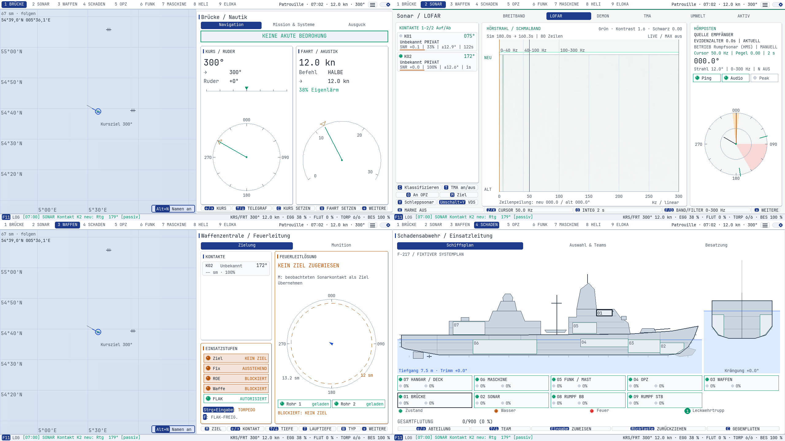

*Fregatten-Stationen auf der uConsole: Brücke, Sonar, Waffen und Schadensabwehr*

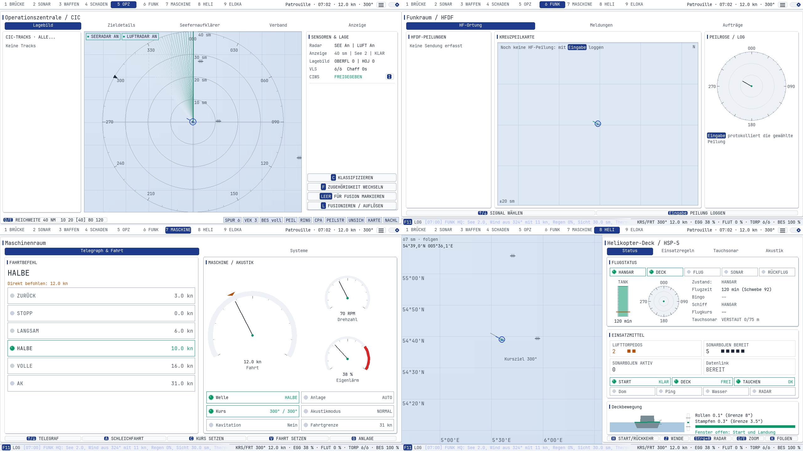

*Fregatten-Stationen auf der uConsole: OPZ, Funk, Antrieb und Heli*

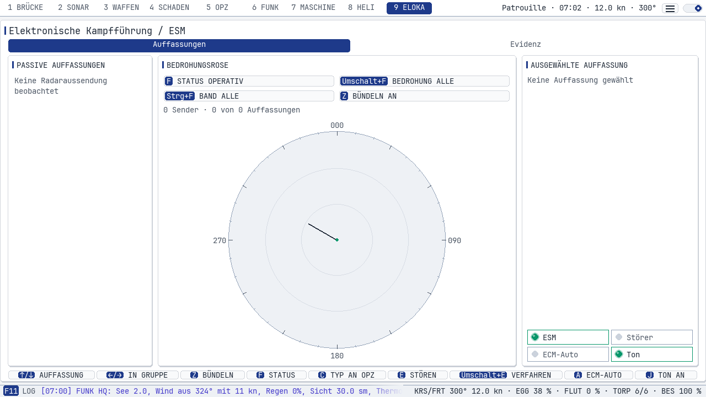

*Fregatten-Station ELOKA auf der uConsole*

```text
 1 Brücke      2 Sonar       3 Waffen
 4 Schaden     5 OPZ         6 Funk
 7 Maschine    8 Helikopter  9 EloKa
```

Jede Station zeigt nur, was ihre Sensoren und Bediener wissen. Sonarkontakte sind verrauschte Peilungen, bis Ping, TMA, Boje oder Kreuzpeilung eine Entfernung liefern. Keine Station zeigt „die Wahrheit".

Das U-Boot hat sieben Stationen auf den Tasten `1`-`7` (siehe Kapitel U-Boot). `F2` übergibt die aktuelle Station an die Autocrew, `F3` zeigt, welche Stationen automatisch laufen (siehe Kapitel Werkzeuge).

### Bedienung in 60 Sekunden

- **Stationen:** `1`-`9` (U-Boot `1`-`7`), `Tab`/`Umschalt+Tab` oder ein Klick auf einen Reiter in der Kopfzeile.
- **Seiten:** die Nummer der Station nochmals drücken, `Bild Auf`/`Bild Ab` oder einen Seitenreiter anklicken.
- **Feuern:** `Strg+Eingabe` feuert Torpedos und Flugkörper. `Eingabe` allein feuert nie.
- **Hilfe:** `F1` (oder `?`) listet alle Tasten der aktuellen Station, ihren Standardablauf und dieses Handbuch. `Esc` bricht eine Eingabe ab oder öffnet den Beenden-Dialog.
- **Trackball:** horizontal steuert er auf der Brücke, vertikal schaltet er sonst die Hauptauswahl der Station.
- **Maus:** Ein Klick auf eine Taste in der Tastenleiste der Station, eine Lampe, einen Hinweis, einen Reiter, eine Scheibe oder eine Listenzeile tut genau das, was seine Taste tut, mit denselben Prüfungen. Das Menü-Symbol in der Kopfzeile öffnet das Spielmenü (Hilfe, Optionen, Speichern, Laden, Beenden). Auf Karten zoomt das Mausrad, Ziehen verschiebt (Einzelheiten im Kapitel Werkzeuge).

Globale Tasten (alle Stationen):

| Taste | Funktion |
|---|---|
| `Tab / Shift+Tab` | Nächste / vorherige Station |
| `1 / 2 / 3 / 4` | Brücke / Sonar / Waffen / Schaden |
| `5 / 6 / 7 / 8` | OPZ / Funk / Maschine / Helikopter |
| `9` | Elektronische Kampfführung / ESM |
| `Nummer der aktiven Station` | Erneut drücken, um die Seite dieser Station weiterzuschalten |
| `Bild Auf / Ab` | Vorige / nächste Seite der Station (jede Station mit mehreren Seiten) |
| `Strg+Eingabe` | Gewählte Waffe abfeuern: die einzige Feuertaste (Eingabe allein feuert nie; an der Waffenstation wählen D, A, Z, R und Umschalt+R nur Lufttorpedo, ASROC, Wasserbomben und Raketen) |
| `Pfeiltasten` | Stationsbezogene Auswahl oder Einstellung |
| `+ / -` | Telegraph (an jeder Station verfügbar) |
| `F1 / ?` | Hilfe (diese Anzeige) |
| `F2` | Autocrew der aktuellen Station umschalten |
| `Shift+F2` | Crew-Hilfe: Die KI besetzt jede freie Station beider Einheiten |
| `F3` | Autocrew-Übersicht öffnen |
| `0` | Wetter- & Sonar-Analyse |
| `F7` | Erster Offizier (optionales Sprachmodell) |
| `F8` | Taktischer Einheitenanalysator (Katalog, nur lesend) |
| `F4` | Simulationsprotokoll-Ansicht (live; benötigt simlog-Option; M: Karte aller Kontakte, F auf der Karte: Einheiten oder ganze Welt einpassen) |
| `F9` | Lokale Commander-LAN-Verwaltung öffnen |
| `F10` | Optionen: Sprache, Vollbild, Audio, großer Text, Tooltips, Bildrate |
| `F11` | Ereignislog und volle Telemetrie einblenden (Station bleibt bedienbar) |
| `N` | Nationen & Einheiten (Sonar und Akustikseite des Helikopters: Notchfilter) |
| `S / L (OPZ: L = Fusion)` | Speichern / Laden (Slots 1-5) |
| `Alt+Enter` | Vollbild (alle Stationen) |
| `Q / E oder Mausrad` | Kartenzoom auf Brücke, Waffen, Helikopter und OPZ-Karte (dort stellen Q/E den Radarbereich) |
| `Drag` | Karte verschieben (Brücke, Waffen, Helikopter und OPZ) |
| `K` | Karte folgt nur auf sichtbaren Karten (Ziehen schaltet es aus) |
| `Linksklick` | Angeklickte Taste, Lampe, Hinweis, Reiter, Scheibe oder Zeile |
| `Rechtsklick` | Abbrechen wie Esc in Menüs und Eingaben |
| `Menü-Symbol (Kopfzeile)` | Spielmenü per Maus: Hilfe, Optionen, Speichern/Laden, Wetter, Plot, Autocrew, Beenden und mehr; jedes Overlay schließt mit seinem Schließfeld (wie Esc) |
| `P` | Plotmodus auf Brücken-/Waffen-/Helo-Karte und OPZ-Karte: Marken, Lineal, Peillinien, Kreise, Koppellinien (für alle Stationen, wird gespeichert) |
| `M R B C D · Eingabe · Rück` | Im Plotmodus: Werkzeug wählen, Punkt mit Eingabe oder Klick setzen (Pfeile bewegen den Cursor, Umschalt schneller), nächstes Objekt löschen (Umschalt: alle) |
| `Esc` | Eingabe abbrechen oder Beenden-Dialog öffnen |
| `R / M` | Nach Missionsende: Neustart mit gleichem Seed / Hauptmenü |
| `D` | Nach Missionsende: Nachbesprechung mit der Wahrheit neben dem Wissen der Crew (Leertaste spielt ab, Tab 10×/60×, Pos1/Ende Anfang/Ende, B Bericht des Sprachmodells, wenn eingeschaltet) |
| `N` | Nach einer abgeschlossenen Lektion: die nächste Lektion starten |

### Die erste Patrouille (Fregatte)

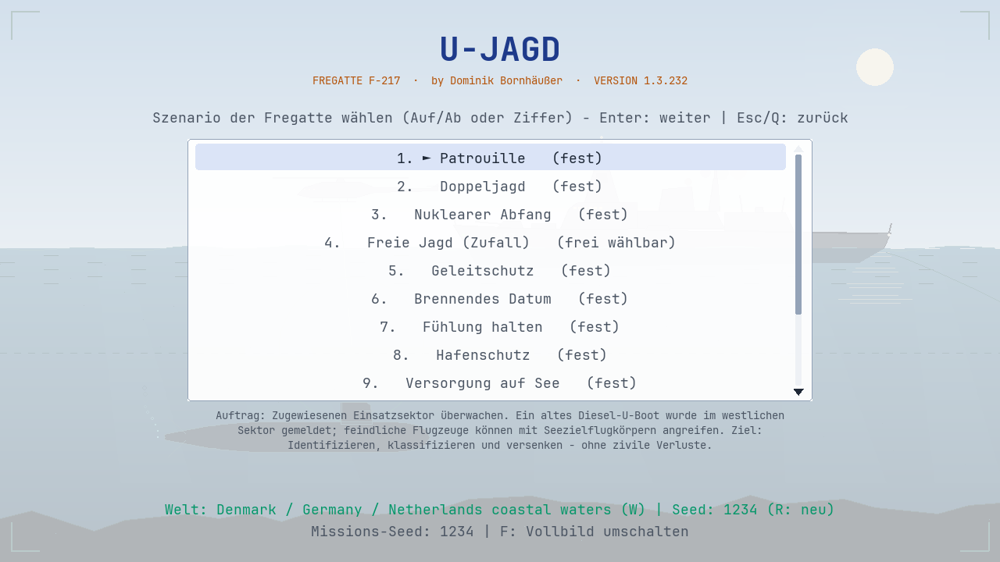

*Szenarioauswahl, nach Seite sortiert*

1. Hauptmenü: **Neuer Einsatz** mit den Pfeiltasten und `Eingabe` wählen, die Fregatte mit `1` und `Eingabe`, dann Szenario 1 (Patrouille) mit `1` und `Eingabe`; die Einweisung zeigt Wetter und Tageszeit, `Eingabe` startet.
2. Brücke (`1`): nochmals `1` für die Missionsseite, Auftrag und Zeitlimit lesen.
3. Maschine (`7`): SLOW oder 6-8 kn wählen. Sonar (`2`): Schleppsonar mit `Y` ausbringen.
4. Sonar-Seite BROADBAND: nach einer hellen senkrechten Spur suchen; mit den Pfeiltasten wählen und mit `Eingabe` verfolgen.
5. Mit `C` klassifizieren, mit `T` TMA einschalten, dann auf der Brücke 30-60 Grad drehen und den neuen Schlag einige Minuten halten.
6. Sobald TMA oder Ping eine Entfernung liefern: Kontakt an die OPZ freigeben (`G`) und als Ziel setzen (`M`).
7. Waffen (`3`): Torpedotiefe auf die gepingte Zieltiefe stellen, mit `Strg+Eingabe` feuern.
8. Sonar auf anlaufende Torpedos beobachten; kommt einer, mit 24 kn laufen (nicht FLANK: das Schleppkabel des Nixie reißt über 25 kn), abdrehen und Nixie ausbringen (`V` in der Waffenzentrale).

### Die erste Tauchfahrt (U-Boot)

Am schnellsten kommen Sie mit Lektion 8 der Ausbildung ins U-Boot: Hauptmenü **Ausbildung**, Lektion 8 (Horchen und unter die Schicht) mit `8` oder den Pfeiltasten, `Eingabe`. Die uConsole spielt für diese Lektion das U-Boot, und ein Hinweisbanner wartet auf jeden Schritt:

1. Sonarraum (`2`): warten, bis die Fregatte in der Kontaktliste erscheint.
2. Den Kontakt mit `Auf`/`Ab` wählen und `C` drücken, bis er Kampfschiff heißt.
3. Die Schicht mit dem Bathythermografen messen (`E`).
4. Führung (`1`), dann `J`: Das U-Boot taucht unter die gemessene Schicht, wo das Bugsonar der Fregatte es schlecht hört.

Lektion 9 übt das Ausweichen vor einer pingenden Fregatte (`I` auf der Seite Bedrohung). Danach starten Sie **Neuer Einsatz**, das U-Boot mit `2` und `Eingabe`, dann Szenario 1 (Durchbruch) mit `1` und `Eingabe`: Erreichen Sie das auf der Karte mit ZIEL markierte Zielgebiet. Fahren Sie langsam (`-` am Telegrafen oder `A` für Schleichfahrt), bleiben Sie unter der Schicht, halten Sie den Mast nahe der Fregatte unten und weichen Sie mit `I` aus, wenn ein Ping- oder Torpedoalarm kommt.

### Unterwasserakustik in fünf Minuten

- **Passives Sonar liefert nur Peilung.** Jeder Kontakt beginnt als Peillinie. Entfernung liefern aktiver Ping, TMA, Sonarbojen oder Kreuzpeilung.
- **Ortung heißt Signal gegen Rauschen.** Es entscheidet die passive Sonargleichung SE = SL - TL - NL + DI - DT: Quellpegel des Ziels (lauter = weiter), Übertragungsverlust (Ausbreitung, Absorption, Schicht- und Pfadverluste), Rauschen (eigenes Rauschen plus Wind, Regen und Schiffsverkehr in der Nähe) und Gewinn der Antenne. Ab SE >= 0 dB gilt ein Kontakt als geortet. Wind und Regen wirken am stärksten, wenn Sie langsam und leise fahren; bei hoher Eigenfahrt dominiert das eigene Rauschen.
- **Eigene Fahrt ist eigener Lärm.** Der Eigenlärm steigt von 4 kn bis 31 kn, der Höchstfahrt der Fregatte. Ab 15 kn kavitieren die Schrauben, die Passivreichweite fällt auf etwa ein Drittel.
- **Die Sprungschicht (Thermokline) beugt den Schall.** Die passive Ausbreitung wird als Strahlverfolgung durch das echte Schallgeschwindigkeitsprofil gerechnet: über der Schicht trägt ein Oberflächenkanal den Schall weit, darunter liegt eine einige Meilen breite Schattenzone. In tiefem Wasser ist der Schatten stark; in einigen hundert Metern Wassertiefe füllen Bodenreflexionen und Mehrwege ihn ab etwa 10 sm auf, das Verstecken unter der Schicht wirkt dort vor allem auf kurze Distanz. Ein Ping in die Schattenzone erreicht nur 35 % seiner Reichweite.
- **Meeresboden und Oberfläche zählen.** Fels und Kies reflektieren gut, Schluff und Schlick schlucken; rauer Seegang streut hohe Frequenzen. **Konvergenzzonen** entstehen nur dort, wo das Wasser tief genug ist, damit die Strahlen wieder nach oben umkehren.
- **Baffles:** Eigenlärm ist eine weiche 70-Grad-Keule achteraus der Bugsonaranlage (beim Schleppsonar entlang des Kabels). Sie überdeckt, sie blendet nicht vollständig aus.

```text
            Oberfläche
  ~~~~~~~~~~~~~~~~~~~~~~~~~~~~~~~~~~~~~~~~
    Fregatte HMS )))            direkter Pfad
  ---------- Sprungschicht ----------------  -6,5 dB quer
       TAS unter Schicht )))   U-Boot
                                (Schattenzone für flachen Sensor)
  ________________________________________ Meeresboden
```

### Navigationskonventionen

- Entfernungen in Seemeilen (sm), Fahrt in Knoten (kn), Tiefe in Metern, Frequenz in Hz.
- Kurse und Peilungen sind rechtweisende Grad: 000 Nord, im Uhrzeigersinn. Karten sind genordet.
- Das Schiff dreht umso schneller, je schneller es fährt (etwa 0,75 Grad pro Sekunde bei 10 kn, 1,2 bei 16 kn), und gestoppt dreht es nicht; Fahrtänderungen dauern Minuten. Manöver früh planen.

## Hauptmenü und Spielstart

Nach dem Startbildschirm öffnet das Hauptmenü. `Auf`/`Ab` (oder die Maus) wählen einen Eintrag, `Eingabe` öffnet ihn, `Esc` fragt, ob das Spiel beendet werden soll. Jede Seite, die von dort aus erreicht wird, führt mit `Esc` zurück.

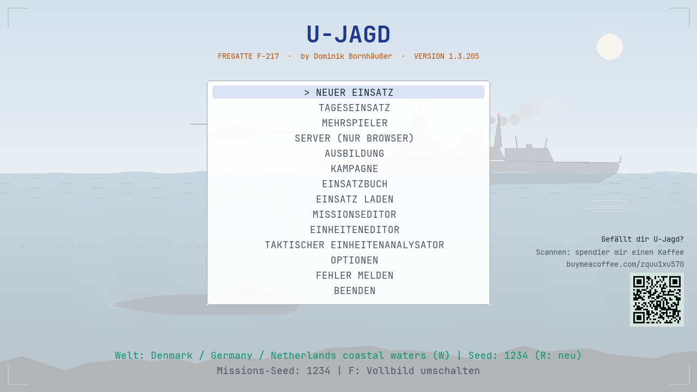

*Hauptmenü*

### Einträge des Hauptmenüs

| Eintrag | Was er tut |
|---|---|
| Einsatz fortsetzen | Setzt den automatisch gesicherten Einsatz fort; nur vorhanden, solange es eine automatische Sicherung gibt |
| Neuer Einsatz | Seite, Szenario, Einweisung (unten) |
| Ausbildung | Neun geführte Lektionen (unten) |
| Tageseinsatz | Ein fester Kurzeinsatz je Seite und Tag |
| Mehrspieler | Die Lobby mit Remote Crew (Kapitel Remote Crew) |
| Server (nur Browser) | Die uConsole stellt nur bereit; alle spielen im Browser |
| Kampagne | Feldzug für jede Seite (Kapitel Szenarien und Missionen) |
| Einsatzbuch | Dienstbuch und Auszeichnungen (Kapitel Nach dem Einsatz) |
| Einsatz laden | Lädt Platz 1-5 |
| Missionseditor | Eigene Missionen (Kapitel Missions- und Einheiteneditor) |
| Einheiteneditor | Eigene Einheitenprofile (Kapitel Missions- und Einheiteneditor) |
| Taktischer Einheitenanalysator | Nur lesender Katalog aller Einheiten (Kapitel Missions- und Einheiteneditor) |
| Optionen | Einstellungen (Kapitel Optionen) |
| Fehler melden | Fehlerbericht mit QR-Code (unten) |
| Beenden | Beendet das Spiel |

### Erster Start

Gibt es noch keine `~/.u-jagd/settings.json`, folgt auf den Startbildschirm eine Willkommensseite: „Was möchtest du spielen?“ `1` Fregatte (das Ausbildungsmenü mit Lektion 1 vorgewählt), `2` U-Boot (das Ausbildungsmenü mit Lektion 8, der ersten U-Boot-Lektion, vorgewählt), `3` Remote Crew (öffnet die Mehrspieler-Lobby; `Esc` dort führt ins Hauptmenü), `4` oder `Esc` Hauptmenü. Pfeiltasten und `Eingabe` wählen ebenfalls. Was Sie auch wählen, die Seite wird in den Einstellungen vermerkt und nicht wieder gezeigt.

### Neuer Einsatz: Seite und Szenario

Ein neues Spiel fragt zuerst nach der Seite (`1` Fregatte, `2` U-Boot) und listet dann nur deren Szenarien: jede Seite zählt ab `1`: `1`-`9` und `0` (das zehnte; das elfte und zwölfte mit den Pfeiltasten) auf jeder Seite (Fregatte 4 = Zufall mit eigener Schwierigkeit) (siehe Kapitel Szenarien und Missionen), `Esc` zurück zur Seitenwahl; `W` Weltmodus, `R` neuer Seed, `F` Vollbild (diese drei nur im Hauptmenü und auf den Szenarioseiten: Liste, Schwierigkeit, Einsatzbesprechung), `Eingabe` Start.

Die Liste zeigt neun Zeilen auf einmal und rollt mit der Auswahl (`Auf`/`Ab`, Mausrad, `Bild auf`/`Bild ab` eine Seite, `Pos1`/`Ende` erste und letzte Zeile; bei festem realem Sektor wählen `[`/`]` den Sektor); ein Balken am rechten Rand zeigt die Lage in der Liste, darunter steht der Anfang der Einsatzbesprechung des gewählten Szenarios. Die eigenen Missionen und die Schwierigkeitsliste der freien Jagd rollen genauso.

**Eigene Missionen:** Das Startmenü zeigt nach den Szenarien der gewählten Seite die Zeile „Eigene Missionen“ (`O` oder `Eingabe` auf der Zeile). Sie öffnet die Missionen des Missionseditors für diese Seite; `Eingabe` startet eine. Die Mehrspieler-Lobby bietet sie in ihrer Missionszeile nach den Szenarien an, der Solo-Browser im Dialog „Neues Spiel“ und unter „Eigene Missionen“ in der Gastgeberleiste (siehe Kapitel Missions- und Einheiteneditor).

### Einweisung: Wetter, Uhrzeit und Länge

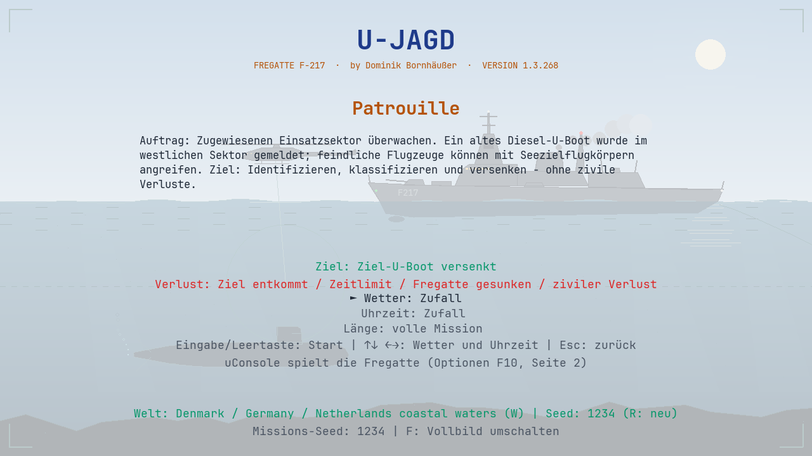

*Einsatzbesprechung vor dem Start: Auftrag, Seegebiet, Kräfte und Siegbedingungen*

**Wetter und Uhrzeit:** Das Briefing jedes Szenarios (bei 4 nach der Schwierigkeit), die Einsatzbesprechung eines Brennpunkts der Kampagne, die Mehrspieler-Lobby und der Dialog „Neues Spiel“ im Browser wählen das Wetter (Zufall, schön, Regen, Sturm, Nebel) und die Uhrzeit (Zufall, Morgengrauen 06:00, Tag 12:00, Abenddämmerung 19:00, Nacht 01:00): `Auf`/`Ab` wählt die Zeile, `Links`/`Rechts` ändert sie. Zufall behält, was der Seed ergibt.

Ein gewähltes Wetter hält die ganze Mission (Seegang schön und Nebel 1, Regen 3, Sturm 5; die See ändert sich nur innerhalb von 0-2, 2-4 und 5-6; ein Sturm bringt Gewitter mit Blitz, Donner und Sferics), und Wetterfronten ziehen dann keine durch; die Uhr läuft von der gewählten Zeit weiter. Die Wahl gilt bis zum Beenden des Spiels für jede neue Mission, auch für `R` am Missionsende; sie wird mit der Mission gespeichert, nicht in den Einstellungen.

**Kurzeinsatz:** An denselben Stellen gibt es eine dritte Zeile, die Länge: volle Mission oder Kurzeinsatz (nicht bei Szenario 4, dessen Zeitlimit eine eigene Einstellung ist). Die dort (Startmenü, Lobby oder Browser) zuletzt gewählte Länge bleibt in den Einstellungen für den nächsten Start; wer noch keine Einstellungen hat, beginnt mit Kurzeinsätzen.

Ein Kurzeinsatz behält sein Ziel, hat aber ein kürzeres Zeitlimit und beginnt näher am Geschehen: Patrouille 30 min, Doppeljagd 60 min, Nuklearer Abfang 45 min, Durchbruch 60 min, Jagdgruppe 60 min, Aufklärung 45 min, Geleitzug 35 min, Meerengen-Sperre 45 min, Kampfschwimmer 45 min, Versorgerschutz 45 min, Geleitschutz 35 min, Angeschlagen heim 60 min, jedes andere neue Szenario 45 min. Das erste feindliche U-Boot beginnt 5-8 sm von der Fregatte (Durchbruch und Jagdgruppe 4-6 sm, Aufklärung 10-16 sm) und jedes weitere 8-14 sm; in einer U-Boot-Mission rücken auch das Ziel hinter der Fregatte, Ein- und Ausfahrt der Meerenge, der Anmarsch der Kampfschwimmer und der Platz vor dem Bug des Geleitzugs oder Versorgers näher.

Jeder Kurzeinsatz wurde mit KI-gegen-KI-Partien so eingestellt, dass beide Seiten etwa gleich oft gewinnen. Sein Name trägt „(Kurzeinsatz)“, und er wird wie jede Mission gespeichert.

### Ausbildung

**Ausbildung** bietet neun geführte Lektionen. Jede ist eine kurze Mission mit einem Hinweisbanner, das auf Sie wartet; `Auf`/`Ab` oder `1`-`9` wählen, `Eingabe` startet. Eine einmal abgeschlossene Lektion trägt einen Haken (✓), die erste noch offene ist mit „als Nächstes“ markiert und beim Öffnen der Seite vorgewählt; eine Zeile unter der Liste zählt die erledigten Lektionen. Die Haken stehen in den Einstellungen, nicht in einem Spielstand.

| Lektion | Seite | Was Sie üben |
|---|---|---|
| 1 Hören und peilen | Fregatte | Ein U-Boot im Sonar finden, verfolgen und klassifizieren |
| 2 Zielbewegungsanalyse (TMA) | Fregatte | TMA einschalten, einen zweiten Schlag fahren und eine Entfernung erhalten |
| 3 Torpedoangriff | Fregatte | Ein feindliches U-Boot orten, klassifizieren, zuweisen und versenken |
| 4 Hubschrauber und Sonarbojen | Fregatte | Den Hubschrauber starten, eine Boje werfen und das U-Boot darauf hören |
| 5 Luftabwehr: Flugkörper im Anflug | Fregatte | Den Seezielflugkörper aus Nordost in der OPZ finden und mit einem ESSM abschießen; nach einem Fehlschuss oder Treffer kommt 30 s später ein weiterer |
| 6 ESM: ein Radar hören | Fregatte | Das Radar eines Frachters in der ELOKA hören, mit `C` den Radartyp zuordnen und die freigegebene Peilung in der OPZ sehen |
| 7 Torpedoabwehr mit dem Nixie | Fregatte | Ein Torpedo läuft aus 3,6 sm auf das Schiff zu: Nixie ausbringen (`V`), mit HALBE oder VOLLE laufen und Kurs halten, bis er ausgelaufen ist oder den Täuschkörper trifft |
| 8 Horchen und unter die Schicht | U-Boot | Die Fregatte hören, als Kampfschiff klassifizieren, die Schicht per BT messen und darunter tauchen |
| 9 Eine jagende Fregatte abschütteln | U-Boot | Seite Bedrohung lesen, mit `I` ausweichen, leise und tiefer als 100 m gehen, bis zwei Minuten lang kein Ping mehr kommt |

Für die Lektionen 8 und 9 spielt die uConsole das U-Boot. In Lektion 9 pingt die Fregatte alle 45 s, bis Sie ausweichen, danach nur, solange ihre Pings Sie noch finden, und sie schießt nie.

In den Lektionen 1, 2 und 4 ist das U-Boot neutral und greift nie an; Lektion 3 ist ein echter Angriff, der mit dem Versenken endet; die Lektionen 5 bis 7 haben kein U-Boot. In Lektion 7 ist der Torpedo echt: bei LANGSAM oder AK oder ohne Nixie findet er das Schiff trotzdem, und ein Treffer beendet die Lektion als verloren. Die übrigen Lektionen enden nach dem letzten Schritt als Sieg. `R` am Ende startet die Lektion neu, `N` nach einer abgeschlossenen Lektion die nächste. Eine gespeicherte Lektion beginnt ihre Hinweise nach dem Laden wieder bei Schritt 1 und überspringt bereits erledigte Schritte. Nach einer Lektion behält die uConsole die gespielte Seite.

### Tageseinsatz

- *Tageseinsatz* im Hauptmenü bietet je Seite und Tag einen festen Einsatz, für alle Spieler gleich: Das Datum wählt Szenario und Seed und damit das echte Seegebiet, Wetter und Tageszeit. Es ist immer der Kurzeinsatz eines Szenarios, das einen hat (die Seite nennt seine Minuten), passend für eine Pause.
- Die Seite zeigt den heutigen Bestwert jeder Seite; ein beendeter Tageseinsatz (auch nach Mitternacht, für den von gestern) hält den besten Sieg 30 Tage im Einsatzbuch; nur der kurze Tageseinsatz zählt. Die Realismusstufe ist die eigene Einstellung.

### Speichern, Laden und automatische Sicherung

`S` speichert, `L` lädt (Plätze 1-5). Spielstände sind exakt und deterministisch: ein geladenes Spiel läuft identisch weiter. Die Datei wird im Hintergrund geschrieben, während die Mission weiterläuft; das Speichermenü schließt sich (oder das Spiel endet nach **Speichern und beenden**) erst, wenn sie sicher auf dem Datenträger liegt. Ein Spielstand einer älteren Version (Spielstandformat v38, Version 1.3.98, oder neuer) lädt weiterhin: Er wird beim Laden auf das aktuelle Format gebracht, Plätze und automatische Sicherung gleichermaßen.

**Autosave:** Eine laufende Mission wird alle 5 Minuten und beim Beenden oder Verlassen ins Hauptmenü nach `~/.u-jagd/autosave.json` gespeichert, neben den fünf Plätzen. Das Hauptmenü beginnt dann mit **Einsatz fortsetzen**, das sie exakt weiterführt; nach einem Absturz ist es der letzte Wiederherstellungspunkt, höchstens eine Minute alt. Eine beendete Mission (Sieg, Niederlage oder Schiff gesunken) und jede neue Mission löschen den Autosave. Der Web-Host (`--web-host`) speichert nicht automatisch.

**Fehlerschutz:** Eine Stationsanzeige, die sich nicht zeichnen lässt, zeigt „Anzeige gestört“, während die Mission weiterläuft; ein Fehler in der Simulation setzt die Mission auf ihren Wiederherstellungspunkt von höchstens einer Minute vorher zurück (eine Kopie im Speicher, die nie einzeln geschrieben wird) und meldet das im Ereignisprotokoll. Browser der Remote Crew bekommen ihre Stationen wie nach dem Laden zurück. Nach wiederholten Fehlern wird die Mission gesichert und das Hauptmenü öffnet mit **Einsatz fortsetzen**. Jeder abgefangene Fehler landet in `~/.u-jagd/crash.log` für einen Fehlerbericht.

### Update-Hinweis

Neue Versionen werden nie von selbst installiert. Beim Start fragt das Spiel einmal bei GitHub, ob es ein neueres Release gibt; dann zeigen der Startbildschirm (oben rechts) und das Hauptmenü (links neben den Einträgen) dessen Version, den Eintrag aus dem Änderungsprotokoll in der Spielsprache und nur dann eine Warnung, wenn Spielstände dieser Version (auch die automatische Sicherung) zu alt sind, als dass das neue Release sie auf den aktuellen Stand bringen könnte.

`U` oder ein Klick auf **Jetzt updaten** installiert es: Auf der uConsole schließt das Spiel, das kleine Fenster des Starters zeigt Download und Prüfung, und die neue Version startet; das Windows-Programm lädt die neue Datei im Hintergrund (Fortschritt auf dem Knopf), prüft Größe und SHA-256-Prüfsumme, schließt sich, ersetzt sich selbst und startet die neue Version; die macOS-App macht dasselbe mit ihrem Zip (nur Apple Silicon; ein Intel-Mac öffnet die Release-Seite): Sie entpackt die neue `U-Jagd.app` neben sich, schließt sich, tauscht das Bundle aus (das alte wird erst gelöscht, wenn das neue an seinem Platz ist) und öffnet die neue Version, sofern sie in ihren Ordner schreiben darf (sonst öffnet sie die Release-Seite); jede andere Installation öffnet die Release-Seite.

Schlägt die Prüfung fehl, steht an derselben Stelle, dass und warum (keine Verbindung zu GitHub, die Verbindung ließ sich per Zertifikat nicht prüfen oder ein Fehler von GitHub), und `U` oder ein Klick prüft erneut; mit `U_JAGD_NO_UPDATE=1` wird nichts geprüft.

### Fehler melden

**Fehler melden** im Hauptmenü schreibt `~/.u-jagd/bug-report.txt` (Version, Plattform und die neuesten Zeilen aus `~/.u-jagd/crash.log`, Ihr Benutzername aus Pfaden entfernt) und zeigt einen QR-Code, der am Handy ein neues GitHub-Issue mit Version und Plattform öffnet; dort die Datei anhängen. `Eingabe` öffnet das Issue mit Log in einem Browser, falls das Gerät einen hat, `Esc` geht zurück. Nach einem abgestürzten Start wählt das Hauptmenü diesen Eintrag vor und weist darauf hin. Gesendet wird erst, wenn Sie das Issue mit Ihrem eigenen GitHub-Konto abschicken. Das Einstellungsmenü im Browser hat denselben Link.

### Spielstart

Auf einem Windows-PC startet das Programm `U-Jagd-Windows.exe` mit denselben Kommandozeilenoptionen direkt ins Spiel; ein eigenes Starterfenster gibt es nicht (auf einem Mac arbeitet die App `U-Jagd.app` genauso), und **Mehrspieler** im Hauptmenü (oder `--multiplayer`, unten) öffnet die Lobby mit eingeschalteter Remote Crew.

Kommandozeilenoptionen beim Start (gleich für das Windows-Programm und die macOS-App):

- `--windowed` und `--no-audio` übersteuern die gespeicherte Vollbild- und Audio-Einstellung für einen Start.
- `--multiplayer` öffnet die Mehrspieler-Lobby direkt nach dem Startbildschirm.
- `--server` startet den Servermodus nur für Browser (Kapitel Remote Crew).
- `--solo-crew` startet Remote Crew im Solo-Modus: Ein Browser bedient alle Stationen (Kapitel Remote Crew).
- Eine Zahl als einziges Argument setzt den Seed der Welt.

### Menütasten

Menütasten (Hauptmenü und seine Seiten; `F1` in einem Menü zeigt sie):

| Taste | Funktion |
|---|---|
| `Auf / Ab` | Zeile wählen |
| `Eingabe` | Gewählte Zeile öffnen oder starten |
| `Esc / Q` | Zurück (Hauptmenü: Beenden-Dialog) |
| `Bild Auf / Ab` | Listen: eine Seite auf / ab |
| `Home / End` | Listen: erste / letzte Zeile |
| `W` | Hauptmenü und Szenarioseiten: Weltmodus (erzeugt / feste Karte / fester realer Sektor) |
| `R` | Hauptmenü und Szenarioseiten: neuer Seed |
| `[ / ]` | Hauptmenü und Szenarioseiten, fester realer Sektor: voriger / nächster Sektor |
| `F` | Hauptmenü und Szenarioseiten: Vollbild / Fenster |
| `← / → / Tab` | Einsatzbuch: Fregatte / U-Boot |
| `A` | Einsatzbuch: Auswertung des Sprachmodells (wenn eingeschaltet) |
| `B` | Einsatzbuch: der neueste Einsatzbericht |
| `L` | Einsatzbuch: Gegner lernt deine Gewohnheiten an/aus |
| `Enter / Esc` | Einsatzbuch: zurück ins Hauptmenü (Esc schließt erst eine offene Auswertung oder einen Bericht) |
| `F1 / F9` | Hilfe / Remote-Crew-Verwaltung |

## Optionen

`F10` (oder **Optionen** im Hauptmenü oder im Spielmenü) öffnet die Optionen. `Auf`/`Ab` wählen eine Zeile, `Eingabe`/`Links`/`Rechts` ändern sie, `Bild Auf`/`Bild Ab` oder `Tab` wechseln zwischen den beiden Seiten und `Esc` führt zurück. Die Einstellungen liegen in `~/.u-jagd/settings.json`; eine laufende Mission läuft hinter den Optionen weiter.

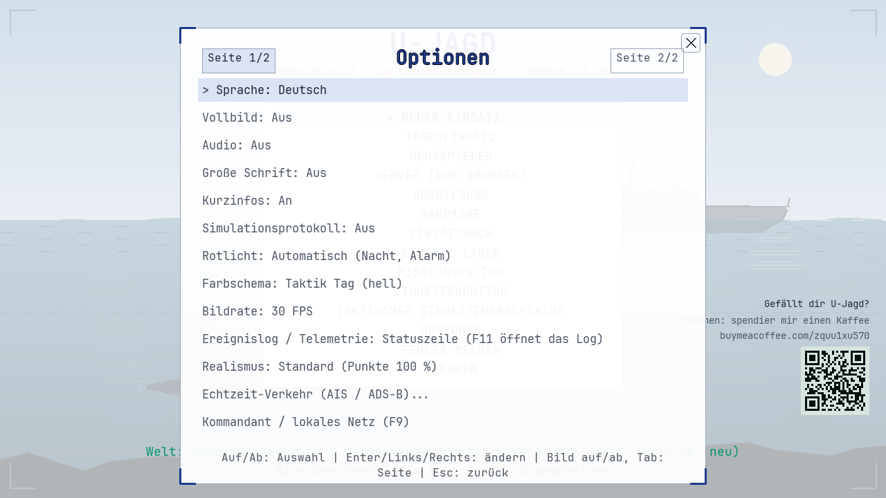

*Optionen (F10)*

### Seite 1: Bild, Ton und Realismus

| Zeile | Auswahl |
|---|---|
| Sprache | Englisch, Deutsch |
| Vollbild | an, aus (auch `Alt+Eingabe`) |
| Audio | an, aus |
| Große Schrift | an, aus |
| Kurzinfos | an, aus: Erklärungen unter der Maus; ein Klick heftet eine an |
| Simulationsprotokoll | an, aus: schaltet die Ansicht `F4` frei (Kapitel Werkzeuge) |
| Rotlicht | Automatisch (Nacht, Alarm), Immer an, Aus |
| Farbschema | Taktik Nacht, Taktik Tag, Hoher Kontrast / farbenblind |
| Bildrate | 30 FPS (voreingestellt, spart Rechenleistung auf der uConsole) oder 60 FPS |
| Ereignislog / Telemetrie | Statuszeile (voreingestellt, mehr Platz für die Station; `F11` öffnet das Log) oder feste Leiste |
| Realismus | Einsteiger, Standard, Realistisch (unten) |
| Echtzeit-Verkehr | öffnet die Seite AIS / ADS-B (unten) |
| Commander / lokales Netz (F9) | öffnet die Remote-Crew-Seite (Kapitel Remote Crew) |

- **Rotlicht:** **Automatisch** (Standard) schaltet die Bildschirme nachts und bei Torpedo-, Flugkörper- oder Feueralarm auf gedimmtes Rot, **Immer an** oder **Aus**. Der Browser hat denselben Schalter in seinen Einstellungen. Die Stationsreiter zeigen eine Alarmlampe: gelb stetig für eine Warnung (Wassereinbruch, ein Ping, eine beschädigte Maschine), rot blinkend für Gefahr (Torpedo, Flugkörper, Feuer).
- **Farbschema:** **Taktik Nacht** (Standard: dunkle Flächen, Phosphorgrün, Bernstein und Rot), **Taktik Tag** (helle, entspiegelte Grautöne mit Marineblau und dunkler Schrift für Tageslicht; Wasserfall, LOFAR und DEMON zeichnen dann dunkle Spuren auf hellem Grund wie ein Schreiber) oder **Hoher Kontrast** (farbenblindfreundlich). Der Schalter rechts in der Kopfleiste wechselt per Klick zwischen Dunkel und Hell, an beiden Seiten. Leuchtet das Rotlicht, zeichnet die uConsole dunkel. Die Wahl liegt in `settings.json`, nie im Spielstand, und ändert nur das Bild. Der Browser hat einen eigenen Schalter.

#### Realismusstufe

Die Realismusstufe gilt für die nächste Mission:

- **Einsteiger:** Bedienerassistenz an (automatische Linienbeschriftung, Blattfrequenz- und Katalog- oder Senderkandidaten); der Computergegner greift zögerlicher an, wartet auf eine bessere Schusslösung und klassifiziert und startet als Fregatte seinen Hubschrauber 1,5-mal langsamer. Punkte 75 %.
- **Standard** (voreingestellt): Rohdaten und manuelle Analyse, der kalibrierte Gegner. Punkte 100 %.
- **Realistisch:** keine Assistenz; der Gegner greift entschlossener an, schießt auf eine gröbere Lösung und reagiert als Fregatte 30 % schneller. Punkte 125 %.

Die Stufe stimmt nur den Computergegner ab, nie einen Menschen auf der anderen Seite, und eine laufende Mission behält die Stufe, mit der sie begann (die Zeile sagt dann "ab der nächsten Mission"). Das Endpanel zeigt die Stufe mit ihrem Punktefaktor; Spielstände behalten sie.

#### Echtzeit-Verkehr

Die Seite **Echtzeit-Verkehr** holt echte Schiffe (AIS Stream, braucht einen eigenen API-Schlüssel) und echte Flugzeuge (OpenSky ADS-B, wahlweise mit eigener OpenSky-Client-ID) in eine Mission, deren Welt ein reales Seegebiet ist. Sie braucht eine Internetverbindung; ohne sie sind die Zeilen ausgegraut. **API-Test** prüft beide Dienste. Platziert wird nur Verkehr bis etwa 150 sm um die Fregatte (höchstens 15 Schiffe und 5 Flugzeuge, zufällig gewählt; ein gewählter Kontakt bleibt, bis es das Gebiet verlässt), und Schiffspositionen werden alle 2 bis 5 Minuten nachgeführt. Änderungen gelten sofort und werden gespeichert.

### Seite 2: Spielaufbau

**uConsole spielt:** welche Seite der uConsole spielt, Fregatte (Standard) oder feindliches U-Boot; nur im Hauptmenü, nie gespeichert. Ein neues Spiel fragt ohnehin zuerst danach. Siehe Kapitel U-Boot.

**Grafikstufe** (`Eingabe`/`Rechts` weiter, `Links` zurück): **Sparsam** skaliert mit einfachen Pixeln, lässt das Radar-Nachleuchten weg und beruhigt den Menühintergrund, um auf der uConsole Rechenzeit zu sparen; **Normal** (Standard der uConsole) zeigt alle Effekte; **Voll** (Standard unter Windows) glättet zusätzlich Peilstriche, Küste und Plot. In einem Fenster oder Vollbild größer als 1280 x 720 skalieren Normal und Voll das Bild scharf: ganzzahlige Faktoren wiederholen Pixel exakt, andere Größen (etwa 1920 x 1080) wiederholen Pixel bis zum nächsten ganzen Faktor und glätten dann herunter, sodass Schrift und dünne Linien gleichmäßig bleiben. Die Stufe ändert nur das Bild, nie die Simulation oder was eine Station anzeigt.

**Automatisch sparsam** (`+ auto Sparsam` hinter Normal oder Voll, der Standard): Bleibt das Bild 5 Sekunden lang unter 14 Bildern pro Sekunde, zeichnet das Spiel von selbst mit Sparsam und zeigt in der oberen Leiste eine gelbe **ECO**-Lampe; der Hinweis über ihr sagt, warum und wie man es abschaltet. Eine erneut gewählte Grafikstufe beendet es; eine Stufe ohne `+ auto` schaltet das automatische Sparen ab. Es beobachtet nur das Bild und ändert nie die Simulation.

Die **gesprochenen Crew-Meldungen** (standardmäßig aus): die Crew meldet Torpedo im Wasser, neuen Kontakt mit Peilung, Sinkgeräusche, Torpedo los, Treffer, Gefechtsstationen, Seefernaufklärer auf Station und das Missionsende laut, Peilungen Ziffer für Ziffer. Die uConsole spricht über ein installiertes `espeak-ng` (`sudo apt install espeak-ng`) und bleibt ohne es stumm, oder mit natürlicher Stimme, wenn der Sprachdienst des Sprachmodells eingerichtet ist (Kapitel Sprachmodell, Stimme); Remote-Crew-Browser haben einen eigenen Schalter unter Einstellungen (Sprachausgabe des Browsers, in dessen Sprache). Spielt die uConsole das U-Boot, meldet stattdessen dessen Crew (siehe Kapitel U-Boot).

**Mikrofon** (aus als Vorgabe) lässt die Stimmen der Spieler für die Geräuschdisziplin zählen (unten). **Sprachmodell** öffnet die Einstellungen des optionalen Sprachmodells (Kapitel Sprachmodell).

### Geräuschdisziplin und Mikrofon

- Ab und zu lässt eine Besatzung ein Werkzeug fallen, schlägt ein Schott zu, stößt an einen Topf oder lässt eine Kette rasseln: ein kurzer metallischer Schlag für 3 s, der das eigene Geräusch erhöht. Eine frische Besatzung patzt etwa zweimal in der Stunde, eine müde oder entmutigte bis fünfmal so oft. Schleichfahrt (der Leisemodus der Fregatte, die Schleichfahrt des U-Boots oder das Liegen auf Grund) senkt das auf 30 %, dafür gehen Reparaturen und Nachladen dann nur mit 75 % voran.
- Bis 4 sm hört der Gegner einen solchen Schlag in seiner Peilung (durch das eigene Maschinengeräusch weniger): Das Sonar der Fregatte meldet einen metallischen Transienten, der Horchraum des U-Boots einen Transienten. Die eigene Besatzung meldet ihr Missgeschick unter Schleichfahrt.

**Mikrofon:** Auch die Stimmen der Spieler zählen. Auf der uConsole ist es die Option *Mikrofon* (aus als Vorgabe); im Browser der Knopf *Mikrofon an* neben dem Ton-Knopf (fragt nach dem Mikrofon). Browser geben das Mikrofon nur einer sicheren Seite: Auf der normalen LAN-Seite (`http://`) sagt das ein Hinweis, und *HTTPS-Seite öffnen* gibt Ihre Stationen frei und öffnet die HTTPS-Adresse des Hosts (Port + 1), wo Sie die Zertifikatswarnung einmal bestätigen und sich mit demselben Code neu koppeln.

Geht das Mikrofon nicht, sagt das Spiel warum: eine Meldung im Einsatz und die Ursache auf Seite 2 der Optionen (kein Mikrofon, lässt sich nicht öffnen oder kein Ton, weil Windows oder macOS den Zugriff sperrt; dort den Mikrofonzugriff für Desktop-Apps oder für U-Jagd erlauben). Ein abgelehntes, fehlendes oder belegtes Mikrofon nennt der Browser im selben Hinweis.

Eine Anzeige aus 20 Feldern zeigt den eigenen Pegel gegen die Schwellen: bis 5 leise (grün, ungehört), 6 bis 11 in der Nähe hörbar (gelb), ab 12 weit hörbar (rot, bei voller Lautstärke bis 2,5 sm). Auf der uConsole steht die Anzeige rechts neben der Statuszeile hinter einem Mikrofonzeichen; unbeleuchtete Felder sind abgedunkelt. Das Feld mit der kleinen Marke darunter ist die lauteste Stimme der Besatzung. Eine Stimme über der Schwelle erhöht das eigene Geräusch um bis zu 20 %; der Gegner hört Stimmen, und die eigene Besatzung wird zur Ruhe ermahnt, wenn es viel zu laut ist. Nur die Pegelzahl verlässt den Browser, nie Ton; sie gilt 1,5 s und wird nie gespeichert.

## 1 Brücke

### Zweck

Die Brücke führt die Fregatte: Kurs, Fahrt und Position zu Küste, Kontakten und Bedrohungen. Jeder Sensor hängt davon ab, wie das Schiff gefahren wird. Schnell und geradeaus ist laut und blind; langsame, ruhige Schläge mit bewussten Wenden lassen Sonar und TMA arbeiten.

### Seiten

Die Karte füllt auf jeder Seite die linke Hälfte der Station; nochmals `1` oder `Bild Auf`/`Bild Ab` blättern das Feld daneben:

| Seite | Feld neben der Karte |
|---|---|
| 1 Navigation | Bedrohungszeile, Kurs- und Ruderfeld mit Kursscheibe, Fahrt- und Akustikfeld mit Fahrtscheibe |
| 2 Mission & Systeme | Missionsname, Auftrag und Restzeit; Sensoren, Waffenbestände, Hubschrauberzustand und Wetter |
| 3 Ausguck | Ausguck-Sichtfeld mit den Sichtungen, Horizontstreifen und Ausguck-Meldungen |

### Anzeigen und Instrumente

Die obere Leiste zeigt Station, Mission, Uhrzeit, Fahrt und Kurs; der Kartenkopf zeigt nur den Maßstab (dazu „folgen“, solange `K` dem eigenen Schiff folgt). Das Kartenwasser dunkelt mit der Uhr in drei Stufen ab (Tag, Dämmerung innerhalb einer Stunde um 05:30 und 19:30, Nacht), und Regen oder Sturm schraffiert die Karte mit gestrichelten Diagonalen (ein Sturm zusätzlich mit gelbem Rand); beides ist nur Anzeige, ebenso auf der Browserkarte. Optionen Seite 2 kann Karten- und Plotlinien glätten.

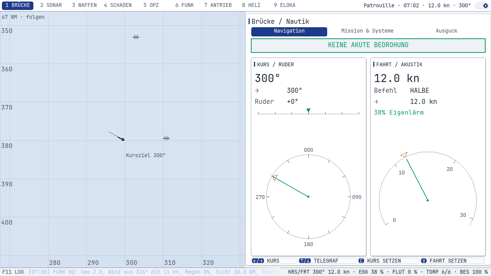

*Brücke, Seite 1 (Navigation) auf der uConsole*

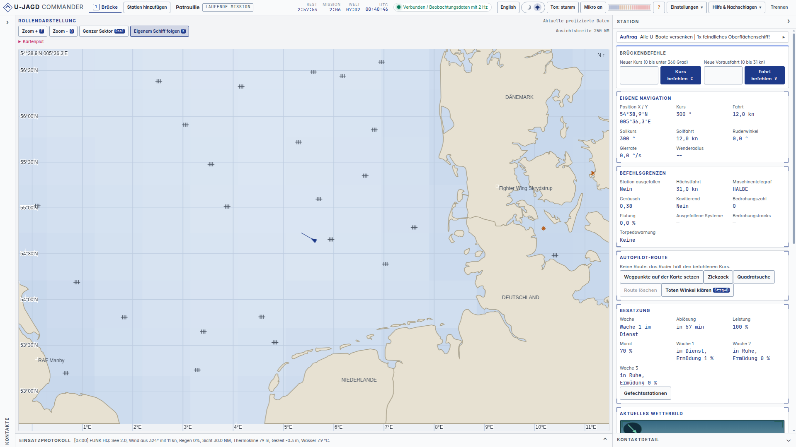

*Brücke im Remote-Crew-Browser*

```text
+---------------------------+----------------------+
|                           | KURS / RUDER         |
|   KARTE (genordet)        |  Kurs 045 > 080      |
|   eigenes Schiff + Kielw. |  Ruder 15 stb        |
|   veröffentlichte Tracks  +----------------------+
|   Peillinien / Fixe       | FAHRT / AKUSTIK      |
|   Helikopter, Bojen       |  HALF 10,0 kn        |
|                           |  38% Eigenlärm       |
|                           +----------------------+
|                           | TAKTISCHE LAGE       |
|                           |  Bedrohungen, Senso- |
|                           |  ren, Mittel, Wetter |
+---------------------------+----------------------+
 Fußzeile: <- -> Kurs | Auf/Ab Telegraph | U/V direkt
```

- **Kurs / Ruder:** aktueller Kurs, befohlener Kurs (`→`), Ruderlage in ganzen Grad und, nur während einer Drehung, der Drehkreis. Unter den Zahlen zeigt eine Ruderskala die Lage von Backbord (links) nach Steuerbord (rechts), und eine Kompassrose zeigt die Kursnadel mit dem befohlenen Kurs als hohle gelbe Marke. Harte Kurven bei Fahrt kosten Fahrt: Hartruder bremst die Fregatte um etwa 28 % (U-Boote ebenso).
- **Fahrt / Akustik:** Telegraphenstufe, Fahrt, Eigenlärm in Prozent und Warnung KAVITATION über 15 kn. Eine Fahrtskala von 0 bis 31 kn zeigt die aktuelle Fahrt als Nadel und die befohlene Fahrt als hohle gelbe Marke.
- **Taktische Lage:** beobachtete Bedrohungen (gehörter Torpedo-Starttransient, HF-Ortungsimpulse oder ein U-Boot, das ein Torpedorohr flutet, ein vom Sonar als Torpedo klassifizierter Kontakt oder ein als möglicher Flugkörper markierter Luftkontakt), Sensorzustand (Radar, TAS), Mittel (Helikopter, Bojen) und Wetter/Tag-Nacht. Neben den Wetterzeilen blickt ein kleines Bild im Stil des Startbilds in den Wind: der Himmel der Stunde mit Sonne, Mond oder Sternen, die Wolken, Regen, Schnee oder Nebel und die auf das Auge zulaufende See, mit einer Windrose (Norden oben, der Pfeil weht mit dem Wind) in der Ecke; die Remote-Crew-Brücke zeigt dasselbe Bild.
- **Karte:** echte Küste des Seegebiets (Natural Earth 1:10m, genau bis etwa 0,05 sm) mit synthetischer Kartentiefe, eigenes Schiff, von anderen Stationen veröffentlichte Tracks. Jeder Kontakt erscheint einmal: Meldungen, die die OPZ fusioniert hat (ein Schiff, das Radar und Ausguck sehen, mit seinem AIS), zeichnet die Karte als den einen fusionierten Track mit seinem Namen, wie die OPZ-Karte, ebenso die Remote-Crew-Brücke. `Q`/`E` zoomen in festen Stufen (Kartenhöhe 500, 250, 100, 50, 25, 10, 5, 2, 1 und 0,5 sm), das Mausrad stufenlos bis 0,5 sm. Das Gitter zeigt Längen- und Breitengrade in Grad und Minuten und wird beim Hineinzoomen feiner (5° bis 0,1'); oben links unter dem Maßstab steht die eigene Position (`54°21,4'N 010°08,2'E`), der Tooltip des Mauszeigers nennt die Position darunter. Nur die stilisierte feste Karte hat keinen echten Ort und behält das sm-Gitter. Entfernungen, Ringe und Maßstab bleiben in sm. Ziehen verschiebt, `K` folgt dem eigenen Schiff.

### Ausguck-Meldungen

Der Brückenausguck (Augenhöhe 18 m, Fernglas 7x50) meldet seine Sichtungen im Ereignis-Feed als `AUSG`-Zeilen, zum Beispiel `Brücke/Ausguck: Fregatte (Admiral-Gorshkov-Fregatte) in 040°, 3.8 sm`. Die Remote-Crew-Brücke zeigt dieselben Meldungen unter „Ausguck-Meldungen“. Brückenseite 3 (Ausguck-Sichtfeld) zeigt die Sichtungen nordorientiert um das eigene Schiff mit der vom Ausguck gemessenen Peilung und Entfernung, nach Art eingefärbt (Oberwasser, U-Boot, Luftfahrzeug, Torpedo) und mit dem Erkannten beschriftet, daneben Sicht, Seegang, Tag/Nacht und die letzten Meldungen; `,` und `.` ändern den Radius (2 bis 30 sm).

Über den Meldungen zeigt ein Horizontstreifen das Fernglas voraus (90° Sichtfeld, Skala rechtweisender Peilungen, mit der See bewegter Horizont, Licht der Stunde) mit den Umrissen der Ausguck-Sichtungen in gemessener Peilung und Entfernung; es ist derselbe Renderer wie das Sehrohr des U-Boots. Das Bild hat den Stil des Startbilds: tagsüber blauer Himmel, in der Dämmerung ein warmer Horizont, nachts Sterne und der Mond in seiner Phase in seiner Peilung mit seinem Glitzern auf dem Wasser; Wolken, Regen, Schnee und Nebel folgen der Wetterstation, und die Umrisse erscheinen in Stahl mit heller Kante, nachts mit beleuchteten Fenstern. Hat der Ausguck die Klasse eines Schiffs, U-Boots oder Luftfahrzeugs ausgemacht, erscheint es als sein 3D-Modell (das des Analysators), gedreht um den Lagewinkel, den er in 10°-Schritten schätzt, sobald es mindestens 16 Pixel lang ist; vorher, veraltet oder kleiner bleibt es eine flache Silhouette. Das Modell ist der echte Typ, den das Auge sieht (jeder Schiffs-, U-Boot- und Flugzeugtyp hat sein eigenes Modell, siehe Kapitel Missions- und Einheiteneditor), sodass sich der Typ auf Sicht bestimmen lässt; die Meldung des Ausgucks nennt nur, was er ausgemacht hat, und nur die Meldung geht an die OPZ. Jeder Umriss steht in der Peilung, die der Ausguck gemessen hat, und ein Schiff schwimmt mit seiner Wasserlinie so weit unter der Kimm, wie sein Auge in 18 m Höhe das Wasser in der gemessenen Entfernung sieht: etwa 1° darunter auf 0,5 sm, 0,4° auf 1 sm, ab etwa 9 sm auf der Kimm (Erdkrümmung); ein näheres Schiff steht vor einem ferneren. Der Lagewinkel zeigt, wie es liegt: Steuerbordseite mit dem Bug nach rechts, Backbordseite mit dem Bug nach links, Bug voraus, wenn es auf einen zuläuft.

Von der Dämmerung bis zum Morgen und bei Sicht unter 2 sm führen neutrale Handels- und Fischereifahrzeuge ihre Positionslichter (Kriegsschiffe fahren abgeblendet): weiße Topplichter über die vorderen 225° (ab 50 m Länge zwei, das hintere höher, 6 sm), das grüne Steuerbord- oder rote Backbord-Seitenlicht (3 sm), beide, wenn das Schiff genau auf einen zuhält, und das weiße Hecklicht über die 135° achteraus (3 sm; unter 50 m Länge ein Topplicht mit 5 sm und die übrigen mit 2 sm), nie weiter als die Sicht. Fahrzeuge bei der Arbeit führen dazu ihre Rundumlichter: ein Trawler Grün über Weiß (ein Topplicht erst ab 50 m), ein Lotsenfahrzeug Weiß über Rot statt der Topplichter, ein Vermessungsschiff, Kabelleger oder Forschungsschiff als manövrierbehindertes Fahrzeug Rot, Weiß, Rot und ein Minenräumer drei grüne; ein Schlepper ohne Schleppzug zeigt gewöhnliche Lichter. Zivile Flugzeuge zeigen das rote linke und grüne rechte Flügelspitzenlicht und das weiße Hecklicht (3 sm) sowie ihre blitzenden roten Kollisionswarnlichter und weißen Blitzlichter (10 sm); Militärflugzeuge fliegen abgeblendet; die Silhouette zeigt dann mit dem Bug dorthin, wohin die Lichter weisen, und ein beleuchtetes Schiff wird an seinen Lichtern gesichtet, auch wo der dunkle Rumpf es nicht wird (die Klasse braucht weiter die Silhouette). Der Ausguck meldet die Lichter, die er sieht, mit seiner Deutung, zum Beispiel `Brücke/Ausguck: Lichter in 040°, 2.8 sm: zwei Topplichter, rotes Seitenlicht; zeigt Backbordseite`: beide Seitenlichter heißen, es hält auf uns zu (laut gemeldet), Grün allein seine Steuerbordseite, Rot allein seine Backbordseite, das Hecklicht allein, es läuft ab, und die Rundumlichter seine Arbeit (Fischer, Lotse im Dienst, manövrierbehindert, Minenräumer; Blitzlichter ein Luftfahrzeug). Die Lichter eines Kontakts meldet er erst wieder, wenn sich ihre Aussage ändert, höchstens alle 2 Minuten; die Remote-Crew-Brücke führt diese Meldungen mit den übrigen.

Flugzeuge stehen in ihrem wahren Höhenwinkel über der Kimm, berechnet aus Flughöhe und Entfernung abzüglich der Erdkrümmung, und hängen hinter den Wolken im ruhigen Himmel, statt mit dem Seegang zu schwanken; ein hohes, nahes Flugzeug liegt über dem Bildfeld, bis man das Fernglas nach oben neigt. Ein Luftfahrzeug weniger als 1° über der Kimm (tief im Schwebeflug, nah am Schiff) steht dagegen auf der bewegten Kimm vor der See.

Der eigene Hubschrauber ist in all diesen Bildern (Streifen, Fernglas, Remote-Crew-Karte, Handy-Ausguck und Trefferbild), sobald die Brücke ihn sehen kann: das Hubschraubermodell an seiner wahren Position, mit eigenem Kurs und eigener Länge (15,2 m), im Transit etwa 60 m hoch, beim MAD-Lauf 30 m und über dem Tauchsonar 15 m; beim Start hebt er vom Flugdeck achteraus ab und steigt innerhalb von 0,3 sm weg, nachts zeigt er seine Positionslichter. Er braucht dieselbe Sicht wie jedes Luftfahrzeug, wird nie gemeldet oder an die OPZ gegeben und ist im Hangar nicht zu sehen. Das Ausguck-Sichtgerät markiert ihn als „eigener Hubschrauber“ an seiner Position, das Panorama mit einem kurzen grünen Strich oben, und die Liste unter dem Fernglas nennt ihn zuerst. Die Remote-Crew-Brücke zeigt dasselbe Fernglas als Karte („Fernglas des Ausgucks“), geschwenkt nur in diesem Browser mit den Pfeiltasten (2°, 10°) und „Bug“.

`B` nimmt das Fernglas groß über die Karte: ein 16°-Sichtfeld, das wie das Sehrohr des U-Boots mit `←` und `→` statt des Ruders (`Umschalt`: 20°-Schritte) oder per Klick in das Rundumbild darunter geschwenkt wird; das Rundumbild markiert jede Sichtung in ihrer gemessenen Peilung, der Bug liegt in der Mitte. Darunter stehen die Sichtungen, die der Sichtlinie nächste zuerst. Die kartierte Küste steht im Horizontstreifen und im Fernglas auf dem Horizont, so weit der Ausguck Land sieht (höchstens 20 sm, im Dunst verblassend), und das Rundumbild markiert sie an seinem Fuß; die Karte kennt keine Höhen, die Hügel sind mit 25 bis 70 m angenommen. Solange das Fernglas oben ist, neigen `↑`/`↓` es um 2° (`Umschalt`: 10°, von 20° nach unten bis 45° nach oben) statt den Maschinentelegrafen zu bedienen, `Q`/`E` zoomen (16°, 8° oder 4° Feld) und die `Leertaste` schaltet die Stabilisierung, die alle bis auf ein Achtel der Schiffsbewegung herausnimmt; die Zeile unter dem Bild zeigt Neigung und Feld, und die Remote-Crew-Karte hat dieselben Knöpfe für ihren eigenen Browser. Die See folgt dem Wind: gegen die See laufen die Kämme in langen Reihen auf einen zu, mit der See laufen ihre Rücken davon, quer dazu ziehen kurze Kämme seitlich durchs Bild, und das Schiff stampft in Gegen- oder Mitlaufsee und rollt in Dwarssee. Die Wellen füllen die ganze See in Perspektive, klein und dicht bis zur klaren Kimm, zum Auge hin länger und höher, und jede Reihe bewegt sich mit dem Seegang. Die eigene Fahrt zeigt sich im Wasser: in Fahrt strömen die Reihen voraus auf das Auge zu, achteraus von ihm fort und querab vom Bug zum Heck, schneller mit mehr Fahrt; achteraus läuft das Kielwasser als Band aus glatterem, hellerem Wasser mit Schaum zwischen den beiden Armen der Kelvin-Welle bis zum Horizont, und voraus wirft die Bugwelle ihre Gischt in den unteren Bildrand (das Fernglas nach unten neigen, um das weiße Wasser vom Steven abrollen zu sehen). `B` erneut führt zur Karte zurück; das Fernglas ist reine Anzeige und wird nicht gespeichert.

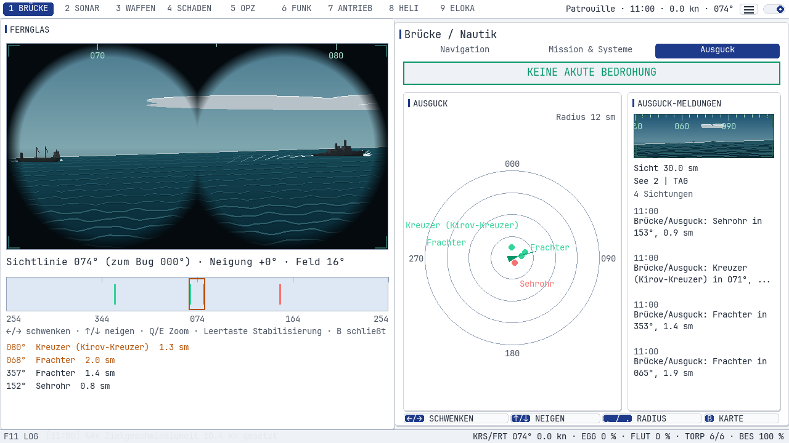

*Fernglas (B) bei Tag*

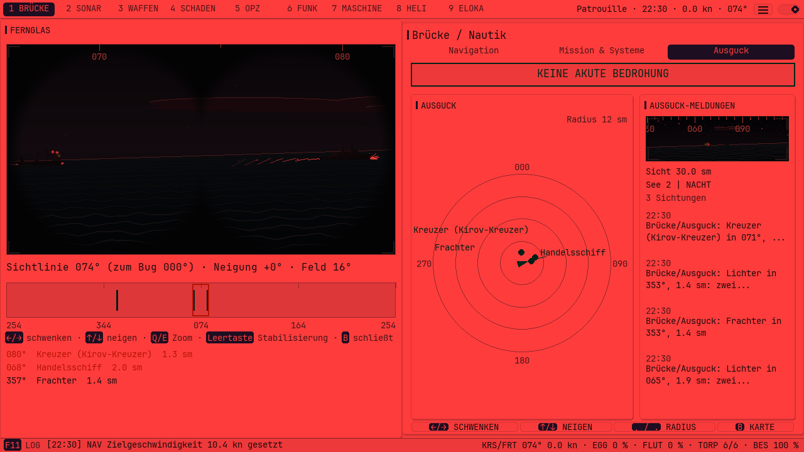

*Fernglas bei Nacht mit Positionslichtern*

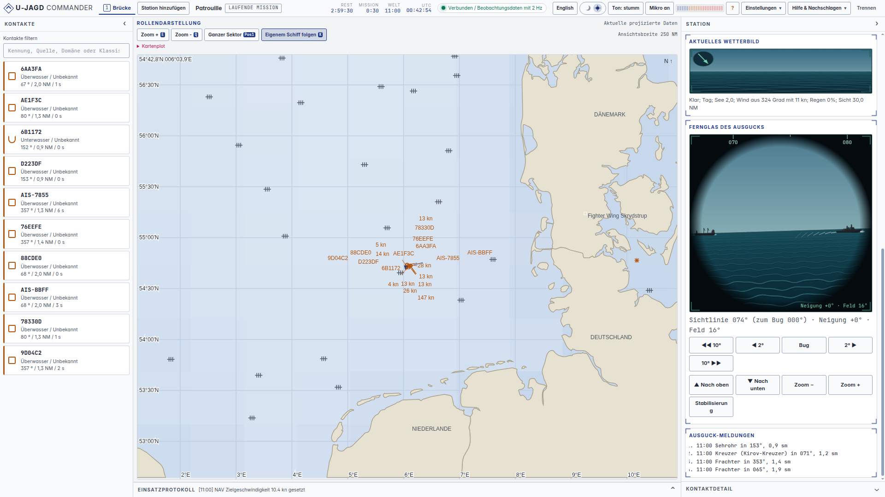

*Ausguck-Fernglas im Remote-Crew-Browser*

Ein Kontakt wird beim Näherkommen in bis zu drei Stufen gemeldet, jede Stufe einmal:

- **Gesichtet:** nur die Art des Objekts ist klar (Fahrzeug, Luftfahrzeug, kleines Objekt an der Wasseroberfläche).
- **Klasse:** die Silhouette zeigt die Klasse, zum Beispiel Handelsschiff, Kriegsschiff, Flugzeugträger, Fischereifahrzeug, Speedboot, aufgetauchtes U-Boot, Verkehrsflugzeug oder Militärflugzeug.
- **Typ:** auf kurze Entfernung nennt der Ausguck den Typ: Frachter, Tanker, Passagierschiff, Schlepper, Fregatte, Zerstörer, Korvette oder Kampfflugzeug; Kriegsschiffe und Militärflugzeuge zusätzlich mit ihrem Klassennamen. Handelsschiffe und Verkehrsflugzeuge werden über Namen, AIS oder Transponder identifiziert, nicht mit dem Auge; der Ausguck meldet deshalb nie ihren Namen oder den Flugzeugtyp.

Klasse und Typ brauchen eine feiner aufgelöste Silhouette als die Sichtung (Johnson-Kriterien): an einem klaren Tag wird ein Tanker auf etwa 7 sm klassifiziert und eine Fregatte auf etwa 4 sm identifiziert, ein Speedboot erst innerhalb von 3 sm klassifiziert, und nachts ist der Typ nur auf wenige Kabellängen erkennbar. Nebel, Regen und Seegang verkürzen jede Stufe. Der Ausguck meldet außerdem „Land in Sicht“ mit der Peilung der nächsten Küste und eine Torpedolaufbahn mit Banner.

Ein ausgefahrenes Sehrohr oder ein Schnorchelkopf eines getauchten U-Boots zieht eine Schaumfahne, die mit der Fahrt wächst: an einem klaren, ruhigen Tag sieht er die volle Fahne ab 8 kn auf knapp 3 sm, bei 3 kn auf etwa 1,7 sm und einen stehenden Kopf erst auf etwa 1 sm; Seegang und Dunst verkürzen das, nachts sieht er kaum etwas. Gesichtet meldet er einen „Schaumstreifen auf dem Wasser“, auf etwa die halbe Entfernung erkennt er das Sehrohr (mit Banner, als U-Boot in die OPZ). Dasselbe Auge haben die Besatzungen des Helikopters und des Seefernaufklärers (siehe dort).

Die Klasse bleibt erhalten, solange er den Kontakt hält. Sie erscheint in den Tooltips von Karte und OPZ als „Ausguck: …“ und ist nur eine Beobachtung: Sie setzt weder die OPZ-Klassifizierung noch die Zugehörigkeit.

### Autopilot-Route

Das Ruder kann einer Route aus bis zu 8 Wegpunkten folgen. Auf der Navigationsseite setzt ein Rechtsklick in die Karte einen Wegpunkt; `W` startet ein Suchmuster ab Position und Kurs des Schiffs (zuerst ein Zickzack mit 3 sm langen Schlägen 45° beiderseits des Kurses, erneut gedrückt ein wachsendes Quadrat mit Schlägen von 1, 1, 2, 2, 3, 3, 4, 4 sm nach rechts drehend, beim dritten Mal wird die Route gelöscht), und `Rücktaste` löscht sie.

Die Karte zeichnet die Route als bernsteinfarbene Linie mit nummerierten Wegpunkten, das Kursfeld zeigt den nächsten mit seinem Abstand. Der Autopilot setzt nur den befohlenen Kurs; die Fahrt bleibt beim Maschinentelegrafen. Ein Wegpunkt gilt innerhalb von 0,3 sm als erreicht, dann steuert das Ruder den nächsten an; nach dem letzten hält das Schiff seinen Kurs. Jeder Ruderbefehl (`←`/`→`, `C`, der Trackball oder ein Kurs aus der Remote Crew) übernimmt und schaltet die Route ab; bei ausgefallener Brücke lässt sich keine Route setzen, und eine laufende wird nicht gesteuert.

Der Autopilot plant nach der Karte: Kartentiefe sowie eingezeichnete Felsen und Wracks gegen die Mindesttiefe des Rumpfs (Tiefgang plus Kielreserve) und weitere 2 m Sicherheit, geprüft alle 0,1 sm entlang jeder Strecke und 0,1 sm zu beiden Seiten. Führt die Strecke eines neuen Wegpunkts oder eines Suchmusters durch Flachwasser oder Land, fügt er Umweg-Punkte ein: zuerst einen Ausweichpunkt quer zur Strecke neben der ersten flachen Stelle (der nächste zuerst, Backbord vor Steuerbord); reicht das nicht, findet eine Wegsuche auf der Karte (ein Raster von höchstens 96 Zellen je Seite über einem Gebiet 4, dann 30, dann 80 sm um die Strecke, begradigt zu so wenigen Wendepunkten, wie freie Strecken es erlauben) den Weg durch ein Fahrwasser oder um eine Bucht oder eine lange Küste. Die Route kann dann bis zu 16 Punkte haben; findet er keinen Weg, meldet der Verlauf, welche Strecke von Hand zu steuern ist.

Während der Fahrt schaut der Autopilot einmal pro Sekunde auf der Strecke voraus (zwei Minuten bei der jetzigen Fahrt, mindestens 0,5 sm): Flachwasser dort bekommt einen Umweg zum aktuellen Wegpunkt, sonst schaltet sich die Route ab und das Schiff dreht auf den Gegenkurs. Er plant nach der Karte, nicht nach dem aktuellen Gezeitenstand. Die Route wird gespeichert.

Die Remote-Crew-Brücke hat eine Karte „Autopilot-Route“: „Wegpunkte auf der Karte setzen“ lässt einen Klick in freie Karte einen Wegpunkt setzen, Knöpfe starten Zickzack oder Quadratsuche oder löschen die Route.

### Tasten

| Taste | Funktion |
|---|---|
| `<- / ->` | Ruder: Zielkurs ändern |
| `Auf / Ab` | Telegraph hoch / runter |
| `C` | Direkten Zielkurs eingeben (000-359) |
| `V` | Direkte Zielgeschwindigkeit eingeben (0-31 kn) |
| `+ / -` | Telegraph: Motorenbefehl (ASTERN-STOP-SLOW-HALF-FULL-FLANK) |
| `Karte` | Mausrad: Zoom, Ziehen mit der Maus: verschieben |
| `Q / E` | Karte in Stufen zoomen, 500 bis 0,5 sm |
| `K` | Karte folgt dem eigenen Schiff an/aus |
| `, / .` | Ausguck-Seite: Radius kleiner / größer |
| `B` | Ausguck-Seite: Fernglas über der Karte ein/aus |
| `↑/↓ · ←/→ · Q/E · Space` | Fernglas oben (wie das Sehrohr): ↑/↓ neigen 2° (Umschalt: 10°) statt Maschinentelegraf, ←/→ schwenken 5° (Umschalt: 20°) statt Ruder, Q/E Zoom (16°, 8°, 4° Feld), Leertaste Stabilisierung |
| `G` | Gefechtsstationen an/aus |
| `W` | Autopilot: Zickzack-Suche, wachsendes Quadrat, aus |
| `Rechtsklick` | Autopilot-Wegpunkt auf der Karte setzen |
| `Backspace` | Autopilot-Route löschen |
| `Ctrl+B` | Toten Winkel klären: zwei Minuten 60° nach Steuerbord, dann zurück (das Rumpfsonar ist 30° beiderseits des Hecks taub) |

Auf der Brücke steuert der Trackball das Ruder. `C` (Kurs) und `V` (Fahrt) öffnen die direkte Zahleneingabe, wie `C`/`V`/`D` auf dem U-Boot; die Simulation läuft währenddessen weiter. `Eingabe` bestätigt, `Esc` bricht ab.

### Maus

Jede Taste in der Tastenleiste am Fuß der Station lässt sich anklicken; gedrückt halten hält die Taste. Lampen, Seitenreiter und Tastenhinweise im Text sind ebenfalls anklickbar (Kapitel Werkzeuge, Maus). Außerdem:

- Ein Klick auf die Kursscheibe befiehlt diesen Kurs, ein Klick auf die Fahrtscheibe diese Fahrt (Seite 1).
- Eine Ruder- oder Telegrafentaste in der Tastenleiste gedrückt halten hält das Ruder oder schaltet den Telegrafen.
- Ein Rechtsklick auf die Karte setzt einen Wegpunkt des Autopiloten (Seite 1).
- Auf der Ausguckseite richtet ein Klick auf das Rundum-Panorama das Fernglas auf diese Peilung.
- Auf der Karte zoomt das Mausrad, Ziehen verschiebt (und beendet das Folgen mit `K`) und ein Klick heftet eine Kurzinfo an.

### Standardablauf

1. Missionsseite prüfen (1 zweimal): Auftrag, Zeitlimit, Gebiet.
2. Transit mit FULL, vor dem Suchgebiet auf SLOW oder 4-6 kn gehen.
3. Suche: ruhige Schläge von 3-5 min, dann 30-60 Grad drehen, damit TMA Entfernung gewinnt.
4. Abstand zu Küste und Flachwasser halten; Kartentiefe beachten.
5. Torpedo im Anlauf: 24 kn (Nixie-Kabel reißt über 25), querab abdrehen, Nixie an der Waffenzentrale.

Gefechtslage:

1. Torpedo gemeldet: sofort auf 24 kn gehen (nicht FLANK: das Schleppkabel des Nixie reißt über 25 kn), so drehen, dass die Torpedopeilung achteraus oder querab liegt.
2. Nixie in der Waffenzentrale befehlen (`V`); weiter drehen, damit der Torpedo zuerst den Täuschkörper sieht.
3. Nach der Abwehr unter 15 kn gehen, damit das Sonar wieder erfasst; mit ausgebrachtem Schleppsonar nie über 20 kn.

### Tipps für Profis

- TMA braucht eine echte Änderung der eigenen Geschwindigkeit. Eine Wende um 30-60 Grad mit anschließend mehreren Minuten ruhigem Schlag liefert die beste Entfernungsschätzung. Drehen auf der Stelle hilft nicht.
- Die Drehrate wächst mit der Fahrt (etwa 0,75 Grad/s bei 10 kn, 1,2 bei 16 kn, 1,9 bei 25 kn, 2,3 bei 31 kn), der Drehkreis bleibt deshalb bei etwa 0,4 NM. Ein gestopptes Schiff kann nicht drehen. Fahrtänderungen brauchen Minuten: etwa 90 s bis 90 % von FULL; ein Stopp aus FULL nutzt Umsteuerung der Propellersteigung und dauert etwa 90 s. Ausweichmanöver früh beginnen.
- In einer harten Wende mit Fahrt krängt das Schiff einige Grad nach außen; bei schwerer See dämpfen die Flossenstabilisatoren das Rollen, aber nur mit Fahrt durchs Wasser.
- Im Flachwasser sackt der Rumpf ab (Squat): bei 25 kn wächst der Tiefgang um bis zu 3 m, bei 31 kn um bis zu 4,6 m, wenn das Wasser weniger als etwa fünf Tiefgänge tief ist. Im Flachwasser Fahrt reduzieren.
- Sprint und Drift: mit FULL an eine neue Position, dann auf 4-6 kn gehen und horchen.
- Starke einseitige Flutung bewirkt Krängung und einen stetigen Drehzug; mit Ruder ausgleichen.
- Das Schiff kann nicht auf Land fahren (es wird zurückgeschoben), aber Flachwasser begrenzt die Tauchtiefe des Helikoptersonars (10 m Bodenabstand).
- Die Wassertiefe folgt der Gezeit (halbtägig, etwa 12,4 h, im Flachwasser bis zu einigen Metern). Eine Passage, die bei Hochwasser sicher ist, kann bei Niedrigwasser zur Grundberührung führen; das HQ-Wetterbulletin meldet die aktuelle Gezeit am Schiff.
- Wind treibt das Oberflächenwasser: etwa 3 % der Windgeschwindigkeit, 20 Grad rechts von der Windrichtung, zusätzlich zur ständigen Meeresströmung.

### Nicht modelliert

- Keine Zeitraffung und keine Pause. Der Autopilot steuert nur den Kurs, nie die Fahrt; seine Umwege nutzen nur die Karte (keine aktuelle Gezeit, keine anderen Schiffe); seine Wegsuche sieht die Karte in Zellen von mindestens 0,2 sm, ein Fahrwasser schmaler als etwa eine halbe Meile oder ein Weg weiter als 80 sm neben der Strecke wird daher nicht gefunden.
- Keine automatische Torpedoerkennung: der Alarm beruht nur auf gehörten Intercepts oder der Klassifizierung des Sonarbedieners; ein außerhalb der Suchkopfreichweite leise laufender Torpedo kann unangekündigt eintreffen. Der Ausguck meldet nur eine sichtbare Laufbahn.
- Der Ausguck liest weder Schiffsnamen noch Flagge und meldet keine Signalkörper; Lichter deutet er nur wie oben beschrieben, nie Kurs oder Fahrt daraus. Kein Schiff im Spiel ankert, schleppt, fischt mit Schleppfahrt oder ist manövrierunfähig, daher erscheinen Ankerlicht, Schlepplichter und die Lichter eines manövrierunfähigen Fahrzeugs nie.

## 2 Sonar

### Zweck

Die Sonarzentrale ist der Hauptsensor der U-Jagd. Sie horcht passiv mit Bugsonar (HMS), Schleppsonar (TAS) und tiefenveränderlichem Sonar (VDS), analysiert Signaturen in LOFAR und DEMON, schätzt die Zielbewegung per TMA, misst das Schallprofil und sendet auf Befehl einen aktiven Ping. Sie klassifiziert Kontakte und gibt sie an OPZ und Waffenzentrale frei.

### Seiten

Die Station hat sechs Seiten. `Bild Auf`/`Bild Ab` (oder nochmals `2`) blättert sie.

| Seite | Zeigt | Wofür |
|---|---|---|
| BROADBAND | Peilung-Zeit-Wasserfall | Kontakte entdecken und ihrer Peilung folgen |
| LOFAR | Frequenz-Zeit-Wasserfall, 0-300 Hz | Tonale Linien: Maschinen, Welle, Schraubensignaturen |
| DEMON | Modulationsspektrum des Horchstrahls | Hypothesen zu Blatt- und Wellenfrequenz |
| TMA | Lösung für den fokussierten Kontakt | Schätzung von Entfernung, Kurs und Fahrt |
| UMWELT / FUSION | Schallprofil, Schicht, CZ, Array-Vergleich | TAS-Tiefe wählen, Geisterkontakte erkennen |
| ACTIVE | Gespeicherte Echos mit Alter und Fehler | Entfernung und Tiefe aus Pings |

### Anzeigen und Instrumente

Der Hörposten rechts zeigt Quelle und Alter der Evidenz, das Array, die Hörpeilung und die Ping-Bereitschaft; ein Schlepp- oder Tiefensonar, das gerade aus- oder einfährt oder noch nicht bereit ist, erscheint auf jeder Seite gelb mit Kabellänge, Stabilität und PAUSE, wenn die Handhabung außerhalb der Grenzen liegt. Die Tastenzeile unten zeigt die vier Haupttasten der Seite mit ihren Werten; der Knopf + WEITERE rechts blättert durch alle übrigen Sonartasten als Knöpfe (ein Klick drückt die Taste) und zurück. Auf BREITBAND ist die gelbe Linie die Hörpeilung und die grauen Linien die Grenzen des Hörstrahls; dunkel heißt leise, türkis laut.

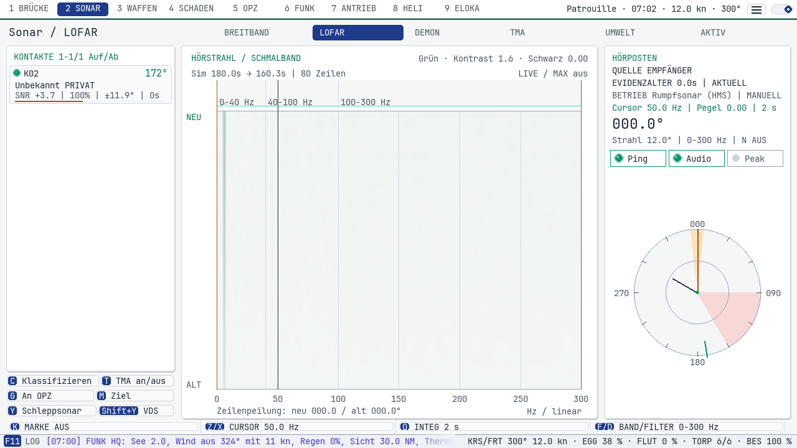

*Sonar auf der uConsole*

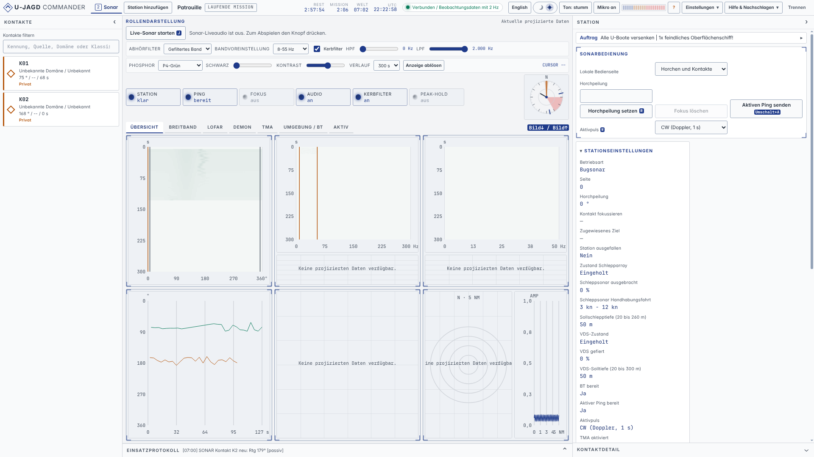

*Sonar im Remote-Crew-Browser*

Die Station hat drei Spalten: links Kontaktkarten, in der Mitte die Anzeige der Seite, rechts die Detailzeilen und die Horchkonsole. Die Horchkonsole unter den Detailzeilen ist wie ein Leitstand aufgebaut: Lampen zeigen Ping bereit (gelb, solange ein Ping läuft), Ton und Spitzenwert-Halten, und eine nordorientierte Peilrose zeigt die Horchrichtung (gelb), die toten Winkel achtern (roter Sektor), den eigenen Kurs und jede veröffentlichte Kontaktpeilung. Jede Kontaktkarte zeigt eine Lampe, die Peilung, die Klassifizierung und einen Balken für den Störabstand; ein Klick wählt den Kontakt und richtet das Horchen auf ihn.

Maus: Die Tastenchips unter den Karten wirken auf den gewählten Kontakt wie ihre Tasten: `C` klassifizieren, `T` TMA, `G` Freigabe an die OPZ, `M` Ziel, und `Y`/`Umschalt+Y` bringen das Schleppsonar und das VDS aus oder holen sie ein (auf dem U-Boot nur `C`, `T` und `M`). Der Remote-Crew-Browser zeigt dieselbe Rose neben seinen Wasserfällen.

#### BROADBAND-Wasserfall

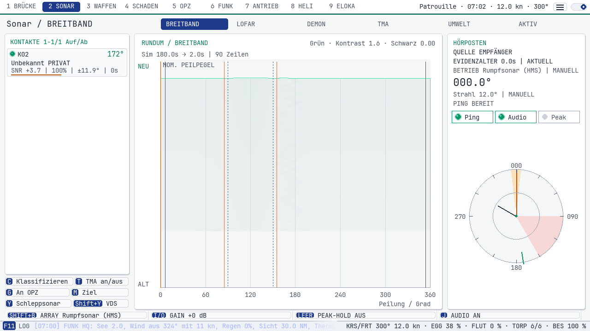

*BREITBAND-Wasserfall*

```text
 Peilung  000      090      180      270      359
 jetzt  |   .   #     .        :          .    |
        |   .   #    .         :         .     |
        |   .    #   .          :        .     |
 älter  |   .    #  .           :       .      |
        +--------------------------------------+
            ^    ^              ^
            |    wandernder     Eigenlärm (weiche Keule achteraus)
            |    Kontakt
            stehender schwacher Kontakt
```

Neueste Daten stehen oben. Eine gerade senkrechte Spur ist ein Kontakt mit stehender Peilung; eine schräge Spur zeigt Peilungswanderung. Die Historie umfasst 20 s Feindaten plus 4 Minuten Langzeithistorie (`Umschalt+H` wählt 25/50/100 %). Helligkeit ist relativer Empfangspegel, keine Entfernung.

#### LOFAR

Die x-Achse ist die Frequenz (0-300 Hz), die Zeit läuft nach unten. Die Klassen sind 1 Hz breit unter 40 Hz, 2 Hz bis 100 Hz und 5 Hz darüber. Alle 0,25 s kommt eine Zeile hinzu; 80 Zeilen bleiben stehen.


*LOFAR-Seite*

- Stehende senkrechte Linien sind **Töne** (Schmalband): Generatoren, Pumpen, Wellenlinien. Mehrere Linien bei ganzzahligen Vielfachen einer Frequenz bilden eine Harmonischenfamilie: den weißen Cursor mit `Z`/`X` auf eine Linie setzen (`Umschalt`: 10-Hz-Schritte) und mit `K` als Grundton markieren; bernsteinfarbene Hilfslinien zeigen dann 2f, 3f usw. `K` auf derselben Frequenz löscht ihn.
- Das eigene Schiff erzeugt eine Blattlinie bei Wellendrehzahl / 60 x 5 Propellerblätter: etwa 3,9 Hz bei 8 kn, 9,7 Hz bei 20 kn und 15 Hz bei 31 kn. `N` blendet sie per Notch aus (±5 Hz).
- `Leertaste` hält Spitzen, damit schwache Töne hervortreten.
- Der Spektrumstreifen über dem Wasserfall schreibt die Frequenz über jede deutliche Linie (zwischen den Klassen interpoliert; mit `Leertaste` die gehaltene Hüllkurve). Wo sich Werte überdecken würden, behält die stärkere Linie ihre Beschriftung. Der Remote-Crew-Browser beschriftet seine Spektren genauso.
- `F` wählt das Analyseband: FULL 0-300, LOW 4-80, SHAFT 8-55, MID 20-120 Hz. `Strg+Z` / `Strg+X` setzen die untere / obere Bandkante auf den Cursor für jeden Band-, Tief- oder Hochpass; `Umschalt+N` legt einen zusätzlichen Notch auf die Cursorfrequenz.
- `Q` wählt die Integrationszeit: 2 s (die FFT des Empfängers), 8, 16 oder 64 s. Längere Integration mittelt aufeinanderfolgende Spektren, sodass ein schwacher stehender Ton aus dem Rauschen tritt; eine wandernde Linie verschmiert dabei. `Umschalt+Q` öffnet den Nonius: 20 Hz um den Cursor in der nativen 0,5-Hz-Auflösung.
- Die Detailspalte liest den Pegel am Cursor. Automatisch beschriftet der Streifen Linien nur auf der Realismusstufe Einsteiger (`F10`).

#### DEMON

DEMON demoduliert die Hüllkurve des Breitbandrauschens im Horchstrahl. Schraubenkavitation ist mit der **Blattfrequenz** moduliert = Wellenfrequenz x Blattzahl.

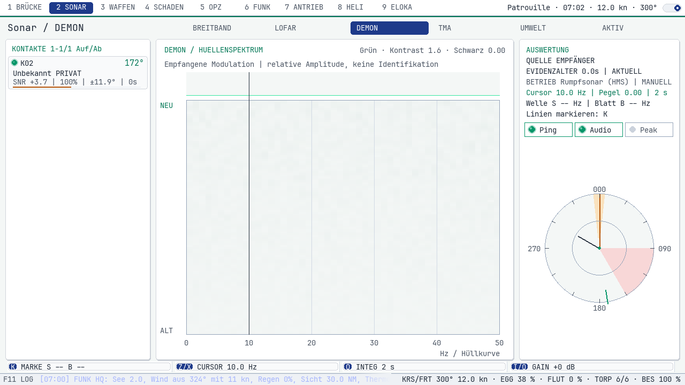

*DEMON-Seite*

```text
 Pegel
   |      |              Blattfrequenz 12,5 Hz
   |  |   |              -> 5 Blätter => Welle 2,5 Hz = 150 U/min
   |  |   |   |
   +--+---+---+------ Hz
     2,5 12,5 25
    Welle Blatt 2. Harmonische
```

Die Anzeige zeigt gemessene Modulation, keine Identität. Nach einer Peilungsänderung einige Sekunden horchen, bevor Sie urteilen. Blätter selbst zählen: den Cursor (`Z`/`X`, 0,5 Hz) auf die Wellenlinie setzen und `K` drücken, dann auf die Blattlinie und erneut `K`; die Spalte zeigt Blätter = Blattfrequenz / Wellenfrequenz (mit der Abweichung von einer ganzen Zahl) und die Wellendrehzahl. Ein drittes `K` löscht beide Marken.

Die **Klassenbibliothek** unter den Marken nennt die drei Katalogklassen, die am besten zu Ihren Marken passen: Wellendrehzahl gegen den Drehzahlbereich der Klasse, Blattzahl gegen ihre Blattzahlen und Ihre LOFAR-Grundlinie (`K` auf der LOFAR-Seite) gegen ihr Tonalband und ihre Maschinenlinien, jeweils am besten in der Mitte des Bereichs. Mit weniger als zwei Marken ist sie nur ein Hinweis. Der Kontaktanalysator (`F8`) listet dann den ganzen Katalog nach Passung mit der Passung in Prozent. Die Bibliothek bewertet Ihre Marken, nie den Kontakt selbst, und die Klassifizierung bleibt Ihre Entscheidung; der Sonarraum des U-Boots hat dieselbe Bibliothek. Auf der Realismusstufe Einsteiger (`F10`) beschriftet das Sonar zusätzlich Modulationslinien, schlägt Drehzahlen für 3-7 Blätter vor und rankt Katalogkandidaten.

#### TMA, Umwelt und Aktiv

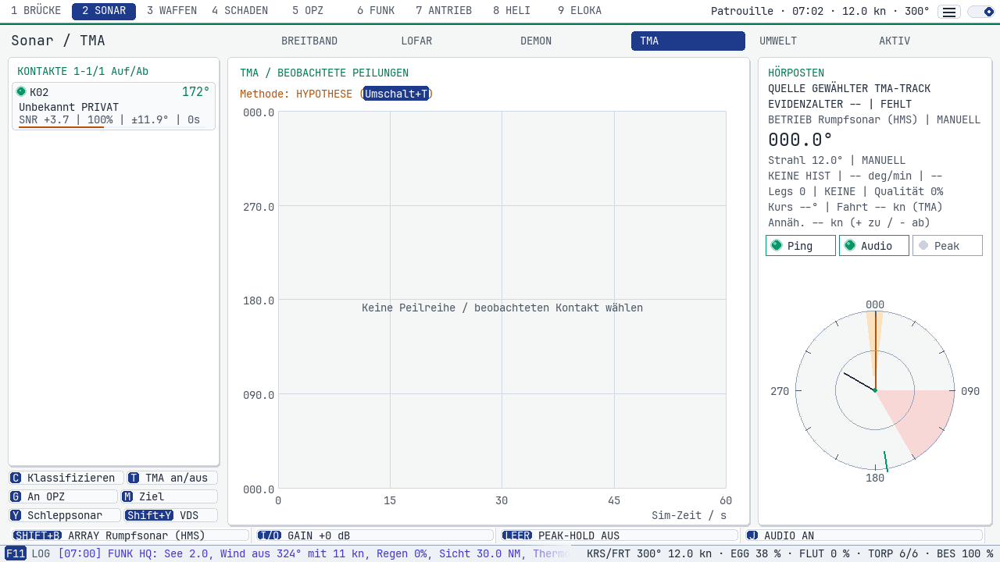

*TMA-Seite*

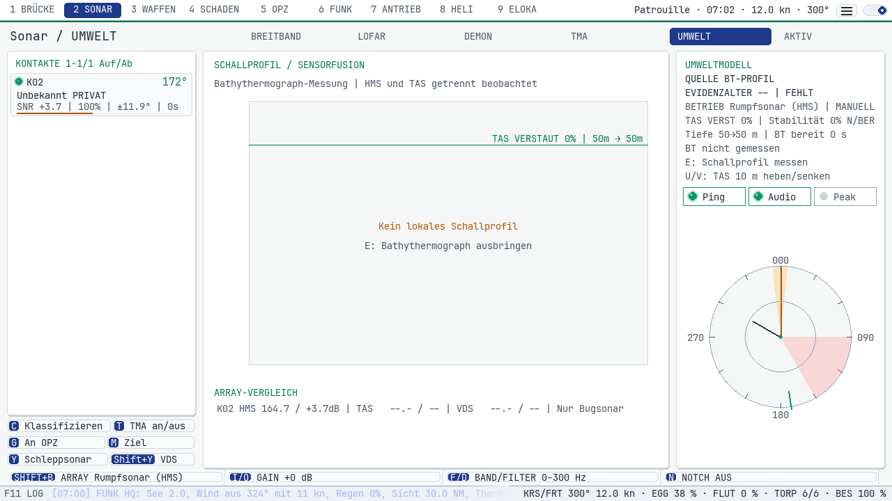

*Umwelt-Seite mit Sensorfusion*

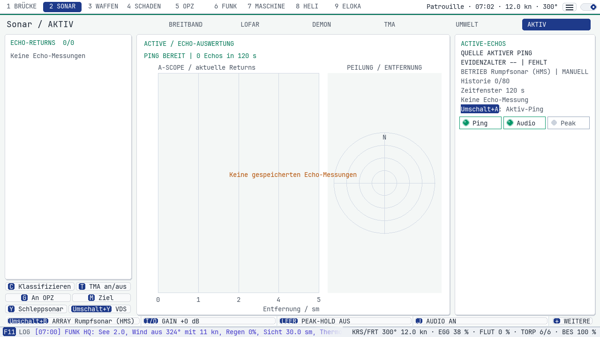

*Aktiv-Seite*

- **TMA** machen Sie selbst. Die Seite zeichnet die Peilungen des gewählten Kontakts über der Zeit. Stellen Sie eine Hypothese auf: `Z`/`X` Kurs (`Umschalt`: 1 Grad), `Strg+Z`/`Strg+X` Fahrt, `Q`/`Umschalt+Q` Entfernung auf der neuesten Peilung (`Strg`: 0,2 sm). Die bernsteinfarbene Kurve zeigt die Peilungen, die diese Hypothese vorhersagt, die Punkte am Fuß die Residuen (gemessen minus vorhergesagt). Gute Hypothesen lassen die Residuen um null streuen; ein falscher Kurs, eine falsche Fahrt oder Entfernung hinterlässt einen Trend. Die Spalte zeigt RMS der Residuen, den systematischen Trend nach Mittelung, die Passung und die Beobachtbarkeit. Die Entfernung ist erst nach einer eigenen Kursänderung beobachtbar (mindestens 6 Grad, besser 30-60); ohne sie verweigert `K`. `K` übernimmt die Hypothese als TMA-Fix des Kontakts; er wird auf Kurs und Fahrt mitgekoppelt und veraltet nach 120 s, also verfeinern und erneut übernehmen, wenn Peilungen hinzukommen. Verrauschte Peilungen ergeben auch bei guter Passung eine große Entfernungsunsicherheit. Tiefe schätzt TMA nicht. Auf der Realismusstufe Einsteiger (`F10`) wird ein automatischer Solver-Vorschlag (er braucht mindestens 4 Peilungen über 180 s) als dünne Linie gezeichnet, und `Umschalt+K` kopiert ihn in die Hypothese. Sonobojen-Peilungen gehen mit der Boje als Beobachter in den Track ein. `Umschalt+T` wechselt die TMA-Methode: HYPOTHESE (oben), EKELUND (die Entfernung aus den Peilraten zweier eigener Schläge um eine Kursänderung von mindestens 30°, je 90 s; `Umschalt+K` übernimmt sie in die Hypothese, `K` nimmt dann wie üblich an) oder DOT-STACK (Residuenzeilen bei 0,6-, 1,0- und 1,6-facher Hypothesenentfernung: die flache Zeile ist die Entfernung, die die Peilungen stützen).
- **UMWELT / FUSION** zeigt den Bathythermographen (`E`, 60 s Abklingzeit): gemessene Schichttiefe, Schallgeschwindigkeitsprofil und Konvergenzzonen, dazu den Vergleich HMS/TAS. Peilungen innerhalb 5 Grad bestätigen sich; ab 9 Grad Abweichung wird ein möglicher Geisterkontakt markiert. Die Schicht ist nicht fest: Nachmittagssonne macht sie flacher (etwa 8 m), starker Wind mischt sie über Stunden tiefer, und interne Wellen verschieben sie um einige Meter. Den BT nach einigen Stunden oder einem Wetterwechsel wiederholen. Das gemessene Profil ist die echte temperaturabhängige Schallgeschwindigkeit (Mackenzie-Gleichung) und fällt deshalb unterhalb der Schicht ab. Mit der Maus über dem Profil lesen Sie die genaue Tiefe, die dortige Schallgeschwindigkeit und ob die Tiefe über oder unter der Schicht liegt (uConsole und Web). Im Web-Client beschriftet die Grafik zusätzlich Schicht, Meeresgrund und das Schallgeschwindigkeitsminimum. Die Konvergenzzonen darin stammen aus dem gemessenen Profil selbst: aus der Strahlverfolgung dieses Profils über dem kartierten Bodentyp in der Tiefe des Arrays, sie ändern sich also mit Schicht, Tiefe und Boden (keine im Flachwasser).
- **ACTIVE** listet die Echos der letzten 120 s: Peilung, Entfernung und Tiefe (+/-12 m). Ein Ping-Fix veraltet nach 120 s. `W` wählt den Puls: **CW** (1-s-Ton) misst die Entfernung grob (etwa 0,1-0,3 sm), trennt aber über den Doppler ein bewegtes Ziel vom Nachhall des Meeresbodens; **LFM** (100-Hz-Sweep) misst die Entfernung auf wenige Meter, und seine 100-mal kleinere Entfernungszelle senkt den Nachhall um 20 dB, sodass es auch ein langsames oder stehendes Ziel im Flachwasser findet; gegen Rauschen im tiefen Wasser reichen beide Pulse gleich weit. Die Echostärke hängt vom Aspekt (breitseits etwa 15 dB stärker als von vorn) und der Größe des Ziels ab. Felsgrund hallt viel stärker nach als Schlick; kartierte Wracks liefern echte Echos ohne zugehörigen Kontakt ("nicht zugeordnetes Echo").
- **Das Echo hören:** Jede Rückkehr ist hörbar, sobald sie eintrifft, nach ihrer echten Laufzeit hin und zurück (etwa 2,5 s je Seemeile Entfernung), für das Schiffssonar ebenso wie für das Tauchsonar des Helikopters. Ein CW-Echo ist ein weicher Ton auf der Trägerfrequenz, ein LFM-Echo ein kurzer Sweep; maßgeblich ist der Puls, mit dem gepingt wurde. Ein starkes Echo hebt sich deutlich ab, ein schwaches steigt kaum aus dem Nachhallrauschen. Im Remote-Crew-Browser klingt das Echo über den allgemeinen Ton (laut oder leise). Das aktive Ping eines U-Boots kommt umgekehrt nach seiner einfachen Laufzeit an (etwa 1,2 s je Seemeile): Erst dann gibt die Fregatte ihren tiefen Warnton, spielt das Ping selbst und meldet es im Log mit der nach Gehör gemessenen Peilung (ganze Grad, etwa ±2° ungenau); eine Entfernung liefert ein fremdes Ping nie. **Richtungshören:** Mit Stereoton (Kopfhörer) kommen Echos, Detonationen und das Ping eines U-Boots aus der Peilung, aus der sie gehört wurden: links für Backbord, rechts für Steuerbord vom Bug des Schiffs aus, mittig recht voraus und achteraus (voraus und achteraus klingen gleich). Das eigene Ping, Starts und Geschützfeuer bleiben mittig. Der uConsole und der Remote-Crew-Browser setzen sie gleich.

### Bugsonar, Schleppsonar und VDS

|  | HMS (Bug) | TAS (Schlepp) | VDS (tiefenveränderlich) |
|---|---|---|---|
| Passivreichweite | 1,0 x Basis | 1,4 x Basis, minus 3 % je Knoten | 1,15 x Basis |
| Strahlbreite | 12 Grad | 6 Grad | 8 Grad |
| Peilfehler | +/-6 Grad | +/-2 Grad, links/rechts mehrdeutig | +/-4 Grad, eindeutig |
| Eigenlärm | voll | 35 % des Bugsonars | 60 % des Bugsonars |
| Pingreichweite | 1,0 x | 0,8 x | 1,1 x, aus der Tiefe des Körpers |
| Handhabung | immer bereit | ausbringen 360 s, einholen 480 s, nur bei 3-12 kn, 30 s Beruhigung | fieren 120 s, hieven 120 s, nur bei 3-15 kn und Seegang bis 5, 20 s Beruhigung |

- TAS-Tiefe 20-260 m (`U`/`V` in 10-m-Schritten), begrenzt auf 260 m minus 4 m je Knoten eigener Fahrt. Mehr Fahrt hebt das Array auf diese Grenze; die befohlene Tiefe bleibt und wird wieder erreicht, wenn das Schiff langsamer wird. Ab 30 m Tiefe und in derselben Schicht wie das Ziel gewinnt es weitere 25 %.
- Über 20 kn mit ausgebrachtem Kabel erleidet das Array einen dauerhaften FAULT.
- Das Array folgt einer Kursänderung mit etwa 45 s Verzögerung; während es nachschwenkt, sind seine Peilungen weniger verlässlich.
- **Toter Winkel (Baffles):** Das Bugsonar (HMS) ist 30° beiderseits des eigenen Hecks taub; ein U-Boot genau achteraus hört nur das Schleppsonar oder das VDS. Der BREITBAND-Wasserfall markiert die Grenzen des toten Winkels gepunktet. Klären Sie ihn von der Brücke mit `Strg+B` (zwei Minuten 60° nach Steuerbord, dann zurück) oder mit einer eigenen Kursänderung. Für den Gegner gilt dasselbe: Auch das Rumpfsonar eines U-Boots ist achtern taub, und ein KI-U-Boot, das sich nach einem Ping dicht im toten Winkel der Fregatte findet, folgt ihr dort, statt zu fliehen.
- **Schwund:** An der Erfassungsgrenze schwillt ein Passivkontakt um etwa ±3 dB an und ab, langsam und für jeden Kontakt und jede Antenne anders; ein schwacher Kontakt kommt und geht, statt bei einer festen Entfernung aufzutauchen.
- **Reaktion eines KI-U-Boots:** Ein lauter Ping (von einem Rumpfsonar auf etwa 10 sm, von einem Tauchsonar auf 5 sm, von einer Boje auf 1,5 sm gehört) lässt ein KI-U-Boot vom Pinger weglaufen; ein leiserer schickt es nur tief und langsam, mit dem Heck zum Pinger (liegt es still oder schleicht, hält es 6 dB länger aus). Einen gehörten Torpedo nimmt es zuerst 60 s mit voller Fahrt querab und stößt einen Täuschkörper aus, dann schleicht es mit 4 kn davon. Gegen ein unter der Sprungschicht ausgebrachtes Tiefensonar versteckt es sich über der Schicht.
- VDS (`Umschalt+Y` fiert oder hievt ihn, `Umschalt+B` wählt ihn): ein Körper an kurzem Kabel, 20-300 m tief, begrenzt auf 300 m minus 8 m je Knoten. `U`/`V` verstellen die Tiefe des jeweils gewählten Arrays. Ab 30 m Tiefe in der Schicht des Ziels gewinnt er dieselben 25 % wie das TAS. Er peilt eindeutig, eine VDS-Peilung löst die TAS-Seite also wie das Bugsonar auf. Ein Ping auf dem VDS sendet aus dem Körper: unter der Sprungschicht trifft der Schattenzonenverlust flache statt tiefe Ziele. Fieren und Hieven pausieren außerhalb 3-15 kn oder über Seegang 5; über 24 kn mit ausgebrachtem Körper geht er verloren (FAULT).

```text
          HMS                          TAS
     Lärmkeule achteraus        Lärmkeule entlang Kabel
            ^                           ^
      \ Schiff /                   Schiff ===== Kabel === Array
       \  ||  /                             (Keule zeigt zum Schiff)
      ~~~~||~~~~  weiche 70-Grad-Keule
```

### Tasten

| Taste | Funktion |
|---|---|
| `Shift+A` | Aktiv-Ping abfeuern (Kühlzeit, verrät Position!) |
| `Umschalt+B` | Empfangsarray wechseln: HMS, TAS, VDS |
| `Y` | TAS ausbringen / einholen (nur bei 3-12 kn) |
| `Shift+Y` | VDS fieren / hieven (3-15 kn, Seegang bis 5) |
| `Bild Auf / Ab` | Broadband / LOFAR / DEMON / TMA / Umwelt / ACTIVE |
| `2` | 2 erneut drücken, um die Sonarseite weiterzuschalten |
| `E` | Bathythermograph: lokales Schallprofil messen |
| `W` | Aktivpuls CW / LFM |
| `U / V` | Solltiefe des gewählten Arrays (TAS oder VDS) um 10 m heben / senken |
| `R` | Hörpeilung direkt: 000 bis 359.9 Grad rechtweisend |
| `<- / ->` | Peilung +/-0.5 Grad; Umschalt: 5, Strg: 0.1 |
| `Auf / Ab` | Kontakt für TMA und Klassifikation wählen |
| `Eingabe` | Gemessener Kontaktpeilung folgen / manuell halten |
| `J \| , / .` | Empfangston an/aus \| Lautstärke senken/erhöhen |
| `A / B / H` | Direkt Breitband / gefiltert / Heterodyn abhören |
| `D` | Breitband/gefiltertes Abhören umschalten |
| `I / O` | Gain senken / erhöhen (3 dB) |
| `Shift+I / Shift+O` | Sonar-Anzeigekontrast senken / erhöhen |
| `Ctrl+I / Ctrl+O` | Sonar-Schwarzpunkt senken / erhöhen |
| `Shift+C` | Phosphorpalette Grün / Amber / Cyan wechseln |
| `Shift+H` | Angezeigte Historientiefe 25 / 50 / 100 Prozent wechseln |
| `F` | Frequenzband wählen: breit / tief / mittel |
| `N` | Notchfilter gegen Eigenantrieb |
| `K` | Linie am Cursor markieren (LOFAR-Grundton, DEMON Welle/Blatt) |
| `Z / X` | LOFAR/DEMON-Frequenzcursor (Umschalt: 10 Hz) |
| `Ctrl+Z / Ctrl+X` | Bandpass untere / obere Kante am Cursor |
| `Q` | Integrationszeit 2 (FFT)/8/16/64 s |
| `Shift+Q` | LOFAR-Nonius: 20 Hz in nativen 0,5 Hz |
| `Shift+N` | Notch auf der Cursorfrequenz |
| `Shift+F` | DEMON-Trägerband 200-800 / 400-1400 / 1000-2000 Hz |
| `Strg+F` | Überlagerungsversatz 400/700/1000/1200 Hz |
| `X / Shift+X (BB)` | Breitband/Fusion: TAS-Seite des gewählten Kontakts wechseln / Umschalt: bestätigen |
| `Z / X (TMA)` | TMA-Seite: Hypothesenkurs -/+ 5 Grad (Umschalt 1 Grad) |
| `Ctrl+Z / Ctrl+X (TMA)` | TMA-Seite: Hypothesenfahrt -/+ 1 kn |
| `Q / Shift+Q (TMA)` | TMA-Seite: Hypothesenentfernung -/+ 1 sm (Strg 0,2 sm) |
| `K / Shift+K (TMA)` | TMA-Seite: Hypothese als Fix übernehmen / Umschalt: Solver-Vorschlag kopieren (Training) |
| `Shift+T (TMA)` | TMA-Methode: Hypothese/Residuen, Ekelund-Entfernung, Dot-Stack (Umschalt+K bei Ekelund: Entfernung übernehmen) |
| `LEER` | LOFAR Peak-Hold ein/aus |
| `T` | TMA für ausgewählten Kontakt ein/aus |
| `C` | Kontakt klassifizieren (U-Boot / Kampfschiff / Biologisch / Fahrzeug / Flugzeug / Torpedo) |
| `G` | Gewählten Kontakt unabhängig von der Klassifikation an OPZ freigeben / zurückziehen |
| `M` | Ausgewählten Kontakt als Ziel setzen |

### Maus

Jede Taste in der Tastenleiste am Fuß der Station lässt sich anklicken; gedrückt halten hält die Taste. Lampen, Seitenreiter und Tastenhinweise im Text sind ebenfalls anklickbar (Kapitel Werkzeuge, Maus). Außerdem:

- Ein Klick auf eine Kontaktkarte wählt den Kontakt und richtet die Hörpeilung auf ihn, wie `Auf`/`Ab` und danach `Enter`: Wasserfall, Analyse und Ton folgen sofort diesem Kontakt (auf der Seite ACTIVE gilt das für die Echozeile). Ein Kontakt, der länger als 2 s nicht gehört wurde, wird nur gewählt.
- Die Tastenchips unter den Karten wirken auf den gewählten Kontakt: `C` klassifizieren, `T` TMA, `G` Freigabe an die OPZ, `M` Ziel, `Y`/`Umschalt+Y` Schleppsonar und VDS ausbringen oder einholen.
- Ein Klick auf den BROADBAND-Wasserfall richtet die Hörpeilung dorthin oder auf einen Kontakt, der höchstens eine halbe Keulenbreite vom Klick entfernt liegt.
- Ein Klick auf einen Seitenreiter öffnet diese Seite.

### Standardablauf

1. Langsam fahren (4-8 kn), HMS wählen; TAS bei 3-12 kn ausbringen (Y), VDS bei 3-15 kn unter die Sprungschicht fieren (Umschalt+Y).
2. BREITBAND nach Peilspuren absuchen; Töne im LOFAR bestätigen (N Notch).
3. Kontakt wählen (Auf/Ab), Fokus halten (Eingabe), DEMON prüfen.
4. Klassifizieren (C); nach einer Kursänderung eine TMA-Hypothese anpassen (Seite TMA: Z/X, Strg+Z/X, Q) und übernehmen (K).
5. Tiefe oder genaue Entfernung nötig: Ping (Umschalt+A), dann freigeben (G) und Ziel setzen (M).

Gefechtslage:

1. Ein Transient beim Rohrfluten warnt, dass ein Schuss folgen kann: Bugsonar und Schleppsonar auf die Peilung richten und Gegenmaßnahmen bereithalten. Ein Starttransient, hochfrequente Ortungsimpulse oder ein neuer lauter Breitbandkontakt ohne Tonale mit schnell wandernder Peilung kann ein Torpedo sein. Als Torpedo klassifizieren (`C`) und die Peilung sofort an die Brücke melden.
2. Fokus auf dem feindlichen U-Boot halten, damit das Draht-Datum des Torpedos frisch bleibt.
3. Nur pingen, wenn die Tiefe für den Schuss fehlt oder der Kontakt verloren geht: das U-Boot hört einen Ping bis 60 sm und weicht aus.

### Tipps für Profis

- Verstärkung (`I`/`O`) ändert nur Anzeige und Audio, nicht die Ortung. Schwarzwert (`Strg+I`/`Strg+O`) und Kontrast (`Umschalt+I`/`Umschalt+O`) heben schwache Spuren hervor; `Umschalt+C` wechselt die Phosphorfarbe.
- `D` oder `A`/`B`/`H` wählen Breitband-, gefiltertes oder Überlagerungs-Abhören. Überlagerung verschiebt das tiefe Band auf etwa 700 Hz, damit tiefe Töne hörbar werden.
- Das Abhör-Audio läuft etwa anderthalb Sekunden hinter der Anzeige (Remote-Crew-Browser etwa zwei Sekunden), damit es auch unter Last nicht aussetzt. Nach dem Schwenken der Abhörpeilung geht der alte Strahl nach dieser Verzögerung in den neuen über; der Ton bricht nicht ab.
- TAS unter die gemessene Schicht legen, um tiefe Ziele zu hören; das HMS für flache Ziele nutzen. Beide Arrays arbeiten parallel.
- Die TMA-Seite zeigt die aus der übernommenen Lösung abgeleitete Annäherungsrate: positiv heißt, das Ziel kommt näher.
- Weichen TAS und HMS um 9 Grad oder mehr ab, den Kontakt als möglichen Geist behandeln (die Anzeige markiert ihn) und durch eine Wende klären.
- Die Schleppantenne ist eine Linie: sie kann eine Peilung nicht von ihrem Spiegelbild zum Kabel unterscheiden. Ein nur auf der TAS gehörter Kontakt wird als "TAS links/rechts mehrdeutig" mit Spiegelpeilung markiert und speist keine TMA; die Anzeige zeigt die von Ihnen gewählte Seite (Standard Steuerbord). 20 Grad drehen und beide Spuren beobachten: die echte bleibt stetig, die Geisterspur springt (der Status lautet dann "Wende gefahren - Spuren vergleichen"). Auf der Breitband- oder Fusionsseite zeigt `X` die andere Seite, `Umschalt+X` bestätigt die angezeigte; nichts wird für Sie entschieden. Eine falsch bestätigte Seite bleibt gespiegelt (die TMA-Residuen zeigen es; `X` öffnet die Wahl wieder). Eine Peilung des Rumpfsonars löst die Seite durch Messung auf. Peilungen zu den Kabelenden (Endfire) sind zudem ungenauer als querab.
- `Umschalt+F` wählt das DEMON-Trägerband (200-800, 400-1400 oder 1000-2000 Hz): das Band suchen, in dem das Kavitationsrauschen am stärksten ist. `Strg+F` stellt den Überlagerungsversatz (400/700/1000/1200 Hz) zum Abhören tiefer Töne ein.
- Im Kontaktanalysator (`F8`) ordnet `Eingabe` bei gewähltem Kontakt das angezeigte Katalogprofil diesem Kontakt zu, `Umschalt+Eingabe` löscht die Zuordnung. Die Zuordnung ist Ihr Vermerk: sie erscheint in der Kontaktliste, wird gespeichert und ändert nie die Klassifizierung oder die Waffensperren des Kontakts.
- Ein Kontakt geht 120 s nach der letzten Ortung verloren. Schwache Kontakte weiter verfolgen oder per Ping wieder erfassen.
- Wracks liefern echte Echos ohne Doppler. Ein U-Boot, das still neben einem kartierten Wrack auf Grund liegt, versteckt sich vor einem CW-Ping in dessen Echo (750 m Entfernungszelle); ein LFM-Ping löst etwa 8 m auf und kann U-Boot und Wrack trennen. Jedes Wrack, das der Gegner erreichen konnte, ist verdächtig.
- Der Bathythermograph (`E`) misst bis zum Grund, höchstens 1500 m. Erst nach einer Messung zeigt die Wetter- & Sonar-Analyse (`0`) die Schicht, die Schattenzone darunter und einen SOFAR-Kanal.
- Das Sonar benennt nie einen Torpedo oder ein U-Boot. Es meldet, was es hört: einen mechanischen Starttransient (hörbar bis 35 NM), hochfrequente Ortungsimpulse (etwa 6 NM) oder den kurzen Transienten eines U-Boots, das ein Torpedorohr flutet und die Mündungsklappe öffnet (eine Warnung, dass ein Schuss folgen kann: bis 8 NM, langsames, leises Fluten nur bis 1,5 NM; beides schrumpft mit Eigenlärm, Seegang und Sonarschaden) als Peilung, die der Brückenalarm 60 s hält, und Sinkgeräusche, wenn ein Rumpf sinkt. Das OPZ-Symbol eines Sonarkontakts folgt allein Ihrer Klassifizierung; ein unklassifizierter Kontakt bleibt unbekannt.

### Nicht modelliert

- `T` schaltet den Löser hinter der Trainingshilfe um; der automatische Löser schreibt nie selbst einen Fix.
- Keine wählbare Split-Window-Normalisierung (TPSW); stattdessen Verstärkung, Schwarzwert und Kontrast nutzen.
- Der tote Winkel blendet nur das passive Horchen; ein aktiver Ping des Bugsonars erfasst weiter den ganzen Kreis.

## 3 Waffenzentrale

### Zweck

Die Waffenzentrale macht aus einem Sonarkontakt eine Feuerlösung. Sie startet die drahtgelenkten Torpedos und das eigene ASROC der Fregatte, wirft Wasserbomben, verwaltet die Zuladung des Helikopters (Bojen, Leichttorpedos), bringt den geschleppten Täuschkörper Nixie aus und gibt das Flak-Geschütz frei.

### Seiten

| Seite | Zeigt |
|---|---|
| 1 Zielung | Karte mit dem gewählten Kontakt, Kontaktkarten, Gefechtsstufen, Feuerleitlösung mit Torpedotiefe, Gefechtsskizze, Rohrlampen und Bereitschaftszeile |
| 2 Munition | Rohre, Nachladezeiten, Torpedobestand, Nixie, Hubschraubermunition, Torpedo-Einstellzeile und die Bestände als Tanksäulen |

### Anzeigen und Instrumente

Seite 1 (Ziel) zeigt die Karte mit dem gewählten Kontakt; das Panel hat links Kontaktkarten (ein Klick wählt einen Kontakt wie `←`/`→`, `M` weist ihn zu, das Ziel trägt eine rote Marke) über den Einsatzstufen und rechts die Feuerleitlösung mit Torpedotiefe, Schusslage, Rohrlampen und Bereitschaftszeile. Seite 2 (Bestände) listet Rohre, Nachladezeiten, Torpedovorrat, Nixie-Zustand, Helikopter-Zuladung und die Torpedo-Einstellzeile: gewählter Typ mit Restvorrat, Suchmuster, Sucheraktivierungspunkt und Salvengröße.

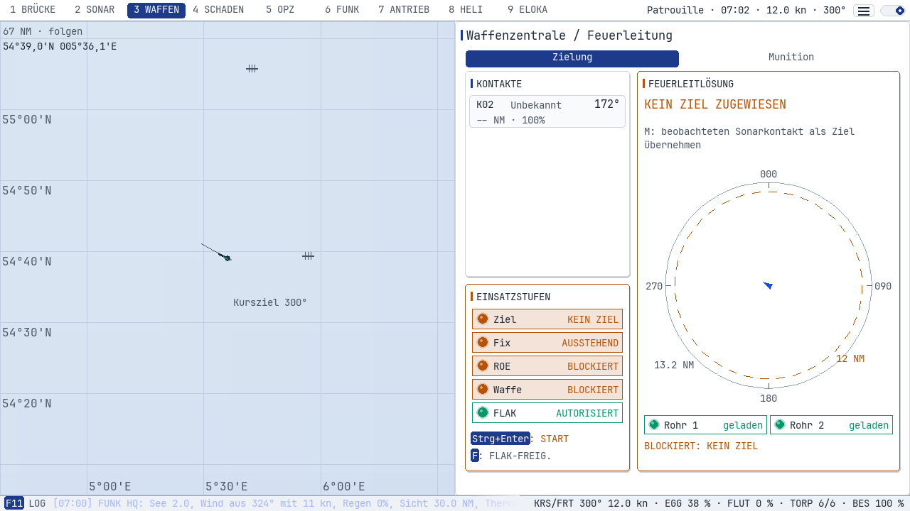

*Waffen auf der uConsole*

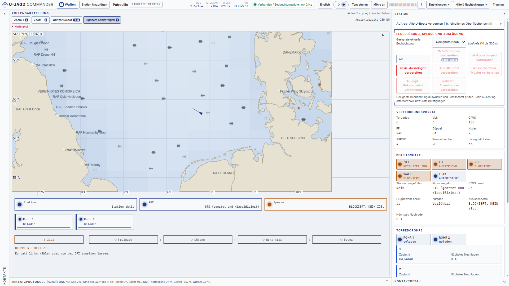

*Waffen im Remote-Crew-Browser*

Die Bereitschaftszeile wird von oben nach unten geprüft; die erste fehlgeschlagene Prüfung wird angezeigt:

```text
 BLOCKIERT: KEIN ZIEL            Kontakt wählen oder übernehmen (M)
 BLOCKIERT: ZUGEHOERIGKEIT ...   als FREUND/NEUTRAL markiert
 BLOCKIERT: KEINE ENTFERNUNG     ROE STD braucht Ping/TMA/Boje
 BLOCKIERT: NICHT KLASSIFIZIERT  als U-Boot/Kampfschiff (Sonar C)
 BLOCKIERT: KEINE TORPEDOS / KEIN ROHR BEREIT / SALVENLIMIT
 BLOCKIERT: WAFFENZENTRALE GESTOERT
 FEUER FREI                      -> Strg+Eingabe
```

Torpedolauf von oben:

```text
 Fregatte ==Draht==> . . . . /\/\/\/\  ( Datum )
                   Marschlauf    Schlangen-    Sucher an
                   zum Datum     suche         innerhalb 1,2 sm
                   (Draht-Update +/-15 Grad    -> steuert nächsten
                    alle 0,5 s)                   Kandidaten an
```

- Zwei Torpedotypen teilen sich die zwei Rohre (60 s Nachladen). Mk1: 45 kn, 12 sm, drahtgelenkt. Mk2: 50 kn, aber nur 6 sm. Der Szenariovorrat (Standard 6) ist 2:1 auf Mk1 und Mk2 verteilt; `W` wählt den Typ, und hält kein Rohr ihn, entlädt ein Rohr und lädt ihn nach (60 s).
- Suchmuster (`X`): die Schlange (+/-15° um den Datumskurs, Standard), ein Kreis von 0,4 sm um den Aktivierungspunkt oder eine Helix, die sich von 0,15 sm um 0,15 sm je Umlauf bis 1 sm öffnet. Das Muster läuft erst, wenn der Sucher aktiv ist und noch nicht erfasst hat.
- Sucheraktivierungspunkt (`,` / `.`): 0,6 bis 3,0 sm vor dem Datum in Schritten von 0,2 sm (Standard 1,2 sm). Frühe Aktivierung findet ein Ziel, das sich vom Datum entfernt hat; späte Aktivierung hält die Waffe länger still.
- Salve (`Y`): ein Torpedo oder zwei im Fächer von +/-8° mit eigenen, um das Schiff gedrehten Datums; ein Fächer braucht zwei geladene Rohre des gewählten Typs und zählt gegen die Doktringrenze.
- Voreingestellte Tiefe 10-300 m (Standard 60 m): `↑`/`↓` halten oder nach `T` eintippen, wie auf dem U-Boot. Falsche Tiefe bedeutet Fehlschuss: Tiefe aus dem Ping nehmen, nicht aus der TMA.
- Der Draht aktualisiert das Datum aus der beobachteten Kontaktposition. Ohne Updates wird er nach 3 s STALE und nach 12 s BROKEN; der Torpedo läuft dann zum letzten Datum weiter.
- Der Sucher schaut in einem Kegel von ±45° nach vorn (±60°, sobald er ein Ziel hält) und schaltet nur innerhalb von 150 m um seine eigene Tiefe auf, wenn sich ein Kandidat aus seinem Eigengeräusch heraushebt: passiv bis etwa 2 sm (gegnerische Torpedos 3 sm), mit eigenen Pings bis 1,2 sm (gegnerische 2 sm). Solange er sucht, läuft der Torpedo mit 70 % seiner Fahrt und sprintet, sobald er ein Ziel hält. Der Sucher steuert den lautesten Kandidaten an (eine bestehende Aufschaltung bleibt, solange kein anderer 6 dB lauter ist): das kann ein Täuschkörper, ein Wal oder ein Handelsschiff sein. Ein ziviler Treffer beendet die Mission.
- Salvendoktrin SHOOT-LOOK-SHOOT: höchstens 2 eigene Torpedos gleichzeitig im Wasser.
- ASROC (`A`): 4 Schuss pro Mission. Die Rakete fliegt mit 500 kn zur beobachteten Position des Ziels (1 bis 10 sm, aktuelle Entfernung nötig) und setzt dort den Leichttorpedo des Helikopters auf der voreingestellten Tiefe ab. Es gelten dieselben Zielprüfungen wie beim Torpedo, und es zählt gegen die Doktringrenze.
- Wasserbomben (`Z`): 20 pro Mission, geworfen als Muster aus 5 (drei im Kielwasser 20, 80 und 140 m achteraus, zwei 70 m querab geworfen), danach 45 s Nachladen der Ablaufbahn. Das Schiff muss mindestens 10 kn laufen. Die Bomben sinken mit 3,5 m/s bis zur voreingestellten Tiefe (15-300 m) oder zum Grund; jede 90-kg-Ladung ist bis etwa 25 m tödlich und beschädigt noch bis etwa 100 m. U-Boote innerhalb von 5 sm hören die Detonation und weichen aus.
- U-Jagd-Raketenwerfer (`R`, Typ RBU/Bofors): 36 Raketen pro Mission, abgefeuert in Salven zu 6, danach 60 s Nachladen. Eine Angriffssalve geht auf die beobachtete Position des zugewiesenen Ziels in 0,4 bis 3 sm (aktuelle Entfernung nötig, dieselben Zielprüfungen wie beim Torpedo): ein Schuss auf den Zielpunkt, fünf auf einem Ring von 80 m darum. Die Raketen fliegen mit 400 kn (etwa 9 s je sm), jede Ladung sinkt mit 11 m/s bis zur voreingestellten Tiefe (10-300 m) oder zum Grund; die 23-kg-Ladungen sind nur bis etwa 14 m tödlich und schaden bis 60 m, eine grobe oder alte Ortung verschwendet die Salve. **Abwehrsalve** (`Umschalt+R`): sechs Schuss in einer Linie 0,3 bis 0,8 sm hinaus in Peilung einer höchstens 5 s alten Torpedowarnung, Tiefe 15 m; eine Ladung, die innerhalb von 35 m eines laufenden Torpedos detoniert, zerstört ihn, und das Protokoll meldet, dass das Torpedogeräusch endet. Jedes U-Boot innerhalb von 3 sm hört die Raketen ins Wasser schlagen: ein KI-U-Boot weicht sofort aus, der Sonarraum des bemannten U-Boots meldet die Einschläge mit ihrer Peilung.

Beide Seiten sind wie ein Feuerleitpult aufgebaut: Auf Seite 1 hat jedes Rohr eine Lampe (grün geladen, gelb im Nachladen, dunkel wenn leer), und die Sperrkette (Ziel, Fix, ROE, Waffe, Flak) ist eine Lampensäule, die Stufe für Stufe grün wird. Zwischen Lösung und Rohrlampen zeigt eine Schusslage, genordet um das eigene Schiff, die Reichweite des gewählten Torpedotyps als gestrichelten gelben Ring, die Peilung zum Ziel (gestrichelt, solange nur die Peilung bekannt ist) und, sobald eine Entfernung vorliegt, die geschätzte Zielposition, den Treffpunkt aus TMA-Kurs und -Fahrt und die Torpedolaufbahn dorthin (grün innerhalb der Reichweite, rot darüber hinaus); die Zahl links unten ist der Halbmesser der Skizze. Sie nutzt nur die Beobachtung des Kontakts, nie das U-Boot selbst; Seite 2 zeigt die restlichen Torpedos, Hubschraubertorpedos, Sonarbojen und RBU-Raketen als Tanksäulen. Der Remote-Crew-Browser zeigt Station, ROE und Sperre als Lampen und jedes Rohr als Säule.

### Einsatzregeln

| ROE | Voraussetzung |
|---|---|
| STD (Start) | Aktuelle Entfernung (Ping, TMA oder Boje) und Klassifizierung U-Boot oder Kampfschiff |
| FREI | Nur Klassifizierung; ohne Entfernung zielt der Torpedo 10 sm in Peilrichtung |

Das Hauptquartier schaltet nach dem ersten versenkten feindlichen U-Boot per Funk auf FREI; der Spieler kann die ROE nicht ändern. Ein in der OPZ als FREUND oder NEUTRAL markierter Kontakt, direkt oder über eine Fusion, kann nie bekämpft werden.

### Tasten

| Taste | Funktion |
|---|---|
| `M` | Ziel setzen (aus Sonarkontakten) |
| `Auf / Ab halten` | Torpedotiefe (10-300 m) |
| `T` | Torpedo-Lauftiefe eingeben (10-300 m), wie auf dem U-Boot |
| `<- / ->` | Sonarkontakt für Zielwahl wählen |
| `Strg+Eingabe` | Gewählte Waffe abfeuern (Torpedo, solange D/A/Z/R nichts anderes gewählt haben; ROE-Prüfung) |
| `W` | Torpedotyp (Rohre laden um; W wechselt Mk1/Mk2) |
| `X` | Suchmuster im Endanlauf: Schlange, Kreis, Helix |
| `, / .` | Sucheraktivierung -/+ (0,6 bis 3,0 sm, Schritte 0,2 sm) |
| `Y` | Salve: ein Torpedo oder zwei im Fächer +/-8° |
| `H` | HSP-5 starten (5 min Vorbereitung, tankt an Deck) / abbrechen / zurückrufen |
| `B` | Sonarbojen aussetzen (HSP-5 in Luft) |
| `D` | Leichttorpedo vom HSP-5 wählen (nochmals: Schiffstorpedo) |
| `V` | Einen begrenzten geschleppten Akustik-Täuschkörper ausbringen |
| `A` | ASROC auf den zugewiesenen Kontakt wählen (1-10 sm) |
| `Z` | Wasserbombenmuster über das Heck wählen |
| `R` | U-Jagd-Raketensalve auf das Ziel wählen (frische Entfernung, 0,4-3 sm) |
| `Shift+R` | Raketen-Abwehrsalve in Richtung der Torpedowarnung wählen |
| `Q / E` | Karte in Stufen zoomen, 500 bis 0,5 sm |
| `K` | Karte folgt dem eigenen Schiff an/aus |
| `F` | Flak-Feuerfreigabe umschalten (gesperrt = feuert nie auf Angreifer) |

### Maus

Jede Taste in der Tastenleiste am Fuß der Station lässt sich anklicken; gedrückt halten hält die Taste. Lampen, Seitenreiter und Tastenhinweise im Text sind ebenfalls anklickbar (Kapitel Werkzeuge, Maus). Außerdem:

- Ein Klick auf eine Kontaktkarte wählt diesen Kontakt wie `←`/`→`; das zugewiesene Ziel trägt eine rote Marke.
- Die Feuertaste `Strg+Eingabe` lässt sich hier anklicken, nur an der Waffenstation. Sie feuert die gewählte Waffe: `D`, `A`, `Z`, `R` und `Umschalt+R` wählen nur den Lufttorpedo, ASROC, das Wasserbombenmuster, die Raketensalve oder die Abwehrsalve; die gewählte Waffe leuchtet auf Seite 2 und steht in der Feuerzeile. Dieselbe Waffe noch einmal gewählt, gilt wieder der Torpedo.
- Die Tastenhinweise neben der Lösung (Abschuss, Flak-Freigabe) drücken ihre Tasten.
- Auf der Karte zoomt das Mausrad, Ziehen verschiebt (und beendet das Folgen mit `K`) und ein Klick heftet eine Kurzinfo an.

### Standardablauf

1. Ziel vom Sonar übernehmen (M) oder Kontakt mit Links/Rechts wählen.
2. Bereitschaftszeile prüfen: Entfernung aktuell, Klassifizierung, Rohre, Salvenlimit.
3. Torpedotiefe auf die gepingte Zieltiefe stellen (Auf/Ab halten).
4. Feuern (Strg+Eingabe); Kontakt frisch halten, damit das Draht-Datum folgt.
5. Abwehr: Nixie früh ausbringen (V); HSP-5 starten (H) für Bojen und Lufttorpedos.

Gefechtslage:

1. Feindtorpedo gemeldet: sofort Nixie ausbringen (`V`). Er hält 600 s an einem 0,2-sm-Kabel; einer bereit, ein zweiter nach 60 s. Bei 15 kn läuft er in 10 m Tiefe, bei langsamer Fahrt tiefer und näher achteraus, über 25 kn reißt das Kabel. In einer Wende läuft das Kabel hinterher.
2. Den Gegenangriff fortsetzen: ein frischer Kontakt hält das Draht-Datum auf dem U-Boot.
3. Ist der Helikopter in der Luft, erreicht ein Leichttorpedo (`D`) einen entfernten Kontakt schneller als der Schiffstorpedo.

### Tipps für Profis

- Aus etwa 6-8 sm oder näher schießen: mit 45 kn braucht der Torpedo 8 Minuten für 6 sm, und das U-Boot hört den Abschuss bis 35 sm und weicht aus.
- Das Datum vor ein fahrendes Ziel legen, indem TMA weiterläuft; der Draht folgt der Beobachtung, nicht der Wahrheit.
- Während der Lenkung unter der Kavitationsgrenze bleiben; Kontaktverlust heißt Verlust des Draht-Datums.
- Der Draht ist ein echtes Kabel: er reißt, wenn das Schiff etwa 5 s lang schneller als 20 kn läuft oder schneller als 1,5 Grad/s dreht, wenn die schiffsseitige Spule (5 sm eigener Weg) abgelaufen ist oder wenn der Torpedo das 1,25-fache seiner Reichweite gelaufen ist.
- Die Torpedoreichweite kommt aus der Batterie: bei voller Fahrt läuft er die Katalogreichweite, harte Manöver drosseln ihn und sparen Energie; ist die Batterie leer, läuft er einige Sekunden aus und geht verloren. Direkt nach dem Ausstoß dreht er langsamer (fester Drehkreis), und Tiefenänderungen brauchen einen Moment.
- Der Gefechtskopf hat einen Annäherungszünder: er zündet bei der größten Annäherung innerhalb seines Radius, der Schaden fällt mit dem Abstand (Schockfaktor). Ein knapper Fehlschuss kann ein U-Boot beschädigt entkommen lassen.
- Ein laufender Torpedo wird vom Ziel über die Sonargleichung gehört: leise U-Boote hören ihn bei ruhiger See auf einige Meilen, Regen und eigene Fahrt überdecken ihn.
- Nur zwei Nixies je Mission: den ersten ausbringen, wenn ein Torpedo wahrscheinlich ist, den zweiten für den nächsten Angriff aufheben.
- Zielsuchköpfe halten den lautesten Kandidaten und wechseln nur, wenn ein anderer deutlich (6 dB) lauter ist. Echos ohne Doppler ignorieren sie, ein schwebendes Ziel ist daher schwer zu finden; ein Torpedo, der einen Täuschkörper ohne Rumpftreffer überläuft, merkt ihn sich und greift erneut an. Täuschkörper gegnerischer U-Boote werden mit leerer werdender Batterie leiser; gegnerische Kriegsschiffe bringen eigene Täuschkörper aus, wenn sie Ihren Torpedostart hören.

### Nicht modelliert

- Wasserbomben nur aus Ablaufbahn und Werfern; der Raketenwerfer hat keinen Aufschlagzünder (jede Ladung geht in ihrer Tiefe hoch) und kein eigenes Torpedoabwehr-Geschoss.
- Ein Torpedotyp für den Helikopter; die Doktringrenze von zwei laufenden eigenen Torpedos ist fest.
- Kein Tiefenunterschied zwischen Mk1 und Mk2; beide laufen auf der eingestellten Tiefe.

## 4 Schadensabwehr

### Zweck

Die Schadensabwehr hält das Schiff nach einem Treffer schwimmfähig und die Stationen einsatzbereit. Drei Reparaturtrupps bekämpfen Wassereinbruch und Brand in neun Abteilungen. Jede Abteilung beherbergt eine Station; eine beschädigte Abteilung schwächt sie, eine zerstörte fällt für den Rest der Mission aus.

### Seiten

| Seite | Zeigt |
|---|---|
| 1 Schiffsplan | Leckwehrtafel: Seitenriss und Querschnitt mit Wasser, Feuer, Lecks und Teams; eine Karte je Abteilung |
| 2 Auswahl & Teams | Abteilungskarten, Einzelheiten der gewählten Abteilung, die drei Reparaturteams |
| 3 Besatzung | Wachplan: Wachen, Ermüdung, Moral, Leistung und Verwundete |

### Anzeigen und Instrumente

Seite 1 ist die Leckwehrtafel: ein Seitenriss des Schiffs, Bug rechts, mit Decks, Aufbauten und Masten, jede Abteilung nummeriert auf ihrer wirklichen Länge und Höhe, daneben ein Querschnitt, der mit dem Schiff krängt und die Rumpfräume an Backbord und Steuerbord zeigt.

Außen steht die See bis zur Wasserlinie mit Tiefgangsmarken an Bug und Heck; in jeder Abteilung steht das Leckwasser auf seiner Höhe und neigt sich mit dem Trimm, ein Brand glüht und flackert mit Rauch unter der Decke, und eine zerstörte Abteilung ist schraffiert. Ein aufgerissenes Loch zeigt, wo der Rumpf offen ist, und Wasser strömt hinein, solange die Abteilung vollläuft; hat ein Trupp ein Leckpflaster gesetzt, liegt dort eine Platte, und ein lenzender Trupp pumpt Wasser über Bord. Tiefgang und Trimm stehen unter dem Seitenriss, die Krängung unter dem Querschnitt. Unter den Bildern trägt die Karte jeder Abteilung eine Zustands-LED, Flutung und Brand mit ihren LEDs sowie nummerierte Plaketten für die Trupps vor Ort; eine Legende erklärt die LEDs.

Seite 2 hat drei Spalten: links eine Karte je Abteilung mit Zustandsstreifen, den LEDs für Wasser und Brand und den Trupps vor Ort, in der Mitte die Details der gewählten Abteilung (Flutung, Brand, Tendenz, Trupps vor Ort, Krängung), rechts die drei Leckwehrtrupps mit ihrem Ziel und ob sie unterwegs sind (mit den restlichen Sekunden), vor Ort arbeiten oder bereitstehen. Ein Klick auf eine Abteilungskarte wählt sie, ein Klick auf eine Truppkarte wählt den Trupp, und Eingabe schickt ihn los; ein Klick allein schickt keinen Trupp; Seite 3 ist der Wachplan der Besatzung.

Im Browser beginnt die Karte Schaden mit einer Warn- und Meldetafel (Brände, Wassereinbruch, ausgefallen, verschlechtert, Gesamtschaden, Krängung, Trimm, Gegenfluten, Trupps aktiv, Schiff gesunken) über demselben Seitenriss mit Querschnitt und Rundinstrumenten für Krängung, Trimm und Gesamtschaden; ein Klick auf eine Abteilung schickt den gewählten Trupp dorthin. Jede Karte eines Leckwehrtrupps nennt seine Abteilung und zeigt, ob der Trupp bereitsteht, unterwegs ist (mit den restlichen Sekunden) oder vor Ort arbeitet; ein Klick auf die Karte wählt diesen Trupp.

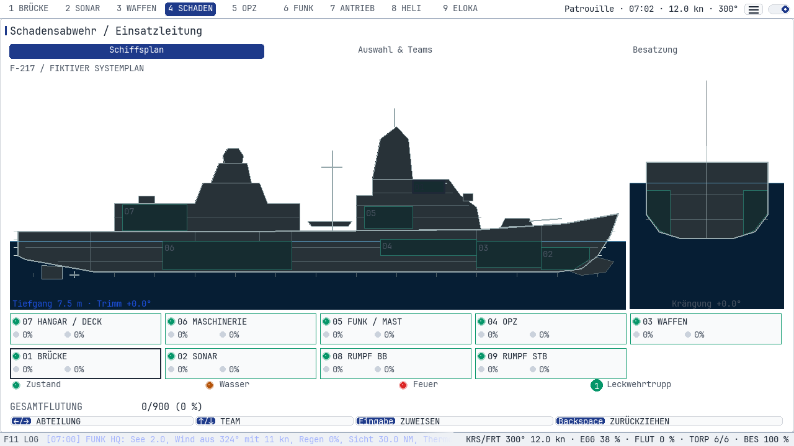

*Schadensabwehr auf der uConsole*

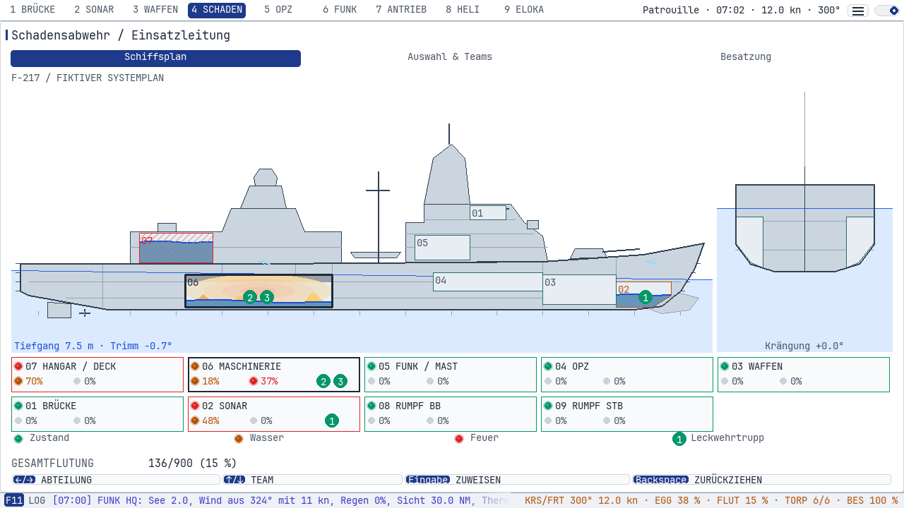

*Schadensabwehr mit Wassereinbruch und Feuer nach einem Treffer*

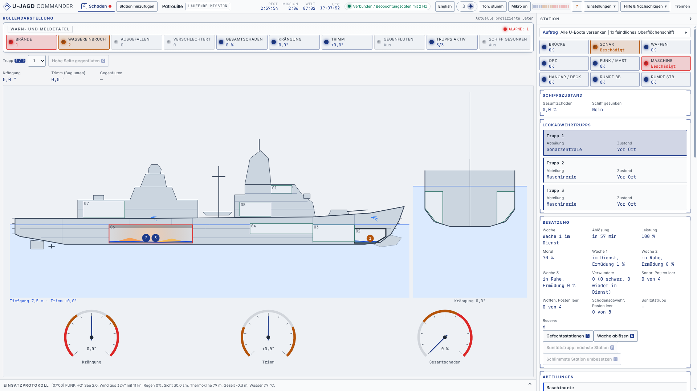

*Schadensabwehr im Remote-Crew-Browser*

```text
  Bug                                                    Heck
 +--------+--------+---------+-----+-------+--------+-----------+
 | BRÜCKE | SONAR  | WAFFEN  | OPZ | FUNK  | MASCH. | FLUGDECK  |
 +--------+--------+---------+-----+-------+--------+-----------+
 |          RUMPF BACKBORD       |        RUMPF STEUERBORD       |
 +-------------------------------+-------------------------------+
  Zustand: OK -> BESCHÄDIGT / FLUTEND -> ZERSTÖRT     Trupps: 1 2 3
```

- **FLUTEND:** durch ein Leck unter der Wasserlinie dringt Wasser ein. Der Zufluss folgt dem Wasserdruck: anfangs schnell, dann langsamer, je näher der Wasserstand innen der Wasserlinie außen kommt. Hoch liegende Räume (Brücke) fluten durch ein Leck nicht. Bei 70 % ist die Abteilung ZERSTÖRT.
- **BESCHÄDIGT:** das Leck ist abgedichtet; eine kleine Restleckage bleibt, bis ein Trupp den Raum lenzt.
- **Leckabdichtsätze:** jedes Abdichten verbraucht einen von 8 Sätzen. Ohne Sätze kann ein Trupp nur gegen das offene Leck lenzen.
- **Trefferort:** der Einschlagpunkt des Torpedos bestimmt die Abteilung; eine nahe Detonation reißt ein größeres Leck als eine entfernte. Flugkörper treffen über der Wasserlinie und verursachen vor allem Brände.
- **Brand:** wächst mit der Brandlast des Raums (Maschine, Flugdeck und Magazin brennen am stärksten) und wird von steigendem Wasser erstickt. Ein Raum, der etwa 30 s heiß bleibt, entzündet seine Nachbarn. Eine geflutete Schalttafel (Sonar, OPZ, Funk, Maschine) schließt kurz und löst einen Elektrobrand aus. Ein Brand über 90 % in der Waffenzentrale bringt das Magazin zur Explosion: der Raum ist zerstört, die Nachbarräume sind leckgeschlagen.
- **Stabilität:** Flutwasser macht das Schiff schwerer, und freie Wasseroberflächen verringern die metazentrische Höhe (GM). Das Schiff sinkt, wenn das Flutwasser die Reserveverdrängung übersteigt, und kentert, wenn GM verloren geht oder die Krängung 35 Grad überschreitet.
- **Krängung:** außermittiges Flutwasser lässt das Schiff zu dieser Seite krängen und zieht es vom Kurs.
- **Gegenfluten:** mit `C` und ab 5° Krängung öffnet die Leckwehr das Flutventil der hohen Rumpfseite; Wasser strömt mit 0,5 % des Raums je Sekunde ein, bis die Krängung ausgeglichen ist, nie über 60 % dieser Seite, und das Ventil schließt unter 1° von selbst (oder mit `C` erneut). Das Wasser ist echtes Flutwasser: es bringt Gewicht und Tiefgang, und ein Trupp muss es später lenzen.
- **Trimm:** Flutwasser vorn oder achtern trimmt das Schiff (Bug unten zählt positiv). Jedes Grad kostet 0,5 kn Höchstfahrt und erhöht bei Bug unten das Eigengeräusch am Bugsonar. Die Stabilitätszeile auf Seite 2 zeigt Krängung, Trimm und das offene Ventil.
- **Rudermaschine und Stabilisatoren:** die Rudermaschine liegt achtern unter dem Flugdeck. Ist dieser Raum zerstört, klemmt das Ruder in der letzten Lage, bis der Raum repariert ist. Ein Ruderversager unter den Ereignissen auf See (Kapitel Funk) klemmt es 60 s lang und lässt danach 10 Minuten lang nur halbe Drehrate vom Notruder. Ein zerstörter Rumpfraum auf einer Seite legt die Flossenstabilisatoren lahm, das Schiff rollt dann im Seegang stärker. Flutwasser macht das Schiff schwerer: es liegt tiefer und beschleunigt langsamer.

Auswirkungen auf Stationen: eine Station verliert mit Flutung und Brand in ihrem Raum stufenlos an Leistung (Sonar- und Radarreichweite sinken allmählich); ein zerstörter Raum legt sie lahm. Eine beschädigte Maschine begrenzt die Fahrt auf 15 kn, eine zerstörte auf 8 kn; eine beschädigte oder zerstörte Waffenzentrale sperrt Torpedostarts; ein zerstörtes Flugdeck verhindert Start und Landung des Helikopters; eine zerstörte OPZ legt auch ESM lahm.

### Besatzung und Wachen

Seite 3 (Besatzung) zeigt den Wachplan. Die Besatzung geht in drei Wachen: eine ist im Dienst und ermüdet, die beiden anderen ruhen und erholen sich. Die Wache im Dienst wird jede Spielstunde automatisch abgelöst (eine echte Wache dauert vier Stunden; das Spiel verkürzt sie, damit eine Partie den Wechsel erlebt) oder früher mit `W` auf dieser Seite. In der ersten Minute nach der Ablösung arbeitet sich die neue Wache ein und bringt 85 %.

- **Ermüdung** (0 bis 100 % je Wache) steigt in einer normalen Stunde im Dienst um etwa 25 % und sinkt in der Ruhe wieder. Bis 25 % kostet sie nichts, normaler Wachwechsel hält die Besatzung also bei voller Leistung. Darüber kosten je 10 % Ermüdung 6 % Leistung.
- **Gefechtsstationen** (`G` hier oder auf der Brücke) holen alle Wachen in den Dienst: die Besatzung ist 10 % aufmerksamer, aber niemand ruht, und alle sind in 90 Minuten von frisch bis erschöpft, schneller bei Brand- oder Leckbekämpfung. Auf Gefechtsstationen gibt es keine Ablösung; beim Aufheben übernimmt die frischeste Wache. Für einen Angriff auf Station gehen und danach aufheben: nach etwa einer halben Stunde auf Gefechtsstationen ist der Vorteil aufgebraucht. Beim Einschalten läutet die Alarmglocke durch das Schiff (am uConsole und in den Browsern der Fregatte bei eingeschaltetem Ton).
- **Moral** beginnt bei 70 %. Ein versenktes U-Boot (+15), eine Rettung (+12) oder ein anderer erfüllter Auftrag (+6) heben sie; eine beschädigte Abteilung (-6), ein gescheiterter (-8) oder abgelehnter Auftrag (-2) senken sie; eine reparierte Abteilung bringt +2. Niedrige Moral ermüdet schneller; je 10 % Moral ändern die Leistung um 2 %.
- **Leistung** ist, was die Besatzung bringt: der Sonarbediener braucht ein stärkeres Signal (je 10 % Verlust hebt die Erkennungsschwelle um 1 dB, die Passivreichweiten sinken), der Ausguck braucht mehr Kontrast zum Sichten, Erkennen und Identifizieren, und die Reparaturtrupps dichten, lenzen und löschen in diesem Tempo. Seite 3 zeigt die aktuellen Werte; der Statusticker zeigt `BES` mit der Leistung oder `GEF` auf Gefechtsstationen.
- **Verwundete:** Treffer, Brand, Wassereinbruch und Gas verwunden Leute. Ein Torpedotreffer verwundet sofort drei in der Station der getroffenen Abteilung und einen in der nächsten; ein Flugkörpertreffer oder ein anderer plötzlicher Schadenssprung verwundet einen je 15 % davon; jede Minute in einer voll brennenden oder vollgelaufenen Abteilung verwundet einen weiteren (bei kleineren Bränden anteilig weniger). Der Sonarraum (Abteilungen Sonar und Brücke, 4 Posten), die Waffen (Waffenzentrale und OPZ, 4 Posten) und die Schadensabwehr (alle übrigen Abteilungen, 8 Posten) verlieren je Verwundetem einen Posten; eine Station mit lauter leeren Posten arbeitet mit halbem Tempo, ein leerer Posten im Sonarraum hebt also die Erkennungsschwelle, leere Waffenposten verlangsamen das Nachladen der Rohre und leere Posten der Schadensabwehr die Reparaturtrupps (zusätzlich zur Leistung der Wache). Jeder dritte Verwundete ist schwer verletzt und für die Mission ausgefallen. Seite 3 zeigt die Verwundeten, die leeren Posten je Station, den Sanitätstrupp und die Reserve.
- **Sanitätstrupp** (`M`): er versorgt die Leichtverwundeten einer Station und schickt alle 90 s einen zurück auf seinen Posten. Ohne Befehl geht er dorthin, wo die meisten Leichtverwundeten sind; `M` schickt ihn zur nächsten Station mit Leichtverwundeten, nach der letzten zurück auf automatisch.
- **Umbesetzen** (`U`): bis zu zwei Mann aus den Freiwachen besetzen sofort leere Posten der am schwersten getroffenen Station (zuerst die der Schwerverletzten). Sie verlieren ihre Ruhe: jede ruhende Wache bekommt je Mann 8 % Ermüdung dazu. Das Schiff hat für die ganze Mission 6 Mann Reserve, und die nächste Umbesetzung braucht 3 Minuten Vorlauf.
- Das besetzte Gegner-U-Boot hat einen eigenen Wachplan mit denselben Regeln und eigene Verwundete (siehe Kapitel Referenz); KI-U-Boote besetzen eine Station mit zwei leeren Posten selbst um, die KI-Jägerfregatte ebenso.

### Tasten

| Taste | Funktion |
|---|---|
| `<- / ->` | Kompartiment wählen |
| `Auf / Ab` | Team 1-3 auswählen (ohne Zuweisung) |
| `Eingabe` | Gewähltes Team dem gewählten Kompartiment zuweisen |
| `Backspace` | Gewähltes Team zurückziehen |
| `C` | Hohe Rumpfseite gegen Krängung gegenfluten (erneut: Ventil schließen) |
| `W` | Wache jetzt ablösen (Seite Besatzung) |
| `G` | Gefechtsstationen an/aus (Seite Besatzung) |
| `M` | Sanitätstrupp zur nächsten Station mit Verwundeten (Seite Besatzung) |
| `U` | Leute aus den Freiwachen zur am schwersten getroffenen Station (Seite Besatzung) |
| `1-9` | Immer Station wechseln, keine Teamzuweisung |
| `Klick` | Raum oder Beschriftung wählen; Eingabe weist das gewählte Team zu |

Auf der uConsole weisen die Joystick-Tasten 1-3 Trupp 1-3 direkt der gewählten Abteilung zu.

### Maus

Jede Taste in der Tastenleiste am Fuß der Station lässt sich anklicken; gedrückt halten hält die Taste. Lampen, Seitenreiter und Tastenhinweise im Text sind ebenfalls anklickbar (Kapitel Werkzeuge, Maus). Außerdem:

- Ein Klick auf eine Abteilungskarte wählt die Abteilung, ein Klick auf eine Teamkarte das Team; `Eingabe` schickt es los. Keiner der beiden Klicks schickt allein ein Team.

### Standardablauf

1. Nach einem Treffer den Abteilungsplan lesen: Brand, Wassereinbruch, zerstört.
2. Brand zuerst: Raum wählen (Links/Rechts) und freien Trupp (Auf/Ab).
3. Mit Eingabe zuweisen; Fortschritt und Krängung auf der Detailseite verfolgen.
4. Dann Wassereinbruch in Maschine und Sonar, danach den Rumpf.
5. Trupps abziehen (Rücktaste), sobald ein Raum stabil ist, und neu zuweisen.

### Tipps für Profis

- Trupps starten in der OPZ und brauchen je Abteilung etwa 20 s Weg; wirksam sind sie erst nach der Ankunft. Einen Trupp nahe Maschine und Waffenzentrale halten.
- Ein Trupp dichtet zuerst das Leck ab, dann lenzt er. Leckabdichtsätze sind begrenzt: für Räume unter der Wasserlinie verwenden, nicht für Räume, die schon nicht mehr fluten.
- Zwei Trupps in einem Raum halbieren die Zeit. Trupps können keiner zerstörten Abteilung zugewiesen werden.
- Brand neben Maschine oder Waffenzentrale ist am gefährlichsten: er greift auf einsatzkritische Räume über.

### Nicht modelliert

- Keine namentlichen Besatzungsmitglieder und kein Schlaf nach der Uhr; Verwundete werden je Station gezählt (Sonar, Waffen, Schadensabwehr), Brücke, Maschine und Flugdeck haben keine eigenen Posten, und ein Verwundeter stirbt nie. Leere Posten verlangsamen das Sonar eines KI-U-Boots nicht (nur seine Torpedomannschaft und die Leckwehr). Wachen werden jede Spielstunde abgelöst.
- Gegenfluten nur zwischen den beiden Rumpfseiten; kein gezieltes Fluten anderer Räume.

## 5 OPZ / CIC

### Zweck

Die Operationszentrale (OPZ / CIC) bildet das Lagebild über Wasser: Überwasser- und Luftradar, AIS, freigegebene Sonar- und ESM-Peilungen, manuelle Fusion von Meldungen, NATO-Zugehörigkeit und Luftverteidigung. Sie übergibt bezeichnete Tracks an Sonar und Waffenzentrale.

### Seiten

| Seite | Zeigt |
|---|---|
| 1 Lagebild | Karte in voller Höhe mit allen veröffentlichten Tracks |
| 2 Zieldetails | Zielseite des gewählten Tracks: zuweisen, Düppel, ASM-Track, ESSM |
| 3 Seefernaufklärer | Befehle und Zustand des Seefernaufklärers |
| 4 Verband | Befehle an den Begleitzerstörer einer Gruppenjagd |
| 5 Anzeige | Was die OPZ-Karte zeichnet |

### Anzeigen und Instrumente

Jede Seite hat drei Spalten: links Trackkarten (ein Klick wählt einen Track), in der Mitte die Karte, rechts das Feld der Seite. Seite 1 ist eine freie Karte über die volle Höhe mit allen veröffentlichten Tracks; Seite 2 ist die Zielseite für den gewählten Track (ihre Tastenchips weisen mit `M` das Ziel zu, werfen mit `G` Düppel und wählen mit `←`/`→` den ASM-Track; ESSM bleibt auf `Strg+Eingabe`); Seite 3 führt den Seefernaufklärer; Seite 4 führt den Begleitzerstörer einer Gruppenjagd; Seite 5 stellt die Kartenanzeige ein. Das schiffszentrierte Radarbild hat eine eigene Bereichsskala (10/20/40/80/120 sm, `Q`/`E` wie der Zoom an anderen Stationen; `Bild Auf`/`Bild Ab` blättern), unabhängig vom Kartenzoom (Mausrad bis 0,25 sm Radius; Ziehen verschiebt; `K` folgt). Eigene Einheiten stammen aus dem Datenlink, nicht aus Sensoren: das Schiff, der fliegende Helikopter ("HSP-5 DL") und jede laufende eigene Waffe, also Torpedos von Schiff, Helikopter oder ASROC (`T<n>`), ASROC im Flug und ESSM, jeweils mit Freund-Symbol und Kursstrich; der Helikopter trägt im Freund-Rahmen das NATO-Zeichen für Drehflügler (eine Fliege aus zwei Rotorblättern), auf der uConsole und im Browser. In einem echten Seegebiet ist das Gitter der Karte das Gradnetz mit Meridianen und Breitenkreisen in Grad und Minuten (Zahlen am unteren und linken Rand), und oben rechts steht die eigene Position (`54°21,4'N 010°08,2'E`); nur die stilisierte feste Karte behält das sm-Gitter.

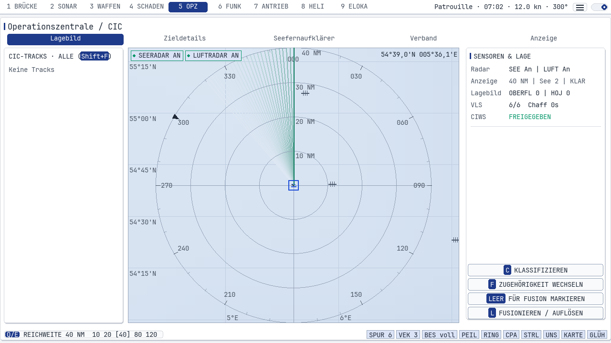

*OPZ auf der uConsole*

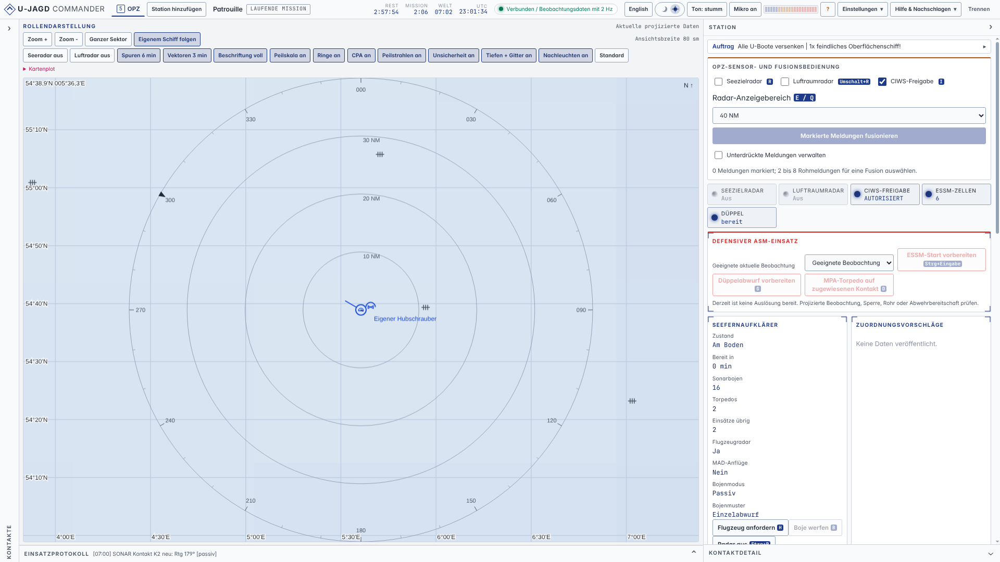

*OPZ im Remote-Crew-Browser*

```text
 NATO-Rahmenfarben (Bedienervermerk, keine Wahrheit)
   gelb = UNBEKANNT  blau = FREUND  grün = NEUTRAL  rot = FEIND

 Meldungsquellen: Radar  AIS  Sonar(freigegeben)  ESM  HFDF  Ausguck
 Trackliste:  ID  Quelle  Peilung  Entfernung  Kurs/Fahrt  Alter  Klasse
```

- **Überwasserradar:** 30 sm, begrenzt durch Radarhorizont (20-m-Mast) und Zielhöhe; getauchte U-Boote sind unsichtbar.
- **Mast- und Schnorchelechos:** ein U-Boot auf Sehrohrtiefe mit ausgefahrenem Mast oder Schnorchelkopf (Mast einer Crew, ein schnorchelndes U-Boot, eines auf Funktiefe oder das Sehrohr eines KI-Aufklärungs-U-Boots während seines Rundblicks) gibt ein winziges Echo: bei ruhiger See findet es etwa jeder zweite Umlauf auf 7 sm, bei Seegang 3 auf etwa 2,5 sm, bei Seegang 5 unter 1 sm. Es erscheint nur als bloßer Punkt, der etwa 6 s nachleuchtet, ohne Symbol, Beschriftung und Track. Den Punkt im PPI anklicken oder `B` drücken (neuester Punkt) markiert ihn: aus dieser Messung beginnt ein Radartrack `R-…`, und weitere Echos desselben Masts führen ihn fort; ohne neue Echos verblasst er nach 30 s. Echos und Markierung werden nicht gespeichert.
- **Luftradar:** 100 sm für Flugzeuge und Seezielflugkörper (ASM).
- Die Antenne dreht sich alle 4 s einmal: ein Kontakt wird nur aktualisiert, wenn der Strahl über ihn streicht, und jeder Umlauf erfasst ihn mit einer Wahrscheinlichkeit, die mit der Entfernung sinkt (50 % bei Nennreichweite für ein Schiff in Breitseite; Ziele mit spitzem Aspekt werden später gesehen, schwankende Echos können einen Umlauf verfehlen). Seegangsclutter wächst mit dem Seegang (etwa -5 % bei Seegang 4, -25 % bei 6), Regen dämpft das Echo (-10 % Überwasser, -20 % Luft); ab Seegang 5 nehmen Messfehler zu. Innerhalb 3 sm hält das Such-/Folgeradar des CIWS einen anfliegenden Flugkörper ununterbrochen, solange das CIWS freigegeben ist.
- **AIS:** zivile Schiffe senden Kurs und Fahrt alle 2-10 s (vor Anker alle 3 min) und ihren Namen etwa alle 6 min. Der UKW-Empfänger hört sie nur in Sichtlinie (etwa 20 NM). Ein Radartrack eines Zivilschiffs zeigt Name und Kurs erst, wenn die passende AIS-Meldung empfangen wurde; Radar allein liefert nur die Position. Optionaler Live-AIS/ADS-B-Verkehr ist von simuliertem Verkehr nicht unterscheidbar.
- **Fusion:** 2-8 Rohmeldungen markieren (`Leertaste`) und zu einem Bedienertrack fusionieren (`L`); `Umschalt+L` löst ihn auf. Eine Fusion, deren Meldungen von genau einem Sonarkontakt stammen, lässt sich der Waffenzentrale zuweisen; ihre Klassifizierung zählt für die Feuerleitung, solange das Sonar den Kontakt nicht selbst klassifiziert hat, und ihre Zugehörigkeit gilt für diesen Kontakt. Eine Fusion besteht nur, solange alle ihre Meldungen aktuell sind.
- **Automatische Fusion:** einmal pro Sekunde fusioniert die OPZ Meldungen verschiedener Sensoren, die übereinanderliegen, von selbst, sodass ein Schiff, das Radar, Ausguck und AIS sehen, ein Kontakt ist. Sie nutzt dieselben Grenzen wie die Zuordnungsvorschläge unten, aber nur bei eindeutiger Übereinstimmung: die Bewertung muss deutlich innerhalb der Grenzen liegen, mindestens eine der beiden Meldungen braucht eine Position (zwei reine Peilungen, etwa Sonar und ESM, werden nie automatisch fusioniert), und keine darf einen zweiten Kandidaten derselben Sensorart haben (zwei dicht beieinander fahrende Schiffe bleiben getrennt und erscheinen als Vorschlag). Eine weitere Meldung tritt auf dieselbe Weise einer bestehenden automatischen Fusion bei, bis zu 8 Meldungen. Eine automatische Fusion behält ihre Kennung, solange mindestens zwei ihrer Meldungen aktuell sind, und lässt eine erloschene Meldung fallen; mit weniger als zwei endet sie. Ihren Namen übernimmt sie von einer AIS-Meldung, wenn sie eine hat. `Umschalt+L` trennt sie, und diese Meldungen werden erst wieder automatisch fusioniert, wenn eine davon neu ist. Bei ausgefallener OPZ wird nichts fusioniert.
- **Quellen:** Meldungen in einer Fusion werden nicht mehr einzeln gelistet oder gezeichnet; die Fusion steht für sie (`H` zeigt sie mit den unterdrückten Meldungen). Jede Trackkarte endet mit Sensorkürzeln: `R` Radar, `V` Ausguck, `A` AIS, `E` ESM, `S` Sonar, `H` Hubschrauber, `B` Boje, `M` Seefernaufklärer, `F` Funkpeiler, `J` Störerpeilung, `D` Datenlink. Seite 2 zeigt für eine Fusion die vollen Namen unter *Quellen* (zum Beispiel `Radar · Ausguck · AIS`). Die Remote-Crew-OPZ-Station listet die Quellen jeder Fusion und blendet ihre Meldungen aus, solange *Unterdrückte Meldungen verwalten* nicht an ist.
- **Zuordnungsvorschläge:** die OPZ vergleicht ihre aktuellen Meldungen (höchstens 30 s alt) verschiedener Sensoren: Sonar (nur eigene Peilungen und Ortungen des Schiffs, keine Bojen und kein Tauchsonar), Radar, ESM, Ausguck und AIS. Empfangene AIS-Meldungen sind eigene OPZ-Meldungen: die gemeldete Position des Schiffs, mit seinem gemeldeten Kurs und seiner Fahrt auf jetzt gekoppelt, und sein Name, sobald die statische Meldung da ist; sie zählen, solange ihre Daten frisch sind (vor Anker bis 10 min). Zwei Meldungen, deren Peilungen vom Schiff innerhalb 1,5° plus der Peilungsunsicherheiten beider Meldungen (zusammen höchstens 8°) übereinstimmen und die, wenn beide eine Position haben, höchstens 1,5 sm plus ein Zehntel ihrer Entfernung auseinanderliegen, werden als Paar vorgeschlagen, wenn auch Bewegung und Klasse passen: geben beide einen Kurs und fährt eine mit 3 kn oder mehr, müssen die Kurse innerhalb 35° übereinstimmen; geben beide eine Fahrt, innerhalb 4 kn plus einem Viertel der schnelleren; zwei Klassifizierungen des Bedieners müssen gleich sein, und eine AIS-Meldung wird nie mit einer als U-Boot, biologisch oder Flugzeug klassifizierten Meldung gepaart. Gleiche Klassen setzen ein Paar weiter nach oben. Sonar und AIS werden nie mit einem Luftziel gepaart. Die Seitenleiste von Seite 1 zeigt die zwei besten (zum Beispiel `> K03 + R-2  Rtg 087°`); `U` fusioniert den obersten genau so, als hätten Sie beide markiert und `L` gedrückt, `Umschalt+U` verwirft ihn. Die Remote-Crew-OPZ-Station listet alle, mit Kurs- und Fahrtunterschied und ob die Klassen übereinstimmen, und den Schaltflächen *Vorschlag fusionieren* und *Verwerfen*. Es gibt höchstens 4 Vorschläge zugleich, jede Meldung nur in einem; bereits fusionierte Meldungen bleiben außen vor. Vorschläge sind Hinweise, keine Identifizierung, und werden wie Fusionen und Verwerfungen nicht gespeichert.
- **Unterdrückung:** `Entf` blendet eine Meldung lokal aus; `H` zeigt unterdrückte Meldungen wieder.

### Seefernaufklärer

Seite 3 führt einen Seefernaufklärer (MPA) auf Abruf vom nächsten eigenen Flugplatz (ohne Flugplatz kommt er vom nächsten Kartenrand). Er fliegt im Transit 300 kn und kreist mit 200 kn auf einem 3-sm-Kreis um sein Suchgebiet. Ein Einsatz dauert bis zu 5 h einschließlich 15 min Reserve; am Mindestkraftstoff fliegt er selbst zurück. Nach der Landung braucht er 30 min am Boden und fliegt dann noch einmal: 2 Einsätze je Mission mit je 16 Sonarbojen und 2 leichten Torpedos.

- Das Flugzeug hat die Tasten des Helikopters. `H` fordert das Flugzeug an (es fliegt zuerst zur Schiffsposition) oder schickt es heim.
- `W` legt das Suchgebiet auf die geplottete Position des gewählten Tracks (ohne Auswahl auf das Schiff); ein Klick in die Karte legt es auf diesen Punkt. Ein reiner Peilungstrack hat keine Position zum Anfliegen.
- `X` plant ein Bojenmuster (Feld, Sperre, Kreis) um das Suchgebiet; das Flugzeug fliegt die Punkte ab und wirft an jedem eine Boje; ab 4 sm vor dem nächsten Punkt geht es auf 200 kn, damit es auf ihn eindrehen kann. `Umschalt+X` bricht das Muster ab. `B` wirft eine Boje dort, wo das Flugzeug ist, `Umschalt+B` schaltet seine Bojen zwischen PASSIV und AKTIV.
- `Strg+R` schaltet das Seeraumradar des Flugzeugs (wie beim Helikopter). Aus 300 m sieht es Schiffe und aufgetauchte oder mit Mast fahrende U-Boote bis 60 sm (begrenzt durch den Radarhorizont); seine Kontakte erscheinen als `RADAR-MPA`-Tracks mit dem Flugzeug als Beobachter. KI-U-Boote mit ausgefahrenem Mast hören es und tauchen weg (siehe Kapitel Helikopter).
- Die Besatzung des Flugzeugs sieht wie die des Helikopters die Schaumfahne eines ausgefahrenen Masts (siehe Kapitel Helikopter); solange der Datenlink steht, erscheinen diese Sichtungen als `MPA-EYE`-Tracks.
- `Umschalt+M` beginnt oder beendet **MAD-Überflüge** (Browser: *MAD-Anflüge beginnen*/*beenden*), solange das Flugzeug unterwegs oder auf Station ist: dort geht es auf 60 m und fliegt mit 180 kn gerade Bahnen durch das Suchgebiet und kehrt 2 sm dahinter um (ein Kleeblatt). Ein getauchter Rumpf innerhalb von etwa 400 m Schrägentfernung wird mit einem zustandslosen Zug je Sekunde erfasst (sicher unter 250 m) und erreicht das Schiff per Datenlink als MAD-Ortung ohne Tiefe und Kurs auf dem Sonarkontakt dieses U-Boots. Ein Bojenmuster wird zuerst abgeflogen; `H` (heim) beendet die Überflüge.
- `D` wirft einen Torpedo auf den zugewiesenen Sonarkontakt. Es gelten dieselben Prüfungen wie beim Helikopter (aktueller, als U-Boot klassifizierter Kontakt, Einsatzregeln, unter Standard-ROE eine frische Ortung), und das Flugzeug muss höchstens 2 sm vom Datum entfernt sein.

Alles, was das Flugzeug erfährt, erreicht das Schiff nur per Datenlink bis 250 sm. Seine Bojen melden nur, solange das Flugzeug höchstens 50 sm von ihnen entfernt ist; fliegt es weg oder landet es, verstummen sie für das Schiff. Die Seitenleiste zeigt Zustand, Peilung und Entfernung, Restzeit auf Station, Vorräte, verbleibende Einsätze und wie viele seiner Bojen übertragen werden.

### Begleitzerstörer

Seite 4 (Verband) führt das Begleitschiff einer Gruppenjagd: den Zerstörer LUETJENS (Rumpfsonar, 8 ASROC, in der Jagdgruppe 2), der in Fregatten-Szenario 11 (Suchgruppe) und U-Boot-Szenario 11 (Jagdgruppe) mit der Fregatte fährt. Andere Missionen haben kein Begleitschiff, und die Seite sagt das. Der Zerstörer ist eine eigene Einheit im Datenlink (bis 100 sm): Position, Kurs, Fahrt, Befehle und Vorräte werden als Wahrheit gezeigt und auf der OPZ-Karte als eigenes Symbol mit Rufzeichen und `DL` gezeichnet; was sein Sonar hört, erreicht die Fregatte nur als Messungen.

- **Befehle:** `Y` selbständig, `F` Formation (jeder Druck schickt ihn auf den nächsten Platz 5 sm von der Fregatte: querab Steuerbord, voraus, querab Backbord, achteraus), `H` halten (4 kn auf seinem Kurs), `X` einen Punkt absuchen (er läuft mit 18 kn heran und kreist mit 10 kn in 4 sm Abstand um den Punkt, damit sein Sonar hört), `W` die geplottete Position des gewählten Tracks verfolgen (26 kn, dann ein 2-sm-Kreis mit Aktivsonar). Ein Klick in die Karte setzt den Punkt und macht aus Formation, Halten oder Selbständig ein Absuchen. Jede Befehlstaste in den Hinweisen des Felds ist auch anklickbar; seine ASROC bleibt auf `Strg+Eingabe`.
- **Selbständig:** Er hält Formation, bis das eigene Lagebild der Fregatte einen Kontakt hat, den Sie als U-Boot klassifiziert oder zugewiesen haben und der einen Standort unter 10 Minuten hat; dann verfolgt er den frischesten mit Aktivsonar.
- **Sonar:** Alle 10 s erscheinen seine Passivpeilungen auf Seite 4 als Linien vom Zerstörer aus. Sein Rumpfsonar hört ein U-Boot innerhalb 8 sm und nichts, solange er schneller als 15 kn läuft. Schneidet eine davon die eigene Passivpeilung der Fregatte auf denselben Kontakt mit 15° oder mehr und innerhalb 30 sm, erhält der Kontakt einen `CONSORT`-Standort (Unsicherheit aus beiden Peilfehlern und dem Schnittwinkel). `Umschalt+A` schaltet sein Aktivsonar: Alle 20 s ortet ein Ping jeden getauchten Kontakt innerhalb 5 sm mit Position und Tiefe (je näher, desto sicherer) als `CONSORT`-Standort; jedes U-Boot innerhalb 25 sm hört den Ping.
- **Waffen:** `Umschalt+W` schaltet Waffen frei oder gesperrt (zu Beginn gesperrt). Frei schießt er höchstens alle 3 Minuten ein ASROC auf den Standort des selbständig verfolgten Kontakts, wenn dieser jünger als 2 Minuten ist und 1 bis 12 sm vom Zerstörer liegt. `Strg+Eingabe` befiehlt ein ASROC auf den Standort des gewählten Tracks (jünger als 2 Minuten); ohne Auswahl auf den selbständig verfolgten Kontakt. Es ist immer nur eines seiner ASROC in der Luft. Solange niemand die OPZ der Fregatte besetzt (die KI führt die Fregatte), können ihm auch die Jäger ein geortetes Datum für ein ASROC schicken.

Wird der Zerstörer versenkt, melden das die Seite und das Ereignisprotokoll; die Mission geht weiter. Die OPZ im Browser hat dieselben Befehle in der Karte *Begleitzerstörer*, und ihre Karte zeigt den Zerstörer, seinen Punkt und seine Peillinien.

### Kartenanzeige

Seite 5 (Anzeige) legt fest, was die OPZ-Karte zeichnet; sie ändert nichts an der Simulation oder am Lagebild selbst und bleibt in den Einstellungen gespeichert. `↑`/`↓` wählt eine Zeile, `←`/`→` ändert sie (ein Klick auf eine Zeile schaltet weiter), `Rücktaste` stellt die gewählte Zeile auf den Standard zurück, `Umschalt+Rücktaste` alle Zeilen.

- **Spurverlauf:** aus, 3, 6 oder 12 Minuten frühere veröffentlichte Positionen hinter jedem Track (ein Punkt alle 30 s, die ältesten am blassesten; nach dem Laden beginnt er neu).
- **Vektoren:** der Bewegungsvektor zeigt die Strecke in 3, 6, 12 oder 30 Minuten.
- **Beschriftung:** voll, kurz (sechs Zeichen) oder aus.
- **Peilskala:** Striche alle 10° und Zahlen alle 30° am äußeren Radarring, mit einer Marke für den eigenen Kurs. Die Zahlen stehen immer bei ihrer Peilung; ist die Karte weit herausgezoomt, trägt nur jeder zweite Ring seine Entfernung, und eine Entfernung, die eine Peilzahl verdecken würde, entfällt, ebenso eine Zahl unter der Positionszeile.
- **Entfernungsringe**, **Peilstrahlen** reiner Peilmeldungen, **Unsicherheitskreise**, **Tiefen und Gitter** der Karte und das **Radar-Nachleuchten** lassen sich einzeln an- und ausschalten.
- **CPA Auswahl:** Beim gewählten Track mit Position, Kurs und Fahrt laufen beide bis zum Punkt der nächsten Annäherung weiter; eine Linie verbindet die beiden Punkte mit Abstand und Zeit (rot unter 2 sm). Sie nutzt nur die gemeldete Bewegung des Tracks und ist deshalb nur so gut wie diese Meldung.

Zwei Schalter oben links in der Karte schalten auf jeder Seite Seeradar und Luftradar ein und aus (wie `R` und `Umschalt+R`, mit der EMCON-Meldung an das Hauptquartier); sie leuchten, solange das Radar sendet. Die Schalter unter der Karte zeigen auf jeder Seite, welche Ebenen an sind, und schalten sie per Klick. Die OPZ im Browser hat die Radarschalter und dieselben Einstellungen als Knöpfe über ihrer Karte (nur für diesen Browser-Tab gespeichert).

### Tasten

| Taste | Funktion |
|---|---|
| `Auf / Ab` | CIC-Track wählen |
| `C` | OPZ-eigene Radar-/HOJ-Meldungen oder manuelle Fusion klassifizieren |
| `F` | NATO-Zugehörigkeit setzen |
| `Shift+F` | OPZ-Kontaktdomainfilter wechseln |
| `J` | Gemeinsame bedienersichtbare Track-ID eingeben |
| `Space / L / Shift+L` | Rohmeldungen markieren und Fusion bilden/auflösen (Umschalt+L); Treffer fusionieren automatisch |
| `U / Shift+U` | Obersten Zuordnungsvorschlag fusionieren (Umschalt+U verwirft ihn) |
| `Delete / H` | Lokal unterdrücken/wiederherstellen; H verwaltet Unterdrückte |
| `M` | CIC-Track an Sonar/Waffen übergeben |
| `Q / E` | Radarbereich 10/20/40/80/120 sm (Q weiter, E näher) |
| `<- / ->` | ASM-Track wählen |
| `Strg+Eingabe` | Seiten 1-2: ESSM starten (VLS-Zelle); Seite 3: die gewählte Waffe feuern |
| `G` | Chaff abwerfen (8 sm-Kegel, Kühlzeit) |
| `R` | Seeraumradar an/aus (EMCON) |
| `Shift+R` | Luftraumradar an/aus (EMCON) |
| `I` | CIWS-Feuerfreigabe umschalten (gesperrt = feuert nie auf anfliegende ASM) |
| `Backspace` | Seiten 1-2: alle markierten Meldungen verwerfen |
| `B` | Seiten 1-2: den neuesten rohen Radarblip als Track markieren (oder den Blip anklicken) |
| `Eingabe` | Angriff nach Feind-Einstufung eines realen Kontakts bestätigen |
| `K` | Karte folgt dem eigenen Schiff an/aus |
| `H` | OPZ Seite 3: Seefernaufklärer anfordern / heimschicken (Tasten wie beim Helikopter) |
| `W` | Seite 3: Suchgebiet auf die gewählte Spur (sonst eigenes Schiff); Klick in die Karte für einen Punkt |
| `X / Shift+X` | Seite 3: Bojenmuster um das Suchgebiet wechseln / Umschalt bricht ab |
| `B` | Seite 3: eine Boje am Flugzeug werfen |
| `Umschalt+B` | Seite 3: Bojenmodus des Flugzeugs PASSIV / AKTIV |
| `Ctrl+R` | Seite 3: Seeraumradar des Flugzeugs ein/aus |
| `Shift+M` | Seite 3: MAD-Anflüge des Flugzeugs über seinen Wegpunkt ein/aus (tief und langsamer, der Radarhorizont schrumpft) |
| `D` | Seite 3: Torpedo des Flugzeugs auf den zugewiesenen Kontakt wählen, Strg+Eingabe wirft (Flugzeug höchstens 2 sm vom Datum; nochmals: ESSM) |
| `Y / F / H` | OPZ-Seite 4 (Gruppenjagd): Begleiter selbständig / nächster Formationsplatz / halten |
| `X / W` | OPZ-Seite 4: Begleiter sucht hier / verfolgt den gewählten Track (oder Klick in die Karte) |
| `Shift+A` | OPZ-Seite 4: Aktivsonar des Begleiters an/aus |
| `Shift+W` | OPZ-Seite 4: Waffen des Begleiters frei / gesperrt |
| `Strg+Eingabe` | OPZ-Seite 4: ein ASROC des Begleiters auf den gewählten Track (Standort unter 2 min) |
| `↑/↓ ←/→` | Seite 5 Anzeige: Karteneinstellung wählen, ändern |
| `Backspace` | Seite 5: gewählte Karteneinstellung auf Standard |
| `Shift+Backspace` | Seite 5: alle Karteneinstellungen auf Standard |

### Maus

Jede Taste in der Tastenleiste am Fuß der Station lässt sich anklicken; gedrückt halten hält die Taste. Lampen, Seitenreiter und Tastenhinweise im Text sind ebenfalls anklickbar (Kapitel Werkzeuge, Maus). Außerdem:

- Ein Klick auf eine Trackkarte wählt den Track.
- Die Tastenchips auf der Zielseite weisen das Ziel zu (`M`), werfen Düppel (`G`) und schalten den ASM-Track weiter (`←`/`→`); ESSM feuert nur mit `Strg+Eingabe`.
- Seite 3: Ein Klick auf die Karte setzt das Suchgebiet des Seefernaufklärers; Seite 4: Ein Klick setzt den Punkt des Begleiters, und seine Befehlstasten im Feld sind anklickbar.
- Seite 5: Ein Klick auf eine Zeile schaltet sie weiter; die Ebenen-Chips unter der Karte und die beiden Radarschalter oben links wirken auf jeder Seite.
- Auf der Karte zoomt das Mausrad, Ziehen verschiebt (und beendet das Folgen mit `K`) und ein Klick heftet eine Kurzinfo an.

### Standardablauf

1. Radarbereich wählen (Q/E); Radare für EMCON schalten (R / Umschalt+R).
2. Tracks wählen (Auf/Ab), klassifizieren (C), NATO-Zugehörigkeit setzen (F).
3. Übereinanderliegende Meldungen fusionieren von selbst; andere mit Leertaste markieren und mit L fusionieren, Umschalt+L trennt.
4. Track an Sonar/Waffen übergeben (M).
5. Flugkörperbedrohung: Düppel (G), CIWS-Freigabe (I), dann ESSM (Strg+Eingabe).

Ablauf Luftverteidigung (Flugkörper im Anflug):

```text
  40 sm  ASM erfasst (Luftradar / ESM-Sucherpeilung)
  30 sm  ESSM-Bereich           -> Strg+Eingabe (2 Feuerkanäle)
   8 sm  Düppelkegel            -> G (40 % Zielverlust, kurz blind)
 1,5 sm  CIWS                   -> muss mit I freigegeben sein
```

1. Luftradar ein (`Umschalt+R`), ASM-Track wählen (`Links`/`Rechts`).
2. Erst Düppel und Manöver, dann ESSM. Nur 6 ESSM sind geladen.
3. CIWS freigegeben lassen, solange Flugkörper anfliegen; zurückgehaltenes CIWS feuert nie.

### Tipps für Profis

- Radar ist eine Aussendung, die feindliches ESM auffassen kann. Radare abschalten (EMCON), wenn Tarnung wichtiger ist als das Luftlagebild.
- Das Radar weiß nicht, was ein Luftkontakt ist. Die Bedrohungsbewertung markiert einen Luftkontakt nur aus seinen eigenen Messungen als möglichen Flugkörper (ASM): schneller als 300 kn in höchstens 150 m Höhe oder ein Störstrobe; ein tief und schnell anfliegendes Angriffsflugzeug kann dieselbe Markierung auslösen. Die Markierung braucht etwa eine Sekunde Plots, CIWS und ESSM bekämpfen nur markierte Tracks, und HFDF-Fixe sowie unklassifizierte Sonarkontakte tragen keine Domäne, bis Sie sie klassifizieren.
- Seezielflugkörper fliegen in etwa 20 m Höhe (auf den letzten 5 sm in 5 m): das Radar sieht sie erst innerhalb etwa 20 sm, und ein störender Flugkörper liefert bis zum Durchbrennen nur eine Home-on-Jam-Peilung (HOJ). Flugkörper fliegen trägheitsgelenkt zu ihrem Startdatum; dann muss der Suchkopf das Schiff 1,5 s in seinem Kegel haben, bevor er ansteuert. Angriffsflugzeuge steigen vor jeder Salve für einige Sekunden auf etwa 300 m, um ihr Feuerleitradar aufzuschalten (eine ESM-Warnung und ein früher Radarkontakt).
- Düppel legt neben dem Schiff eine Wolke, die in etwa 3 s aufblüht und mit dem Wind treibt; früh genug werfen, damit die Wolke aufblühen kann. Das CIWS muss erst auf den Flugkörper schwenken und trifft meist auf den letzten paar hundert Metern.
- Zugehörigkeit ist Ihr Vermerk. Ein als FREUND oder NEUTRAL markierter Kontakt, oder eine Fusion, die ihn enthält, sperrt jeden Torpedoschuss darauf.
- Kartensymbole folgen dem NATO-Stil auf der uConsole und auf jeder Remote-Crew-Karte: der Rahmen zeigt Ihre Zugehörigkeit (Feind Raute, Neutral Quadrat, Freund breites Rechteck, Unbekannt ohne Rahmen), das innere Zeichen die beobachtete Domäne.
- `J` vergibt eine gemeinsame Track-ID, die die ganze Crew (und Remote-Crew-Browser) sieht.
- `Eingabe` bestätigt einen Angriff auf einen Live-Kontakt (echter Verkehr), nachdem Sie ihn als feindlich klassifiziert haben; auf unklassifizierte Kontakte wird nie automatisch gefeuert.

### Nicht modelliert

- Die Bojen des Helikopters gehören zur Helikopterstation; die OPZ führt nur die Bojen des Seefernaufklärers.
- Der Seefernaufklärer hat kein Tauchsonar und kein eigenes ESM; er kann nicht abgeschossen werden. MAD-Überflüge gehen nur über das Suchgebiet, nicht entlang eines Tracks.
- Automatische Fusion nur bei eindeutiger Übereinstimmung von Meldungen verschiedener Sensoren mit mindestens einer Position; reine Peilungspaare und mehrdeutige Fälle warten auf den Bediener. Signaturen werden nur als Klassifizierungen des Bedieners verglichen (kein Abgleich akustischer oder Emitter-Fingerabdrücke), und AIS meldet keinen Schiffstyp.
- Keine Link-gestützte Luftraumführung befreundeter Flugzeuge.
- Der Begleitzerstörer lässt sich nicht von einer eigenen Station aus besetzen: Er hat keinen Helikopter, kein Schleppsonar und keine Torpedos, nimmt Befehle nur von der OPZ der Fregatte an, und seine Peilungen gehen nicht an Helikopter oder Seefernaufklärer. Eigene Torpedos suchen ihn nie auf (seine Datenlink-Position bleibt aus jeder Suche heraus), die Torpedos der U-Boote können ihn versenken.

## 6 Funk

### Zweck

Der Funkraum wickelt die Verbindung zum Hauptquartier und die Kurzwellenpeilung (HFDF) ab. Das Hauptquartier sendet Befehle, Wetterberichte und ROE-Änderungen per Fernschreiber. HFDF peilt U-Boote, die auf Kurzwelle senden oder schnorcheln, bis 120 sm, weit jenseits der Sonarreichweite.

### Seiten

| Seite | Zeigt |
|---|---|
| 1 HF-Ortung | HFDF-Signalkarten, Kreuzpeilungskarte, Peilrose mit Peillog und Fixes |
| 2 Meldungen | Fernschreiber mit dem Verkehr der Führung |
| 3 Aufträge | HQ-Aufträge und die eigenen Rufe an HQ |

### Anzeigen und Instrumente

Seite 1 hat drei Spalten: die aktuellen HFDF-Signale als Karten links (ein Klick wählt eines wie `↑`/`↓`), die Kreuzpeilkarte in der Mitte und die Peilrose mit Peilprotokoll und Fixen rechts; Seite 2 ist der Fernschreiber mit dem HQ-Verkehr; Seite 3 listet die HQ-Aufträge.

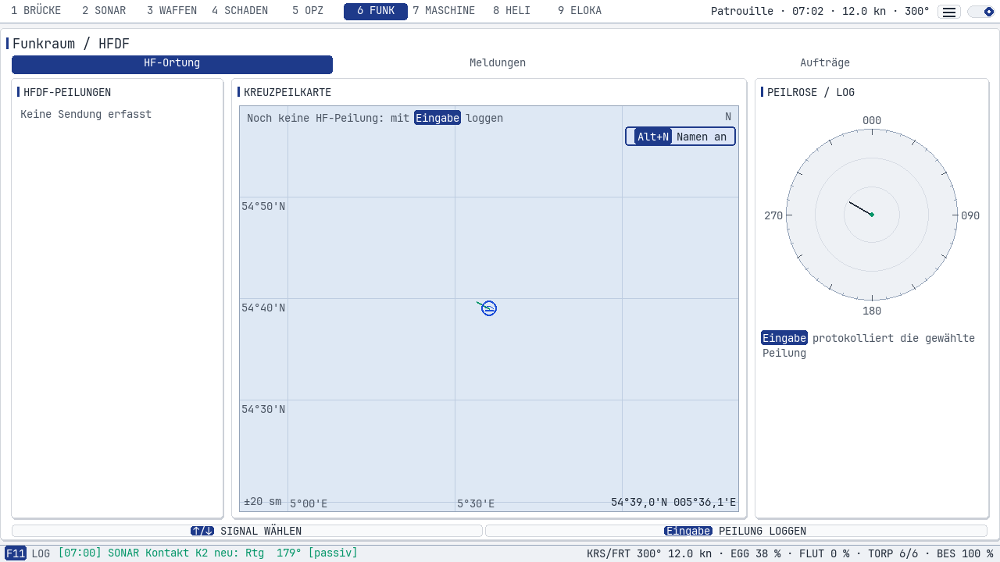

*Funkraum auf der uConsole*

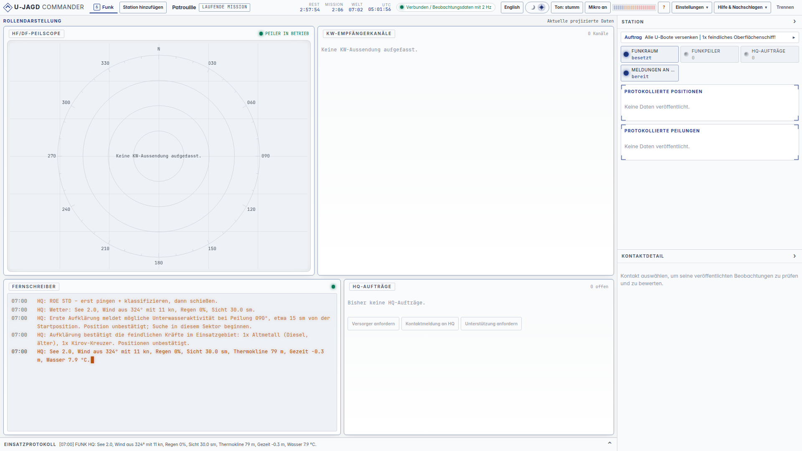

*Funkraum im Remote-Crew-Browser*

```text
 HFDF-SIGNALE               PEILPROTOKOLL
 > HF-03  247.0  Alter 12 s  HF-03 247.0 von Pos A  t=12:04
   HF-05  061.5  Alter 40 s  HF-03 239.5 von Pos B  t=12:08
                             -> KREUZPEILUNG + Fehlerellipse

   Pos A *----------__
                       --___  X  <- Fix
   Pos B *------------------/
```

- Der Peilfehler beträgt +/-8 Grad bei Bodenwelle und +/-16 Grad bei Raumwelle; Signale älter als 30 s lassen sich nicht mehr protokollieren.
- Jedes Signal zeigt Frequenz und Ausbreitung. Ein U-Boot, das eine ferne Landstation ruft, wählt tagsüber eine hohe Frequenz (Bodenwelle bis etwa 95 sm hörbar) und nachts eine niedrigere (etwa 150 sm). Jenseits der Sprungdistanz, einige hundert sm entfernt, kommt stattdessen die Raumwelle an. Ein KI-U-Boot auf Sehrohrtiefe, das das Schiff in den letzten 4 Minuten gehalten hat, meldet es alle 30 Minuten zu einem unvorhersehbaren Zeitpunkt mit einem 20-s-Ruf an seine Führung, den das HF/DF wie jeden anderen hört.
- Protokollierte Linien und Kreuzpeilungen erscheinen auf den Karten von Brücke, Waffenzentrale und Helikopter.
- Im Remote-Crew-Browser hat der Funkraum keine Karte: ein HF/DF-Peilscope (ein Strahl je Signal, die Fächerbreite ist der Peilfehler, geloggte Peilungen gestrichelt), Empfängerkanäle mit Frequenz, Ausbreitung, Signalmesser und Log-Taste sowie der Fernschreiber. Ein gewählter Kanal öffnet das Kontaktdetail zum Bewerten; geloggte Peilungen und Kreuzpeilungen stehen im Stationsbereich.
- Eine zweite Peilung desselben Signals ergibt eine Kreuzpeilung, wenn sie mindestens 1 sm entfernt von der ersten und innerhalb von 300 s genommen wird.
- Der Fernschreiber bringt außerdem alle 30 Minuten den Wetterbericht und HQ-Meldungen (Bedrohungswarnungen, ROE FREI).
- Zum Missionsbeginn meldet das HQ die Bedrohung. Bei **grober** Aufklärung nur eine ungefähre Peilung und Entfernung einer Bedrohung, bei **genauer** Aufklärung zusätzlich jeden eingesetzten feindlichen Einheitentyp mit Anzahl (zum Beispiel "1x Altmetall (Diesel, älter), 2x Luftangriffswelle mit Seezielflugkörpern"), mit den Namen aus dem Einheitenanalysator (`F8`); Positionen bleiben unbestätigt. Patrouille hat immer genaue Aufklärung, Doppeljagd und Nuklearer Abfang grobe, bei der Freien Jagd wählen Sie im Schwierigkeits-Bildschirm (letzte Zeile, "HQ-Aufklärung").

Seite 1 zeigt außerdem eine KW-Peilrose: Jedes aktuelle Signal ist ein Strahl, aufgefächert so breit wie sein Peilfehler.

Die **Kreuzpeilkarte** daneben ist das Koppelblatt des Funkraums, Norden oben, mit Gitter und Küste (in einem echten Seegebiet das Gradnetz in Grad und Minuten und unten rechts die Position des Schiffs): Jede protokollierte Peilung der letzten 5 Minuten ist eine Linie vom Ort, an dem das Schiff sie nahm (der Ursprung als kleiner Kreis), die aktuellen Auffassungen sind dünne Linien vom Schiff mit ihrem Fehlerfächer (die gewählte gelb), zwei protokollierte Peilungen desselben Signals, die sich schneiden, markieren den Schnittpunkt mit einer Raute, und jede Kreuzpeilung zeigt ihre Fehlerellipse mit Kennung und 1-Sigma-Fehler. Ältere Linien verblassen. Die Karte rahmt Schiff, alle Ursprünge und Fixe ein und zeigt ihre halbe Breite (mindestens ±20 sm); darunter stehen die neuesten Peilungen und Fixe. Sie zeigt nur, was der Funkraum gemessen und berechnet hat, nie den Sender selbst.

### HQ-Aufträge

Neben der Jagd funkt das HQ Aufträge an das Schiff: den ersten etwa 15 bis 25 Minuten nach Beginn einer eingebauten Mission, danach einen alle 25 bis 45 Minuten, höchstens sechs je Mission und zwei gleichzeitig offen (auf freier Fahrt alle 10 bis 20 Minuten ohne Obergrenze, mit dem Überwachen eines Seegebiets als sechster Art; siehe Kapitel Referenz). Eigene Missionen erhalten keine. Jedes Angebot kommt über den Fernschreiber und auf Seite 3 (Aufträge). Innerhalb von 5 Minuten mit `A` oder `Eingabe` (annehmen) oder `D` (ablehnen) antworten; keine Antwort gilt als Ablehnung. Die Brücke ruft jedes neue Angebot laut aus, mit einem kurzen Funkton. Besetzt die KI-Crew den Funkraum (Crew-Hilfe oder Autocrew), beantwortet sie ein Angebot, das 2 Minuten liegen blieb: Eine Versorgung auf See nimmt sie an, jeden anderen Auftrag lehnt sie ohne Abzug ab, weil sie das Schiff nicht dorthin steuern kann. Ein zerstörter Funkraum kann nicht antworten. Auf einem echten Seegebiet nennen HQ, Vorfallmeldungen, die Auftragsseite, protokollierte Peilungen und der ESM-Fix des U-Boots Positionen in Grad und Minuten (`54°21,4'N 010°08,2'E`), dazu wie bisher Peilung und Abstand vom Schiff, wo das HQ sie angibt; auf der stilisierten festen Karte bleiben sie in sm.

- **Seenotruf (SAR):** eine Rettungsinsel mit 2 bis 6 Personen, per EPIRB mit etwa 0,5 sm Fehler gemeldet, treibt mit Strom und Wind. Die Überlebenden halten je nach Wassertemperatur durch, von 40 Minuten in Wasser unter 8 °C bis 100 Minuten über 20 °C. Die Insel wird tagsüber auf 2 sm gesichtet (nachts 3 sm an ihrem Blitzlicht) und ist für das Radar von Schiff und Hubschrauber ein kleines Echo (bei ruhiger See einige Meilen, bei rauer See weit weniger); dann schrumpft der Kreis in der Karte auf sie. Aufnehmen, indem das Schiff 4 Minuten lang innerhalb 0,25 sm mit höchstens 3 kn liegt, oder mit der Rettungswinde des Hubschraubers (`Z` innerhalb 0,1 sm: eine Minute je Person, 6 in der Kabine, nur wenn das Wetter Tauchsonar erlaubt); die Überlebenden im Hubschrauber zählen, sobald er wieder an Deck ist (Kapitel Helikopterdeck). +600 Punkte, -400 bei Verlust.
- **Handelsschiff identifizieren:** Das HQ nennt ein Handelsschiff innerhalb 60 sm und gibt seine Position mit etwa 2 sm Fehler. Es gilt als identifiziert, sobald der Ausguck seine Identifizierung gemeldet hat oder der Helikopter bei mindestens 1 sm Sicht auf 1 sm heranfliegt. Etwa ein Drittel wird als verdächtig eingestuft: Das HQ gibt dann ein U-Boot-Datum nahe dem Schiff durch. 40 Minuten.
- **U-Boot-Datum:** ein Kreis mit 5 sm Radius aus einer Seefernaufklärer-Meldung; nicht hinter jedem Datum steckt ein U-Boot. 10 Minuten im Kreis mit Schiff oder Helikopter suchen. 50 Minuten. In den U-Boot-Missionen 8 und 9 gibt es diesen Auftrag nicht: Das HQ hat über dieses U-Boot keine Erkenntnisse.
- **Versorgung auf See:** angeboten bei weniger als 70 % Kraftstoff oder nach verbrauchten Torpedos, ASROC oder Wasserbomben; `R` auf der Seite Aufträge (im Browser *Versorger anfordern*) fordert selbst einen an, wenn mindestens 5 % Kraftstoff oder irgendein Vorrat fehlt, höchstens alle 20 Minuten nach dem Ende der letzten Versorgung. Ein befreundeter Versorger erscheint 18 bis 28 sm entfernt mit 12 kn; sein Kurs und eine Koppellinie stehen in der Karte. Innerhalb 0,3 sm und höchstens 3 kn Fahrtunterschied halten: Kraftstoff fließt die ganze Zeit (eine volle Ladung in 15 Minuten), Torpedos, ASROC, Wasserbomben, Nixie-Täuschkörper sowie CIWS- und Geschützmunition kommen in fünf Ladungen, alle 3 Minuten eine, jede ein Anteil dessen, was noch fehlt. Wer vorher abdreht, behält, was schon übergeben ist. Die Seite Aufträge zeigt, was an Bord ist. VLS-Zellen werden auf See nicht nachgeladen. +100, keine Strafe.
- **Radarstille (EMCON):** beide Radare innerhalb 90 s aus und 20 bis 30 Minuten still. +200, -250 wenn ein Radar strahlt.

Angenommene Positionen stehen in jeder Karte (auch im Remote-Crew-Browser). Die Punkte stehen in der Missionsauswertung. Der Funker im Browser antwortet mit denselben Tasten.

### Ereignisse auf See

Die See bringt eigene Überraschungen: das erste 20 bis 40 Minuten nach dem Start einer eingebauten Mission, dann alle 30 bis 50 Minuten eines, höchstens sechs je Mission (auf freier Fahrt alle 20 bis 40 Minuten ohne Obergrenze; keine in eigenen Missionen und Lektionen). Jedes kommt über den Fernschreiber.

- **Treibnetz:** Ein Fischer meldet ein 2 sm langes Netz quer zum Kurs, 3 bis 7 sm voraus, von der Oberfläche bis 20 m tief; der Funker trägt es in jede Karte als Lineal `NET n` ein, und nach einer Stunde wird es eingeholt. Wer darüber fährt, zerreißt es: Die Fischer verlangen Schadenersatz (-100 Punkte), und ein ausgebrachtes Schleppsonar oder VDS verfängt sich und wird sofort eingeholt. Ein U-Boot, das flacher als 20 m kreuzt, verfängt sich ebenfalls und ist 20 s laut, bis es sich losreißt; tiefer taucht es darunter durch.
- **Wetterfront:** HQ warnt 10 Minuten vorher; dann halten Regen, Sturm oder Nebel 30 bis 60 Minuten an (Sicht, Wind und Regengeräusch für jeden Sensor, auf beiden Seiten), und HQ meldet, wenn sie durchgezogen ist.
- **Handelsschiff ohne AIS:** Ein Frachter ohne AIS taucht 8 bis 15 sm entfernt auf; HQ meldet ihn mit etwa 2 sm Fehler und bietet ihn als Identifizierungsauftrag an, wenn weniger als zwei Aufträge offen sind.
- **Wale:** Ein Fischer meldet eine Gruppe von zwei bis vier Walen 3 bis 6 sm voraus; sie sind echte biologische Kontakte für jedes Sonar. Handelsschiffe ohne AIS und Wale aus Vorfällen bleiben auf See; sind 56 Schiffe oder 40 Tiere unterwegs, kommen keine weiteren hinzu.
- **Mann über Bord:** Ein Matrose geht neben dem Schiff über Bord; die Generalalarmglocke schlägt an, und die Karte trägt die Marke `OVERBOARD n`, die mit der Oberflächenströmung treibt. Die Brücke fährt eine Williamson-Kurve zurück und nimmt ihn auf, wenn das Schiff höchstens 0,1 sm entfernt mit höchstens 5 kn läuft; der Hubschrauber nimmt ihn auf, wenn er genau über ihm schwebt (Wegpunkt auf die Marke oder Tauchsonar ausgebracht). Gerettet gibt +100 Punkte, nach 20 Minuten im Wasser ist er verloren (-300 Punkte). Führt die KI die Brücke, steuert sie selbst auf die Marke und geht danach wieder auf 12 kn.
- **Ruderversager:** Die Rudermaschine fällt aus: 60 s klemmt das Ruder, dann steuert die Maschine vom Notruder mit halber Drehrate, bis die Rudermaschine nach 10 Minuten repariert ist.
- **Schnorchelventil und Batteriegas (U-Boot):** Auf einem dieselelektrischen U-Boot klemmt für 15 Minuten das Schnorchelkopfventil (kein Laden; das KI-U-Boot geht auf Tiefe und bleibt unten) oder es muss Batteriegas abgelüftet werden (halbe Laderate). Die Crew des besetzten U-Boots meldet beides; die Fregatte erfährt nichts davon.

Treibnetz, Front und Wale (nicht die Notfälle an Bord) gibt HQ auch in den Rundspruch an das U-Boot; ein besetztes U-Boot erfährt davon, wenn es den nächsten Rundspruch aufnimmt, und seine Crew trägt das Netz in die eigene Karte ein.

### Eigene Rufe an HQ

Auf der Aufträge-Seite kann der Funkraum HQ selbst rufen, höchstens alle 10 Minuten; die Zeile am Fuß der Auftragsliste sagt, ob ein Ruf auf Sendung ist, wie lange es bis zum nächsten dauert oder dass beide bereit sind.

- `K` **Kontaktmeldung:** sendet die Position des frischesten georteten Kontakts (Ping-, TMA-, Bojen- oder fusionierter Fix, sonst ein KW-Peilfix bis 15 Minuten alt). HQ bestätigt sie im Fernschreiber und setzt den Seefernaufklärer darauf an, wenn er in der Luft ist. HQ sagt nie, ob dort wirklich ein U-Boot war: Jede Meldung, bei der ein feindliches U-Boot innerhalb 3 sm um den Fix stand, bringt am Missionsende 150 Punkte (höchstens drei; spätere Rufe verdrängen sie nicht). Eine Meldung, die abbricht, weil der Funkraum während der 20 s ausfällt, erreicht HQ nie und bringt nichts.
- `H` **Unterstützung anfordern:** HQ schickt den bereitstehenden Seefernaufklärer zum Schiff, wenn er verfügbar ist (auch bei ausgefallener OPZ), sonst meldet es, dass keine Unterstützung verfügbar ist.
- Jeder Ruf sind 20 s KW-Sendung. Solange er auf Sendung ist, nimmt ein U-Boot mit ausgefahrener Antenne (der Mast des besetzten U-Boots, ein KI-U-Boot auf Sehrohrtiefe) eine KW-Peilung auf die Fregatte (+/-8 Grad bei Bodenwelle, +/-16 Grad bei Raumwelle): Das besetzte U-Boot erhält eine Meldung und einen Peilstrahl auf seiner Karte, ein KI-U-Boot behält die Richtung wie eine eigene Sonarpeilung (bis zu 4 Minuten) und handelt danach. Reden mit HQ kostet Funkstille.

### Tasten

| Taste | Funktion |
|---|---|
| `Auf / Ab` | Seiten 1-2: HFDF-Signal wählen |
| `Eingabe` | Peilung mit eigener Position protokollieren (auf der Seite Aufträge nimmt Eingabe den Auftrag an) |
| `Auf / Ab` | HQ-Auftrag wählen (Seite Aufträge) |
| `A / Enter` | Seite Aufträge: gewählten Auftrag annehmen |
| `D` | Seite Aufträge: gewählten Auftrag ablehnen |
| `R` | Seite Aufträge: Versorger beim HQ anfordern |
| `K` | Seite Aufträge: Kontaktmeldung an HQ (der frischeste Fix; KW-Ruf, anpeilbar) |
| `H` | Seite Aufträge: Unterstützung beim HQ anfordern (der Seefernaufklärer; KW-Ruf, anpeilbar) |

### Maus

Jede Taste in der Tastenleiste am Fuß der Station lässt sich anklicken; gedrückt halten hält die Taste. Lampen, Seitenreiter und Tastenhinweise im Text sind ebenfalls anklickbar (Kapitel Werkzeuge, Maus). Außerdem:

- Ein Klick auf eine Signalkarte wählt dieses Signal wie `↑`/`↓`.
- Auf der Seite Aufträge wählt ein Klick auf eine Auftragszeile den Auftrag; die Tastenhinweise `K` (Kontaktmeldung), `H` (Unterstützung) und die eines Versorgungsauftrags drücken ihre Tasten.

### Standardablauf

1. Fernschreiber auf Seite 2 lesen: Befehle, Wetter, ROE-Änderungen.
2. Bei KW-Aktivität das Signal wählen (Auf/Ab).
3. Peilung protokollieren (Eingabe); die Linie erscheint auf der Karte.
4. Mindestens 1 sm versetzen und binnen 300 s eine zweite Peilung nehmen.
5. Kreuzpeilung als Suchdatum an Sonar/Brücke geben.

### Tipps für Profis

- Die beiden Peilungen von Positionen quer zur erwarteten Peillinie nehmen: je rechtwinkliger sie sich schneiden, desto kleiner die Fehlerellipse.
- Ein sendendes oder schnorchelndes U-Boot ist meist flach und langsam: ein guter Moment, mit dem Helikopter heranzugehen.
- HFDF-Peilung mit einer Sonarpeilung kombinieren ergibt schnell eine Positionsschätzung.

### Nicht modelliert

- Keine freien Funksprüche: eigene Rufe an das HQ sind nur die Kontaktmeldung und die Unterstützungsanforderung, dazu die Antworten auf Aufträge; kein Fernmeldeplan und keine Kryptierung.
- Keine Frequenzabstimmung: HFDF überwacht das ganze KW-Band und listet die erfassten Signale mit ihrer Frequenz.

## 7 Maschinenraum

### Zweck

Der Maschinenraum stellt die Fahrstufe ein und verwaltet die akustische Signatur des Schiffes. Fahrt ist der wichtigste Zielkonflikt der U-Jagd: schnell, um ein Datum zu erreichen, langsam und leise, um überhaupt etwas zu hören.

### Seiten

| Seite | Zeigt |
|---|---|
| 1 Telegraph & Fahrt | Telegrafenstufen, Fahrtanzeige, Wellendrehzahl und Eigengeräusch, Zustandslampen |
| 2 Systeme | Meldetafel, Brennstoffbunker, Anzeigen für Rollen, Stampfen und Krängung, Schema der Schiffsabschnitte |

### Anzeigen und Instrumente

Der Maschinenraum ist ein Maschinenleitstand. Seite 1 zeigt den Maschinentelegraphen als Säule leuchtender Stufen, ein großes Fahrtinstrument (die befohlene Fahrt als gelbe Marke, die Schadensbegrenzung rot), Instrumente für Wellendrehzahl und Eigenlärm (Kavitationsbereich rot) und Lampen für Welle, Anlage, Kurs, Akustikmodus, Kavitation und Fahrtgrenze. Seite 2 **Systeme** hat eine Warn- und Meldetafel aus Statuslampen (dunkel, wenn aus, grün im Betrieb, gelb bei einer Warnung, rot bei einem Alarm) mit einer Sammellampe, die Alarme und Warnungen zählt, den Kraftstoffbunker als Tanksäule mit Vorrat, Verbrauch, Ausdauer und Reichweite, Instrumente für Rollen, Stampfen und Schlagseite und ein Bild der Schiffsabschnitte vom Bug zum Heck zwischen Steuerbord- und Backbordrumpf, jeder mit Wasserstand, Zustand, Wassereinbruch- und Brand-LEDs und den nummerierten Reparaturtrupps.

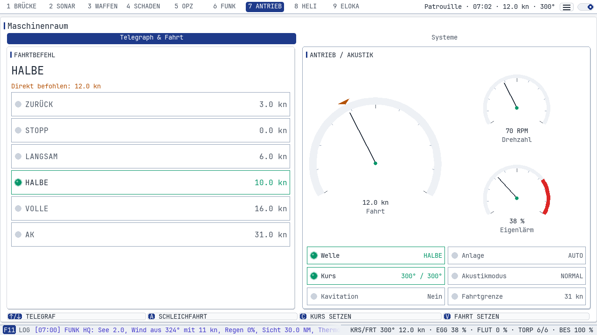

*Antrieb auf der uConsole*

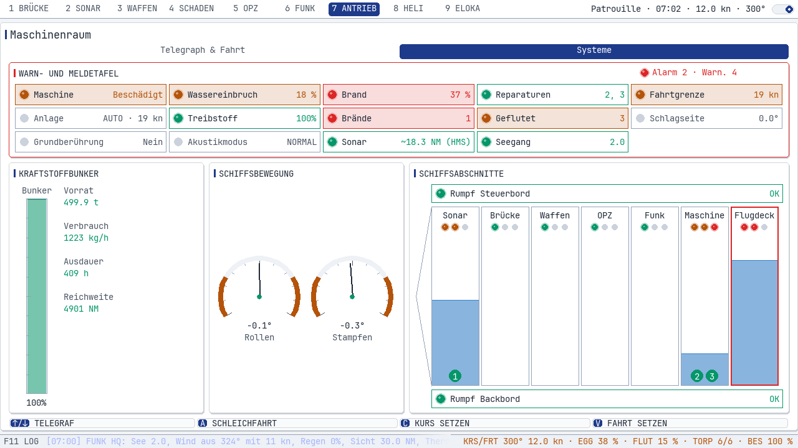

*Antrieb, Systemseite*

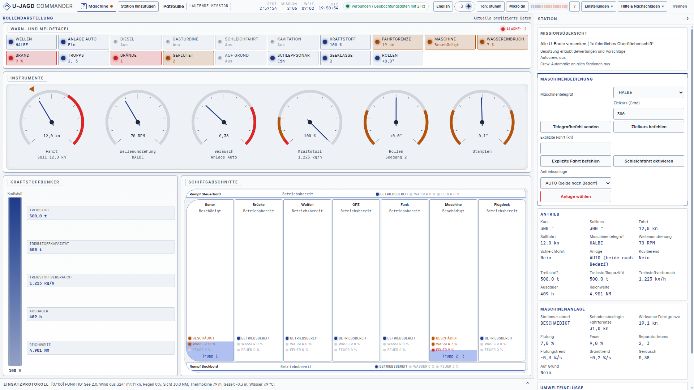

*Antrieb im Remote-Crew-Browser*

```text
 TELEGRAPH      kn     Eigenlärm
   FLANK        31     |##########|  kavitiert
   FULL         16     |#######   |  kavitiert über 15 kn
 > HALF         10     |####      |
   SLOW          6     |##        |
   STOP          0     |          |
   (ASTERN       3 kn, eigener Zustand)

 Lärm   ^                    ____ Kavitation (>= 0,85)
        |                ___/
        |           ____/
        |      ____/
        |_____/
        +----+------------+--------+---> kn
             4           15        31
```

- Der Eigenlärm steigt linear von 4 kn bis 31 kn. Die Schrauben kavitieren, wenn die Flügelspitzengeschwindigkeit für den Wasserdruck an den Schrauben zu hoch ist: bei ruhiger See ab 15 kn, bei schwerer See früher, wenn das Stampfen das Heck anhebt. Kavitation hebt den Lärm auf mindestens 0,85 und senkt die passive Sonarreichweite auf 35 %.
- Die Lampe der befohlenen Stufe leuchtet (ZURÜCK gelb). Liegt eine Direktfahrt (`V` auf der Brücke) zwischen zwei Stufen, nennt eine Warnzeile die befohlene Fahrt, damit HALF 10 kn bei befohlenen 12 kn nicht mit HALF verwechselt wird.
- Modus LEISE senkt den Eigenlärm auf 65 % und begrenzt die Fahrt auf 12 kn.
- Anlagenwahl (`G`): AUTO fährt die Anlage wie bisher. DIESEL ist die leise Anlage (Eigenlärm etwa -4 dB, Brennstoff -10 %), begrenzt aber auf 18 kn; TURBINE gibt volle Fahrt bei etwa +3 dB und +25 % Brennstoff. Die Wahl steht auf Seite 2 und im Maschinenraum des Browsers.
- Die Wellendrehzahl folgt dem Festpropeller: bei konstanter Fahrt etwa 5,8 U/min je Knoten (146 U/min bei 25 kn, 181 U/min bei 31 kn Höchstfahrt). Beim Beschleunigen hält das Fahrprogramm die Welle höchstens etwa 11 U/min vor der aktuellen Fahrt; beim Abbremsen wird die Steigung umgesteuert und die Welle läuft mit 20 U/min im Leerlauf. Die eigene Blattlinie im LOFAR (Wellenfrequenz x 5 Blätter) wandert mit der Fahrt.
- Maschinenschaden begrenzt die Fahrt auf 15 kn (beschädigt) oder 8 kn (zerstört).
- Der Kraftstoffverbrauch folgt der abgegebenen Propellerleistung: bei konstanter Fahrt wächst er mit der dritten Potenz der Fahrt, Beschleunigen und Bremsen kosten zusätzlich. Ein leichteres Schiff (verbrauchter Kraftstoff) beschleunigt etwas schneller; Flutwasser macht es langsamer und tiefer. Schwere See erhöht den Widerstand und kostet bei FULL bis etwa 1 kn. Mit leeren Tanks steht die Welle, und kein Maschinenbefehl wird angenommen.
- **Maschinenleitstand (Browser):** im Browser ist die Bildfläche des Maschinenraums ein Maschinenleitstand. Eine **Warn- und Meldetafel** aus Statuslampen (dunkel, wenn aus, türkis im Betrieb, gelb bei einer Warnung, rot blinkend bei einem Alarm, jede mit ihrem Wert) zeigt Wellen, Anlage Auto, Diesel, Gasturbine, Schleichfahrt, Kavitation, Kraftstoff, Fahrtbegrenzung, Zustand der Maschinenanlage, Wassereinbruch und Brand im Maschinenraum, Reparaturtrupps, Brände und geflutete Abschnitte an Bord, Grundberührung, Schleppsonar, Seegang und Rollwinkel; die Sammellampe im Schild zählt Alarme und Warnungen. Darunter stehen runde **Instrumente** für Fahrt (die befohlene Fahrt als gelbe Marke, die Schadensbegrenzung rot), Wellendrehzahl, Eigenlärm (Kavitationsbereich rot), Kraftstoff, Rollen und Stampfen, der **Kraftstoffbunker** mit Vorrat, Fassungsvermögen, Verbrauch, Ausdauer und Reichweite und die **Schiffsabschnitte** vom Bug zum Heck zwischen den Rumpfstreifen Steuerbord und Backbord, jeder mit Wasserstand, Zustand, Wassereinbruch- und Brandlampe und den arbeitenden Trupps. Der Leitstand zeigt nur an; die Befehle bleiben im Stationsbereich rechts.

### Tasten

| Taste | Funktion |
|---|---|
| `+ / -` | Motorenbefehl (Telegraph) |
| `Auf / Ab` | Telegraph hoch / runter |
| `A` | Akustikmodus LEISE/NORMAL |
| `G` | Antriebsanlage: AUTO, DIESEL (18 kn, -4 dB) oder TURBINE (+3 dB, +25 % Brennstoff) |
| `C` | Direkten Zielkurs eingeben (000-359) |
| `V` | Direkte Zielgeschwindigkeit eingeben (0-31 kn) |

### Maus

Jede Taste in der Tastenleiste am Fuß der Station lässt sich anklicken; gedrückt halten hält die Taste. Lampen, Seitenreiter und Tastenhinweise im Text sind ebenfalls anklickbar (Kapitel Werkzeuge, Maus). Außerdem:

- `+` oder `-` in der Tastenleiste gedrückt halten schaltet den Telegrafen; die Lampen drücken ihre Tasten.

### Standardablauf

1. Fahrstufe mit Auf/Ab oder +/- wählen; V gibt eine genaue Fahrt ein.
2. Beim Horchen unter 15 kn bleiben: Kavitation überdeckt das Sonar.
3. Für den Angriffsanlauf LEISE schalten (A, max. 12 kn).
4. Mit ausgebrachter TAS nie über 20 kn fahren.
5. Maschinenschäden beachten: Fahrtgrenzen 15 bzw. 8 kn.

### Tipps für Profis

- Fahrtänderungen dauern Minuten; vor einem Horchschlag früh verlangsamen.
- Das Schleppsonar lässt sich nur zwischen 3 und 12 kn ausbringen oder einholen; über 20 kn mit Kabel draußen geht es verloren.
- Ein feindliches U-Boot hört Sie besser als Sie es, wenn Sie kavitieren. Nur sprinten, wenn der erwartete Kontakt weit entfernt ist.

### Nicht modelliert

- Keine Einzelwellensteuerung; die Anlagenwahl gilt für beide Wellen.

## 8 Helikopterdeck

### Zweck

Der HSP-5 „Sea Lynx" verlängert den Arm der Fregatte: er fliegt mit 120 kn zu einem Datum, wirft Sonarbojen, taucht sein eigenes Sonar und greift mit Leichttorpedos an, während die Fregatte leise und außerhalb der Torpedoreichweite bleibt.

### Seiten

Die Station hat vier Seiten (nochmals `8` blättert); sie öffnet auf Seite 3.

| Seite | Inhalt |
|---|---|
| 1 Status | Statuskonsole: Zustandslampen, Kraftstoff, Peilung zum Schiff, Zuladung, Flugwetter, Deckbewegung |
| 2 Einsatzregeln | Peilung und Abstand zum Wegpunkt, Treibstoffreserve für den Rückflug, Tasten für Start, Tauchen und Waffen, Bojenmuster, MAD, Radar, ROE |
| 3 Sonar | Kontakte von Tauchsonar und Bojen, Tiefe, Quelle |
| 4 Akustik | Abhören: BROADBAND / LOFAR / DEMON des Tauchsonars oder einer passiven Boje |

### Anzeigen und Instrumente

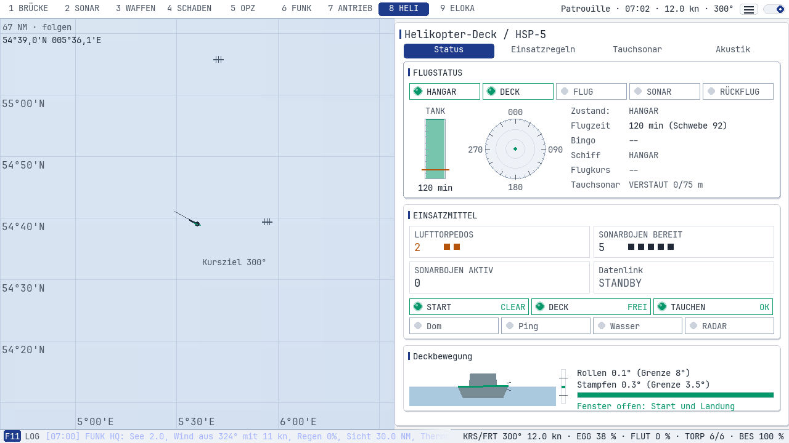

*Heli-Deck auf der uConsole*

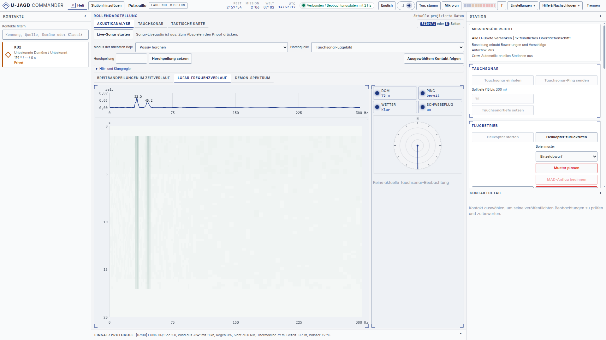

*Heli-Deck im Remote-Crew-Browser*

Im Browser hat der Helikopter auf der Bühne drei Seiten: *Akustikanalyse* (BREITBAND, LOFAR und DEMON der Bojen und des Tauchsonars), *Tauchsonar* (das genordete Bild des Tauchsonars über die ganze Bühne, Ringe bei 5, 10, 15 und 20 sm, daneben Wassertiefe, Sprungschicht und die Werte jedes Kontakts) und *Taktische Karte* (die Karte über die ganze Bühne). `Bild auf`/`Bild ab`, nochmals die Stationsnummer `8` oder der Tastenchip neben den Reitern blättern zwischen ihnen.

```text
         Fregatte                           Wegpunkt (1-30 sm)
            *----------- 120 kn -------------->  H  Schweben + Tauchen
                                                 |
   Bojenlinie (B):  o ---- o ---- o              |  Kabel 15-300 m
   PASSIV: Peilungen;                            )))  Tauchsonar
   zwei Kreuzpeilungen (>= 10 Grad) = Fix           passiv 18 sm
   AKTIV: Entfernung + Peilung alle 30 s            aktiv  14 sm
```

- **Kraftstoff:** 2 Stunden im Vorwärtsflug; im Schwebeflug (Tauchsonar) verbraucht er 1,3-mal so schnell. Der Helikopter kehrt automatisch zurück, wenn nur noch die 20-Minuten-Reserve bleibt. Leerfliegen vor der Landung kostet die Maschine. Im Schwebeflug drückt ihn der Wind etwas von seinem Schwebepunkt nach Lee.
- **Startvorbereitung:** Der Hubschrauber steht nie sofort bereit. `H` (Browser: *Helikopter starten*) beginnt 5 Minuten Startvorbereitung im Hangar (Checks, Treibstoff, Waffen, Besatzungseinweisung); der Zustand zeigt STARTVORBEREITUNG mit der Restzeit, die HANGAR-Lampe leuchtet gelb. Danach hebt er im nächsten Startfenster ab; bis dahin zeigt der Zustand STARTBEREIT, WARTET. Ein zweites `H` (Browser: *Startvorbereitung abbrechen*) bricht die Vorbereitung ab. Nach jeder Landung braucht der nächste Start wieder die volle Vorbereitung, also früh befehlen. Auch die KI-Fregatte wartet sie ab.
- **Tanken:** Zu Missionsbeginn ist der Tank voll. Nach einer Landung behält der Hubschrauber den Kraftstoff, mit dem er zurückkam, und wird an Deck betankt: 15 Minuten von leer bis voll (8 Minuten Flugzeit je Minute an Deck). Der Zustand zeigt TANKEN mit der Zeit bis zum vollen Tank, die HANGAR-Lampe leuchtet gelb. Ein Startbefehl wartet nicht auf den vollen Tank: Der Hubschrauber hebt nach der Vorbereitung mit dem bis dahin getankten Kraftstoff ab, aber nie mit weniger als 30 Minuten (Reserve plus 10 Minuten); fehlt so viel, zeigt er TANKEN mit der Zeit bis zu diesem Minimum. Torpedos und Bojen werden nicht nachgeladen: Was an Bord ist, ist die Ladung der ganzen Mission. Die KI-Fregatte tankt genauso.
- **Startgrenzen:** Wind bis 32 kn, Seitenwind bis 22 kn, Sicht mindestens 2 sm, Seegang höchstens 5, einsatzbereites Flugdeck, Böen bis 40 kn, Wolkenuntergrenze mindestens 300 ft, keine starke Vereisung und ein ruhiges Deckfenster: Rollen höchstens 8 Grad und Stampfen höchstens 3,5 Grad für eine ruhige Phase von mindestens 6 s. Leichte Vereisung kostet 20 % mehr Treibstoff; die Wetter- & Sonar-Analyse (`0`) zeigt CLEAR, LIMITED oder NO-GO. Auch die Landung wartet auf ein solches Fenster. Seite 1 zeigt neben den Einsatzmitteln die **Deckbewegung**: das Heck von achtern gesehen, wie es gegen den Horizont rollt, einen Stampfbalken mit seinen Grenzen und einen Balken, der sich während der ruhigen Phase füllt (grün: Fenster offen, gelb: innerhalb der Grenzen, aber noch nicht lange genug ruhig, rot: außerhalb). Mit Fahrt gegen die See stampft das Schiff stärker (es trifft die Wellen schneller), mit der See von querab rollt es; weniger Fahrt und die See etwas seitlich vom Bug geben die meisten Fenster, das kostet aber Zeit bei der Jagd.
- **Tauchsonar:** Tiefe 15-300 m (Standard 75 m, mindestens 10 m über Grund), passiv 18 sm mit +/-2 Grad, aktiver Ping 14 sm mit 30 s Abklingzeit. Tauchen braucht Wind bis 30 kn, 1 sm Sicht und keine Vereisung.
- **Sonarbojen:** 5 je Einsatz, 8 sm Reichweite, 60 min Batterie; sie treiben mit der Strömung und etwas mit dem Wind. PASSIV-Bojen liefern Peilungen (wie DIFAR); AKTIV-Bojen liefern Entfernung und Peilung alle 30 s (wie DICASS).
- **Bojenmuster:** mit `X` wird ein Muster geplant: eine Folge von Abwurfpunkten um den Wegpunkt: ein 2x2-Feld (Abstand 1,5 sm), eine Sperre quer zur Peilung vom Schiff zum Wegpunkt (Abstand 3 sm) oder ein Kreis von 1,5 sm Radius, jeweils mit bis zu 4 Bojen des Restvorrats. Der Helikopter fliegt die Punkte nacheinander an und wirft an jedem die gewöhnliche Einzelboje (in der gewählten Betriebsart); EINZELN löscht die Folge, der Rückflug verwirft sie.
- **MAD-Anflug:** mit `Umschalt+M` und eingeholtem Tauchsonar geht der Helikopter auf 30 m und 90 kn. Ein getauchter Rumpf innerhalb von etwa 400 m Schrägdistanz wird je Sensortakt mit einem zustandslosen Zufallszug erfasst (sicher innerhalb 250 m) und als MAD-Positionsfix ohne Tiefe oder Kurs gemeldet; er zählt für die Entfernungsprüfung der Waffen und, sobald der Helikopter seinen Kontakt freigibt, für die OPZ.
- **Seeraumradar:** sucht, solange der Helikopter fliegt und das Tauchsonar eingeholt ist (Statuszeile auf Seite 2). Aus 150 m sieht es Schiffe bis 40 sm, aufgetauchte U-Boote sowie ausgefahrene Schnorchel oder Sehrohre innerhalb seines Radarhorizonts (etwa 30 sm). Ein Mast ist klein: bei ruhiger See zeigt er sich auf etwa 10 sm, bei Seegang 3 auf 3-5 sm, bei Seegang 5 verschwindet er im Seegangsecho. Jeder Kontakt geht als `RADAR-HELO`-Track mit dem Helikopter als Beobachter an die OPZ, ein Blick alle 2 s. Das ESM eines besetzten U-Boots hört das Radar und kann seine Besatzung warnen. `Strg+R` (wie beim Seefernaufklärer; Browser: *Radar ausschalten*/*einschalten*) schaltet das Radar aus und wieder ein; ausgeschaltet sieht es nichts und strahlt nicht, und es bleibt aus (gespeichert), bis es wieder eingeschaltet wird. Ein KI-U-Boot mit ausgefahrenem Mast oder Schnorchel hört ein Flugzeugradar innerhalb von 40 sm (im Radarhorizont seines Masts) bei vier von fünf Blicken im 5-s-Takt, geht 40 m unter Schnorcheltiefe und schiebt das Schnorcheln 15 Minuten auf, solange seine Batterie mehr als 5 % hält; ein strahlender Helikopter drückt Schnorchler also weg, ein stiller kann sie an der Oberfläche erwischen.
- **Augen der Besatzung:** Solange der Helikopter fliegt, hält auch seine Besatzung Ausguck, mit dem Kontrastmodell des Brückenausgucks aus der Flughöhe (150 m, beim Tauchen 20 m): die Schaumfahne eines ausgefahrenen Sehrohrs oder Schnorchels sieht sie auf dieselbe Entfernung wie der Ausguck, unabhängig vom Radar und ohne zu strahlen. Die Sichtung geht alle 2 s als `HELO-EYE`-Track an die OPZ, auf die halbe Entfernung als U-Boot.
- **Leichttorpedo:** 2 je Einsatz, 45 kn, 6 sm, von der Helikopterposition Richtung Datum geworfen, ohne Draht. Das Ziel muss als U-Boot klassifiziert sein.
- **Rettungswinde:** Überlebende einer Rettungsinsel kommen nur auf Befehl hoch. Zur Insel fliegen (ein Klick auf ihren SAR-Kreis setzt den Wegpunkt dorthin); innerhalb 0,1 sm startet `Z` (Browser: *Winde starten*) die Winde. Der Windenführer lotst dann den Piloten über die treibende Insel, und sobald der Hubschrauber über ihr steht (auf etwa 40 m), winscht die Winde einen Überlebenden pro Minute auf. Die Kabine fasst 6; die Winde stoppt, wenn die Insel leer oder die Kabine voll ist. Die Winde braucht Tauchwetter (Wind bis 30 kn, Sicht 1 sm, keine Vereisung) und eingeholtes Tauchsonar, und der Schwebeflug verbraucht 1,3-mal so viel Kraftstoff. Als gerettet zählen die Überlebenden erst, wenn der Hubschrauber wieder an Deck ist (`H`): bis dahin sitzen sie in der Kabine und gehen mit dem Hubschrauber verloren. `Z` noch einmal stoppt die Winde.
- **Rettungsinseln im Radar:** Eine Insel mit Radarreflektor ist ein kleines Ziel (ein halbes Prozent des Echos eines Schiffes, etwa 1 m hoch). Das Radar des Hubschraubers sieht sie bei ruhiger See auf etwa 6 sm, bei Seegang 3 auf 1,5 bis 2 sm und bei Seegang 5 nur noch auf wenige Kabellängen; das Überwasserradar des Schiffes etwas weniger. Das erste Echo setzt den SAR-Kreis des Funkers (0,3 sm) darauf und wird im Protokoll gemeldet (`Radar: kleines Echo bei SAR 1`); weitere Echos halten ihn dort, bis der Ausguck die Insel in Sicht hat.

Seite 1 ist die Statuskonsole des Hubschraubers. Eine Leiste Zustandslampen zeigt, wo er ist: HANGAR (gelb während der Startvorbereitung und beim Tanken), DECK (grün, wenn er jetzt starten darf, gelb, solange Wetter oder Deckbewegung ihn halten, rot bei ausgefallenem Flugdeck), FLUG (rot, wenn er verloren ist), SONAR (Tauchsonar im Wasser, gelb beim Fieren und Hieven) und RÜCKFLUG.

Darunter ein Tank mit der 20-Minuten-Reserve als gelbe Marke (im Hangar füllt er sich beim Tanken; der Tooltip über dem Status nennt, worauf der Hubschrauber wartet), eine Rose mit der Peilung zurück zum Schiff und der Kursnadel des Hubschraubers sowie Anzeigen: Zustand, Flugzeit (und im Schwebeflug, der 1,3-mal so viel verbraucht), Bingo (Kraftstoff nach Heimflug und Reserve), Peilung, Entfernung und Flugzeit zurück zum Schiff, Flugkurs sowie Zustand und Tiefe des Tauchsonars. Die Einsatzmittel zeigen Torpedos und Bojen an Bord als Punkte, die Bojen im Wasser und den Datenlink, dann Lampen für das Flugwetter (CLEAR, LIMITED oder NO-GO), das Deckfenster, das Tauchwetter, Dom, Ping, Wassereintritt und Radar. Die Deckbewegungsanzeige steht ganz unten; in einem kleinen Fenster oder bei großer Schrift weichen erst die untere Lampenreihe und dann diese Anzeige. Solange der Hubschrauber fliegt und eine Rettungsinsel wartet oder Überlebende in der Kabine sind, nimmt das Feld **Rettungswinde** den Platz dieser Anzeige ein (bei großer Schrift den der Einsatzmittel): die Windenlampe `Z` mit ihrem Zustand (keine Insel, bereit, geht drüber, winscht, Wetter, zum Schiff), die Kabine (zum Beispiel 5/6 an Bord), ein Balken für den Überlebenden, der gerade hochkommt, und eine Zeile mit dem nächsten Schritt. Der Browser zeigt dasselbe als Karte *Rettungswinde*.

Seite 3 zeigt das Tauchsonar wie eine Konsole: Lampen für Dom (grün im Wasser, gelb beim Fieren oder Hieven), Ping bereit und Wassereintritt frei, eine Seitenansicht des Tauchens (graue Luft mit dem Hubschrauber oben, eine kräftige blaue Wasserlinie, darunter das mit der Tiefe dunklere Wasser, die Sprungschicht als gelbe Linie und der Dom an seinem Kabel; der Browser zeichnet sie neben dem Tauchsonar-Sichtgerät) und ein Sichtgerät mit den Peilungen von Tauchsonar und Bojen als Keile so breit wie ihr Fehler. Seite 4 zeichnet ihre Wasserfälle in denselben Leuchtfarben wie das Sonar des Schiffs.

### Tasten

| Taste | Funktion |
|---|---|
| `H` | HSP-5 starten (5 min Vorbereitung, tankt an Deck) / abbrechen / zurückrufen |
| `Pfeiltasten` | Wegpunktpeilung und -entfernung einstellen |
| `W` | Wegpunkt auf die Position des gewählten Kontakts (wie W beim Seefernaufklärer) |
| `M` | Sonarkontakt als Ziel für Lufttorpedo setzen |
| `B` | Eine Sonarboje an aktueller Position aussetzen |
| `Umschalt+B` | Modus der nächsten Boje PASSIV / AKTIV |
| `X` | Bojenmuster: einzeln, 2x2-Feld, Sperre quer zur Wegpunktpeilung, Kreis (X erneut: nächstes; einzeln löscht) |
| `Shift+M` | MAD-Anflug ein/aus: tief und langsam, Tauchsonar eingeholt |
| `Ctrl+R` | Suchradar ein/aus (aus: das ESM eines U-Boots hört es nicht, es findet aber auch keine Masten) |
| `Z` | Rettungswinde über einer Insel (bis 0,1 sm) an/aus |
| `T` | Sensorquelle: Tauchsonar / Sonarbojen |
| `F` | Gewählten Hubschrauberkontakt bestätigen / aufheben |
| `C` | Kontakt klassifizieren (U-Boot / Kampfschiff / Biologisch / Fahrzeug / Flugzeug / Torpedo) |
| `G` | Gewählten Kontakt an die OPZ freigeben oder zurückziehen (wie am Sonar) |
| `Shift+↑ / ↓` | Nächsten Tauchsonarkontakt wählen (Pfeile allein steuern den Wegpunkt) |
| `Y` | Hubschrauber-Tauchsonar absenken / einholen |
| `U / V` | Solltiefe des Tauchsonars heben / senken |
| `Shift+A` | Aktiven Ping vom abgesenkten Tauchsonar senden |
| `Strg+Eingabe` | Leichttorpedo abwerfen |
| `Q / E` | Karte in Stufen zoomen, 500 bis 0,5 sm |
| `K` | Karte folgt dem eigenen Schiff an/aus |
| `Akustik: Bild Auf / Ab` | Akustikseite: Breitband / LOFAR / DEMON |
| `Akustik: ← / →` | Hubschrauber-Horchpeilung -/+ 5 Grad |
| `Akustik: R` | Horchpeilung auf automatisch zurücksetzen |
| `Akustik: T` | Horchquelle: Tauchsonar / passive Bojen |
| `Akustik: J \| , / .` | Empfangston an/aus \| Lautstärke senken/erhöhen |
| `Akustik: I / O` | Gain senken / erhöhen (3 dB) |
| `Akustik: N` | Notchfilter gegen Eigenantrieb |
| `Akustik: Umschalt+D` | Abhörmodus Breitband / gefiltert / Überlagerung |
| `Akustik: Umschalt+F` | Abhör-Frequenzband wechseln |

Mit „Akustik" markierte Tasten gelten nur auf der Akustikseite (Seite 4).

### Maus

Jede Taste in der Tastenleiste am Fuß der Station lässt sich anklicken; gedrückt halten hält die Taste. Lampen, Seitenreiter und Tastenhinweise im Text sind ebenfalls anklickbar (Kapitel Werkzeuge, Maus). Außerdem:

- Auf Seite 2 sind die in den Regeln genannten Tasten (`H`, `Y`, `U`/`V`, `Umschalt+A`, `B`, `D`, `Umschalt+B`, `Umschalt+M`, `Strg+R`) Schalter: Ein Klick drückt sie.
- Auf Seite 1 ist die Windenlampe im Feld Rettungswinde ein Schalter für `Z`.
- Auf der Akustikseite schaltet ein Klick auf die Quellenangabe die Hörquelle um.
- Auf der Karte zoomt das Mausrad, Ziehen verschiebt (und beendet das Folgen mit `K`) und ein Klick heftet eine Kurzinfo an.

### Standardablauf

1. Wettergrenzen und Kraftstoff prüfen (nach einer Landung 15 min Tanken an Deck); Start früh befehlen (H): 5 min Vorbereitung.
2. Wegpunkt vor das vermutete Ziel legen (Pfeiltasten).
3. Passive Bojenlinie werfen (B); für Entfernung AKTIV wählen (Umschalt+B).
4. Schweben und tauchen (Y), Tiefe unter die Schicht (U/V), horchen oder pingen (Umschalt+A).
5. Klassifiziertes U-Boot: Ziel setzen (M), Torpedo werfen (D); rechtzeitig zurückrufen.

Angriffsablauf:

1. Mit zwei passiven Bojen oder einem Ping von Aktivboje/Tauchsonar orten, bis der Kontakt eine frische Position hat.
2. Als U-Boot klassifizieren (`C`) und als Ziel setzen (`M`).
3. Zum Datum fliegen; Torpedo werfen (`Strg+Eingabe`; `D` an der Waffenstation wählt dafür den Lufttorpedo). Kontakt halten für einen zweiten Wurf.

### Tipps für Profis

- Das Tauchsonar unter die Schicht legen, um tiefe U-Boote zu hören. Die Tauchanzeige zeigt die Schicht am Helikopter erst, wenn der abgesenkte Dom sie durchfahren hat; vorher nur die Kartentiefe.
- Bojen vor den geschätzten Zielkurs legen, nicht auf das letzte Datum.
- `F` bestätigt einen Helikopterkontakt; `G` gibt ihn wie am Sonar an die OPZ frei; `Umschalt+↑`/`Umschalt+↓` wählen den nächsten Tauchsonarkontakt; `W` legt den Wegpunkt auf die Position des gewählten Kontakts (wie `W` beim Seefernaufklärer; ein reiner Peilkontakt hat keine). Ein Klick in die Karte (uConsole und Browser, auch auf ein Symbol oder eine Beschriftung, nur ein Sonarkontakt wählt diesen Kontakt) legt den Wegpunkt genau auf diesen Punkt; die Karte zeigt ihn als HSP-5 WP mit einer gestrichelten Linie vom Hubschrauber. Der Hubschrauber wird im Anflug langsamer und bleibt auf dem Punkt stehen (auf etwa 20 m); die Pfeiltasten verschieben den Wegpunkt weiter in Schritten von 15 Grad und 1 sm vom Schiff aus.
- Auf der Akustikseite schaltet `T` die Horchquelle zwischen Tauchsonar und jeder passiven Boje.
- Den Helikopter rechtzeitig zurückrufen (`H`): die Landung braucht ein einsatzbereites Flugdeck, und die Zuladung wird zwischen Einsätzen nicht ergänzt.

### Nicht modelliert

- Keine Kanalverwaltung für Bojen.
- Das Helikopterradar kennt keine Leistungs- oder Sektoreinstellung, nur ein und aus; ein KI-U-Boot hört es nur mit ausgefahrenem Mast oder Schnorchel.
- Nur ein Helikopter.

## 9 EloKa

### Zweck

Die Elektronische Kampfführung (EloKa) horcht passiv auf Radarsender (ESM) und stört sie auf Befehl (ECM). ESM erfasst Radare bis etwa 150 sm, weit jenseits des eigenen Radars, ohne selbst zu senden. Sie liefert Peilungen und Senderparameter, die auf einen Plattformtyp hinweisen, und warnt, wenn ein Flugkörpersucher aufschaltet.

### Seiten

| Seite | Zeigt |
|---|---|
| 1 Auffassungen | Auffassungskarten, Bedrohungsrose mit Listenschaltern, die gewählte Auffassung, Lampen für ESM, Störsender, automatisches ECM und Ton |
| 2 Evidenz | Volle Evidenz der gewählten Auffassung: Frequenz, PRF, Modulation, Kandidaten, Korrelation |

### Anzeigen und Instrumente

Beide Seiten zeigen die Erfassungen links als Karten (Kennung mit Gruppengröße, Einstufung oder Modulation, Peilung, Frequenz und Band, Güte und Alter; der Streifen trägt die Bedrohungsfarbe; ein Klick wählt eine wie `↑`/`↓`). Seite 1 hat in der Mitte die Bedrohungsrose mit den vier Listenschaltern und rechts die gewählte Erfassung (Signal-Fingerabdruck, Peilung, Radarart, Bedrohung, ECM, Zuordnung, beste Bibliothekskandidaten) über den Lampen für ESM, Störer, ECM-Automatik und Ton; Seite 2 zeigt alle Belege für die gewählte Erfassung (Frequenz, PRF, Modulation, Kandidaten, Korrelation).


*ELOKA auf der uConsole*

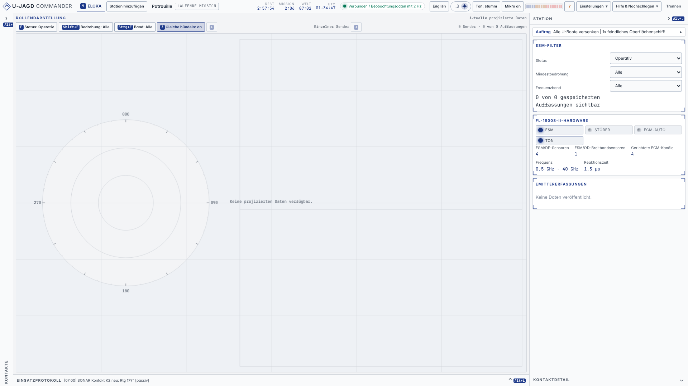

*ELOKA im Remote-Crew-Browser*

```text
 ERFASSUNGEN                      Status  Bedroh. Band
 > E-07  Pg 312  9,3 GHz  PRF 2,4k  NEU     HOCH    X
   E-04  Pg 045  3,0 GHz  PRF 1,0k  TRACK   NIEDRIG S

 BELEGE E-07
   Frequenz 9,3 GHz   PRF 2400 Hz   Modulation Puls-Doppler
   Kandidaten (gerankt, nicht identifiziert):
     1. Flugkörpersucher     2. Feuerleitradar
   Korrelation: vereinbar mit OPZ-Track T-12 (Zeit/Peilung)
```

- Die Peilgenauigkeit beträgt etwa +/-3 Grad. Erfassungen sind Peilungen, keine Positionen.
- Ein drehendes Suchradar trifft die ESM-Antenne einmal je Umlauf mit der Hauptkeule; seine Nebenkeulen sind nur aus der Nähe hörbar. Die Belegseite zeigt den Spitzenpegel, eine Entfernungsschätzung unter Annahme der Leistungsklasse des besten Kandidaten (ein falscher Kandidat ergibt eine falsche Entfernung) und die gemessene Antennenumlaufzeit.
- Standardmäßig (Realismusstufe Standard oder Realistisch, `F10`) zeigt die Belegseite nur die gemessenen Parameter und eine Bibliotheksabfrage: jeder Sender, dessen veröffentlichter Frequenz- (und PRF-)Bereich die Messung enthält, nach Namen sortiert, ohne Bewertung. Radartyp, Bedrohung und Entfernungsschätzung beurteilen Sie dann selbst; `C` schaltet die Bibliothek in Namensreihenfolge durch. Auf der Stufe Einsteiger werden Kandidaten nach Frequenz, PRF und Modulation mit Bewertung gerankt und Radartyp, Bedrohung und Entfernungsschätzung ausgefüllt. Ein Gleichstand ist keine Identifizierung.
- Die Korrelation mit Radar- oder Sonartracks nutzt vereinbare Zeit, Peilung und beobachtete Position, nie verborgene Identität.
- Die Senderbibliothek enthält den Suchkopf des Seezielflugkörpers (9,0-9,5 GHz, PRF 1,8-3,2 kHz, Puls-Doppler). Er sendet nur auf den letzten 18 sm und erst, wenn der Tiefflieger über dem Radarhorizont ist, und er passt ebenso gut zum Feuerleitradar eines Angriffsflugzeugs: Peilungsverlauf und Luftlage entscheiden.
- ESM läuft aus der OPZ-Abteilung: eine zerstörte OPZ legt es lahm.

Neben der Liste der Auffassungen zeigt eine Peilrose jeden gelisteten Sender als Strahl in seiner Bedrohungsfarbe (ältere kürzer und blasser), und Lampen zeigen ESM, Störer, ECM-Automatik und Ton.

#### Liste ordnen

Viele Handelsschiffe und Flugzeuge senden mit Navigationsradaren; die Liste lässt sich deshalb mit vier Schaltern über der Rose ordnen (anklickbar, im Browser dieselbe Leiste):

| Schalter | Taste | Werte |
|---|---|---|
| Status | `F` | operativ (live, kürzlich, eingestuft oder Bedrohung hoch), offen (operativ, aber noch nicht eingestuft), live, Speicher, alle |
| Bedrohung | `Umschalt+F` | alle, niedrig und höher bis kritisch (nur auf der Stufe Einsteiger bewertet) |
| Band | `Strg+F` | alle, A/C, D, E/F, G/H, I/J, K |
| Bündeln | `Z` | an: gleichartige Auffassungen (gleiches Band, gleiche Modulation, Frequenz und PRF wie bei der Zuordnung, Peilung innerhalb 6 Grad) erscheinen als ein Eintrag „E27 ×3“; aus: jede Auffassung einzeln |

Eine Gruppe ist eine Darstellungshilfe, keine Identifizierung: sie kann mehrere Schiffe in einer Richtung zusammenfassen. `←`/`→` blättert durch ihre Auffassungen, die Zeile Gruppe auf der rechten Seite zeigt die Stelle („2 von 4“). Eingestufte und gestörte Auffassungen stehen immer einzeln. Jede Karte nennt die Kennung (laufende Nummer), die Einstufung oder sonst die Modulation, darunter Frequenz, Band, Güte und Alter. Arbeitsweise: mit Status offen die noch nicht eingestuften Sender einen nach dem anderen mit `C` einstufen; eingestufte verschwinden aus dieser Ansicht.

### ECM-Techniken

| Technik | Wirkung |
|---|---|
| Rauschen | Überdeckt das Opferradar mit Breitbandrauschen |
| RGPO | Range Gate Pull-Off: zieht das Entfernungstor des Suchers weg |
| VGPO | Velocity Gate Pull-Off: zieht das Dopplertor weg |
| Falschziele | Speist falsche Echos ein |

Der Automatikmodus (`A`) wählt Ziele und Techniken und koppelt das Stören während eines Flugkörperangriffs mit Soft-Kill (Düppel).

### Tasten

| Taste | Funktion |
|---|---|
| `Auf / Ab` | Nächsten gelisteten Sender wählen (eine Gruppe zählt einmal) |
| `← / →` | Durch die Auffassungen der gewählten Sendergruppe blättern |
| `F / Shift+F / Ctrl+F` | Status (operativ, offen = noch nicht eingestuft, live, Speicher, alle) / Mindestbedrohung / Frequenzband wechseln |
| `Z` | Gleichartige Auffassungen einer Richtung zu einem Eintrag bündeln an/aus |
| `C` | Radarart zuordnen und aktuelle Peilungen an OPZ freigeben; Zuordnung löschen zieht die Freigabe zurück |
| `E` | Gerichteten ECM-Kanal für die gewählte Auffassung aktivieren / freigeben |
| `Shift+E` | ECM-Verfahren Noise, RGPO, VGPO oder Falschziele wechseln |
| `A` | Automatische ECM-Priorisierung und Softkill-Kopplung umschalten |
| `J` | Lokalen ELOKA-Auffassungston umschalten |

### Maus

Jede Taste in der Tastenleiste am Fuß der Station lässt sich anklicken; gedrückt halten hält die Taste. Lampen, Seitenreiter und Tastenhinweise im Text sind ebenfalls anklickbar (Kapitel Werkzeuge, Maus). Außerdem:

- Ein Klick auf eine Auffassungskarte wählt sie wie `↑`/`↓`.
- Die vier Schalter über der Rose schalten wie `F`, `Umschalt+F`, `Strg+F` und `Z`.

### Standardablauf

1. Neue Erfassungen beobachten; nach Status, Bedrohung und Band filtern (F/Umschalt+F/Strg+F).
2. Erfassung wählen und Kandidaten-Radartypen vergleichen.
3. Radartyp zuordnen (C); das gibt die Peilung an die OPZ frei.
4. Flugkörpersucher aufgeschaltet: stören (E), Technik wählen (Umschalt+E).
5. Bei Sättigung Auto-ECM (A) nutzen; Stören ist eine Aussendung.

### Tipps für Profis

- ESM auch unter EMCON laufen lassen: es ist vollständig passiv.
- Wechselt eine Erfassung bei stehender Peilung von Suche auf einen Puls-Doppler-Sucher mit hoher PRF, steht ein Flugkörperangriff bevor: sofort die OPZ warnen.
- Das Zuordnen eines Radartyps (`C`) gibt die Peilung an die OPZ frei; das Löschen der Zuordnung zieht sie zurück.
- Stören ist eine Aussendung. Gezielt einsetzen, nicht dauerhaft.
- Das eigene Radar wird ebenfalls gehört: ein U-Boot auf Sehrohrtiefe (Mast oben, etwa 18 m) fängt es mit seinem ESM auf und kann die Peilung über seinen Datalink an andere Gegner weitergeben. Tief getauchte U-Boote hören weder Radar noch empfangen sie den Datalink.

### Nicht modelliert

- Keine Fernmeldeaufklärung (COMINT); KW-Signale bearbeitet der Funkraum (HFDF).
- Keine Täuschkörperwerfer außer Düppel und keine geschleppten Radartäuschkörper.

## U-Boot

### Überblick

Eine zweite Crew kann das U-Boot auf der uConsole oder im Browser spielen (Lobby, `F9` oder ein neues Spiel als U-Boot). Das U-Boot hat sieben Stationen; jeder Befehl wird nur von der Station angenommen, der er gehört, und eine KI besetzt jede freie Station, wenn die Crew-Hilfe an ist. Dieses Kapitel beschreibt jede Station, ihre Seiten und ihren Standardablauf; die Einsätze des U-Boots stehen im Kapitel Szenarien und Missionen.

Solange eine davon besetzt ist, folgt das lebende feindliche U-Boot mit der kleinsten Nummer nur den Befehlen dieser Crew; werden die Rollen abgegeben oder vom Host entzogen, übernimmt die KI das U-Boot wieder dort, wo es gerade ist. Ein Browser hält nur Rollen einer Seite (Fregatte oder U-Boot), nie beide; die Lobby fragt zuerst, welche Einheit er spielt.

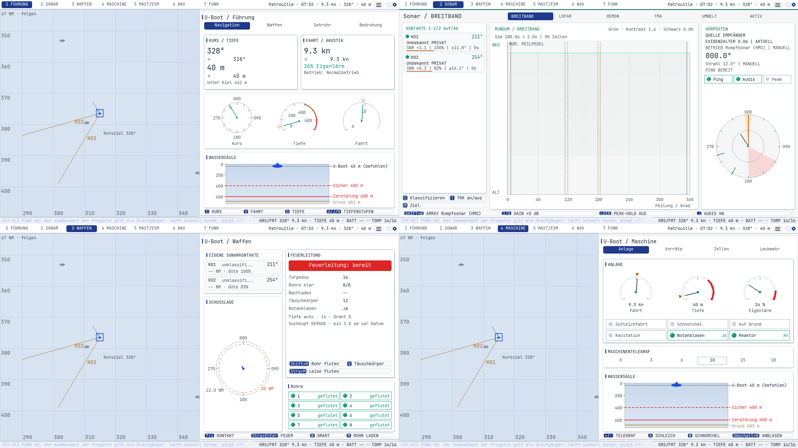

*U-Boot-Stationen auf der uConsole im Überblick*

| Station | Seiten |
|---|---|
| 1 Führung | Navigation, Waffen & Kontakte, Sehrohr, Bedrohung |
| 2 Sonar | Breitband, LOFAR, DEMON, TMA, Umwelt, Aktiv (wie das Sonar der Fregatte) |
| 3 Waffen | Rohre und Feuerleitung |
| 4 Maschine | Anlage, Vorräte, Zellen, Leckwehr |
| 5 Mast & ESM | ESM, Sehrohr |
| 6 Navigation | Karte & Echolot, Navigation, Bedrohung |
| 7 Funk | Funk |

**Stationen:** Die *Führung* befiehlt Kurs, Fahrt und Tiefe, legt das U-Boot auf Grund, pingt (`Umschalt+A`), nimmt eine BT-Messung (die BT-Messung im Browser; auf der uConsole nimmt sie der Sonarraum) und sieht das ganze U-Boot. Die *Navigation* befiehlt Kurs und Tiefe, führt den Plot des U-Boots und überwacht Kiel und Hindernisse. Die *Maschine* bedient Telegraf, Schnorchel, Schleichfahrt, Trimm und Notanblasen und überwacht Batterie und Lärm. *Mast & ESM* fährt den Mast aus und überwacht ESM und Alarme; auch die Führung darf ihn ausfahren, um durchs Sehrohr zu sehen. Die *Waffen* schießen, lenken die Drähte und stoßen Täuschkörper aus. Das *Sonar* ist der Sonarraum des U-Boots. Der *Funkraum* nimmt den Rundspruch der Führung auf und sendet Lagemeldungen; er darf für seine Antenne den Mast ausfahren. Jeder Befehl wird nur von der Station angenommen, zu der er gehört.

**Was die U-Boot-Crew sieht:** das eigene U-Boot, die bekannte Seekarte, die eigenen Sonarmessungen und die eigenen Torpedos im Wasser. Position, Plot, Ereignisse und Missionsmeldungen der Fregatte sieht sie nie; die Fregatten-Crew kann ein besetztes U-Boot nicht von der KI unterscheiden.

Ein Spielstand bewahrt Befehle, Betriebsarten, Mast, Drähte, Plot, Alarmpeilungen, ESM-Bild und Funktagebuch der Crew; nach dem Laden fährt das U-Boot seine letzten Befehle weiter und wartet bis zu zehn Minuten darauf, dass seine Crew die Stationen erneut übernimmt (jede U-Boot-Station wird neu vergeben), bevor die KI es zurücknimmt.

#### U-Boot am uConsole spielen

Jedes neue Spiel fragt zuerst **Welche Einheit spielst du?**: *Fregatte F-217* oder *Feindliches U-Boot* (`Auf`/`Ab` oder `1`/`2`, `Eingabe`; die letzte Wahl ist vorausgewählt). Außerhalb einer Mission ändert auch Optionen (`F10`) Seite 2 **uConsole spielt** die Wahl, etwa vor dem Laden eines Spielstands. Mit dem U-Boot führt der uConsole das feindliche U-Boot statt der Fregatte. Die Fregatte wird dann über Remote Crew (`F9`) aus den Browsern besetzt; jede Fregattenstation, die kein Browser hält, besetzen die **KI-Jäger** (unten).

Der uConsole zeigt nur das Lagebild des U-Boots; Banner, Ereignislog, Soundeffekte, Plot und Tooltips der Fregatte erscheinen nie (die Lampenhinweise des U-Boots schon), und Trackball- und Telegraphenbedienung der Fregatte sind gesperrt. Die Seite lässt sich nur außerhalb einer Mission wechseln; die Wahl gilt nur für diesen Programmstart und wird nie gespeichert, jeder Start beginnt also mit der Fregatte.

Auf der uConsole wechseln `1` bis `7` die Stationen, dieselbe Zahl noch einmal (oder `Bild↑`/`Bild↓`) blättert die Seiten der Station. Jede Station hat unten eine Tastenleiste; ein Klick auf eine Taste dort, auf eine Lampe oder eine Skala wirkt wie die Taste. Die vollständige Tastentabelle steht am Ende dieses Kapitels; die Browser-Stationen haben dieselben Befehle als Schaltflächen.

Die obere Leiste zeigt die sieben Stationen des U-Boots als Reiter: `1` Führung, `2` Sonar, `3` Waffen, `4` Maschine, `5` Mast & ESM, `6` Navigation, `7` Funkraum (`Tab` oder ein Klick auf den Reiter wechselt), rechts Mission, Uhrzeit, Fahrt, Kurs und Tiefe. Jede Befehlstaste wirkt nur an der Station, zu der der Befehl gehört, wie im Browser; sonst nennt ein Banner die richtige Station. Browser können gleichzeitig die übrigen Stationen des U-Boots besetzen; eine Station, die ein Browser hält, ist in der oberen Leiste markiert und wird nicht vom uConsole bedient.

Jede Station außer dem Sonarraum ist aufgebaut wie die Brücke: links die Seekarte (bekannte Geografie, der eigene Plot des U-Boots, die ESM-Peillinien und Kreuzpeilungen, das eigene U-Boot mit Sollkurs und Fahrtvektor, die Peilstriche der eigenen Sonarkontakte bzw. ihr Symbol bei aktuellem Ping- oder TMA-Fix, die eigenen Torpedos `T1`…, ein begrenztes Schussfeld der Rohre), rechts die Station mit Bedrohungsleiste (Torpedoalarm und gehörtes Aktivsonar mit gemessener Peilung, Rumpfschaden, Kavitation, schwache Batterie, ESM-Radarerfassung) und die Seite der Station. Die Bedrohungsleiste erscheint nur, solange eine Bedrohung aktuell ist: ein gehörter Ping oder eine ESM-Erfassung füllt sie 30 s lang; danach steht in der oberen Leiste ein gelbes Dreieck mit der Zahl der anstehenden Warnungen, die Einzelheiten bleiben auf der Seite Bedrohung.

Unten stehen U-Boot-Log und Telemetrie des U-Boots, als Leiste oder Statuszeile wie in den Optionen eingestellt; Befehle, Schüsse und Täuschkörper werden dort protokolliert.

Tasten, die an jeder Station des U-Boots wirken (`F1` zeigt sie auf der uConsole zuerst):

| Taste | Funktion |
|---|---|
| `Tab / Shift+Tab` | Nächste / vorherige Station |
| `1 … 7` | Stationen: 1 Führung, 2 Sonar, 3 Waffen, 4 Maschine, 5 Mast & ESM, 6 Navigation, 7 Funkraum |
| `Nummer der aktiven Station` | Erneut drücken, um die Seite dieser Station weiterzuschalten |
| `Bild Auf / Ab` | Vorige / nächste Seite der Station (jede Station mit mehreren Seiten) |
| `Strg+Eingabe` | Torpedo abfeuern (Waffen; Sehrohrseite: auf die Lösung des Angriffsrechners; F: nach Peilung und Entfernung). Eingabe allein feuert nie |
| `Shift+A` | Aktiver Ping mit dem eigenen Sonar (Führung und Sonarraum) |
| `F1 / ?` | Hilfe (diese Anzeige) |
| `Shift+F2` | Crew-Hilfe: Die KI besetzt jede freie Station beider Einheiten |
| `0` | Wetterseite des U-Boots (0 oder Esc schließt) |
| `F7` | Erster Offizier (optionales Sprachmodell) |
| `F9` | Lokale Commander-LAN-Verwaltung öffnen |
| `F10` | Optionen: Sprache, Vollbild, Audio, großer Text, Tooltips, Bildrate |
| `F11` | Ereignislog und volle Telemetrie einblenden (Station bleibt bedienbar) |
| `S / L` | Speichern / Laden (Slots 1-5; nicht im Sonarraum) |
| `Alt+Enter` | Vollbild (alle Stationen) |
| `Esc` | Eingabe abbrechen oder Beenden-Dialog öffnen |
| `R / M` | Nach Missionsende: Neustart mit gleichem Seed / Hauptmenü |
| `D` | Nach Missionsende: Nachbesprechung mit der Wahrheit neben dem Wissen der Crew (Leertaste spielt ab, Tab 10×/60×, Pos1/Ende Anfang/Ende, B Bericht des Sprachmodells, wenn eingeschaltet) |
| `N` | Nach einer abgeschlossenen Lektion: die nächste Lektion starten |

### Führung

Die Führung sieht das ganze U-Boot: Karte, Navigation, Waffen und Kontakte, das Sehrohr und die Bedrohungsseite. Sie befiehlt Kurs, Fahrt und Tiefe, legt das U-Boot auf Grund, pingt, nimmt ein BT und weicht auf den frischesten Alarm aus.

- **Navigation (Seite 1):** die Karte mit den eigenen Kontakten und Peillinien, die Skalen für Kurs, Fahrt und Tiefe und der Tiefenbalken. `C`, `V` und `D` befehlen Kurs, Fahrt und Tiefe; `U`, `J` und `H` gehen auf Sehrohr-, Unter-Schicht- oder tiefe Tiefe (mit `Umschalt` Schnorchel- und Über-Schicht-Tiefe); ein Klick auf eine Skala befiehlt diesen Wert.
- **Waffen & Kontakte (Seite 2):** die Rohre und die Kontaktliste, wie die Waffenstation sie sieht, um den Angriff mitzuverfolgen.
- **Sehrohr (Seite 3):** der Blick durch den Kopf auf Sehrohrtiefe mit ausgefahrenem Mast. `←`/`→` schwenken, `↑`/`↓` neigen, `Q`/`E` schalten schwache und starke Vergrößerung, `Leertaste` den Stabilisator; `Eingabe` nimmt eine Stadimeter-Entfernung der Sichtung unter dem Fadenkreuz, `Strg+Eingabe` schießt auf die Lösung des Angriffsrechners.
- **Bedrohung (Seite 4):** die jüngsten Pings, Torpedogeräusche und Radarauffassungen mit ihren Peilungen. `I` weicht dem jüngsten Alarm aus, `Strg+B` klärt die Hecklücke, `G` ruft Gefechtsstationen.
- Die Führung pingt mit `Umschalt+A` auf der uConsole und im Browser. Das BT nimmt auf der uConsole der Sonarraum (`2`, `E`); im Browser kann es auch die Führung.

**Tiefenstufen und Anzeigen:** Führung und Navigation befehlen die Tiefe in einem Schritt: Sehrohrtiefe (15 m, der Mast bleibt nutzbar), Schnorcheltiefe (U-Boote mit Schnorchel), über oder unter der Schicht (15 m darüber / 30 m darunter; erst nach der eigenen BT-Messung, denn nur daraus kennt die Crew die Schicht) und tief (die sichere Tiefe über dem kartierten Grund). Auf der uConsole sind das `U`, `Umschalt+U`, `Umschalt+J`, `J` und `H`.

Der Browser zeigt die Wassersäule (Oberfläche, Sehrohrtiefe, gemessene Schicht, Soll-, sichere und Zerstörungstiefe, Grund, das U-Boot und seine Tauchrichtung), große Anzeigen für Kurs, Fahrt, Tiefe und Batterie mit farbigen Betriebs- und Alarmchips sowie eine ESM-Rose mit der Peilung jedes Emitters und den Peilungen von Ping- und Torpedoalarm; die Seite Mast & ESM am uConsole hat dieselbe Rose. Mast, Schnorchel, Schleichfahrt und Auf-Grund-Legen haben getrennte Knöpfe zum Ein- und Ausschalten.

**Navigation** (Führung Seite 1 und Navigation Seite 2) zeigt Kurs und Tiefe, das Wasser unter dem Kiel und ein kartiertes Hindernis voraus, Fahrt, Eigenlärm, Batterie und die aktiven Betriebsarten, darunter eine Reihe Rundinstrumente für Kurs (der befohlene Kurs als gelbe Marke), Tiefe (gelb jenseits der Testtiefe, rot jenseits der Zerstörungstiefe) und Fahrt wie auf der Brücke der Fregatte, sowie die Wassersäule unter dem U-Boot: U-Boot-Tiefe, befohlene Tiefe, sichere Tiefe und Grund; die Sprungschicht erscheint dort erst nach einer eigenen BT-Messung (`E` am U-Boot-Sonar).

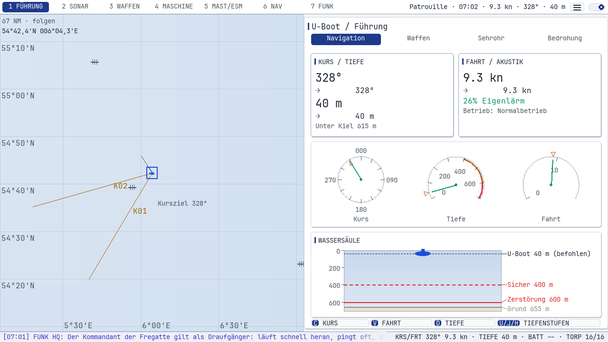

*U-Boot-Führung auf der uConsole*

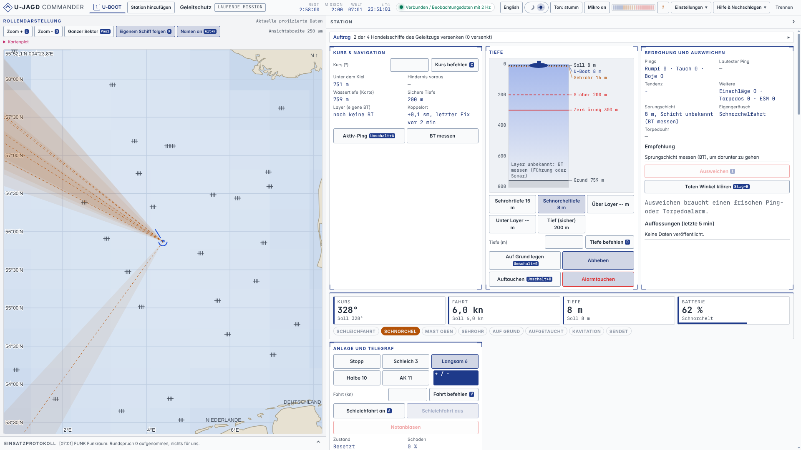

*U-Boot-Führung im Remote-Crew-Browser*

#### Sehrohr, Stadimeter und Angriffsrechner

Mit ausgefahrenem Mast zeigt die Seite **Sehrohr** (Führung Seite 3, Mast & ESM Seite 2; `P` fährt an beiden den Mast aus) das Okular im Stil des Startbilds: Himmel und See im Licht der Stunde (Tag, Dämmerung, Nacht mit Sternen und Mond), Wolken, Regen, Schnee und Nebel nach dem Wetter, den mit der See bewegten Horizont, eine Skala rechtweisender Peilungen und ein Fadenkreuz; das Rohr schwenkt in 2°-Schritten (`←`/`→`, `Umschalt`: 10°). Alles, was die Optik im Kontrastmodell des Fregattenausgucks bei 2,5 m Augenhöhe ausmacht (Tag/Nacht, Mond, Sicht, Seegang, Land im Weg), erscheint als Silhouette und als reine Peilungs-**Sichtung** mit grober Klasse (Kriegsschiff, Handelsschiff, Fahrzeug, Luftfahrzeug, Torpedolaufbahn) und scheinbarer Länge; das Log meldet jede neue Sichtung. Neutrale Schiffe zeigen hier ihre Positionslichter wie im Fernglas der Brücke. Ausgemachte Schiffe, U-Boote und Luftfahrzeuge erscheinen wie im Fernglas als gedrehte 3D-Modelle, in der vollen Länge, die sich aus scheinbarer Länge und geschätztem Lagewinkel ergibt, jeweils als Modell ihres echten Typs; die Sichtung der Besatzung nennt weiter nur die grobe Klasse.

`↑`/`↓` neigen den Kopf um 2° (`Umschalt`: 10°, von 10° nach unten bis 60° nach oben, für Flugzeuge), `Q`/`E` wechseln wie beim Fernglas der Fregatte zwischen kleiner (32° Feld) und großer Vergrößerung (8°), und die `Leertaste` schaltet die Stabilisierung; Neigung und Feld stehen in der Bildecke. Diese Einstellungen gehören zum Okular der uConsole oder jedes Browsers, ändern nur das Bild (nicht, was die Optik erkennt) und werden nicht gespeichert. Ein Hubschrauber in Sicht hängt in seinem wahren Höhenwinkel über der Kimm im ruhigen Himmel, hinter den Wolken. In Fahrt strömt das Wasser mit der eigenen Fahrt des U-Boots dicht unter dem Okular vorbei (voraus auf das Auge zu, querab vom Bug zum Heck). Ein Schiff mit Stadimeter-Entfernung steht so weit unter der Kimm, wie das niedrige Auge seine Wasserlinie sieht (auf 0,5 sm kaum ein Zehntel Grad), ein näheres Schiff vor einem ferneren.

`Eingabe` liest das **Stadimeter** an der Sichtung unter dem Fadenkreuz ab: die Entfernung folgt aus der scheinbaren Länge und der angenommenen Rumpflänge der Klasse (130 m für ein Kriegsschiff oder ein nicht erkanntes Fahrzeug, 150 m für ein Handelsschiff), ein nicht erkanntes oder bugwärts stehendes Ziel misst sich also zu weit; die Ablesung ist ±25 % und wird für 120 s zu einem VISUAL-Fix am Sonarkontakt des U-Boots auf dieses Ziel, für einen Schuss nutzbar wie ein Ping-Fix. Luftfahrzeuge und Laufbahnen lassen sich nicht messen.

Jede Ablesung ist zugleich eine **Marke** für den **Angriffsrechner**: aus zwei oder mehr Marken im Abstand von mindestens einer Minute (die letzten sechs innerhalb von 15 Minuten) legt er eine Gerade durch Kurs und Fahrt des Ziels und zeigt mit der Torpedogeschwindigkeit den Vorhaltewinkel (links oder rechts der Peilung) und die Laufzeit unter dem Sehrohr (Browser: Spalte Lösung); die Güte wächst mit der Zeit zwischen erster und letzter Marke (voll nach 5 Minuten) und mit der Zahl der Marken. `Strg+Eingabe` auf der Sehrohrseite (Browser: Schuss nach Lösung, nur die Führung) schießt nach der Lösung der Sichtung unter dem Fadenkreuz: der Torpedo läuft auf dem Abfangkurs zu dem Punkt, an dem Ziel und Torpedo zusammentreffen. Ein Schuss auf den Sonarkontakt eines markierten Ziels nutzt die Lösung ebenfalls. Ein Ziel, das nach der letzten Marke dreht, lässt die Lösung hinter sich; eine Anpassung schneller als 40 kn wird als schlechte Marke verworfen. Die Marken gehören zum Spielstand.

Die kartierte Küste steht auf dem Horizont des Sehrohrs, so weit seine niedrige Optik Land sieht (Hügel mit 25 bis 70 m angenommen). Die Führung kann auch ohne Sonarbediener pingen und eine BT-Messung nehmen. Die Karte zeigt das Schussfeld der Rohre, wo sie nicht rundum schießen, und das vom Sonar zugewiesene Ziel ist für den Schuss vorausgewählt.

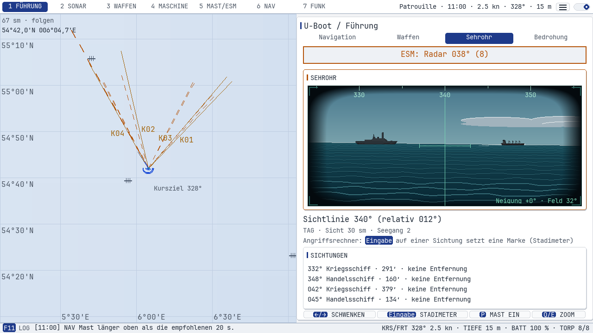

*Sehrohr bei Tag*

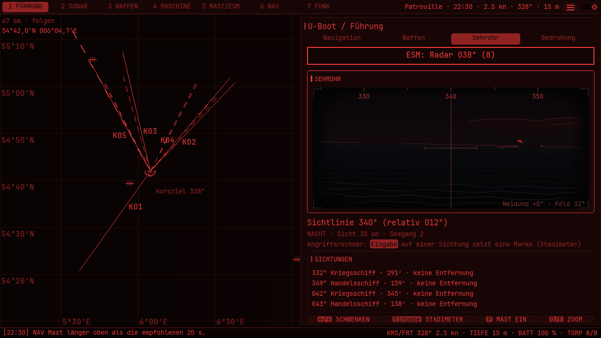

*Sehrohr bei Nacht*

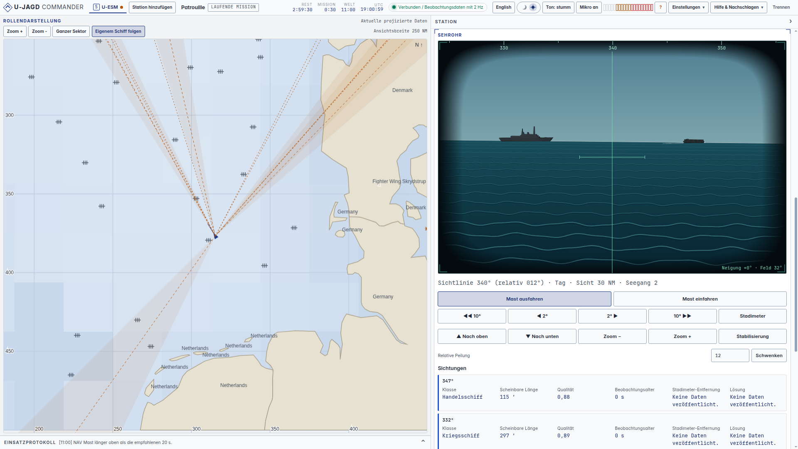

*Sehrohr im Remote-Crew-Browser*

#### Bedrohung und Ausweichen

**Lagebild:** ein gehörter Aktivping oder Torpedo wird mit der Peilung protokolliert, die das U-Boot selbst gemessen hat (einige Grad ungenau), und mit seinem Alter in den Alarmen angezeigt. Auf Sehrohrtiefe lässt sich der **Mast** ausfahren; sein ESM meldet dann die Radare, die das U-Boot überstreichen, mit Peilung (Log und ESM-Liste), und beim Tieferkommen fährt der Mast selbst ein.

Der Sonarraum des U-Boots unterscheidet einen aufgefangenen Aktivping an seiner Frequenz als Rumpfsonar der Fregatte, Tauchsonar eines Hubschraubers oder Sonoboje und protokolliert ihn mit gemessener Peilung und Empfangspegel (dB re 1 µPa, aus Quellpegel, Ausbreitung und Absorption); eine pingende Boje im Umkreis von 12 sm hört nur ein bemanntes U-Boot. Eine Boje, die im Umkreis von 4 sm ins Wasser fällt, wird mit grober Peilung (±6°) gehört; eine Salve des U-Jagd-Raketenwerfers der Fregatte, die im Umkreis von 3 sm einschlägt, wird mit ihrer Peilung gemeldet, während ihre Ladungen sinken (etwa 11 m/s): Zeit, die Tiefe zu wechseln oder darunter wegzulaufen; ein Torpedoalarm bleibt mit seiner Peilung stehen.

Die Seite **Bedrohung** (Führung Seite 4 und Navigation Seite 3; im Browser die Karte Bedrohung an Führung und Navigation) zählt die Pings der letzten 5 Minuten nach Quelle, nennt den lautesten Pegel mit Bewertung (ab 150 dB hat der Pinger wahrscheinlich ein Echo) und den Trend der letzten beiden Pings (steigend: er kommt näher), Splashes, Torpedoalarme und ESM-Emitter, die eigene Signatur (Tiefe gegen die gemessene Schicht, Eigenlärm: kavitierend, schnorchelnd, laut, mäßig oder leise, der Mast) und die Empfehlungen der Crew. Die Karte zeichnet jede Auffassung der letzten 2 Minuten als gestrichelten Peilstrahl.

**Ausweichen** (`I` an Führung oder Navigation, im Browser die Schaltfläche **Ausweichen**) gibt den Ausweichbefehl der Crew zum frischesten Alarm (unter 2 Minuten): gegen einen Torpedo die kleinere Wende, die ihn 150° achteraus legt, Höchstfahrt und ein Täuschkörper; gegen Aktivsonar das Heck zum Pinger, Schleichfahrt mit 3 kn. Beide wechseln durch die gemessene Schicht (nach unten, wenn das U-Boot darüber oder darin steht, nach oben, wenn es darunter steht), ohne BT gehen sie auf Tiefe; ein aufgesetztes U-Boot hebt zuerst ab. Der Befehl durchläuft dieselben Prüfungen wie die Einzeltasten, und die Seite zeigt ihn, bevor er gegeben wird. Das Bild ist nur Anzeige und wird nicht gespeichert.

1. An Sehrohrtiefe mit eingefahrenem Mast übernehmen; vor dem Losfahren Bedrohungsseite und HQ-Befehl lesen.
2. Sobald Fregatte, Sonar oder Hubschrauber zu hören sind: unter die Sprungschicht (J), langsam und Schleichfahrt (A).
3. Angriff aufbauen: Sonar hält die Peilung, Waffen holt eine Entfernung aus TMA, Ping oder Stadimeter.
4. Langsam und leise auf Sehrohrtiefe gehen; den Mast (P) nur für kurze Rundblicke ausfahren.
5. Nach Ping- oder Torpedoalarm sofort ausweichen (I); vor dem Zurückdrehen die Hecklücke klären (Strg+B).

### Sonar

Der Sonarraum des U-Boots arbeitet wie der der Fregatte, ohne Schleppsonar, OPZ-Freigabe, Plot und Telegraph. Achteraus ist das Rumpfsonar in der Hecklücke taub.

- Die sechs Seiten und ihre Tasten sind die des Fregattensonars (Kapitel 2 Sonar): Breitband-Wasserfall, LOFAR-Linien, DEMON-Wellendrehzahl, TMA, Umwelt mit BT, aktive Pings mit `Umschalt+A`.
- Das Rumpfsonar horcht in der eigenen Tiefe: über der Schicht hört es Überwasserschiffe gut, darunter ist es gegen sie abgeschirmt. Achteraus liegt die taube Hecklücke; deshalb ab und zu bei der Führung ein Klären der Hecklücke anfordern.

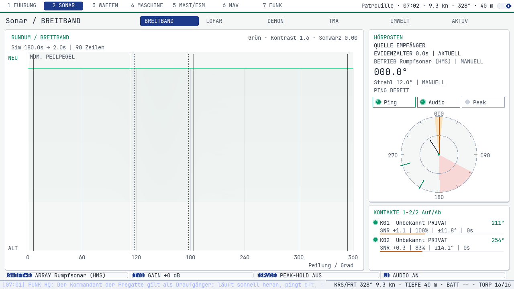

*U-Boot-Sonar*

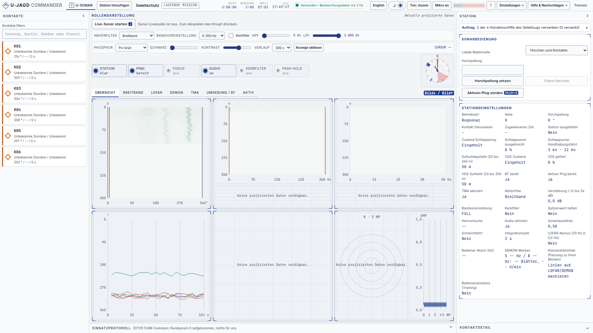

*U-Boot-Sonar im Remote-Crew-Browser*

1. Breitbandig rundum suchen; jeden neuen Kontakt nummerieren und seine Peilwanderung beobachten.
2. Den stärksten Kontakt mit den Filtern abhören und an seinen Linien klassifizieren.
3. Achteraus ist das Rumpfsonar taub: alle 20 bis 30 Minuten das Klären der Hecklücke beim Kommandanten anfordern.
4. Pings und Torpedogeräusche sofort melden; ihre Peilung ist die Grundlage jedes Ausweichens.
5. Nur zum Abschluss eines Angriffs pingen: die Fregatte hört jeden Ping und erhält deine Peilung.

### Waffen

Die Waffenstation lädt und flutet die Rohre, stellt Lauftiefe und Fächer ein, schießt auf einen gewählten Kontakt oder eine eingegebene Peilung, lenkt die drahtgelenkten Torpedos und stößt Täuschkörper aus. Die Seite hat neben der Karte zwei Spalten: Kontaktkarten (ein Klick wählt einen Kontakt) über der Schusslage sowie die Feuerleitung über den Rohrlampen. Der Feuerleitkasten zeigt die Suchkopf-Einstellung der nächsten Schüsse; an der Waffenstation feuert ein Klick auf das rote Feuerfeld wie `Strg+Eingabe`. Unter den Voreinstellungen fluten Tastenchips das nächste trockene Rohr (`Umschalt+M`, leise `Strg+M`) und stoßen einen Täuschkörper aus (`V`), und ein Klick auf eine Rohrlampe lädt ein leeres Rohr (`M`) oder flutet ein trockenes (`Umschalt+M`).

- **Rohre:** jedes Rohr ist leer, geladen (trocken) oder geflutet; nur ein geflutetes Rohr feuert. `M` lädt das nächste leere Rohr, `Strg+M` flutet das nächste geladene langsam (60 s, kaum hörbar), `Umschalt+M` schnell (20 s, laut).
- **Feuerleitung:** `↑`/`↓` wählen einen Kontakt mit frischer Entfernung, `T` stellt die Lauftiefe, `Y` Einzelschuss oder Zweierfächer, `X` das Suchmuster und `,`/`.` den Scharfschaltpunkt; `Strg+Eingabe` schießt. `F` schießt ohne Kontakt: Peilung eingeben und `Eingabe`, dann die Entfernung zum Datum (leer: 10 sm in Schussrichtung) und `Eingabe`, und `Strg+Eingabe` schießt; `Eingabe` allein schießt nie.
- **Draht und Täuschkörper:** `W` lenkt den jüngsten drahtgelenkten Torpedo auf eine neue Peilung, `Umschalt+W` kappt den Draht; `V` stößt einen Täuschkörper aus.

**Waffen** (Seite und Station Waffen) zeigt Feuerbereitschaft, Torpedos, klare (geflutete) Rohre, Nachladen, Täuschkörper, Notanblasen, eine Zeile mit den Rohren, die nicht klar sind (`M` lädt das nächste leere Rohr, `Umschalt+M` flutet das nächste trockene, `Strg+M` flutet es langsam und leise) und die eigenen Sonarkontakte (Peilung, Entfernung falls bekannt, und Güte in Prozent: der bessere Wert aus Signalgüte und Spurvertrauen, 100 % ist ein sicherer Kontakt), darunter die Schusslage des gewählten Kontakts wie bei der Fregatte (Torpedoreichweite, Peilung, geschätzte Position, Treffpunkt und Torpedolaufbahn, nur aus der eigenen Beobachtung des U-Boots).

**Befehle und Waffen:** das U-Boot folgt Kurs-, Fahrt- und Tiefenbefehlen im Rahmen seiner Wende-, Tiefen- und Beschleunigungsgrenzen; Fahrtstufen (Stopp, 3, 6, 10, 15 kn, Maximum) setzen die Fahrt schnell. Schießt einen Torpedo auf die gemessene Peilung eines Sonarkontakts, mit Ping-Fix oder TMA-Lösung, solange aktuell, oder auf eine freie Peilung mit optionaler Entfernung; der Schuss braucht ein geflutetes, geladenes Rohr und das Ziel im Schussfeld der Rohre.

**Rohre:** Die Crew übernimmt die geladenen Rohre geflutet. Ein leergeschossenes Rohr bleibt leer, bis die Torpedogasten es aus den Reserven laden, sofern dort noch ein Torpedo liegt (`M` an der Station Waffen, Browser: Laden; jedes U-Boot führt mindestens noch einmal so viele Reservetorpedos wie Rohre, und das Laden dauert 2 min auf einem Atom-U-Boot, 3 min auf einem konventionellen und 4 min auf den älteren Dieselklassen, langsamer bei verbrauchter Luft); ein geladenes Rohr ist trocken und muss vor dem Schuss geflutet werden, was die Mündungsklappe öffnet, 20 s dauert und 4 s lang wie ein kurzer Transient hörbar ist, den das Sonar der Fregatte bis 8 sm hört (`Umschalt+M`, Browser: Fluten); langsames Fluten dauert 60 s und ist nur bis 1,5 sm zu hören (`Strg+M`, Browser: Leise fluten). Die Station Waffen und der Browser zeigen jedes Rohr als leer, lädt, trocken, flutet oder klar, und das Log meldet jedes geladene und geflutete Rohr. Die U-Boote der KI laden und fluten selbst: leise und früh, sobald sie die Fregatte innerhalb von 15 sm geortet haben, laut und kurz vor dem Schuss, wenn sie mit trockenen Rohren schießen müssen.

Die Crew stellt die Lauftiefe ein (5-300 m, sonst eine flache Voreinstellung) und schießt einen Torpedo oder zwei im Fächer von ±4°, jeder mit eigenem Datum. Jeder Crew-Torpedo läuft am Draht: die Crew kann sein Datum versetzen (Peilung und Entfernung vom U-Boot), und der Draht dreht ihn darauf ein, bis sein Suchkopf erfasst; schneller als 10 kn oder stärker als 1,5°/s drehen für 5 s lässt den Draht reißen, ebenso eine abgelaufene Spule, und die Crew kann ihn kappen. Stößt einen Täuschkörper aus und bläst im Notfall die Hauptzellen an (mit voller Pressluft dreimal).

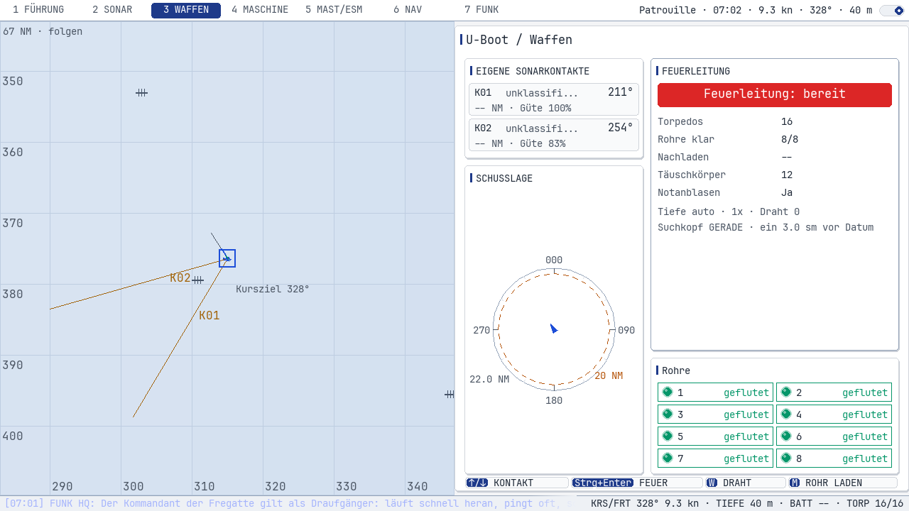

*U-Boot-Waffen*

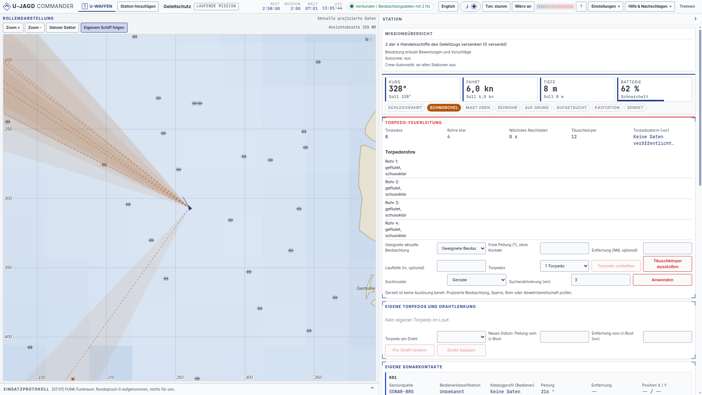

*U-Boot-Waffen im Remote-Crew-Browser*

#### Torpedo-Suchkopf

- `X` schaltet das Suchmuster der nächsten Schüsse weiter: gerade (wie bisher), Schlange, Kreis oder Helix. Der Torpedo läuft gerade zum Datum; ist sein Suchkopf an und hat nichts gefunden, sucht er in diesem Muster.
- `,` und `.` verschieben den Einschaltpunkt zwischen 0,6 und 3,0 sm vor dem Datum in Schritten von 0,2 sm (Vorgabe 3,0 sm). Ein später Einschaltpunkt hält den Suchkopf länger blind, so dass er Täuschkörper und andere Schiffe auf dem Weg nicht nimmt.
- Ein Torpedo im Wasser behält die Einstellung, mit der er geschossen wurde; die Waffen-Karte im Browser stellt beides mit **Anwenden** ein.

1. Rohre laden (M) und früh und langsam fluten (Strg+M); schnelles Fluten (Umschalt+M) ist laut.
2. Vor dem Schuss Lauftiefe (T), Fächer (Y), Suchmuster (X) und Einschaltpunkt (, / .) einstellen.
3. Einen Kontakt mit frischer Entfernung wählen und mit Strg+Eingabe schießen oder auf eine eingegebene Peilung (F).
4. Den drahtgelenkten Torpedo (W) auf neue Peilungen lenken; vor harten Manövern den Draht kappen (Umschalt+W).
5. Gegen einen Torpedo einen Täuschkörper ausstoßen (V) und sofort nachladen.

### Maschinenraum

Der Maschinenraum fährt Telegraph, Schnorchel und Laderate, Schleichfahrt, die Trimmzellen und das Notanblasen, hält die Luft atembar und führt die Leckwehrtrupps.

- **Anlage (Seite 1):** Telegraph (`+`/`-`), Schleichfahrt (`A`, höchstens 5 kn), Schnorchel (`N`) und die Werte von Batterie, Diesel und E-Maschine.
- **Vorräte (Seite 2):** Batterie, Kraftstoff, Kohlendioxid und Sauerstoff. `R` schaltet die Laderate beim Schnorcheln (voll, halb, nur Luft), `Umschalt+O` setzt einen frischen Absorbersatz ein, `O` zündet eine Sauerstoffkerze.
- **Zellen (Seite 3):** Regel- und Trimmzellen. `↑`/`↓` lenzen oder fluten die Regelzelle, `←`/`→` verschieben Trimmwasser, `Z` schaltet die Trimmautomatik; `Umschalt+B` ist das einmalige Notanblasen.
- **Leckwehr (Seite 4):** die Abteilungen mit Wasser, Lecks, Feuer und Gas. `↑`/`↓` wählen eine Abteilung, `←`/`→` eine Aufgabe, `Eingabe` schickt Trupp 1 (`Umschalt+Eingabe` Trupp 2), `I` schließt oder öffnet ihre Schotten; `W`, `M` und `U` lösen die Wache ab, schicken den Sanitätstrupp und besetzen die am schwersten getroffene Station neu.

Die **Maschine** ist ein Leitstand: Rundinstrumente für Fahrt (die befohlene Fahrt als gelbe Marke), Batterie (beim Atom-U-Boot die Tiefe) und Eigenlärm, Lampen für Schleichfahrt, Schnorchel, Auf Grund, Kavitation, Notanblasen und den Anlagenzustand sowie die Telegrafenstufen.

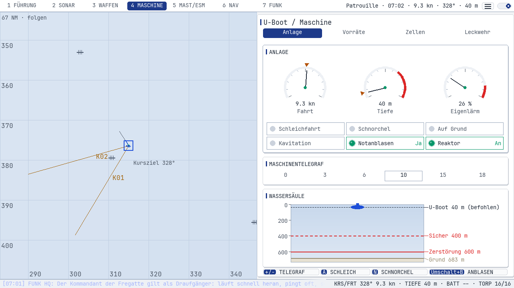

*U-Boot-Maschine*

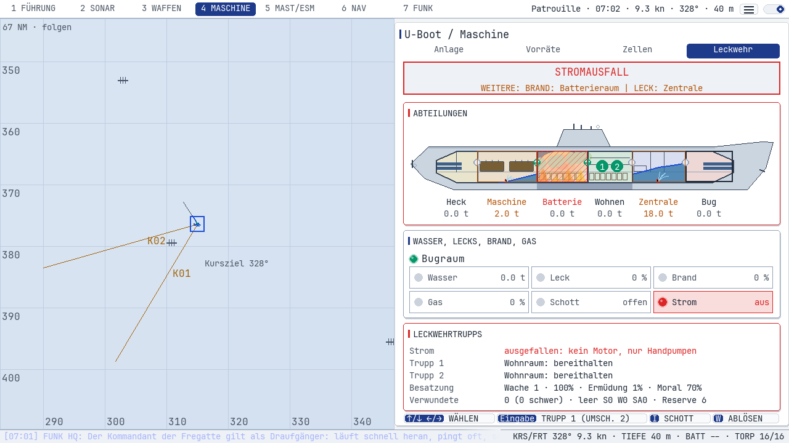

*U-Boot-Leckwehr (Maschine, Seite 4)*

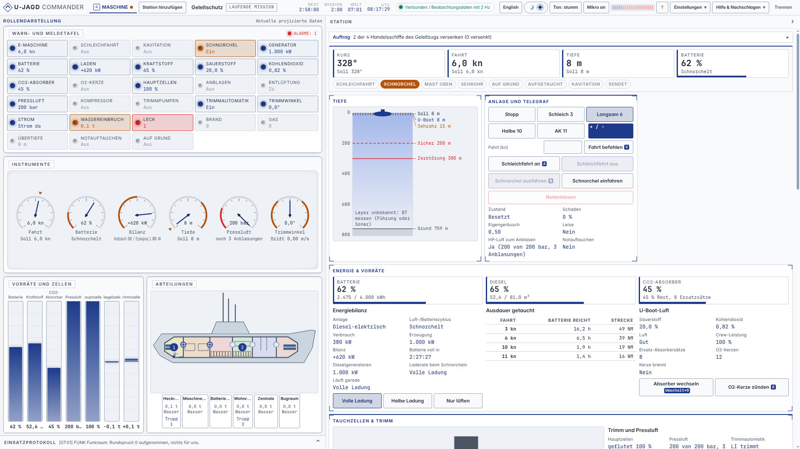

*U-Boot-Maschine im Remote-Crew-Browser*

#### Anlage und Vorräte

**Anlage und U-Boot-Betrieb:** ein besetztes U-Boot taucht nie von selbst auf, schnorchelt nicht und funkt nicht von selbst. Die Batterie entlädt sich mit Fahrt und Bordnetz; unter 20 % warnt das U-Boot-Log, eine leere Batterie begrenzt die Fahrt auf das, was die Anlage noch liefert (eine AIP-Anlage übernimmt die Last weiterhin selbst).

**Schnorcheln** betreibt die Diesel auf Schnorcheltiefe und lädt die Batterie, höchstens 6 kn; tieferes Tauchen schließt das Kopfventil. Die laufenden Diesel sind laut: +12 dB abgestrahlter Pegel, ein niedrigerer Stillefaktor und zwei Zündlinien bei 50 und 100 Hz in der LOFAR-Signatur des U-Boots (auch bei KI-U-Booten). **Schleichfahrt** begrenzt das U-Boot auf 5 kn und macht es so leise wie ein lauerndes KI-U-Boot. **Auf Grund legen** stoppt das U-Boot 3 m über dem Grund, wo das Wasser nicht tiefer als die Tauchtiefe ist: leise und ohne Drift; jeder Fahrt- oder Tiefenbefehl hebt ab. Vor Land oder einer Untiefe stoppt das U-Boot, statt auszuweichen, und das Log warnt bei wenig Wasser unter dem Kiel.

**Energie und Vorräte:** die Maschine zeigt unter **Energie & Vorräte** (Karte im Browser, auf der uConsole Maschine Seite 2 **Vorräte**) die Energiebilanz bei der aktuellen Fahrt (Verbrauch, Erzeugung und Bilanz in kW, die Zeit bis die Batterie leer oder voll ist), Batterie und AIP-Sauerstoff, die Dieselbunker und eine Tabelle, wie lange die Batterie getaucht bei jeder Telegrafenstufe reicht und wie weit das U-Boot damit kommt (auf der uConsole Tanksäulen für Batterie, AIP-Sauerstoff, Diesel und Absorber und ein Balken je Telegrafenstufe).

**Diesel:** die Bunker fassen 300 Stunden volle Generatorleistung, eine Fahrt beginnt mit 65 %; nur laufende Diesel verbrauchen (0,27 l je kWh), das Log warnt bei 10 %, und mit leeren Bunkern lädt Schnorcheln nicht mehr. Die **Laderate** bestimmt, was Schnorcheln tut: *voll* (die ganze Generatorleistung, +12 dB und beide Diesellinien), *halb* (die halbe Leistung, +9 dB, schwächere Linien) oder *nur lüften* (die Lüfter ohne Diesel, +4 dB, keine Linien).

**Luft:** getaucht verbraucht die Crew Sauerstoff und atmet Kohlendioxid aus (je etwa 0,45 % pro Stunde); ein CO2-Absorbersatz nimmt CO2 auf, bis er verbraucht ist (8 Ersatzsätze), eine O2-Kerze setzt in 15 Minuten 1 % O2 zu (12 an Bord, eine zur Zeit), und Schnorcheln lüftet das U-Boot in wenigen Minuten Richtung Frischluft. Ab 3 % CO2 oder unter 18 % O2 ist die Luft verbraucht, ab 5 % CO2 oder unter 16 % O2 gefährlich; das Log warnt bei jeder Stufe. Schlechte Luft macht die Crew langsamer (bis 30 % Leistung), und die Torpedomannschaft lädt entsprechend langsamer nach. KI-U-Boote versorgen ihre Luft selbst und tauchen zum Lüften auf, wenn sie gefährlich wird. Ein Atom-U-Boot hat keine dieser Vorräte.

Die zweite Seite der Maschine, **Vorräte**, zeigt Energie, Ausdauer und Luft; `R` wechselt die Laderate, `Umschalt+O` setzt einen Absorbersatz ein und `O` zündet eine O2-Kerze.

#### Zellen, Trimm und Luft

Die Maschine zeigt unter **Tauchzellen & Trimm** (Karte im Browser mit Schnittbild des U-Boots, auf der uConsole Maschine Seite 3 **Zellen**) die Hauptzellen, die Regelzelle, die Trimmzellen, die Pressluft und den Trimmzustand des U-Boots.

Jede Gewichtsänderung bringt das U-Boot aus dem Gleichgewicht: ein Torpedo aus einem Bugrohr macht es 1,5 t leichter und achterlastig, Wasser in vollgelaufenen Abteilungen (siehe Leckwehr) macht es schwerer und trimmt es zum gefluteten Ende; die Trimmautomatik gleicht davon aus, was ihre Zellen fassen. Mit der **Trimmautomatik** pumpt der LI die Regelzelle (±8 t, 25 kg/s) und die Trimmzellen (±3 t vorn und achtern, 15 kg/s) zurück ins Gleichgewicht; von Hand verschiebt jeder Befehl die Regelzelle um 0,5 t oder das Trimmwasser um 0,25 t (und schaltet die Automatik aus). Laufende Trimmpumpen sind hörbar (+3 dB und eine Linie bei 120 Hz). Was die Zellen nicht aufnehmen, lässt das U-Boot mit 0,03 m/s je Tonne sinken oder steigen, und ein Trimmwinkel (1° je Tonne Moment, + vorlastig) drückt es mit Fahrt nach unten oder oben; die Tiefenruder halten das nur mit Fahrt, ein schweres U-Boot sinkt bei wenig Fahrt unter seine befohlene Tiefe; das Log warnt ab 2 t und ab 3°.

Die **Pressluft** (200 bar) reicht für drei Notanblasungen zu je 60 bar; Anblasen leert die Hauptzellen in 20 s, das U-Boot steigt auf 10 m und bleibt dort, die befohlene Tiefe steht dann auf 10 m. Der nächste Befehl unter 12 m öffnet die Entlüftung: die Hauptzellen fluten in 40 s, erst dann kann das U-Boot tauchen. Schnorcheln auf Diesel betreibt den Kompressor (0,05 bar/s); mit nur lüften läuft er nicht. Ohne Strom laufen weder Trimmpumpen noch Kompressor. Die KI-U-Boote halten sich selbst im Trimm und behalten ihr eines Notanblasen.

Ihre dritte Seite **Zellen** zeigt das Schnittbild, Hauptzellen und Pressluft, die Zellen mit ihren Sollwerten, Gewicht, Trimmwinkel, Drift ohne Tiefenruder, Wassereinbruch und Pumpen; `↑`/`↓` lenzen oder fluten die Regelzelle, `←`/`→` pumpen Trimmwasser nach achtern oder vorn und `Z` schaltet die Trimmautomatik.

#### Leckwehr

Ihre vierte Seite **Leckwehr** ist ein Schnittbild des U-Boots vom Heck zum Bug (Turm, Außenhülle und der Druckkörper mit seinen Einbauten; Wasser, das sich mit dem Trimm neigt, Brand und Rauch, Chlorgasschleier, ein Leck mit einströmendem Wasser, runde Schotttüren mit einem Kreuz, wenn geschlossen, Trupp-Plaketten; darunter Name und Wasser in Tonnen jeder Abteilung), Lampen mit Wasser, Leck, Brand, Gas, Schotten der gewählten Abteilung und dem Strom sowie beide Trupps; `↑`/`↓` wählen eine Abteilung, `←`/`→` eine Aufgabe, `Eingabe` schickt Trupp 1 und `Umschalt+Eingabe` Trupp 2 mit dieser Aufgabe dorthin, und `I` schließt oder öffnet die Schotten der Abteilung.

Die Maschine zeigt unter **Leckwehr** (Karte im Browser mit einer Leckwehr-Tafel, einer Seitenansicht des Druckkörpers mit Wasser, Brandschein, Gasschleier, Lecks, geschlossenen Schotten, einer Zustandslampe je Abteilung und den Trupp-Plaketten, Rundinstrumenten für Trimm, Wassereinbruch und Pressluft und darunter der Tabelle; auf der uConsole Maschine Seite 4 **Leckwehr**) den Druckkörper in sechs Abteilungen: Bugraum, Zentrale, Wohnraum, Batterieraum, Maschinenraum und Heckraum.

Ein Treffer auf das besetzte U-Boot schlägt ein Leck in die getroffene Abteilung (1,5 % Leck je % Trefferschaden, höchstens ein volles Leck; ab 50 % Schaden auch in die Nachbarabteilung mit halbem Leck) und kann dort einen Brand auslösen (Wahrscheinlichkeit = Schaden / 150); ein Versagen des Druckkörpers unter der Testtiefe schlägt ebenfalls ein Leck (siehe Unter der Testtiefe). Durch ein volles Leck dringen in 100 m Tiefe 40 kg/s ein, mit der Wurzel der Tiefe mehr; über halbvoll läuft das Wasser in offene Nachbarabteilungen über (20 kg/s) und erstickt einen Brand. Ein Brand wächst in 2 min zum Vollbrand und greift dann durch offene Schotten über; Seewasser im Batterieraum (ab 2 t) setzt Chlorgas frei, das durch offene Schotten zieht und erst langsam abzieht, wenn die Batterie trocken ist. Wasser im Batterieraum (ab 5 t) oder ein Brand dort legen den **Strom** lahm: der Motor steht (keine Fahrt, also halten die Tiefenruder ein schweres U-Boot nicht), Trimmpumpen, Kompressor und elektrische Lenzpumpen stehen still.

**Schotten schließen** hält Wasser, Brand und Gas in der Abteilung und erstickt einen Brand dort in 3 min. Zwei **Leckwehrtrupps** gehen durchs U-Boot (8 s je Abteilung) und **dichten ein Leck ab** (ein volles in 60 s), **lenzen** (30 kg/s, ohne Strom ein Viertel von Hand) oder **löschen einen Brand** (einen Vollbrand in 60 s); im Gas arbeiten sie halb so schnell, und in einer zu 90 % vollen Abteilung können sie nur lenzen. Eine Abteilung, die zur Hälfte voll Wasser ist, halb brennt oder halb vergast ist, legt ihre Station lahm: der Bugraum die Torpedorohre, die Zentrale Mast und Sehrohr, der Maschinenraum die Diesel, der Heckraum die halbe Höchstfahrt. Das Wasser ist Gewicht und Moment für den Trimm (siehe oben); ein U-Boot, das unter die 1,5-fache Testtiefe sinkt, wird zerdrückt. Das Log meldet Lecks, Brände, abgedichtete Lecks, gelöschte Brände, vollgelaufene Abteilungen, Chlorgas und den Strom.

#### Unter der Testtiefe

Die Crew darf das besetzte U-Boot unter seine Testtiefe befehlen, bis zur Zerstörungstiefe (1,5-fache Testtiefe); die Stufe "tief" und das Auf-Grund-Legen bleiben bei der sicheren Tiefe. Die Tiefenleiter am uConsole und im Browser markieren die Zerstörungstiefe, und solange das U-Boot unter der Testtiefe ist, zeigen die Führung am uConsole den roten Alarm **UNTER TESTTIEFE** und der Browser einen roten Alarmchip, beide mit Test- und Zerstörungstiefe. Ab 90 % der Testtiefe ermüdet der Druckkörper wie bisher (ein Versagen in etwa 30 min bei Testtiefe); unter der Testtiefe versagt er viel schneller, mit dem Quadrat der Überschreitung: etwa alle 6 min bei 110 %, jede Minute bei 125 % und alle 20 s bei 140 %.

Jedes Versagen ist eines von dreien: **gebrochene Bolzen** einer Armatur (ein Viertelleck in einer zufälligen Abteilung, 6 % Schaden), eine **versagende Dichtung** an Welle oder Ventil (ein halbes Leck im Maschinen- oder Heckraum, 12 % Schaden) oder ein **Riss im Druckkörper** (ein volles Leck und ein 60-%-Leck in der Nachbarabteilung, 30 % Schaden). Knapp unter der Testtiefe reißt der Druckkörper nicht; die Wahrscheinlichkeit steigt um 15 % je 10 % Überschreitung, bis 60 %, und vom Rest versagt in 30 % eine Dichtung. Das Log meldet jedes Versagen mit der Abteilung, und in Zerstörungstiefe bricht der Druckkörper zusammen und das U-Boot ist verloren. Die U-Boote der KI halten ihre Testtiefe.

#### Maschinenleitstand im Browser

Im Browser ist die Bildfläche des Maschinenraums statt einer Karte ein Maschinenleitstand. Eine **Warn- und Meldetafel** aus Statuslampen zeigt jeden Anlagenzustand auf einen Blick: dunkel, wenn aus, türkis im Betrieb, gelb bei einer Warnung und rot blinkend bei einem Alarm, jede mit ihrem Wert (E-Maschine, Schleichfahrt, Kavitation, Schnorchel, Generator, Batterie, Laden, Kraftstoff, Sauerstoff, Kohlendioxid, CO2-Absorber, O2-Kerze, Hauptzellen, Anblasen, Entlüftung, Pressluft, Kompressor, Trimmpumpen, Trimmautomatik, Trimmwinkel, Strom, Wassereinbruch, Leck, Brand, Gas, Übertiefe, Notauftauchen, Auf Grund); die Sammellampe im Schild zählt Alarme und Warnungen.

Darunter stehen runde **Instrumente** für Fahrt, Batterie, Energiebilanz, Tiefe (Test- bis Zerstörungstiefe gelb), Pressluft und Trimmwinkel mit dem Sollwert als gelber Marke, **Tanksäulen** für Batterie, Kraftstoff, AIP-Sauerstoff, Absorber, Pressluft, Hauptzellen sowie Regel- und Trimmzellen (diese von der Mitte aus: nach oben schwer, nach unten leicht) und das **Schnittbild der Abteilungen**: das U-Boot im Schnitt vom Heck zum Bug (Außenhülle, Turm mit Masten, der Druckkörper mit seinen Einbauten) mit dem Wasser jeder Abteilung, das sich mit dem Trimm neigt, Brand und Rauch, Chlorgasschleier, einem Leck mit einströmendem Wasser, den runden Schotttüren (ein Kreuz, wenn geschlossen) und den arbeitenden Trupps, darunter Name, Wasser und Trupps jeder Abteilung. Ein Atom-U-Boot zeigt keine Batterie, keinen Diesel und keine Luftvorräte. Der Leitstand zeigt nur an; die Befehle bleiben im Stationsbereich rechts.

1. Die Batterie geladen halten: schnorcheln (N) nachts oder bei schlechter Sicht, Laderate (R) nach Lage.
2. Schleichfahrt (A), sobald die Fregatte nahe ist: höchstens 5 kn.
3. Kohlendioxid und Sauerstoff auf der Vorratsseite beobachten; rechtzeitig Absorber (Umschalt+O) oder Kerze (O).
4. Den Trimm auf Automatik lassen (Z); nur für ein leises Schweben von Hand trimmen.
5. Bei Schäden die Trupps schicken (Eingabe), Schotten schließen (I); Anblasen (Umschalt+B) nur als letztes Mittel.

### Mast & ESM

Mast & ESM fährt den Mast an Sehrohrtiefe aus, hört auf der ESM-Rose nach Radaren, klassifiziert die Sender, plottet Kreuzpeilungen und schaut durchs Sehrohr. Ein Klick auf eine Zeile der Senderliste wählt diesen Sender, wie ↑/↓.

- **ESM (Seite 1):** mit ausgefahrenem Mast (`P`, nur auf Sehrohrtiefe) zeigt die Rose jedes gehörte Radar mit Peilung und Pegel. `↑`/`↓` wählen einen Sender, `C` (oder `→`; `Umschalt+C` oder `←` zurück) klassifiziert ihn aus der Bibliothek (eine Anmerkung, nie die Wahrheit), `Eingabe` gibt seine Kreuzpeilung oder Peillinie in den Plot des U-Boots. Ein Hauptkeulentreffer heißt, dass das Radar den Mast womöglich schon sieht.
- **Sehrohr (Seite 2):** dasselbe Sehrohr wie Seite 3 der Führung, ohne Schuss.

**Mast & ESM** zeigt die Mastzeit, die Rose, die Emitterliste und den gewählten Emitter (Signal, Pegel und Trend, Kreuzpeilung, Einstufung); ihre zweite Seite und die dritte der Führung ist das **Sehrohr** (Okular, Sichtlinie, Licht und die Sichtungsliste; `←`/`→` schwenken, `Eingabe` Stadimeter).

Mit ausgefahrenem Mast auf Sehrohrtiefe hört die ESM-Antenne des U-Boots (3 m über Wasser) einmal pro Sekunde die Radare ringsum: das der Fregatte, anderer Schiffe und von Flugzeugen innerhalb des Radarhorizonts, über Land nur, wo die Küste die Linie nicht verdeckt. Der Hubschrauber der Fregatte strahlt sein X-Band-Suchradar, solange er fliegt und nicht taucht (Antenne in 150 m), der Seefernaufklärer sein frequenzagiles Suchradar, solange die OPZ es eingeschaltet hat. Jede Erfassung trägt die gemessene Peilung (±4°), Band, Trägerfrequenz, PRF, Modulation und Empfangspegel, nie die Identität oder Position des Senders.

Die Crew führt eine **Emitterliste** (`E1`, `E2` …) über mehrere Mastperioden: eine Erfassung gehört zu einem Emitter, wenn Peilung, Band und Signalform passen (ein frequenzagiles Radar nur nach Peilung und Band), und die Liste vergisst einen Emitter 30 Minuten nach seiner letzten Erfassung. Die **Einstufung** ist die Annotation der Crew aus der Bibliothek: die Emitter, deren veröffentlichte Frequenz- und PRF-Bereiche die Messung enthalten, bis zu 16, die bestpassenden zuerst: jeder Eintrag zeigt seine Passung (**passt gut**, **mittel** oder **schwach**: Frequenz und PRF nahe der Mitte der Bereiche und dieselbe Modulation passen am besten), Einträge gleicher Stufe stehen nach Katalogschlüssel, und die Liste ordnet sich nur um, wenn sich eine Stufe ändert; die Wahl legt die Leistungsklasse für die **Entfernungsschätzung** aus dem Pegel fest (ohne Einstufung die kürzeste Entfernung, die die Bibliothek zulässt). Alle 30 s behält jeder Emitter eine **Peilung** von der eigenen Position des U-Boots (20 Minuten); die Karte zeigt die letzten Peillinien, und sobald die eigene Fahrt die Peilung um mindestens 8° gedreht hat, ist die **Kreuzpeilung** ihr bester Schnittpunkt mit einer 95-%-Fehlerellipse, die einen seit jeder Linie bis zu 8 kn versetzten Sender einrechnet (eine schnelle Fregatte ergibt meist keine; eine Kreuzpeilung, deren Linien nicht zusammenpassen, wird markiert). Der **Stärketrend** zeigt steigend, gleichbleibend oder fallend über fünf Minuten.

Die **Umlaufzeit** ist die Zeit zwischen den Treffern der Hauptkeule eines Emitters (den Pegelspitzen; nah dran sind dazwischen die schwächeren Nebenkeulen zu hören und zählen nicht), gemessen nur an der eigenen Signalform des Emitters, über Lücken bis 12 s ohne überspülten Durchlauf dazwischen, und angezeigt nach 8 s: **dreht** mit ihrer Dauer (etwa 2,5 s für ein Navigations- oder Seeraumradar, 5 s für ein Luftraumradar, 2 s für ein Mehrzweckradar) ist ein Suchradar, das vorbeistreicht; **dauernd** (die Keule bei jedem Durchlauf auf dem Mast) ist ein Verfolgungs- oder Feuerleitradar. Ein dauernd beleuchtender, erfasster Emitter ist immer eine Mastwarnung, und das Log meldet einmal, wenn ein Emitter auf Dauerbeleuchtung wechselt.

Die **Mastwarnung** („Radar kann Mast sehen“) kommt, wenn die geschätzte Entfernung eines erfassten Suchradars innerhalb der Entfernung liegt, auf der ein Seeraumradar bei diesem Seegang und Regen einen ausgefahrenen Mast sieht (der Wert der Wetterseite); die **empfohlene Mastzeit** ist 60 s bei ruhiger See, bis zu 300 s, wenn die Seegangsechos den Mast verbergen, und 20 s unter dieser Warnung, und das Log meldet, wenn sie überschritten ist. Ab Seegang 3 überspülen Wellen die Antenne, und manche Durchläufe hören nichts.

Die Karte Mast & ESM im Browser hat die Rose, die Emittertabelle und die Auswertung des gewählten Emitters; **In den Plot übernehmen** trägt die Kreuzpeilung (Markierung und Fehlerkreis) oder sonst die letzte Peillinie in den Plot des U-Boots ein. Auf der Seite Mast & ESM der uConsole wählen `↑`/`↓` einen Emitter, `C` oder `←`/`→` (`Umschalt+C` zurück) schalten seine Einstufung aus der Bibliothek weiter und `Eingabe` übernimmt ihn in den Plot. Ein ausgefahrener Mast zieht eine Schaumfahne, die Ausguck, Helikopter und Seefernaufklärer mit dem Auge sehen (siehe Kapitel Brücke): langsam fahren hält sie klein, und läuft das U-Boot mit oben stehendem Mast schneller als 5 kn, warnt die Crew „Schaumfahne sichtbar, Fahrt verringern“.

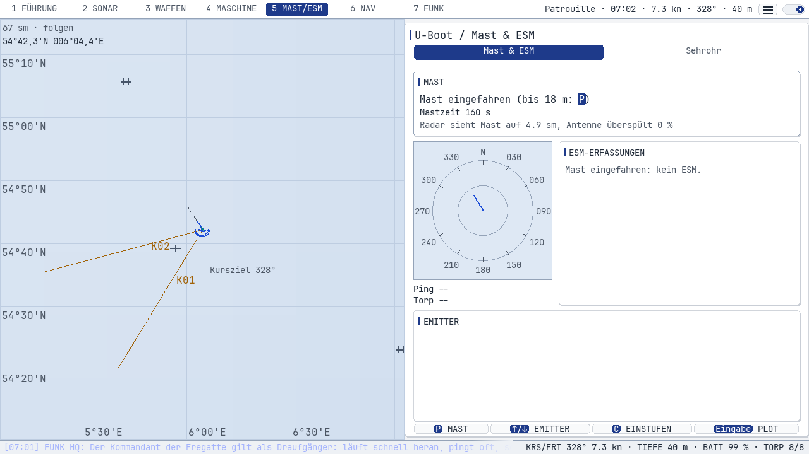

*Mast/ESM*

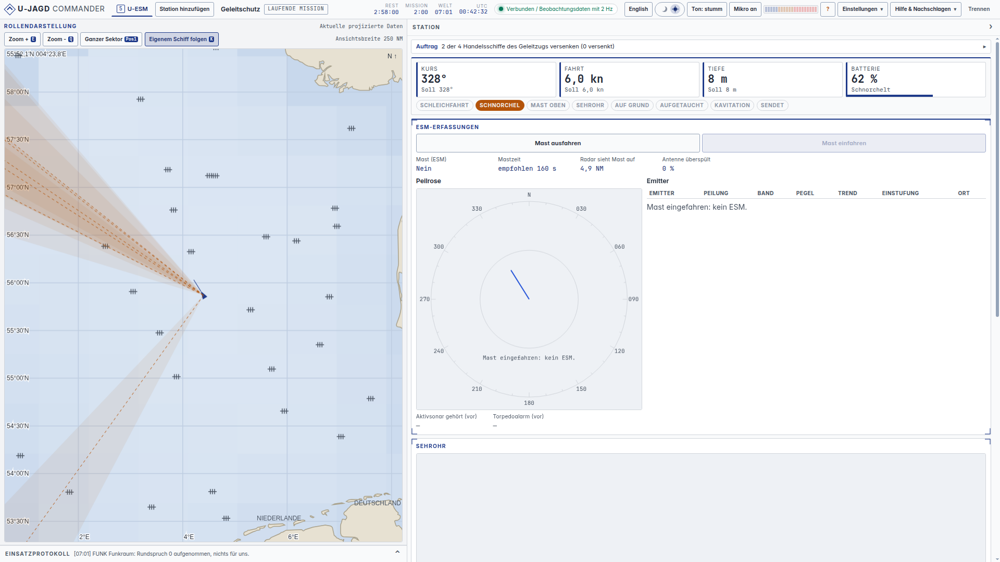

*Mast/ESM im Remote-Crew-Browser*

1. Den Mast (P) nur an Sehrohrtiefe und nur kurz ausfahren.
2. Die ESM-Rose beobachten: ein Hauptkeulentreffer heißt, das Radar sieht den Mast vielleicht schon.
3. Jeden Sender klassifizieren (← / →) und Kreuzpeilungen in den Plot geben (Eingabe).
4. Den Mast sofort einfahren, wenn ein Hubschrauber- oder Flugzeugradar stärker wird.
5. Auf der Sehrohrseite Stadimeter-Entfernungen für den Rechner nehmen (Eingabe).

### Navigation

Die Navigation befiehlt Kurs und Tiefe, achtet auf Kiel und Untiefen auf Lotsenkarte und Echolot, führt die Koppelnavigation und steuert die Route.

- **Karte & Echolot (Seite 1):** die Lotsenkarte um das U-Boot mit Tiefen, Untiefen und Land, das Echolot mit dem Wasser unter dem Kiel und die Lampe für den Koppelort. Ein Linksklick befiehlt den Kurs zu diesem Punkt.
- **Navigation (Seite 2):** die Lagekarte wie Seite 1 der Führung; ein Rechtsklick setzt einen Wegpunkt, `W` legt eine Zickzack- oder Quadratsuche, `Rück` löscht die Route.
- **Bedrohung (Seite 3):** wie die Bedrohungsseite der Führung; `I` weicht aus, `Umschalt+G` legt das U-Boot in flachem Wasser auf Grund.

Die Station Navigation öffnet auf ihrer eigenen Seite **Karte & Echolot**: vier Anzeigen (Tiefe, Lotung unter dem Kiel, Wasser unter dem Kiel, die Kartenprüfung voraus), eine Lotsenkarte von ±6 sm mit dem U-Boot in der Mitte, Norden oben (die Kartentiefe in Abstufungen mit Tiefenlinien bei 20, 50, 100, 200, 500, 1000 und 2000 m, Wasser flacher als die Kielgrenze rot und bis 30 m darunter gelb, Land, kartierte Hindernisse, Entfernungsringe alle 2 sm, in einem echten Seegebiet das Gradnetz in Grad und Minuten mit dem gekoppelten Ort oben links, das Kielwasser der letzten 10 Minuten, der befohlene Kurs bis zur 5-sm-Prüfung mit einem Strich alle 5 Minuten bei der jetzigen Fahrt und ein rotes Kreuz auf einem Hindernis voraus; ein Klick in die Karte befiehlt den Kurs zu diesem Punkt, wie mit `C` eingegeben) und einen **Echolot**-Streifen: Grund und eigene Tiefe der letzten 10 Minuten (eine Lotung alle 5 s), das Wasser unter dem Kiel gelb unter 30 m und rot unter 15 m, rechts das Kartenprofil entlang des befohlenen Kurses bis 5 sm mit der befohlenen Tiefe; die Kopfzeile nennt das geringste Wasser unter dem Kiel der 10 Minuten.

Die Aufzeichnung dient nur der Anzeige, wird nicht gespeichert und beginnt nach dem Laden leer.

**Plot:** Im Browser führen Führung und Navigation den eigenen Fettstift-Plot des U-Boots (Markierungen, Lineale, Peillinien, Kreise, Koppellinien). Auf der uConsole hat die U-Boot-Seite keine Zeichenwerkzeuge (`P` bedient dort den Mast), aber `Eingabe` auf der Seite Mast & ESM überträgt eine Kreuzpeilung oder Peillinie in den Plot, und die Karte jeder Station zeigt den Plot. Die Fregatte sieht ihn nie; der Plot wird mit dem Spiel gespeichert.

Die Navigation zeigt das Wasser unter dem Kiel und prüft die Seekarte entlang des Sollkurses bis 5 sm: Land oder ein Grund flacher als das U-Boot wird als Hindernis voraus gemeldet, im Log und als Warnung. Es zählt nur die kartierte Geografie; andere Fahrzeuge sind nicht Teil der Prüfung.

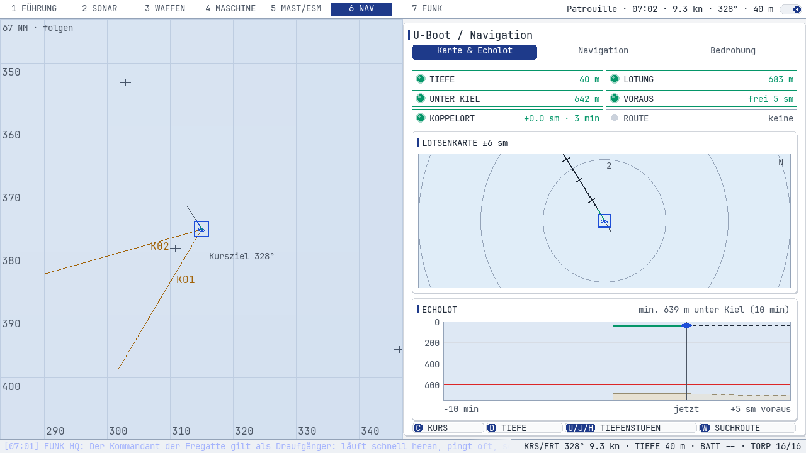

*U-Boot-Navigation*

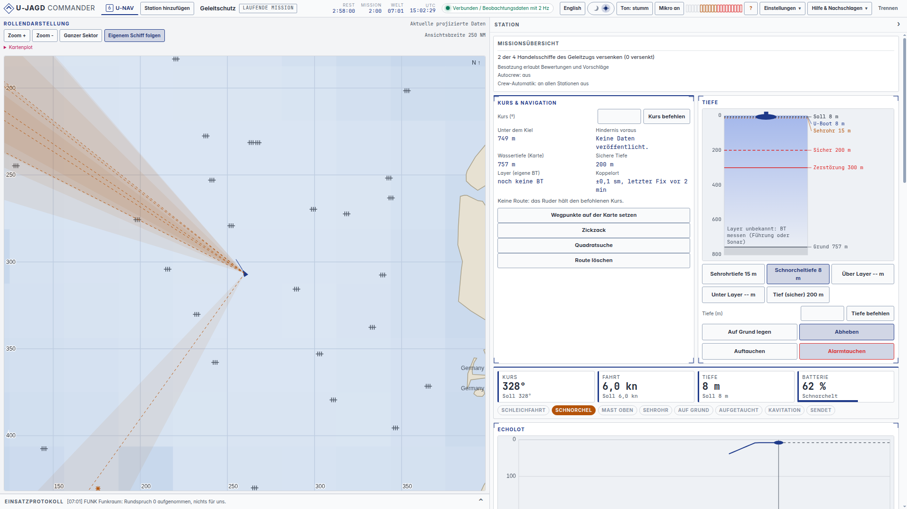

*U-Boot-Navigation im Remote-Crew-Browser*

#### Koppelnavigation und Route

- Getaucht kennt das U-Boot seinen Ort nur durch Koppeln. Der gekoppelte Ort wandert vom wahren Ort weg: durch eine gleichmäßige Versetzung bis 0,4 kn, die Log und Kreisel nicht sehen (die Trägheitsnavigation eines Atomboots wandert nur 0,3-mal so viel), dazu einmal pro Minute ein kleiner Zufallsschritt; der Fehler bleibt unter 8 sm.
- Die Karte der Crew (Küste, Tiefen, Hindernisse, Einsatzziel, HQ-Meldungen und Route) liegt dort, wo der Navigator sie gegenüber dem U-Boot vermutet. Das U-Boot selbst, seine eigenen Sonarkontakte und eigenen Torpedos bleiben dort, wo das U-Boot sie misst. Die Position in Grad und Minuten oben links in der Karte ist der gekoppelte Ort, nicht der wahre.
- Ein GPS-Fix: 20 s Mast oben an Sehrohrtiefe setzen den gekoppelten Ort wieder auf den wahren. Die Lampe **Koppelort** auf der Seite Karte & Echolot zeigt die eigene Fehlerschätzung des Navigators und die Minuten seit dem Fix oder den laufenden Fix.
- Kartencheck voraus und Route rechnen vom gekoppelten Ort; ein alter Fix kann das U-Boot so in Wasser führen, das die Karte für frei hält.
- Die Route: ein Rechtsklick auf die Karte setzt einen Wegpunkt (höchstens 8), `W` legt eine Zickzack- oder Quadratsuche ab dem U-Boot und schaltet weiter bis aus, `Rücktaste` löscht sie. Jeder Kursbefehl vom Ruder und jedes Ausweichen beendet die Route; das Klären der Hecklücke hat das Ruder, solange es läuft. Im Browser macht **Wegpunkte auf der Karte setzen** Klicks auf die Karte zu Wegpunkten.

1. Vor jedem Kurs- oder Tiefenbefehl die Lotsenkarte prüfen: Kiel, Untiefen und Land voraus.
2. Die Lampe Koppelort beobachten: getaucht wächst der Fehler; bei ruhiger Lage mit ausgefahrenem Mast einen GPS-Fix nehmen (20 s).
3. Eine Route mit Rechtsklicks oder einem Suchmuster (W) legen; ein Ruderbefehl beendet die Route.
4. Mindestens den Koppelfehler Abstand zu Untiefen halten: der Kartencheck rechnet vom gekoppelten Ort.
5. In flachem Wasser zum Verstecken auf Grund legen (Umschalt+G) und vor dem Losfahren abheben.

### Funkraum

Der Funkraum schreibt die Sendungen des HQ mit, liest Befehle und Kontaktmeldungen des HQ und sendet Lagemeldungen.

- Die Seite zeigt, wann die nächste Sendung des HQ kommt, ob eine Antenne oben ist (Mast `P` auf Sehrohrtiefe oder die Schleppbojenantenne `B` bis 60 m bei höchstens 6 kn), die Befehle und Kontaktmeldungen des HQ und das Protokoll.
- `Eingabe` sendet eine Lagemeldung; dazu muss der Mast oben sein, und die Fregatte kann sie mit KW-Peilung orten.

Der **Funkraum** hat eine Seite: Antenne, Rundspruchplan, Fortschritt von Aufnahme und Sendung, die letzte Feindlage der Führung und das Funktagebuch; `Eingabe` sendet eine Lagemeldung und `P` fährt den Mast aus oder ein.

Die Flottenführung sendet alle 10 Minuten einen U-Boot-Rundspruch (Rundspruch 0 bei Missionsbeginn, dann 1, 2 …) und wiederholt ihn bis zum nächsten. Das U-Boot nimmt ihn nur mit klarer Antenne auf, das heißt mit ausgefahrenem Mast auf Sehrohrtiefe, und erst nach 20 s ununterbrochenem Empfang innerhalb der Sendezeit dieses Rundspruchs; ein U-Boot, das tief bleibt, verpasst Rundsprüche und bekommt nur den jeweils neuesten. In 60 % der Fälle enthält ein Rundspruch die **Feindlagemeldung** der Führung zur Fregatte: einen 5 bis 15 Minuten alten Standort mit 4 sm Fehlerkreis und gerundetem Kurs und Fahrt. Die Karte zeigt ihn als gelben Kreis mit seinem Alter, und die Funkseite nennt Peilung und Entfernung vom U-Boot.

Eine **Lagemeldung** (`Eingabe` im Funkraum oder der Knopf im Browser) sind 20 s Kurzwellensendung mit klarer Antenne. Währenddessen kann der KW-Peiler der Fregatte das U-Boot peilen (Funkraum HF/DF), und Mast einfahren bricht sie ab. Die Führung bestätigt eine Meldung im nächsten Rundspruch und fügt dann immer eine schärfere Feindlagemeldung (2 sm) bei. Die Funkseite und die Karte Funkraum im Browser zeigen Antenne, Rundspruchnummer und Zeit bis zum nächsten, Fortschritt von Aufnahme und Sendung, gesendete Meldungen, die letzte Feindlage und das Funktagebuch (12 Einträge, wird gespeichert).

Unter dem Mast nimmt die **VLF-Rahmenantenne** den Rundspruch noch bis 25 m Tiefe auf, das langsame VLF-Signal braucht aber 60 s ununterbrochenen Empfang statt 20 s; sie empfängt nur, eine Lagemeldung braucht weiter den Mast. Noch tiefer bringt die **Bojenantenne** (`B` auf der Funkseite oder die Schaltflächen der Funkraum-Karte im Browser) in 60 s etwa 280 m achteraus aus und nimmt den Rundspruch bis 60 m Tiefe in 30 s auf, aber nur bei höchstens 6 kn (schneller wird sie unter Wasser gezogen); auch sie empfängt nur. Über 10 kn reißt das Kabel, und die Boje ist für die Mission verloren. Die kleine Boje auf dem Wasser kann der Ausguck der Fregatte aus der Nähe sehen (ein unbekanntes kleines Objekt, nie als U-Boot erkannt) und ihr Überwasserradar auf kurze Entfernung orten; Flugzeugbesatzungen achten nicht auf sie. Einholen dauert wieder 60 s.

Ab Rundspruch 2 kann ein Rundspruch einen **Befehl der Führung** enthalten (die Hälfte, solange kein Befehl offen ist, höchstens 4 je Mission; ein verpasster Rundspruch ist ein verpasster Befehl): ein Seegebiet 8 bis 15 sm entfernt in tiefem Wasser anlaufen und binnen 40 Minuten auf 3 sm erreichen (grüner Kreis auf der Karte), binnen 30 Minuten eine Lagemeldung absetzen oder 20 Minuten Funkstille halten (nicht senden). Die Funkseite und die Karte Funkraum im Browser zeigen den offenen Befehl mit Peilung, Entfernung und Restzeit sowie die Zahl der ausgeführten; das Funktagebuch vermerkt, welcher Rundspruch einen Befehl brachte. Befehle entscheiden die Mission nicht.

Ein Rundspruch gibt auch die Ereignisse auf See weiter, die HQ kennt (Treibnetz, Wetterfront, Wale; siehe Kapitel Funk); die Crew trägt ein Netz in die Karte des U-Boots ein. Mit ausgefahrener Antenne hört der Funkraum auch die Fregatte, wenn sie HQ ruft (Kontaktmeldung oder Unterstützungsanforderung, je 20 s): Er meldet die KW-Peilung (+/-8 Grad Bodenwelle, +/-16 Grad Raumwelle) und zeichnet einen 30 sm langen Peilstrahl mit der Beschriftung HF auf die Karte.

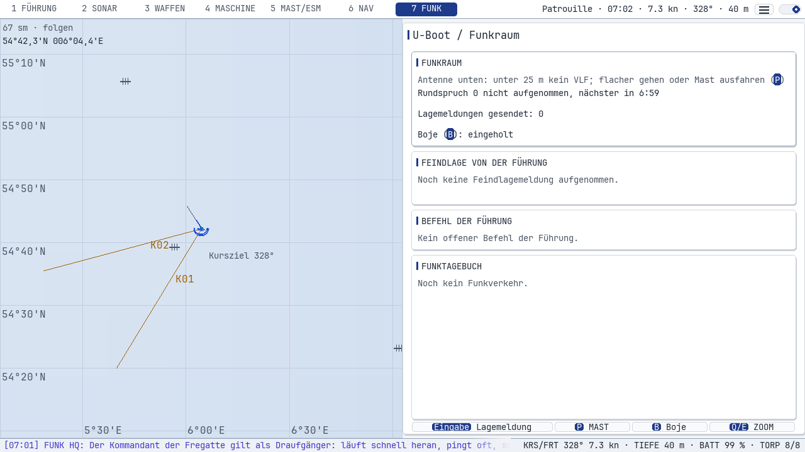

*U-Boot-Funkraum*

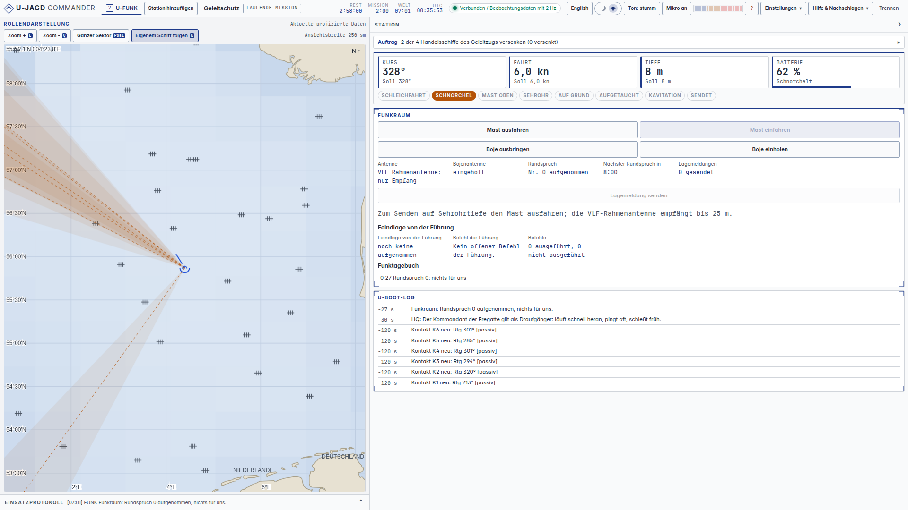

*U-Boot-Funkraum im Remote-Crew-Browser*

1. Die nächste HQ-Sendung notieren; sie mit Mast, Bojenantenne (B) oder VLF mitschreiben.
2. HQ-Befehle und Kontaktmeldungen an den Kommandanten geben; ihre Peilungen gelten vom gekoppelten Ort.
3. Lagemeldungen (Eingabe) nur auf Befehl oder in sicherer Lage senden: die Fregatte kann eine KW-Peilung nehmen.
4. Die Bojenantenne bei höchstens 6 kn ausbringen und vor mehr als 10 kn einholen.
5. Eine Kontaktmeldung altert mit jeder Minute: ihr Fehlerkreis wächst, das Ziel fährt weiter.

### Auftauchen und Alarmtauchen

- `Umschalt+H` (Browser: **Auftauchen**, Kommando oder Navigation) lässt das U-Boot an die Oberfläche gehen. Bei 2 m oder weniger ist es aufgetaucht: Das Niederdruckgebläse bläst die Hauptzellen in 2 Minuten aus (ohne Pressluft aus den Flaschen), das Luk ist offen und das U-Boot lüftet sich.
- Aufgetaucht laufen die Diesel (`N`) an der freien Luft: bis 12 kn (oder die Höchstfahrt des U-Boots) statt 6 kn am Schnorchel, und der Generator gibt das 1,3-fache seiner Schnorchelleistung, die Batterie lädt also schneller.
- Die Brückenwache sieht aus 6 m statt aus den 2,5 m des Sehrohrs und damit weiter; ihre Meldungen beginnen mit **Brücke:**, ein Flugzeug meldet sie als Alarm. Die Sehrohrseite zeigt den Blick der Brückenwache.
- Auch der Gegner sieht ein aufgetauchtes U-Boot: Das Überwasserradar der Fregatte und die Radare von Hubschrauber und Seefernaufklärer sehen Rumpf und Turm (das Zehnfache des Echos eines Masts), Ausgucks sehen es mit dem Auge.
- `H` von der Oberfläche oder mit ausgeblasenen Zellen (Browser: **Alarmtauchen**) ist das Alarmtauchen: Alarm, Masten und Schnorchel ein, Flutventile auf, äußerste Kraft, befohlene Tiefe 40 m. Ausgeblasene Zellen halten das U-Boot über 10 m, bis die Flutventile sie geflutet haben (bis 40 s), und das Fluten ist ein Geräusch, das der Gegner hören kann. Aus mehr als 12 m Tiefe wird Alarmtauchen abgelehnt.

### Besatzung, Geräusche und Rotlicht

**Besatzung:** das U-Boot hat einen eigenen Wachplan mit den Regeln der Fregatte (siehe Schadensabwehr, Besatzung und Wachen): drei Wachen, Ermüdung, Gefechtsstationen und Moral. Maschine und Führung befehlen Gefechtsstationen (`G` auf der uConsole wie auf der Fregatte, eine Taste in der Leckwehr-Karte im Browser) und lösen die Wache ab (`W` auf der Seite Leckwehr oder die Taste). Die Moral steigt, wenn ein Schiff sinkt, und sinkt mit je 10 % Rumpfschaden. Eine müde Besatzung hört am Sonar später, sichtet durch das Sehrohr später und ihre Leckwehrtrupps dichten und löschen langsamer (die Pumpen sind Maschinen und behalten ihre Leistung).

**Verwundete** folgen ebenfalls den Regeln der Fregatte: Rumpfschaden (ein Verwundeter je 15 % in einem Treffer) und eine Minute in einer vollgelaufenen, brennenden oder vergasten Abteilung verwunden Leute in der Zentrale (Sonar, 4 Posten), im Bugraum (Torpedomannschaft, 4 Posten) oder im übrigen U-Boot (Leckwehr, 8 Posten); leere Posten verlangsamen die Sonarerkennung, das Laden und Fluten der Rohre und die Leckwehrtrupps. Das Protokoll meldet die Verwundeten; die Seite Leckwehr zeigt sie mit den leeren Posten und der Reserve. `M` schickt den Sanitätstrupp zur nächsten Station, `U` besetzt die am schwersten getroffene Station aus den Freiwachen um (die Leckwehr-Karte im Browser hat beide Tasten).

**Atmosphäre:** das U-Boot hat eigene Geräusche, am uConsole, wenn er das U-Boot spielt, und in den Browsern des U-Boots bei eingeschaltetem Ton (nie auf der Fregatte). Ab 60 % der Testtiefe knarzt der Rumpf, erst ab und zu, ab der Testtiefe alle 12 bis 28 s; ein Versagen des Druckkörpers kracht. Jede Detonation im Wasser im Umkreis von 30 sm (ein Torpedo- oder Flugkörpertreffer, ein torpediertes Handelsschiff) ist zu hören: innerhalb von 2 sm als schwerer Schlag dicht beim U-Boot, weiter weg als dumpfes, fernes Grollen, und das Log meldet sie mit der Peilung, die die Ohren der Crew liefern (einige Grad daneben). Das Ping eines Jägers (Rumpfsonar, Tauchsonar oder aktive Boje) klingt am Rumpf an. Mit Stereoton kommen beide aus dieser Peilung, links für Backbord und rechts für Steuerbord vom Bug des U-Boots aus.

Bei **Schleichfahrt** schaltet das U-Boot auf Rotlicht: die U-Boot-Bildschirme am uConsole und die Führungsstationen des U-Boots im Browser werden gedimmt rot, bis die Schleichfahrt endet. Das Gefechtsstationen-Signal des U-Boots ist nur eine leise Alarmklingel, und beim Einschalten der Schleichfahrt laufen die Lüfter hörbar aus, beim Aufheben wieder an.

### Missionsende, Nachbesprechung und Sprachmeldungen

**Mission:** Aus Sicht des U-Boots ist eine Mission gewonnen, wenn die Fregatte sinkt, wenn das U-Boot entkommt (150 sm von seinem Start) oder wenn es in einer Jagd bis zum Zeitlimit durchhält; sinkt das U-Boot, sieht seine Crew „U-Boot verloren“.

`D` im Endfenster des U-Boots öffnet dessen eigene **Nachbesprechung**: seinen Weg, was sein Sonar von der Fregatte hielt, die wahren Positionen von Fregatte, Hubschrauber, Seefernaufklärer und Bojen, Torpedos in beide Richtungen, die Pings, die es abbekam, und die Zeitspannen (mindestens 1 min), in denen das Sonar der Fregatte es wirklich hielt, markiert unter oder über der Schicht.

Gesprochene Crew-Meldungen (Optionen Seite 2) sprechen das Log des U-Boots, wenn die uConsole das U-Boot spielt: Torpedo und Pings gehört, Bojen-Splash, neuer Kontakt, Ausweichen, Mastwarnung, Leck, Brand, Gefechtsstationen, jeder eigene Torpedo los (das Log nennt das Rohr), Detonationen nah oder entfernt und Sinkgeräusche mit ihrer gemessenen Peilung, ein aufgenommener Rundspruch der Führung (mit oder ohne Feindlagemeldung zur Fregatte), eine neue Sehrohrsichtung mit Art und Peilung, das Passieren von 90 % der Testtiefe und das Unterschreiten der Testtiefe beim Tiefergehen, ein Treffer, jedes Versagen des Druckkörpers sowie der gewonnene oder verlorene Auftrag; Browser an U-Boot-Stationen bekommen dieselben Meldungen.

### KI-Jäger

Wenn niemand die Fregatte fährt (die uConsole spielt das U-Boot oder ein Solo-Browser das U-Boot), besetzen KI-Jäger jede Fregattenstation, die kein Browser hält; eine Station, die ein Browser übernimmt, überlassen sie ihm sofort. Sie lesen nur, was die Sensoren der Fregatte melden, nie Position oder Identität des U-Boots:

- **Klassifizierung:** Ein Kontakt, dessen gehörte Signatur die Bibliothek nur von U-Booten kennt, wird als U-Boot klassifiziert, wie ein Bediener es nach dem Vergleich mit der Bibliothek täte; das Erkennen dauert im Mittel 3 Minuten. Andere Kontakte bleiben unklassifiziert.
- **Datum:** der frischeste geortete U-Boot-Kontakt (Ping, TMA oder Bojenfix); sonst das jüngste aus einer Radar-Mastspur bis 10 Minuten alt, einer HF/DF- oder ESM-Kreuzpeilung bis 15 Minuten alt und einer U-Boot-Datummeldung der Führung bis 30 Minuten alt; sonst die Peilung eines U-Boot-Kontakts; sonst die frischere aus einer HF/DF-Peilung und einer ESM-Peilung auf ein Mastradar bis 5 Minuten alt (ein Intercept, dem die Bibliothek unter ihren drei besten Treffern ein U-Boot-Radar zuordnet, auf dessen Peilung innerhalb 10° kein Radar- oder AIS-Schiff steht und das höchstens 10 Minuten zu hören ist: ein Radar, das länger strahlt, ist ein Schiff); sonst eine Spur. Eine verlorene U-Boot-Peilung bleibt 20 Minuten eine Spur: Die Fregatte läuft die Linie vom Ort, an dem sie gehört wurde, ab, 8 sm vor ihrer eigenen Position darauf, höchstens 60 sm hinaus. In den Fregatten-Szenarien ist die Startmeldung der Führung über die Bedrohung (Peilung und Entfernung vom Schiff) eine Stunde lang eine Spur, bis das Schiff innerhalb 3 sm der gemeldeten Position ist. In den U-Boot-Szenarien 4 und 5 meldet die Führung zum Start keine Bedrohungsposition und gibt kein U-Boot-Datum: Die Fregatte kennt nur, was sie bewacht. Die Spuren werden gespeichert (Spielstand v43). Die OPZ markiert jeden bloßen Radarpunkt eines ausgefahrenen Masts oder Schnorchels wie ein Bediener als Spur, und eine Mastspur innerhalb 10° der Peilung eines U-Boot-Kontakts gilt als dieser Kontakt. Der Funkraum nimmt HF/DF-Peilungen und Kreuzpeilungen wie die Autocrew. Die EloKa trägt eine höchstens 30 s alte ESM-Peilung auf ein Mastradar als Linie vom eigenen Standort ein, eine neue Linie erst, nachdem das Schiff 1 sm von der letzten gelaufen ist (höchstens 8, je 15 Minuten), und kreuzt die neueste Linie mit der jüngsten früheren, die sie unter mindestens 15° schneidet, höchstens 60 sm entfernt: diese ESM-Kreuzpeilung ist ein Positionsdatum wie ein HF/DF-Fix.
- **Brücke:** Im Geleitzugangriff hält die Fregatte ihre Position 3 sm vor dem Geleitzug und pendelt alle 5 Minuten 45° zu beiden Seiten (mehr als 2,5 sm abseits schließt sie mit 18 kn auf); ein Datum bearbeitet sie nur innerhalb 8 sm vom Geleitzug; beim Versorgerschutz ist der Versorger ihr Geleitzug. Ohne Datum fährt sie bei der Meerengen-Sperre mit 10 kn quer durch die Sperre und wendet 1,5 sm vor jedem Ufer, bei den Kampfschwimmern entlang des Küstenabschnitts (70 % seines Radius zu beiden Seiten der Mitte) und schließt mit 18 kn auf, wenn sie außerhalb ist. Sonst sucht die Fregatte ohne Datum mit 10 kn im Zickzack (Schläge von 10 Minuten), dessen Grundkurs sich alle 30 Minuten um 90° dreht. Zu einem Positionsdatum weiter als 6 sm läuft sie mit 18 kn, ein näheres bearbeitet sie mit 8 kn auf einem Querkurs (60° versetzt, alle 5 Minuten die Seite wechselnd), damit Schleppantenne und TMA Peilungsänderung bekommen; auf eine bloße Peilung steuert sie 30° daneben mit 14 kn, und eine Spur läuft sie mit 14 kn ab. Gegen einen Durchbruch (5) bewacht sie ihre Patrouillenposition: Ein Datum bearbeitet sie nur innerhalb 6 sm davon, und ohne Datum kehrt sie zurück, sobald sie mehr als 3 sm abseits ist. Bei der Meerengen-Sperre bearbeitet sie ein Datum nur bis 6 sm über die Enden der Sperre hinaus, bei den Kampfschwimmern nur innerhalb des Küstenabschnitts. Vor Torpedos und Flugkörpern dreht sie wie die Autocrew ab und steuert nie in flaches Wasser.
- **Sonar und Waffen:** Das Schiff pingt alle 10 Minuten auf einen U-Boot-Kontakt ohne frische Entfernung (ein Ping, der nichts findet, scheucht das U-Boot nur davon) und schießt einen Torpedo (oder die eingestellte Salve) auf ein geortetes U-Boot innerhalb 6 sm (in den U-Boot-Szenarien 1, 2, 4 und 5, in denen sie ihren Posten bewacht, innerhalb 3 sm), erneut erst, wenn er nicht mehr läuft. Gegen einen gehörten Torpedo gehen Nixies aus.
- **Hubschrauber:** Er startet für ein Datum innerhalb 30 sm (in den U-Boot-Szenarien 1, 2, 4 und 5 innerhalb 8 sm; wenn Wetter und Deck es erlauben), sobald das Deck ihn klargemacht hat (im Mittel 10 Minuten), fliegt zum Datum oder 8 sm die Peilung hinab und taucht das Sonar. Auf eine Position pingt er alle 30 s, auf eine bloße Peilung horcht er nur. Auf ein geortetes U-Boot innerhalb 1,5 sm wirft er aus einem höchstens 2 Minuten alten Fix einen Torpedo, einen nach dem anderen. Ohne Datum kehrt er zurück.
- **Seefernaufklärer:** Er wird angefordert, sobald ein Positionsdatum besteht (nie für eine bloße Peilung und nie in U-Boot-Szenario 1, in dem die Fregatte die Durchfahrt allein bewacht), fliegt mit eingeschaltetem Radar zum Datum, legt einen Bojenkreis, wo im Umkreis von 4 sm keine Boje horcht, und greift ein geortetes U-Boot in seiner Abwurfweite aus einem höchstens 2 Minuten alten Fix über den Datenlink an.
- **ASROC:** Ein Positionsdatum der eigenen Sensoren (keine Meldung der Führung und keine ESM-Kreuzpeilung), höchstens 2 Minuten alt, geht per Datenlink an das nächste befreundete KI-Kriegsschiff mit ASROC in Reichweite, höchstens alle 2 Minuten und nie, solange ein ASROC fliegt oder sein Torpedo läuft. Die KI-Jäger feuern weder das eigene ASROC der Fregatte noch ihre Wasserbomben (beides bleibt einem Spieler an der Waffenstation vorbehalten), und die U-Boot-Szenarien stellen dafür keinen Geleitschutz.
- Die übrigen Stationen (Schadensbekämpfung, Maschinenraum, OPZ-Luftverteidigung, EloKa) laufen mit den Regeln der Autocrew. Die Jagd hat keinen eigenen Zustand; die Radarpunkte und Markierungen der OPZ, nach denen sie handelt (Spielstand v25), die ESM-Linien der EloKa (Spielstand v39) und ihre Spuren (Spielstand v43) werden gespeichert, ein geladenes Spiel setzt sie also unverändert fort.

### Tasten

Alle Tasten des U-Boots auf der uConsole (`F1` an einer U-Boot-Station zeigt dieselbe Tabelle):

| Taste | Funktion |
|---|---|
| `1 … 7 / Tab` | Stationen: 1 Führung, 2 Sonar, 3 Waffen, 4 Maschine, 5 Mast & ESM, 6 Navigation, 7 Funkraum; Tab weiter (oder Reiter anklicken) |
| `C / V / D` | Kurs / Fahrt / Tiefe befehlen (Führung; Kurs und Tiefe auch Navigation, Fahrt auch Maschine) |
| `U / J / H` | Tiefenstufen: Sehrohr- / Schnorcheltiefe (Umschalt), unter / über dem gemessenen Layer (Umschalt), tief (Führung, Navigation) |
| `Bild auf/ab` | Führungsseiten: Navigation / Waffen & Kontakte / Sehrohr / Bedrohung (oder erneut 1); Seiten Navigation: Karte & Echolot / Navigation / Bedrohung (oder erneut 6); Seiten Mast & ESM: ESM / Sehrohr (oder erneut 5) |
| `Q / E` | Karte in Stufen zoomen, 500 bis 0,5 sm (Sehrohrseite: das Mausrad zoomt die Karte) |
| `K` | Karte folgt dem U-Boot an/aus |
| `Mausrad / Ziehen` | Karte zoomen / verschieben (Maus auf der Karte) |
| `Linksklick` | Kurs zu einem Punkt der Lotsenkarte befehlen (Navigation, Karte & Echolot) |
| `Pfeiltasten` | Eigenen Sonarkontakt wählen |
| `Strg+Eingabe` | Torpedo auf den gewählten Kontakt schießen (Waffen) |
| `F` | Auf eine eingegebene Peilung schießen: Peilung, Eingabe, Entfernung zum Datum (leer: keine), dann schießt Strg+Eingabe (Waffen) |
| `V` | Täuschkörper ausstoßen (Waffen) |
| `M` | Nächstes leeres Torpedorohr laden (Waffen) |
| `Shift+M` | Nächstes geladenes Rohr fluten (20 s) und Mündungsklappe öffnen; laut, die Fregatte kann es hören; nur ein geflutetes Rohr schießt (Waffen) |
| `Strg+M` | Nächstes geladenes Rohr langsam fluten (60 s); die Fregatte hört es nur ganz nah (Waffen) |
| `Umschalt+B` | Notanblasen, einmal (Führung, Maschine) |
| `T` | Torpedo-Lauftiefe 5-300 m (Waffen) |
| `Y` | Ein Torpedo oder Zweierfächer (Waffen) |
| `X` | Suchmuster des Suchers: gerade, Schlange, Kreis, Helix (Waffen) |
| `, / .` | Sucheraktivierung -/+ (0,6 bis 3,0 sm vor dem Datum, Schritte 0,2 sm; Waffen) |
| `W` | Neuesten Drahttorpedo lenken: Peilung, dann Entfernung (Waffen) |
| `Shift+W` | Draht des neuesten Torpedos kappen (Waffen) |
| `A` | Schleichfahrt ein/aus, höchstens 5 kn (Führung, Maschine) |
| `Shift+A` | Aktiver Ping mit dem eigenen Sonar (Führung und Sonarraum) |
| `Shift+G` | Auf Grund legen / abheben (Führung, Navigation) |
| `Shift+H` | Auftauchen: an die Oberfläche, Brückenwache, Diesel an der Luft (Führung, Navigation) |
| `H` | Von der Oberfläche: Alarmtauchen, Flutventile auf, äußerste Kraft (Führung, Navigation) |
| `N` | Schnorchel aus-/einfahren, Diesel laden auf Schnorcheltiefe (Maschine) |
| `P` | Mast aus-/einfahren auf Sehrohrtiefe: ESM hört Radare, das Sehrohr sieht, die Funkantenne ist klar (Führung, Mast & ESM, Funkraum) |
| `Pfeiltasten` | Seite Mast & ESM: Emitter wählen |
| `C / ← / →` | Seite Mast & ESM: Emitter aus der Bibliothek einstufen (C oder →: weiter, Umschalt+C oder ←: zurück; Annotation, keine Wahrheit) |
| `Eingabe` | Seite Mast & ESM: Kreuzpeilung (oder Peillinie) in den Plot des U-Boots |
| `← / →` | Sehrohrseite: Rohr 2° schwenken (Umschalt: 10°) (Führung, Mast & ESM) |
| `↑/↓ · Q/E · Space` | Sehrohrseite (wie das Fernglas): ↑/↓ Kopf 2° neigen (Umschalt: 10°), Q/E kleine/große Vergrößerung (32°, 8° Feld), Leertaste Stabilisierung |
| `Eingabe` | Sehrohrseite: Stadimeter-Entfernung der Sichtung unter dem Fadenkreuz (Führung, Mast & ESM) |
| `Strg+Eingabe` | Sehrohrseite: Schuss nach der Lösung des Angriffsrechners für die Sichtung unter dem Fadenkreuz (Führung) |
| `+ / -` | Fahrtstufe schneller / langsamer (Führung, Maschine) |
| `Sonartasten` | Wie am Fregattensonar, ohne Schleppantenne, OPZ-Freigabe, Plot und Telegraph |
| `R` | Maschine, Seite Vorräte: Laderate beim Schnorcheln wechseln (voll, halb, nur lüften) |
| `Shift+O` | Maschine, Seite Vorräte: neuen CO2-Absorbersatz einsetzen |
| `O` | Maschine, Seite Vorräte: O2-Kerze zünden |
| `Pfeiltasten` | Maschine, Seite Zellen: Regelzelle fluten (ab) oder lenzen (auf) |
| `← / →` | Maschine, Seite Zellen: Trimmwasser nach vorn (rechts) oder achtern (links) |
| `Z` | Maschine: Trimmautomatik an/aus |
| `Pfeiltasten` | Maschine, Seite Leckwehr: Abteilung wählen (auf/ab) und Aufgabe (links/rechts) |
| `Eingabe` | Maschine, Seite Leckwehr: Trupp 1 (Umschalt: Trupp 2) mit der Aufgabe schicken |
| `I` | Maschine, Seite Leckwehr: Schotten der Abteilung schließen oder öffnen |
| `I` | Führung, Navigation: dem frischesten Ping- oder Torpedoalarm ausweichen (Kurs, Fahrt, Schicht, Schleichfahrt oder Täuschkörper) |
| `Eingabe` | Funkraum: Lagemeldung an die Führung senden (Mast auf Sehrohrtiefe ausgefahren; die Fregatte kann die KW-Sendung peilen) |
| `B` | Funkraum: Bojenantenne ausbringen oder einholen (Rundspruch bis 60 m bei höchstens 6 kn; reißt über 10 kn ab) |
| `W` | Maschine, Seite Leckwehr: Wache jetzt ablösen |
| `M` | Maschine, Seite Leckwehr: Sanitätstrupp zur nächsten Station mit Verwundeten |
| `U` | Maschine, Seite Leckwehr: Leute aus den Freiwachen zur am schwersten getroffenen Station |
| `G` | Gefechtsstationen an/aus (alle Wachen im Dienst, aufmerksam, aber ermüdend) |
| `Ctrl+B` | Toten Winkel klären: zwei Minuten 60° nach Steuerbord, dann zurück (das Rumpfsonar ist achtern taub) |
| `Rechtsklick` | Routen-Wegpunkt auf der Karte setzen (Navigation) |
| `W` | Route: Zickzack-Suche, wachsendes Quadrat, aus (Navigation) |
| `Backspace` | Route löschen (Navigation) |
| `0` | Wetterseite des U-Boots (0 oder Esc schließt) |
| `S / L / F9` | Speichern / Laden / Remote Crew (die Fregatten-Crew) |
| `Menü-Symbol (Kopfzeile)` | Spielmenü per Maus: Hilfe, Optionen, Speichern/Laden, Wetter, Plot, Autocrew, Beenden und mehr; jedes Overlay schließt mit seinem Schließfeld (wie Esc) |

### Maus

- Jede Taste in der Tastenleiste einer Station lässt sich anklicken; Lampen, Seitenreiter und Tastenhinweise im Text drücken ihre Tasten, und die Stationsreiter in der Kopfzeile wechseln die Station.
- Ein Klick auf die Kurs-, Fahrt- oder Tiefenscheibe befiehlt diesen Wert.
- In der Feuerleitung flutet die Lampe eines trockenen Rohrs dieses, die eines leeren lädt es; der Täuschkörper hat einen Tastenchip. Die Feuertaste `Strg+Eingabe` lässt sich nur an der Station Waffen anklicken.
- Navigation, Karte & Echolot: Ein Linksklick auf die Lotsenkarte befiehlt den Kurs zu diesem Punkt; auf der Seite Navigation setzt ein Rechtsklick einen Wegpunkt der Route.
- Ein Klick auf eine Zeile der Emitterliste wählt diesen Emitter. Auf der Karte zoomt das Mausrad, Ziehen verschiebt.

### Nicht modelliert

- Keine Ortsbestimmung über Landmarken, Lotungen oder Sterne; nur GPS löscht den Koppelfehler.
- Der Plot behält seine Marken dort, wo sie gegenüber dem U-Boot gezeichnet wurden; er wandert mit einem Fix nicht mit.
- Keine eigene Zentrale und kein LI-Platz; Trimm und Ballast bleiben beim Maschinenraum.
- Der Funkraum kennt den Rundspruchplan der Führung, drei Befehlsarten (sieben auf freier Fahrt) und Lagemeldungen: keine freien Nachrichten der Führung, kein Empfang unter 25 m ohne Bojenantenne und keiner unter 60 m (kein ELF, keine Schleppdrahtantenne), keine Kurzsignale und keine anderen Einheiten im Netz; die Feindlage der Führung ist modellierte Aufklärung, kein eigener Sensor.
- Die Leckwehr kennt sechs Abteilungen und zwei Trupps: keine getrennten Schäden an Druck- und Außenhülle, keine Ausbreitung von Rauch oder Hitze, kein Brand in den Luftvorräten und kein Sauerstoffverbrauch durch Feuer; der Gesamtschaden des U-Boots (Lärm, Höchstfahrt, Untergang bei 100 %) summiert sich weiter aus Treffern, und die KI-U-Boote haben nur diesen Wert.
- Unter der Testtiefe kennt der Druckkörper keine einzelnen Armaturen, kein allmähliches Zusammendrücken und keine verstärkten Nähte aus einer Werftzeit; ein Versagen wählt Art und Abteilung zufällig, und ein zerdrücktes U-Boot ist sofort verloren.
- Die Geräusche des U-Boots sind einfache Signale: Stereo unterscheidet nur Backbord von Steuerbord (voraus und achteraus klingen gleich), eine Detonation liefert keine Entfernungsschätzung und kein Knarzen kommt aus einer bestimmten Abteilung; der Sonarraum des U-Boots hat kein Rotlicht.
- Das Trimmmodell kennt ein Gewicht und ein Moment: keinen Effekt freier Oberflächen, keine Kompressibilität des Druckkörpers mit der Tiefe und keine eigene Schnelltauchzelle; das U-Boot taucht nicht ganz auf. Proviant und Frischwasser gehen nicht aus.
- Ein ausgefahrener Mast oder Schnorchelkopf erscheint auf dem Fregattenradar nur als bloßer Punkt (siehe Kapitel OPZ). Die Schaumfahne eines ausgefahrenen Masts hängt nur von der Fahrt ab (nicht von der Mastlänge über Wasser oder dem Kurs zur See), und die Crew warnt nur einmal, sobald das U-Boot mit oben stehendem Mast schneller als 5 kn läuft.
- Das ESM des U-Boots hört keine Radare anderer U-Boote und keine Flugkörpersucher; es hat keine gewichtete Wahrscheinlichkeitsanalyse und keine Bewegungsanalyse eines Senders (die Kreuzpeilung nimmt einen langsamen Sender an).
- Die Passung ist die Lesart der Crew aus den veröffentlichten Bereichen, keine Wahrscheinlichkeit: ein Breitbandradar, nahe der Mitte seines Bereichs gemessen, kann besser passen als der wahre Sender nahe dem Rand, und der Browser zeigt die ersten 8 Einträge.
- Das ASROC der KI-Jäger kommt nur von befreundeten Kriegsschiffen, die ohnehin im Szenario sind, nie vom eigenen Starter der Fregatte.
- Das Sehrohr hat keine Kamera; Sichtungen tragen keine Identifikation über die grobe Klasse hinaus, und das Stadimeter nimmt eine Klassenlänge statt einer Masthöhe an.

## Szenarien und Missionen

Jede Seite hat zwölf Szenarien, in ihrer eigenen Liste ab 1 gezählt: `1`-`9` und `0` wählen die ersten zehn, das elfte und zwölfte erreichen Sie mit den Pfeiltasten. Die Tabellen nennen das Ergebnis, wie die Endtafel es wertet, und das Zeitlimit des Kurzeinsatzes (Kapitel Hauptmenü, Einweisung).

### Fregatten-Szenarien

| Nr. | Szenario | Fregatte gewinnt | Fregatte verliert | Kurz |
|---|---|---|---|---|
| 1 | Patrouille | Ziel-U-Boot versenkt | Ziel entkommt / Zeitlimit / Fregatte gesunken / ziviler Verlust | 30 min |
| 2 | Doppeljagd | Beide Ziel-U-Boote versenkt | Ziel entkommt / Zeitlimit / Fregatte gesunken / ziviler Verlust | 60 min |
| 3 | Nuklearer Abfang | SSN vor Zeitablauf versenkt | SSN entkommt / Zeitlimit / Fregatte gesunken | 45 min |
| 4 | Freie Jagd (Zufall) | wie auf der Seite Schwierigkeit gewählt | wie auf der Seite Schwierigkeit gewählt | keine |
| 5 | Geleitschutz | U-Boot versenkt oder Geleitzug bis zum Zeitlimit durchgebracht | Zwei Handelsschiffe versenkt / Fregatte gesunken | 35 min |
| 6 | Brennendes Datum | U-Boot versenkt | U-Boot verlässt den Datumskreis / Zeitlimit / Fregatte gesunken | 45 min |
| 7 | Fühlung halten | Fühlung lange genug gehalten | Fühlung 20 Minuten verloren / Zeitlimit | 45 min |
| 8 | Hafenschutz | U-Boot versenkt oder Absetzen bis zum Zeitlimit verhindert | Kampfschwimmer abgesetzt / Fregatte gesunken | 45 min |
| 9 | Versorgung auf See | Übergabe fertig oder U-Boot versenkt | Tanker versenkt / Zeitlimit / Fregatte gesunken | 45 min |
| 10 | Seenot unter Bedrohung | Beide Besatzungen gerettet | Besatzung verloren / Zeitlimit / Fregatte gesunken | 45 min |
| 11 | Suchgruppe | Beide U-Boote versenkt | Zeitlimit / Fregatte gesunken | 45 min |
| 12 | Freie Fahrt | Kein Sieg: Punkte sammeln, solange die Fregatte schwimmt | Fregatte gesunken / ziviler Verlust | keine |

Die Patrouille (1) bringt immer ein altes Diesel-U-Boot; in etwa der Hälfte der Starts greifen dazu feindliche Flugzeuge die Fregatte mit Seezielflugkörpern an. Die freie Jagd (4) zieht Diesel-, AIP- oder Atom-U-Boote zufällig.

### U-Boot-Szenarien

| Nr. | Szenario | U-Boot gewinnt | Fregatte gewinnt | Kurz |
|---|---|---|---|---|
| 1 | Durchbruch | U-Boot erreicht das Zielgebiet / Fregatte gesunken | U-Boot versenkt oder bis zum Zeitlimit ferngehalten | 60 min |
| 2 | Aufklärung | U-Boot meldet die Fregatte in Sicht / Fregatte gesunken | U-Boot versenkt oder Meldung bis zum Zeitlimit verhindert | 45 min |
| 3 | Geleitzug | Zwei Handelsschiffe versenkt / Fregatte gesunken | U-Boot versenkt oder Geleitzug bis zum Zeitlimit durchgebracht | 35 min |
| 4 | Meerengen-Sperre | U-Boot passiert die Meerenge / Fregatte gesunken | U-Boot versenkt oder Meerenge bis zum Zeitlimit gehalten | 45 min |
| 5 | Kampfschwimmer | Kampfschwimmer abgesetzt / Fregatte gesunken | U-Boot versenkt oder Absetzen bis zum Zeitlimit verhindert | 45 min |
| 6 | Versorgerschutz | Versorger versenkt / Fregatte gesunken | U-Boot versenkt oder Versorger bis zum Zeitlimit durchgebracht | 45 min |
| 7 | Duell | Fregatte gesunken / U-Boot beim Zeitlimit noch da | U-Boot versenkt | 45 min |
| 8 | Angeschlagen heim | U-Boot erreicht sein Heimatgebiet / Fregatte gesunken | U-Boot versenkt oder bis zum Zeitlimit aufgehalten | 60 min |
| 9 | Agenten abholen | Team abgeholt und entkommen / Fregatte gesunken | U-Boot versenkt oder Abholung bis zum Zeitlimit verhindert | 45 min |
| 10 | Lauschposten | Aufzeichnung gemeldet / Fregatte gesunken | U-Boot versenkt oder Meldung bis zum Zeitlimit verhindert | 45 min |
| 11 | Jagdgruppe | U-Boot erreicht das Zielgebiet / Fregatte gesunken | U-Boot versenkt oder bis zum Zeitlimit ferngehalten | 60 min |
| 12 | Freie Fahrt | Kein Sieg: Punkte sammeln, solange das U-Boot schwimmt | U-Boot gesunken | keine |

### Fregatten-Missionen im Einzelnen

Die Fregatten-Szenarien 5 bis 10 geben der Fregatte über das Versenken des U-Boots hinaus ein eigenes Ziel; ein KI-U-Boot spielt die Gegenseite (oder eine U-Boot-Besatzung in den Browsern, deren Auftragszeile das Gegenziel zeigt). Ihre Kurzeinsätze dauern 35 Minuten (Geleitschutz) oder 45 Minuten. Die Fortschrittszähler (Fühlung, Abholung der Agenten, Lauschposten) werden gespeichert (Speicherstand v45).

- **Geleitschutz (5):** der Geleitzugangriff aus Sicht der Fregatte: vier Handelsschiffe mit 8 kn in einem Viereck von etwa 1 sm um die Fregatte, das U-Boot wartet vor dem Bug des Geleitzugs. Die Fregatte gewinnt, wenn sie das U-Boot versenkt oder der Geleitzug 3 Stunden durchhält; sie verliert, wenn zwei Handelsschiffe versenkt sind. Hört die Fregatte einen Torpedo, warnt sie den Geleitzug: etwa jedes zweite Handelsschiff bekommt die Warnung rechtzeitig und dreht für 90 s um 60° von der Peilung des Torpedos weg, dann zurück auf den Kurs des Geleitzugs.
- **Brennendes Datum (6):** Im Gebiet des Szenarios wurde gerade ein Handelsschiff torpediert; die Startmeldung des HQ nennt die genaue Position (Peilung und Entfernung vom Schiff), und die Karte zeigt einen DATUM-Kreis von 12 sm Radius (6 sm im Kurzeinsatz) darum. Die Fregatte startet etwa 20 sm entfernt (10 sm), das U-Boot 1 sm vom Wrack; es läuft die ersten 30 Minuten mit 9 kn und schleicht dann. Die Fregatte gewinnt, wenn sie das U-Boot versenkt; das U-Boot gewinnt, wenn es den Kreis verlässt oder das Zeitlimit (2 Stunden) abläuft.
- **Fühlung halten (7):** Frieden. Das HQ übergibt ein fremdes Atom-U-Boot 6 sm voraus mit Position, Kurs und Fahrt. Auf beiden Seiten gilt Waffenruhe: Torpedos, ASROC, Wasserbomben und Raketen der Fregatte sowie die Torpedos von Hubschrauber und Seefernaufklärer werden abgewiesen („Waffen gesperrt“), und kein U-Boot schießt. Das U-Boot sprintet alle 10 Minuten 4 Minuten lang mit 22 kn auf einem neuen Kurs bis 60° neben seinem Kurs und treibt dazwischen mit 4 kn. Die Fühlung gilt als gehalten, solange das Sonarlagebild der Fregatte das U-Boot in den letzten 30 s gehört und in den letzten 10 Minuten geortet hat (Entfernung aus Ping oder TMA); die Auftragszeile zählt die Minuten. Die Fregatte gewinnt, sobald die Fühlung 80 % der Einsatzzeit gehalten wurde (96 von 120 Minuten; im Kurzeinsatz die Hälfte, 22 von 45); das U-Boot gewinnt, wenn es 12 Minuten am Stück nicht gehört wurde (10 im Kurzeinsatz) oder vorher das Zeitlimit abläuft. Die KI-Fregatte pingt hier alle 3 Minuten, solange sie keine frische Entfernung hat, und schließt eine bloße Peilung mit 16 kn, 30° daneben.
- **Hafenschutz (8):** die Kampfschwimmer-Mission aus Sicht der Fregatte: Die Fregatte bewacht ihren Küstenabschnitt (26 sm Radius), ohne die Zone zu kennen; das U-Boot muss 10 Minuten flach und langsam in der Zone liegen. Die Fregatte gewinnt, wenn sie das U-Boot versenkt oder binnen 6 Stunden keine Schwimmer an Land gehen.
- **Versorgung auf See (9):** Die Fregatte startet mit 40 % Treibstoff 3 sm achteraus seitlich eines befreundeten Tankers, der mit 12 kn geradeaus fährt. Die HQ-Aufgabenliste hält die Versorgung von Anfang an (andere Aufgaben werden nicht angeboten): höchstens 0,3 sm und 3 kn Fahrtunterschied zum Tanker für 15 Minuten, wie auf der Aufgabenseite des Funkraums; die Auftragszeile zeigt den Prozentsatz. Das U-Boot wartet etwa 20 sm voraus vor dem Bug des Tankers (10 sm im Kurzeinsatz) und 5 bis 8 sm seitlich seiner Kurslinie. Die Fregatte gewinnt, wenn die Übergabe fertig ist oder das U-Boot versenkt; sie verliert, wenn der Tanker sinkt oder vorher das Zeitlimit (2 Stunden) abläuft.
- **Seenot unter Bedrohung (10):** Ein Seefernaufklärer ist notgewassert; seine Besatzung treibt in zwei Rettungsinseln, BRAVO 1 (5 Personen) und BRAVO 2 (4 Personen), 2,5 sm auseinander. Beide stehen von Anfang an als Seenotaufgaben mit der Position des HQ (0,5 sm Fehler) und dem Zeitlimit als Frist in der Aufgabenliste; die Inseln treiben mit Wind und Strom, werden bei Tag auf 2 sm und bei Nacht auf 3 sm (Blitzlicht) gesichtet und wie bei jeder Seenotaufgabe aufgenommen. Die Fregatte startet etwa 35 sm entfernt (13,5 sm im Kurzeinsatz), das U-Boot wartet 6 sm von den Inseln (2,3 sm) auf der Seite der Fregatte. Die KI-Fregatte läuft die nächste Insel an und ihr Hubschrauber, sobald das Deck ihn bereit hat, die andere, solange zwei übrig sind, winscht ihre Besatzung auf und fliegt sie zum Schiff; Sonar und Rohre bekämpfen das U-Boot weiter. Die Fregatte gewinnt, wenn beide Besatzungen an Bord sind; das U-Boot zu versenken beendet die Mission allein nicht. Sie verliert, wenn vorher das Zeitlimit (2 Stunden) abläuft.
- **Suchgruppe (11):** eine Gruppenjagd: zwei U-Boote (AIP oder Atom) wie bei der Doppeljagd, und der Zerstörer LUETJENS fährt 5 sm querab an Steuerbord mit der Fregatte. Die OPZ führt ihn auf Seite 4 (siehe Kapitel OPZ): Formation, einen Punkt absuchen oder verfolgen, halten oder selbständig, mit Aktivsonar und ASROC frei oder gesperrt; seine Passivpeilungen kreuzen sich mit denen der Fregatte zu Standorten. Das erste U-Boot beginnt 8 bis 14 sm entfernt. Die Fregatte gewinnt, wenn sie beide U-Boote binnen 4 Stunden (45 Minuten im Kurzeinsatz) versenkt; sie verliert, wenn die Zeit abläuft oder die Fregatte sinkt. Der Verlust des Zerstörers beendet die Mission nicht.

### U-Boot-Missionen im Einzelnen

Die U-Boot-Szenarien 1 bis 11 geben dem U-Boot das Ziel; die Fregatte muss es aufhalten. Das Menü der uConsole, die Lobby und der Dialog „Neues Spiel“ im Browser listen sie nur auf der U-Boot-Seite, die Fregatten-Szenarien nur auf der Fregatten-Seite, und jede Liste zählt ab 1. Sie sind für ein besetztes U-Boot gedacht (uConsole auf der U-Boot-Seite, ein Solo-Browser als U-Boot oder eine U-Boot-Besatzung in den Browsern); eine Fregatten-Crew in den Browsern trifft darin auf ein KI-U-Boot, wenn niemand das U-Boot besetzt: Ein unbesetztes Missions-U-Boot ersetzt seine Patrouillenschläge durch die des Auftrags und weicht weiter aus, lauert und schlägt zurück wie in jedem anderen Szenario.

Es marschiert mit 6 kn 30 m unter der Sprungschicht und umfährt Land und Wasser flacher als 30 m. Solange es gejagt wird (ein Ping oder Torpedo in den letzten 5 Minuten gehört oder der eigene Kontakt auf die Fregatte innerhalb 8 sm), schleicht es mit 4 kn; ein Ping allein bringt es nicht von seinem Kurs ab: Es geht unter die Sprungschicht und hält seinen Kurs mit 5 kn (nur ein Torpedo lässt es davonlaufen), und eine geortete Fregatte greift es viermal so bereitwillig an wie ein patrouillierendes U-Boot. In den U-Boot-Szenarien 4 bis 6 überhört es Pings aus mehr als 5 sm, darf 30 s lang in die Peilung eines näheren zurückschießen und greift zwölfmal so bereitwillig an; in den U-Boot-Szenarien 4 und 5 schießt es außerdem einen Schnellschuss in die Peilung einer lauten Fregatte, die es ohne Entfernung hört, und ist in U-Boot-Szenario 5 für den nächsten Angriff nach 5 statt 15 Minuten wieder bereit.

Beim Durchbruch läuft es auf das Zielgebiet zu und hält 45° seitlich, wenn die Fregatte, die es erfasst hat, sonst die Patrouillenposition der Fregatte aus seinem Auftrag, innerhalb 6 sm von seinem Kurs liegt. Zur Aufklärung schließt es zur zuletzt gehörten Position der Fregatte auf, sonst zur Position der letzten Feindmeldung der Führung aus den Rundsprüchen, sonst zum Patrouillengebiet der Fregatte, und hält bei laufender Fregatte mit 4 kn mehr als deren Fahrt vor; es geht innerhalb 5 sm mit 3 kn auf Sehrohrtiefe (auch nach einem gehörten Ping; nur ein Torpedo im Wasser hält es unten) und hält alle 90 s für 24 s einen Sehrohr-Rundblick. Der Kopf dreht in 16 s vom Bug im Uhrzeigersinn herum und macht die Fregatte mit dem Kontrastmodell des Ausgucks in 2,5 m Augenhöhe aus (Licht, Mond, Sichtweite, Seegang, Land dazwischen); die Meldung zählt, sobald ein Rundblick die Fregatte innerhalb 5 sm gesichtet hat. Solange das Sehrohr oben ist, ist es für das Oberflächenradar der Fregatte und den Seefernaufklärer ein ausgefahrener Mast (siehe OPZ, Mastechos).

Beim Geleitzugangriff lauert es 2 sm vor dem Geleitzug und 3 sm seitlich seiner Kurslinie und hält sich dort mit 2 kn; nur einen Geleitzug, der schon vorbei ist, verfolgt es auf Abfangkurs mit 4 kn mehr als dessen Fahrt. Innerhalb 3 sm richtet es die Rohre auf das nächste Handelsschiff und schießt einen Torpedo nach dem anderen (höchstens einen pro Minute); seine Torpedos treffen Handelsschiffe wie die des besetzten U-Boots. In der Meerenge läuft es wie beim Durchbruch auf das Ziel zu, schleicht aber mit 4 kn und hängt sich, solange es nicht gejagt wird, 0,3 sm hinter ein Handelsschiff innerhalb 3 sm, das in dieselbe Richtung fährt, hält dessen Fahrt und versteckt sich in seinem Lärm.

Für die Kampfschwimmer schleicht es mit 4 kn unter der Sprungschicht zur Zone, kommt für die letzte Meile mit 3 kn auf 17 m und stoppt in der Zone. Gegen den Versorger nähert es sich der Grundkurslinie des Versorgers nur seitlich bis auf 4,75 sm, lässt das Schiff herankommen und schießt innerhalb 5,25 sm, auch während es einem Ping ausweicht. Im Duell pirscht es sich mit 4 kn an die Fregatte heran und schließt innerhalb 6 sm schräg mit 3 kn; angeschlagen läuft es in sein Heimatgebiet; für die Agenten kommt es wie für die Schwimmer herein und läuft danach ins tiefe Wasser; als Lauschposten schließt es die Fregatte auf 12 sm, hält dort auf Sehrohrtiefe mit ausgefahrenem Mast und kreuzt mit 3 kn, dreht ab, wenn es gejagt wird, und setzt seine Meldung ab, sobald die Aufzeichnung fertig ist. In den Fregatten-Missionen verlässt es den Datumskreis, schüttelt die Fühlung ab, wartet auf den Tanker oder lauert bei den Rettungsinseln und schließt eine Fregatte, die es innerhalb 6 sm hört. Im Duell und bei der Seenot greift es wie in den U-Boot-Szenarien 4 und 5 an.

Der Auftrag des U-Boots steht in einer Zeile über seiner Karte und als Missionszeile der U-Boot-Stationen im Browser.

- **Durchbruch (1):** Das Zielgebiet (Radius 3 sm) liegt vom Startpunkt des U-Boots aus gesehen etwa 5 sm hinter der Patrouillenposition der Fregatte, in mindestens 40 m tiefem Wasser; die U-Boot-Karte markiert es als ZIEL, der Auftrag nennt Peilung und Entfernung vom U-Boot. Das U-Boot gewinnt, sobald es das Gebiet erreicht, die Fregatte, wenn sie das U-Boot versenkt oder es 5 Stunden fernhält. Die Regel, dass ein U-Boot 150 sm von seinem Start entkommt, gilt hier nicht.
- **Aufklärung (2):** Das U-Boot muss die Fregatte durch das Sehrohr sichten und im Funkraum eine Lagemeldung vollständig absetzen, während die Fregatte noch unter seinen Sichtungen ist. Der Auftrag lautet „Fregatte in Sicht“, sobald sie es ist. Eine Meldung ohne die Fregatte in Sicht zählt nicht. Die Fregatte gewinnt, wenn sie das U-Boot versenkt oder binnen 2 Stunden keine solche Meldung abgeht.
- **Geleitzugangriff (3):** Die Fregatte geleitet einen Geleitzug aus vier Handelsschiffen, die mit 8 kn nach Osten laufen, in einem Viereck von etwa 1 sm um sie herum. Das U-Boot startet am Bug des Geleitzugs, etwa 10 sm voraus und 5 bis 8 sm seitlich seiner Kurslinie. Das U-Boot muss zwei davon versenken; nur die Torpedos des Missions-U-Boots treffen ein Handelsschiff (ein Treffer versenkt es), und jeder Treffer wird gemeldet. Der Auftrag nennt, wie viele versenkt sind. Die Fregatte gewinnt, wenn sie das U-Boot versenkt oder der Geleitzug 3 Stunden durchhält. Ein versenktes Handelsschiff ist hier der Auftrag, kein Zwischenfall.
- **Meerengen-Sperre (4):** Die Sperre liegt an der engsten Durchfahrt, 4 bis 24 sm breit zwischen Land oder Wasser flacher als 30 m, innerhalb 100 sm vom Gebiet des Szenarios (sonst irgendwo in der Welt), mit 16 sm offenem Wasser zu beiden Seiten entlang der Durchfahrt; eine Welt ohne solche bekommt eine erklärte Sperrlinie von 16 sm Breite über offenes Wasser. Die Fregatte startet in der Sperre, ihre Karte zeigt sie als SPERRE. Das U-Boot startet etwa 12 sm davor, auf einer Seite, die der Seed bestimmt; sein Zielgebiet (Radius 3 sm) liegt etwa 6 sm dahinter und ist als ZIEL markiert. Sechs Handelsschiffe fahren abwechselnd in beide Richtungen durch die Meerenge; jedes kehrt 14 sm hinter der Sperre um und fährt wieder hindurch, sodass die Meerenge belebt bleibt. Das U-Boot gewinnt im Zielgebiet, die Fregatte, wenn sie das U-Boot versenkt oder die Meerenge 4 Stunden hält.
- **Kampfschwimmer (5):** Die Zone (Radius 1 sm) liegt vor der Küste, die dem Gebiet des Szenarios am nächsten ist, in mindestens 30 m tiefem Wasser mit der Küste höchstens 3 sm dahinter und 8 sm offener See davor; das U-Boot startet etwa 8 sm seewärts, seine Karte markiert die Zone als ZIEL. Die Schwimmer steigen durch die Schleuse aus, während das U-Boot in der Zone höchstens 20 m tief und höchstens 1,5 kn schnell liegt; nach 10 Minuten ohne Unterbrechung sind sie an Land, und das U-Boot gewinnt. Der Auftrag zählt die Zeit herunter; wer die Zone verlässt, tiefer geht oder schneller wird, beginnt von vorn (Spielstand v44). Die Fregatte bewacht einen Küstenabschnitt von 26 sm Radius, dessen Mitte bis zu 13 sm entlang der Küste von der Zone liegt (ihre Karte zeigt ihn als KÜSTENABSCHNITT); sie startet am Ende ihres Streifens, 70 % des Radius entlang der Küste von der Mitte, auf einer Seite, die der Seed bestimmt, und gewinnt, wenn sie das U-Boot versenkt oder binnen 6 Stunden keine Schwimmer an Land gehen.
- **Versorgerschutz (6):** Ein befreundeter Versorger läuft mit 12 kn im Zickzack: Schläge von 8 Minuten, jeder 20 bis 40° neben dem Grundkurs, abwechselnd zu beiden Seiten (der Grundkurs ist der des Szenarios, gedreht, wo innerhalb 45 sm voraus Land liegt). Die Fregatte startet 1,5 sm querab von ihm, das U-Boot wie beim Geleitzugangriff vor seinem Bug. Nur die Torpedos des Missions-U-Boots treffen den Versorger, und ein Treffer versenkt ihn: Das U-Boot gewinnt. Die Fregatte gewinnt, wenn sie das U-Boot versenkt oder den Versorger 3 Stunden durchbringt.
- **Duell (7):** Das U-Boot muss die Fregatte finden und versenken; die Sendungen des HQ melden die Fregatte ab und zu, die Fregatte bekommt keine Meldung über das U-Boot. Die Fregatte muss das U-Boot versenken; schwimmt es beim Zeitlimit von 3 Stunden (45 Minuten im Kurzeinsatz) noch, hat es das Duell gewonnen (DURCHGEHALTEN). Das Duell-U-Boot beginnt 8 bis 12 sm von der Fregatte (5 bis 8 sm im Kurzeinsatz), ist leise (Schwierigkeit „U-Boot-Tarnung“ 1,4) und nach 5 Minuten schussbereit.
- **Angeschlagen heim (8):** Das U-Boot startet mit 30 % Rumpfschaden (langsamer, lauter, ein Klappern im Sonarbild) und halber Batterie; sein Heimatgebiet (Radius 3 sm) liegt in beiden Längen etwa 7 sm voraus, der Auftrag nennt Peilung und Entfernung. Die Fregatte startet 12 sm seitlich davon mit der groben Meldung des HQ über seinen Start. Das U-Boot gewinnt im Heimatgebiet, die Fregatte, wenn sie das U-Boot versenkt oder es 5 Stunden fernhält (60 Minuten).
- **Agenten abholen (9):** Die Zone liegt wie die der Kampfschwimmer; das Team steigt ein, während das U-Boot 10 Minuten ohne Unterbrechung höchstens 20 m tief und höchstens 1,5 kn schnell darin liegt (verlassen, tiefer oder schneller beginnt neu). Danach weist der Auftrag es in tiefes Wasser etwa 15 sm seewärts der Zone (etwa 4 sm im Kurzeinsatz), markiert als ZIEL. Die Fregatte bewacht den Küstenabschnitt wie gegen die Schwimmer und gewinnt, wenn sie das U-Boot versenkt oder das Team nicht binnen 6 Stunden (45 Minuten) heraus ist.
- **Lauschposten (10):** Das U-Boot startet etwa 22 sm von der Fregatte (11 sm). Auf Sehrohrtiefe mit ausgefahrenem Mast zeichnet es jedes Radar der Jäger auf, das innerhalb von 25 sm ohne Land dazwischen sendet: Überwasser- und Luftraumradar der Fregatte, Radar des Hubschraubers und des Seefernaufklärers; jedes Radar zählt seine Sekunden. Es braucht 15 Minuten Aufzeichnung (7,5 im Kurzeinsatz) von mindestens zwei Arten Radar, danach eine Lagemeldung aus dem Funkraum; der Auftrag zeigt beide Zähler. Die Fregatte gewinnt, wenn sie das U-Boot versenkt oder binnen 4 Stunden (45 Minuten) keine solche Meldung abgeht.
- **Jagdgruppe (11):** der Durchbruch gegen eine Gruppe: neben der Fregatte jagt der Zerstörer LUETJENS (Rumpfsonar, nur noch 2 ASROC von einer langen Patrouille), und das U-Boot ist ein leises U-Boot mit AIP-Antrieb. Es beginnt 4 bis 6 sm von der Fregatte, und sein Zielgebiet liegt knapp hinter der Patrouillenposition der Fregatte (seine Mitte unter 1 sm dahinter); das Zeitlimit beträgt 90 Minuten (60 im Kurzeinsatz). Sein Aktivsonar alle 20 s ist innerhalb 25 sm zu hören, und jedes Datum, das die Jäger orten, bringt neben den Waffen der Fregatte auch sein ASROC. Ohne Besatzung in der OPZ der Fregatte arbeitet er selbständig: Formation, bis ein U-Boot geortet ist, dann verfolgt er es.
- Das Abschlussfeld des U-Boots zeigt bei Sieg DURCHGEBROCHEN, FREGATTE GEMELDET, GELEITZUG GETROFFEN, MEERENGE PASSIERT, SCHWIMMER ABGESETZT, VERSORGER VERSENKT, HEIMATGEBIET ERREICHT, TEAM AN BORD oder AUFZEICHNUNG GEMELDET (im Duell und in den Fregatten-Missionen ENTKOMMEN, ABGESCHÜTTELT oder DURCHGEHALTEN), bei Zeitablauf MISSION BEENDET.

### Freie Fahrt

Szenario 12 jeder Seite ist eine freie Fahrt: kein Zeitlimit und kein Sieg, nur die See, die Befehle der Führung und was auftaucht. Sie endet erst, wenn das eigene Schiff verloren ist (auf der U-Boot-Seite auch, wenn das U-Boot die Fregatte versenkt); die Endtafel nennt die Stunden auf See und die Punkte. Eine Kurzfassung gibt es nicht; Wetter und Tageszeit werden wie bei jedem Szenario gewählt. Beim Beenden bleibt die Fahrt in der automatischen Sicherung, und sie lässt sich wie jede Mission in einen Speicherplatz sichern (Speicherstand v48).

- **Fregatte:** Das Schiff startet allein. Die Aufträge des HQ haben keine Obergrenze und kommen öfter: der erste nach 2 bis 5 Minuten, dann alle 10 bis 20 Minuten einer (weiter höchstens zwei offen), und neben Seenot, Identifizierung, Datum, Versorgung und Radarstille gibt es eine sechste Art, **Seegebiet überwachen**: einen Kreis von 4 sm Radius in 12 bis 25 sm Entfernung binnen einer Stunde insgesamt 15 Minuten halten (+250, -100 verfehlt, -50 abgelehnt). Ereignisse auf See kommen alle 20 bis 40 Minuten ohne Obergrenze.
- **Begegnungen (Fregatte):** alle 15 bis 30 Minuten (die erste nach 5 bis 10): ein feindliches U-Boot (Diesel, AIP oder Atom) in 18 bis 30 sm, das das HQ mit grober Peilung und Entfernung meldet; ein neutrales U-Boot auf Durchfahrt, ebenso gemeldet, das die Fregatte nicht versenken darf (-1000 für eines, das ihre eigenen Torpedos, Wasserbomben oder Raketen versenken; ein Verlust ohne sie kostet nichts); ein Luftangriff (nicht in der ersten halben Stunde); oder eine Gruppe von ein bis drei Handelsschiffen, die vorauskreuzt. Höchstens zwei feindliche und ein neutrales U-Boot sind zugleich unterwegs; feindliche U-Boote greifen wie auf einer Patrouille auch Handelsschiffe an. Ein U-Boot oder Handelsschiff, das mehr als 70 sm von beiden Schiffen entfernt und 20 Minuten nicht gehört ist, kehrt als spätere Begegnung zurück; ein zurückkehrendes U-Boot hat seinen alten Kontakt, seine Lösung und seinen Angriff vergessen.
- **U-Boot:** Fast jeder Rundspruch (85 %) bringt einen Befehl, solange keiner offen ist, ab Rundspruch 1 und ohne Obergrenze. Neben Seegebiet, Lagemeldung und Funkstille gibt es vier weitere Arten: **Handelsschiff versenken**, das die Führung benennt, gemeldet in 10 bis 20 sm mit Kurs und Fahrt (der Befehlskreis auf der Karte folgt seinem Koppelort; 60 Minuten); **Kampfschwimmer absetzen** vor der nächsten Küste innerhalb 40 sm (in der Zone von 1 sm auf höchstens 20 m und mit höchstens 1,5 kn 5 Minuten ohne Unterbrechung; 60 Minuten); **Versorgungsboot treffen** in 6 bis 12 sm, nur wenn die Torpedos auf die Hälfte gesunken oder die Batterie unter 40 % ist (innerhalb 1 sm auf Sehrohrtiefe mit höchstens 3 kn 5 Minuten: Torpedos und Batterie voll; 45 Minuten); und **Fregatte sichten und melden** (eine Lagemeldung, solange die Fregatte unter den Sichtungen ist; 60 Minuten). Punkte: Seegebiet +150/-50, Lagemeldung und Funkstille +100/-50, Handelsschiff und Kampfschwimmer +400/-150, Versorgung +100, Fregattenmeldung +300/-100; jedes andere versenkte Handelsschiff +100, die versenkte Fregatte +1500. Die Befehlszeile über der Karte zeigt den offenen Befehl und die Punkte.
- **Begegnungen (U-Boot):** alle 15 bis 30 Minuten bekommt entweder die jagende Fregatte vom HQ eine Meldung über das U-Boot (8 sm Fehler; nicht in der ersten halben Stunde und höchstens eine pro Stunde), der sie mit Hubschrauber und Seefernaufklärer nachgeht, während der Funkraum des U-Boots gewarnt wird, oder Handelsschiffe ziehen nahe am U-Boot vorbei. Ein von der KI geführtes U-Boot ohne Befehl wartet auf 22 m mit 3 kn auf den nächsten Funkspruch.

### Kampagne

**Kampagne** (Hauptmenü): ein Feldzug in dem im Menü gewählten Seegebiet (Welt `W` und Seed; jeder Einsatz bleibt im selben Sektor).

Der Kampagnenbildschirm zeigt die Karte des Sektors mit drei offenen Brennpunkten (dazu die Entscheidung, wenn die Lage es erlaubt), die Lage (0-100, Start 50), die Feindstärke (Start 6; jedes in einem Einsatz versenkte feindliche U-Boot senkt sie um 1), die Verluste (0-4) und was das Schiff mitführt.

Jeder Brennpunkt ist eines der Fregattenszenarien, gefahren genau wie aus dem Szenariomenü (ohne die freie Jagd), mit einer Rolle: Patrouille (Patrouille, Fühlung halten; Sieg +8, Niederlage -8), Angriff (Doppeljagd, Brennendes Datum, Suchgruppe; +12/-6), Verteidigung (Geleitschutz, Hafenschutz, Versorgung auf See, Seenot unter Bedrohung; +8/-12 und ein Verlust) und die Entscheidung (Nuklearer Abfang; öffnet ab Lage 75 und schließt darunter wieder; ein Sieg beendet den Feldzug siegreich, eine Niederlage -15).

`Auf`/`Ab` (oder ein Klick) wählt einen Brennpunkt, `Eingabe` (oder ein Klick auf den gewählten) öffnet seine Einsatzbesprechung mit Wetter, Uhrzeit und Länge, `Eingabe` dort läuft aus (`Esc` zurück zur Karte).

Nach dem Einsatz schließt der gefahrene Brennpunkt, die anderen warten einen Einsatz länger (nach 3 Einsätzen schließt ein Brennpunkt; ein liegen gelassener Verteidigungsbrennpunkt zählt als Verlust und kostet 4) und neue öffnen nach der Lage: unter 35 zwei Verteidigungen und eine Patrouille, 35 bis 64 Verteidigung, Patrouille und Angriff, ab 65 zwei Angriffe und eine Patrouille. Der Feldzug endet nach der Lage: gewonnen durch die Entscheidung, eine Feindstärke von 0 oder eine Lage von 100; verloren, wenn das Schiff verloren geht, die Lage auf 0 fällt, die Verluste 4 erreichen oder das Ansehen unter 10 fällt; unentschieden nach 12 Einsätzen ohne Entscheidung. Der Abschlussbildschirm zeigt Ausgang und Bilanz.

Übertragen werden wie bisher die übrigen Torpedos (mindestens 2, höchstens 10), noch beschädigte Abteilungen, ein verlorener Hubschrauber und Ihr Ansehen bei der Führung (0-100, Start 50: +15 für einen Sieg, -20 für eine Niederlage, -10 für einen zivilen Verlust, +/-3 je erledigtem oder gescheitertem Auftrag). Nach jedem Einsatz läuft das Schiff in den Hafen: `1` volle Werftliegezeit (4 bis 8 Torpedos je nach Ansehen, alle Reparaturen, ein neuer Hubschrauber, Ansehen -5) oder `2` schnell wieder auslaufen (halbe Nachlieferung, Schäden bleiben an Bord, Ansehen +3), danach wird der nächste Brennpunkt gewählt.

Der Feldzug liegt in `~/.u-jagd/campaign.json`, getrennt von den Spielständen; eine Kampagne einer älteren Version (sechs feste Einsätze) läuft als Feldzug mit ihren bisherigen Ergebnissen weiter (+8 je gewonnenem, -8 je verlorenem Einsatz). Ein während eines Kampagneneinsatzes gespeicherter Platz lädt als normale Mission; damit er zählt, wird ein Brennpunkt aus dem Kampagnenbildschirm erneut gefahren. `N` startet einen neuen Feldzug (bei laufendem Feldzug zweimal).

#### U-Boot-Kampagne

**U-Boot-Kampagne** (Hauptmenü, Kampagne, `Tab`): derselbe Feldzug auf der U-Boot-Seite, mit den U-Boot-Szenarien als Brennpunkten: Patrouille (Aufklärung, Meerengen-Sperre, Lauschposten), Angriff (Geleitzug, Kampfschwimmer, Versorgerschutz), Verteidigung (Durchbruch, Angeschlagen heim, Agenten abholen, Jagdgruppe) und die Entscheidung (Duell).

Die Feindstärke sinkt um 1, wenn die Fregatte versenkt wird, und um 1, wenn der Geleitzug oder der Versorger versenkt wird. Übertragen werden die Torpedos des U-Boots, sein Rumpfschaden (höchstens 60 %; eine Mission, die das U-Boot stärker beschädigt beginnt, die Heimkehr, behält ihren eigenen Schaden) und Ihr Ansehen bei der U-Boot-Führung (0-100, Start 50: +15 für eine gewonnene, -20 für eine verlorene Mission). Nach jeder Mission läuft das U-Boot in seinen Stützpunkt: `1` volle Überholung (volle Torpedobeladung, Rumpf repariert, Ansehen -5) oder `2` schnell wieder auslaufen (die Hälfte von 4 bis 8 Torpedos je nach Ansehen kommt dazu, der Rumpfschaden bleibt, Ansehen +3). Er liegt in `~/.u-jagd/boat_campaign.json` neben der Kampagne der Fregatte.

### Nicht modelliert

- Die neuen Missionen haben keine Minenfelder, Netze oder Küstenbatterien, die Handelsschiffe der Meerenge pendeln geradeaus hindurch statt auf eingezeichneten Wegen, und die Schwimmer sind nach dem Verlassen der Schleuse nicht modelliert.
- Die U-Boot-Kampagne kennt im Stützpunkt nur Überholung und schnelles Auslaufen und übernimmt keinen Zustand der Leckwehr (nur den gesamten Rumpfschaden). Die Markierungen der Brennpunkte verorten einen Einsatz nur auf der Karte: jeder Einsatz wird im eigenen Rahmen seines Szenarios im Sektor gefahren, nicht an der Markierung. Außerhalb des Geleitzugangriffs suchen die Torpedos des U-Boots nur die Fregatte, und ein KI-U-Boot greift Handelsschiffe nur als Missions-U-Boot des Geleitzugangriffs oder als Patrouillen-U-Boot eines Fregattenszenarios an.

## Remote Crew und Mehrspieler

Remote Crew lässt Browser im lokalen Netz Stationen übernehmen. Die uConsole bleibt die einzige Simulation: Die Browser senden Befehle und zeigen das eigene Lagebild ihrer Station, das Spiel selbst rechnen sie nie. Ein Browser hält nur Stationen einer Einheit, Fregatte oder U-Boot.

### Mehrspieler-Lobby

**Mehrspieler** (Hauptmenü): die Lobby, in der sich die Besatzung vor einem Einsatz trifft. Sie startet Remote Crew selbst im Crew-Modus und zeigt QR-Code, Adresse und Beitrittscode. Auf dem eigenen Hotspot des uConsole zeigt sie zwei nummerierte Schritte nebeneinander: **1** den WLAN-QR-Code mit WLAN-Name und Passwort (dem Hotspot beitreten), **2** den Seiten-QR-Code mit Adresse und Beitrittscode (die Crew-Seite öffnen).

Ein Browser, der bei offener Lobby koppelt, bekommt die erste freie Station der Einheit des uConsole, in dieser Reihenfolge: Fregatte Brücke, Sonar, Waffen, Hubschrauber, OPZ, EloKa, Funk, Maschine, Schadensabwehr; U-Boot Führung, Sonar, Waffen, Mast & ESM, Navigation, Maschine, Funkraum (zuerst die Stationen, die Urteil brauchen; die Routinestationen hält die KI-Crew gut). Die Browser können Einheit und Stationen jederzeit wechseln und drücken **Bereit**; sie sehen die Mission, was der uConsole spielt, und jedes Crewmitglied mit Stationen und Bereit-Häkchen.

Am uConsole wählen `Auf`/`Ab` eine Zeile und `Links`/`Rechts` ändern sie: die Mission, die Einheit des uConsole und die Station, die er zeigt, oder **keine, nur Gastgeber**: Dann spielt der uConsole keine Station, die Browser können jede übernehmen, und die KI besetzt den Rest. **Mission für alle starten** startet einen Countdown von fünf Sekunden, den jeder Browser sieht; dann beginnt die Mission für alle gleichzeitig, und der uConsole öffnet seine gewählte Station. Ist ein Crewmitglied mit Station noch nicht bereit, fragt das erste `Eingabe` nach, ein zweites startet trotzdem. `Esc` bricht einen Countdown ab, sonst geht es zurück ins Hauptmenü, und Remote Crew läuft weiter.

Endet eine Mission, die aus der Lobby gestartet wurde, kehren alle mit ihren Stationen in die Lobby zurück; die Bereit-Häkchen beginnen wieder von vorn. Jede Mission aus der Lobby, an der ein Browser teilnimmt (oder mit nur Gastgeber), hat die Crew-Hilfe an (`Umschalt+F2`); allein startet sie als Solospiel mit ausgeschalteter Crew-Hilfe. `F9` öffnet aus der Lobby die vollständigen Remote-Crew-Einstellungen. Mit `--multiplayer` gestartet, öffnet das Spiel die Lobby direkt nach dem Startbild.

### Crew gegen Crew

**Crew gegen Crew** (Lobby-Zeile **Gegner**): *KI* (Standard) setzt jeden Browser wie oben auf die Einheit der uConsole; *zweite Crew* lässt zwei Teams gegeneinander spielen, die Crew der Fregatte gegen die des U-Boots.

Ein Browser, der dann koppelt, kommt in das Team mit weniger Menschen (bei Gleichstand die Fregatte, die mehr Stationen hat); die uConsole zählt für ihre Einheit, außer sie ist nur Gastgeber. Die Browser-Lobby zeigt beide Teams mit einem blauen (Fregatte) oder roten (U-Boot) Streifen. Hat ein Team niemanden, fragt das erste `Eingabe` nach, ein zweites startet trotzdem, und die KI besetzt diese Einheit.

Ab dem Start bleibt jeder Browser die ganze Runde in seinem Team: Er kann innerhalb seiner Einheit die Station wechseln, aber nie eine der anderen Einheit übernehmen. Jedes Team sieht nur das Lagebild der eigenen Einheit (wie immer), und im Web-Host-Raum hat jede Einheit ihren eigenen Sprechfunk, sodass eine Crew die andere nie hört. Am Ende nennt die Abschlusstafel das Ergebnis jeder Einheit aus ihrer eigenen Sicht („Fregatte: Sieg, U-Boot: Niederlage“), und jeder Browser bekommt das Ergebnis seiner Einheit in seine Ereignisliste.

Ist die uConsole in einer Runde Crew gegen Crew nur Gastgeber, zeigt sie statt einer Station die **Spielleitung**: Mission, Restzeit und wer welche Station beider Einheiten besetzt (ein Name oder KI), nie ein Lagebild, und sie spielt keine Sonar- oder Effektgeräusche; dort wirken nur `F1`, `F9` und `Esc`. Die Szenarien sind dieselben wie gegen die KI, ihre Ausgewogenheit (beide Seiten gewinnen, siehe Kapitel Hauptmenü, Einweisung) gilt also auch für zwei Crews.

### Servermodus (nur Browser)

**Server (nur Browser)** (Hauptmenü, oder `--server` beim Start): Die uConsole dient nur als Server, alle spielen im Browser, auf beiden Einheiten, allein oder gemeinsam. Sie öffnet die Lobby mit eingeschaltetem Remote Crew, spielt selbst keine Station (die Stationszeile steht fest auf nur Host) und zeigt nur QR-Code, Adresse, Beitrittscode und die Besatzung.

Der erste Browser der Besatzung, der beitritt, ist der **Spielleiter** (in der Lobby jedes Browsers markiert): Er wählt in der Lobby die Einheit, den Einsatz (ein Szenario, die Tagesmission, einen Brennpunkt der Kampagne der gewählten Einheit mit den Hafenentscheidungen der Kampagne oder eine eigene Mission), den Gegner (KI oder zweite Crew), Wetter, Tageszeit und Einsatzlänge und startet den Countdown mit **Für alle starten** (ein zweiter Klick, wenn jemand noch nicht bereit ist). Gegen die KI wechselt bei einem Wechsel der Einheit jeder Browser auf die ersten freien Stationen der neuen Einheit. Allein spielt der Spielleiter solo: Die KI besetzt jede Station, die er nicht hält.

Während eines Einsatzes zeigt die uConsole den Schiedsrichter-Bildschirm mit der Beitrittszeile und dem Namen des Spielleiters; die Host-Leiste des Spielleiters behält Speichern und Laden und bekommt **Zurück zur Lobby**, das den Einsatz für alle beendet. Die Besatzung behält ihre Stationen über jeden Start, jedes Laden und jede Rückkehr. Mit **Leitung abgeben** neben dem Namen eines Crewmitglieds gibt der Spielleiter die Leitung ab; bleibt er eine Weile weg, geht sie von selbst an das nächste Crewmitglied. Ausguck-Telefone und Beobachter leiten nie.

`Esc` auf der uConsole verlässt den Server-Modus zum Hauptmenü. Nichts davon wird gespeichert.

### Remote-Crew-Seite (F9)

`F9`: Commander / Remote Crew - Browser im LAN können Stationen übernehmen. Die Seite hat einen Schalter, **Mehrspieler**: `Eingabe` schaltet ihn auf der ersten lokalen Netzwerkadresse ein oder, wenn die uConsole kein Netz hat, auf ihrem eigenen Hotspot (sofern der Hotspot-Helfer installiert ist; der uConsole-Installer `install.sh` richtet ihn ein, wenn er kann, und gibt sonst einen Hinweis aus). Der Hotspot behält WLAN-Name und Passwort von einem Start zum nächsten, sodass ein Handy oder PC, das einmal beigetreten ist, sich von selbst wieder verbindet. Auf dem Hotspot zeigt die Seite beide Schritte zusammen: **1** den WLAN-QR-Code mit Name und Passwort, **2** den Seiten-QR-Code mit dem Beitrittscode.

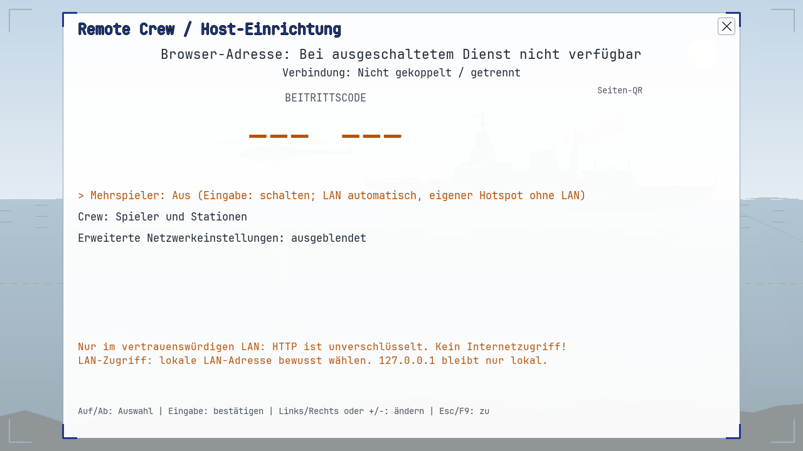

*Remote-Crew-Verwaltung (F9) auf der uConsole*

**Crew** zeigt die Spieler und ihre Stationen. **Erweiterte Netzwerkeinstellungen** blendet Netzwerkmodus (LAN oder Hotspot), Adresse und Port zur Handwahl ein; sie ändern sich nur bei ausgeschaltetem Mehrspieler. Dort erzeugt, solange Mehrspieler aus ist, **Neues Hotspot-Passwort** ein neues Hotspot-Passwort und behält den Namen; jedes Gerät muss dann mit dem neuen WLAN-QR-Code neu beitreten.

Eine freie Station wird sofort mit allen ihren Rechten übernommen (auch Direktfeuer und Sonar-Liveaudio, wo die Station sie hat); eine Station, die ein Crewmitglied hält, wird angefragt, und der Inhaber (er sieht die Anfrage mit den Knöpfen Übergeben / Station behalten) oder der Host kann sie übergeben. Eine Station hat immer alle ihre Rechte; der Host kann jederzeit eine Station entziehen, das SimLog geben oder nehmen (Roster-Taste `L`) und bis zu zwei Browser zu reinen Beobachtern machen (Roster-Taste `O`): sie sehen jede Station beider Einheiten, ohne sie zu halten, können nichts befehlen und erhalten das SimLog mit Zeitstrahl zur Nachbesprechung und JSON-Export.

Die Crew-Seiten öffnen in der gespeicherten Sprache des Hosts (`F10`-Optionen auf der uConsole); der Knopf English/Deutsch in der Statusleiste des Browsers stellt nur diesen Browser um. Die Crew-Seite ist für Chrome oder Chromium (auch Edge) auf einem Desktop-PC gebaut; ein anderer Browser zeigt über dem Kopplungscode einen Hinweis, und eine Seite, die dort nicht starten kann, sagt das, statt endlos zu laden. Nach einem Update des Hosts lädt sich eine offene Browserseite einmal selbst neu und läuft so immer mit dem passenden Web-Client.

Eine Browserstation hat drei Spalten: links die Kontaktliste, in der Mitte die Anzeige, rechts den Stationsbereich mit dem Kontaktdetail darunter. Damit die Bedienung ohne Scrollen Platz hat, klappt eine leere Kontaktliste zur schmalen Leiste und das Kontaktdetail zur Titelzeile zusammen, solange kein Kontakt gewählt ist; beides öffnet sich wieder, sobald es etwas zu zeigen gibt, und bleibt so, wie Sie es von Hand umgeschaltet haben. Die Missionsübersicht steht als eine Zeile **Auftrag** oben im Stationsbereich und klappt mit einem Klick auf. Ein Wert, für den noch nichts gemeldet ist, steht als grauer Strich; der Mauszeiger darüber nennt den Grund. Auf dem Handy liegen Sprache, Ton, Mikrofon, Einstellungen und Werkzeuge hinter dem Knopf ☰.

### Crew-Modus, Solo-Modus und Web-Host

Remote Crew läuft normalerweise im **Crew-Modus**: Jeder Browser hält die Stationen, die der Host ihm gibt, und die KI oder die uConsole besetzt den Rest. Mit `--solo-crew` gestartet, läuft es nur für diesen Start im **Solo-Modus**: Ein gekoppelter Browser hält alle Stationen seiner Einheit und darf auch die Host-Befehle Speichern, Laden und Neues Spiel sowie die Bibliothek der eigenen Missionen nutzen (Kapitel Missions- und Einheiteneditor). Editoren, Optionen, Beenden und die Netzwerkeinstellungen bleiben auf der uConsole, und in keinem Modus gibt es eine Pause.

Im Solo-Modus hält der eine Browser alle neun Stationen der Fregatte oder mit **U-Boot spielen** in der Host-Leiste alle sieben Stationen des U-Boots (zurück mit **Fregatte spielen**). Der Host-Dialog **Neues Spiel** wählt auch die **Seite** (*Fregatte F-217* oder *U-Boot*); als U-Boot führen die **KI-Jäger** Fregatte, Hubschrauber und Seefernaufklärer. Ein Solo-Browser (Remote Crew im Solo-Modus) wählt die Seite genauso: sein Dialog **Neues Spiel** hat ein Feld *Seite*, und mit *U-Boot* übernimmt die Sitzung die sieben Stationen des U-Boots, während die KI-Jäger die Fregatte besetzen.

`--web-host` betreibt einen reinen Browser-Raum hinter einem eigenen HTTPS-Reverse-Proxy (`--public-origin` nennt dessen Adresse); er speichert nicht automatisch. Die Einrichtung beschreibt die Web-Host-Anleitung der Projektdokumentation.

### Handy-Ausguck und Sehrohr

Ein Handy kann als Ausguck auf der Brücke der Fregatte oder am Sehrohr des besetzten U-Boots Wache gehen. `F9` zeigt einen zweiten QR-Code, **Handy-Ausguck**, für die Adresse `https://<Adresse>:<Port+1>/lookout`. Scannen, die Zertifikatswarnung einmal bestätigen, den Wachposten wählen und den daneben angezeigten Kopplungscode eintippen (der Code steht nie im QR-Code). Er darf wie angezeigt eingegeben werden, mit oder ohne Leerzeichen und in jeder Schreibung; verwechselbare Zeichen wie O und 0, I, l und 1 oder S und 5 werden nach der Stelle gelesen. „Falscher Kopplungscode“ heißt genau das und zeigt den Code, den das Spiel bekommen hat; lehnt das Spiel die Adresse selbst ab, sagt die Seite das.

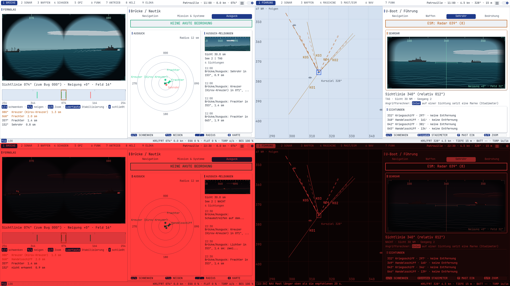

*Fernglas und Sehrohr bei Tag und Nacht (links Fregatte, rechts U-Boot)*

- **Zertifikat:** Das Spiel erzeugt ein eigenes Zertifikat für seine LAN-Adresse (in `~/.u-jagd/tls/`, erneuert bei neuer Adresse). Das Handy warnt einmal, weil keine Zertifizierungsstelle es signiert hat: am iPhone *Details einblenden*, dann *diese Website besuchen*; in Chrome unter Android *Erweitert*, dann *Weiter*. Nur einer solchen sicheren Seite geben Handys Gyroskop und Mikrofon frei.
- **Umsehen:** *Gyro* antippen und das Handy wie ein Fernglas drehen; zum Hoch- und Runterschauen neigen. Ohne Gyroskop wischen. *Voraus* blickt wieder zum Bug, *Zoom* schaltet die Vergrößerung weiter. Am Sehrohr dreht das Handy das Sehrohr selbst, und *Entfernung* nimmt eine Stadimeter-Entfernung auf das Ziel im Fadenkreuz.
- **Melden:** *Sprechen* antippen und sagen, was zu sehen ist, etwa „Schiff Peilung 040, Entfernung 5 Meilen“, „Flugzeug Steuerbord 30“ oder „Torpedo“ (dann gilt die Blickrichtung als Peilung). Kategorien: Kontakt, Schiff, Kriegsschiff, Handelsschiff, Luftfahrzeug, U-Boot, Torpedo. Oder das Ziel im Bild antippen und die Kategorie wählen.
- **Bestätigung:** Eine Meldung zählt nur, wenn der Ausguck dort wirklich etwas dieser Art hat, höchstens 10° neben der Peilung (und mit Entfernung höchstens 40 % oder 1 sm neben seiner Schätzung). Dann erscheint sie auf der Brücke als Ausguck-Spur und im Ereignislog, und die Crew-Browser sprechen sie. Eine Meldung von nichts wird abgelehnt, und das Handy vibriert zweimal.

Solange ein Handy den Ausguck der Brücke hält, meldet der Ausguck Schiffe, Flugzeuge und Torpedos nicht mehr von selbst: nur was der Spieler meldet, erreicht die Brücke (Land wird weiter automatisch gemeldet). Auf dem U-Boot bleibt das Sehrohrbild beim Angriffsrechner, und die eigenen „in Sicht“-Meldungen der Crew weichen den Meldungen des Handys. Die Spracherkennung nutzt den Sprachdienst des Handy-Browsers (Chrome auf Android, Safari auf dem iPhone mit eingeschalteter Siri- und Diktierfunktion; Firefox und andere Browser auf dem iPhone haben keinen, dort das Ziel antippen). Scheitert sie, nennt die Seite den Grund. Vom Handy-Ausguck wird nichts gespeichert.

### Browser-Tasten

Im Remote-Crew-Browser (Commander, `F9`) werden Stationen mit Schaltflächen oder mit denselben Tasten wie auf der uConsole bedient; jedes Bedienelement mit Taste zeigt sie als blaue Tastenkappe hinter der Beschriftung, und solange der Cursor in einem Feld steht, wirkt keine Taste. Tasten für Befehle und Feuer drücken nur das passende Bedienelement und durchlaufen dieselben Prüfungen wie ein Klick:

| Taste | Funktion |
|---|---|
| `1-9` | Eine eigene Station öffnen (U-Boot-Crew: 1-7); dieselbe Nummer nochmals blättert die Seite um |
| `?` | Leitfaden und Stationshilfe öffnen |
| `Pfeiltasten` | In fokussierter Registerleiste, Trackliste oder Karte bewegen |
| `Home / End` | Erster / letzter Eintrag der fokussierten Liste |
| `Q / E` | Karte oder Ausguck zoomen (wie auf der uConsole); Pos1 passt die Ansicht ein |
| `K` | Karte folgt dem eigenen Schiff an oder aus |
| `+ / -` | Maschinentelegraph eine Stufe höher / tiefer (Brücke, Maschine, U-Boot-Führung und -Maschine) |
| `C / V / D · T` | Kurs, Fahrt, Tiefe, Torpedo-Lauftiefe: der Cursor springt ins Feld, Eingabe sendet (Brücke, Maschine, U-Boot) |
| `Shift+A · J` | Aktiver Ping · Live-Sonarton an oder aus (Sonar, U-Boot-Führung, Tauchsonar des Helikopters) |
| `W · Shift+T` | Sonar: Aktivpuls CW / LFM · TMA-Methode (Hypothese, Ekelund, Dot-Stack) |
| `Strg+Eingabe` | Schuss scharf machen (Waffen, OPZ, Helikopter, U-Boot-Waffen); der Feuerdialog fragt noch einmal |
| `R / Shift+R` | OPZ: Seeziel- / Luftraumradar an oder aus; Q / E ändern den Radar-Anzeigebereich |
| `H · B · Ctrl+R · Shift+M` | Helikopter: starten oder zurückrufen, Boje werfen, Flugzeugradar, MAD |
| `A · V · Ctrl+B` | Schleichfahrt (Maschine) · Täuschkörper (U-Boot-Waffen) · toten Winkel klären (Brücke, U-Boot-Führung) |
| `Stationsbuchstaben` | Jede weitere Stationstaste ist die der uConsole (Funk K / H / R / A / D, Leckwehr C / G / W / M / U, ELOKA E / Umschalt+E / A / C, Waffen W / X / Y / D / A / Z / R, ...); jede steht als blaue Tastenkappe auf ihrem Bedienelement |
| `Pfeiltasten (Karte)` | Fokussierte Karte verschieben |
| `Maus über Karte` | Details zu Track, eigenem Schiff, Asset, Wrack oder Kartenposition unter dem Mauszeiger |
| `0` | Wetter- & Sonar-Analyse öffnen oder schließen |
| `Bild auf/ab` | Seiten durchblättern: Helikopter Akustikanalyse, Tauchsonar und Taktische Karte (auch nochmals 8), Sonarseiten |
| `Plotwerkzeug + Klick` | Auf den gemeinsamen Plot zeichnen: Werkzeug über der Karte wählen, einmal (Marke, Peillinie) oder zweimal (Lineal, Kreis, Koppellinie) klicken |
| `Alt+, / Alt+.` | Kontaktliste (Alt+,) oder Stationsbereich (Alt+.) ein- oder ausklappen |
| `Alt+L` | Einsatzprotokoll öffnen oder schließen |
| `Esc` | Leitfaden, Ausguck oder Kontaktbibliothek schließen und zur Station zurück |

### Nicht im Browser

Der Browser folgt der uConsole Station für Station. Der Solo-Browser hat außerdem das **Einsatzbuch** des Hauptmenüs (Dienstzeit, Bestwerte, Auszeichnungen und was der Gegner gelernt hat, für Fregatte und U-Boot) und die **Ausbildung** (die neun Lektionen mit ihren Haken und der nächsten markiert; eine U-Boot-Lektion wechselt den Browser zuerst auf das U-Boot). Was der Browser noch nicht hat:

- **Ausbildung im Servermodus:** die Lobby des Servermodus startet nur Einsätze; Lektionen starten aus einem Solo-Browser oder auf der uConsole.
- **Zusätze der Einsatzbuch-Seite:** "Gegner lernt mit" ein- und ausschalten (`L`), die Auswertung der Dienstzeit durch das Sprachmodell und der Gefechtsbericht bleiben auf der Einsatzbuch-Seite der uConsole; der Browser zeigt die Dienstzeit nur zum Lesen.
- **Leckwehr:** die Wahl einer Abteilung mit `←`/`→` hat keine Taste; die Abteilung in der Abteilungsliste wählen.
- **Hubschrauber:** die Tasten der Akustikseiten, die es nur auf der Hubschrauberanzeige der uConsole gibt, haben im Browser kein Gegenstück.
- **Stationen durchschalten:** `Tab` schaltet nicht durch die Stationen; die Nummer der Station (`1`-`9`) wählen, dieselbe Nummer noch einmal blättert ihre Seite um.
- **Nur am Host:** Optionen, die Editoren auf der uConsole, Beenden, Netzverwaltung und Zugangsdaten bleiben absichtlich auf der uConsole.

## Nach dem Einsatz

### Endtafel

Endet eine Mission, nennt die Endtafel das Ergebnis, die Punkte mit dem Faktor der Realismusstufe, einen neuen Bestwert und neue Auszeichnungen. Unter dem Ergebnis sagt eine Zeile, was entschieden hat, gelesen aus der Nachbesprechung der Seite, die die uConsole gespielt hat: für die Fregatte, wann der Kontakt kam und welcher Schuss das U-Boot versenkte, die Peilung des Torpedos, der das Schiff versenkte, oder die längste verpasste Chance (Minuten, Entfernung, über oder unter der Schicht); für das U-Boot der Schuss, der die Fregatte versenkte, die Torpedos auf den Geleitzug, wie lange und wie nah die Fregatte es hielt, oder die Waffe, die es versenkte. Lektionen haben keine solche Zeile. Die Nachbesprechung im Browser zeigt dieselbe Zeile über ihren Ereignissen. `R` startet die Mission mit demselben Seed neu, `M` führt ins Hauptmenü und `D` öffnet die Nachbesprechung; nach einer abgeschlossenen Lektion startet `N` die nächste. Eine Mission aus der Mehrspieler-Lobby führt alle zurück in die Lobby.

### Nachbesprechung

Nachbesprechung: Nach Missionsende öffnet `D` im Endfenster die Nachbesprechung. Sie spielt die Mission ab und zeigt die Wahrheit neben dem, was die Crew wusste: die echten Kurse von Schiff und feindlichen U-Booten, die Kontakte der Crew dort, wo sie sie verortet hatte (reine Peilungen als Peilstrahlen), Waffen, Bojen und Luftfahrzeuge.

Daneben stehen die Zeit des ersten Kontakts, der ersten Ortung und der Klassifizierung, abgefeuerte Waffen und versenkte U-Boote, der mittlere Fehler der Ortungen und alle Ereignisse; eine "verpasste Chance" ist ein feindliches U-Boot, das mindestens 5 min lang höchstens 4 sm entfernt war, ohne dass es einen Kontakt gab, mit dem Hinweis über oder unter der Sprungschicht.

`Links`/`Rechts` blättern (Umschalt: 1 min), `Auf`/`Ab` oder `Bild auf`/`Bild ab` springen zwischen Ereignissen, ein Klick in die Zeitleiste springt dorthin, `Leertaste` spielt sie ab (`Tab`: 10× oder 60×), `D` oder `Esc` kehrt zurück. Aufgezeichnet wird alle 10 s (bei langen Missionen gröber); die Nachbesprechung ist während der Mission nie sichtbar und wird nicht gespeichert: nach dem Laden deckt sie die Mission ab dem Laden ab.

- **Nachbesprechung als Zeitraffer:** nach der Mission spielt `Leertaste` die Nachbesprechung ab, `Tab` wechselt zwischen 10× und 60×; die Wege wachsen, Schüsse, Pings, Treffer und Untergänge blitzen dort auf, wo sie geschahen. Im Browser zeigt die Schaltfläche **Nachbesprechung abspielen** (neben dem Missionsstand, erst nach dem Ende) dieselbe Wiedergabe für die eigene Seite.

### Einsatzbuch und Auszeichnungen

**Einsatzbuch** (Hauptmenü): jede beendete Mission (nie eine Lektion) der Seite, die die uConsole gespielt hat, mit Datum, Mission, Realismusstufe, Ergebnis, Punkten und Minuten; der Bestwert je Mission und fünf Auszeichnungen je Seite: erster Sieg, ein Schuss ein Treffer (der Gegner mit einer einzigen Waffe versenkt), ohne Kratzer (kein Schaden), nie beschossen und Realist (ein Sieg auf der Stufe Realistisch).

Neben den Summen hängt eine **Ordensspange**: ein Band je Szenario der Seite (ohne freie Patrouillen), nummeriert wie in der Szenarioliste. Ein Band ist farbig, sobald dieses Szenario ohne die Hilfe des Ersten Offiziers und ohne den experimentellen Gegner gewonnen wurde (kurz oder normal lang), sonst nur ein leerer Umriss; die Summenzeile zählt die gewonnenen Bänder. Das Einsatzbuch im Browser zeigt dieselbe Spange.

Die Fregatte trägt ihre Missionspunkte ein; das U-Boot zählt sein Ergebnis (Fregatte versenkt 1500, Versorger 1300, Geleitzug 1200, Kampfschwimmer abgesetzt oder Agenten abgeholt 1100, Durchbruch, Meerenge, Meldung, Heimathafen oder Lauschposten 1000, Entkommen oder Fühlung abgeschüttelt 800, Überleben 600) plus bis zu 500 für ein unbeschädigtes U-Boot und 100 je übrigem Torpedo, mal dem Faktor der Stufe.

`Links`/`Rechts` oder `Tab` wechseln Fregatte und U-Boot, `A` die Auswertung des Sprachmodells, `B` den neuesten Bericht, `L` das Lernen des Gegners, `Eingabe` oder `Esc` zurück; die Fußzeile nennt diese Tasten, ein Klick darauf drückt sie. Das Endpanel nennt die Punkte, einen neuen Bestwert und neue Auszeichnungen. Das Einsatzbuch ist `~/.u-jagd/logbook.json` (die neuesten 200 Missionen), nie Teil eines Spielstands.

### Der Gegner lernt mit

- Nach jedem Einsatz ab 5 min notiert das Dienstbuch grobe Gewohnheiten der gespielten Seite. Fregatte: **frühes Pingen** (erster Ping vor oder bis 2 min nach dem ersten Kontakt), **schnelle Suche** (im Mittel ab 18 kn ohne Standort), **weite Schüsse** (Torpedos im Mittel ab 5 sm). U-Boot: **Sehrohrtiefe** (ein Viertel der Zeit), **über der Schicht** (die Hälfte der Zeit), **hohe Fahrt** (im Mittel ab 10 kn).
- Zeigten mehr als die Hälfte der letzten fünf Einsätze einer Seite (mindestens drei) eine Gewohnheit, kennt der Gegner sie im nächsten Einsatz und stellt sich leicht darauf ein: Gegen frühes Pingen gehen die U-Boote unter die Sprungschicht, sobald sie die Fregatte hören, und nach einem Ping alle tief; gegen schnelle Suche lauern sie, statt heranzuschließen; gegen weite Schüsse schleichen sie tief, statt heranzuschließen. Gegen ein U-Boot oft auf Sehrohrtiefe sucht die Jagdfregatte in Sprints, ebenso gegen eines über der Schicht, gegen hohe Fahrt sucht sie leise.
- Was der Gegner kennt, wird zu Beginn des Einsatzes festgelegt und gespeichert. Die Nachbesprechung nennt es, die Logbuchseite zeigt es je Seite. `L` auf der Logbuchseite schaltet das Mitlernen ab und wieder an. Im Tageseinsatz, in Lektionen und im Spiel mit zwei Crews lernt der Gegner nie mit.

## Werkzeuge

Diese Hilfen wirken an jeder Station beider Einheiten. Keine von ihnen hält die Simulation an.

### Maus und Spielmenü

Das Spiel läuft mit 1280x720 und ist für Tastatur und Trackball der uConsole ausgelegt. Vieles auf der uConsole lässt sich auch mit der Maus (oder den Tasten des Trackballs) spielen: Ein Klick auf eine Taste in der Tastenleiste einer Station drückt diese Taste (gedrückt halten hält die Taste, etwa zum Steuern oder für den Maschinentelegrafen), die nummerierten Reiter in der Kopfzeile wechseln die Station, ein Klick auf die Kurs-, Fahrt- oder Tiefenscheibe befiehlt diesen Wert, und eine Zahleneingabe zeigt ein Tastenfeld. Auch Statuslampen, Tastenhinweise im Text einer Station (etwa "`Y` absenken/einholen" oder der Radarzustand), Seitenreiter, Listenzeilen und die Werte in der unteren Statuszeile sind anklickbar: Eine Lampe oder ein Hinweis drückt seine Taste, ein Wert wie Flutung oder Torpedos öffnet die Station, die ihn bearbeitet. Das Element unter der Maus bekommt einen dünnen Rahmen. Ein Klick tut genau das, was seine Taste tut, mit denselben Prüfungen.

Die Feuertaste `Strg+Eingabe` ist auf beiden Seiten nur an der Waffenstation (Station 3) anklickbar. Stationsbefehle, die nicht in der Tastenleiste stehen, haben eigene Tastenchips: Klassifizieren, TMA, Freigabe an die OPZ, Ziel und die Schleppsonare unter den Kontaktkarten des Sonars, Ziel zuweisen, Düppel und ASM-Track auf der Zielseite der OPZ, die Befehle an den Begleiter auf der Verbandsseite sowie Rohr fluten und Täuschkörper in der Feuerleitung des U-Boots (die Lampe eines trockenen Rohrs flutet es, die eines leeren lädt es). Flugkörper bleiben auf ihrer Taste: ESSM und die ASROC des Begleiters feuern nur mit `Strg+Eingabe`.

Jede Taste, die eine Stationsseite benutzen kann, steht als blauer Tastenchip da, nie als bloßer Text, und ein Klick auf den Chip drückt diese Taste. Die Tastenleiste am Fuß einer Seite trägt sie alle: Passen mehr Tasten als in die Zeile, blättert ein `+`-Chip an ihrem rechten Ende durch den Rest. Eine lange Liste (OPZ-Tracks, HFDF-Signale, ESM-Emitter, Abteilungen und Trupps) blättert mit dem Mausrad darüber und zeigt, welcher Teil zu sehen ist. Ruht die Maus auf einer Statuslampe oder Anzeige (etwa START NO-GO, DECK WARTEN, einem Rohr, der Anlage oder dem ESM-Empfänger), öffnet sich ein Hinweis, der sagt, warum sie so steht, aus dem laufenden Spiel (Deckbewegung, Wettergrenzen, Nachladezeit, Wasser unter dem Kiel), und was zu tun ist, mit den Tasten als Chips. Die Hinweise gibt es auf beiden Seiten, auf der uConsole und im Remote-Crew-Browser.

Menüzeilen, Dialogzeilen, Speicherplätze und die Hinweise darunter sind ebenfalls anklickbar; das Mausrad blättert durch Menüs und scrollt die Hilfe, und ein Rechtsklick bricht in Menüs, Dialogen, Eingaben und am Missionsende ab wie `Esc`. Auf Karten zoomt das Rad, Ziehen verschiebt und ein Klick heftet einen Tooltip an.

Das Menü-Symbol in der Kopfzeile links vom Hell/Dunkel-Schalter öffnet auf beiden Seiten das Spielmenü: Hilfe, Optionen, Speichern und Laden, Wetterseite, Plot, Autocrew und Crew-Assistenz, Simulationsprotokoll, Erster Offizier, Einheitenanalysator, Remote Crew, Nationen und Beenden, jeweils mit ihrer Taste; ein Klick neben das Menü oder eine Taste schließt es. Jedes Overlay (Hilfe, Optionen, Speichern/Laden, Beenden, Nationen, Live-Verkehr, Wetterseite, Autocrew-Übersicht, Simulationsprotokoll, Erster Offizier und Sprachmodell-Einstellungen) hat oben rechts ein Schließfeld, das wie `Esc` wirkt. `F1` listet alle Tasten der Station.

### Hilfe (F1) und Ereignislog (F11)

`F1` (oder `?`) öffnet jederzeit die Hilfe. Sie hat vier Kategorien: globale Tasten, aktuelle Station (Tasten und Standardablauf), Sensoren und Taktik sowie dieses Handbuch. Menüs und Dialoge über einer laufenden Mission (Hilfe, Optionen, Speichern/Laden, Beenden, Nationen, `F9`, Missionsende) zeigen statt der Station die Nachtszene des Startbildschirms hinter einem Konsolen-Panel; die Mission läuft dahinter weiter.

Die Statuszeile unten zeigt das neueste Ereignis und die wichtigste Telemetrie; `F11` blendet das volle Ereignislog und die Telemetrie über der Station ein, ohne sie anzuhalten oder ihr die Tasten zu nehmen (auf der U-Boot-Seite das U-Boot-Log). Das Log deckt die Station darunter ganz ab; ein Klick auf das Log erreicht sie nicht, das Mausrad blättert, und `F11` oder das Kreuz oben rechts schließt es. Solange die Stimme des Sprachmodells das Log vorliest, hat seine untere Zeile je Station einen Knopf, der sie stumm schaltet (Kapitel Sprachmodell, Stimme). Die Remote-Crew-Browser zeigen dasselbe Log, das Neueste oben, in ihrem Einsatzprotokoll (`L`): die Stationen der Fregatte das Log der Fregatte, die Stationen des U-Boots das U-Boot-Log.

### Autocrew und Crew-Hilfe (F2, F3, Umschalt+F2)

`F2` übergibt die aktuelle Station an die Autocrew; `F3` zeigt, welche Stationen automatisch laufen. Nutzen Sie das, um sich auf ein oder zwei Stationen zu konzentrieren. `Umschalt+F2` schaltet die Crew-Hilfe: Die KI besetzt jede Station beider Einheiten, die niemand hält, und die Station auf dem Bildschirm bleibt Ihre. Eine Mission aus der Mehrspieler-Lobby hat sie an, sobald ein Browser teilnimmt oder die uConsole nur Gastgeber ist; allein dort gestartet ist es ein Solospiel mit ausgeschalteter Crew-Hilfe.

#### Crew-Hilfe

`Umschalt+F2` (in einer Mission aus der Mehrspieler-Lobby an, sobald ein Browser teilnimmt oder die uConsole nur Gastgeber ist) lässt die KI jede Station besetzen, die niemand hält, auf der Fregatte und auf einem bemannten U-Boot, damit jeder Spieler bei einer Station bleiben kann. Eine Station, die ein Browser hält, und die, die die uConsole zeigt, bleiben bei ihrem Spieler; eine im Browser freigegebene Station („An KI übergeben“) geht sofort an die KI zurück. Die Hilfe wird mit der Mission gespeichert (Spielstand v41).

- **Fregatte:** Die KI-Jäger oben bedienen Brücke, Sonar, Waffen und den Hubschrauber, die Autocrew die übrigen Stationen, auch gegen ein KI-U-Boot.
- **U-Boot-Kommando:** weicht einem gehörten Torpedo oder Ping aus, folgt sonst dem Abschnitt der U-Boot-Mission oder läuft in einer Fregattenmission eine Fregatte an, die das eigene Sonar innerhalb von 12 sm geortet hat, und patrouilliert sonst mit 4 kn unter der Sprungschicht um den Startpunkt. Fällt die Batterie unter 35 % und jagt niemand das U-Boot, geht es auf Schnorcheltiefe.
- **U-Boot-Waffen:** hält die Rohre geladen, flutet leise, sobald ein gehörtes Ziel eine Ortung innerhalb von 8 sm hat, und schießt einen Torpedo nach dem anderen auf eine Ortung innerhalb von 4 sm. Ziel ist ein Kontakt, dessen Signatur die Bibliothek nur von Kriegsschiffen kennt (beim Geleitzugangriff von Handelsschiffen).
- **Maschinenraum:** schnorchelt ungejagt bis 95 % Ladung, hält den Trimm automatisch, beantwortet schlechte Luft mit Absorbern und Sauerstoffkerzen und schickt die zwei Leckteams dorthin, wo Feuer, Lecks oder Wasser am schlimmsten sind.
- **Sonar und Mast:** Das Sonar hält den Fokus auf dem Ziel, auf das die Waffen schießen würden (sonst, wenn nur Browser das U-Boot führen, auf dem lautesten frischen Kontakt), und übernimmt die automatische TMA-Lösung darauf als Ortung, sobald ihre Güte 35 % erreicht (50 % bei einem Kriegsschiff, das bei der Jagd manövriert), erneut alle 30 s, solange keine Ping- oder Sehrohrortung besteht, wie ein Bediener mit `K`; mit dieser Ortung schießen die Waffen. Auf der uConsole fokussiert es nur Ziele, ein dort mit `Auf`/`Ab` gewählter Kontakt bleibt also gewählt, außer er ist ein verstummtes Ziel. Der Mast fährt bei einem solchen Alarm ein. Navigation und Funkraum halten nur Wache.
- **Der Befehl eines Spielers gilt:** Eine Station, die die KI besetzt, übersteuert nie, was ein Spieler an einer anderen Station befiehlt. Mit einem Spieler an der Navigation lässt die KI-Führung Kurs, Tiefe und Ausweichen in Ruhe, mit einem im Maschinenraum Fahrt und Schleichfahrt; mit einem an der Führung lässt der KI-Maschinenraum Trimm und Leckteams in Ruhe, und die KI-Maststation lässt einen an der Führung oder im Funkraum ausgefahrenen Mast auch bei Alarm oben. Solange ein Spieler an Mast oder Funkraum den Mast oben hält, hält die KI-Führung das U-Boot auf Sehrohrtiefe; erst mit eingefahrenem Mast taucht es wieder. Auf der Fregatte steuert die KI-Brücke nicht, solange ein Spieler im Maschinenraum sitzt, und KI-Waffen und Seefernaufklärer bestimmen kein neues Ziel über ein aktuelles Ziel, das ein Spieler an Sonar, OPZ oder Waffen gewählt hat. Ein am uConsole mit `Auf`/`Ab` gewählter Kontakt bleibt gewählt.

### Wetter- & Sonar-Analyse (Taste 0)

Taste `0` öffnet über jeder Station ein Analysepanel über den ganzen Bildschirm (`0` oder `Esc` schließt es; die Simulation läuft weiter). Im Web-Client öffnet jede Station es mit `0` oder über das Arbeitsplatz-Menü. Über dem Meeresprofil zeigt die Maus Tiefe und Schallgeschwindigkeit, über dem Schallweg-Schnitt Entfernung, Tiefe und Schallgeschwindigkeit und ob der Punkt in einer Schattenzone oder Konvergenzzone liegt.

- **Umwelt:** Uhrzeit, Tageslicht (Tag, bürgerliche oder nautische Dämmerung, Nacht), Mondphase, Wetter und Niederschlag, Sicht, Wind mit Böen und Beaufort, Seegang, Barometer mit 3-Stunden-Tendenz (steigend, stabil, fallend, rasch fallend), Luft- und Wassertemperatur, Wolkenuntergrenze und Vereisung. Rasch fallender Luftdruck unter etwa 1004 hPa löst eine Sturmwarnung aus. Das Wetter ändert sich höchstens um eine Seegangsstufe pro Stunde, deshalb bewegt sich das Barometer schneller als ein echtes.
- **Wettereinflüsse:** Sonne (starke Sprungschicht), Wind (tiefere Deckschicht) und Regen oder Schnee (süßeres Oberflächenwasser, Regenrauschen) leuchten, solange sie wirken.
- **Helikopter-Flugwetter:** CLEAR, LIMITED (innerhalb von 80 % eines Grenzwerts oder leichte Vereisung) oder NO-GO, mit Wind, Böen, Seitenwind, Sicht, Wolkenuntergrenze, Seegang, Rollen und Stampfen des Decks, Vereisung und ob Tauchsonar möglich ist.
- **U-Boot (Stationen des bemannten U-Boots, Taste 0 auf der uConsole und im Web-Client):** statt Helikopter-Flugwetter, Wolkenuntergrenze und Vereisung zeigen die Stationen des U-Boots, was das Wetter mit dem U-Boot macht. *Mast im Radar:* die Entfernung, auf der ein Überwasser-Suchradar wie das der Fregatte einen ausgefahrenen Mast oder Schnorchelkopf erfasst (bei der Hälfte aller Umläufe), bei aktuellem Seegang und Regen, neben dem Wert bei ruhiger See; Seegangsecho verdeckt das kleine Echo, der Radarhorizont begrenzt es. *Mit dem Auge:* wie weit ein Ausguck das aufgetauchte U-Boot bei aktuellem Licht, Mond, Sicht und Seegang sichtet (5 sm an einem klaren, ruhigen Tag); ein ausgefahrener Mast auf Sehrohrtiefe wird mit dem Auge nie gesichtet. *Umgebungsrauschen:* Wind- und Regenrauschen über ruhiger See (Seegang 1) in den vier Sonarbändern (100, 400, 1600, 6400 Hz); es tarnt das U-Boot vor Passivsonar und dämpft ebenso das eigene Horchen. *Schnorchel:* höchstens 6 kn, +12 dB Abstrahlpegel und Diesellinien bei 50 und 100 Hz, die ein Sonar hören kann.
- **Meeresprofil:** erscheint erst, wenn das Sonar einen Bathythermographen genommen hat (Sonar `E`): gemessene Schallgeschwindigkeit über der Tiefe, die Schicht, eine SOFAR-Achse falls vorhanden, neun Schallstrahlen vom Bugsonar bis 20 sm und die Schattenzone unter der Schicht (rot), in der das Bugsonar wenig hört. Nach 30 min oder 10 sm gilt die Messung als veraltet.

### Karten-Plotwerkzeuge (Taste P)

Die Besatzung führt einen gemeinsamen Fettstift-Plot. Alle Stationen und alle Remote-Crew-Browser sehen dieselbe Zeichnung, und sie wird mit dem Spiel gespeichert. Es ist die eigene Zeichnung der Besatzung: nichts darin stammt von einem Sensor, und sie verändert die Simulation nie.

- **Öffnen:** `P` auf der Brücken-, Waffen- oder Helikopterkarte oder auf der OPZ-Karte drücken. Ein Cursor erscheint am Eigenschiff. Die Pfeiltasten bewegen ihn (Umschalt: schneller), oder auf die Karte klicken. `Eingabe` setzt einen Punkt, `Esc` bricht ein begonnenes Objekt ab und beendet danach den Plotmodus, `P` beendet ihn ebenfalls. Eine Hinweisleiste oben auf der Karte zeigt links das aktive Werkzeug und die Tasten, rechts Peilung und Abstand des Cursors vom Eigenschiff.
- **Werkzeuge:** `M` Marke (ein Punkt); `R` Lineal (zwei Punkte, zeigt Peilung und Entfernung); `B` Peillinie vom Eigenschiff durch den Cursor (eigene Position und Zeit werden gespeichert, die Linie bleibt also dort, wo sie gelegt wurde); `C` Kreis (Mitte, dann ein Punkt auf dem Radius, höchstens 200 sm); `D` Koppellinie (Startpunkt, dann ein Punkt in Fahrtrichtung, dann die Fahrt 0-60 kn eingeben). Die Koppellinie wandert mit der Zeit weiter und zeigt ihren CPA zu Kurs und Fahrt des Eigenschiffs.
- **Löschen:** `Rücktaste` löscht das Objekt, das dem Cursor am nächsten liegt. `Umschalt+Rücktaste` löscht den ganzen Plot.
- **Bezeichnungen:** Objekte werden als M1, R2, B3 usw. nummeriert. Im Web-Client kann vor dem Zeichnen eine Bezeichnung eingegeben oder ein Objekt in der Liste unter der Karte umbenannt werden. Ein Objekt außerhalb des sichtbaren Kartenausschnitts zeigt am Kartenrand einen kleinen Pfeil in seine Richtung, seine Bezeichnung steht neben dem Pfeil; mehrere solche Bezeichnungen stehen nebeneinander, nie übereinander.
- **Web-Client:** über der Karte ein Werkzeug wählen, dann einmal (Marke, Peillinie) oder zweimal (Lineal, Kreis, Koppellinie) klicken. „Trackpeilung plotten“ legt die gemessene Peilung des gewählten Tracks von dessen Beobachterposition an.
- **Grenzen:** höchstens 64 Objekte und 24 Zeichen je Bezeichnung.

Auf der U-Boot-Seite bedient `P` den Mast; der Plot des U-Boots wird im Browser gezeichnet (Kapitel U-Boot, Navigation).

### Kartenverlauf und Beschriftungen

Jede taktische Karte (Brücke, Waffen, Helikopter, OPZ, Karte und Plot des U-Boots und die Karten der Remote Crew) zeigt, wo etwas war, nicht nur, wo es ist:

- **Eigene Kursspur:** eine schwache gepunktete Linie hinter dem eigenen Schiff oder U-Boot, ein Punkt alle 30 s Simulationszeit, die letzten 2 Stunden.
- **Kontaktverlauf:** frühere Positionen eines Tracks als kleine Punkte, die mit dem Alter verblassen, einer pro Minute, die letzten 12 je Track.
- **Peilverlauf:** Für einen reinen Peilkontakt behält die Karte die letzten 6 Peilungen; die früheren Peilungen des gewählten Kontakts werden gestrichelt von dort gezeichnet, wo sie genommen wurden, sodass ihr Schnitt zeigt, wo er sein kann.
- **Beschriftungen:** Kartenbeschriftungen weichen aus, statt einander, das eigene Schiff oder ein Symbol zu verdecken: zuerst nach rechts, dann nach unten, oben und links; Beschriftungen von Peillinien gleiten an ihrer Linie entlang.

Der Verlauf dient nur der Anzeige: Er entsteht aus dem, was die Sensoren gemeldet haben, wird nie gespeichert und vergisst einen Track 15 Minuten nach seiner letzten Meldung.

### Simulationsprotokoll (F4)

`F4` öffnet das Simulationsprotokoll über der Station: eine laufende Liste des wahren Zustands der Welt (eigenes Schiff, U-Boote, Überwasserschiffe, Torpedos, Täuschkörper, Flugkörper, Luftfahrzeuge und Bojen). Es wirkt nur, wenn **Simulationsprotokoll** in den Optionen eingeschaltet ist, denn es zeigt, was keine Station weiß: Nutzen Sie es zum Studieren oder Fehlersuchen, nicht zum Spielen. `M` zeigt eine Karte aller Kontakte, `F` auf der Karte passt sie an die Einheiten oder die ganze Welt an. Im Browser kann der Host einem Crewmitglied das SimLog freigeben.

### Analysator, Erster Offizier und Nationen

- `F8` öffnet den Taktischen Einheitenanalysator, einen nur lesenden Katalog aller Einheiten mit 3D-Modell, Schall- und Radarbildern (Kapitel Missions- und Einheiteneditor). Mit gewähltem Sonarkontakt weist `Eingabe` ihm das angezeigte Profil als Ihre Annotation zu (Kapitel 2 Sonar, Tipps für Profis).
- `F7` öffnet den Ersten Offizier, wenn das optionale Sprachmodell eingeschaltet ist (Kapitel Sprachmodell).
- `N` öffnet die Übersicht der Nationen und Einheiten (am Sonar und auf der Akustikseite des Hubschraubers ist `N` stattdessen das Notch-Filter).

## Missions- und Einheiteneditor

Missionseditor und Einheiteneditor (beide im Hauptmenü) bauen eigene Missionen und Einheitenprofile. Sie laufen außerhalb einer Mission; während Sie bearbeiten, läuft keine Simulation.

### Missionseditor

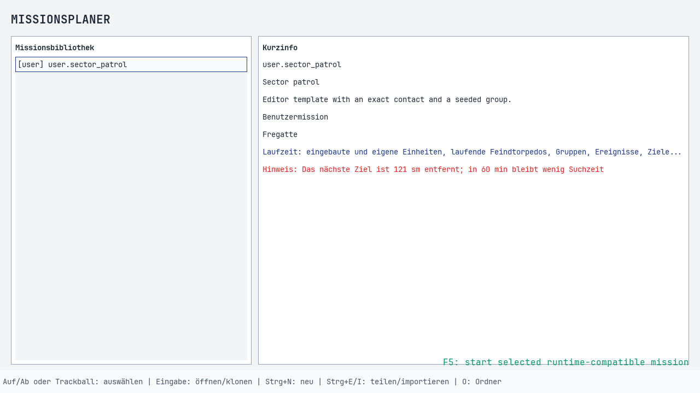

*Missionseditor*

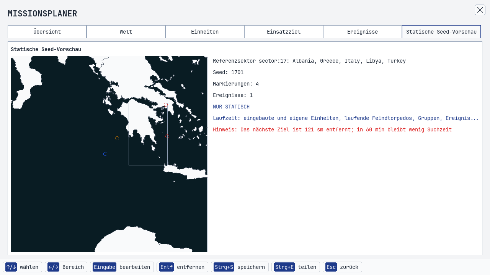

*Missionseditor, Einheitendetails*

Eigene Missionen starten aus dem Missionseditor (`F5` in dessen Browser). Die Laufzeit übernimmt den Umfang des Editors: eine 500-sm-Welt fest oder als paketierter Referenzsektor (`sector:0` bis `sector:127`), das eingestellte Wetter, platzierte U-Boote, Überwasserschiffe, Luftfahrzeuge (Patrouille in einem 10-sm-Kasten mit Profilgeschwindigkeit), Tiere, ruhende Täuschkörper und feindliche Torpedos, die schon auf ihrem Kurs laufen, gesäte Zufallsgruppen, zeitgesteuerte Ereignisse (Meldung, Erscheinen, Wetter, Ziel) und die Ziele Versenken, Überstehen, Schützen (die benannten Einheiten bis zum Zeitlimit erhalten) und Erreichen (den Radius des Zielpunkts betreten).

Im Einheiteneditor gespeicherte Profile lassen sich wie eingebaute platzieren und wirken in dieser Mission (Fahrtbereich, Tiefe, Torpedozahl, Verhalten, Akustik); ein eigenes U-Boot übernimmt Sensoren, Rohre, Täuschkörper und seine Batterie-, Diesel- oder AIP-Anlage vom eingebauten U-Boot seines Antriebs. Torpedos der Fregatte und des Helikopters, fehlende Benutzerprofile und andere Weltgrößen werden beim Start abgewiesen.

Im Editor-Reiter Welt öffnet `Eingabe` auf Art oder Referenz eine Auswahlliste (`Hoch`/`Runter`, `Bild auf`/`Bild ab`, `Eingabe` übernimmt, `Esc` bricht ab); Referenz listet die 128 Sektoren mit ihren Ländern, und die Wahl eines Sektors macht die Welt zu einer 500-sm-Referenzwelt. Der Reiter Vorschau zeichnet dann die Küste dieses Sektors.

### Eigene Missionen und Weitergabe

Eigene Missionen und Teilen: In der Übersicht des Missionseditors ist die Spielerseite Fregatte oder U-Boot. Für das U-Boot nennt „Eigenes U-Boot“ ein platziertes feindliches U-Boot, das der Spieler führt, während die KI die Fregatte besetzt; seine Ziele sind Versenken (Ziele können nur Handelsschiffe sein, weil die Torpedos des U-Boots die zivile Schifffahrt treffen), Überstehen (bis zum Zeitlimit aushalten) oder Erreichen, nie Schützen. Das U-Boot gewinnt, wenn es alle Ziele versenkt, den Punkt erreicht oder aushält, und verliert, wenn es versenkt wird oder bei Versenken und Erreichen die Zeit abläuft. Die Liste des Editors markiert U-Boot-Missionen mit `[U]`, und Kurzbeschreibung und Vorschau geben Fairness-Hinweise: ein U-Boot, das näher als 3 sm an der Fregatte startet, gar keine feindliche Einheit, oder ein Zielpunkt bzw. nächstes Ziel, das die Seite im Zeitlimit kaum erreicht (Fregatte 20 kn, U-Boot 8 kn).

`Strg+E` teilt die gewählte Mission als Datei in den Austauschordner `~/.u-jagd/share` (Windows: `%USERPROFILE%\.u-jagd\share`), mit jeder eigenen Einheit, auf die sie verweist; `Strg+Umschalt+E` exportiert weiter auf einen eingetippten Pfad. `Strg+I` listet die Dateien in diesem Ordner mit ihren Missionen (`Hoch`/`Runter`, `Eingabe` importiert, ein zweites `Eingabe` überschreibt vorhandene Einträge, `Tab` tippt stattdessen einen Pfad, `O` öffnet den Ordner, `Esc` schließt); schon gleiche Einträge werden übersprungen. `O` in der Liste des Editors öffnet den Ordner im Dateimanager (unter Windows im Explorer). Eine Datei in den Ordner eines Freundes kopieren, und er importiert sie mit `Strg+I`.

Im Solo-Modus von Remote Crew listet „Eigene Missionen“ in der Gastgeberleiste des Browsers dieselben Missionen mit Seite, Ziel, Hinweisen oder Fehlern: Starten (wechselt vorher auf die Seite der Mission), Bearbeiten, Herunterladen (dieselbe Teilen-Datei) und Löschen; „Datei hochladen“ nimmt eine Teilen-Datei oder eine einzelne Mission (höchstens 1 MB). „Neue Mission“ oder Bearbeiten öffnet den Missionsplaner: Reiter Übersicht, Welt, Einheiten, Ziel und Ereignisse und eine Karte der Welt oder des Referenzsektors, auf der ein Klick die Fregatte, die gewählte Einheit oder den Zielpunkt setzt. Speichern legt die Mission nach derselben Prüfung wie im Editor auf der uConsole ab (Fehler werden aufgelistet, ein vorhandener Schlüssel fragt vor dem Überschreiben), Speichern und starten startet sie sofort. Crew-Sitzungen haben keinen Zugriff auf die Bibliothek.

### Einheitenanalysator und Einheiteneditor

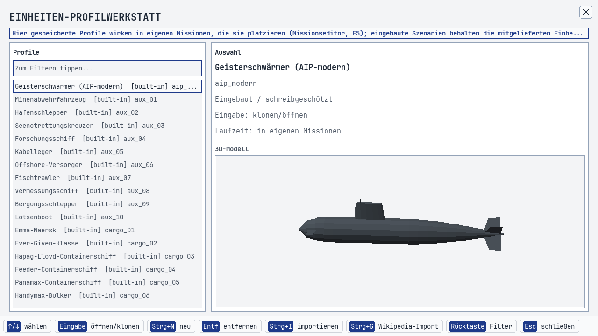

*Einheiteneditor*

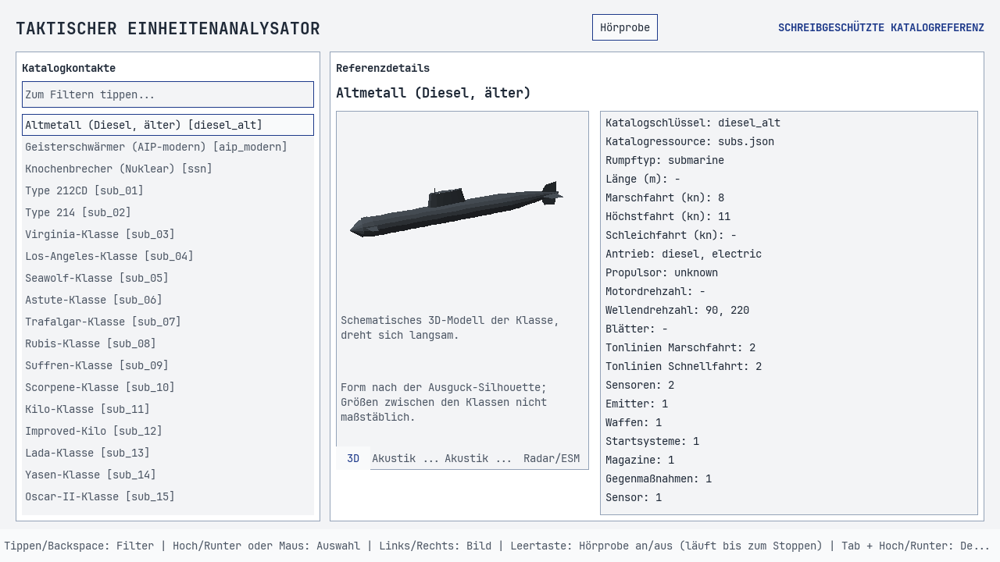

*Kontaktanalyse (F8)*

Einheitenanalysator (`F8`, Hauptmenü) und Einheiteneditor: Die erste Seite jedes Katalogprofils im Analysator ist ein schematisches 3D-Modell seines Typs (Reiter `3D`, danach mit `Links`/`Rechts` die Klang- und Radarbilder); es dreht sich langsam und lässt sich im Remote-Crew-Browser zusätzlich durch Ziehen drehen. Der Einheiteneditor zeigt dasselbe Modell unter dem gewählten Profil und neben den Feldern eines geöffneten.

Jeder Schiffs-, U-Boot- und Flugzeugtyp des Katalogs hat ein eigenes Modell, gebaut aus den öffentlichen Hauptabmessungen und der Anordnung der echten Klasse (Wikipedia; allgemeine Typen wie ein VLCC oder ein Hafenschlepper mit typischen Werten): Länge, Breite und Tiefgang, wo Brücke, Masten, Schornsteine, Geschütze, Flugkörperzellen, Flugdeck, Kräne und Ladung stehen, beim U-Boot Turm, Tiefenruder, Heckruder und Raketendeck, beim Flugzeug Flügel, Leitwerk und Triebwerke. Derselbe Typ sieht immer gleich aus; Profile aus dem Einheiteneditor und alles ohne eigenen Typ behalten das Modell ihrer Klasse (Kriegsschiff, Handelsschiff, Kleinfahrzeug, U-Boot, der Hubschrauber des Ausgucks). Torpedos, Täuschkörper, Wale, Fischschwärme und Quallen haben eigene Modelle.

Die Modelle sind schematisch und werden alle gleich lang gezeichnet, sind also untereinander nicht maßstäblich. Dieselben Modelle stehen, um den geschätzten Lagewinkel gedreht, in den Okularen (Ausguck, Fernglas, Sehrohr); der Browser lädt sie beim ersten Gebrauch in drei Gruppen nach.

## Sprachmodell (optional)

### Einrichten

Ein OpenAI-kompatibles Sprachmodell kann das Spiel reicher machen. Es ist ab Werk aus, und das Spiel läuft genau wie ohne: Jede Aufgabe fällt auf die eigenen Texte des Spiels zurück, wenn der Server aus, langsam oder nicht erreichbar ist.

Eingeschaltet wird es unter `F10` Optionen, Seite 2, **Sprachmodell**: an/aus, die Serveradresse (zum Beispiel `http://localhost:11434/v1` für Ollama im LAN oder ein Cloud-Dienst), der Modellname, der API-Schlüssel, formulierter Funkverkehr, der Coach (aus, selten, oft) und der experimentelle Gegner; **Verbindung testen** schickt eine kurze Anfrage und zeigt die Antwortzeit. Der API-Schlüssel liegt in `~/.u-jagd/llm_key` (nur für dich lesbar) oder kommt aus der Umgebungsvariable `U_JAGD_LLM_KEY`; er gelangt nie in Einstellungen, Spielstände, Protokolle oder einen Browser.

Das Modell läuft auf einem Server, nie auf der uConsole selbst. Der Schlüssel erscheint beim Tippen als Sternchen und danach nur mit seinen letzten Zeichen. Das Spiel bittet um Antworten ohne Denkphase (das verstehen Qwen3 unter vLLM oder SGLang; ein Server, der den Schalter ablehnt, wird ohne ihn gefragt). Schickt ein Denkmodell trotzdem nur seine Denkschritte, meldet der Test „nur Denkschritte, keine Antwort“: Schalte dann den Denkmodus am Server ab oder nimm ein Modell ohne.

### Was es tut

- Funkverkehr: Jede Meldung der Führung und die Funkbefehle des besetzten U-Boots erscheinen zusätzlich wie echter Funkverkehr formuliert neben dem Original. Zahlen, Peilungen und Positionen bleiben wie gegeben; das Original bleibt maßgeblich.
- Einsatzbericht: Am Missionsende schreibt das Modell für jede Seite einen kurzen Bericht aus der Aufzeichnung der Nachbesprechung (jetzt mit der Wahrheit). `B` in der Nachbesprechung zeigt ihn, der Browser zeigt ihn in der Wiedergabe der Nachbesprechung, und das Dienstbuch behält ihn bei der Mission (`B` dort).
- Erster Offizier (`F7` im Einsatz, im Browser die Schaltfläche **IWO fragen**): Lagemeldung, eine getippte Frage (beantwortet aus dem eigenen Lagebild und dem Handbuch), ein getippter Befehl, Hilfe zur Klassifizierung des gewählten Kontakts und eine Einweisung für die eigene Station. `Links`/`Rechts` oder `1`-`5` wählen die Art, `Eingabe` sendet, `Hoch`/`Runter` blättern, `Esc` schließt. Mit der Maus wählt ein Klick auf einen Reiter die Art, die Tastenknöpfe unter dem Protokoll senden, geben oder verwerfen einen Befehl, blättern und schließen, das Mausrad blättert, und solange das Modell aus ist, öffnet ein Knopf seine Einstellungen; auf allen Seiten der Einstellungen decken blaue Tastenknöpfe unter den Zeilen jede Taste ab, auch den Seitenwechsel mit `Tab`. Der Offizier sieht nur das Lagebild der eigenen Seite, wie die eigenen Stationen.
- Getippte Befehle: nur Kurs, Fahrt, Tiefe, Schleichfahrt und Gefechtsstationen, nie Waffen. Der Offizier schlägt die Stationsbefehle vor, und nichts wird gegeben, bevor Sie bestätigen (`Eingabe`; `Rücktaste` oder `Esc` verwirft). Im Browser gehen die Befehle nur von einer Station, die sie geben darf.
- Coach: Mit eingeschaltetem Coach (selten oder oft) erscheint ab und zu ein kurzer Tipp aus dem eigenen Lagebild in der Meldezeile.
- Dienstbuch: `A` lässt das Modell die Dienstzeit bewerten, `B` zeigt den neuesten Bericht. Eine Mission, in der Lagemeldungen, Fragen, Befehle, Klassifizierungshilfe oder der Coach genutzt wurden, ist „mit Berater“ markiert und bekommt keine Bestwertung und keine Auszeichnung; die Einweisung allein zählt nicht.
- Missionsgenerator: `G` (Fregatte) oder `Umschalt+G` (U-Boot) in der Liste des Missionseditors und **Einsatz schreiben** im Missionsplaner des Browsers schreiben eine Mission aus wenigen Worten. Die Antwort durchläuft dieselbe Prüfung wie jede eigene Mission (unbekannte Felder fallen weg, eine feste 500-sm-Welt, Versenken-Ziele sind jedes platzierte feindliche U-Boot); bei Fehlern bekommt das Modell eine Chance zur Korrektur. Der Editor öffnet die Mission ungespeichert zum Prüfen (`Strg+S` speichert); der Planer legt sie als neue Mission ab und öffnet sie.
- Experimenteller Gegner: Alle 3 min Einsatzzeit wählt das Modell aus dem eigenen Lagebild der KI-Seite einen Plan aus einer festen Liste: für die KI-U-Boote tief gehen und schleichen, heranschließen, absetzen oder still liegen (Ausweichen, Lauern und Angriffe behalten Vorrang); für die KI-Jäger Sprint und Drift, leise oder schnelle Suche. Es steuert, zielt und schießt nie selbst. Eine solche Mission ist im Dienstbuch „experimentell“ markiert, bekommt keine Bestwertung und keine Auszeichnung und ist nicht allein aus ihrem Seed wiederholbar (der gültige Plan wird gespeichert). In Kampagne, Lektionen und Spiel mit zwei Crews läuft er nie.

### Stimme

Ein OpenAI-kompatibler Sprachdienst (`/audio/speech`) gibt dem Ersten Offizier und der Crew eine natürliche Stimme. Er ist ab Werk aus; ohne ihn spricht die Crew weiter über `espeak-ng`, und sonst ändert sich nichts. Eingerichtet wird er unter `F10` Optionen, Seite 2, **Sprachmodell**, Seite **2 Stimme** (`Tab` oder `Bild auf`/`Bild ab` wechselt, ein Klick auf den Reiter auch): an/aus, die Serveradresse (voreingestellt `https://api.openai.com/v1`), das Sprechmodell (voreingestellt `gpt-4o-mini-tts`; `tts-1` geht auch), die Stimme (`Links`/`Rechts` wechselt durch die OpenAI-Stimmen, `Eingabe` tippt einen anderen Namen), der API-Schlüssel, **Erster Offizier spricht**, **Crew-Meldungen mit dieser Stimme** und **Stimme testen**, das einen Probesatz spricht und die Dauer zeigt.

- Seite **3 Klang**: **Temperature** (niedriger = ruhiger und gleichmäßiger, höher = lebhafter; Qwen-Standard 0,9), **top_p** (niedriger = weniger Ausreißer; Qwen-Standard 1,0), **Seed** (eine feste Zahl hält den Vortrag über alle Sätze gleich; -1 = zufällig, einmal pro Start gezogen, sodass die Stimme in einer Sitzung gleich bleibt) und **Text vor dem Sprechen bereinigen** (ab Werk an: Emojis, Markdown, Links, „haha“ und Regieanweisungen wie *lacht* fallen weg). `Links`/`Rechts` ändern die Zahlen schrittweise, `Eingabe` oder ein Klick tippt eine. Temperature, top_p und Seed gehen nur an Dienste, die sie annehmen, etwa einen Qwen-TTS-Server hinter der OpenAI-kompatiblen Adresse; OpenAIs eigener Dienst bekommt sie nie, und ein Server, der sie ablehnt, wird ohne sie gefragt.
- Erster Offizier: Seine Antworten (Lagemeldung, Frage, getippter Befehl, Klassifizierungshilfe, Einweisung) und die Tipps des Coachs werden auf der uConsole gesprochen, sobald sie eintreffen. Zahlen werden immer Ziffer für Ziffer gesprochen wie auf Wache (431 als „vier drei eins“, 0,9 als „null Komma neun“), Einheiten und Abkürzungen ausgeschrieben (kn als „Knoten“, sm als „Seemeilen“, ° als „Grad“, Rtg als „Richtung“, 54°21,4'N als „fünf vier Grad zwo eins Komma vier Minuten Nord“). Auch Temperaturen und Zeichen werden ausgesprochen: −2 °C als „minus zwo Grad Celsius“, 0–360 als „null bis drei sechs null“, ± als „plus minus“; kurze Großbuchstaben-Kürzel wie HQ werden buchstabiert, Wörter in Großschrift normal gesprochen, und Zeichen wie |, ·, / oder Pfeile werden zu einer kurzen Pause. Die Stimme spricht fest in der Spielsprache, Deutsch oder Englisch; Sprachdienste, die ein Feld für die Sprache kennen (etwa Qwen-TTS), bekommen sie zusätzlich mitgeschickt, und die Sprechanweisung an den Dienst ist selbst in der Spielsprache geschrieben (eine englische Anweisung zieht manche Modelle zu englischem Akzent), damit kein Satzanfang in einer anderen Sprache oder mit fremdem Akzent beginnt. Erster Offizier, Crew und Log sprechen in einem ruhigen, gleichmäßigen Ton, ohne Lachen oder Seufzen. Lange Antworten enden nach etwa 700 Zeichen an einem Satzende.
- Crew: Mit eingeschalteten **gesprochenen Crew-Meldungen** (Optionen, Seite 2) spricht die Crew mit derselben Stimme statt mit `espeak-ng`; eine Meldung, die der Dienst nicht liefern kann, spricht `espeak-ng`. Meldungen, die älter als 20 s sind, fallen weg, statt verspätet zu kommen.
- Log: Seite **4 Meldungen** liest das Log (`F11`) der eigenen Seite vor: **Logmeldungen vorlesen** (ab Werk an, sobald die Stimme eingerichtet ist) und ein Schalter je Station des Logs: Brücke und Navigation (NAV), Funk (FUNK; auf dem U-Boot sein Funkraum), Sonar, Waffen (WAF), OPZ, Schaden und Leckwehr (SCH), Ausguck (AUSG), Mission (MIS) sowie Wetter und Welt (WET). Unter jeder Station zählt die Seite ihre Meldungen der letzten 5 Minuten, so fällt eine Station, die zu viel meldet, gleich auf; solange die Stimme vorliest, hat die untere Zeile des `F11`-Logs je Station einen Knopf („SONAR An“), den ein Klick stumm oder wieder laut schaltet. Jeder Eintrag wird am Stück gesprochen wie ein Satz. Logmeldungen kommen nach den Antworten des Ersten Offiziers und den Crew-Rufen; jede Meldung wird vorgelesen, eine nach der anderen in der Reihenfolge des Logs (erst bei mehr als 48 wartenden fällt die älteste weg), und was die Crew schon ausruft, wird nicht noch einmal vorgelesen. Zahlen kommen wie alles, was die Stimme sagt, Ziffer für Ziffer.
- Der Schlüssel liegt in `~/.u-jagd/tts_key` oder kommt aus `U_JAGD_TTS_KEY`. Bleibt er leer, gilt der Schlüssel des Sprachmodells, wenn beide Adressen denselben Server nennen. Wie dieser gelangt er nie in Einstellungen, Spielstände, Protokolle oder einen Browser.
- Die Stimme spielt auf einem eigenen Tonkanal und schneidet nie den Sonarton ab; Anfragen und Dekodieren laufen neben dem Spiel, ein langsamer Dienst hält also kein Bild an. Eine lange Antwort geht Satz für Satz hinaus, sodass der erste Satz schon spielt, während der Rest noch erzeugt wird, und Ton, den ein Dienst streamt (OpenAI tut das), spielt schon, während er noch ankommt; wie lange es bis zum ersten Ton dauert, liegt am Dienst. Mit ausgeschaltetem Spielton wird nichts gesprochen.
- Remote-Crew-Browser behalten ihre eigene Stimme für die Crew-Meldungen (Einstellungen, Sprachausgabe des Browsers); die Antworten des Ersten Offiziers zeigt ein Browser an, spricht sie aber nicht.

### Nicht modelliert

- Nicht modelliert: Sprachbefehle, gesprochene Antworten des Ersten Offiziers oder vorgelesene Logmeldungen im Browser, ein Modell auf der uConsole selbst, Entscheidungen des Modells über Waffen oder Ziele und ein Modell, das während der Mission die verborgene Wahrheit sieht.

## Referenzdaten

Alle Werte sind die Standardwerte der aktuellen Spielversion. Eigene Schwierigkeit und Missionen können Bestände und Zeitlimits ändern.

### Einheiten

| Größe | Einheit |
|---|---|
| Distanz, Entfernung | Seemeilen (sm) |
| Fahrt | Knoten (kn) |
| Tiefe | Meter (m) |
| Frequenz | Hertz (Hz) |
| Kurs, Peilung | rechtweisende Grad, 000 = Nord, im Uhrzeigersinn |
| Zeit | Simulationssekunden; nur 1x |

### Sensoren

| Sensor | Reichweite | Genauigkeit / Hinweis |
|---|---|---|
| Passivsonar (Basis) | 20 sm | nur Peilung; HMS +/-6 Grad, TAS +/-2 Grad, VDS +/-4 Grad |
| Aktiver Ping | 18 sm (Referenzziel, schräger Aspekt) | CW oder LFM (`W`); Entfernungsgenauigkeit aus Puls und SNR, Tiefe +/-12 m; 30 s Abklingzeit; hörbar bis 60 sm |
| Tauchsonar | 18 sm passiv / 14 sm aktiv | +/-2 Grad |
| Sonarboje | 8 sm | 60 min Batterie |
| Überwasserradar | 30 sm (50 % je Umlauf) | 4 s Antennenumlauf; Radarhorizont; keine getauchten Kontakte |
| Luftradar | 100 sm (50 % je Umlauf) | Flugzeuge und Flugkörper; Störer werden aus der Nähe durchbrannt |
| ESM | 150 sm (Hauptkeule) | +/-3 Grad Peilung; Pegel und Entfernungsschätzung |
| HFDF | 120 sm Bodenwelle bei 15 MHz (je nach Frequenz etwa 95-150 sm) | +/-8 Grad Peilung (Raumwelle +/-16) |
| Ausguck | 12 sm Überwasser, 5 sm aufgetauchtes U-Boot, 20 sm Luft, 20 sm Land | x0,25 (Neumond) bis x0,45 (Vollmond) bei Nacht; Nebel und Seegang verkürzen; Klasse ab 2, Typ ab 3,2 aufgelösten Zyklen je relativer Größe (Tanker etwa 7/5 sm, Fregatte 5/4 sm, Speedboot 3/2 sm an einem klaren Tag) |

### Waffen und Gegenmaßnahmen

| System | Daten |
|---|---|
| Fregattentorpedo | 45 kn, 12 sm (Batterie), drahtgelenkt (Schiff <= 20 kn, <= 1,5 Grad/s, 5 sm Spule), 2 Rohre, 60 s Nachladen, Tiefe 10-300 m, Annäherungszünder |
| Helikoptertorpedo | 45 kn, 6 sm, 2 je Einsatz, ohne Draht |
| Feindtorpedo | 40 kn, 20 sm, zielsuchend ab 3 sm, detoniert innerhalb etwa 90 m (unter einem Schiff auf Kieltiefe), Schaden sinkt mit dem Abstand; schneller als die Fregatte, bloßes Ablaufen hilft selten; ein KI-U-Boot greift eine geortete Fregatte innerhalb 10 sm auch bei leiser Fahrt an |
| Nixie-Schlepptäuschkörper | 2 je Mission, 600 s, 0,2-sm-Kabel (10 m bei 15 kn, langsamer tiefer, reißt über 25 kn), 60 s Nachladen |
| ESSM | 6 Flugkörper, 30 sm, 2 Feuerkanäle |
| CIWS | 1,5 sm, 180 Schuss, braucht Freigabe; 115 Grad/s Schwenken, eigenes Folgeradar innerhalb 3 sm |
| Flak-Geschütz | 240 Schuss, braucht Freigabe |
| Düppel | 6 Ladungen, 8 sm, 40 % Zielverlust nach dem Aufblühen; Wolke treibt 90 s mit dem Wind |

### Eigenes Schiff

| Merkmal | Wert |
|---|---|
| Fahrt | 4-31 kn; Telegraph STOP 0, SLOW 6, HALF 10, FULL 16, FLANK 31 kn |
| Drehrate | etwa 0,075 Grad/s je Knoten (1,2 Grad/s bei 16 kn); Drehkreis etwa 0,4 NM |
| Kavitation | ab 15 kn bei ruhiger See, bei schwerer See früher; Passivreichweite x0,35 |
| Modus LEISE | Lärm x0,65, max. 12 kn |
| TAS-Handhabung | 3-12 kn, ausbringen 360 s, einholen 480 s, Defekt über 20 kn |
| TAS-Tiefe | 20-260 m, minus 4 m je Knoten |
| Schaden | 9 Abteilungen, 3 Trupps (etwa 20 s Weg je Abteilung), 8 Leckabdichtsätze; sinkt jenseits der Reserveverdrängung, kentert bei 35 Grad Krängung oder verlorenem GM |

### Umwelt

| Vorgang | Modell |
|---|---|
| Gezeit | M2 (12,42 h) + S2 (12 h), 0,4-1,4 m Amplitude, im Flachwasser größer |
| Deckschicht | jahreszeitliche Grundtiefe; nachmittags etwa 8 m flacher; vertieft sich bei Wind über 12 kn; interne Wellen +/-6 m |
| Schallgeschwindigkeit | Mackenzie-Gleichung aus dem Temperaturprofil (Oberfläche 8-18 Grad C je nach Jahreszeit) |
| Strömung | festes Feld bis 1 kn plus 3 % des Windes, 20 Grad rechts der Windrichtung |
| Meeresboden | Fels, Kies, Sand, Schluff oder Schlick; beeinflusst die Bodenreflexion |
| Hindernisse | bis zu 64 kartierte Wracks und Unterwasserfelsen (Spitzen mindestens 15 m tief), auf jeder Karte eingetragen (Wrack: Rumpfstrich mit Masten, Fels: Sternchen; Tiefe der Oberkante beim Heranzoomen, Details im Tooltip); beide heben in ihrer Grundfläche den Meeresboden an und sind Hindernisse für Schiff, U-Boote und Waffen |
| Schiffsverkehr | Frachter, Tanker und Passagierschiffe laufen auf festen Kursen von Ziel zu Ziel (die eingezeichneten Häfen und Ausgänge am Rand des Seegebiets); sie weichen nach den Kollisionsverhütungsregeln aus (entgegenkommend, von Steuerbord kreuzend oder beim Überholen: 35 Grad nach Steuerbord, wenn der Passierabstand unter 0,5 NM läge; jedes Schiff weicht unter 0,25 NM aus) und laufen vor einer Detonation innerhalb von 8 NM 10 min mit voller Fahrt davon; Arbeits- und Fischereifahrzeuge ziehen weiter frei umher, Geleitzüge und Schiffe von HQ-Aufträgen halten ihren Kurs |
| Atmosphäre | Barometer 975-1025 hPa, das vor steigendem Seegang fällt; Lufttemperatur aus Wasser, Jahreszeit, Tageszeit und kaltem Nordwind (in Winterstürmen unter 0 Grad C: Schnee, Vereisung); Böen; Wolkenuntergrenze; Sonnenstand mit bürgerlicher/nautischer Dämmerung; Mondphase |
| Regenlinse | Regen süßt die obersten Meter aus (bis -1 PSU, vom Wind eingemischt) und senkt die Schallgeschwindigkeit an der Oberfläche |
| SOFAR-Kanal | ein inneres Schallgeschwindigkeitsminimum (etwa 400-500 m unter der Deckschicht) gibt es nur in ausreichend tiefem Wasser |

### See, Wetter und Effekte

Was See und Wetter bewirken und was die Bildschirme davon zeigen:

- **Optiken:** Brückenglas, Sehrohr und Handy-Ausguck zeigen, was auf See geschieht: Wassersäulen von Torpedo- und Wasserbombentreffern, Feuer und Rauch eines brennenden Schiffs und ein sinkendes Schiff. Beim Ausfahren kommt das Sehrohr aus dem Wasser, das Wasser läuft vom Glas ab; ab Seegang 3,5 spülen Wellen ab und zu über den Kopf und lassen Tropfen zurück.
- **Karten:** Marken gleiten zwischen den Sensormeldungen weich weiter, ein neuer Ping oder eine Detonation breitet sich als Ring vom Ort des Geschehens aus.
- **Instrumente:** Zeiger und Telegrafenhebel bewegen sich mit Masse und schwingen ein; ein neuer Maschinenbefehl läutet die Telegrafenglocke.
- **Meeresleuchten:** nachts in warmem Wasser (ab 11 °C Oberflächentemperatur, voll ab 16 °C) leuchtet Plankton, wo das Wasser aufgewühlt wird. Kielwasser, die Schaumfahne eines Sehrohrs und Torpedobahnen leuchten blaugrün und sind weiter zu sehen: ein voll leuchtendes Kielwasser nimmt 40 % des nächtlichen Nachteils für Ausgucke beider Seiten zurück. Wie stark ein Seegebiet leuchtet, legt sein Seed fest.
- **Knuckles:** eine harte Drehung (ab 0,9 Grad/s) mit Fahrt (ab 12 kn) hinterlässt dort, wo das Heck herumschwang, ein Blasenfeld von etwa 150 m, höchstens eines alle 15 s je Plattform, das über etwa 100 s abklingt und nach 5 min vergangen ist. Schall hindurch verliert bis zu 12 dB (passiv und aktiv, bei mehreren höchstens 20 dB), ein aktiver Ping bekommt daraus ein Falschecho ohne Doppler, und ein kielwassersuchender Torpedo nahe einem starken Feld kann hineingezogen werden und dort kreisen. Fregatte und U-Boote erzeugen und erleiden sie gleich; das Brückenlog meldet das erste Knuckle einer Drehung.
- **Wracks und Felsen:** kartierte Wracks und Felsen geben aktive Echos wie ein stehendes Ziel. Ein Hubschrauber oder Seefernaufklärer, der mit MAD über ein Wrack fliegt, bekommt eine Anomalie ohne Kontakt (Log: „Wrack oder U-Boot?“).
- **Gewitter:** unter einem Sturm (Regen ab 55 %) schlagen zufällig Blitze rund um das Schiff ein, im stärksten Regen etwa einer alle 12 s. Ein Blitz erhellt die Optiken und zuckt in seiner Peilung herab, der Regen prasselt stärker, und einem Einschlag innerhalb von 10 sm folgt nach der Laufzeit des Schalls (3 s je km) Donner. Die Sferics der Entladungen knistern auf den ESM-Rosen (ELOKA und ESM des U-Boots), auf der HF/DF-Rose und im Browser (Hinweis **Sferics**) und streuen jede HF/DF-Peilung, die der Fregatte auf den Funkspruch eines U-Boots wie die eines U-Boots auf den der Fregatte, um bis zu 75 %. Die Blitze folgen Seed und Simulationszeit und brauchen daher keinen Spielstand.
- **Deckbewegung:** siehe Hubschrauberdeck, Startgrenzen: Start und Landung brauchen eine ruhige Phase von mindestens 6 s innerhalb der Roll- und Stampfgrenzen.

### Gegnerische U-Boote

| Klasse | Leisheit | Max. Tiefe | Torpedos |
|---|---|---|---|
| Diesel (älter) | 0,75 | 200 m | 4 |
| AIP (modern) | 0,85 | 250 m | 5 |
| Nuklear-Jagd-U-Boot | 0,92 | 400 m | 8 |

U-Boote weichen nach einem gehörten Ping oder Torpedo 240 s aus (weg von der Peilung des gehörten Torpedos, der Rakete oder Wasserbombe, sonst weg von der Fregatte), können einen Täuschkörper ausstoßen, lauern, schnorcheln (durch HFDF und ESM erfassbar) und pingen gelegentlich aus 15 sm oder weniger. In der Nähe der Fregatte kann ein U-Boot stattdessen zu einem kartierten Wrack innerhalb von 8 sm schleichen und sich 15-30 Minuten still daneben auf Grund legen.

Ein U-Boot mit ausgefahrenem Mast oder Schnorchel, das ein Flugzeugradar (Helikopter oder Seefernaufklärer) hört, geht auf Tiefe und schiebt das Schnorcheln 15 Minuten auf. In den Fregattenszenarien (1 bis 4) torpediert ein Patrouillen-U-Boot, das 10 Minuten keinen Ping und keinen Torpedo gehört hat, mehr als 2 Torpedos behält und mehr als 10 sm von der Fregatte entfernt ist, ein Handelsschiff innerhalb von 4 sm bei etwa einem von sieben seiner minütlichen Schussfenster. Der Notruf des Handelsschiffs nennt seine ungefähre Peilung (auf 10° gerundet) und Entfernung (ganze sm) von der Fregatte; jedes verlorene Handelsschiff kostet 300 Punkte, aber nur, wenn das Sonar der Fregatte das angreifende U-Boot in den 10 Minuten davor gehört hat.

U-Boot-Physik: der Rumpf beschleunigt auf die befohlene Fahrt (kein Sofortsprint); Tiefenruder brauchen Fahrt (unter etwa 4 kn ändert sich die Tiefe nur langsam); das abgestrahlte Geräusch steigt je Verdopplung der Fahrt um etwa 12 dB und springt, wenn die Schraube kavitiert, wobei die Kavitationsfahrt mit der Tiefe steigt; ein Torpedoausstoß erzeugt 8 s lang ein Transientengeräusch; ein stark geflutetes U-Boot bläst einmal an und steigt schnell und laut auf; unter der Testtiefe ermüdet der Druckkörper, bei 1,5-facher Testtiefe wird er zerdrückt; ein lauerndes U-Boot hält seine Position gegen die Strömung.

U-Boote orten wie Sie: passive Peilungen aus dem eigenen Sonar, eine Entfernung erst nach eigenen TMA-Schlägen (einige Minuten), und ein Schuss auf diese TMA erst, wenn ihr Entfernungsfehler konvergiert ist (Schwierigkeitsfeld "Gegnerische Feuerleitkonvergenz": Sigma zu Entfernung höchstens 0,25 in den Patrouillenszenarien, 0,15 beim SSN; eine Lösung, die älter als 90 s ist oder durch Ihre Kursänderung wieder aufgeht, wird nicht beschossen), ESM nur mit ausgefahrenem Mast, den Datalink nur auf Masttiefe oder beim Schnorcheln, und ein Torpedoalarm braucht einige Sekunden Reaktionszeit der Besatzung (2-15 s), bevor das U-Boot ausweicht.

Überwasserschiffe verlieren bei schwerer See Höchstfahrt (kleine Schiffe mehr).

### Gegnerische Kommandanten

- Jeder Computer-U-Boot-Kommandant und der Kapitän der KI-Jagdfregatte hat einen von vier Charakteren, durch den Seed festgelegt: **Draufgänger** (greift früh an, weicht kurz aus, lauert selten), **Fuchs** (lauert lange und weit, pingt wenig), **Vorsichtiger** (weicht lange aus, hält das Feuer zurück, hält Abstand) und **Jäger** (hartnäckig, läuft eine verlorene Peilung lange ab).
- Jeder Charakter ändert die vorhandene Taktik nur über Faktoren (Angriffsrate, Ausweichzeit, Lauerabstand; bei der Jagdfregatte Annäherungsfahrt, Pingabstand, Schussweite und Vorhaltezeit); über die vier gleichen sie sich aus.
- In etwa sechs von zehn Einsätzen deutet die Führung den Charakter nach 90 s an (*Der Nachrichtendienst hält den gegnerischen Kommandanten für ...*); die Nachbesprechung nennt ihn.
- **Eigene Pläne:** Jedes freie KI-U-Boot und die KI-Jagdfregatte wählen selbst einen Plan, ganz ohne Sprachmodell. Ein U-Boot, das die Fregatte hört, schließt heran (Draufgänger, Jäger), lauert unter der Sprungschicht (Fuchs) oder bleibt bei seiner Streife (Vorsichtiger); nach einem Ping geht es tief und schleicht oder schwebt lauschend unter der Schicht; beschädigt oder ohne Torpedos setzt es sich ab. Die Jagdfregatte sucht ohne Datum schnell, leise, in Sprints mit Lauschpausen oder normal, je nach Kapitän. Ausweichen, Lauern und Angriffe behalten Vorrang.

### Erschütterung, Trefferbild und Suchköpfe

- Eine Detonation innerhalb 0,6 sm vom eigenen Schiff lässt das Bild wackeln und das Licht flackern; innerhalb 0,15 sm springt kurz das Instrumentenglas. Beides ist nur Anzeige.
- Sieht die eigene Seite einen Treffer (Feuerball, Wassersäule eines Torpedos, ein sinkendes Schiff), öffnet sich an jeder Station für 8 s ein kleines Fenster in seine Peilung; ein nur gehörter Treffer öffnet es mit Peilung und Geräusch.
- Im Fernglas und im Sehrohr zeigt ein erkanntes Schiff Bugwelle und Kielwasser: hoch und weiß bei schneller Fahrt, kaum etwas bei langsamer.
- Der Suchkopf eines zielsuchenden Torpedos pingt langsam, solange er sucht, und schnell, sobald er aufgeschaltet hat. Fregatte und U-Boot hören das: *Torpedo hat aufgeschaltet*, *Peilung steht* (Kollisionskurs) und auf der Bedrohungsseite des U-Boots eine grobe Torpedouhr, die nach Gehör geschätzte Zeit bis zum Einschlag.

### Wertung

| Posten | Punkte |
|---|---|
| Fregatte: U-Boot versenkt | je 1000 |
| Fregatte: nicht verschossener Torpedo | je 200 |
| Fregatte: keine zivilen Verluste | 500 |
| Fregatte: Zeitbonus | bis 500 |
| U-Boot: Fregatte versenkt | 1500 |
| U-Boot: Versorger versenkt | 1300 |
| U-Boot: Geleitzug versenkt | 1200 |
| U-Boot: Kampfschwimmer abgesetzt oder Agenten abgeholt | 1100 |
| U-Boot: Durchbruch, Meerenge passiert, Meldung, Heimathafen erreicht oder Lauschposten gemeldet | 1000 |
| U-Boot: Entkommen oder Fühlung abgeschüttelt | 800 |
| U-Boot: Überlebt | 600 |
| U-Boot: unbeschädigt | bis 500 |
| U-Boot: verbliebener Torpedo | je 100 |
| Realismusfaktor | Einsteiger 75 %, Standard 100 %, Realistisch 125 % |

## Glossar und Abkürzungen

### Glossar

| Begriff | Bedeutung |
|---|---|
| U-Jagd (ASW) | Anti-Submarine Warfare, Bekämpfung von U-Booten |
| HMS / TAS | Bugsonar / Schleppsonar (Towed Array) |
| VDS | Variable Depth Sonar: Schleppkörper, unter die Sprungschicht abgesenkt |
| LOFAR | Low Frequency Analysis and Recording: Frequenz-Zeit-Wasserfall |
| DEMON | Demodulated Noise: zeigt Blatt- und Wellenfrequenz |
| TMA | Target Motion Analysis, Zielbewegungsanalyse aus Peilungen |
| BT | Bathythermograph: misst Schallprofil und Sprungschicht |
| CZ | Konvergenzzone |
| Datum | Letzte geschätzte Zielposition für Waffen und Suche |
| OPZ / CIC | Operationszentrale / Combat Information Centre |
| ESM / ECM | Elektronische Unterstützung (passiv) / Gegenmaßnahmen (Stören) |
| HFDF | Kurzwellenpeilung (High Frequency Direction Finding) |
| EMCON | Emissionskontrolle: Radare aus |
| ROE | Einsatzregeln (Rules of Engagement) |
| AIP | Außenluftunabhängiger Antrieb: ein konventionelles U-Boot, das tagelang ohne Schnorcheln getaucht fährt |
| AIS | Automatisches Identifikationssystem: Zivilschiffe senden Name, Kurs und Fahrt |
| ASM | Seezielflugkörper |
| ASROC | Rakete, die einen Leichttorpedo ins Ziel trägt |
| CIWS | Nahbereichsabwehr: die letzte Kanone gegen Flugkörper |
| CW / LFM | Ping-Pulse: Dauerton / linear frequenzmodulierter Sweep |
| DR | Koppelnavigation: Position aus Kurs, Fahrt und Zeit |
| ESSM | Evolved Sea Sparrow Missile: der Flugabwehrflugkörper der Fregatte |
| GPS | Satelliten-Standortbestimmung (U-Boot: Mast oben auf Sehrohrtiefe) |
| MAD | Magnetischer Anomaliedetektor: findet einen getauchten Rumpf dicht unter dem Luftfahrzeug |
| MPA | Seefernaufklärer |
| Nixie | Geschleppter Torpedo-Täuschkörper der Fregatte |
| PRF | Pulsfolgefrequenz eines Radars |
| RAS | Versorgung auf See |
| SAR | Suche und Rettung |
| SSN | Atom-Jagd-U-Boot |

### Bildschirm-Abkürzungen

Passt eine volle Beschriftung nicht auf den 1280x720-Bildschirm, zeigt die Station die Katalog-Abkürzung, statt den Text abzuschneiden. Das F11-Log und die Tooltips zeigen immer den vollen Wortlaut.

| Kurz | Bedeutung |
|---|---|
| KRS/FRT | Kurs / Fahrt |
| EGG, KAV | Eigengeräusch in %, Kavitation |
| SG/SCHICHT | Seegang / gemessene Schichttiefe (BT) |
| FLUT | Mittlere Flutung |
| TORP, VLS/DÜPP | Verbleibende Torpedos, VLS-Zellen / Düppel-Nachladen |
| HELO/ROE, HGR | Helikopterzustand / Einsatzregeln, Hangar |
| PLG, G, N | Peilung, Verstärkung, Notch |
| BB, FILT, HET | Breitband-, gefiltertes, Überlagerungs-Abhören |
| VERST, AUSBR, EINH, AUSGEBR, STAB | Schleppsonar verstaut, ausbringen, einholen, ausgebracht, Stabilität |
| BER, N/BER | Bereit, nicht bereit |
| UNB, FRD, NEU, FEI | Zugehörigkeit: unbekannt, Freund, neutral, Feind |
| SEE, UBT, LFT, FKR, TOR | Domäne: See, Unterwasser, Luft, Flugkörper, Torpedo |
| RDR S/L | Radar See / Luft |
| T, W, KZ | Tauchsonartiefe, Wassertiefe, Ping-Kühlzeit |
| P-Rate, Soll | Peilrate, Sollwert |
