# U-Jagd Manual

<!-- Generated by tools/build_manual.py from data/manual; do not edit. -->

## Quickstart

U-Jagd is a real-time simulation of anti-submarine warfare. You play one of two sides: the ASW frigate F-217 with nine stations, whose job is to detect, track, classify and sink hostile submarines without losing the ship or harming neutral shipping, or the hostile submarine with seven stations, which slips past, attacks or survives the hunt.

The game always runs in real time: one real second is one simulated second. There is no time acceleration and no pause; menus, help and options open over the running mission.

> Everything in this manual describes what the simulation actually models. Features that are not modelled are listed at the end of every station chapter.

### Mission and win conditions

- **Win:** sink every assigned target submarine, or survive until the time limit (depends on the mission).
- **Lose:** own ship sinks, a civilian vessel is hit, the target escapes more than 150 NM from its start point, or time runs out on a sink mission.
- Time warnings arrive at 5, 2 and 1 minutes remaining: on a sink mission as a deadline, on a survive (convoy) mission as the time until the convoy is safe.
- When the mission ends, `R` restarts it with the same seed (an editor mission restarts itself) and `M` returns to the main menu. During a mission, `Esc` offers "Main menu (without saving)" next to save-and-exit.
- Score: 1000 per submarine sunk, 200 per unused torpedo, 500 for no civilian losses, up to 500 time bonus.

### Stations

The ship is split into nine stations. Keys `1`-`9` select a station; pressing the number of the current station again cycles its pages.

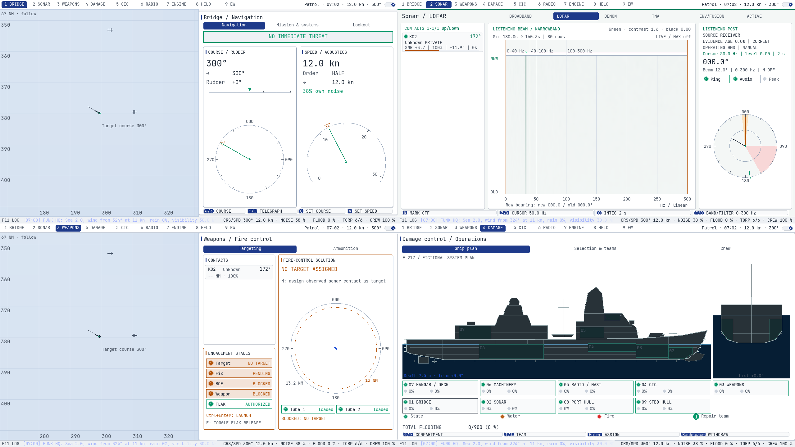

*Frigate stations on the uConsole: Bridge, Sonar, Weapons and Damage control*

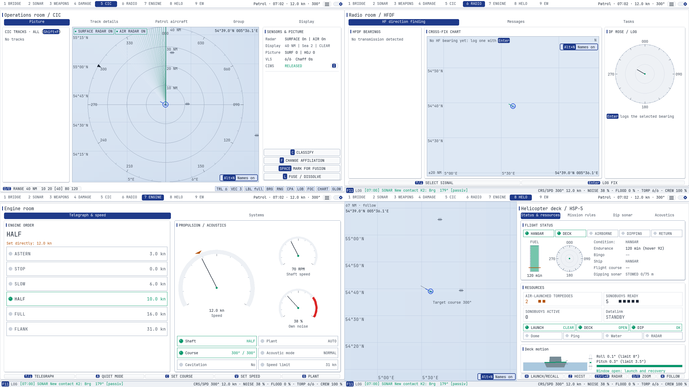

*Frigate stations on the uConsole: OPZ, Radio, Engine room and Helicopter*


*Frigate station ELOKA on the uConsole*

```text
 1 Bridge      2 Sonar       3 Weapons
 4 Damage      5 Operations  6 Radio
 7 Engine      8 Helicopter  9 Electronic warfare
```

Each station shows only what its sensors and operators know. Sonar contacts are noisy bearings until a ping, TMA, buoy or cross-fix supplies range. No station shows "the truth".

The submarine has seven stations on the keys `1`-`7` (see chapter Submarine). `F2` hands the current station to the autocrew, `F3` shows which stations run automatically (see chapter Tools).

### Controls in 60 seconds

- **Stations:** `1`-`9` (submarine `1`-`7`), `Tab`/`Shift+Tab` or a click on a tab in the top bar.
- **Pages:** press the station's number again, `PgUp`/`PgDn`, or click a page tab.
- **Fire:** `Ctrl+Enter` fires torpedoes and missiles. `Enter` alone never fires.
- **Help:** `F1` (or `?`) lists every key of the current station, its standard procedure and this manual. `Esc` cancels an entry or opens the quit dialog.
- **Trackball:** horizontal steers on the Bridge, vertical steps the station's main selection elsewhere.
- **Mouse:** a click on a key in the station's key bar, a lamp, a hint, a tab, a dial or a list row does exactly what its key does, with the same checks. The menu icon in the top bar opens the game menu (help, options, save, load, quit). On charts the wheel zooms and dragging pans (details in chapter Tools).

Global keys (all stations):

| Key | Action |
|---|---|
| `Tab / Shift+Tab` | Next / previous station |
| `1 / 2 / 3 / 4` | Bridge / Sonar / Weapons / Damage |
| `5 / 6 / 7 / 8` | Operations / Radio / Engine / Helicopter |
| `9` | Electronic warfare / ESM |
| `Active station number` | Press again to advance that station's page |
| `Page Up / Down` | Previous / next page of the station (every station with several pages) |
| `Ctrl+Enter` | Fire the torpedo or missile (Enter alone never fires; at Weapons ASROC A, depth charges Z, rocket launcher R and air torpedo D have their own keys) |
| `Arrow keys` | Station-specific selection or adjustment |
| `+ / -` | Telegraph (available at every station) |
| `F1 / ?` | Help (this display) |
| `F2` | Toggle Autocrew for the current station |
| `Shift+F2` | Crew assist: the AI mans every station nobody holds, on both units |
| `F3` | Open Autocrew overview |
| `0` | Weather & sonar analysis panel |
| `F7` | Executive officer (optional language model) |
| `F8` | Tactical Unit Analyzer (read-only catalog) |
| `F4` | Simulation log view (live; requires simlog option; M: map of all contacts, F on the map: fit units or world) |
| `F9` | Open local Commander LAN administration |
| `F10` | Options: language, fullscreen, audio, large text, tooltips, frame rate |
| `F11` | Event log and full telemetry overlay (station stays live) |
| `N` | Nations & units (sonar and the helicopter's acoustic page: notch filter) |
| `S / L (OPZ: L = fusion)` | Save / load (slots 1-5) |
| `Alt+Enter` | Fullscreen (all stations) |
| `Q / E or mouse wheel` | Chart zoom on bridge, weapons, helicopter and the OPZ chart (there Q/E set the radar range) |
| `Drag` | Pan chart (bridge, weapons, helicopter and OPZ) |
| `K` | Camera follow only on visible charts (drag disables it) |
| `Left click` | Press the clicked key, lamp, hint, tab, dial or row |
| `Right click` | Cancel like Esc in menus and entries |
| `Menu icon (top bar)` | Game menu by mouse: help, options, save/load, weather, plot, autocrew, quit and more; every overlay closes with its close box (like Esc) |
| `P` | Plot mode on the Bridge/Weapons/Helo map and OPZ chart: marks, rulers, bearing lines, circles, DR lines (shared by all stations, saved) |
| `M R B C D · Enter · Bksp` | In plot mode: choose tool, place point with Enter or click (arrows move the cursor, Shift faster), delete the nearest object (Shift: all) |
| `Esc` | Cancel input or open exit dialog |
| `R / M` | After the mission ends: restart with the same seed / main menu |
| `D` | After the mission ends: debrief with the truth beside what the crew knew (Space plays it back, Tab 10×/60×, Home/End start/end, B the language model's report when switched on) |

### Your first patrol (frigate)

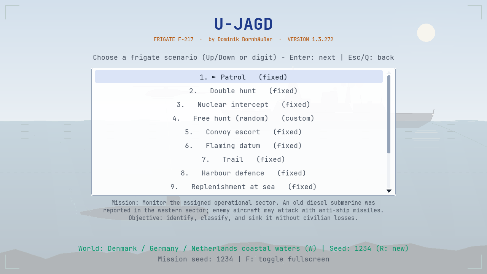

*Scenario selection, sorted by side*

1. Main menu: choose **New mission** with the arrow keys and `Enter`, the frigate with `1` and `Enter`, then scenario 1 (Patrol) with `1` and `Enter`; the briefing shows weather and time of day, `Enter` starts.
2. Bridge (`1`): press `1` again for the mission page, read objective and time limit.
3. Engine (`7`): select SLOW or 6-8 kn. Sonar (`2`): stream the towed array with `Y`.
4. Sonar BROADBAND page: look for a bright vertical trace; select it with the arrow keys and press `Enter` to follow it.
5. Classify with `C`, enable TMA with `T`, then turn the ship 30-60 degrees on the Bridge and hold the new leg for a few minutes.
6. When TMA or a ping gives range: release the contact to Operations (`G`), make it the target (`M`).
7. Weapons (`3`): set torpedo depth to the pinged target depth, fire with `Ctrl+Enter`.
8. Watch the sonar for an incoming torpedo; if one appears, run at 24 kn (not FLANK: the Nixie's tow cable parts above 25 kn), turn away and stream the Nixie (`V` at Weapons).

### Your first dive (submarine)

The quickest way into the submarine is lesson 5 of the training: main menu **Training**, lesson 5 (Listen and hide below the layer) with `5` or the arrow keys, `Enter`. The uConsole plays the submarine for this lesson, and a banner waits for each step:

1. Sonar room (`2`): wait for the frigate in the contact list.
2. Select the contact with `Up`/`Down` and press `C` until it reads warship.
3. Measure the layer with the bathythermograph (`E`).
4. Command (`1`), then `J`: the submarine dives below the measured layer, where the frigate's hull sonar hears it badly.

Lesson 6 continues with evading a pinging frigate (`I` on the Threat page). After the lessons, start **New mission**, the submarine with `2` and `Enter`, then scenario 1 (Breakthrough) with `1` and `Enter`: reach the goal area marked GOAL on the chart. Go slow (`-` on the telegraph or `A` for silent running), stay below the layer, keep the mast down near the frigate and evade with `I` when a ping or torpedo alarm comes in.

### Underwater acoustics in five minutes

- **Passive sonar gives bearing only.** Every contact starts as a line of bearing. Range comes from active ping, TMA, sonobuoys or a cross-fix.
- **Detection is signal against noise.** The passive sonar equation SE = SL - TL - NL + DI - DT decides: the target's source level (louder = farther), transmission loss (spreading, absorption, layer and path losses), noise (own self noise plus wind, rain and nearby shipping), and the array gain. A contact is detected at SE >= 0 dB. Wind and rain matter most when you run slow and quiet; at high own speed your own noise dominates.
- **Own speed is own noise.** Self-noise rises from 4 kn to 31 kn, the frigate's top speed. Above 15 kn the propellers cavitate and passive range drops to about a third.
- **The layer (thermocline) bends sound.** Passive propagation is ray traced through the real sound-speed profile: above the layer a surface duct carries sound far, below it lies a shadow zone a few miles wide. In deep water the shadow is strong; in water of a few hundred metres, bottom bounce and multipath fill it beyond about 10 NM, so hiding below the layer mainly works close in. A ping into the shadow zone reaches only 35 % of its range.
- **Seabed and surface matter.** Rock and gravel reflect sound well, silt and mud absorb it; a rough sea scatters high frequencies. **Convergence zones** appear only where the water is deep enough for rays to turn back up.
- **Baffles:** own-ship noise is a soft 70 degree lobe astern of the hull array (and along the cable of the towed array). It masks, it does not blank.

```text
            surface
  ~~~~~~~~~~~~~~~~~~~~~~~~~~~~~~~~~~~~~~~~
    frigate  HMS )))            direct path
  ---------- layer / thermocline ----------  -6.5 dB across
       TAS below layer  )))    submarine
                                (shadow zone for a shallow sensor)
  ________________________________________ seabed
```

### Navigation conventions

- Distances in nautical miles (NM), speed in knots (kn), depth in metres, frequency in Hz.
- Courses and bearings are true degrees: 000 north, clockwise. Charts are north-up.
- The ship turns faster the faster it runs (about 0.75 degrees per second at 10 kn, 1.2 at 16 kn) and cannot turn when stopped; speed changes take minutes. Plan manoeuvres early.

## Main menu and game start

After the start screen the main menu opens. `Up`/`Down` (or the mouse) choose an entry, `Enter` opens it, `Esc` asks whether to quit. Every page reached from it goes back with `Esc`.

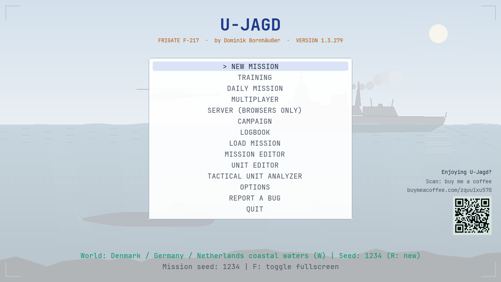

*Main menu*

### Main menu entries

| Entry | What it does |
|---|---|
| Continue mission | Resumes the autosaved mission; only shown while an autosave exists |
| New mission | Side, scenario, briefing (below) |
| Daily mission | One fixed mission per side and day |
| Multiplayer | The lobby with Remote Crew (chapter Remote Crew) |
| Server (browsers only) | The uConsole only serves; everyone plays in the browser |
| Training | Six guided lessons (below) |
| Campaign | Theatre campaign for either side (chapter Scenarios and missions) |
| Logbook | Service record and awards (chapter After the mission) |
| Load mission | Loads slot 1-5 |
| Mission Editor | Own missions (chapter Mission and unit editor) |
| Unit Editor | Own unit profiles (chapter Mission and unit editor) |
| Tactical Unit Analyzer | Read-only catalogue of every unit (chapter Mission and unit editor) |
| Options | Settings (chapter Options) |
| Report a bug | Bug report with QR code (below) |
| Quit | Ends the game |

### First launch

When no `~/.u-jagd/settings.json` exists yet, a welcome page follows the start screen: "What do you want to play?" `1` Frigate (the Training menu with lesson 1 selected), `2` Submarine (the Training menu with lesson 5, the first submarine lesson, selected), `3` Remote Crew (opens the multiplayer lobby; `Esc` there leads to the main menu), `4` or `Esc` main menu. Arrow keys and `Enter` choose as well. Whatever you pick, the page is remembered in the settings and not shown again.

### New mission: side and scenario

A new game first asks for the side (`1` frigate, `2` submarine), then lists only that side's scenarios: each side counts from `1`: `1`-`9` and `0` (the tenth; the eleventh and twelfth with the arrow keys) on either side (frigate 4 = random with custom difficulty) (see chapter Scenarios and missions), `Esc` back to the side choice; `W` world mode, `R` new seed, `F` fullscreen (these three only on the main menu and the scenario pages: list, difficulty, briefing), `Enter` start.

The list shows nine rows at once and scrolls with the selection (`Up`/`Down`, mouse wheel, `PgUp`/`PgDn` one page, `Home`/`End` first and last row; with a fixed real sector `[`/`]` choose the sector); a bar at its right edge shows where you are, and below it the start of the selected scenario's briefing. The own missions and the free hunt's difficulty list scroll the same way.

**Own missions:** the start menu lists, after the scenarios of the chosen side, the row "Own missions" (`O`, or `Enter` on the row). It opens the Mission Editor's missions of that side; `Enter` starts one. The multiplayer lobby offers them in its mission row after the scenarios, and the solo browser in the "New game" dialog and under "Own missions" in the host bar (see chapter Mission and unit editor).

### Briefing: weather, time of day and length

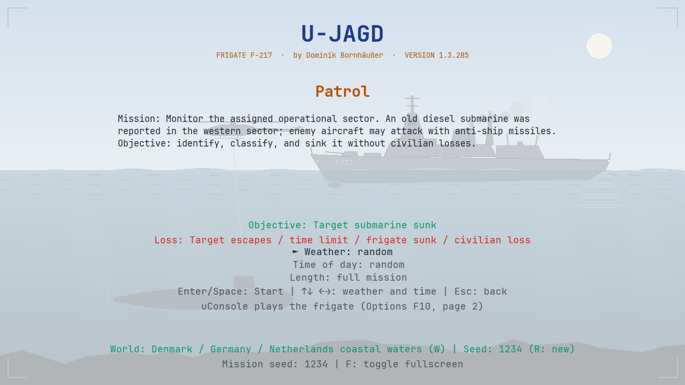

*Mission briefing before the start: task, area, forces and win conditions*

**Weather and time of day:** every scenario's briefing (for 4 after the difficulty), a campaign hotspot's briefing, the multiplayer lobby and the browser's "New game" dialog choose the weather (random, fair, rain, storm, fog) and the time of day (random, dawn 06:00, day 12:00, dusk 19:00, night 01:00): `Up`/`Down` picks the row, `Left`/`Right` changes it. Random keeps what the seed gives.

A chosen weather holds for the whole mission (sea state fair and fog 1, rain 3, storm 5; the sea changes only within 0-2, 2-4 and 5-6; a storm brings thunderstorms with lightning, thunder and sferics), and no weather fronts pass then; the clock runs on from the chosen time. The choice holds for every new mission until the game quits, also for `R` at mission end; it is saved with the mission, not in the settings.

**Short mission:** the same places offer a third row, the length: the full mission or a short one (not for scenario 4, whose time limit is its own setting).

A short mission keeps its goal but has a shorter time limit and starts closer to the action: Patrol 30 min, Double hunt 60 min, Nuclear intercept 45 min, Breakthrough 60 min, Hunter group 60 min, Reconnaissance 45 min, Convoy attack 35 min, Strait blockade 45 min, Combat swimmers 45 min, Supply ship escort 45 min, Convoy escort 35 min, Damaged homecoming 60 min, every other new scenario 45 min. The first hostile submarine starts 5-8 NM from the frigate (Breakthrough and Hunter group 4-6 NM, Reconnaissance 10-16 NM) and every further one 8-14 NM; in a submarine mission the goal beyond the frigate, the strait's entry and exit, the swimmers' approach and the place on the convoy's or supply ship's bow come closer as well.

Each short variant was tuned with AI-against-AI games so that both sides win about equally often. Its name carries "(short)" and it is saved like any mission.

### Training

**Training** offers six guided lessons. Each is a short mission with a hint banner that waits for you; `Up`/`Down` or `1`-`6` choose, `Enter` starts:

| Lesson | Side | What you practise |
|---|---|---|
| 1 Listen and take bearings | Frigate | Find a submarine on the sonar, follow it and classify it |
| 2 Target motion analysis | Frigate | Switch TMA on, run a second leg and get a range |
| 3 Torpedo attack | Frigate | Locate, classify, designate and sink a hostile submarine |
| 4 Helicopter and sonobuoys | Frigate | Launch the helicopter, lay a buoy and hear the submarine on it |
| 5 Listen and hide below the layer | Submarine | Hear the frigate, classify it as a warship, measure the layer with a BT and dive below it |
| 6 Shake off a hunting frigate | Submarine | Read the Threat page, evade with `I`, go quiet and deeper than 100 m until no ping has come for two minutes |

For lessons 5 and 6 the uConsole plays the submarine. In lesson 6 the frigate pings every 45 s until you evade, then only while its pings still find you, and it never fires.

In lessons 1, 2 and 4 the submarine is neutral and never attacks; lesson 3 is a real attack that ends when the submarine sinks. The other lessons end as won after their last step. `R` at the end runs the lesson again. A saved lesson restarts its hints at step 1 after loading and passes the steps that are already done. After a lesson the uConsole keeps the side it played.

### Daily mission

- The main menu's *Daily mission* offers one fixed mission per side and day, the same for every player: the date picks the scenario and the seed, and with it the real sea area, weather and time. The length is always the normal one.
- The page shows today's best score of each side; a finished daily mission (also after midnight, for yesterday's) keeps the best win in the logbook for 30 days. The realism level is the player's own setting.

### Saving, loading and autosave

`S` saves, `L` loads (slots 1-5). Saves are exact and deterministic: a loaded game continues identically. A save of an older release (save format v38, release 1.3.98, or newer) still loads: it is brought up to the current format on loading, slots and autosave alike.

**Autosave:** a running mission is saved every 5 minutes and when you quit or leave it for the main menu, to `~/.u-jagd/autosave.json` beside the five slots. The main menu then starts with **Continue mission**, which resumes it exactly; after a crash it holds the last recovery point, at most one minute old. A mission that ends (won, lost or ship sunk) and any new mission delete the autosave. The web host (`--web-host`) does not autosave.

**Fault protection:** a station view that fails to draw shows "Display fault" while the mission keeps running; a fault in the simulation puts the mission back to its recovery point of up to one minute earlier (an in-memory copy, never written on its own) and says so in the feed. Remote Crew browsers are handed their stations again as after a load. After repeated faults the mission is saved and the main menu opens with **Continue mission**. Every caught fault goes to `~/.u-jagd/crash.log` for a bug report.

### Update notice

New releases are never installed on their own. At launch the game asks GitHub once whether a newer release exists; if so, the start screen (top right) and the main menu (left of the entries) show its version, its changelog entry in the game language and, only when saved games of this version (the autosave too) are too old for the new release to bring up to date, a warning.

`U` or a click on **Update now** installs it: on the uConsole the game closes, the launcher's small window shows the download and check and the new version starts; the Windows program downloads it in the background (progress on the button), checks its size and SHA-256 digest, closes, replaces itself and starts the new version; the macOS app does the same with its zip (Apple silicon only; an Intel Mac opens the release page): it unpacks the new `U-Jagd.app` beside itself, closes, swaps the bundle (the old one is deleted only once the new one is in place) and opens the new version, provided it may write to its folder (otherwise it opens the release page); any other installation opens the release page.

If the check fails, the same place says so and why (no connection to GitHub, the connection could not be verified by certificate, or an error from GitHub) and `U` or a click checks again; with `U_JAGD_NO_UPDATE=1` nothing is checked.

### Report a bug

**Report a bug** in the main menu writes `~/.u-jagd/bug-report.txt` (version, platform and the newest lines of `~/.u-jagd/crash.log`, with your user name removed from paths) and shows a QR code that opens a new GitHub issue on a phone with version and platform filled in; attach the file there. `Enter` opens the issue with the log in a browser if the device has one, `Esc` goes back. After a crashed start the main menu selects this entry and says so. Nothing is sent until you submit the issue with your own GitHub account. The browser settings menu has the same link.

### Starting the game

On a Windows PC the program `U-Jagd-Windows.exe` starts straight into the game with the same command-line options; there is no separate starter window (on a Mac the app `U-Jagd.app` works the same way), and **Multiplayer** in the main menu (or `--multiplayer`, below) opens the lobby with Remote Crew on.

Command-line options at launch (the same for the Windows program and the macOS app):

- `--windowed` and `--no-audio` override the saved fullscreen and audio setting for one launch.
- `--multiplayer` opens the multiplayer lobby straight after the start screen.
- `--server` starts the browsers-only server mode (chapter Remote Crew).
- `--solo-crew` starts Remote Crew in solo mode: one browser runs every station (chapter Remote Crew).
- A number as the only argument sets the seed of the world.

### Menu keys

Menu keys (main menu and its pages; `F1` in a menu shows them):

| Key | Action |
|---|---|
| `Up / Down` | Choose a row |
| `Enter` | Open or start the selected row |
| `Esc / Q` | Back (main menu: quit dialog) |
| `Page Up / Down` | Lists: one page up / down |
| `Home / End` | Lists: first / last row |
| `W` | Main menu and scenario pages: world mode (generated / fixed chart / fixed real sector) |
| `R` | Main menu and scenario pages: new seed |
| `[ / ]` | Main menu and scenario pages, fixed real sector: previous / next sector |
| `F` | Main menu and scenario pages: fullscreen / window |
| `← / → / Tab` | Logbook: frigate / submarine |
| `A` | Logbook: the language model's review (when switched on) |
| `B` | Logbook: the newest after-action report |
| `L` | Logbook: the enemy learns your habits on/off |
| `Enter / Esc` | Logbook: back to the main menu (Esc also closes an open review or report) |
| `F1 / F9` | Help / Remote Crew administration |

## Options

`F10` (or **Options** in the main menu or the game menu) opens the options. `Up`/`Down` pick a row, `Enter`/`Left`/`Right` change it, `PgUp`/`PgDn` or `Tab` switch between the two pages and `Esc` goes back. The settings are kept in `~/.u-jagd/settings.json`; a running mission keeps running behind the options.

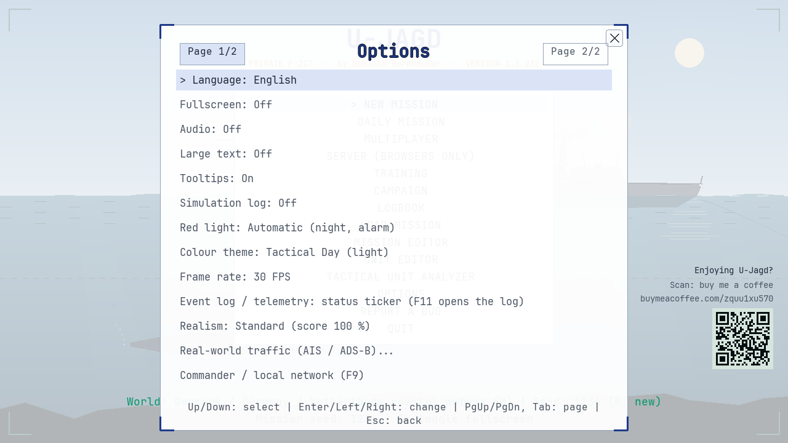

*Options (F10)*

### Page 1: screen, sound and realism

| Row | Choices |
|---|---|
| Language | English, German |
| Fullscreen | on, off (also `Alt+Enter`) |
| Audio | on, off |
| Large text | on, off |
| Tooltips | on, off: explanations under the mouse; a click pins one |
| Simulation log | on, off: enables the `F4` view (chapter Tools) |
| Red light | Automatic (night, alarm), Always on, Off |
| Colour theme | Tactical Night, Tactical Day, High contrast / colour-blind |
| Frame rate | 30 FPS (default, saves CPU on the uConsole) or 60 FPS |
| Event log / telemetry | status ticker (default, more room for the station; `F11` opens the log) or docked band |
| Realism | Beginner, Standard, Realistic (below) |
| Real-world traffic | opens the AIS / ADS-B page (below) |
| Commander / local network (F9) | opens the Remote Crew page (chapter Remote Crew) |

- **Red light:** **Automatic** (default) turns the screens to dimmed red at night and on a torpedo, missile or fire alarm, **Always on** or **Off**. The browser has the same switch in its settings. The station tabs show an alarm lamp: amber steady for a warning (flooding, a ping, a degraded engine), red blinking for danger (torpedo, missile, fire).
- **Colour theme:** **Tactical Night** (default: dark surfaces, phosphor green, amber and red), **Tactical Day** (light glare-free greys with navy and dark text for daylight; waterfall, LOFAR and DEMON then draw dark traces on a light ground like a chart recorder) or **High contrast** (colour-blind friendly). The switch at the right of the top bar flips between dark and light with a click, on both sides. While the red light is on, the uConsole draws dark. The choice lives in `settings.json`, never in a save, and only changes the picture. The browser has its own switch.

#### Realism level

The realism level applies to the next mission:

- **Beginner:** operator assistance on (automatic line labels, blade-rate and catalogue or emitter candidates); the computer opponent attacks less eagerly, waits for a better firing solution and, as the frigate, classifies and launches its helicopter 1.5 times slower. Score 75 %.
- **Standard** (default): raw data and manual analysis, the calibrated opponent. Score 100 %.
- **Realistic:** no assistance; the opponent attacks more eagerly, fires on a rougher solution and reacts 30 % faster as the frigate. Score 125 %.

The level only tunes the computer opponent, never a human on the other side, and a running mission keeps the level it started with (the row then says "from the next mission"). The end panel shows the level with its score factor; saves keep it.

#### Real-world traffic

The page **Real-world traffic** brings real ships (AIS Stream, needs your own API key) and real aircraft (OpenSky ADS-B, optionally with your OpenSky client ID) into a mission whose world is a real sea area. It needs an internet connection; without one the rows are greyed out. **API test** checks both services. Only traffic within about 150 NM of the frigate is placed (at most 15 ships and 5 aircraft, picked at random; a picked contact stays until it leaves the area), and ship positions are updated every 2 to 5 minutes. Changes apply at once and are saved.

### Page 2: game setup

**uConsole plays:** which side the uConsole plays, frigate (default) or hostile submarine; only in the main menu, never saved. A new game asks for it first anyway. See chapter Submarine.

**Graphics level** (`Enter`/`Right` next, `Left` back): **Economy** uses plain pixel scaling, drops the radar afterglow and calms the menu backdrop to save CPU on the uConsole; **Normal** (the uConsole default) shows every effect; **Full** (the Windows default) also smooths bearing lines, coast and plot. In a window or full screen larger than 1280 x 720, Normal and Full scale the picture sharply: whole factors repeat pixels exactly, and other sizes (such as 1920 x 1080) first repeat pixels to the next whole factor and then smooth down, so text and thin lines stay even. The level changes only the picture, never the simulation or what a station shows.

**Spoken crew reports** (off by default): the crew says torpedo in the water, new contact with bearing, breaking-up noises, torpedo away, hit, action stations, patrol aircraft on station and the mission result aloud, bearings digit by digit. The uConsole speaks through an installed `espeak-ng` (`sudo apt install espeak-ng`) and stays silent without it; Remote Crew browsers have their own switch under Settings (the browser's speech synthesis, in the browser's language). With the uConsole on the submarine the submarine's crew reports instead (see chapter Submarine).

**Microphone** (off by default) lets the players' voices count for noise discipline (below). **Language model** opens the settings of the optional language model (chapter Language model).

### Noise discipline and microphone

- Now and then a crew drops a tool, slams a hatch, knocks a pot or rattles a chain: a short metallic bang for 3 s that raises the own noise. A fresh crew fumbles about twice an hour, a tired or demoralised one up to five times as often. Silent running (the frigate's quiet mode, the submarine's silent running or lying on the bottom) cuts it to 30 %, but repairs and reloading then go at 75 % speed.
- Within 4 NM the enemy hears such a bang on its bearing (less through its own machinery noise): the frigate's sonar reports a metallic transient, the submarine's sonar room a transient. The own crew reports its fumble under silent running.

**Microphone:** the players' voices count too. On the uConsole it is the option *Microphone* (off by default); in the browser the button *Microphone on* next to the sound button (asks for the microphone). Browsers hand the microphone only to a secure page: on the plain LAN page (`http://`) a box says so, and *Open HTTPS page* frees your stations and opens the host's HTTPS address (port + 1), where you accept the certificate warning once and pair again with the same code.

When the microphone does not work, the game says why: a status message in the mission and the cause on Options page 2 (no microphone, cannot be opened, or no sound because Windows or macOS blocks the access; there allow microphone access for desktop apps or for U-Jagd). The browser names a refused, missing or busy microphone in the same box.

A meter of 20 cells shows the own level against the thresholds: up to 5 quiet (green, unheard), 6 to 11 heard close by (yellow), from 12 heard far off (red, up to 2.5 NM at full volume). On the uConsole the meter sits right of the status line, behind a microphone sign; unlit cells are dimmed. The cell with the small mark below it is the crew's loudest voice. A voice above the threshold raises the own noise by up to 20 %; the enemy hears voices, and the own crew is told to keep it down when it is far too loud. Only the level number leaves the browser, never sound; it counts for 1.5 s and is never saved.

## 1 Bridge

### Purpose

The Bridge conns the frigate: course, speed and position relative to coast, contacts and threats. Every sensor depends on how the ship is driven. Fast and straight is loud and blind; slow, steady legs with deliberate turns make sonar and TMA work.

### Pages

The chart fills the left of the station on every page; `1` again or `PgUp`/`PgDn` turn the panel beside it:

| Page | Panel beside the chart |
|---|---|
| 1 Navigation | Threat line, course and rudder panel with the heading dial, speed and acoustics panel with the speed dial |
| 2 Mission & systems | Mission name, objective and time left; sensors, weapon stocks, helicopter state and weather |
| 3 Lookout | Lookout scope with the sightings, horizon strip and lookout reports |

### Displays and instruments

The top bar shows the station, the mission, the clock, speed and course; the chart header shows only its scale (plus "follow" while `K` follows own ship). The chart water darkens with the clock in three steps (day, dusk within an hour of 05:30 and 19:30, night), and rain or a storm hatches the chart with dashed diagonals (a storm adds an amber border); both are display only, as on the browser chart. Options page 2 can anti-alias the chart and plot lines.

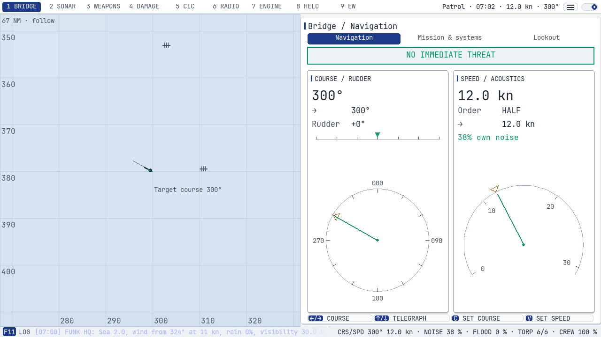

*Bridge, page 1 (navigation) on the uConsole*

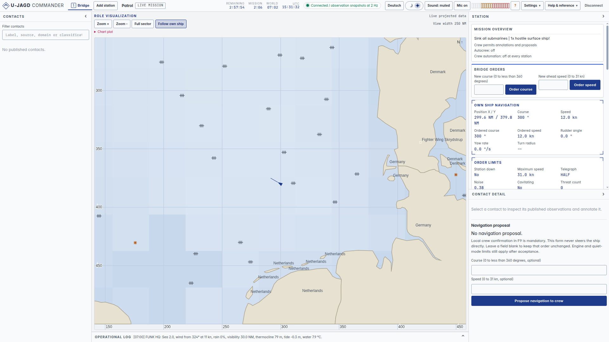

*Bridge in the Remote Crew browser*

```text
+---------------------------+----------------------+
|                           | COURSE / RUDDER      |
|   CHART (north up)        |  course 045 > 080    |
|   own ship + wake         |  rudder 15 R         |
|   published tracks        +----------------------+
|   bearing lines / fixes   | SPEED / ACOUSTICS    |
|   helicopter, buoys       |  HALF 10.0 kn        |
|                           |  38% own noise       |
|                           +----------------------+
|                           | TACTICAL PICTURE     |
|                           |  threats, sensors,   |
|                           |  assets, weather     |
+---------------------------+----------------------+
 footer: <- -> course | Up/Down telegraph | U/V direct
```

- **Course / rudder:** current course, ordered course (`→`), rudder angle in whole degrees and, only while turning, the turn radius. Below the numbers a rudder scale shows the angle from port (left) to starboard (right), and a compass dial shows the heading needle with the ordered course as a hollow amber mark.
- **Speed / acoustics:** telegraph order, speed, own noise in percent and a CAVITATION warning above 15 kn. A speed dial from 0 to 31 kn shows the present speed as a needle and the ordered speed as a hollow amber mark.
- **Tactical picture:** observed threats (a heard torpedo launch transient, HF seeker pulses or a submarine flooding a torpedo tube, a contact sonar classified as torpedo, or an air track flagged as a possible missile), sensor state (radar, TAS), assets (helicopter, buoys) and weather/day-night. Beside the weather lines a small picture in the start screen's look looks into the wind: the sky of the hour with sun, moon or stars, the clouds, rain, snow or fog and the sea running at the eye, with a wind rose (north up, the arrow blowing downwind) in its corner; the Remote Crew bridge shows the same picture.
- **Chart:** real coastline of the sea area (Natural Earth 1:10m, detailed down to about 0.05 NM) with synthetic chart depth, own ship, tracks published by the other stations. `Q`/`E` zoom in fixed steps (chart height 500, 250, 100, 50, 25, 10, 5, 2, 1 and 0.5 NM), the wheel zooms smoothly down to 0.5 NM. The grid shows meridians and parallels in degrees and minutes and gets finer as you zoom in (5° down to 0.1'); top left, below the scale, stands own position (`54°21.4'N 010°08.2'E`), and the pointer's tooltip gives the position under it. Only the stylized fixed chart has no real place and keeps the NM grid. Ranges, rings and the scale stay in NM. Drag pans, `K` follows own ship.

### Bridge lookout reports

The bridge lookout (eye height 18 m, 7x50 binoculars) reports sightings in the event feed as `AUSG` lines, for example `Bridge lookout: frigate (Admiral-Gorshkov-Fregatte) bearing 040°, 3.8 NM`. The Remote Crew bridge lists the same reports under "Lookout reports". Bridge page 3 (the lookout scope) shows the sightings north up around the own ship at the range and bearing the lookout measured, coloured by kind (surface, submarine, aircraft, torpedo) and labelled with what he made out, next to visibility, sea state, day/night and the latest reports; `,` and `.` change the scope radius (2 to 30 NM).

Above the reports a horizon strip shows the binoculars toward the bow (90° field, true-bearing scale, the horizon moving with the sea, the light of the hour) with the outlines of the lookout's sightings at their measured bearing and range; it is the same renderer as the submarine's periscope. The picture has the start screen's look: by day a blue sky, at dusk a warm horizon, at night stars and the moon in its phase at its bearing with its glitter on the water; clouds, rain, snow and fog follow the weather station, and the silhouettes are drawn in steel with a lit rim, with lit windows at night. Once the lookout has made out the class of a ship, submarine or aircraft, it is drawn as its 3D model (the analyser's), turned by the angle on the bow he judges in 10° steps, as soon as it is at least 16 pixels long; before that, when stale or smaller it stays a flat silhouette. The model is the real type the eye sees (every ship, submarine and aircraft type has its own model, see chapter Mission and unit editor), so the type can be told by sight; the lookout's report names only what he made out, and only the report goes to the OPZ. Every outline stands at the bearing the lookout measured, and a ship floats with her waterline as far below the horizon line as his eye 18 m up sees the water at the range he measured: about 1° below at 0.5 NM, 0.4° at 1 NM, on the line from about 9 NM (the curve of the Earth); a nearer ship stands in front of a farther one. The angle on the bow shows which way she lies: her starboard side with the bow to the right, her port side with the bow to the left, bow on when she heads at you.

From dusk to dawn and in visibility under 2 NM neutral merchant ships and fishing vessels run their navigation lights (warships run darkened): white masthead lights over the forward 225° (two from 50 m length, the aft one higher, 6 NM), the green starboard or red port side light (3 NM), both when she heads straight at you, and the white stern light over the 135° astern (3 NM; under 50 m length one masthead light at 5 NM and the others at 2 NM), never beyond the visibility. Vessels at work add their all-round lights: a trawler green over white (a masthead light only from 50 m), a pilot vessel white over red instead of masthead lights, a survey ship, cable layer or research ship restricted in her ability to manoeuvre red, white, red, and a mine clearance vessel three green; a tug without a tow shows ordinary lights. Civil aircraft show the red left and green right wingtip light and the white tail light (3 NM) and their flashing red anti-collision beacons and white strobes (10 NM); military aircraft fly dark; the silhouette then points its bow the way the lights show, and a lit ship is sighted by its lights even where the dark hull is not (its class still needs the silhouette). The lookout calls out the lights he sees with his reading of them, for example `Bridge lookout: lights bearing 040°, 2.8 NM: two masthead lights, red side light; showing her port side`: both side lights mean she is heading for us (called aloud), green alone her starboard side, red alone her port side, the stern light alone that she is going away, and the all-round lights her work (fishing, pilot on duty, restricted in ability to manoeuvre, clearing mines; flashing lights an aircraft). He calls a contact's lights again only when what they tell changes, at most every 2 minutes; the Remote Crew bridge lists these calls with the other reports.

Aircraft stand at their true elevation above the horizon, worked out from their height and range less the curve of the Earth, and hang in the still sky behind the clouds instead of riding the swell; an aircraft high and close is above the field until the binoculars are tilted up. An aircraft less than 1° above the horizon (hovering low, close aboard) stands on the moving horizon in front of the sea instead.

The own helicopter is in every one of these pictures (strip, binoculars, the Remote Crew card, the phone lookout and the hit picture) whenever the bridge can see it: the helicopter model at its true position, its own heading and length (15.2 m), about 60 m up in transit, 30 m on a MAD run and 15 m over its dipping sonar; on launch it starts from the flight deck astern and climbs away within 0.3 NM, and at night its position lights show. It needs the same visibility as any aircraft, is never reported or sent to the OPZ, and is not seen in the hangar. The lookout scope marks it as "own helicopter" at its position, the panorama with a short green tick at the top, and the list under the binoculars names it first. The Remote Crew bridge shows the same binoculars as a card ("Lookout binoculars"), trained in that browser only with the arrow buttons (2°, 10°) and "Bow".

`B` raises the binoculars large over the chart: a 16° field the operator trains with `←` and `→` instead of the rudder, as the submarine's periscope (`Shift`: 20° steps), or by clicking the all-round panorama below it, which marks every sighting at its measured bearing with the bow in the middle; the sightings are listed underneath, nearest the line of sight first. The charted coast stands on the horizon of the strip and the binoculars as far as the lookout can see land (at most 20 NM, fading into the haze), and the panorama marks it along its foot; the chart has no elevation, so the hills are an assumed 25 to 70 m. While the binoculars are up, `↑`/`↓` tilt them 2° (`Shift`: 10°, from 20° down to 45° up) instead of working the telegraph, `Q`/`E` zoom them (16°, 8° or 4° field) and `Space` switches the stabilizer, which takes out all but an eighth of the ship's motion; the line under the picture shows tilt and field, and the Remote Crew card has the same buttons for its own browser. The sea follows the wind: looking into it the crests come at you in long rows, looking down-sea their backs run away, across it short crests run sideways, and the ship pitches in a head or following sea and rolls in a beam sea. The waves fill the whole sea in perspective, small and close together out to a clean horizon, longer and higher toward the eye, and every row moves with the swell. The ship's own way shows in the water: underway the rows stream toward the eye looking ahead, away from it looking astern and from bow to stern looking abeam, faster with more speed; astern the wake runs as a band of smoother, lighter water with foam between the two arms of the Kelvin wave out toward the horizon, and ahead the bow wave throws its spray up into the lower edge of the picture (tilt the binoculars down to see the white water curl out from the stem). `B` again returns to the chart; the binoculars are display only and are not saved.

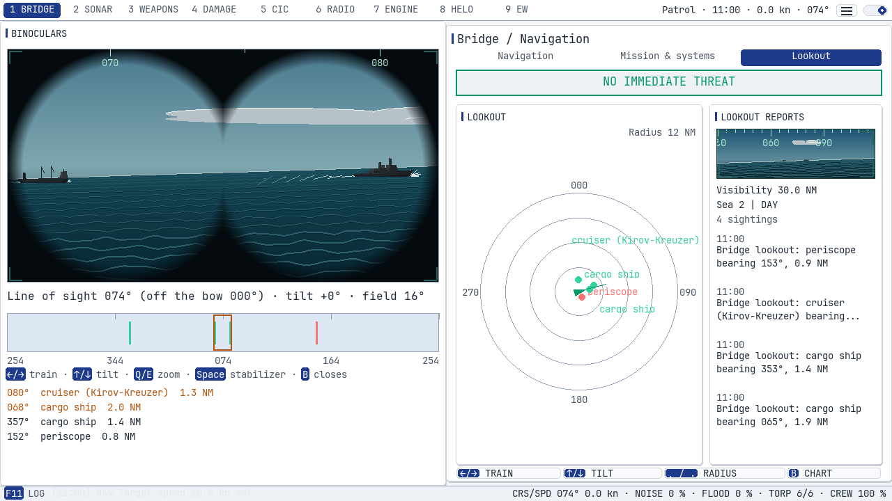

*Binoculars (B) by day*

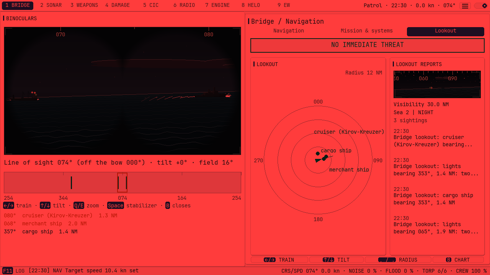

*Binoculars at night with navigation lights*

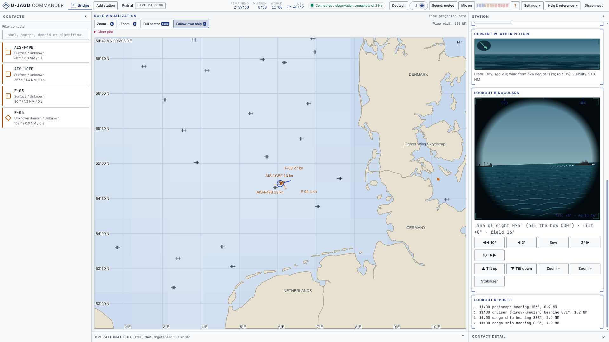

*Lookout binoculars in the Remote Crew browser*

A contact is reported in up to three steps as it closes, each step once:

- **Sighted:** only the kind of object is clear (vessel, aircraft, small object on the surface).
- **Class:** the silhouette shows the class, for example merchant ship, warship, aircraft carrier, fishing vessel, speedboat, surfaced submarine, airliner or military aircraft.
- **Type:** close in the lookout names the type: cargo ship, tanker, passenger ship, tug, frigate, destroyer, corvette or combat aircraft; warships and military aircraft also with their class name. Merchant ships and airliners are identified by name, AIS or transponder, not by eye, so the lookout never reports their name or airliner type.

Class and type need a finer resolved silhouette than the sighting (Johnson criteria): by clear day a tanker is classed at about 7 NM and a frigate identified at about 4 NM, a speedboat is classed only inside 3 NM, and at night the type is made out only within a few cables. Fog, rain and sea state shorten every step. The lookout also calls "land in sight" with the bearing of the nearest coast, and a torpedo wake with a banner.

A raised periscope or snorkel head of a dived submarine pulls a feather that grows with speed: on a clear, calm day he sees the full plume from 8 kn at almost 3 NM, at 3 kn at about 1.7 NM and a still head only at about 1 NM; sea state and haze shorten that, and at night he sees hardly anything. Sighted, he calls a "feather on the water"; at about half that range he recognizes the periscope (with a banner, into the OPZ as a submarine). The helicopter and patrol aircraft crews have the same eye (see there).

The class is held while the lookout keeps the contact. It appears in the chart and OPZ tooltips as "Lookout: ..." and is an observation only: it never sets the OPZ classification or the affiliation.

### Autopilot route

The helm can follow a route of up to 8 waypoints. On the navigation page a right click on the chart adds a waypoint; `W` starts a search pattern from the ship's position and course (first a zigzag of 3 NM legs 45° either side of the course, pressed again an expanding square of 1, 1, 2, 2, 3, 3, 4, 4 NM legs turning right, a third time the route is cleared), and `Backspace` clears it.

The chart draws the route as an amber line with numbered waypoints and the Course panel shows the next one with its distance. The autopilot sets only the ordered course; speed stays with the telegraph. A waypoint counts as reached within 0.3 NM, then the helm steers for the next one; after the last one the ship holds its course. Any helm order (`←`/`→`, `C`, the trackball or a course from Remote Crew) takes over and switches the route off; with the Bridge out of action no route can be set and an active one is not steered.

The autopilot plans on the chart: charted depth and charted rocks and wrecks against the hull's minimum depth (draft plus keel reserve) and another 2 m margin, sampled every 0.1 NM along each leg and 0.1 NM either side. A new waypoint or a search pattern whose leg crosses shoal water or land gets detour points: first a stand-off point square to the leg beside the first shoal point (nearest first, port before starboard); when that does not clear it, a path search on the chart (a grid of at most 96 cells a side over a box 4, then 30, then 80 NM around the leg, straightened into as few turning points as the clear legs allow) finds the way through a channel or round a bay or a long coast. The route may then hold up to 16 points; when no way is found the feed warns which leg to steer by hand.

While the route runs the autopilot looks ahead on the leg (two minutes at the present speed, at least 0.5 NM) once a second: shoal water there gets a detour to the current waypoint, or the route is switched off and the ship turned back on the reciprocal course. It plans on the chart, not the live tide. The route is saved.

The Remote Crew bridge has an "Autopilot route" card: "Set waypoints on chart" makes a click on open chart add a waypoint, and buttons start the zigzag or the expanding square or clear the route.

### Keys

| Key | Action |
|---|---|
| `<- / ->` | Rudder: change target course |
| `Up / Down` | Telegraph up / down |
| `C` | Enter target course directly (000-359) |
| `V` | Enter target speed directly (0-31 kn) |
| `+ / -` | Telegraph: engine order (ASTERN-STOP-SLOW-HALF-FULL-FLANK) |
| `Chart` | Mouse wheel: zoom, mouse drag: pan |
| `Q / E` | Zoom chart in steps, 500 to 0.5 NM |
| `K` | Camera follow on/off |
| `, / .` | Lookout page: scope radius smaller / larger |
| `B` | Lookout page: binoculars over the chart on/off |
| `↑/↓ · ←/→ · Q/E · Space` | Binoculars up (as the periscope): ↑/↓ tilt 2° (Shift: 10°) instead of the telegraph, ←/→ train 5° (Shift: 20°) instead of the rudder, Q/E zoom (16°, 8°, 4° field), Space stabilizer |
| `G` | Action stations on/off |
| `W` | Autopilot: zigzag search, expanding square, off |
| `Right click` | Add an autopilot waypoint on the chart |
| `Backspace` | Clear the autopilot route |
| `Ctrl+B` | Clear baffles: 60° to starboard for two minutes, then back (the hull sonar is deaf 30° either side of the stern) |

The trackball steers the rudder while the Bridge is selected. `C` (course) and `V` (speed) open direct numeric entry, as `C`/`V`/`D` on the submarine; the simulation keeps running while you type. `Enter` confirms, `Esc` cancels.

### Mouse

Every key in the key bar at the foot of the station can be clicked; holding the button holds the key. Lamps, page tabs and key hints in the text are clickable too (chapter Tools, Mouse). In addition:

- A click on the heading dial orders that course, a click on the speed dial that speed (page 1).
- Holding a rudder or telegraph key in the key bar holds the rudder or steps the telegraph.
- A right click on the chart adds an autopilot waypoint (page 1).
- On the lookout page a click on the all-round panorama trains the binoculars onto that bearing.
- On the chart the wheel zooms, dragging pans (it ends `K` follow) and a click pins a tooltip.

### Standard procedure

1. Check mission page (1 twice): objective, time limit, area.
2. Transit at FULL, then slow to SLOW or 4-6 kn before the search area.
3. Search: steady legs of 3-5 min, then turn 30-60 degrees so TMA gains range.
4. Keep clear of the coast and shallow water; watch the chart depth.
5. Torpedo inbound: 24 kn (Nixie cable parts above 25), turn away beam-on, order Nixie at Weapons.

Combat situation:

1. Torpedo reported: speed up to 24 kn at once (not FLANK: the Nixie's tow cable parts above 25 kn), turn to put the torpedo bearing astern or on the beam.
2. Order the Nixie at Weapons (`V`); keep turning so the torpedo sees the decoy first.
3. Once clear, reduce speed below 15 kn so sonar can reacquire; never above 20 kn with the towed array out.

### Pro tips

- TMA needs a real change of own velocity. A 30-60 degree turn followed by a steady leg of several minutes gives the best range estimate. Turning on the spot does not help.
- The turn rate grows with speed (about 0.75 deg/s at 10 kn, 1.2 at 16 kn, 1.9 at 25 kn, 2.3 at 31 kn), so the turning circle stays near 0.4 NM. A stopped ship cannot turn. Speed changes take minutes: about 90 s to 90 % of FULL, and a stop from FULL uses reverse propeller pitch and takes about 90 s. Start evasive turns early.
- In a hard turn at speed the ship heels outward a few degrees; in heavy seas the fin stabilizers damp the roll, but only with steerage way.
- In shallow water the hull squats: at 25 kn the draft grows by up to 3 m, at 31 kn by up to 4.6 m, when the water is less than about five draughts deep. Slow down in shoal water.
- Sprint-and-drift: sprint at FULL to a new position, then slow to 4-6 kn and listen.
- Heavy flooding on one side gives a list and a steady yaw pull; correct with rudder.
- The ship cannot run aground onto land; it is pushed back, but shallow water limits the helicopter dipping depth (10 m bottom clearance).
- Water depth follows the tide (semi-diurnal, about 12.4 h, up to a few metres in shallow water). A passage that is safe at high water can ground the hull at low water; the HQ weather bulletin reports the current tide at the ship.
- Wind pushes the surface water: about 3 % of the wind speed, 20 degrees to the right of downwind, on top of the steady ocean current.

### Not modelled

- No time acceleration and no pause. The autopilot steers only course, never speed; its detours use only the chart (no live tide, no other ships); its path search sees the chart in cells of at least 0.2 NM, so a channel narrower than about half a mile, or a way round farther than 80 NM from the leg, is not found.
- No automatic torpedo identification: the alarm rests only on heard intercepts or the sonar operator's classification; a torpedo running silent outside seeker range can arrive unannounced. The lookout calls out only a visible wake.
- The lookout never reads a ship's name or flag and does not report day shapes; he reads lights only as listed above, never a course or speed from them. No ship in the game anchors, tows, trawls at trawling speed or is not under command, so anchor lights, towing lights and the not-under-command lights never show.

## 2 Sonar

### Purpose

The sonar room is the main ASW sensor. It listens passively on the hull-mounted sonar (HMS), the towed array (TAS) and the variable-depth sonar (VDS), analyses signatures on LOFAR and DEMON, estimates target motion with TMA, measures the sound profile and, when ordered, transmits an active ping. It classifies contacts and releases them to Operations and Weapons.

### Pages

The station has six pages. `PgUp`/`PgDn` (or `2` again) cycles them.

| Page | Shows | Use it for |
|---|---|---|
| BROADBAND | Bearing-time waterfall | Detecting contacts and following their bearing |
| LOFAR | Frequency-time waterfall, 0-300 Hz | Tonal lines: machinery, shaft, blade signatures |
| DEMON | Modulation spectrum of the listening beam | Blade rate and shaft-rate hypotheses |
| TMA | Solution for the focused contact | Range, course and speed estimates |
| UMWELT / FUSION | Sound profile, layer, CZ, array comparison | Choosing TAS depth, spotting ghost contacts |
| ACTIVE | Stored echoes with age and error | Range and depth from pings |

### Displays and instruments

The listening post on the right shows the evidence source and age, the array, the listening bearing and the ping readiness; a towed or variable-depth array that is moving or not yet ready appears on every page in amber with payout, stability and PAUSE when handling is outside its limits. The single key row at the bottom shows the page's four main keys with their values; every other key is listed under F1. On BROADBAND the amber line is the listening bearing and the grey lines the beam limits; dark means quiet, turquoise loud.

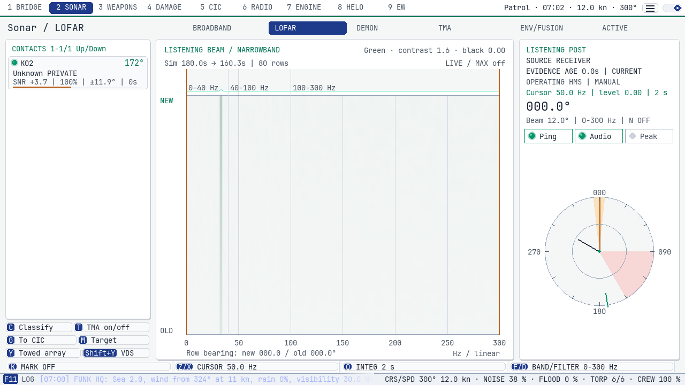

*Sonar on the uConsole*

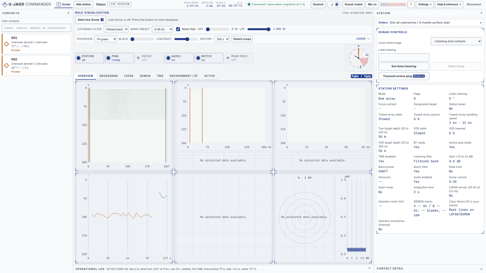

*Sonar in the Remote Crew browser*

The station has three columns: contact cards on the left, the page's display in the middle, the detail rows and listening console on the right. The listening console below the detail rows works like a control desk: lamps show ping ready (amber while a ping is out), audio and peak hold, and a north-up bearing rose shows the listening beam (amber), the baffles astern (red sector), own course and every published contact bearing. Each contact card shows a lamp, the bearing, the classification and a signal-to-noise bar; a click selects it.

Mouse: the key chips under the cards act on the selected contact like their keys: `C` classify, `T` TMA, `G` release to the CIC, `M` target, and `Y`/`Shift+Y` stream or recover the towed array and the VDS (on the submarine only `C`, `T` and `M`). The Remote Crew browser shows the same rose beside its waterfalls.

#### BROADBAND waterfall

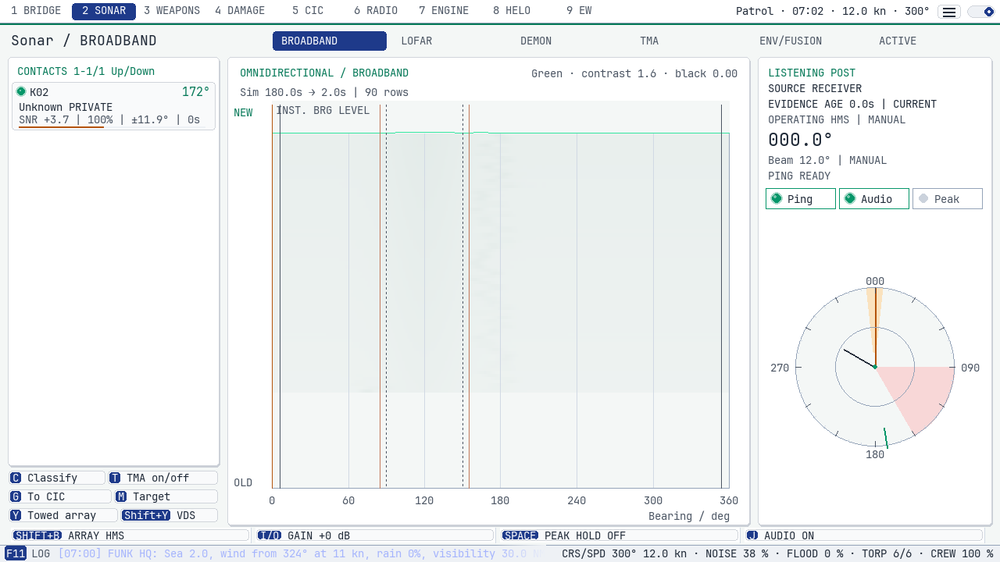

*BROADBAND waterfall*

```text
 bearing  000      090      180      270      359
 now    |   .   #     .        :          .    |
        |   .   #    .         :         .     |
        |   .    #   .          :        .     |
 older  |   .    #  .           :       .      |
        +--------------------------------------+
            ^    ^              ^
            |    moving contact own baffle noise (soft lobe astern)
            steady weak contact
```

Newest data is at the top. A straight vertical trace is a contact on a steady bearing; a slanting trace shows bearing rate. The history covers 20 s of fine data plus 4 minutes of long history (`Shift+H` selects 25/50/100 %). Brightness is relative received level, not range.

#### LOFAR

The x axis is frequency (0-300 Hz), time runs downwards. Bins are 1 Hz below 40 Hz, 2 Hz up to 100 Hz and 5 Hz above. A new line is added every 0.25 s; 80 lines are kept.


*LOFAR page*

- Steady vertical lines are **tonals** (narrowband): generators, pumps, shaft lines. Several lines at integer multiples of one frequency are a harmonic family: put the white cursor on a line with `Z`/`X` (`Shift`: 10 Hz steps) and press `K` to mark it as fundamental; amber guides then show 2f, 3f and so on. `K` on the same frequency clears it.
- Own ship produces a blade-rate line at shaft RPM / 60 x 5 propeller blades: about 3.9 Hz at 8 kn, 9.7 Hz at 20 kn and 15 Hz at 31 kn. `N` notches it out (±5 Hz).
- `Space` holds peaks so faint tonals stand out.
- The spectrum strip above the waterfall prints the frequency over every prominent line (interpolated between bins; with `Space` the held envelope). Where values would overlap, the stronger line keeps its label. The Remote Crew browser labels its spectra the same way.
- `F` selects the analysed band: FULL 0-300, LOW 4-80, SHAFT 8-55, MID 20-120 Hz. `Ctrl+Z` / `Ctrl+X` set the low / high band edge at the cursor for any band-, low- or high-pass; `Shift+N` puts an extra notch on the cursor frequency.
- `Q` selects the integration time: 2 s (the receiver's own FFT), 8, 16 or 64 s. Longer integration averages successive spectra so a weak steady tonal rises out of the noise, but a moving line smears. `Shift+Q` opens the vernier: 20 Hz around the cursor at the native 0.5 Hz resolution.
- The detail rail reads the level at the cursor. The strip labels lines automatically only at the Beginner realism level (`F10`).

#### DEMON

DEMON demodulates the broadband noise envelope of the listening beam. Propeller cavitation is modulated at the **blade rate** = shaft rate x number of blades.

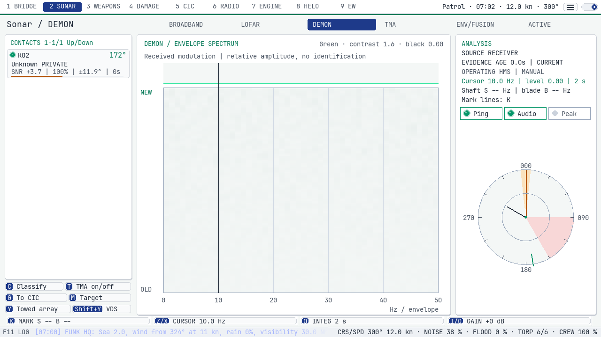

*DEMON page*

```text
 level
   |      |              blade rate 12.5 Hz
   |  |   |              -> 5 blades => shaft 2.5 Hz = 150 RPM
   |  |   |   |
   +--+---+---+------ Hz
     2.5 12.5 25
    shaft blade 2nd harmonic
```

The display shows measured modulation, not identity. After changing the bearing listen for at least a few seconds before judging. Count blades yourself: move the cursor (`Z`/`X`, 0.5 Hz) onto the shaft line and press `K`, then onto the blade line and press `K` again; the rail shows blades = blade rate / shaft rate (with the deviation from a whole number) and the shaft RPM. A third `K` clears both marks.

The **class library** under the marks lists the three catalogue classes that fit your marks best: shaft RPM against the class's RPM range, the blade count against its blade counts and your LOFAR fundamental (`K` on the LOFAR page) against its tonal band and machinery lines, each best in the middle of the range. With fewer than two marks it is only a hint. The contact analyser (`F8`) then lists the whole catalogue best fit first with the fit in percent. The library grades your marks, never the contact itself, and the classification stays your decision; the submarine's sonar room has the same library. At the Beginner realism level (`F10`) the sonar also labels modulation lines, proposes RPM for 3-7 blades and ranks catalogue candidates.

#### TMA, environment and active

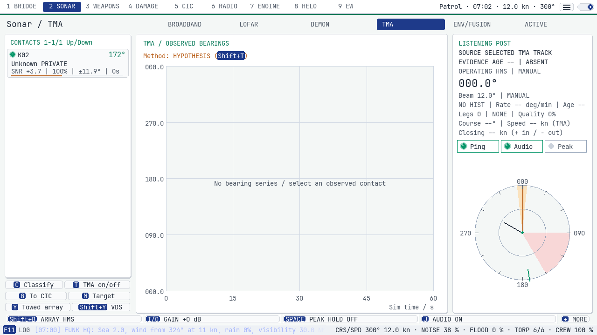

*TMA page*

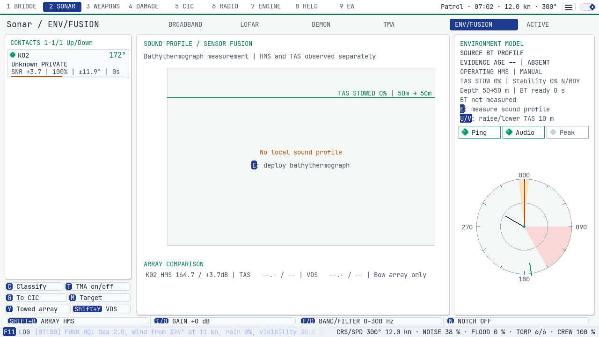

*Environment page with sensor fusion*

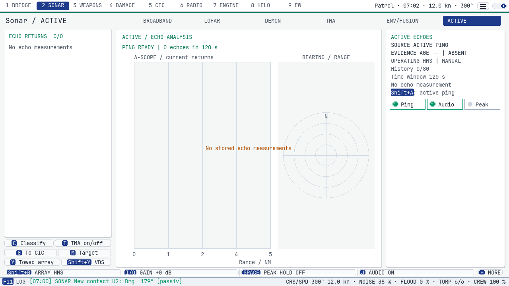

*Active sonar page*

- **TMA** is yours. The page plots the bearings of the selected contact over time. Build a hypothesis: `Z`/`X` course (`Shift`: 1 degree), `Ctrl+Z`/`Ctrl+X` speed, `Q`/`Shift+Q` range on the newest bearing (`Ctrl`: 0.2 NM). The amber curve shows the bearings that hypothesis predicts, the dots at the foot the residuals (measured minus predicted). Good hypotheses leave residuals scattered around zero; a wrong course, speed or range leaves a trend. The rail shows the residual RMS, the systematic trend after averaging, the fit and the observability. Range is only observable after an own course change (at least 6 degrees, better 30-60): without one, `K` refuses. `K` accepts the hypothesis as the contact's TMA fix; it is dead-reckoned on its course and speed and ages out after 120 s, so refine and re-accept as bearings come in. Noisy bearings give a large range uncertainty even when the fit is good. TMA does not estimate depth. At the Beginner realism level (`F10`) an automatic solver proposal (it needs at least 4 bearings over 180 s) is drawn as a thin line and `Shift+K` copies it into the hypothesis. Sonobuoy bearings enter the track with the buoy as observer. `Shift+T` switches the TMA method: HYPOTHESIS (above), EKELUND (the range from the bearing rates of two own legs about one course change of 30 degrees or more, 90 s each; `Shift+K` copies it into the hypothesis, `K` then accepts as usual) or DOT STACK (residual rows at 0.6, 1.0 and 1.6 times the hypothesis range: the flat row is the range the bearings support).
- **UMWELT / FUSION** shows the bathythermograph (`E`, 60 s cooldown): measured layer depth, sound-speed profile and convergence-zone bands, plus the HMS/TAS comparison. Bearings within 5 degrees confirm each other; 9 degrees or more apart are flagged as a possible ghost contact. The layer is not fixed: afternoon sun makes it shallower (about 8 m), strong wind mixes it deeper over hours, and internal waves move it a few metres. Repeat the BT after a few hours or a weather change. The measured profile is the real temperature-driven sound speed (Mackenzie equation), so it drops below the layer. Point the mouse at the profile to read the exact depth, the sound speed there and whether that depth lies above or below the layer (uConsole and web). In the web client the plot also labels the layer, the seabed and the sound-speed minimum.
- **ACTIVE** lists echoes of the last 120 s: bearing, range and depth (+/-12 m). A ping fix ages out after 120 s. `W` selects the pulse: **CW** (1 s tone) gives coarse range (about 0.1-0.3 NM) but its Doppler separates a moving target from seabed reverberation; **LFM** (100 Hz sweep) measures range to a few metres, and its range cell 100 times smaller cuts the reverberation by 20 dB, so it also finds a slow or stationary target in shallow water; against noise in deep water both pulses reach equally far. The echo strength depends on the target's aspect (broadside about 15 dB stronger than bow-on) and size. Rocky ground reverberates far more than mud; charted wrecks return real echoes that no contact owns ("unassociated echo").
- **Hearing the echo:** every return is audible when it arrives, after its real two-way travel time (about 2.5 s per nautical mile of range), for the ship's sonar and the helicopter's dipping sonar alike. A CW echo is a soft tone on the carrier, an LFM echo a short sweep; the pulse is the one the ping was sent with. A strong echo stands out clearly, a faint one barely rises out of the reverberation hiss. In the Remote Crew browser the echo plays with the general sound (loud or faint). A submarine's active ping is heard the other way round, after its one-way travel time (about 1.2 s per nautical mile): only then does the frigate sound its low warning tone, play the ping itself and log it with the bearing measured by ear (whole degrees, about ±2° off); a ping never gives its range. **Directional hearing:** with stereo sound (headphones), echoes, detonations and a submarine's ping come from the bearing they were heard on: left for port, right for starboard of the ship's head, centred dead ahead and astern (ahead and astern sound the same). The ship's own ping, launches and gunfire stay centred. The uConsole and the Remote Crew browser place them alike.

### Hull sonar, towed array and VDS

|  | HMS (hull) | TAS (towed) | VDS (variable depth) |
|---|---|---|---|
| Passive range | 1.0 x base | 1.4 x base, minus 3 % per knot | 1.15 x base |
| Beam width | 12 degrees | 6 degrees | 8 degrees |
| Bearing error | +/-6 degrees | +/-2 degrees, left/right ambiguous | +/-4 degrees, unambiguous |
| Self-noise | full | 35 % of hull | 60 % of hull |
| Ping range | 1.0 x | 0.8 x | 1.1 x, from the body's depth |
| Handling | always ready | stream 360 s, recover 480 s, only at 3-12 kn, 30 s settle | lower 120 s, recover 120 s, only at 3-15 kn and sea state 5 or less, 20 s settle |

- TAS depth 20-260 m (`U`/`V` in 10 m steps), limited to 260 m minus 4 m per knot of own speed. Speeding up lifts the array to that limit; the ordered depth stays and is reached again when the ship slows down. At 30 m or deeper and in the same layer as the target it gains another 25 %.
- Above 20 kn with any cable out the array suffers a permanent FAULT.
- The array heading lags the ship by about 45 s after a turn; its bearings are less reliable while it swings.
- **Baffles:** the hull array (HMS) is deaf 30° either side of the own stern, so a submarine right astern is heard only by the towed array or the VDS. The BROADBAND waterfall marks the baffle edges with dotted lines. Clear them from the Bridge with `Ctrl+B` (two minutes 60° to starboard, then back) or with any turn of your own. The same holds for the enemy: a submarine's hull sonar is deaf astern too, and an AI submarine that finds itself close in the frigate's baffles after a ping follows the frigate there instead of running.
- VDS (`Shift+Y` lowers or recovers it, `Shift+B` selects it): a body on a short cable, 20-300 m deep and limited to 300 m minus 8 m per knot. `U`/`V` move the depth of whichever array is selected. At 30 m or deeper in the target's layer it gains the same 25 % as the TAS. It is unambiguous, so a VDS bearing resolves the TAS side just like the hull sonar. Pinging on the VDS transmits from the body: below the layer the shadow-zone loss hits shallow targets instead of deep ones. Lowering and recovery pause outside 3-15 kn or above sea state 5; above 24 kn with the body out it is lost (FAULT).

```text
          HMS                          TAS
     noise lobe astern          noise lobe along cable
            ^                           ^
      \  ship  /                   ship ====== cable === array
       \  ||  /                             (lobe points to ship)
      ~~~~||~~~~  70 deg soft lobe
```

### Keys

| Key | Action |
|---|---|
| `Shift+A` | Transmit active ping (cooldown; reveals position!) |
| `Shift+B` | Switch receiver array: HMS, TAS, VDS |
| `Y` | Deploy / retrieve TAS (only at 3-12 kn) |
| `Shift+Y` | Lower / recover VDS (3-15 kn, sea state up to 5) |
| `Page Up / Down` | Broadband / LOFAR / DEMON / TMA / Environment / ACTIVE |
| `2` | Press 2 again to advance the sonar page |
| `E` | Bathythermograph: measure local sound profile |
| `W` | Active pulse CW / LFM |
| `U / V` | Raise / lower the selected array's target depth (TAS or VDS) by 10 m |
| `R` | Direct listening bearing: 000 to 359.9 degrees true |
| `<- / ->` | Bearing +/-0.5 degrees; Shift: 5, Ctrl: 0.1 |
| `Up / Down` | Select contact for TMA and classification |
| `Enter` | Follow measured contact bearing / hold manually |
| `J \| , / .` | Receiver audio on/off \| lower/raise volume |
| `A / B / H` | Direct broadband / filtered / heterodyne audition |
| `D` | Toggle broadband/filtered audition |
| `I / O` | Lower / raise gain (3 dB) |
| `Shift+I / Shift+O` | Lower / raise sonar display contrast |
| `Ctrl+I / Ctrl+O` | Lower / raise sonar display black level |
| `Shift+C` | Cycle green / amber / cyan phosphor palette |
| `Shift+H` | Cycle displayed history depth: 25 / 50 / 100 percent |
| `F` | Select frequency band: wide / low / medium |
| `N` | Notch filter against own propulsion |
| `K` | Mark line at cursor (LOFAR fundamental, DEMON shaft/blade) |
| `Z / X` | LOFAR/DEMON frequency cursor (Shift: 10 Hz) |
| `Ctrl+Z / Ctrl+X` | Band-pass low / high edge at the cursor |
| `Q` | Integration time 2 (FFT)/8/16/64 s |
| `Shift+Q` | LOFAR vernier: 20 Hz at native 0.5 Hz |
| `Shift+N` | Notch at the cursor frequency |
| `Shift+F` | DEMON carrier band 200-800 / 400-1400 / 1000-2000 Hz |
| `Ctrl+F` | Heterodyne shift 400/700/1000/1200 Hz |
| `X / Shift+X (BB)` | Broadband/fusion: TAS side of the selected contact flip / Shift: confirm |
| `Z / X (TMA)` | TMA page: hypothesis course -/+ 5 deg (Shift 1 deg) |
| `Ctrl+Z / Ctrl+X (TMA)` | TMA page: hypothesis speed -/+ 1 kn |
| `Q / Shift+Q (TMA)` | TMA page: hypothesis range -/+ 1 NM (Ctrl 0.2 NM) |
| `K / Shift+K (TMA)` | TMA page: accept hypothesis as fix / Shift: copy solver proposal (training) |
| `Shift+T (TMA)` | TMA method: hypothesis/residuals, Ekelund range, dot stack (Shift+K in Ekelund: copy its range) |
| `SPACE` | LOFAR peak hold on/off |
| `T` | TMA for selected contact on/off |
| `C` | Classify contact (submarine / warship / biological / vessel / aircraft / torpedo) |
| `G` | Release / withdraw selected contact to CIC independently of classification |
| `M` | Set selected contact as target |

### Mouse

Every key in the key bar at the foot of the station can be clicked; holding the button holds the key. Lamps, page tabs and key hints in the text are clickable too (chapter Tools, Mouse). In addition:

- A click on a contact card selects the contact (on the ACTIVE page an echo row selects that echo).
- The key chips under the cards act on the selected contact: `C` classify, `T` TMA, `G` release to the CIC, `M` target, `Y`/`Shift+Y` stream or recover the towed array and the VDS.
- A click on the BROADBAND waterfall steers the listening bearing there, or onto a contact within half a beam width of the click.
- A click on a page tab opens that page.

### Standard procedure

1. Go slow (4-8 kn) and select HMS; stream the TAS at 3-12 kn (Y) and lower the VDS below the layer at 3-15 kn (Shift+Y).
2. Search BROADBAND for bearing traces; confirm tonals on LOFAR (N notch).
3. Select the contact (Up/Down), lock focus (Enter), check DEMON.
4. Classify (C); after a course change fit a TMA hypothesis (page TMA: Z/X, Ctrl+Z/X, Q) and accept it (K).
5. Need depth or exact range: ping (Shift+A), then release (G) and mark target (M).

Combat situation:

1. A tube-flooding transient warns that a shot may follow: turn the bow sonar and towed array onto its bearing and get the countermeasures ready. A launch transient, high-frequency sonar pulses, or a new loud broadband contact without tonals and with fast bearing drift may be a torpedo. Classify it as Torpedo (`C`) and report the bearing to the Bridge immediately.
2. Keep focus on the hostile submarine so the torpedo wire datum stays fresh.
3. Ping only when you need depth for the shot or the contact is about to be lost: the submarine hears a ping out to 60 NM and starts evading.

### Pro tips

- Gain (`I`/`O`) changes display and audio only, not detection. Black level (`Ctrl+I`/`Ctrl+O`) and contrast (`Shift+I`/`Shift+O`) help faint traces stand out; `Shift+C` changes the phosphor colour.
- `D` or `A`/`B`/`H` choose broadband, filtered or heterodyne audition. Heterodyne shifts the low band up to about 700 Hz so low tonals become audible.
- The listening audio runs about one and a half seconds behind the display (Remote Crew browsers about two seconds) so a busy moment never interrupts it. After steering the listening bearing the old beam fades into the new one after that delay; the stream is not cut.
- Put the TAS below the measured layer to hear deep targets; keep the HMS for shallow ones. Both arrays run in parallel.
- The TMA page shows the closing rate derived from the accepted solution: positive means the target is closing.
- If the TAS and HMS disagree by 9 degrees or more, treat the contact as a possible ghost (the display flags it) and turn to resolve it.
- The towed array is a line: it cannot tell a bearing from its mirror about the cable. A contact heard only on the TAS is marked "TAS left/right ambiguous" with its mirror bearing and does not feed TMA; the display shows the side you choose (starboard by default). Turn 20 degrees and watch both traces: the true one stays continuous, the ghost jumps (the status then reads "turn made - compare traces"). On the broadband or fusion page `X` shows the other side and `Shift+X` confirms the shown side; nothing is resolved for you. A wrongly confirmed side stays mirrored (the TMA residuals will show it; `X` reopens the choice). A hull-sonar bearing resolves the side by measurement. Bearings toward the cable ends (endfire) are also less accurate than broadside.
- `Shift+F` selects the DEMON carrier band (200-800, 400-1400 or 1000-2000 Hz): search the band where the cavitation noise is strongest. `Ctrl+F` sets the heterodyne shift (400/700/1000/1200 Hz) for listening to low tonals.
- In the contact analyser (`F8`) with a contact selected, `Enter` assigns the browsed catalog profile to that contact and `Shift+Enter` clears it. The assignment is your annotation: it is shown in the contact list and saved, and it never changes the contact's classification or weapon interlocks.
- A contact is lost 120 s after its last detection. Keep tracking weak contacts, or reacquire with a ping.
- Wrecks return real echoes without Doppler. A submarine lying still beside a charted wreck hides in that echo from a CW ping (750 m range cell); an LFM ping resolves about 8 m and can separate the submarine from the wreck. Suspect every wreck the enemy could have reached.
- The bathythermograph (`E`) measures to the seabed, at most 1500 m. Only after a measurement does the weather & sonar analysis (`0`) show the layer, the shadow zone below it and a SOFAR channel.
- The sonar never names a torpedo or a submarine. It reports what it hears: a mechanical launch transient (heard out to 35 NM), high-frequency seeker pulses (about 6 NM) or the short transient of a submarine flooding a torpedo tube and opening its outer door (a warning that a shot may follow: out to 8 NM, but slow, quiet flooding only within 1.5 NM; both shrink with own noise, sea state and sonar damage) as a bearing, held on the Bridge alarm for 60 s, and breaking-up noises when a hull sinks. The OPZ symbol of a sonar contact follows your classification only; an unclassified contact stays unknown.

### Not modelled

- `T` switches the solver behind the training aid; the automatic solver never writes a fix by itself.
- No selectable split-window normalisation (TPSW); use gain, black level and contrast instead.
- The baffles blind only passive listening; an active ping of the hull sonar still sweeps all round.

## 3 Weapons

### Purpose

Weapons control turns a sonar contact into a firing solution. It launches the frigate's wire-guided torpedoes and its own ASROC, drops depth charges, manages the helicopter's stores (buoys, lightweight torpedoes), streams the Nixie towed decoy and releases the AA gun.

### Pages

| Page | Shows |
|---|---|
| 1 Targeting | Chart with the selected contact, contact cards, engagement stages, fire-control solution with torpedo depth, engagement sketch, tube lamps and readiness line |
| 2 Ammunition | Tubes, reload timers, torpedo stock, Nixie, helicopter stores, torpedo setup line and the stores as tank columns |

### Displays and instruments

Page 1 (target) shows the chart with the selected contact; the panel has contact cards on the left (a click selects a contact as `←`/`→` would, `M` assigns it, the target has a red mark) above the engagement stages, and the fire-control solution with the torpedo depth, the engagement sketch, the tube lamps and the readiness line on the right. Page 2 (stores) lists tubes, reload timers, torpedo stock, Nixie state, helicopter stores and the torpedo setup line: selected type with its remaining stock, search pattern, seeker enable point and salvo size.

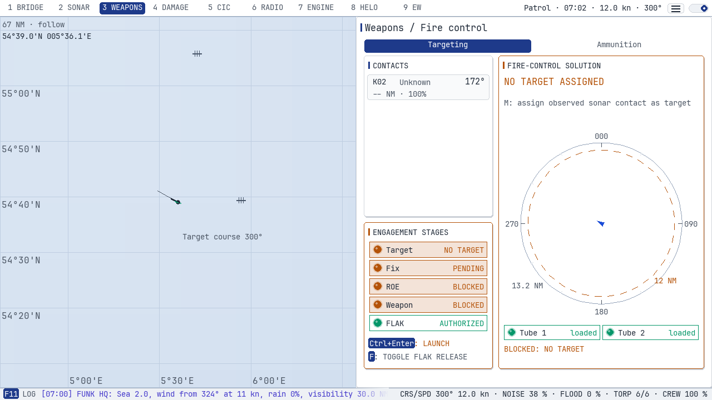

*Weapons on the uConsole*

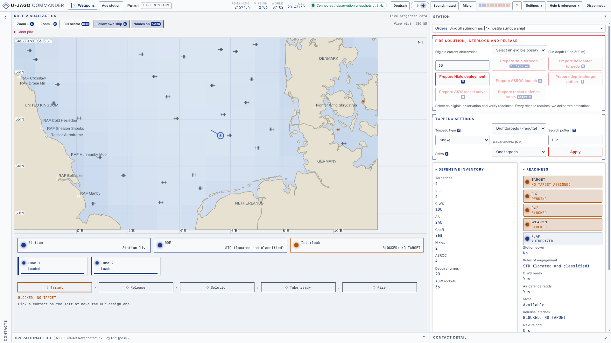

*Weapons in the Remote Crew browser*

The readiness line is checked top to bottom; the first failed check is shown:

```text
 BLOCKED: NO TARGET            select or take a contact (M)
 BLOCKED: AFFILIATION ...      operator marked it FRIEND/NEUTRAL
 BLOCKED: NO RANGE             ROE STD needs ping/TMA/buoy range
 BLOCKED: NOT CLASSIFIED       classify as submarine or warship (Sonar C)
 BLOCKED: NO TORPEDOES / NO TUBE READY / SALVO LIMIT
 BLOCKED: WEAPONS ROOM DAMAGED
 WEAPONS FREE                  -> Ctrl+Enter
```

Torpedo run, seen from above:

```text
 frigate ==wire==> . . . . . /\/\/\/\  ( datum )
                    mid-course      snake search   seeker on
                    to datum        +/-15 deg      inside 1.2 NM
                    (wire update                   -> homes on nearest
                     every 0.5 s)                     candidate
```

- Two torpedo types share the two tubes (60 s reload). Mk1: 45 kn, 12 NM, wire-guided. Mk2: 50 kn but only 6 NM. The scenario stock (default 6) is split 2:1 between Mk1 and Mk2; `W` selects the type, and if no tube holds it a tube unloads and reloads with it (60 s).
- Search pattern (`X`): the snake (+/-15 deg about the datum course, default), a circle of 0.4 NM about the enable point, or a helix that opens from 0.15 NM by 0.15 NM per turn to 1 NM. The pattern runs only once the seeker is enabled and has not acquired.
- Seeker enable point (`,` / `.`): 0.6 to 3.0 NM from the datum in 0.2 NM steps (default 1.2 NM). Earlier enable finds a target that has moved off the datum; later enable keeps the weapon quiet longer.
- Salvo (`Y`): one torpedo, or two in a +/-8 deg spread with their own datums turned about the ship; a spread needs two loaded tubes of the selected type and counts against the doctrine limit.
- Preset depth 10-300 m (default 60 m): hold `↑`/`↓` or type it after `T`, as on the submarine. A wrong depth is a miss: take depth from a ping, not from TMA.
- The wire updates the datum from the contact's observed position. Without updates it becomes STALE after 3 s and BROKEN after 12 s; the torpedo then continues to the last datum.
- The seeker homes on the loudest candidate (a held lock is kept unless another is 6 dB louder): that can be a decoy, a whale or a merchant ship. A civilian hit ends the mission.
- Salvo doctrine SHOOT-LOOK-SHOOT: at most 2 own torpedoes running.
- ASROC (`A`): 4 rounds per mission. The rocket flies at 500 kn to the target's observed position (1 to 10 NM, current range needed) and drops the helicopter's lightweight torpedo there, set to the preset depth. It needs the same target checks as the torpedo and counts against the doctrine limit.
- Depth charges (`Z`): 20 per mission, dropped as a pattern of 5 (three along the wake 20, 80 and 140 m astern, two thrown 70 m abeam), then 45 s to reload the rack. The ship must make at least 10 kn. The charges sink at 3.5 m/s to the preset depth (15-300 m) or the seabed; each 90 kg charge is lethal within about 25 m and still damages out to about 100 m. Submarines within 5 NM hear the detonation and evade.
- ASW rocket launcher (`R`, RBU/Bofors type): 36 rockets per mission, fired in salvoes of 6, then 60 s to reload. An attack salvo goes to the designated target's observed position 0.4 to 3 NM away (current range needed, same target checks as the torpedo): one round on the aim point, five on a ring of 80 m around it. The rockets fly at 400 kn (about 9 s per NM), and each round sinks at 11 m/s to the preset depth (10-300 m) or the seabed; the 23 kg charges are lethal only within about 14 m and harm out to 60 m, so a rough or stale fix wastes the salvo. **Defence salvo** (`Shift+R`): six rounds in a line 0.3 to 0.8 NM out along the bearing of a torpedo warning at most 5 s old, set to 15 m; a round that goes off within 35 m of a running torpedo destroys it, and the log reports that the torpedo noise ended. Every submarine within 3 NM hears the rockets splash into the water: an AI submarine evades at once, the crewed submarine's sonar room reports the splashes with their bearing.

Both pages are laid out as a fire-control desk: on page 1 each tube has a lamp (green loaded, amber reloading, dark when empty) and the interlock chain (target, fix, ROE, weapon, flak) is a column of lamps that lights green stage by stage. Between the solution and the tube lamps an engagement sketch, north up around the own ship, draws the reach of the selected torpedo type as a dashed amber ring, the bearing to the target (dashed while it is bearing only) and, once a range is known, the estimated target position, the intercept point from the TMA course and speed and the torpedo run to it (green inside the reach, red beyond); the figure at the lower left is the radius of the sketch. It uses only the contact's observation, never the submarine itself; page 2 shows the remaining torpedoes, helicopter torpedoes, sonobuoys and RBU rockets as tank columns. The Remote Crew browser shows station, ROE and interlock as lamps and each tube as a column.

### Rules of engagement

| ROE | Requirement |
|---|---|
| STD (start) | Current range (ping, TMA or buoy) and classification submarine or warship |
| FREE | Classification only; without range the torpedo is aimed 10 NM down the bearing |

HQ switches to FREE by radio after the first hostile submarine is sunk; the player cannot change ROE. A contact marked FRIEND or NEUTRAL in Operations, directly or through a fusion, can never be engaged.

### Keys

| Key | Action |
|---|---|
| `M` | Set target (from sonar contacts) |
| `Hold Up / Down` | Torpedo depth (10-300 m) |
| `T` | Enter torpedo run depth (10-300 m), as on the submarine |
| `<- / ->` | Select sonar contact for targeting |
| `Ctrl+Enter` | Launch torpedo (ROE check) |
| `W` | Torpedo type (tubes swap over; W cycles Mk1/Mk2) |
| `X` | Terminal search pattern: snake, circle, helix |
| `, / .` | Seeker enable point -/+ (0.6 to 3.0 NM, 0.2 NM steps) |
| `Y` | Salvo: one torpedo or two in a +/-8 deg spread |
| `H` | Launch HSP-5 (5 min preparation, refuels on deck) / stop / recall |
| `B` | Deploy sonobuoys (HSP-5 airborne) |
| `D` | Lightweight torpedo from HSP-5 |
| `V` | Stream one finite towed acoustic decoy |
| `A` | ASROC at the designated contact (range 1-10 NM) |
| `Z` | Depth-charge pattern over the stern |
| `R` | ASW rocket salvo at the target (fresh range fix, 0.4-3 NM) |
| `Shift+R` | Rocket defence salvo along the torpedo warning |
| `Q / E` | Zoom chart in steps, 500 to 0.5 NM |
| `K` | Camera follow on/off |
| `F` | Toggle AA gun fire release (withheld = never fires on raiders) |

### Mouse

Every key in the key bar at the foot of the station can be clicked; holding the button holds the key. Lamps, page tabs and key hints in the text are clickable too (chapter Tools, Mouse). In addition:

- A click on a contact card selects that contact as `←`/`→` would; the assigned target has a red mark.
- The fire key `Ctrl+Enter` can be clicked here, at the weapons station only.
- The key hints beside the solution (launch, flak release) press their keys.
- On the chart the wheel zooms, dragging pans (it ends `K` follow) and a click pins a tooltip.

### Standard procedure

1. Take target from sonar (M) or select a contact with Left/Right.
2. Check the readiness line: range fresh, classification, tubes, salvo limit.
3. Set torpedo depth to the pinged target depth (hold Up/Down).
4. Fire (Ctrl+Enter); keep the contact fresh so the wire datum updates.
5. Defence: stream the Nixie early (V); launch HSP-5 (H) for buoys and air torpedoes.

Combat situation:

1. Enemy torpedo reported: stream the Nixie at once (`V`). It lasts 600 s on a 0.2 NM cable; one ready, a second after 60 s. It runs at 10 m at 15 kn, deeper and closer astern when you slow down, and its cable parts above 25 kn. In a turn the cable lags behind.
2. Keep the counter-attack going: a fresh contact keeps the wire datum on the submarine.
3. With the helicopter airborne, a lightweight torpedo (`D`) can reach a distant contact faster than the ship's torpedo.

### Pro tips

- Fire from inside about 6-8 NM: at 45 kn the torpedo needs 8 minutes for 6 NM, and the submarine hears the launch out to 35 NM and starts evading.
- Aim the datum ahead of a moving target by keeping TMA running; the wire follows the observation, not the truth.
- Keep own speed below cavitation while guiding; losing the contact means losing the wire datum.
- The wire is a physical cable: it snaps if the ship runs faster than 20 kn or turns faster than 1.5 deg/s for about 5 s, when the ship-side spool (5 NM of own track) runs out, or when the torpedo has run 1.25 x its range.
- Torpedo range comes from its battery: at full speed it runs the catalogue range, hard manoeuvring throttles it and saves energy; when the battery is empty it coasts for a few seconds and is lost. Turning is slower right after launch (constant turning circle), and depth changes need a moment to build up.
- The warhead has a proximity fuze: it fires at the closest approach inside its radius, and the damage falls with distance (shock factor). A near miss can leave a submarine damaged but able to escape.
- A running torpedo is heard by the target through the sonar equation: quiet submarines in calm water hear it from a few miles, rain and their own speed mask it.
- Only two Nixies per mission: stream the first when a torpedo is likely, keep the second for the next attack.
- Homing seekers lock on the loudest candidate and only switch when another is clearly (6 dB) louder. They ignore echoes without Doppler, so a hovering target is hard to find; a torpedo that overruns a decoy without a hull hit remembers it and re-attacks. Hostile submarine decoys fade as their battery drains; hostile warships stream their own decoys when they hear your torpedo launch.

### Not modelled

- Depth charges only from the stern rack and throwers; the rocket launcher has no contact fuze (every round goes off at its set depth) and no anti-torpedo projectile of its own.
- One torpedo type for the helicopter; the doctrine limit of two own torpedoes running is fixed.
- No depth ceiling difference between Mk1 and Mk2; both run at the set depth.

## 4 Damage control

### Purpose

Damage control keeps the ship afloat and the stations working after a hit. Three repair teams fight flooding and fire in nine compartments. Every compartment houses a station; a damaged compartment degrades it, a destroyed one disables it for the rest of the mission.

### Pages

| Page | Shows |
|---|---|
| 1 Ship plan | Damage-control board: side profile and cross-section with water, fire, holes and teams; a card per compartment |
| 2 Selection & teams | Compartment cards, details of the selected compartment, the three repair teams |
| 3 Crew | Watch bill: watches, fatigue, morale, performance and wounded |

### Displays and instruments

Page 1 is the damage-control board: a side profile of the ship, bow to the right, with its decks, superstructure and masts, every compartment numbered at its real length and height, and beside it a cross-section that lists with the ship and holds the port and starboard hull voids.

The sea stands outside up to the waterline with draft marks at bow and stern; floodwater stands at its level in each compartment and tilts with the trim, a fire glows and flickers with smoke under the deckhead, and a destroyed compartment is hatched. A torn hole shows where the hull is open and water rushes in as long as it floods; once a team has fitted a patch it shows as a plate, and a team pumping sends water over the side. Draft and trim are written under the profile, the list under the cross-section. Under the pictures each compartment's card carries a state LED, the flood and fire values with their LEDs and numbered badges for the teams on scene; a legend explains the LEDs.

Page 2 has three columns: on the left a card per compartment with its state stripe, the water and fire LEDs and the teams on scene, in the middle the details of the selected compartment (flooding, fire, trend, teams on scene, heel), on the right the three repair teams with their destination and whether they are on the way (with the seconds left), on scene or standing by. A click on a compartment card selects it, a click on a team card picks the team, and Enter sends it; neither click sends a team by itself; page 3 is the crew's watch bill.

In the browser the Damage card opens with an annunciator panel (fires, flooding, lost, getting worse, total damage, list, trim, counter-flooding, teams busy, ship sunk) above the same side profile and cross-section, and gauges for list, trim and total damage; a click on a compartment sends the selected team there. Each repair-team card names its compartment and says whether the team is standing by, on the way (seconds left) or on scene; a click on a card picks that team.

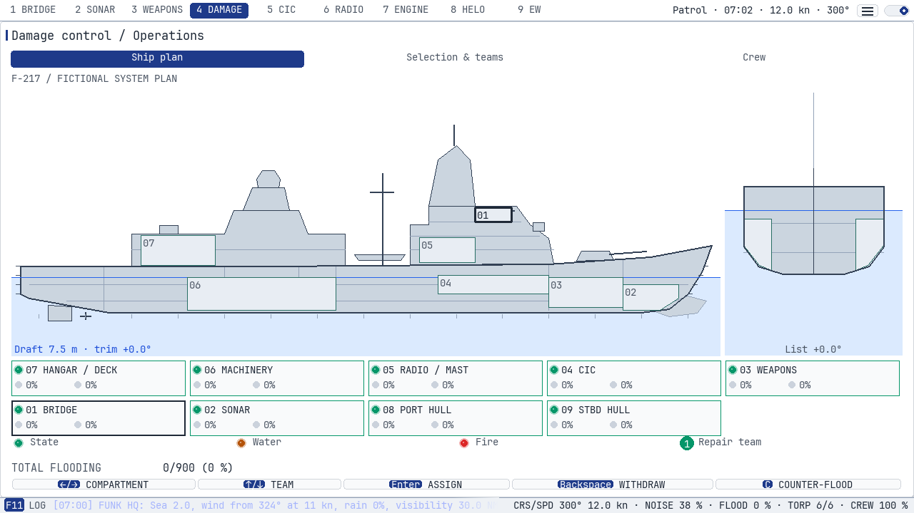

*Damage control on the uConsole*

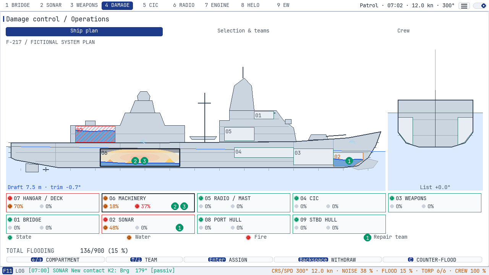

*Damage control with flooding and fire after a hit*

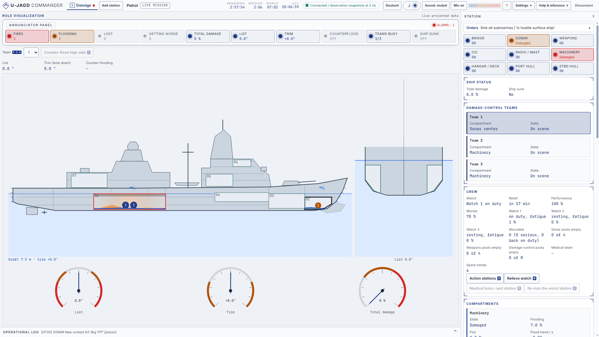

*Damage control in the Remote Crew browser*

```text
  bow                                                   stern
 +--------+--------+---------+-----+-------+--------+-----------+
 | BRIDGE | SONAR  | WEAPONS | OPZ | RADIO | ENGINE | FLIGHTDECK|
 +--------+--------+---------+-----+-------+--------+-----------+
 |            HULL PORT          |          HULL STARBOARD       |
 +-------------------------------+-------------------------------+
  state: OK -> DAMAGED / FLOODING -> DESTROYED     teams: 1 2 3
```

- **FLOODING:** a hole below the waterline lets water in. The inflow follows the water pressure: fast at first, slower as the water inside rises towards the outside waterline. Rooms high in the ship (bridge) do not flood through a hole. At 70 % the compartment is DESTROYED.
- **DAMAGED:** the hole is patched; a small residual leak remains until a team pumps the room dry.
- **Patch kits:** plugging a hole uses one of 8 patch kits. Without kits a team can only pump against the open hole.
- **Hit location:** the torpedo's impact point decides the compartment; a close burst tears a bigger hole than a distant one. Missiles hit above the waterline and mostly start fires.
- **Fire:** grows with the room's fuel load (engine, flight deck and magazine burn fiercest) and is smothered by rising water. A room that stays hot for about 30 s ignites its neighbours. A flooded switchboard (sonar, operations, radio, engine) shorts and starts an electrical fire. A fire above 90 % in the weapons room cooks off the magazine: the room is destroyed and the neighbouring rooms are holed.
- **Stability:** floodwater adds weight, and loose water surfaces reduce the metacentric height (GM). The ship sinks when the floodwater exceeds its reserve buoyancy, and capsizes when GM is lost or the heel passes 35 degrees.
- **Heel:** off-centre floodwater lists the ship to that side and pulls it off course.
- **Counter-flooding:** with `C` and a list of 5 degrees or more, damage control opens the flooding valve of the high hull side; water enters at 0.5 % of the room per second until the list is cancelled, never past 60 % of that side, and the valve closes by itself below 1 degree (or with `C` again). The water is real floodwater: it adds weight and draught and a team has to pump it out later.
- **Trim:** floodwater forward or aft trims the ship (bow down counts positive). Every degree costs 0.5 kn of top speed and, bow down, adds own noise at the bow sonar. The stability line on page 2 shows list, trim and the open valve.
- **Steering gear and stabilizers:** the steering gear sits aft under the flight deck. If that compartment is destroyed, the rudder jams at its last angle until the room is repaired. A steering failure among the incidents (Radio chapter) jams it for 60 s and then leaves half rudder rate from the emergency position for 10 minutes. A destroyed hull compartment on either side knocks out the fin stabilizers, so the ship rolls more in a seaway. Floodwater adds weight: the ship sits deeper and accelerates more slowly.

Station effects: a station loses capability continuously with flooding and fire in its room (sonar and radar range shrink gradually); a destroyed room disables it. A damaged engine room caps speed at 15 kn, a destroyed one at 8 kn; a damaged or destroyed weapons room blocks torpedo launches; a destroyed flight deck prevents helicopter launch and recovery; a destroyed operations room also disables ESM.

### Crew and watches

Page 3 (Crew) shows the watch bill. The ship's company stands in three watches: one is on duty and tires, the other two rest and recover. The duty watch is relieved automatically every hour of game time (a real watch is four hours; the game compresses it so a session sees the rotation), or earlier with `W` on this page. For the first minute after a relief the new watch settles in and works at 85 %.

- **Fatigue** (0 to 100 % per watch) rises by about 25 % in a normal hour on duty and falls again at rest. Up to 25 % it costs nothing, so normal rotation keeps the crew at full performance. Above it, every 10 % costs 6 % performance.
- **Action stations** (`G` here or on the Bridge) put every watch on duty: the crew is 10 % more alert, but nobody rests and everybody tires in 90 minutes from fresh to exhausted, faster while fighting fire or flooding. There is no relief at action stations; standing down hands the watch to the freshest section. Stand to for an attack and stand down afterwards: after about half an hour at action stations the bonus is used up. Switching them on rings the general alarm through the ship (on the uConsole and in the frigate's browsers with sound on).
- **Morale** starts at 70 %. A sunk submarine (+15), a rescue (+12) or another task done (+6) raise it; a compartment damaged (-6), a task failed (-8) or declined (-2) lower it; a repaired compartment gives +2. Low morale tires the crew faster; each 10 % of morale changes performance by 2 %.
- **Performance** is what the crew delivers: the sonar operator needs a stronger signal (every 10 % lost raises the recognition threshold by 1 dB, so the passive ranges shrink), the lookout needs more contrast to sight, recognize and identify, and the repair teams patch, pump and fight fire at that pace. Page 3 lists the current values; the status ticker shows `CREW` with the performance, or `GQ` at action stations.
- **Wounded:** hits, fire, flooding and gas wound people. A torpedo hit wounds three at once in the station of the compartment it struck and one in the next; a missile hit or another sudden jump in damage wounds one for every 15 % of it; every minute in a fully burning or flooded compartment wounds one more (proportionally less for smaller fires). The sonar room (sonar and bridge compartments, 4 posts), the weapons (weapons and CIC, 4 posts) and damage control (all other compartments, 8 posts) each lose a post per wounded; a station with every post empty works at half pace, so an empty post in the sonar room raises the recognition threshold, empty weapons posts slow the tube reload and empty damage-control posts slow the repair teams (on top of the watch's performance). Every third wounded man is seriously hurt and out for the mission. Page 3 lists the wounded, the empty posts per station, the medical team and the spare hands.
- **Medical team** (`M`): it treats the lightly wounded of one station and sends one back to his post every 90 s. Without an order it goes where most are lightly wounded; `M` sends it to the next station with lightly wounded, after the last back to automatic.
- **Re-manning** (`U`): up to two men from the resting watches fill empty posts of the worst-hit station at once (serious cases first). They lose their rest: every resting watch gains 8 % fatigue per man. The ship has 6 spare hands for the whole mission, and the next re-manning takes 3 minutes to organise.
- The crewed opposing submarine has its own watch bill with the same rules and its own wounded (see the reference chapter); AI submarines re-man a station with two empty posts on their own, and the AI hunter frigate does the same.

### Keys

| Key | Action |
|---|---|
| `<- / ->` | Select compartment |
| `Up / Down` | Select team 1-3 (unassigned) |
| `Enter` | Assign selected team to selected compartment |
| `Backspace` | Withdraw selected team |
| `C` | Counter-flood the high hull side against a list (again: close the valve) |
| `W` | Relieve the duty watch now (Crew page) |
| `G` | Action stations on/off (Crew page) |
| `M` | Medical team to the next station with wounded (Crew page) |
| `U` | Men from the resting watches to the worst-hit station (Crew page) |
| `1-9` | Always switch station; never assign a team |
| `Click` | Select compartment or its label; Enter assigns the selected team |

On the uConsole the joystick buttons 1-3 assign team 1-3 directly to the selected compartment.

### Mouse

Every key in the key bar at the foot of the station can be clicked; holding the button holds the key. Lamps, page tabs and key hints in the text are clickable too (chapter Tools, Mouse). In addition:

- A click on a compartment card selects the compartment, a click on a team card picks the team; `Enter` sends it. Neither click sends a team by itself.

### Standard procedure

1. After a hit, read the compartment plan: fire, flooding, destroyed.
2. Fire first: select the room (Left/Right) and a free team (Up/Down).
3. Assign with Enter; watch progress and heel on the detail page.
4. Then flooding in machinery and sonar spaces, then the hull.
5. Withdraw teams (Backspace) once a room is stable and reassign.

### Pro tips

- Teams start in the operations room and need about 20 s per compartment to walk to their job; a team is only effective once it has arrived. Keep a team near the engine and weapons rooms.
- A team first patches the hole, then pumps. Patch kits are limited: spend them on rooms below the waterline, not on rooms that already stopped flooding.
- Two teams on one room halve the time. Teams cannot be assigned to a destroyed compartment.
- Fire in a room next to the engine or the weapons room is the most dangerous: it spreads into mission-critical spaces.

### Not modelled

- No named crew members or sleep by the clock; the wounded are counted per station (sonar, weapons, damage control), the bridge, engine room and flight deck have no posts of their own, and a wounded man never dies. Empty posts do not slow an AI submarine's sonar (only its torpedo gang and repairs). Watches are relieved every hour of game time.
- Counter-flooding only between the two hull sides; no selective flooding of other rooms.

## 5 Operations / CIC

### Purpose

Operations (OPZ / CIC) builds the tactical picture above the water: surface and air radar, AIS, released sonar and ESM bearings, manual fusion of reports, NATO affiliation and air defence. It hands designated tracks to Sonar and Weapons.

### Pages

| Page | Shows |
|---|---|
| 1 Picture | Full-height chart with every published track |
| 2 Track details | Target page of the selected track: assign, chaff, missile track, ESSM |
| 3 Patrol aircraft | Orders and state of the patrol aircraft |
| 4 Group | Orders of the consort destroyer in a group hunt |
| 5 Display | What the OPZ chart draws |

### Displays and instruments

Every page has three columns: track cards on the left (a click selects a track), the chart in the middle and the page's panel on the right. Page 1 is a full-height free chart with all published tracks; page 2 is the target page for the selected track (its key chips assign the target with `M`, launch chaff with `G` and step the missile track with `←`/`→`; ESSM stays on `Ctrl+Enter`); page 3 commands the patrol aircraft; page 4 commands the consort destroyer of a group hunt; page 5 sets the chart display. The ship-centred radar picture uses its own range scale (10/20/40/80/120 NM, `Q`/`E` as the zoom keys elsewhere; `PgUp`/`PgDn` page), independent of the chart zoom (wheel, down to 0.25 NM radius; drag pans; `K` follows). Own units come from the datalink, not from sensors: the ship, the airborne helicopter ("HSP-5 DL") and every own weapon under way, i.e. torpedoes from ship, helicopter or ASROC (`T<n>`), ASROC in flight and ESSM, each with a friendly symbol and a heading tick; the helicopter wears the NATO rotary-wing sign (a bow tie of two rotor blades) inside the friendly frame, on the uConsole and in the browser.

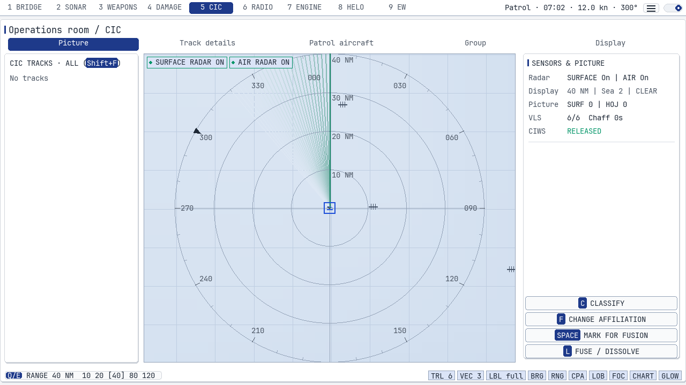

*OPZ on the uConsole*

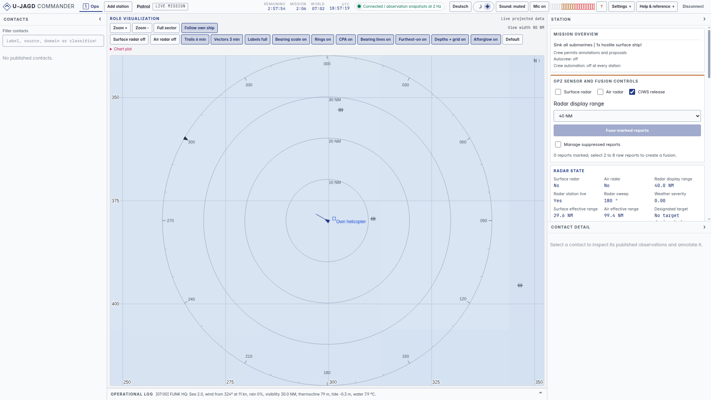

*OPZ in the Remote Crew browser*

```text
 NATO frame colours (operator annotation, not truth)
   yellow = UNKNOWN   blue = FRIEND   green = NEUTRAL   red = HOSTILE

 report sources:  radar  AIS  sonar(released)  ESM  HFDF  lookout
 track list:  ID  source  bearing  range  course/speed  age  class
```

- **Surface radar:** 30 NM, limited by the radar horizon (20 m mast) and target height; submerged submarines are invisible.
- **Mast and snorkel echoes:** a submarine at periscope depth with a raised mast or snorkel head (a crew's mast, a snorkelling submarine, one at radio depth, or an AI reconnaissance submarine's periscope during its look round) returns a tiny echo: in calm sea about half the sweeps find it at 7 NM, at sea state 3 at about 2.5 NM, at sea state 5 under 1 NM. It shows only as a bare dot that glows for about 6 s, with no symbol, no label and no track. Click the dot on the PPI or press `B` (newest dot) to mark it: a radar track `R-…` starts from that measurement and further echoes of the same mast update it; without new echoes it fades after 30 s. Blips and the mark are not saved.
- **Air radar:** 100 NM for aircraft and anti-ship missiles (ASM).
- The antenna turns once every 4 s: a contact is updated only when the beam sweeps past it, and each sweep detects it with a probability that falls with range (50 % at the nominal range for a broadside ship; bow-on targets are seen later, fluctuating echoes can miss a sweep). Sea clutter grows with sea state (about -5 % at sea state 4, -25 % at 6) and rain attenuates the echo (-10 % surface, -20 % air); from sea state 5 measurement errors increase. Inside 3 NM the CIWS search/track radar holds an inbound missile continuously while CIWS is released.
- **AIS:** civilian ships broadcast course and speed every 2-10 s (3 min at anchor) and their name about every 6 min. The VHF receiver hears them only within line of sight (about 20 NM). A radar track of a civilian shows name and course only after the matching AIS report has been received; radar alone gives position only. Optional live AIS/ADS-B traffic is indistinguishable from simulated traffic.
- **Fusion:** mark 2-8 raw reports (`Space`) and fuse them (`L`) into one operator track; `Shift+L` dissolves it. A fusion whose reports come from exactly one sonar contact can be designated to Weapons; its classification counts for fire control unless Sonar has classified the contact itself, and its affiliation applies to that contact. A fusion lasts only while all its reports are current.
- **Automatic fusion:** once a second the OPZ fuses reports of different sensors that lie on top of each other by itself, so one ship seen by radar, lookout and AIS is one contact. It uses the same gates as the correlation suggestions below, but only for a clear match: the score must be well inside the gates, at least one of the two reports needs a position (two bearing-only reports, such as sonar and ESM, are never fused automatically), and neither may have a second candidate from the same kind of sensor (two ships close together stay apart and appear as a suggestion). A further report joins an existing automatic fusion the same way, up to 8 reports. An automatic fusion keeps its ID while at least two of its reports are current and drops a report that has lapsed; with fewer than two it ends. It takes its name from an AIS report, if it has one. `Shift+L` separates it, and those reports are not fused again automatically until one of them is new. With the OPZ down nothing is fused.
- **Sources:** reports inside a fusion are no longer listed or drawn on their own; the fusion stands for them (`H` shows them with the suppressed reports). Each track card ends with sensor tags: `R` radar, `V` lookout, `A` AIS, `E` ESM, `S` sonar, `H` helicopter, `B` buoy, `M` patrol aircraft, `F` HF/DF, `J` home-on-jam, `D` datalink. Page 2 shows the full names under *Sources* for a fusion (for example `Radar · Lookout · AIS`). The Remote Crew OPZ station lists the sources of each fusion and hides its reports unless *Manage suppressed reports* is on.
- **Correlation suggestions:** the OPZ compares its current reports (at most 30 s old) from different sensors: sonar (only the ship's own bearings and fixes, not buoys or the dipping sonar), radar, ESM, lookout and AIS. Received AIS reports are OPZ reports of their own: the ship's reported position dead-reckoned to now by its reported course and speed, and its name once the static message is in; they count while their data is fresh (up to 10 min at anchor). Two reports whose bearings from the ship agree within 1.5° plus both reports' bearing uncertainties (together at most 8°) and, if both have positions, lie within 1.5 NM plus a tenth of their range of each other are suggested as a pair, provided their motion and class agree too: when both give a course and one moves at 3 kn or more, the courses must agree within 35°; when both give a speed, within 4 kn plus a quarter of the faster; two operator classifications must be equal, and an AIS report never pairs with a report classified as submarine, biological or aircraft. Agreeing classes rank a pair higher. Sonar and AIS are never paired with an air track. The sidebar of page 1 lists the two best (for example `> K03 + R-2  Brg 087°`); `U` fuses the top one exactly like marking both and pressing `L`, `Shift+U` dismisses it. The Remote Crew OPZ station lists all of them, with the course and speed difference and whether the classes agree, and the buttons *Fuse suggestion* and *Dismiss*. At most 4 suggestions exist at a time, each report in only one; reports already fused are left out. Suggestions are hints, not identification, and like fusions and dismissals they are not saved.
- **Suppression:** `Delete` hides a report locally; `H` shows suppressed reports again.

### Patrol aircraft

Page 3 commands a maritime patrol aircraft (MPA) on call from the nearest friendly airfield (without one it comes in from the nearest map edge). It flies at 300 kn in transit and orbits its search area at 200 kn in a 3 NM circle. Each sortie lasts up to 5 h including a 15 min reserve; at bingo fuel it turns home by itself. After landing it needs 30 min on the ground and then flies once more: 2 sorties per mission, each with 16 sonobuoys and 2 lightweight torpedoes.

- The aircraft uses the helicopter's keys. `H` requests the aircraft (it first heads for the ship's position) or sends it home.
- `W` sets the search area on the selected track's plotted position (without a selection on the ship); a click on the chart sets it on that point. A bearing-only track has no position to fly to.
- `X` plans a buoy pattern (field, barrier, circle) about the search area; the aircraft flies the points and drops a buoy at each; within 4 NM of the next point it slows to 200 kn so it can turn onto it. `Shift+X` cancels the pattern. `B` drops one buoy where the aircraft is, `Shift+B` switches its buoys between PASSIVE and ACTIVE.
- `Ctrl+R` switches the aircraft's surface-search radar (as the helicopter's). From 300 m it sees ships and surfaced or mast-raised submarines out to 60 NM (limited by the radar horizon); its contacts appear as `RADAR-MPA` tracks with the aircraft as observer. AI submarines with a raised mast hear it and go deep (see the helicopter chapter).
- Like the helicopter's, the aircraft's crew sees a raised mast's feather (see the helicopter chapter); while the datalink holds, these sightings appear as `MPA-EYE` tracks.
- `Shift+M` starts or ends **MAD passes** (browser: *Start MAD passes*/*End MAD passes*) while the aircraft is on its way or on station: once there it descends to 60 m and flies straight passes at 180 kn through the search area, turning back 2 NM past it (a cloverleaf). A submerged hull within about 400 m slant range is detected on a stateless draw each second (sure inside 250 m) and reaches the ship over the datalink as a MAD position fix without depth or course on that submarine's sonar contact. A buoy pattern flies first; `H` (home) ends the passes.
- `D` drops a torpedo on the designated sonar contact. The same checks as for the helicopter apply (current contact classified as a submarine, rules of engagement, a fresh fix under standard ROE), and the aircraft must be within 2 NM of the datum.

Everything the aircraft learns reaches the ship only by datalink, out to 250 NM. Its buoys report only while the aircraft is within 50 NM of them; once it leaves or lands they go silent for the ship. The sidebar shows its state, bearing and range, the time left on station, stores, sorties left and how many of its buoys are being relayed.

### Consort destroyer

Page 4 (Group) commands the consort of a group hunt: the destroyer LUETJENS (hull sonar, 8 ASROC, 2 in the Hunter group) that sails with the frigate in frigate scenario 11 (Search group) and submarine scenario 11 (Hunter group). Other missions have no consort and the page says so. The destroyer is an own unit on the datalink (out to 100 NM): its position, course, speed, orders and stores are shown as truth, drawn on the OPZ chart as a friendly symbol labelled with its call sign and `DL`; what its sonar hears reaches the frigate only as measurements.

- **Orders:** `Y` auto, `F` formation (each press moves it to the next station 5 NM off the frigate: starboard beam, ahead, port beam, astern), `H` hold (4 kn on its course), `X` search about a point (it closes at 18 kn and circles the point 4 NM out at 10 kn so its sonar hears), `W` prosecute the selected track's plotted position (26 kn, then a 2 NM circle with active sonar). A click on the chart sets the point and switches formation, hold or auto to search. Each order key in the panel's hints is clickable too; its ASROC stays on `Ctrl+Enter`.
- **Auto:** it keeps formation until the frigate's own picture holds a contact you classified as a submarine or designated with a position fix under 10 minutes old; then it prosecutes the freshest one with active sonar.
- **Sonar:** every 10 s its passive bearings appear on page 4 as lines from the destroyer. Its hull sonar hears a submarine within 8 NM, and nothing while it runs faster than 15 kn. Where one cuts the frigate's own passive bearing on the same contact at 15° or more and within 30 NM, the contact gets a `CONSORT` fix (uncertainty from both bearing errors and the cut). `Shift+A` switches its active sonar: every 20 s a ping fixes each submerged contact within 5 NM with position and depth (more likely the closer it is) as a `CONSORT` fix; every submarine within 25 NM hears the ping.
- **Weapons:** `Shift+W` switches weapons free or tight (tight at the start). Free, it fires one ASROC at most every 3 minutes on the auto contact's fix when that fix is under 2 minutes old and 1 to 12 NM from the destroyer. `Ctrl+Enter` orders one ASROC on the selected track's fix (under 2 minutes old); without a selection on the auto contact. Only one of its ASROC is in the air at a time. While nobody works the frigate's OPZ (the AI crews the frigate), the hunters may also send it a located datum for an ASROC.

If the destroyer is sunk the page and the event log say so; the mission goes on. The browser's OPZ has the same orders in the card *Consort destroyer*, and its chart shows the destroyer, its point and its bearing lines.

### Chart display

Page 5 (Display) sets what the OPZ chart draws; it changes nothing in the simulation or the picture itself and is kept in the settings. `↑`/`↓` picks a row, `←`/`→` changes it (a click on a row moves it on), `Backspace` puts the selected row back to its default, `Shift+Backspace` every row.

- **Track trails:** off, 3, 6 or 12 minutes of earlier published positions behind each track (one point every 30 s, oldest faintest; they start anew after a load).
- **Vectors:** the motion vector shows the distance run in 3, 6, 12 or 30 minutes.
- **Labels:** full, short (six characters) or off.
- **Bearing scale:** ticks every 10° and numbers every 30° on the outer radar ring, with a mark for the own course. The numbers always stand at their bearing; when the chart is zoomed far out the rings carry their distance only every second ring, and a distance that would cover a bearing number is left out.
- **Range rings**, **bearing lines** of bearing-only reports, **furthest-on** circles, **depths + grid** of the chart and the **radar afterglow** each switch on and off.
- **CPA of selected:** for the selected track with a position, course and speed, both run on to the closest point of approach; a line joins the two points with distance and time (red under 2 NM). It uses only the track's reported motion, so it is only as good as that report.

Two switches in the chart's top left turn the surface and air radar on and off on every page (the same as `R` and `Shift+R`, with the EMCON report to HQ); they glow while the radar transmits. The chips under the chart show which layers are on and switch them with a click on every page. The browser's OPZ has the radar switches and the same settings as buttons above its chart (kept for that browser tab only).

### Keys

| Key | Action |
|---|---|
| `Up / Down` | Select CIC track |
| `C` | Classify OPZ radar/HOJ reports or manual fusions |
| `F` | Set NATO affiliation |
| `Shift+F` | Cycle OPZ contact-domain filter |
| `J` | Enter a shared operator-visible track ID |
| `Space / L / Shift+L` | Mark raw reports and create/dissolve a fusion (Shift+L); matches fuse automatically |
| `U / Shift+U` | Fuse the top correlation suggestion (Shift+U dismisses it) |
| `Delete / H` | Suppress/restore locally; H manages suppressed reports |
| `M` | Pass CIC track to sonar/weapons |
| `Q / E` | Radar range 10/20/40/80/120 NM (Q wider, E closer) |
| `<- / ->` | Select ASM track |
| `Ctrl+Enter` | Launch ESSM (VLS cell) |
| `G` | Deploy chaff (8 NM cone, cooldown) |
| `R` | Surface-search radar on/off (EMCON) |
| `Shift+R` | Air-search radar on/off (EMCON) |
| `I` | Toggle CIWS fire release (withheld = never fires on inbound ASMs) |
| `Backspace` | Clear all marked reports |
| `B` | Mark the newest bare radar blip as a track (or click the blip) |
| `Enter` | Confirm attack after classifying a real contact hostile |
| `K` | Camera follow on/off |
| `H` | OPZ page 3: request the patrol aircraft / send it home (keys as the helicopter) |
| `W` | Page 3: search area on the selected track (else own ship); click the chart for a point |
| `X / Shift+X` | Page 3: cycle buoy pattern about the search area / Shift cancels |
| `B` | Page 3: drop one buoy at the aircraft |
| `Shift+B` | Page 3: aircraft buoy mode PASSIVE / ACTIVE |
| `Ctrl+R` | Page 3: aircraft surface-search radar on/off |
| `Shift+M` | Page 3: aircraft MAD passes over its waypoint on/off (low and slower, radar horizon shrinks) |
| `D` | Page 3: torpedo on the designated contact (aircraft within 2 NM of the datum) |
| `Y / F / H` | OPZ page 4 (group hunt): consort auto / next formation station / hold |
| `X / W` | OPZ page 4: consort searches here / prosecutes the selected track (or click the chart) |
| `Shift+A` | OPZ page 4: consort's active sonar on/off |
| `Shift+W` | OPZ page 4: consort's weapons free / tight |
| `Ctrl+Enter` | OPZ page 4: one ASROC from the consort on the selected track (fix under 2 min) |
| `↑/↓ ←/→` | Page 5 Display: pick a chart setting, change it |
| `Backspace` | Page 5: the selected chart setting to default |
| `Shift+Backspace` | Page 5: all chart settings to default |

### Mouse

Every key in the key bar at the foot of the station can be clicked; holding the button holds the key. Lamps, page tabs and key hints in the text are clickable too (chapter Tools, Mouse). In addition:

- A click on a track card selects the track.
- The key chips on the target page assign the target (`M`), launch chaff (`G`) and step the missile track (`←`/`→`); ESSM fires only with `Ctrl+Enter`.
- Page 3: a click on the chart sets the patrol aircraft's search area; page 4: a click sets the consort's point and its order keys in the panel are clickable.
- Page 5: a click on a row moves it on; the layer chips under the chart and the two radar switches in its top left work on every page.
- On the chart the wheel zooms, dragging pans (it ends `K` follow) and a click pins a tooltip.

### Standard procedure

1. Set radar range (Q/E); switch radars for EMCON (R / Shift+R).
2. Select tracks (Up/Down), classify (C) and set NATO affiliation (F).
3. Reports on top of each other fuse by themselves; mark others with Space and fuse with L, Shift+L separates.
4. Designate the track for sonar/weapons (M).
5. Missile threat: chaff (G), CIWS release (I), then ESSM (Ctrl+Enter).

Air defence sequence (missile inbound):

```text
  40 NM  ASM detected (air radar / ESM seeker bearing)
  30 NM  ESSM envelope          -> Ctrl+Enter (2 fire channels)
   8 NM  chaff cone             -> G (40 % break-lock, short blindness)
 1.5 NM  CIWS                   -> must be released with I
```

1. Air radar on (`Shift+R`), select the ASM track (`Left`/`Right`).
2. Chaff and manoeuvre first, then ESSM. Only 6 ESSM are loaded.
3. Keep CIWS released while missiles are inbound; withheld CIWS never fires.

### Pro tips

- Radar is a transmission that hostile ESM can intercept. Switch radars off (EMCON) when stealth matters more than the air picture.
- The radar does not know what an air contact is. Threat evaluation flags an air track as a possible missile (ASM) only from its own measurements: faster than 300 kn at or below 150 m, or a jamming strobe; a low, fast attack aircraft can raise the same flag. The flag needs about a second of plots, CIWS and ESSM engage only flagged tracks, and HFDF fixes and unclassified sonar contacts carry no domain until you classify them.
- Anti-ship missiles skim at about 20 m (5 m in the last 5 NM): radar sees them only inside about 20 NM, and a jamming missile gives only a home-on-jam (HOJ) bearing until it burns through. Missiles fly inertially to their launch datum, then their seeker needs the ship inside its cone for 1.5 s before homing; attack aircraft pop up to about 300 m for a few seconds to lock their fire-control radar before each salvo (an ESM warning and an early radar contact).
- Chaff lays a cloud beside the ship that blooms in about 3 s and drifts with the wind; fire it early enough for the cloud to bloom. CIWS must first slew onto the missile and kills mostly in the last few hundred metres.
- Affiliation is your annotation. Marking a contact, or a fusion containing it, FRIEND or NEUTRAL blocks every torpedo shot on it.
- Chart symbols follow NATO style on the uConsole and on every Remote Crew map: the frame shows your affiliation (hostile diamond, neutral square, friend wide rectangle, unknown without frame), the inner glyph the observed domain.
- `J` gives a track a shared ID that the whole crew (and Remote Crew browsers) sees.
- `Enter` confirms an engagement against a live (real-world traffic) contact after you classified it hostile; nothing fires automatically on unclassified contacts.

### Not modelled

- The helicopter's buoys belong to the helicopter station; OPZ handles only the patrol aircraft's buoys.
- The patrol aircraft has no dipping sonar and no own ESM; it cannot be shot down. MAD passes fly over the search area only, not along a track.
- Automatic fusion only for a clear match of reports from different sensors with at least one position; bearing-only pairs and ambiguous matches wait for the operator. Signatures are compared only as the operator's classifications (no acoustic or emitter fingerprint matching), and AIS carries no ship type.
- No link-based air control of friendly aircraft.
- The consort destroyer cannot be crewed from a station of its own: it has no helicopter, towed array or torpedoes, takes orders only from the frigate's OPZ, and its bearings are not shared with the helicopter or the patrol aircraft. Own torpedoes never home on it (its datalink position is kept out of every search), while the submarines' torpedoes can sink it.

## 6 Radio

### Purpose

The radio room handles communications with HQ and HF direction finding (HFDF). HQ sends orders, weather bulletins and ROE changes by teletype. HFDF takes bearings on submarines that transmit on HF or run a snorkel mast, out to 120 NM, far beyond sonar range.

### Pages

| Page | Shows |
|---|---|
| 1 HF direction finding | HFDF signal cards, cross-fix chart, DF rose with bearing log and fixes |
| 2 Messages | Teletype with HQ traffic |
| 3 Tasks | HQ tasks and the own calls to HQ |

### Displays and instruments

Page 1 has three columns: the current HFDF signals as cards on the left (a click selects one as `↑`/`↓` would), the cross-fix chart in the middle and the DF rose with the bearing log and the fixes on the right; page 2 is the teletype with HQ traffic; page 3 lists HQ tasks.

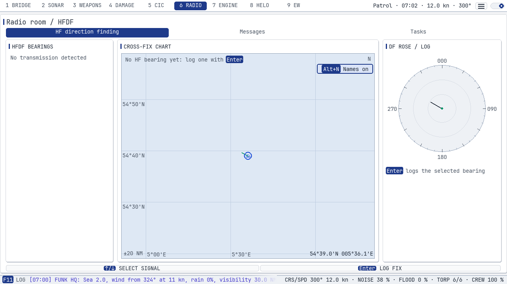

*Radio room on the uConsole*

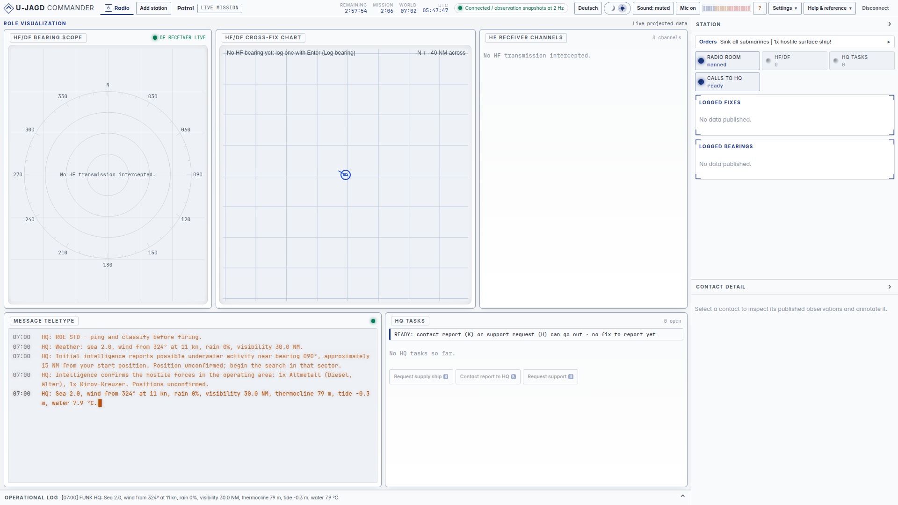

*Radio room in the Remote Crew browser*

```text
 HFDF SIGNALS               BEARING LOG
 > HF-03  247.0  age 12 s    HF-03 247.0 from pos A  t=12:04
   HF-05  061.5  age 40 s    HF-03 239.5 from pos B  t=12:08
                             -> CROSS-FIX + error ellipse on chart

   pos A *----------__
                       --___  X  <- fix
   pos B *------------------/
```

- Bearing error is +/-8 degrees for a ground wave and +/-16 degrees for a sky wave; signals older than 30 s can no longer be logged.
- Each signal shows its frequency and propagation. A submarine calling a distant shore station picks a high frequency by day (ground wave heard to about 95 NM) and a lower one at night (about 150 NM). Beyond the skip distance, several hundred NM away, the sky wave arrives instead. An AI submarine at periscope depth that has held the ship within the last 4 minutes reports it to its headquarters once every 30 minutes, at an unpredictable moment, with a 20 s call that HF/DF hears like any other.
- Logged lines and cross-fixes appear on the charts of Bridge, Weapons and Helicopter.
- In the Remote Crew browser the radio room has no chart: an HF/DF bearing scope (one strobe per signal, fan width is the bearing error, logged bearings dashed), receiver channels with frequency, propagation, signal meter and a log button, and the teletype. Selecting a channel opens the contact detail for annotation; logged bearings and cross-fixes are listed in the station panel.
- A second bearing of the same signal gives a cross-fix if it is taken at least 1 NM away from the first and within 300 s.
- The teletype also carries the weather bulletin every 30 minutes and HQ messages (threat warnings, ROE FREE).
- At mission start HQ reports the threat. With **coarse** intelligence it gives only a rough bearing and range of one threat. With **exact** intelligence it also names every hostile unit type committed to the mission with its number (for example "1x Altmetall (Diesel, älter), 2x air raid wave with anti-ship missiles"), using the names in the unit analyser (`F8`); positions stay unconfirmed. Patrol always gets exact intelligence, Double hunt and Nuclear intercept coarse, and the free hunt lets you choose on its difficulty screen (last row, "HQ intelligence").

Page 1 also shows an HF/DF bearing rose: each current signal is a strobe, fanned as wide as its bearing error.

The **cross-fix chart** beside it is the radio room's plotting sheet, north up, with grid and coastline: every logged bearing of the last 5 minutes is a line drawn from where the ship took it (the origin as a small circle), the current intercepts are thin lines from the ship with their error fan (the selected one amber), two logged bearings of the same signal that cross mark their crossing with a diamond, and each cross-fix shows its error ellipse with its label and 1-sigma error. Older lines fade. The chart frames the ship, every origin and fix and shows its half width (at least ±20 NM); below it are the newest logged bearings and fixes. It draws only what the radio room measured and computed, never the emitter itself.

### HQ tasks

Besides the hunt, HQ radios tasks to the ship: the first about 15 to 25 minutes into a built-in mission, then one every 25 to 45 minutes, at most six per mission and two open at a time (on a free patrol every 10 to 20 minutes without a cap, with the sector patrol as a sixth kind; see the reference chapter). Custom missions get none. Each offer arrives on the teletype and on page 3 (Tasks). Answer it within 5 minutes with `A` or `Enter` (accept) or `D` (decline); no answer counts as declined. A destroyed radio room cannot answer. On a real sea area HQ, incident reports, the task page, logged bearings and the submarine's ESM fix give positions in degrees and minutes (`54°21.4'N 010°08.2'E`), always with bearing and range from the ship where HQ gives them; on the stylized fixed chart they stay in NM.

- **Distress call (SAR):** a life raft with 2 to 6 people, reported by EPIRB with about 0.5 NM error and drifting with current and wind. The survivors last according to the sea temperature, from 40 minutes in water below 8 °C to 100 minutes above 20 °C. The raft is sighted within 2 NM by day (3 NM at night by its strobe), and it is a small radar echo for the ship's and the helicopter's radar (a few miles in a calm sea, far less in a rough one); then the circle on the chart shrinks onto it. Take them aboard by lying within 0.25 NM at 3 kn or less for 4 minutes, or with the helicopter's rescue hoist (`Z` within 0.1 NM: one minute per person, 6 in the cabin, only when the weather allows dipping); the helicopter's survivors count once it is back on deck (chapter Helicopter deck). +600 points, -400 if they are lost.
- **Identify merchant:** HQ names a merchant within 60 NM and gives its position with about 2 NM error. It counts as identified once the lookout has published its identification or the helicopter passes within 1 NM with at least 1 NM visibility. About a third are flagged as suspect: HQ then passes a submarine datum near the ship. 40 minutes.
- **Submarine datum:** a circle of 5 NM radius from a maritime patrol report; not every datum has a submarine behind it. Search 10 minutes inside the circle with the ship or the helicopter. 50 minutes. Not offered in the submarine missions 8 and 9: HQ has no intelligence on that submarine.
- **Replenishment at sea:** offered when fuel is below 70 % or torpedoes, ASROC or depth charges have been used; `R` on the Tasks page (or the browser's *Request supply ship*) asks for one yourself when at least 5 % fuel or any store is missing, at most once every 20 minutes after the last one ended. A friendly supply ship appears 18 to 28 NM away at 12 kn; its course and a dead-reckoning line are plotted. Keep within 0.3 NM and within 3 kn of its speed: fuel flows the whole time (a full load in 15 minutes), and torpedoes, ASROC, depth charges, Nixie decoys and CIWS and gun rounds come over in five loads, one every 3 minutes, each a share of what is still missing. Breaking away keeps what came over. The Tasks page shows what is aboard. VLS cells are not reloaded at sea. Worth +100, no penalty.
- **Radar silence (EMCON):** both radars off within 90 s and silent for 20 to 30 minutes. +200, -250 if a radar radiates.

Accepted positions are plotted on every chart (also in the Remote Crew browser). Scores are listed at mission end. The radio operator in the browser answers with the same buttons.

### Incidents at sea

The sea brings surprises of its own: the first 20 to 40 minutes into a built-in mission, then one every 30 to 50 minutes, at most six per mission (on a free patrol every 20 to 40 minutes without a cap; none in custom missions and lessons). Each is reported on the teletype.

- **Drift net:** a fishing boat reports a net 2 NM long across the ship's track, 3 to 7 NM ahead, hanging from the surface down to 20 m; the radio operator plots it on every chart as a ruler `NET n`, and it is hauled in after an hour. Running over it tears it: the fishermen claim damages (-100 points), and a streamed towed array or variable-depth sonar fouls in it and is hauled in at once. A submarine that crosses it shallower than 20 m fouls it too and is loud for 20 s while it tears free; deeper it passes under.
- **Weather front:** HQ warns 10 minutes ahead; then rain, a storm or fog holds for 30 to 60 minutes (visibility, wind and rain noise for every sensor, on both sides), and HQ reports when it has passed.
- **Merchant without AIS:** a freighter running without AIS appears 8 to 15 NM away; HQ reports it with about 2 NM error and offers it as an identify task when fewer than two tasks are open.
- **Whales:** a fishing boat reports a pod of two to four whales 3 to 6 NM ahead; they are real biological contacts for every sonar. Merchants without AIS and whales from incidents stay at sea; once 56 ships or 40 animals are about, no more of them come.
- **Man overboard:** a sailor goes over the side next to the ship; the general alarm sounds and the chart carries the mark `OVERBOARD n`, which drifts with the surface current. The Bridge turns back with a Williamson turn and recovers him when the ship passes within 0.1 NM at 5 kn or less; the helicopter recovers him when it hovers right over him (waypoint on the mark, or dipping sonar lowered). A rescue is worth +100 points; after 20 minutes in the water he is lost (-300 points). When the AI runs the Bridge it steers onto the mark itself and comes back up to 12 kn afterwards.
- **Steering failure:** the steering gear fails: the rudder is jammed for 60 s, then the engine room steers from the emergency position at half rudder rate until the steering gear is repaired after 10 minutes.
- **Snorkel valve and battery gas (submarine):** on a diesel-electric submarine the snorkel head valve jams for 15 minutes (no charging; the AI submarine goes deep and stays down), or battery gas has to be vented (half charging rate). The crewed submarine's crew reports both; the frigate learns nothing of them.

HQ passes the net, the front and the whales (not the emergencies aboard) on to the submarine's broadcast; a crewed submarine hears of them when it copies the next broadcast, and its crew plots the net on its own chart.

### Own calls to HQ

On the Tasks page the radio room can call HQ itself, at most once every 10 minutes; the line at the foot of the task list says whether a call is on the air, how long until the next one, or that both are ready.

- `K` **Contact report:** sends the position of the freshest located contact (ping, TMA, buoy or fused fix, else an HF/DF cross-fix up to 15 minutes old). HQ acknowledges it on the teletype and vectors the patrol aircraft to it when the aircraft is airborne. HQ never says whether a submarine was really there: each report that put a hostile submarine within 3 NM of the fix earns 150 points at the mission's end (at most three; later calls never push them out). A report broken off because the radio room fails during the 20 s never reaches HQ and earns nothing.
- `H` **Request support:** HQ sends the on-call patrol aircraft toward the ship when it is available (even with the OPZ down), otherwise it says that no support is available.
- Each call is 20 s of HF transmission. While it is on the air, a submarine with its antenna up (the crewed submarine's raised mast, an AI submarine at periscope depth) takes an HF/DF bearing on the frigate (+/-8 degrees for a ground wave, +/-16 degrees for a sky wave): the crewed submarine gets a report and a bearing line on its chart, an AI submarine keeps the direction like a sonar bearing of its own (up to 4 minutes) and acts on it. Talking to HQ costs silence.

### Keys

| Key | Action |
|---|---|
| `Up / Down` | Select HFDF signal |
| `Enter` | Log bearing with own position (on the Tasks page Enter accepts the task) |
| `Up / Down` | Select HQ task (Tasks page) |
| `A / Enter` | Tasks page: accept the selected task |
| `D` | Tasks page: decline the selected task |
| `R` | Tasks page: request a supply ship from HQ |
| `K` | Tasks page: contact report to HQ (the freshest fix; HF call, can be DF'd) |
| `H` | Tasks page: request support from HQ (the patrol aircraft; HF call, can be DF'd) |

### Mouse

Every key in the key bar at the foot of the station can be clicked; holding the button holds the key. Lamps, page tabs and key hints in the text are clickable too (chapter Tools, Mouse). In addition:

- A click on a signal card selects that signal as `↑`/`↓` would.
- On the Tasks page a click on a task row selects the task; the key hints `K` (contact report), `H` (support) and those of a replenishment task press their keys.

### Standard procedure

1. Read the teletype on page 2: HQ orders, weather, ROE changes.
2. On HF activity select the signal (Up/Down).
3. Log the bearing (Enter); the line appears on the chart.
4. Move at least 1 NM and log a second bearing within 300 s.
5. Hand the cross-fix to Sonar/Bridge as a search datum.

### Pro tips

- Take the two bearings from positions across the expected bearing line: the more they cross at right angles, the smaller the error ellipse.
- A submarine that transmits or snorkels is usually shallow and slow: a good moment to close in with the helicopter.
- Combine an HFDF bearing with a sonar bearing for a quick position estimate.

### Not modelled

- No free-text radio transmissions: the only own calls to HQ are the contact report and the support request, besides answering tasks; no communication plan or crypto.
- No frequency tuning: HFDF monitors the whole HF band and lists the detected signals with their frequency.

## 7 Engine room

### Purpose

The engine room sets the propulsion order and manages the ship's acoustic signature. Speed is the most important trade-off in ASW: fast to reach a datum, slow and quiet to hear anything.

### Pages

| Page | Shows |
|---|---|
| 1 Telegraph & speed | Telegraph steps, speed gauge, shaft RPM and own-noise gauges, state lamps |
| 2 Systems | Annunciator panel, fuel bunker, roll, pitch and list gauges, mimic of the ship's sections |

### Displays and instruments

The engine room is a machinery control console. Page 1 shows the engine telegraph as a column of lit steps, a large speed gauge (ordered speed as an amber mark, the damage speed limit in red), gauges for shaft RPM and own noise (cavitation zone in red) and lamps for shaft, plant, course, acoustic mode, cavitation and speed limit. Page 2 **Systems** has an annunciator panel of status lamps (dark when off, green while running, amber for a caution, red for an alarm) with a master lamp counting alarms and cautions, the fuel bunker as a tank column with stock, burn, endurance and range, gauges for roll, pitch and hull list, and a mimic of the ship's sections from bow to stern between the starboard and port hull, each with its water level, state, flooding and fire LEDs and the numbered repair teams at work.

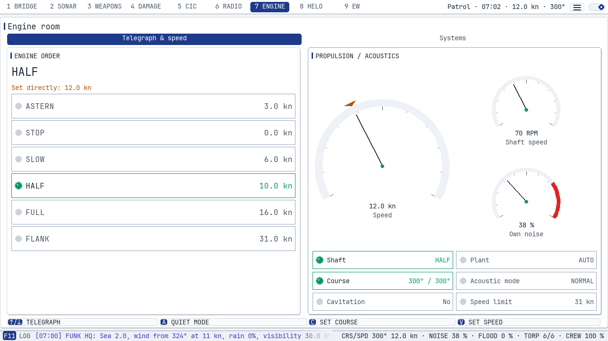

*Engine room on the uConsole*

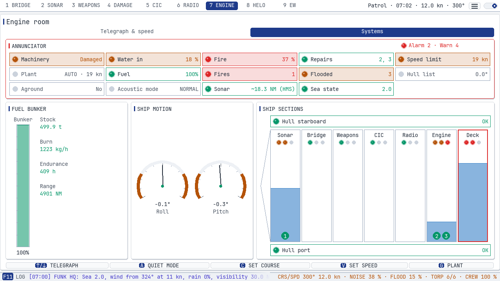

*Engine room, systems page*

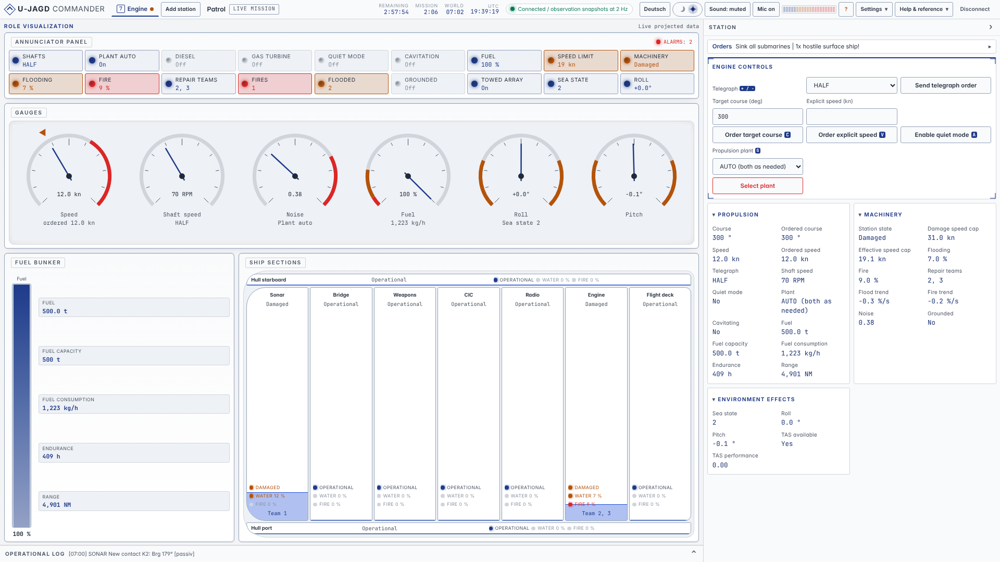

*Engine room in the Remote Crew browser*

```text
 TELEGRAPH      kn     own noise
   FLANK        31     |##########|  cavitating
   FULL         16     |#######   |  cavitating above 15 kn
 > HALF         10     |####      |
   SLOW          6     |##        |
   STOP          0     |          |
   (ASTERN       3 kn, separate state)

 noise  ^                    ____ cavitation (>= 0.85)
        |                ___/
        |           ____/
        |      ____/
        |_____/
        +----+------------+--------+---> kn
             4           15        31
```

- Own noise rises linearly from 4 kn to 31 kn. The propellers cavitate when the blade-tip speed is too high for the water pressure at the screws: in calm water from 15 kn, in heavy seas earlier when pitching lifts the stern. Cavitation raises noise to at least 0.85 and cuts passive sonar range to 35 %.
- The lamp of the ordered step is lit (ASTERN in amber). When a direct speed (`V` on the bridge) lies between two steps, a warning line names the ordered speed, so HALF 10 kn with 12 kn ordered is never mistaken for HALF.
- QUIET mode reduces own noise to 65 % and limits speed to 12 kn.
- Plant selection (`G`): AUTO runs the plant as before. DIESEL is the quiet plant (own noise about -4 dB, fuel -10 %) but caps speed at 18 kn; TURBINE gives full speed at about +3 dB and +25 % fuel. The choice is shown on page 2 and in the browser's engine room.
- Shaft RPM follows the fixed-pitch propeller: about 5.8 rpm per knot at steady speed (146 rpm at 25 kn, 181 rpm at the 31 kn flank speed). While accelerating the control programme keeps the shaft at most about 11 rpm ahead of the present speed; when slowing down the pitch reverses and the shaft idles at 20 rpm. The own blade-rate line on LOFAR (shaft rate x 5 blades) moves with speed.
- Machinery damage caps speed at 15 kn (damaged) or 8 kn (destroyed).
- Fuel burn follows the power the propellers deliver: at steady speed it grows with the cube of speed, accelerating and braking cost extra. A lighter ship (burnt fuel) accelerates slightly faster; floodwater makes it slower and deeper. Heavy seas add resistance and cost up to about 1 kn at FULL. With empty tanks the shaft stops and no engine order is accepted.
- **Engine-room console (browser):** in the browser the Engine room's picture area is a machinery control console. An **annunciator panel** of status lamps (dark when off, turquoise while running, amber for a caution, flashing red for an alarm, each with its value) shows shafts, plant auto, diesel, gas turbine, silent running, cavitation, fuel, speed limit, machinery state, flooding and fire in the engine room, repair teams, fires and flooded sections aboard, grounding, towed array, sea state and roll; the master lamp in its plate counts the alarms and cautions. Below it are round **gauges** for speed (with the ordered speed as an amber mark and the damage speed limit in red), shaft RPM, own noise (cavitation zone in red), fuel, roll and pitch, the **fuel bunker** with stock, capacity, consumption, endurance and range, and the **ship sections** from bow to stern between the starboard and port hull strips, each with its water level, state, flooding and fire lamps and the repair teams at work. The console only shows; the orders stay in the station panel on the right.

### Keys

| Key | Action |
|---|---|
| `+ / -` | Engine order (telegraph) |
| `Up / Down` | Telegraph up / down |
| `A` | Quiet mode QUIET/NORMAL |
| `G` | Propulsion plant: AUTO, DIESEL (18 kn, -4 dB) or TURBINE (+3 dB, +25 % fuel) |
| `C` | Enter target course directly (000-359) |
| `V` | Enter target speed directly (0-31 kn) |

### Mouse

Every key in the key bar at the foot of the station can be clicked; holding the button holds the key. Lamps, page tabs and key hints in the text are clickable too (chapter Tools, Mouse). In addition:

- Holding `+` or `-` in the key bar steps the telegraph; the lamps press their keys.

### Standard procedure

1. Choose the order with Up/Down or +/-; V enters an exact speed.
2. Stay below 15 kn while listening: cavitation masks the sonar.
3. Switch QUIET (A) for the attack approach (max 12 kn).
4. Never exceed 20 kn with the TAS streamed.
5. Watch machinery damage: speed limits of 15 or 8 kn apply.

### Pro tips

- Speed changes take minutes; order slow-down early before a listening leg.
- The towed array can only be streamed or recovered between 3 and 12 kn; at more than 20 kn with cable out it is lost.
- A hostile submarine hears you better than you hear it when you cavitate. Sprint only when you are far from the expected contact.

### Not modelled

- No individual shaft control; the plant choice applies to both shafts.

## 8 Helicopter deck

### Purpose

The HSP-5 "Sea Lynx" extends the frigate's reach: it flies to a datum at 120 kn, drops sonobuoys, dips its own sonar and attacks with lightweight torpedoes, while the frigate stays quiet and out of torpedo range.

### Pages

The station has four pages (`8` again cycles them); it opens on page 3.

| Page | Content |
|---|---|
| 1 Status | Status console: state lamps, fuel, home bearing, stores, flight weather, deck motion |
| 2 Mission rules | Waypoint bearing and range, fuel margin for the return, launch, dip and weapon keys, buoy pattern, MAD, radar, ROE |
| 3 Sonar | Dipping sonar and buoy contacts, depth, source |
| 4 Acoustic | Listening: BROADBAND / LOFAR / DEMON of the dipping sonar or a passive buoy |

### Displays and instruments

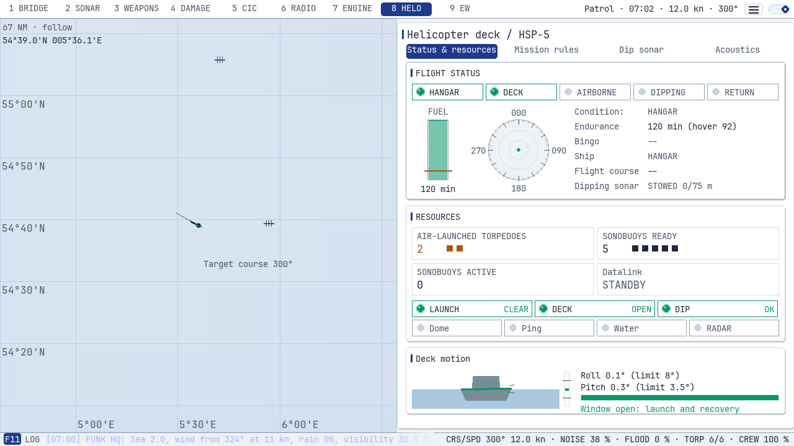

*Helicopter deck on the uConsole*

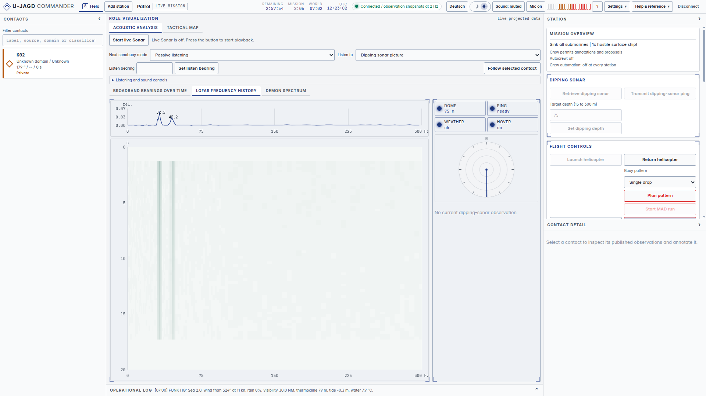

*Helicopter deck in the Remote Crew browser*

The browser's stage has three pages for the helicopter: *Acoustic analysis* (BROADBAND, LOFAR and DEMON of the buoys and the dipping sonar), *Dipping sonar* (the dipping sonar's north-up scope over the whole stage, rings at 5, 10, 15 and 20 NM, with water depth, layer and each contact's values beside it) and *Tactical map* (the chart over the whole stage). `Page Up`/`Page Down`, the station number `8` again or the key chip beside the tabs step through them.

```text
          frigate                           waypoint (1-30 NM)
            *----------- 120 kn -------------->  H  hover + dip
                                                 |
   buoy line (B):  o ---- o ---- o               |  cable 15-300 m
   PASSIVE: bearings;                            )))  dipping sonar
   two crossing bearings (>= 10 deg) = fix          passive 18 NM
   ACTIVE: range + bearing every 30 s               active  14 NM
```

- **Fuel:** 2 hours in forward flight; hovering (dipping) burns 1.3 times as fast. The helicopter returns automatically when only the 20-minute reserve remains. Running dry before landing loses the aircraft. In the hover the wind pushes it slightly downwind of its hover point.
- **Start preparation:** the helicopter is never ready at once. `H` (browser: *Launch helicopter*) starts 5 minutes of preparation in the hangar (checks, fuel, weapons, crew brief); the state reads START PREP with the time left and the HANGAR lamp turns amber. Then it lifts off at the next launch window; until one comes the state reads READY, WAITING. `H` again (browser: *Stop start preparation*) stops the preparation. After every landing the next launch needs the full preparation again, so order it early. The AI frigate waits for it too.
- **Refuelling:** the tank is full at the start of a mission. After a landing the helicopter keeps the fuel it came back with and is refuelled on deck: 15 minutes from empty to full (8 minutes of flight per minute on deck). The state reads REFUEL with the time to a full tank and the HANGAR lamp turns amber. A launch order does not wait for a full tank: the helicopter lifts off after its preparation with the fuel aboard by then, but never with less than 30 minutes (the reserve plus 10 minutes); short of that it reads REFUEL with the time to that minimum. Torpedoes and buoys are not reloaded: the stores aboard are the whole mission's load. The AI frigate refuels the same way.
- **Launch limits:** wind up to 32 kn, crosswind up to 22 kn, visibility at least 2 NM, sea state 5 or less, working flight deck, gusts up to 40 kn, cloud ceiling at least 300 ft, no severe icing, and a deck-motion window: roll within 8 degrees and pitch within 3.5 degrees for a quiet period of at least 6 s. Light icing costs 20 % more fuel; the weather & sonar analysis (`0`) shows CLEAR, LIMITED or NO-GO. Landing also waits for such a window. Page 1 shows the **deck motion** beside the stores: the stern seen from aft rolling against the horizon, a pitch bar with its limits and a bar that fills during the quiet period (green: window open, amber: inside the limits but not yet quiet long enough, red: outside). Running into the sea at speed pitches harder (the ship meets the waves faster), with the sea abeam it rolls; slowing down and taking the sea a little off the bow gives the most windows, at the cost of time on the hunt.
- **Dipping sonar:** depth 15-300 m (default 75 m, at least 10 m above the seabed), passive 18 NM with +/-2 degrees, active ping 14 NM with 30 s cooldown. Dipping needs wind up to 30 kn, visibility of 1 NM and no icing.
- **Sonobuoys:** 5 per sortie, 8 NM range, 60 min battery; they drift with the current and a little with the wind. PASSIVE buoys give bearings (like DIFAR); ACTIVE buoys give range and bearing every 30 s (like DICASS).
- **Buoy patterns:** with `X` a pattern is planned: a queue of drop points about the waypoint: a 2x2 field (1.5 NM spacing), a barrier across the bearing from the ship to the waypoint (3 NM spacing) or a circle of 1.5 NM radius, each with up to 4 buoys of the remaining stock. The helicopter flies the points one after the other and drops the ordinary single buoy (in the selected mode) at each; SINGLE clears the queue, returning home drops it.
- **MAD run:** with `Shift+M` and the dipping sonar stowed the helicopter descends to 30 m and slows to 90 kn. A submerged hull within about 400 m slant range is detected on a stateless draw per sensor tick (sure inside 250 m) and reported as a MAD position fix without depth or course; it feeds the weapons' range check and, once the helicopter releases its contact, Operations.
- **Surface-search radar:** searches whenever the helicopter is airborne with the dipping sonar stowed (status line on page 2). From 150 m it sees ships out to 40 NM, surfaced submarines and raised snorkels or periscopes inside its radar horizon (about 30 NM). A mast is small: in calm water it shows at about 10 NM, in sea state 3 at 3-5 NM, and in sea state 5 the clutter hides it. Every contact goes to Operations as a `RADAR-HELO` track with the helicopter as observer, one look every 2 s. A crewed submarine's ESM hears the radar and can warn its crew. `Ctrl+R` (as the patrol aircraft's; browser: *Switch radar off*/*on*) switches the radar off and on again; switched off it neither sees nor radiates, and it stays off (saved) until switched on. An AI submarine with its mast or snorkel raised hears an aircraft radar within 40 NM (inside the radar horizon to its mast) on four of five 5-s looks, goes 40 m below snorkel depth and puts off snorkeling for 15 minutes while its battery holds more than 5 %; so a radiating helicopter drives snorkelers down, a silent one may catch them at the surface.
- **Crew's eyes:** while the helicopter flies its crew keeps a lookout too, with the bridge lookout's contrast model from its altitude (150 m, 20 m while dipping): it sees a raised periscope's or snorkel's feather at the same range as the lookout, independent of the radar and without radiating. The sighting goes to Operations every 2 s as a `HELO-EYE` track, at half the range as a submarine.
- **Lightweight torpedo:** 2 per sortie, 45 kn, 6 NM, dropped from the helicopter's position towards the datum, no wire. The target must be classified as submarine.
- **Rescue hoist:** survivors of a life raft come up only on order. Fly to the raft (a click on its SAR circle puts the waypoint there); within 0.1 NM `Z` (browser: *Start hoist*) starts the winch. The winchman then cons the pilot over the drifting raft, and once the helicopter holds over it (within about 40 m) the winch lifts one survivor per minute. The cabin takes 6; the winch stops when the raft is empty or the cabin is full. The winch needs the dipping weather (wind up to 30 kn, visibility 1 NM, no icing) and the dipping sonar stowed, and hovering burns fuel 1.3 times as fast. The survivors count as rescued only once the helicopter is back on deck (`H`): until then they are in the cabin, and they are lost with the helicopter. `Z` again stops the hoist.
- **Life rafts on radar:** a raft with its radar reflector is a small target (half a percent of a ship's echo, about 1 m high). The helicopter's radar sees it at about 6 NM in calm water, 1.5-2 NM in sea state 3 and only a few cables in sea state 5; the ship's surface radar a little less. The first echo puts the radio operator's SAR circle (0.3 NM) on it and is reported in the feed (`Radar: small echo at SAR 1`); later echoes keep it there until the lookouts have the raft in sight.

Page 1 is the helicopter's status console. A strip of state lamps lights where the aircraft is: HANGAR (amber during the start preparation and while refuelling), DECK (green when it may launch now, amber while weather or deck motion hold it, red with the flight deck out of action), AIRBORNE (red when the aircraft is lost), DIPPING (amber while the dome goes down or comes up) and RETURN.

Below it a fuel tank with the 20-minute reserve as an amber mark (in the hangar it fills while refuelling; hovering the pointer over the status explains what the helicopter is waiting for), a rose with the bearing back to the ship and the aircraft's course needle, and readouts: state, endurance (and in the hover, which burns 1.3 times as fast), bingo (fuel left after the flight home and the reserve), bearing, distance and flight time back to the ship, flight course and the dipping sonar's state and depth. The resources show torpedoes and buoys aboard as pips, the buoys in the water and the datalink, then lamps for the flight weather (CLEAR, LIMITED or NO-GO), the deck window, the dipping weather, dome, ping, water entry and radar. The deck-motion gauge is at the foot; in a small window or with large text the lower lamp row and then the gauge give way. While the helicopter flies and a life raft waits or survivors are in the cabin, the **rescue hoist** panel takes the gauge's place (with large text, the resources'): the winch lamp `Z` with its state (no raft, ready, moving over, lifting, weather, to the ship), the cabin (for example 5/6 aboard), a bar for the survivor coming up and a line saying what to do next. The browser shows the same as a *Rescue hoist* card.

Page 3 shows the dipping sonar like a console: lamps for dome (green in the water, amber while lowering or raising), ping ready and water entry clear, a side view of the dip (grey air with the helicopter on top, a bold blue waterline, then the water darker with depth, the layer as an amber line and the dome on its cable; the browser draws it beside the dip scope), and a scope with the dipping and buoy bearings as wedges as wide as their error. Page 4 draws its waterfalls in the same phosphor colours as the ship's sonar.

### Keys

| Key | Action |
|---|---|
| `H` | Launch HSP-5 (5 min preparation, refuels on deck) / stop / recall |
| `Arrow keys` | Adjust waypoint bearing and range |
| `W` | Waypoint on the selected contact's position (as the patrol aircraft's W) |
| `M` | Set sonar contact as air-torpedo target |
| `B` | Deploy one sonobuoy at current position |
| `Shift+B` | Next sonobuoy mode PASSIVE / ACTIVE |
| `X` | Buoy pattern: single, 2x2 field, barrier across the waypoint bearing, circle (X again: next; single clears) |
| `Shift+M` | MAD run on/off: low and slow, dipping sonar stowed |
| `Ctrl+R` | Search radar on/off (off: a submarine's ESM does not hear it, but it finds no masts either) |
| `Z` | Rescue hoist over a raft (within 0.1 NM) on/off |
| `T` | Sensor source: dipping sonar / sonobuoys |
| `F` | Confirm / unconfirm selected helicopter contact |
| `C` | Classify contact (submarine / warship / biological / vessel / aircraft / torpedo) |
| `G` | Release or withdraw the selected contact from CIC (as the sonar) |
| `Shift+↑ / ↓` | Select the next dipping-sonar contact (plain arrows steer the waypoint) |
| `Y` | Lower / retrieve helicopter dipping sonar |
| `U / V` | Raise / lower dipping-sonar target depth |
| `Shift+A` | Transmit active ping from deployed dipping sonar |
| `Ctrl+Enter / D` | Drop lightweight torpedo |
| `Q / E` | Zoom chart in steps, 500 to 0.5 NM |
| `K` | Camera follow on/off |
| `Acoustic: Page Up / Down` | Acoustic page: Broadband / LOFAR / DEMON |
| `Acoustic: ← / →` | Helicopter listening bearing -/+ 5 degrees |
| `Acoustic: R` | Reset listening bearing to automatic |
| `Acoustic: T` | Listening source: dipping sonar / passive buoys |
| `Acoustic: J \| , / .` | Receiver audio on/off \| lower/raise volume |
| `Acoustic: I / O` | Lower / raise gain (3 dB) |
| `Acoustic: N` | Notch filter against own propulsion |
| `Acoustic: Shift+D` | Cycle broadband / filtered / heterodyne audition |
| `Acoustic: Shift+F` | Cycle audition frequency band |

Keys marked "Acoustic" apply only on the acoustic page (page 4).

### Mouse

Every key in the key bar at the foot of the station can be clicked; holding the button holds the key. Lamps, page tabs and key hints in the text are clickable too (chapter Tools, Mouse). In addition:

- On page 2 the keys named in the rules (`H`, `Y`, `U`/`V`, `Shift+A`, `B`, `D`, `Shift+B`, `Shift+M`, `Ctrl+R`) are switches: a click presses them.
- On page 1 the winch lamp of the rescue hoist panel is a switch for `Z`.
- On the acoustic page a click on the source label switches the listening source.
- On the chart the wheel zooms, dragging pans (it ends `K` follow) and a click pins a tooltip.

### Standard procedure

1. Check weather limits and fuel (15 min refuelling on deck after a landing); order the launch early (H): 5 min preparation.
2. Place the waypoint ahead of the suspected target (arrow keys).
3. Drop a passive buoy line (B); switch ACTIVE (Shift+B) for range.
4. Hover and dip (Y), set depth below the layer (U/V), listen or ping (Shift+A).
5. Classified submarine: mark target (M), drop torpedo (D); recall in time.

Attack sequence:

1. Localise with two passive buoys or an active buoy/dip ping until the contact has a fresh position.
2. Classify it as submarine (`C`) and set it as target (`M`).
3. Fly to the datum; drop the torpedo (`Ctrl+Enter` or `D`). Keep contact for a second drop if needed.

### Pro tips

- Put the dipping sonar below the layer to hear deep submarines. The dip gauge shows the layer at the helicopter only once the lowered dome has passed through it; before that it shows only the charted water depth.
- Lay buoys ahead of the target's estimated track, not on top of the last datum.
- `F` confirms a helicopter contact; `G` releases it to Operations as at the sonar; `Shift+↑`/`Shift+↓` select the next dipping-sonar contact; `W` puts the waypoint on the selected contact's position (as the patrol aircraft's `W`; a bearing-only contact has none). A click on the chart (uConsole and browser, also on a symbol or label, only a sonar contact selects that contact) puts the waypoint exactly on that point; the chart marks it as HSP-5 WP with a dashed track from the helicopter. The helicopter slows down on the approach and stops on the point (within about 20 m); the arrow keys still move the waypoint in 15-degree and 1 NM steps from the ship.
- On the acoustic page, `T` switches the listening source between the dip and each passive buoy.
- Recall the helicopter in time (`H`): landing needs a working flight deck, and stores are not replenished between sorties.

### Not modelled

- No frequency channel management for buoys.
- The helicopter radar has no power or sector settings, only on and off; an AI submarine hears it only with its mast or snorkel up.
- Only one helicopter.

## 9 Electronic warfare

### Purpose

Electronic warfare (EloKa) listens passively for radar emitters (ESM) and, when ordered, jams them (ECM). ESM detects radars out to about 150 NM, far beyond own radar, without transmitting. It gives bearings and emitter parameters that point to a platform type - and warns when a missile seeker locks on.

### Pages

| Page | Shows |
|---|---|
| 1 Intercepts | Intercept cards, threat rose with list switches, the selected intercept, ESM, jammer, automatic ECM and tone lamps |
| 2 Evidence | Full evidence of the selected intercept: frequency, PRF, modulation, candidates, correlation |

### Displays and instruments

Both pages show the intercepts as cards on the left (key with group size, classification or modulation, bearing, frequency and band, quality and age; the stripe is the threat colour; a click selects one as `↑`/`↓` would). Page 1 has the threat rose with the four list switches in the middle and the selected intercept on the right (signal fingerprint, bearing, radar type, threat, ECM, assignment, best library candidates) above the ESM, jammer, automatic ECM and tone lamps; page 2 shows the full evidence for the selected intercept (frequency, PRF, modulation, candidates, correlation).

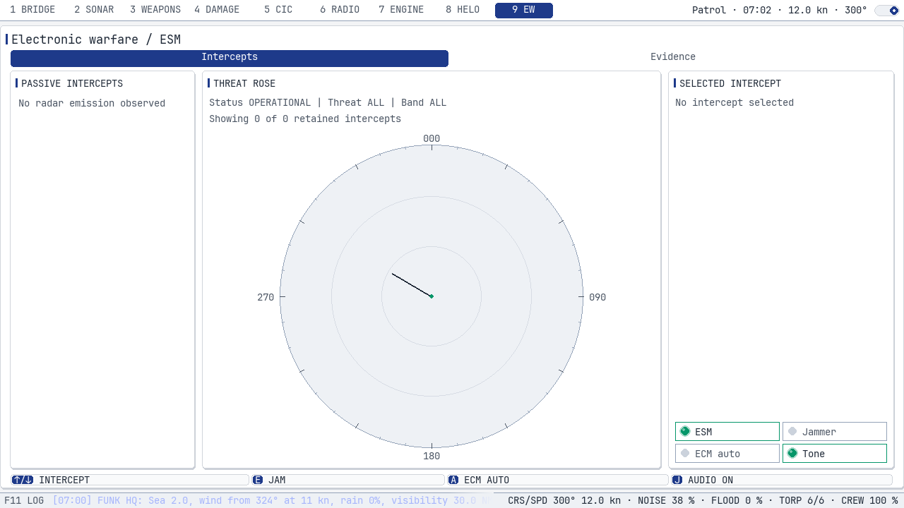

*Electronic warfare on the uConsole*

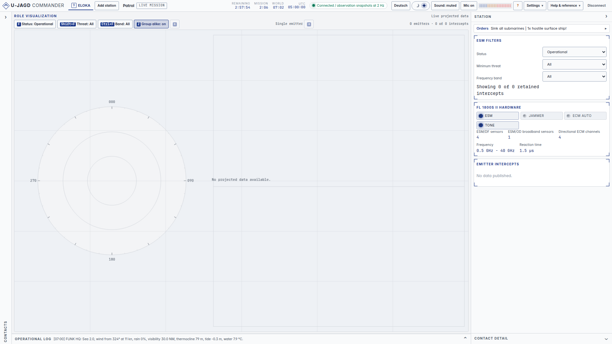

*Electronic warfare in the Remote Crew browser*

```text
 INTERCEPTS                       status  threat  band
 > E-07  brg 312  9.3 GHz  PRF 2.4k  NEW     HIGH    X
   E-04  brg 045  3.0 GHz  PRF 1.0k  TRACK   LOW     S

 EVIDENCE E-07
   frequency 9.3 GHz   PRF 2400 Hz   modulation pulse-doppler
   candidates (ranked, not identified):
     1. missile seeker     2. fire-control radar
   correlation: compatible with CIC track T-12 (time/bearing)
```

- Bearing accuracy is about +/-3 degrees. Intercepts are bearings, not positions.
- A rotating search radar reaches the ESM antenna with its main beam once per revolution; its side lobes are heard only close in. The evidence page shows the peak signal level, a range estimate that assumes the power class of the best candidate (a wrong candidate gives a wrong range) and the measured antenna scan period.
- By default (realism level Standard or Realistic, `F10`) the evidence page shows only the measured parameters and a library lookup: every emitter whose published frequency (and PRF) range contains the measurement, in name order, without score. Radar type, threat and range estimate are then yours to judge; `C` cycles the library in name order. At the Beginner level, candidates are ranked by frequency, PRF and modulation with a score, and radar type, threat and range estimate are filled in. A tie is not an identification.
- Correlation with radar or sonar tracks uses compatible time, bearing and observed position, never hidden identity.
- The emitter library includes the anti-ship missile seeker (9.0-9.5 GHz, PRF 1.8-3.2 kHz, pulse-Doppler). It radiates only in the last 18 NM and only once the sea-skimmer is above the radar horizon, and it matches an attack aircraft's fire-control radar just as well: the bearing trend and the air picture decide.
- ESM runs from the operations compartment: a destroyed operations room disables it.

Beside the intercept list a bearing rose shows every listed emitter as a strobe in its threat colour (older ones shorter and fainter), and lamps show ESM, jammer, automatic ECM and audio.

#### Sorting the list

Many merchants and aircraft transmit with navigation radars, so four switches above the rose order the list (clickable; the browser has the same bar):

| Switch | Key | Values |
|---|---|---|
| Status | `F` | operational (live, recent, classified or high threat), open (operational but not yet classified), live, memory, all |
| Threat | `Shift+F` | all, low and above up to critical (assessed on the Beginner level only) |
| Band | `Ctrl+F` | all, A/C, D, E/F, G/H, I/J, K |
| Group | `Z` | on: intercepts of one kind (same band and modulation, frequency and PRF within the association gates, bearing within 6 degrees) appear as one entry "E27 ×3"; off: every intercept on its own |

A group is a display aid, not an identification: it can merge several ships in one direction. `←`/`→` steps through its intercepts, the Group row on the right shows where you are ("2 of 4"). Classified and jammed intercepts always stand alone. Each card names the key (running number), the classification or else the modulation, then frequency, band, quality and age. Workflow: with status open, classify the not yet classified emitters one by one with `C`; classified ones leave that view.

### ECM techniques

| Technique | Effect |
|---|---|
| Noise | Masks the victim radar with broadband noise |
| RGPO | Range-gate pull-off: drags the seeker's range gate away |
| VGPO | Velocity-gate pull-off: drags the Doppler gate away |
| False targets | Injects false returns |

Automatic mode (`A`) picks targets and techniques and couples jamming with soft-kill (chaff) during a missile attack.

### Keys

| Key | Action |
|---|---|
| `Up / Down` | Select the next listed emitter (a group counts once) |
| `← / →` | Step through the intercepts of the selected emitter group |
| `F / Shift+F / Ctrl+F` | Cycle status (operational, open = not yet classified, live, memory, all) / minimum threat / frequency band |
| `Z` | Group intercepts of one kind and bearing into one entry on/off |
| `C` | Assign radar type and release current bearings to CIC; clearing the assignment withdraws release |
| `E` | Engage / release the directional ECM channel for the selected intercept |
| `Shift+E` | Cycle noise, RGPO, VGPO, or false-target ECM technique |
| `A` | Toggle automatic ECM prioritization and soft-kill coupling |
| `J` | Toggle local ELOKA contact sound |

### Mouse

Every key in the key bar at the foot of the station can be clicked; holding the button holds the key. Lamps, page tabs and key hints in the text are clickable too (chapter Tools, Mouse). In addition:

- A click on an intercept card selects it as `↑`/`↓` would.
- The four switches above the rose act like `F`, `Shift+F`, `Ctrl+F` and `Z`.

### Standard procedure

1. Watch new intercepts; filter by status, threat and band (F/Shift+F/Ctrl+F).
2. Select an intercept and compare candidate radar types.
3. Annotate the radar type (C); this releases the bearing to CIC.
4. Missile seeker locked: jam (E), choose the technique (Shift+E).
5. Use auto ECM (A) under saturation; jamming is a transmission.

### Pro tips

- Keep ESM running even under EMCON: it is completely passive.
- An intercept that changes from search to a high PRF pulse-doppler seeker at a steady bearing is a missile about to attack: warn Operations immediately.
- Assigning a radar type (`C`) releases the bearing to CIC; clearing the assignment withdraws it again.
- Jamming is a transmission. Use it deliberately, not continuously.
- Your own radar is heard too: a submarine at periscope depth (mast up, about 18 m) intercepts it on its ESM and can pass the bearing to other hostile units over its datalink. Deep submarines neither hear radar nor receive the datalink.

### Not modelled

- No communications intelligence (COMINT) or radio intercept; HF signals are handled by the radio room (HFDF).
- No decoy launchers other than chaff and no towed radar decoys.

## Submarine

### Overview

A second crew can play the submarine on the uConsole or in browsers (the lobby, `F9` or a new game as the submarine). The submarine has seven stations; each order is accepted only from the station that owns it, and an AI fills every free station when the crew assist is on. This chapter describes each station, its pages and standard procedure; the submarine's missions are in chapter Scenarios and missions.

As long as one of them is held, the living hostile submarine with the lowest number follows only that crew's orders; when the roles are released or the host revokes them, the AI takes the submarine back from where it is. A browser holds roles of one side only (frigate or submarine), never both; the lobby first asks which unit it plays.

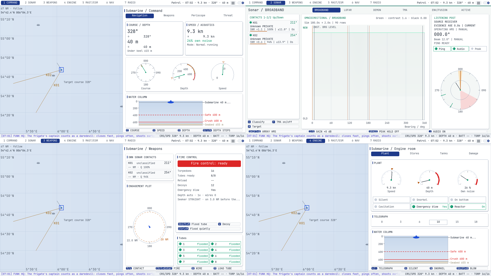

*Submarine stations on the uConsole at a glance*

| Station | Pages |
|---|---|
| 1 Command | Navigation, Weapons & contacts, Periscope, Threat |
| 2 Sonar | Broadband, LOFAR, DEMON, TMA, Environment, Active (as the frigate's sonar) |
| 3 Weapons | Tubes and fire control |
| 4 Engine room | Plant, Stores, Tanks, Damage |
| 5 Mast & ESM | ESM, Periscope |
| 6 Navigation | Chart & sounder, Navigation, Threat |
| 7 Radio room | Radio |

**Stations:** *Command* orders course, speed and depth, lies on the bottom, pings (`Shift+A`) and takes a BT (the BT in the browser; on the uConsole the sonar room takes it), and sees the whole submarine. *Navigation* orders course and depth, keeps the submarine's plot and watches keel and obstacles. *Engine room* runs the telegraph, snorkel, silent running, the trim and the emergency blow and watches battery and noise. *Mast & ESM* raises the mast and watches ESM and alarms; Command may raise it too, to look through the periscope. *Weapons* fires, guides the wires and launches decoys. *Sonar* is the submarine's sonar room. The *Radio room* copies HQ's broadcast and sends situation reports; it may raise the mast for its antenna. Each order is accepted only from the station that owns it.

**What the submarine crew sees:** its own submarine, the known chart, its own sonar measurements and its own torpedoes in the water. It never sees the frigate's position, its plot, its events or its mission messages; the frigate crew cannot tell a crewed submarine from the AI.

A save keeps the crew's orders, modes, mast, wires, plot, alarm bearings, ESM picture and radio log; after a load the submarine runs its last orders and waits up to ten minutes for its crew to take the stations again (every submarine station is re-leased) before the AI takes it back.

#### Playing the submarine on the uConsole

Every new game first asks **Which unit do you play?**: *Frigate F-217* or *Hostile submarine* (`Up`/`Down` or `1`/`2`, `Enter`; the last choice is preselected). Outside a mission, Options (`F10`) page 2 **uConsole plays** changes it as well, for example before loading a game. With the submarine the uConsole commands the hostile submarine instead of the frigate. The frigate is then crewed from the browsers through Remote Crew (`F9`); every frigate station no browser holds is crewed by the **AI hunters** (below).

The uConsole shows only the submarine's own picture; the frigate's banners, event log, sound cues, plot and tooltips never appear (the submarine's own lamp notes do), and its trackball and telegraph controls are disabled. The side can only be changed outside a mission; it lasts for this launch and is never saved, so every launch starts with the frigate.

On the uConsole `1` to `7` switch the stations and pressing the same number again (or `Page Up`/`Page Down`) turns the station's pages. Every station has a key bar at the bottom; a click on a key there, on a lamp or on a dial does the same as the key. The full key table is at the end of this chapter; the browser stations have the same orders as buttons.

The top bar shows the submarine's seven stations as tabs: `1` Command, `2` Sonar, `3` Weapons, `4` Engine room, `5` Mast & ESM, `6` Navigation, `7` Radio room (`Tab` or a click on a tab switches), and on the right the mission, the clock, speed, course and depth. Each order key works only at the station that owns it, as in the browser; elsewhere a banner names the right station. Browsers can crew the submarine's other stations at the same time; a station a browser holds is marked in the top bar and is not operated from the uConsole.

Every station but the sonar room is laid out like the Bridge: the chart on the left (known geography, the submarine's own plot, the ESM bearing lines and cross-fixes, the submarine with its ordered course and motion vector, the bearing lines of its own sonar contacts or their symbol while a ping or TMA fix is current, its own torpedoes `T1`…, a limited tube firing arc), the station on the right with a threat bar (torpedo alarm and active sonar heard with measured bearing, hull damage, cavitation, low battery, ESM radar intercept) and the station's page. The threat bar appears only while a threat is current: a heard ping or an ESM intercept fills it for 30 s; after that an amber triangle with the number of standing warnings sits in the top bar and the details stay on the Threat page.

Below are the submarine log and the submarine's telemetry, as a band or a status ticker as set in the options; orders, shots and decoys are logged there.

Keys that work at every station of the submarine (`F1` on the uConsole shows them first):

| Key | Action |
|---|---|
| `Tab / Shift+Tab` | Next / previous station |
| `1 … 7` | Stations: 1 Command, 2 Sonar, 3 Weapons, 4 Engine room, 5 Mast & ESM, 6 Navigation, 7 Radio room |
| `Active station number` | Press again to advance that station's page |
| `Page Up / Down` | Previous / next page of the station (every station with several pages) |
| `Ctrl+Enter` | Fire a torpedo (Weapons; periscope page: on the attack computer's solution; F: after bearing and distance). Enter alone never fires |
| `Shift+A` | Active ping with the submarine's own sonar (Command and sonar room) |
| `F1 / ?` | Help (this display) |
| `Shift+F2` | Crew assist: the AI mans every station nobody holds, on both units |
| `0` | Weather panel of the submarine (0 or Esc closes) |
| `F7` | Executive officer (optional language model) |
| `F9` | Open local Commander LAN administration |
| `F10` | Options: language, fullscreen, audio, large text, tooltips, frame rate |
| `F11` | Event log and full telemetry overlay (station stays live) |
| `S / L` | Save / load (slots 1-5; not in the sonar room) |
| `Alt+Enter` | Fullscreen (all stations) |
| `Esc` | Cancel input or open exit dialog |
| `R / M` | After the mission ends: restart with the same seed / main menu |
| `D` | After the mission ends: debrief with the truth beside what the crew knew (Space plays it back, Tab 10×/60×, Home/End start/end, B the language model's report when switched on) |

### Command

Command sees the whole submarine: chart, navigation, weapons and contacts, the periscope and the threat page. It orders course, speed and depth, lies on the bottom, pings, takes a BT and evades on the freshest alarm.

- **Navigation (page 1):** the chart with the submarine's own contacts and bearing lines, the course, speed and depth dials and the depth bar. `C`, `V` and `D` order course, speed and depth; `U`, `J` and `H` step to periscope, below-layer or deep depth (with `Shift` snorkel and above-layer depth); a click on a dial orders that value.
- **Weapons & contacts (page 2):** the tubes and the contact list as the Weapons station sees them, to follow the attack.
- **Periscope (page 3):** the view through the head at periscope depth with the mast up. `←`/`→` train it, `↑`/`↓` tilt it, `Q`/`E` switch low and high power, `Space` the stabilizer; `Enter` takes a stadimeter range of the sighting under the crosshair and `Ctrl+Enter` fires on the attack computer's solution.
- **Threat (page 4):** the freshest pings, torpedo noises and radar intercepts with their bearings. `I` evades the freshest alarm, `Ctrl+B` clears the baffles, `G` calls action stations.
- Command pings with `Shift+A` on the uConsole and in the browser. The BT is taken by the sonar room on the uConsole (`2`, `E`); in the browser Command can take it too.

**Depth steps and displays:** Command and Navigation order depth in one step: periscope depth (15 m, keeps the mast usable), snorkel depth (submarines with a snorkel), above or below the layer (15 m above / 30 m below; only after the submarine's own BT measurement, since the crew knows the layer only from it) and deep (the safe depth over the charted bottom). On the uConsole these are `U`, `Shift+U`, `Shift+J`, `J` and `H`.

The browser shows the water column (surface, periscope depth, measured layer, ordered, safe and crush depth, seabed, the submarine and its dive direction), large readouts for course, speed, depth and battery with coloured mode and alarm chips, and an ESM rose with each emitter's strobe and the ping and torpedo alarm bearings; the uConsole's Mast & ESM page has the same rose. Mast, snorkel, silent running and lying on the bottom have separate on and off buttons.

**Navigation** (Command page 1 and Navigation page 2) shows course and depth, water under the keel and any charted obstacle ahead, speed, own noise, battery and the active modes, below them a row of round dials for course (the ordered course as an amber mark), depth (amber beyond test depth, red beyond crush depth) and speed as on the frigate's bridge, and the water column under the submarine: submarine depth, ordered depth, safe depth and seabed; the layer appears there only after the submarine's own BT measurement (`E` at the submarine sonar).

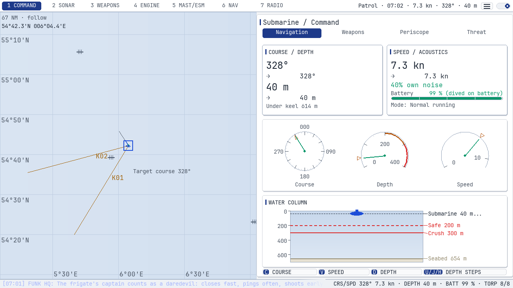

*Submarine command on the uConsole*

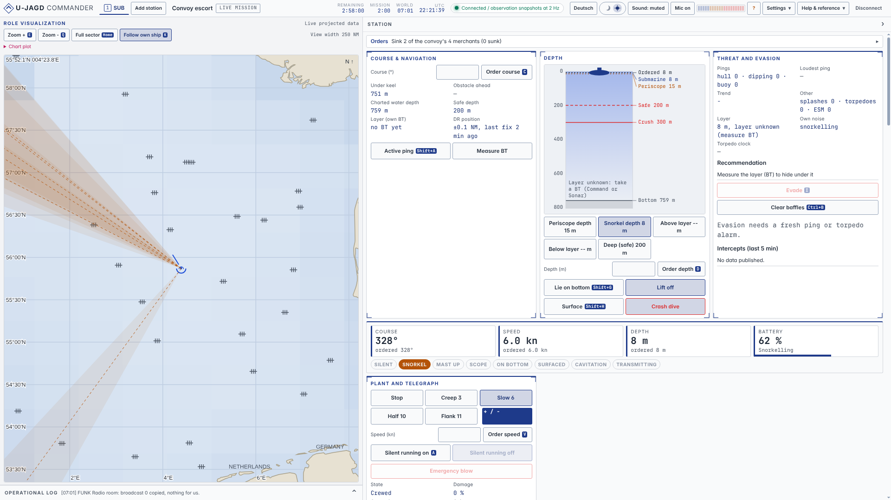

*Submarine command in the Remote Crew browser*

#### Periscope, stadimeter and attack computer

With the mast up the **periscope** page (Command page 3, Mast & ESM page 2; `P` raises the mast at both) shows the eyepiece in the start screen's look: sky and sea in the light of the hour (day, dusk, night with stars and the moon), clouds, rain, snow and fog from the weather, the horizon moving with the sea, a true-bearing scale and a crosshair; the scope trains in 2° steps (`←`/`→`, `Shift`: 10°). Everything the optics make out within the frigate lookout's contrast model at 2.5 m eye height (day/night, moon, visibility, sea state, land in the way) appears as a silhouette and as a bearing-only **sighting** with a coarse class (warship, merchant ship, vessel, aircraft, torpedo wake) and its apparent length; the log reports each new sighting. Neutral ships show their navigation lights here as on the bridge's binoculars. Made-out ships, submarines and aircraft appear as turned 3D models as in the binoculars, at the full length their apparent length and the judged angle on the bow give, each as the model of its real type; the crew's sighting still names only the coarse class.

`↑`/`↓` tilt the head 2° (`Shift`: 10°, from 10° down to 60° up, for aircraft), `Q`/`E` switch between low power (32° field) and high power (8°) as on the frigate's binoculars, and `Space` switches the stabilizer; tilt and field stand in the corner of the picture. These settings belong to the eyepiece of the uConsole or of each browser, change only the picture (not what the optics detect) and are not saved. A helicopter in sight hangs at its true elevation above the horizon in the still sky, behind the clouds. Underway the water streams past just below the eyepiece with the submarine's own speed (toward the eye looking ahead, from bow to stern looking abeam). A ship with a stadimeter range stands that far below the horizon as the low eye sees her waterline (hardly a tenth of a degree at 0.5 NM), a nearer ship in front of a farther one.

`Enter` reads the **stadimeter** on the sighting under the crosshair: the range follows from its apparent length and the assumed hull length of the class (130 m for a warship or an unrecognized vessel, 150 m for a merchant), so an unrecognized or bow-on target reads long; the reading is ±25 % and becomes a VISUAL fix on the submarine's sonar contact of that target for 120 s, usable for a shot like a ping fix. Aircraft and wakes cannot be ranged.

Each reading is also a **mark** for the **attack computer**: from two or more marks at least a minute apart (the last six within 15 minutes) it fits the target's course and speed in a straight line and, with the torpedo's speed, shows the lead angle (left or right of the bearing) and the running time under the periscope (browser: the Solution column); the quality grows with the time between the first and last mark (full at 5 minutes) and the number of marks. `Ctrl+Enter` on the periscope page (browser: Fire on solution, Command only) fires on the solution of the sighting under the crosshair: the torpedo runs on the intercept course to the point where target and torpedo meet. A shot at the sonar contact of a marked target uses the solution as well. A target turning after the last mark leaves the solution behind; a faster fit than 40 kn is rejected as a bad mark. The marks are part of the saved game.

The charted coast stands on the periscope's horizon as far as its low optics see land (hills assumed 25 to 70 m). Command can also ping and take a BT without a sonar operator. The chart shows the tube firing arc where the tubes cannot fire all round, and the sonar room's assigned target is preselected for the shot.

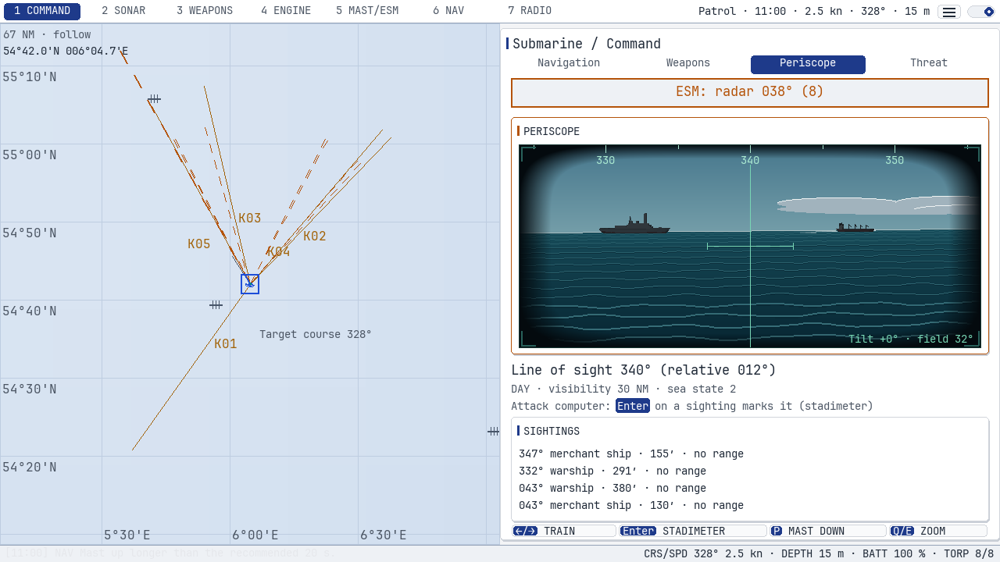

*Periscope by day*

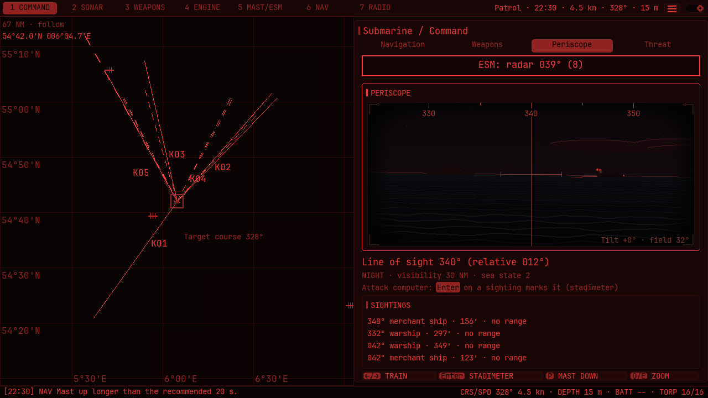

*Periscope at night*

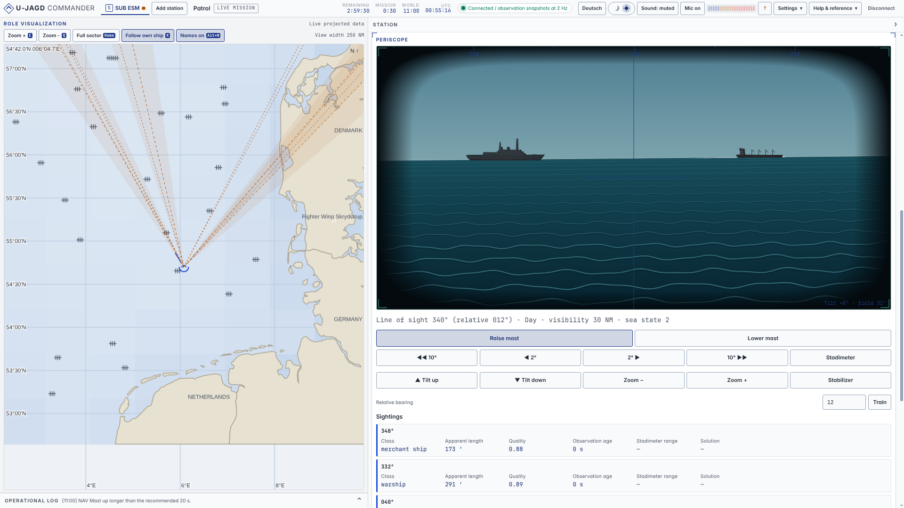

*Periscope in the Remote Crew browser*

#### Threat page and evasion

**Situation picture:** an intercepted active ping or torpedo is logged with the bearing the submarine's own ears measured (a few degrees off) and shown with its age in the alarms. At periscope depth the **mast** can be raised; its ESM then reports the radars sweeping the submarine with bearing (log and ESM list), and the mast lowers by itself when the submarine goes deeper.

The submarine's sonar room tells an intercepted active ping by its frequency as the frigate's hull sonar, a helicopter's dipping sonar or a sonobuoy, and logs it with the measured bearing and the received level (dB re 1 µPa, from source level, spreading and absorption); a buoy pinging within 12 NM is heard only by a crewed submarine. A buoy splashing into the water within 4 NM is heard with a rough bearing (±6°); a salvo from the frigate's ASW rocket launcher splashing in within 3 NM is reported with its bearing while its charges sink (about 11 m/s), time to change depth or get out from under them; and a torpedo alarm is kept with its bearing.

The **Threat** page (Command page 4 and Navigation page 3; the browser's Threat card at Command and Navigation) counts the pings of the last 5 minutes by source, gives the loudest level with its assessment (from 150 dB the pinger probably holds an echo) and the trend of the last two pings (rising: closing in), splashes, torpedo alarms and ESM emitters, the submarine's own signature (depth against the measured layer, own noise: cavitating, snorkelling, loud, moderate or quiet, the mast) and the crew's recommendations. The chart draws each intercept of the last 2 minutes as a dashed bearing ray.

**Evade** (`I` at Command or Navigation, the browser's **Evade** button) gives the crew's evasion order for the freshest alarm (under 2 minutes): against a torpedo, the smaller turn that puts it 150° on the quarter, full speed and a decoy; against active sonar, the stern to the pinger, silent running at 3 kn. Both cross the measured layer (down when above or in it, up when below it), or go deep without a BT; the submarine lifts off the bottom first. The order goes through the same checks as the single keys, and the page shows it before it is given. The picture is display only and not saved.

1. Take over at periscope depth with the mast down; read the threat page and HQ's order before moving.
2. Once the frigate, its sonar or a helicopter is heard: below the layer (J), slow and silent running (A).
3. Build the attack: Sonar holds the bearing, Weapons gets a range from TMA, ping or stadimeter.
4. Come up to periscope depth slowly and quietly; raise the mast (P) only for short looks.
5. After a ping or torpedo alarm evade at once (I); clear the baffles (Ctrl+B) before turning back.

### Sonar

The submarine's sonar room works like the frigate's, without towed array, OPZ release, plot and telegraph. The hull sonar is deaf in the baffles astern.

- The six pages and their keys are those of the frigate's sonar (chapter 2 Sonar): broadband waterfall, LOFAR lines, DEMON shaft rate, TMA, environment with BT, active pings with `Shift+A`.
- The hull sonar listens at the submarine's own depth: above the layer it hears surface ships well, below it it is shielded from them. Astern lies the deaf baffle sector, so ask Command for a baffle clearing now and then.

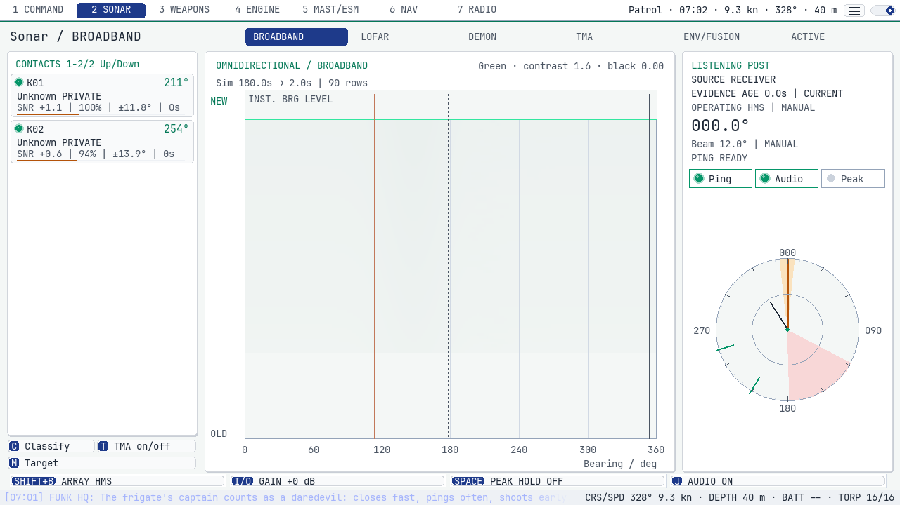

*Submarine sonar*

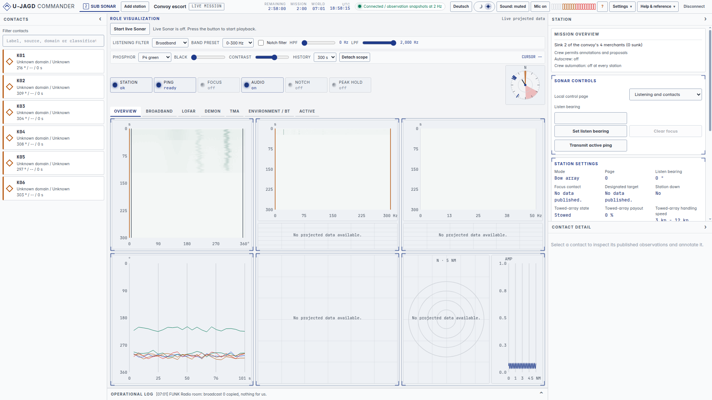

*Submarine sonar in the Remote Crew browser*

1. Search broadband all round; give every new contact a number and watch its bearing drift.
2. Listen on the strongest contact with the filters and classify it by its lines.
3. Astern the hull sonar is deaf: ask Command for a baffle clearing every 20 to 30 minutes.
4. Report pings and torpedo noise at once; their bearing is the base of every evasion.
5. Ping only to finish an attack: the frigate hears every ping and gets your bearing.

### Weapons

Weapons loads and floods the tubes, sets run depth and salvo, fires at a selected contact or down an entered bearing, steers the wired torpedoes and launches decoys. The page has two columns beside the chart: contact cards (a click selects one) above the engagement plot, and fire control above the tube lamps. The fire-control box shows the seeker setting of the next shots; at the Weapons station a click on its red fire plate fires like `Ctrl+Enter`. Below the presets its key chips flood the next dry tube (`Shift+M`, quietly `Ctrl+M`) and launch a decoy (`V`), and a click on a tube lamp loads an empty tube (`M`) or floods a dry one (`Shift+M`).

- **Tubes:** each tube is empty, loaded (dry) or flooded; only a flooded tube fires. `M` loads the next empty tube, `Ctrl+M` floods the next loaded one slowly (60 s, hardly audible), `Shift+M` fast (20 s, loud).
- **Fire control:** `↑`/`↓` pick a contact with a fresh range, `T` sets the run depth, `Y` single shot or two-torpedo spread, `X` the seeker pattern and `,`/`.` the enable point; `Ctrl+Enter` fires. `F` fires without a contact: type the bearing and `Enter`, then the distance to the datum (blank: 10 NM down the bearing) and `Enter`, and `Ctrl+Enter` fires; `Enter` alone never fires.
- **Wire and decoy:** `W` steers the newest wired torpedo onto a new bearing, `Shift+W` cuts its wire; `V` launches a decoy.

**Weapons** (page and Weapons station) shows fire readiness, torpedoes, tubes ready (flooded), reload, decoys, emergency blow, a line with the tubes that are not ready (`M` loads the next empty tube, `Shift+M` floods the next dry one, `Ctrl+M` floods it slowly and quietly) and the submarine's own sonar contacts (bearing, range where known, and quality in percent: the better of the signal quality and the track confidence, 100 % being a firm contact), below them the engagement plot of the selected contact, drawn like the frigate's engagement sketch (torpedo reach, bearing, estimated position, intercept point and torpedo run, from the submarine's own observation only).

**Orders and weapons:** the submarine follows course, speed and depth orders within its turn, depth and acceleration limits; telegraph steps (stop, 3, 6, 10, 15 kn, maximum) set the speed quickly. Fires a torpedo down a sonar contact's measured bearing, with its ping fix or TMA solution while current, or down a free bearing with an optional range; firing needs a flooded, loaded tube and the target inside the tube arc.

**Tubes:** the crew takes over with the loaded tubes flooded. A fired tube stays empty until the torpedo gang loads it from the racks, if any torpedo is left there (`M` at the Weapons station, browser: Load; every submarine carries at least as many reloads again as it has tubes, and loading takes 2 min on a nuclear submarine, 3 min on a conventional one and 4 min on the older diesel classes, slower in stale air); a loaded tube is dry and must be flooded before it fires, which opens its outer door, takes 20 s and is audible for 4 s like a short transient that the frigate's sonar hears out to 8 NM (`Shift+M`, browser: Flood); slow flooding takes 60 s and is heard only within 1.5 NM (`Ctrl+M`, browser: Flood quietly). The Weapons station and the browser list each tube as empty, loading, dry, flooding or ready, and the log reports every tube loaded and flooded. The AI's submarines load and flood by themselves: quietly and early once they hold a fix on the frigate within 15 NM, loudly and just before the shot when they must fire on dry tubes.

The crew sets the run depth (5-300 m, otherwise a shallow default) and fires one torpedo or two in a ±4° spread, each with its own datum. Every crew torpedo runs on a wire: the crew can move its datum (bearing and distance from the submarine) and the wire turns it onto the new datum until its seeker acquires; faster than 10 kn or turning harder than 1.5°/s for 5 s breaks the wire, as does running out of either spool, and the crew can cut it. Launches a decoy and blows main ballast in an emergency (three times on a full air store).

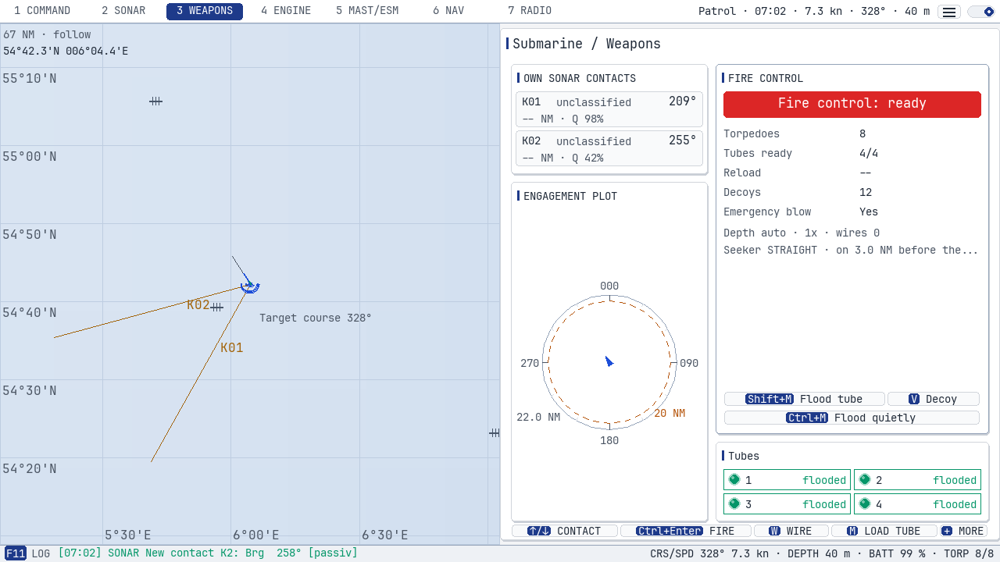

*Submarine weapons*

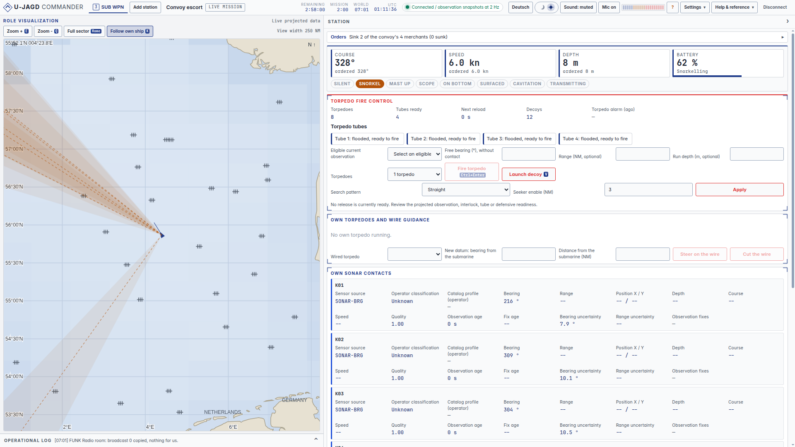

*Submarine weapons in the Remote Crew browser*

#### Torpedo seeker

- `X` steps the search pattern of the next shots: straight (as before), snake, circle or helix. The torpedo runs straight to the datum; once its seeker is on and it has found nothing, it searches in that pattern.
- `,` and `.` move the enable point between 0.6 and 3.0 NM before the datum in 0.2 NM steps (default 3.0 NM). A late enable point keeps the seeker blind longer, so decoys and other ships on the way are not taken.
- A torpedo in the water keeps the settings it was fired with; the browser's Weapons card sets both with **Apply**.

1. Load tubes (M) and flood them early and slowly (Ctrl+M); fast flooding (Shift+M) is loud.
2. Before the shot set run depth (T), salvo (Y), search pattern (X) and enable point (, / .).
3. Pick a contact with a fresh range and fire with Ctrl+Enter, or down an entered bearing (F).
4. Steer the wired torpedo (W) onto new bearings; cut the wire (Shift+W) before hard manoeuvres.
5. Against a torpedo launch a decoy (V) and reload at once.

### Engine room

The engine room runs the telegraph, snorkel and charge rate, silent running, the trim tanks and the emergency blow, keeps the air breathable and leads the damage-control teams.

- **Plant (page 1):** telegraph (`+`/`-`), silent running (`A`, at most 5 kn), snorkel (`N`) and the battery, diesel and motor readings.
- **Stores (page 2):** battery, fuel, carbon dioxide and oxygen. `R` cycles the snorkel charge rate (full, half, air only), `Shift+O` fits a fresh absorber set, `O` lights an oxygen candle.
- **Tanks (page 3):** regulating and trim tanks. `↑`/`↓` pump out or flood the regulating tank, `←`/`→` move trim water, `Z` switches the automatic trim; `Shift+B` is the one emergency blow.
- **Damage (page 4):** the compartments with water, leaks, fire and gas. `↑`/`↓` pick a compartment, `←`/`→` a task, `Enter` sends team 1 (`Shift+Enter` team 2), `I` shuts or opens its bulkheads; `W`, `M` and `U` relieve the watch, send the medical team and re-man the worst-hit station.

The **Engine room** is a control console: round gauges for speed (the ordered speed as an amber mark), battery (depth on a nuclear submarine) and own noise, lamps for silent running, snorkel, on the bottom, cavitation, emergency blow and the plant state, and the telegraph steps.

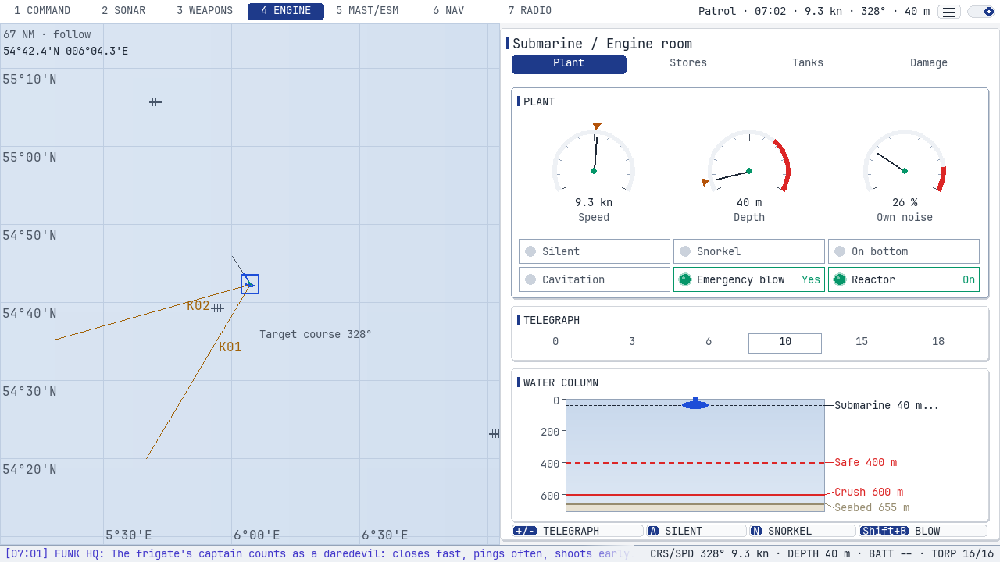

*Submarine engine room*

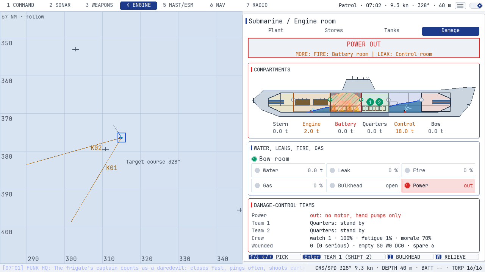

*Submarine damage control (engine room, page 4)*

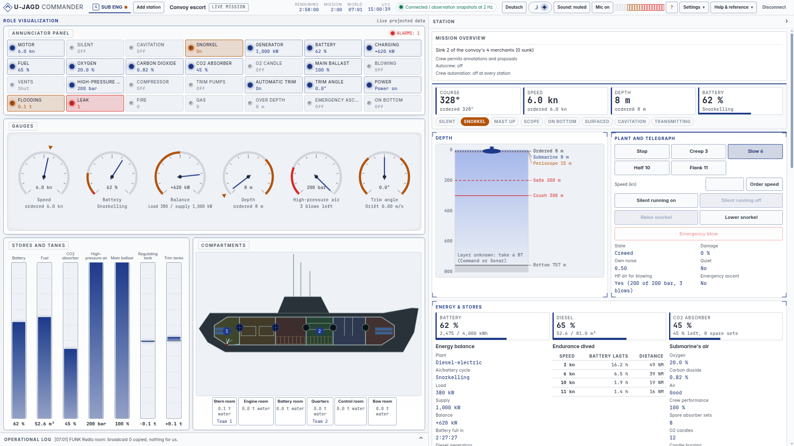

*Submarine engine room in the Remote Crew browser*

#### Plant and stores

**Plant and submarine modes:** a crewed submarine never goes up, snorkels or calls home by itself. The battery drains with speed and hotel load; below 20 % the log warns, and an empty battery limits the speed to what the plant can serve (an AIP plant still takes over the load by itself).

**Snorkel** runs the diesels at snorkel depth and charges the battery, at most 6 kn; diving deeper shuts the head valve. The running diesels are loud: +12 dB radiated level, a lower quiet factor and two firing lines at 50 and 100 Hz in the submarine's LOFAR signature (AI submarines too). **Silent running** limits the submarine to 5 kn and makes it as quiet as a lurking AI submarine. **Lie on bottom** stops the submarine 3 m above the seabed where the water is no deeper than test depth: silent and no drift; any speed or depth order lifts off. The submarine stops short of land or a seamount instead of turning away, and the log warns in shallow water.

**Energy and stores:** the engine room's **Energy & stores** (browser card, uConsole Engine room page 2 **Stores**) shows the energy balance at the present speed (load, supply and net kW, the time until the battery is empty or full), the battery and AIP oxygen, the diesel bunkers and a table of how long the battery lasts dived at each telegraph step and how far that carries the submarine (on the uConsole tank columns for battery, AIP oxygen, diesel and absorber and a bar per telegraph step).

**Diesel:** the bunkers hold 300 hours of the generators' full output and a patrol starts with 65 %; only the running diesels burn it (0.27 l per kWh), the log warns at 10 %, and with dry bunkers snorkelling no longer charges. The **charge rate** sets what snorkelling does: *full* (the whole generator output, +12 dB and both diesel lines), *half* (half the output, +9 dB, weaker lines) or *air only* (the fans without diesels, +4 dB, no lines).

**Air:** dived, the crew uses oxygen and breathes out carbon dioxide (about 0.45 % per hour each); a CO2 absorber set takes CO2 out until it is spent (8 spare sets), an oxygen candle adds 1 % O2 over 15 minutes (12 aboard, one at a time), and snorkelling flushes the submarine toward fresh air within minutes. From 3 % CO2 or below 18 % O2 the air is stale, from 5 % CO2 or below 16 % O2 it is foul; the log warns at each step. Stale air slows the crew (down to 30 % performance), and the torpedo gang reloads accordingly slower. AI submarines manage their air by themselves and come up to air the submarine when it turns foul. A nuclear submarine has none of these stores.

The Engine room's second page **Stores** shows energy, endurance and air; `R` cycles the charge rate, `Shift+O` fits an absorber set and `O` lights an oxygen candle.

#### Tanks, trim and air

The engine room's **Tanks & trim** (browser card with a cross-section of the submarine, uConsole Engine room page 3 **Tanks**) shows the main ballast, the regulating tank, the trim tanks, the high-pressure air and the trim the submarine is in.

Every weight change moves the submarine off neutral: a torpedo leaving a bow tube makes it 1.5 t lighter and bow light, water in flooded compartments (see damage control) makes it heavier and trims it toward the flooded end; the automatic trim takes up what its tanks can of that weight and moment. With the **automatic trim** on, the engineer pumps the regulating tank (±8 t, 25 kg/s) and the trim tanks (±3 t fore and aft, 15 kg/s) back to neutral; by hand, each order moves the regulating tank 0.5 t or the trim water 0.25 t (and switches the automatic off). Running trim pumps are audible (+3 dB and a 120 Hz line). Whatever the tanks cannot take up sinks or lifts the submarine by 0.03 m/s per tonne, and a trim angle (1° per tonne of moment, + bow down) drives it down or up with speed; the hydroplanes hold that only with way on, so a heavy submarine hovering at low speed sinks below its ordered depth; the log warns from 2 t and from 3°.

The **high-pressure air** (200 bar) holds three emergency blows of 60 bar each; a blow empties the main ballast in 20 s and the submarine rises to 10 m and stays there, the ordered depth reset to 10 m. The next order below 12 m opens the vents: the main ballast floods in 40 s before the submarine can dive. Snorkelling on the diesels runs the compressor (0.05 bar/s); with the air only on the fans it does not. Without power neither the trim pumps nor the compressor run. The AI's submarines keep themselves trimmed and keep their one legacy blow.

Its third page **Tanks** shows the cross-section, main ballast and air, the tanks with their orders, weight, trim angle, drift without planes, flooding and pumps; `↑`/`↓` pump out or flood the regulating tank, `←`/`→` move trim water aft or forward and `Z` switches the automatic trim.

#### Damage control

Its fourth page **Damage** is a cutaway of the submarine from stern to bow (sail, casing and the pressure hull with its fittings; water tilted by the trim, fire and smoke, chlorine haze, a leak with water rushing in, round bulkhead doors with a cross when shut, team badges; each compartment's name and water in tonnes below), lamps with the selected compartment's water, leak, fire, gas, bulkheads and the power, and both teams; `↑`/`↓` pick a compartment, `←`/`→` a task, `Enter` sends team 1 and `Shift+Enter` team 2 there with that task, and `I` shuts or opens the compartment's bulkheads.

The engine room's **Damage control** (browser card with a damage-control lamp panel, a side view of the pressure hull with water, fire glow, gas haze, leaks, shut bulkheads, a state lamp per compartment and the team badges, gauges for trim, floodwater and high-pressure air, then the table; uConsole Engine room page 4 **Damage**) divides the pressure hull into six compartments: bow room, control room, quarters, battery room, engine room and stern room.

A hit on the crewed submarine holes the compartment it strikes (a leak of 1.5 % per % of hit damage, up to a full hole; from 50 % damage the neighbour too, with half the leak) and may start a fire there (chance = damage / 150); a hull failure below test depth holes it as well (see Below test depth). Water comes in at 40 kg/s through a full hole at 100 m, growing with the square root of depth; above half a compartment it spills into open neighbours (20 kg/s) and smothers a fire. A fire grows to full in 2 min and then spreads through open bulkheads; seawater in the battery room (from 2 t) gives off chlorine gas that drifts through open bulkheads and clears slowly once the battery is dry. Water in the battery room (from 5 t) or a fire there cuts the **power**: the motor stops (no way on, so the hydroplanes do not hold a heavy submarine), and the trim pumps, compressor and electric bilge pumps stand still.

**Shutting the bulkheads** of a compartment keeps water, fire and gas in it and starves a fire there in 3 min. Two **damage-control teams** walk the submarine (8 s per compartment) and **seal a leak** (a full hole in 60 s), **pump out** (30 kg/s, a quarter by hand without power) or **fight a fire** (a full fire in 60 s); in gas they work at half rate, and in a compartment 90 % full they can only pump. A compartment half full of water, half on fire or half gassed takes its station out: the bow room the torpedo tubes, the control room the mast and periscope, the engine room the diesels, the stern room half the top speed. The floodwater is weight and moment for the trim (see above); a submarine that sinks below 1.5 x test depth is crushed. The log reports leaks, fires, sealed leaks, fires out, flooded compartments, chlorine and power.

#### Below test depth

The crew may order the crewed submarine below its test depth, down to crush depth (1.5 x test depth); the "deep" step and lying on the bottom stay at the safe depth. The uConsole's and the browser's depth columns mark the crush depth, and while the submarine is below test depth Command on the uConsole shows a red **BELOW TEST DEPTH** alarm and the browser a red alarm chip, both with the test and crush depths. From 90 % of test depth the hull fatigues as before (one failure in about 30 min at test depth); below test depth failures come far faster, growing with the square of the excess: about one every 6 min at 110 %, one a minute at 125 % and one every 20 s at 140 %.

Each failure is one of three: **sheared bolts** of a fitting (a quarter leak in a random compartment, 6 % damage), a **failed seal** of a shaft or valve (half a leak in the engine or stern room, 12 % damage) or a **cracked pressure hull** (a full leak and a 60 % leak in the neighbour, 30 % damage). Just past test depth a crack does not happen; its chance grows by 15 % per 10 % of excess, up to 60 %, and a seal fails in 30 % of the rest. The log reports every failure with its compartment, and at crush depth the hull collapses and the submarine is lost. The AI's submarines keep to their test depth.

#### Engine-room console in the browser

In the browser the Engine room's picture area is a machinery control console instead of a chart. An **annunciator panel** of status lamps shows every plant state at a glance: dark when off, turquoise while running, amber for a caution and flashing red for an alarm, each with its value (motor, silent running, cavitation, snorkel, generator, battery, charging, fuel, oxygen, carbon dioxide, absorber, oxygen candle, main ballast, blowing, vents, high-pressure air, compressor, trim pumps, automatic trim, trim angle, power, flooding, leak, fire, gas, over depth, emergency ascent, on the bottom); the master lamp in its plate counts the alarms and cautions.

Below it are round **gauges** for speed, battery, energy balance, depth (test to crush depth in amber), high-pressure air and trim angle with the ordered value as an amber mark, **tank columns** for battery, fuel, AIP oxygen, absorber, high-pressure air, main ballast and the regulating and trim tanks (these from their middle: up heavy, down light), and the **compartment cutaway**: the submarine drawn in section from stern to bow (casing, sail with masts, the pressure hull with its fittings) with the water in each compartment tilted by the trim, fire and smoke, chlorine haze, a leak with water rushing in, the round bulkhead doors (a cross when shut) and the teams at work, with each compartment's name, water and teams below it. A nuclear submarine shows no battery, diesel or air stores. The console only shows; the orders stay in the station panel on the right.

1. Keep the battery charged: snorkel (N) at night or in poor visibility, charge rate (R) to suit the threat.
2. Silent running (A) whenever the frigate is close: at most 5 kn.
3. Watch carbon dioxide and oxygen on the stores page; fit an absorber (Shift+O) or light a candle (O) in time.
4. Leave the trim on automatic (Z); trim by hand only for a silent hover.
5. On damage send the teams (Enter), shut bulkheads (I); blow (Shift+B) only as the last resort.

### Mast & ESM

Mast & ESM raises the mast at periscope depth, listens for radars on the ESM rose, classifies the emitters, plots cross-fixes and looks through the periscope. A click on a row of the emitter list selects that emitter, like ↑/↓.

- **ESM (page 1):** with the mast up (`P`, only at periscope depth) the rose shows every radar heard with its bearing and level. `↑`/`↓` pick an emitter, `C` (or `→`; `Shift+C` or `←` back) classifies it from the library (an annotation, never the truth), `Enter` puts its cross-fix or bearing line into the submarine's plot. A main-beam hit means the radar may already see the mast.
- **Periscope (page 2):** the same periscope as Command's page 3, without the shot.

**Mast & ESM** shows the mast time, the rose, the emitter list and the selected emitter (signal, level and trend, cross-fix, classification); its second page and Command's third are the **Periscope** (eyepiece, line of sight, light and the sightings list; `←`/`→` train, `Enter` stadimeter).

With the mast up at periscope depth the submarine's own ESM antenna (3 m above the water) hears the radars around it once a second: the frigate's, other ships' and aircraft radars inside the radar horizon, over land only where the coast does not block the line. The frigate's helicopter radiates its X-band search radar while it flies and is not dipping (antenna at 150 m), the patrol aircraft its frequency-agile search radar while the OPZ has it switched on. Each intercept carries the measured bearing (±4°), band, carrier frequency, PRF, modulation and received level, never the emitter's identity or position.

The crew keeps an **emitter list** (`E1`, `E2` …) across mast periods: an intercept joins an emitter when bearing, band and waveform agree (a frequency-agile radar by bearing and band only), and the list forgets an emitter 30 minutes after its last intercept. **Classification** is the crew's annotation from the library: the emitters whose published frequency and PRF ranges hold the measurement, up to 16, best fit first: each entry shows its fit (**good**, **fair** or **poor**: frequency and PRF near the middle of its ranges and the same modulation fit best), entries of one grade stand by catalogue key, and the list only reorders when a grade changes; the choice sets the power class for the **range estimate** from the level (unclassified: the shortest range the library allows). Every 30 s each emitter keeps a **bearing** from the submarine's own position (20 minutes); the chart shows the latest bearing lines, and once the submarine's own motion has swung the bearing by at least 8°, the **cross-fix** is their best crossing with a 95 % error ellipse that allows for an emitter drifting up to 8 kn since each line (a fast frigate usually gives none; a fix whose lines disagree is marked). The **level trend** reads rising, steady or falling over five minutes.

The **scan period** is the time between an emitter's main-beam hits (the level peaks; close in, the weaker side lobes are heard in between and do not count), measured only on the emitter's own waveform, over gaps up to 12 s with no washed scan between them, and read after 8 s: **rotating** with its period (about 2.5 s for a navigation or surface-search radar, 5 s for an air-search radar, 2 s for a multi-function radar) is a search radar sweeping past; **steady** (the beam on the mast at every scan) is a tracking or fire-control radar. A steady, live emitter is always a mast warning, and the log reports once when an emitter turns steady.

The **mast warning** ("radar can see the mast") comes when a live search radar's estimated range is inside the range at which a surface radar sees a raised mast in this sea and rain (the weather page's value); the **recommended mast time** is 60 s in a calm sea, up to 300 s when sea clutter hides the mast and 20 s under that warning, and the log reports when it is exceeded. From sea state 3 waves wash over the antenna and some scans hear nothing.

The browser's Mast & ESM card has the rose, the emitter table and the selected emitter's evaluation; **Transfer to plot** puts the cross-fix (mark and error circle) or else the latest bearing line into the submarine's plot. On the uConsole's Mast & ESM page `↑`/`↓` select an emitter, `C` or `←`/`→` (`Shift+C` back) step through its library classification and `Enter` transfers it to the plot. A raised mast pulls a feather that the lookout, the helicopter and the patrol aircraft see by eye (see the bridge chapter): going slow keeps it small, and when the submarine runs faster than 5 kn with a mast up, the crew warns "feather visible, reduce speed".

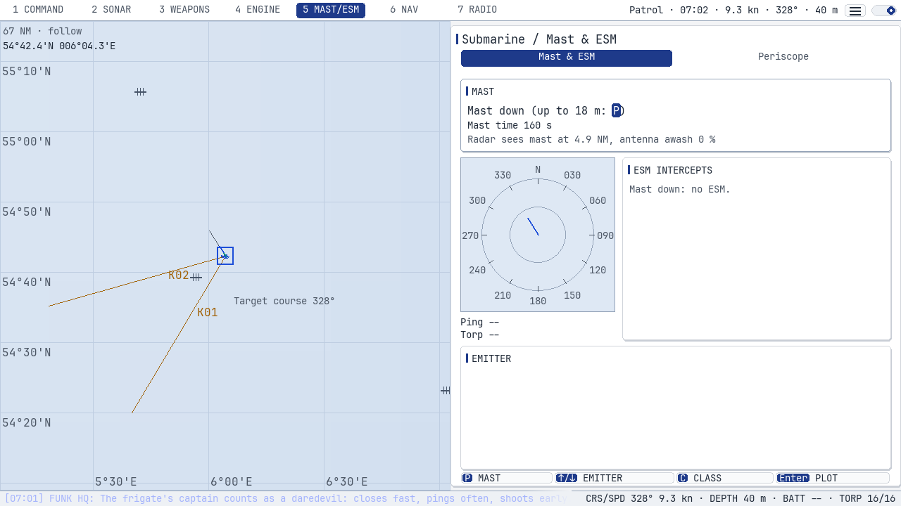

*Mast & ESM*

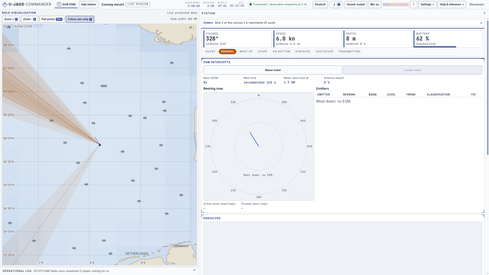

*Mast & ESM in the Remote Crew browser*

1. Raise the mast (P) only at periscope depth and only for a short time.
2. Watch the ESM rose: a main-beam hit means the radar may already see the mast.
3. Classify each emitter (← / →) and send cross-fixes to the plot (Enter).
4. Lower the mast at once when a helicopter or aircraft radar gets stronger.
5. On the periscope page take stadimeter ranges for the attack computer (Enter).

### Navigation

Navigation orders course and depth, watches keel and shoals on the pilot chart and the echo sounder, keeps the dead reckoning and steers the route.

- **Chart & sounder (page 1):** the pilot chart around the submarine with soundings, shoals and land, the echo sounder with water under the keel and the DR position lamp. A left click orders the course to that point.
- **Navigation (page 2):** the tactical chart as on Command's page 1; a right click adds a route waypoint, `W` lays a zigzag or expanding-square search, `Backspace` clears the route.
- **Threat (page 3):** as Command's threat page; `I` evades, `Shift+G` lies on the bottom in shallow water.

The Navigation station opens on its own page **Chart & sounder**: four readouts (depth, sounding under the keel, keel clearance, the chart check ahead), a pilot chart of ±6 NM centred on the submarine, north up (the charted depth in shades with contour lines at 20, 50, 100, 200, 500, 1000 and 2000 m, water shallower than the keel limit red and within 30 m of it amber, land, charted hazards, range rings every 2 NM, the submarine's wake over the last 10 minutes, the ordered course out to the 5 NM check with a tick every 5 minutes at the present speed and a red cross on an obstacle ahead; a click on the chart orders the course to that point, as typed with `C`) and an **echo sounder** strip: the seabed and the submarine's own depth over the last 10 minutes (one sounding every 5 s), the keel clearance drawn amber under 30 m and red under 15 m, and on the right the charted profile along the ordered course out to 5 NM with the ordered depth; the header names the least clearance of the 10 minutes.

The trace is display only, is not saved and starts empty after a load.

**Plot:** in the browser Command and Navigation keep the submarine's own grease-pencil plot (marks, rulers, bearing lines, circles, DR lines). On the uConsole the submarine side has no drawing tools (`P` works the mast there), but `Enter` on the Mast & ESM page puts a cross-fix or bearing line into the plot, and every station's chart shows the plot. The frigate never sees it; the plot is saved with the game.

The navigation display shows the water under the keel and checks the chart along the ordered course up to 5 NM: land or a seabed shallower than the submarine is reported as an obstacle ahead, in the log and as a warning. Only charted geography counts; other vessels are not in the check.

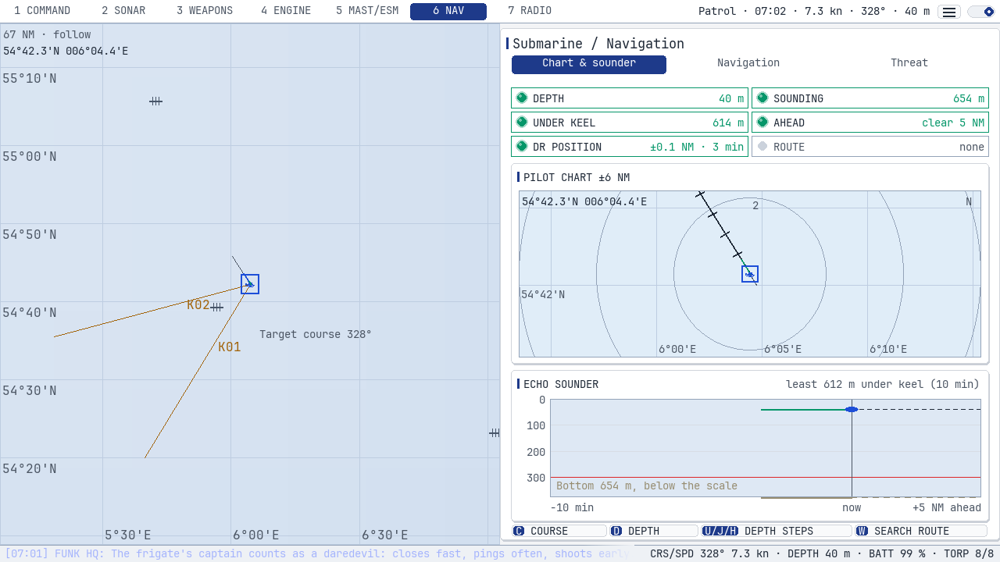

*Submarine navigation*

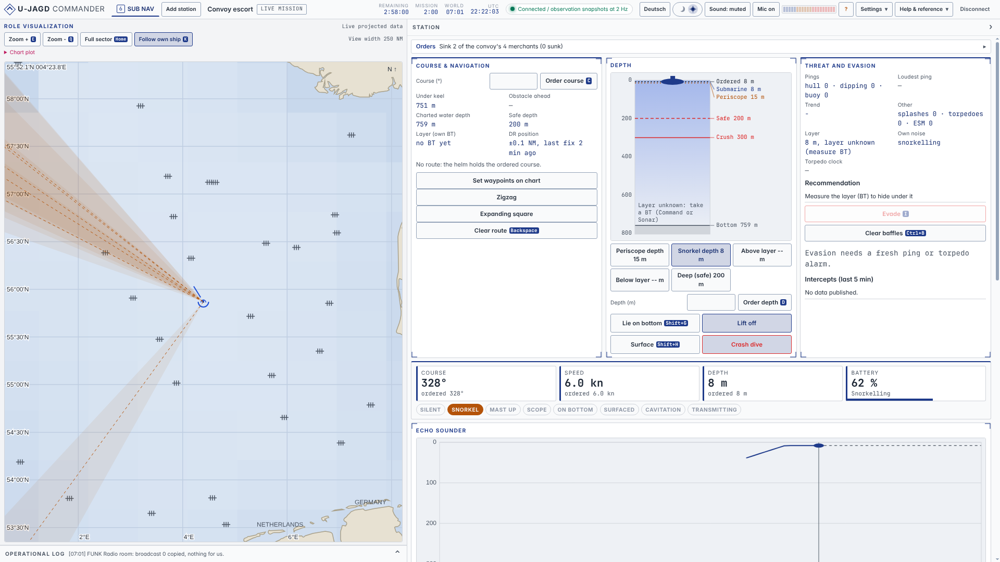

*Submarine navigation in the Remote Crew browser*

#### Dead reckoning and route

- Dived, the submarine knows its position only by dead reckoning. The navigated position drifts from the true one by a steady set of up to 0.4 kn that log and gyro cannot see (a nuclear submarine's inertial navigation drifts 0.3 times as much), plus a small random walk once a minute; the error stays below 8 NM.
- The crew's chart (coast, soundings, hazards, mission goal, HQ's reports and the route) is drawn where the navigator believes it lies against the submarine. The submarine itself, its own sonar contacts and own torpedoes stay where the submarine measures them. The position in degrees and minutes at the chart's top left is the navigated position, not the true one.
- A GPS fix: mast up at periscope depth for 20 s puts the navigated position back on the true one. The **DR position** lamp on the Chart & sounder page shows the navigator's own error estimate and the minutes since the fix, or the fix being taken.
- The chart check ahead and the route steer from the navigated position, so an old fix can lead the submarine into water the chart calls clear.
- The route: a right click on the chart adds a waypoint (at most 8), `W` lays a zigzag or expanding-square search from the submarine and steps to off, `Backspace` clears it. Any course order from the helm or an evasion ends the route; a baffle clearing has the helm while it runs. In the browser **Set waypoints on chart** turns clicks on the chart into waypoints.

1. Before every course or depth order check the pilot chart: keel, shoals and land ahead.
2. Watch the DR position lamp: dived the error grows; take a GPS fix with the mast up (20 s) when it is safe.
3. Lay a route with right clicks or a search pattern (W); a helm order ends the route.
4. Keep at least the DR error clear of shoals: the chart check runs from the navigated position.
5. In shallow water lie on the bottom to hide (Shift+G) and lift off before moving.

### Radio room

The radio room copies HQ's broadcasts, reads HQ's orders and contact reports and sends situation reports.

- The page shows when HQ's next broadcast comes, whether the antenna is up (mast `P` at periscope depth, or the towed buoy antenna `B` down to 60 m at 6 kn or less), HQ's orders and contact reports and the log.
- `Enter` sends a situation report; it needs the mast up, and the frigate can take an HF bearing on it.

The **Radio room** has one page: antenna, broadcast schedule, copy and transmit progress, HQ's latest contact report and the radio log; `Enter` sends a situation report and `P` raises or lowers the mast.

Fleet headquarters sends a submarine broadcast every 10 minutes (broadcast 0 at mission start, then 1, 2 …) and repeats it until the next one. The submarine copies it only with its antenna up, which is the raised mast at periscope depth, and only after 20 s of unbroken reception inside that broadcast's time on the air; a submarine that stays deep misses broadcasts and only ever gets the latest. A broadcast carries HQ's **contact report** on the frigate in 60 % of cases: a position 5 to 15 minutes old with an error circle of 4 NM, and its course and speed rounded. On the chart it is drawn as an amber circle with its age, and the radio page gives bearing and range from the submarine.

A **situation report** (`Enter` at the radio room, or the browser's button) is 20 s of HF transmission with the antenna up. During it the frigate's HF direction finder can take a bearing on the submarine (radio room HF/DF), and lowering the mast aborts it. HQ acknowledges a report in its next broadcast and then always adds a sharper contact report (2 NM). The radio page and the browser's Radio room card show the antenna, the broadcast number and time to the next one, copy and transmit progress, the reports sent, the latest contact report and the radio log (12 entries, saved).

Below the mast the **VLF loop antenna** still copies the broadcast down to 25 m, but the slow VLF signal needs 60 s of unbroken reception instead of 20 s; it only receives, a situation report still needs the mast. Deeper still, the **towed buoy antenna** (`B` on the radio page, or the buttons on the browser's Radio room card) streams about 280 m astern in 60 s and copies the broadcast down to 60 m in 30 s, but only at 6 kn or less (faster it is pulled under); it only receives as well. Above 10 kn the cable parts and the buoy is lost for the mission. The small buoy on the water can be found by the frigate's lookout close in (an unknown small object, never recognised as a submarine) and by its surface radar at short range; aircraft crews do not look for it. Recovering it takes another 60 s.

From broadcast 2 on, a broadcast may carry an **HQ order** (half of them, while no order is open, at most 4 per mission; a missed broadcast is a missed order): proceed to an area 8 to 15 NM away in deep water and reach it within 3 NM inside 40 minutes (a green circle on the chart), send a situation report within 30 minutes, or keep radio silence (no transmission) for 20 minutes. The radio page and the browser's Radio room card show the open order with bearing, range and time left, and how many were carried out; the log marks the order a broadcast brought. Orders do not decide the mission.

A broadcast also passes on the incidents at sea HQ knows of (drift net, weather front, whales; see the Radio chapter); the crew plots a net on the submarine's chart. With the antenna up the radio room also hears the frigate calling HQ (a contact report or a request for support, 20 s each): it reports the HF/DF bearing (+/-8 degrees ground wave, +/-16 degrees sky wave) and draws a 30 NM bearing line labelled HF on the chart.

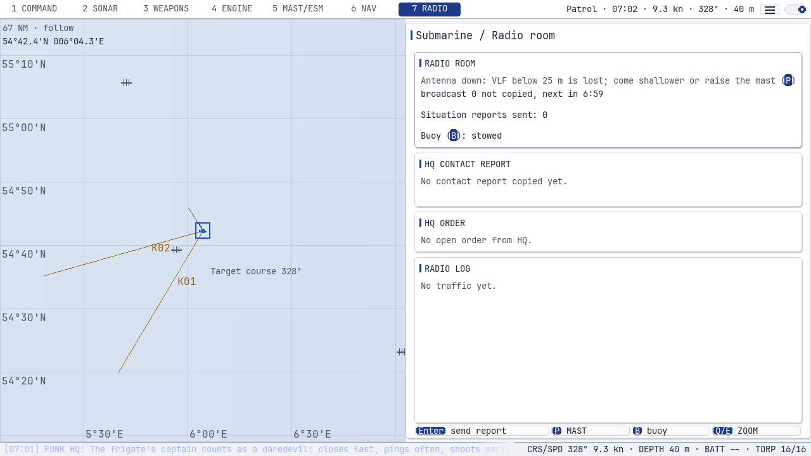

*Submarine radio room*

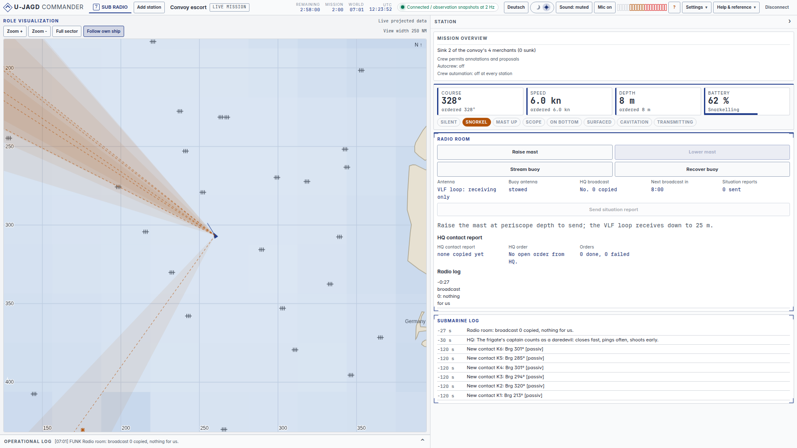

*Submarine radio room in the Remote Crew browser*

1. Note the next HQ broadcast; copy it with the mast up, the buoy antenna (B) or VLF.
2. Pass HQ's orders and contact reports to Command; their bearings are from the navigated position.
3. Send a situation report (Enter) only when ordered or safe: the frigate can take an HF bearing.
4. Stream the buoy antenna at 6 kn or less and recover it before going faster than 10 kn.
5. A contact report gets older by the minute: its error circle grows, the target moves on.

### Surfacing and crash dive

- `Shift+H` (browser: **Surface**, Command or Navigation) orders the submarine up to the surface. At 2 m or less it is surfaced: the low-pressure blower empties the main ballast within 2 minutes (no bottle air), the hatch is open and the submarine airs itself.
- Surfaced, the diesels (`N`) run in the open air: up to 12 kn (or the submarine's top speed) instead of 6 kn on the snorkel, and the generator gives 1.3 times its snorkel power, so the battery charges faster.
- The bridge watch looks out from 6 m instead of the periscope's 2.5 m and sees farther; its reports read **Bridge:** and an aircraft is called as an alarm. The scope page shows the bridge watch's view.
- The enemy sees a surfaced submarine too: the frigate's surface radar and the radars of helicopter and patrol aircraft see hull and conning tower (ten times a mast's echo), and lookouts see it by eye.
- `H` from the surface or with blown tanks (browser: **Crash dive**) is the crash dive: alarm, masts and snorkel down, vents open, full ahead, ordered depth 40 m. Blown tanks hold the submarine above 10 m until the vents have flooded them (up to 40 s), and the flooding vents are a transient the enemy may hear. From deeper than 12 m a crash dive is refused.

### Crew, sounds and red light

**Crew:** the submarine has its own watch bill with the frigate's rules (see Damage control, Crew and watches): three watches, fatigue, action stations and morale. The Engine room and Command order action stations (`G` on the uConsole as on the frigate, a button in the browser's Damage control card) and relieve the watch (`W` on the Damage page, or the button). Morale rises when a ship sinks and falls with every 10 % of hull damage. A tired crew hears later on sonar, sights later through the periscope and its damage-control teams seal and fight fire more slowly (the pumps are machinery and keep their rate).

**Wounded** follow the frigate's rules too: hull damage (one wounded per 15 % in a hit) and a minute in a fully flooded, burning or gassed compartment wound people in the control room (sonar, 4 posts), the bow room (torpedo gang, 4 posts) or the rest of the submarine (damage control, 8 posts); empty posts slow sonar recognition, tube loading and flooding, and the repair teams. The log reports the wounded; the Damage page shows them with the empty posts and the spare hands. `M` sends the medical team to the next station, `U` re-mans the worst-hit station from the resting watches (the browser's Damage control card has both buttons).

**Atmosphere:** the submarine has its own sounds, on the uConsole when it plays the submarine and in the submarine's browsers with sound on (never on the frigate's). From 60 % of test depth the hull creaks, now and then at first and every 12 to 28 s at test depth and below; a hull failure cracks. Every detonation in the water within 30 NM (a torpedo or missile hit, a merchant torpedoed) is heard: within 2 NM as a heavy blast close aboard, farther off as a dull distant rumble, and the log reports it with the bearing the crew's ears give (a few degrees off). A hunter's ping (hull sonar, dipping sonar or active buoy) rings on the hull. With stereo sound both come from that bearing, left for port and right for starboard of the submarine's head.

In **silent running** the submarine rigs for red: the uConsole's submarine screens and the browser's submarine command stations turn to dimmed red light until silent running ends. The submarine's action stations signal is only a quiet alarm bell, and when silent running starts the fans are heard running down, and up again when it ends.

### Mission end, debrief and spoken reports

**Mission:** From the submarine's side a mission is won when the frigate sinks, when the submarine escapes (it leaves 150 NM from its start) or when it holds out to the time limit of a hunt; if the submarine sinks, its crew sees "Submarine lost".

`D` on the submarine's end panel opens the submarine's own **debrief**: its track, what its sonar held on the frigate, the true positions of frigate, helicopter, patrol aircraft and buoys, torpedoes both ways, the pings it took and the spans (at least 1 min) in which the frigate's sonar really held it, marked below or above the layer.

Spoken crew reports (Options page 2) speak the submarine's log when the uConsole plays the submarine: torpedo and pings heard, buoy splash, new contact, evasion, mast warning, leak, fire, action stations, each own torpedo away (the log names its tube), detonations close aboard or distant and breaking-up noises with their measured bearing, a copied HQ broadcast (with or without a contact report on the frigate), a new periscope sighting with its class and bearing, passing 90 % of test depth and going below it on the way down, a hit, every hull failure, and the mission won or lost; browsers at submarine stations get the same reports.

### AI hunters

When nobody sails the frigate (the uConsole plays the submarine, or a solo browser plays the submarine), AI hunters crew every frigate station no browser holds; a station a browser takes is left to it at once. They read only what the frigate's own sensors report, never the submarine's position or identity:

- **Classification:** a contact whose heard signature the library knows only from submarines is classified submarine, as an operator comparing it with the library would; recognising it takes the operator 3 minutes on average. Other contacts stay unclassified.
- **Datum:** the freshest located submarine contact (ping, TMA or buoy fix); else the youngest of a radar mast track up to 10 minutes old, an HF/DF or ESM cross-fix up to 15 minutes old and an HQ submarine datum report up to 30 minutes old; else the bearing of a submarine contact; else the fresher of an HF/DF bearing and an ESM bearing on a mast radar up to 5 minutes old (an intercept the library matches to a submarine radar among its three best fits, with no radar or AIS ship within 10° of its bearing, heard for no more than 10 minutes: a radar radiating longer is a ship); else a lead. A lost submarine bearing stays a lead for 20 minutes: the frigate runs down the line from where it was heard, 8 NM ahead of its own position on it, at most 60 NM out. In the frigate scenarios HQ's start report of the threat (bearing and range from the ship) is a lead for an hour, until the ship is within 3 NM of the reported position. In submarine scenarios 4 and 5 HQ reports no threat position at the start and passes no submarine datum: the frigate knows only what it guards. The leads are saved (save v43). The OPZ marks every bare radar blip of a raised mast or snorkel as a track, like an operator, and a mast track within 10° of a submarine contact's bearing counts as that contact. The radio room takes HF/DF bearings and cross-fixes like the autocrew. ELOKA plots an ESM bearing on a mast radar at most 30 s old as a line from the ship's position, a new line only after the ship has run 1 NM from the last one (at most 8, each for 15 minutes), and crosses the newest line with the latest earlier one it meets at 15° or more, no farther than 60 NM out: that ESM cross-fix is a position datum like an HF/DF fix.
- **Bridge:** in the convoy attack the frigate keeps station 3 NM ahead of the convoy, weaving 45° either side every 5 minutes (it closes at 18 kn when more than 2.5 NM off station), and prosecutes a datum only within 8 NM of the convoy; in the supply ship escort the supply ship is its convoy. Without a datum in the strait blockade it sweeps across the gate at 10 kn, turning 1.5 NM off either shore, and in the combat swimmers mission along the coast section (70 % of its radius either side of the centre), closing the section at 18 kn when outside it. Otherwise, without a datum the frigate searches at 10 kn on a zigzag (legs of 10 minutes) whose base course turns 90° every 30 minutes. It runs at 18 kn to a position datum farther than 6 NM and works a closer one at 8 kn on a crossing course (60° off, switching sides every 5 minutes) so the towed array and TMA get bearing motion; on a bearing alone it steers 30° off it at 14 kn and runs down a lead at 14 kn. Against a breakthrough (5) it guards its patrol position: it prosecutes a datum only within 6 NM of it and returns there without one when more than 3 NM off. In the strait blockade it prosecutes a datum only within 6 NM beyond either end of the gate, in the combat swimmers mission only inside the coast section. It turns away from torpedoes and missiles like the autocrew and never steers into shoal water.
- **Sonar and weapons:** the ship pings every 10 minutes on a submarine contact that has no fresh range (a ping that finds nothing only sends the submarine running), and fires one torpedo (or the set salvo) at a located submarine within 6 NM (within 3 NM in submarine scenarios 1, 2, 4 and 5, where it guards its post), again only when it has stopped running. Nixies go out against a heard torpedo.
- **Helicopter:** launched for a datum within 30 NM (8 NM in submarine scenarios 1, 2, 4 and 5; weather and deck permitting), after the deck has readied it (10 minutes on average); it flies to the datum, or 8 NM down a bearing, and dips. On a position it pings every 30 s; on a bare bearing it only listens. It drops a torpedo on a located submarine within 1.5 NM from a fix at most 2 minutes old, one at a time. Without a datum it recovers.
- **Patrol aircraft:** requested once a position datum exists (never for a bare bearing, and never in submarine scenario 1, where the frigate guards the passage alone); it flies to the datum with its radar on, lays a circle of buoys where none listen within 4 NM, and attacks a located submarine within its drop range over the datalink from a fix at most 2 minutes old.
- **ASROC:** a position datum at most 2 minutes old from the ship's own sensors (not an HQ report or an ESM cross-fix) is passed over the datalink to the nearest friendly AI warship that carries ASROC and has it in range, at most every 2 minutes and never while an ASROC is in flight or its torpedo is running. The AI hunters do not fire the frigate's own ASROC or depth charges (those stay with a player at the Weapons station), and the submarine scenarios add no escort for it.
- The other stations (damage control, engine room, OPZ air defence, ELOKA) run the autocrew's policies. The hunt keeps no state of its own; the radar blips and the OPZ's marks it acts on (save v25), ELOKA's ESM lines (save v39) and its leads (save v43) are saved, so a loaded game continues it unchanged.

### Keys

Every key of the submarine on the uConsole (`F1` at a submarine station shows the same table):

| Key | Action |
|---|---|
| `1 … 7 / Tab` | Stations: 1 Command, 2 Sonar, 3 Weapons, 4 Engine room, 5 Mast & ESM, 6 Navigation, 7 Radio room; Tab next (click a tab too) |
| `C / V / D` | Order course / speed / depth (Command; course and depth also Navigation, speed also Engine room) |
| `U / J / H` | Depth steps: periscope / snorkel depth (Shift), below / above the measured layer (Shift), deep (Command, Navigation) |
| `Page Up/Down` | Command pages: Navigation / Weapons & contacts / Periscope / Threat (or 1 again); Navigation pages: Chart & sounder / Navigation / Threat (or 6 again); Mast & ESM pages: ESM / Periscope (or 5 again) |
| `Q / E` | Zoom chart in steps, 500 to 0.5 NM (periscope page: the wheel zooms the chart) |
| `K` | Chart follows the submarine on/off |
| `Wheel / drag` | Zoom / pan the chart (mouse on the chart) |
| `Left click` | Order the course to a point of the pilot chart (Navigation, Chart & sounder) |
| `Arrow keys` | Select an own sonar contact |
| `Ctrl+Enter` | Fire a torpedo at the selected contact (Weapons) |
| `F` | Fire down an entered bearing: bearing, Enter, distance to the datum (blank: none), then Ctrl+Enter fires (Weapons) |
| `V` | Launch a decoy (Weapons) |
| `M` | Load the next empty torpedo tube (Weapons) |
| `Shift+M` | Flood the next loaded tube (20 s) and open its outer door; loud, the frigate may hear it; only a flooded tube fires (Weapons) |
| `Ctrl+M` | Flood the next loaded tube slowly (60 s); the frigate hears it only very close (Weapons) |
| `Shift+B` | Emergency blow, once (Command, Engine room) |
| `T` | Torpedo run depth 5-300 m (Weapons) |
| `Y` | One torpedo or a two-torpedo spread (Weapons) |
| `X` | Seeker search pattern: straight, snake, circle, helix (Weapons) |
| `, / .` | Seeker enable point -/+ (0.6 to 3.0 NM before the datum, 0.2 NM steps; Weapons) |
| `W` | Steer the newest wired torpedo: bearing, then distance (Weapons) |
| `Shift+W` | Cut the newest torpedo's wire (Weapons) |
| `A` | Silent running on/off, at most 5 kn (Command, Engine room) |
| `Shift+A` | Active ping with the submarine's own sonar (Command and sonar room) |
| `Shift+G` | Lie on the bottom / lift off (Command, Navigation) |
| `Shift+H` | Surface: up to the surface, bridge watch, diesels in the open air (Command, Navigation) |
| `H` | From the surface: crash dive, vents open, full ahead (Command, Navigation) |
| `N` | Snorkel up/down, diesels charge at snorkel depth (Engine room) |
| `P` | Raise/lower mast at periscope depth: ESM hears radars, the periscope sees, the radio antenna is up (Command, Mast & ESM, Radio room) |
| `Arrow keys` | Mast & ESM page: select an emitter |
| `C / ← / →` | Mast & ESM page: classify the emitter from the library (C or →: next, Shift+C or ←: back; annotation, never truth) |
| `Enter` | Mast & ESM page: cross-fix (or the bearing line) into the submarine's plot |
| `← / →` | Periscope page: train the scope 2° (Shift: 10°) (Command, Mast & ESM) |
| `↑/↓ · Q/E · Space` | Periscope page (as the binoculars): ↑/↓ tilt the head 2° (Shift: 10°), Q/E low/high power (32°, 8° field), Space stabilizer |
| `Enter` | Periscope page: stadimeter range of the sighting under the crosshair (Command, Mast & ESM) |
| `Ctrl+Enter` | Periscope page: fire on the attack computer's solution of the sighting under the crosshair (Command) |
| `+ / -` | Telegraph step faster / slower (Command, Engine room) |
| `Sonar keys` | As on the frigate sonar, without towed array, OPZ release, plot and telegraph |
| `R` | Engine room, stores page: cycle the snorkel charge rate (full, half, air only) |
| `Shift+O` | Engine room, stores page: fit a fresh CO2 absorber set |
| `O` | Engine room, stores page: light an oxygen candle |
| `Arrow keys` | Engine room, tanks page: flood (down) or pump out (up) the regulating tank |
| `← / →` | Engine room, tanks page: trim water forward (right) or aft (left) |
| `Z` | Engine room: automatic trim on/off |
| `Arrow keys` | Engine room, damage page: pick a compartment (up/down) and a task (left/right) |
| `Enter` | Engine room, damage page: send team 1 (Shift: team 2) with the task |
| `I` | Engine room, damage page: shut or open the compartment's bulkheads |
| `I` | Command, Navigation: evade the freshest ping or torpedo alarm (course, speed, layer, silent running or decoy) |
| `Enter` | Radio room: send a situation report to HQ (needs the mast up at periscope depth; the frigate can take an HF bearing) |
| `B` | Radio room: stream or recover the towed buoy antenna (copies the broadcast down to 60 m at 6 kn or less; torn off above 10 kn) |
| `W` | Engine room, damage page: relieve the duty watch now |
| `M` | Engine room, damage page: medical team to the next station with wounded |
| `U` | Engine room, damage page: men from the resting watches to the worst-hit station |
| `G` | Action stations on/off (all watches on duty, alert but tiring) |
| `Ctrl+B` | Clear baffles: 60° to starboard for two minutes, then back (the hull sonar is deaf astern) |
| `Right click` | Add a route waypoint on the chart (Navigation) |
| `W` | Route: zigzag search, expanding square, off (Navigation) |
| `Backspace` | Clear the route (Navigation) |
| `0` | Weather panel of the submarine (0 or Esc closes) |
| `S / L / F9` | Save / load / Remote Crew (the frigate's crew) |
| `Menu icon (top bar)` | Game menu by mouse: help, options, save/load, weather, plot, autocrew, quit and more; every overlay closes with its close box (like Esc) |

### Mouse

- Every key in a station's key bar can be clicked; lamps, page tabs and key hints in the text press their keys, and the station tabs in the top bar switch stations.
- A click on the course, speed or depth dial orders that value.
- In the fire control a dry tube's lamp floods it and an empty tube's lamp loads it; the decoy has a key chip. The fire key `Ctrl+Enter` can be clicked only at the Weapons station.
- Navigation, Chart & sounder: a left click on the pilot chart orders the course to that point; on the Navigation page a right click adds a route waypoint.
- A click on a row of the emitter list selects that emitter. On the chart the wheel zooms and dragging pans.

### Not modelled

- No position fixes from landmarks, soundings or stars; only GPS clears the dead-reckoning error.
- The plot keeps its marks where they were drawn against the submarine; it does not move with a fix.
- No separate control room or diving officer station; trim and ballast stay with the engine room.
- The radio room knows HQ's broadcast schedule, three kinds of order (seven on a free patrol) and situation reports: no free-text messages from HQ, no reception below 25 m without the buoy antenna and none below 60 m (no ELF, no trailing wire), no burst transmission and no other units on the net; HQ's contact report is modelled intelligence, not a sensor of its own.
- Damage control is six compartments and two teams: no separate pressure-hull and outer-hull damage, no smoke or heat spreading, no fire in the air stores and no fire consuming oxygen; the submarine's overall damage (noise, top speed, sinking at 100 %) still adds up from hits, and the AI's submarines keep only that value.
- Below test depth the hull has no individual fittings, no gradual shrinking of the hull and no stronger welds from a refit; a failure picks its kind and compartment at random, and a crushed submarine is lost at once.
- The submarine's sounds are simple cues: stereo only tells port from starboard (ahead and astern sound the same), a detonation gives no range estimate and no creak comes from a particular compartment; the submarine's sonar room has no red light.
- The trim model is one weight and one moment: no free-surface effect, no compressibility of the hull with depth and no separate negative tank; the submarine does not surface fully. Food and fresh water do not run out.
- A raised mast or snorkel head is seen by the frigate's radar only as a bare blip (see the OPZ chapter). A raised mast's feather depends only on speed (not on how far the mast is out of the water or on the course to the sea), and the crew warns only once when the submarine runs faster than 5 kn with a mast up.
- The submarine's ESM hears no other submarine's radar and no missile seeker; it has no scored likelihood analysis and no target motion analysis of an emitter (the cross-fix assumes a slow emitter).
- The fit grade is the crew's reading of the published ranges, not a likelihood: a wide-band radar measured near the middle of its range can fit better than the true emitter measured near its edge, and the browser shows the first 8 entries.
- The AI hunters' ASROC comes only from friendly warships already in the scenario, never from the frigate's own launcher.
- The periscope has no camera; sightings carry no identification beyond the coarse class, and the stadimeter assumes a class length rather than a masthead height.

## Scenarios and missions

Each side has twelve scenarios, counted from 1 in its own list: `1`-`9` and `0` choose the first ten, the eleventh and twelfth are reached with the arrow keys. The tables give the result as the end panel judges it and the time limit of the short variant (chapter Main menu, Briefing).

### Frigate scenarios

| No. | Scenario | Frigate wins | Frigate loses | Short |
|---|---|---|---|---|
| 1 | Patrol | Target submarine sunk | Target escapes / time limit / frigate sunk / civilian loss | 30 min |
| 2 | Double hunt | Both target submarines sunk | A target escapes / time limit / frigate sunk / civilian loss | 60 min |
| 3 | Nuclear intercept | SSN sunk before deadline | SSN escapes / time limit / frigate sunk | 45 min |
| 4 | Free hunt (random) | as chosen on the difficulty page | as chosen on the difficulty page | none |
| 5 | Convoy escort | Submarine sunk or convoy brought through the time limit | Two merchants sunk / frigate sunk | 35 min |
| 6 | Flaming datum | Submarine sunk | Submarine leaves the datum circle / time limit / frigate sunk | 45 min |
| 7 | Trail | Contact held long enough | Contact lost for 20 minutes / time limit | 45 min |
| 8 | Harbour defence | Submarine sunk or swimmers kept off to the time limit | Swimmers landed / frigate sunk | 45 min |
| 9 | Replenishment at sea | Transfer complete or submarine sunk | Tanker sunk / time limit / frigate sunk | 45 min |
| 10 | Rescue under threat | Both crews rescued | Crew lost / time limit / frigate sunk | 45 min |
| 11 | Search group | Both submarines sunk | Time limit / frigate sunk | 45 min |
| 12 | Free patrol | No victory: collect points as long as the frigate stays afloat | Frigate sunk / civilian loss | none |

### Submarine scenarios

| No. | Scenario | Submarine wins | Frigate wins | Short |
|---|---|---|---|---|
| 1 | Breakthrough | Submarine reaches the goal area / frigate sunk | submarine sunk or held off to the time limit | 60 min |
| 2 | Reconnaissance | Submarine reports the frigate in sight / frigate sunk | submarine sunk or report prevented to the time limit | 45 min |
| 3 | Convoy attack | Two merchants sunk / frigate sunk | submarine sunk or convoy brought through the time limit | 35 min |
| 4 | Strait blockade | Submarine passes the strait / frigate sunk | submarine sunk or strait held to the time limit | 45 min |
| 5 | Combat swimmers | Swimmers landed / frigate sunk | submarine sunk or swimmers kept off to the time limit | 45 min |
| 6 | Supply ship escort | Supply ship sunk / frigate sunk | submarine sunk or supply ship brought through the time limit | 45 min |
| 7 | Duel | Frigate sunk / submarine afloat at the time limit | submarine sunk | 45 min |
| 8 | Damaged homecoming | Submarine reaches its home area / frigate sunk | submarine sunk or held off to the time limit | 60 min |
| 9 | Agent pick-up | Team picked up and away / frigate sunk | submarine sunk or pick-up prevented to the time limit | 45 min |
| 10 | Listening post | Recording reported / frigate sunk | submarine sunk or report prevented to the time limit | 45 min |
| 11 | Hunter group | Submarine reaches the goal area / frigate sunk | submarine sunk or held off to the time limit | 60 min |
| 12 | Free patrol | No victory: collect points as long as the submarine stays afloat | Submarine sunk | none |

### Frigate missions in detail

Frigate scenarios 5 to 10 give the frigate an objective of its own beyond sinking the submarine; an AI submarine plays the other side (or a submarine crew in the browsers, whose orders line shows the opposite objective). Their short variants last 35 minutes (convoy escort) or 45 minutes. The submarine's progress counters (the trail, the agents' pick-up, the listening post) are saved (save v45).

- **Convoy escort (5):** the convoy attack seen from the frigate: four merchants at 8 kn in a box about 1 NM around the frigate, the submarine waiting on the convoy's bow. The frigate wins when it sinks the submarine or the convoy holds out for 3 hours; it loses when two merchants are sunk.
- **Flaming datum (6):** a merchant has just been torpedoed at the scenario's area; HQ's start message gives the exact position (bearing and range from the ship) and the chart shows a DATUM circle of 12 NM radius (6 NM in the short variant) around it. The frigate starts about 20 NM away (10 NM), the submarine 1 NM from the wreck; it runs at 9 kn for the first 30 minutes, then sneaks. The frigate wins when it sinks the submarine; the submarine wins when it leaves the circle or the time limit (2 hours) runs out.
- **Trail (7):** peacetime. HQ hands over a foreign nuclear submarine 6 NM ahead with its position, course and speed. Weapons are tight on both sides: the frigate's torpedoes, ASROC, depth charges, rockets, the helicopter's and the patrol aircraft's torpedoes are refused ("weapons tight"), and no submarine fires. The submarine sprints at 22 kn for 4 minutes every 10 minutes on a new heading up to 60° off its course and drifts at 4 kn in between. Contact counts as held while the frigate's sonar picture heard the submarine in the last 30 s and located it (a ping or TMA range) in the last 10 minutes; the objective line counts the minutes. The frigate wins once contact was held for 80 % of the time limit (96 of 120 minutes; half in the short variant, 22 of 45); the submarine wins when it was not heard for 12 minutes at a stretch (10 in the short variant) or the time limit runs out first. The AI frigate pings every 3 minutes here while it has no fresh range and closes a bare bearing at 16 kn, 30° off it.
- **Harbour defence (8):** the combat swimmers mission seen from the frigate: the frigate guards its coast section (26 NM radius) without knowing the zone; the submarine must lie in the zone shallow and slow for 10 minutes. The frigate wins when it sinks the submarine or no swimmers land within 6 hours.
- **Replenishment at sea (9):** the frigate starts with 40 % fuel 3 NM on the quarter of a friendly tanker steaming a straight course at 12 kn. The HQ task board holds the replenishment from the start (no other tasks are offered): within 0.3 NM and 3 kn of the tanker's speed for 15 minutes, as on the Radio station's Tasks page; the objective line shows the percentage. The submarine waits about 20 NM ahead on the tanker's bow (10 NM in the short variant) and 5 to 8 NM off its track. The frigate wins when the transfer is complete or the submarine is sunk; it loses when the tanker is sunk or the time limit (2 hours) runs out first.
- **Rescue under threat (10):** a patrol aircraft has ditched; its crew drifts in two life rafts, BRAVO 1 (5 persons) and BRAVO 2 (4 persons), 2.5 NM apart. Both are on the task board from the start as search-and-rescue tasks with HQ's position (0.5 NM error) and the time limit as deadline; the rafts drift with wind and current, are sighted at 2 NM by day and 3 NM by night (strobe) and are taken aboard as in any rescue task. The frigate starts about 35 NM away (13.5 NM in the short variant), the submarine waits 6 NM from the rafts (2.3 NM) on the frigate's side. The AI frigate makes for the nearest raft and its helicopter, once the deck has readied it, for the other while two are left, hoists its crew and flies them back to the ship; its sonar and tubes still fight the submarine. The frigate wins when both crews are aboard; sinking the submarine alone does not end the mission. It loses when the time limit (2 hours) runs out first.
- **Search group (11):** a group hunt: two submarines (AIP or nuclear) as in the double hunt, and the destroyer LUETJENS sails with the frigate on its starboard beam, 5 NM off. The OPZ commands it on page 4 (see the OPZ chapter): formation, search or prosecute a point, hold or auto, with its active sonar and its ASROC released or held; its passive bearings cross with the frigate's into fixes. The first submarine starts 8 to 14 NM away. The frigate wins when both submarines are sunk within 4 hours (45 minutes in the short variant); it loses when the time runs out or the frigate is sunk. Losing the destroyer does not end the mission.

### Submarine missions in detail

Submarine scenarios 1 to 11 give the submarine the objective; the frigate's task is to stop it. The uConsole menu, the lobby and the browser's New game dialog list them only on the submarine side, the frigate scenarios only on the frigate side, and each list counts from 1. They are meant for a crewed submarine (the uConsole on the submarine side, a solo browser as the submarine, or a submarine crew in the browsers); a frigate crew in the browsers can still meet an AI submarine in them when nobody crews the submarine: an uncrewed mission submarine replaces its patrol legs with the objective's and still evades, lies in wait and counter-attacks as in any other scenario.

It transits at 6 kn 30 m below the layer and detours round land and water shallower than 30 m. While it is hunted (a ping or torpedo heard in the last 5 minutes, or its own contact on the frigate within 8 NM) it creeps at 4 kn; a ping alone does not turn it from its leg: it goes below the layer and holds its course at 5 kn (only a torpedo makes it run) and counter-attacks a located frigate four times as readily as a patrolling submarine. In submarine scenarios 4 to 6 it ignores a ping from farther than 5 NM, may fire back down a closer ping's bearing for 30 s after it, and counter-attacks twelve times as readily; in submarine scenarios 4 and 5 it also snaps a shot down the bearing of a loud frigate it hears without a range, and in submarine scenario 5 it is ready for its next attack after 5 minutes instead of 15.

For the breakthrough it runs for the goal area and passes 45° wide of the frigate when the frigate it holds, else the frigate's patrol position its orders name, lies within 6 NM of its leg. For reconnaissance it closes the frigate's last position it heard, else the position in HQ's latest contact report from the radio broadcasts, else the frigate's patrol area, leading a running frigate at 4 kn more than its speed; it comes to periscope depth at 3 kn within 5 NM (also after a ping it heard; only a torpedo in the water keeps it deep) and looks round with its periscope for 24 s every 90 s. The head sweeps from the bow clockwise in 16 s and makes the frigate out with the lookout's contrast model at 2.5 m eye height (light, moon, visibility, sea state, land in the way); the report counts as soon as a look has sighted the frigate within 5 NM. While the periscope is up it is a raised mast for the frigate's surface radar and the patrol aircraft (see OPZ, mast echoes).

In the convoy attack it lies in wait 2 NM ahead of the convoy and 3 NM abeam of its track, hovering at 2 kn; only a convoy that has passed it is chased on an intercept course at 4 kn more than the convoy's speed. Within 3 NM it turns its tubes on the nearest merchant and fires one torpedo at a time (at most one a minute); its torpedoes take merchants like the crewed submarine's. In the strait it runs for the goal like the breakthrough but sneaks at 4 kn, and while unhunted it tucks in 0.3 NM astern of a merchant within 3 NM that passes the same way and keeps its speed, hiding in its noise.

For the combat swimmers it sneaks below the layer at 4 kn to the zone, comes up to 17 m for the last mile at 3 kn and stops in the zone. Against the supply ship it only closes the supply ship's base track sideways to 4.75 NM abeam and lets the ship come to it, and fires within 5.25 NM, even while it slips away from a ping. In the duel it stalks the frigate at 4 kn and closes within 6 NM on a slant at 3 kn; in the damaged homecoming it runs for its home area; for the agents it comes in like for the swimmers and then runs for the deep water; at the listening post it closes the frigate to 12 NM, holds there at periscope depth with the mast up, crossing at 3 kn, turns away when hunted and sends its report as soon as the recording is complete. In the frigate missions it slips out of the datum circle, shakes off the trail, waits for the tanker, or lies in wait by the rafts and closes a frigate it hears within 6 NM. In the duel and the rescue it counter-attacks like in submarine scenarios 4 and 5.

The submarine's orders stand in one line over its chart and as the mission line of the browser's submarine stations.

- **Breakthrough (1):** the goal area (3 NM radius) lies about 5 NM beyond the frigate's patrol position, seen from the submarine's start, in water at least 40 m deep; the submarine's chart marks it as GOAL and the orders give bearing and range from the submarine. The submarine wins when it enters the area, the frigate when it sinks the submarine or holds it off for 5 hours. The rule that a submarine escapes 150 NM from its start does not apply.
- **Reconnaissance (2):** the submarine must get the frigate in sight through the periscope and complete a situation report in the radio room while the frigate is still among its sightings. The orders read "Frigate in sight" as soon as it is. A report without the frigate in sight does not count. The frigate wins when it sinks the submarine or no such report goes out within 2 hours.
- **Convoy attack (3):** the frigate escorts a convoy of four merchants sailing east at 8 kn in a box about 1 NM around it. The submarine starts on the convoy's bow, about 10 NM ahead of it and 5 to 8 NM off its track. The submarine must sink two of them; only the mission submarine's torpedoes take a merchant (one hit sinks it) and each hit is logged. The orders give how many are sunk. The frigate wins when it sinks the submarine or the convoy holds out for 3 hours. Sinking a merchant here is the mission, not an incident.
- **Strait blockade (4):** the gate is the narrowest passage, 4 to 24 NM wide between land or water shallower than 30 m, within 100 NM of the scenario's area (else anywhere in the world) with open water 16 NM along it on both sides; a world without one gets a declared barrier line 16 NM wide across open water. The frigate starts in the gate and its chart shows the gate as STRAIT. The submarine starts about 12 NM before it, on a side drawn from the seed; its goal area (3 NM radius) lies about 6 NM beyond, marked GOAL. Six merchants pass through the strait, alternately either way; each turns back through it 14 NM beyond the gate, so the strait stays busy. The submarine wins in the goal area, the frigate when it sinks the submarine or holds the strait for 4 hours.
- **Combat swimmers (5):** the zone (1 NM radius) lies off the coast nearest the scenario's area, in water at least 30 m deep with the coast within 3 NM behind it and open sea 8 NM out; the submarine starts about 8 NM seaward and its chart marks the zone as GOAL. The swimmers leave through the lock while the submarine lies in the zone at 20 m or shallower and 1.5 kn or slower; after 10 minutes without a break they are ashore and the submarine wins. The orders count the time down; leaving the zone, going deeper or faster starts it over (save v44). The frigate guards a coast section of 26 NM radius whose centre lies up to 13 NM along the coast from the zone (its chart shows it as COAST SECTION); it starts at one end of its sweep, 70 % of the radius along the coast from the centre, on a side drawn from the seed, and wins when it sinks the submarine or no swimmers land within 6 hours.
- **Supply ship escort (6):** a friendly supply ship steams at 12 kn on a zigzag: legs of 8 minutes, each 20 to 40° off its base course, alternately to either side (the base course is the scenario's, turned where land lies within 45 NM ahead). The frigate starts 1.5 NM on its beam; the submarine starts on its bow like in the convoy attack. Only the mission submarine's torpedoes take the supply ship, and one hit sinks it: the submarine wins. The frigate wins when it sinks the submarine or brings the supply ship through 3 hours.
- **Duel (7):** the submarine must find the frigate and sink it; HQ's broadcasts report the frigate now and then, and the frigate gets no report of the submarine. The frigate must sink the submarine; a submarine still afloat at the time limit of 3 hours (45 minutes in the short variant) has won the duel (HELD OUT). The duel submarine starts 8 to 12 NM from the frigate (5 to 8 NM in the short variant), is quiet (difficulty "Submarine stealth" 1.4) and ready to fire after 5 minutes.
- **Damaged homecoming (8):** the submarine starts with 30 % hull damage (slower, louder, a rattle in the sonar picture) and half a battery; its home area (3 NM radius) lies about 7 NM ahead in both lengths and the orders give bearing and range. The frigate starts 12 NM on its flank with HQ's rough report of its start. The submarine wins in the home area, the frigate when it sinks the submarine or holds it off for 5 hours (60 minutes).
- **Agent pick-up (9):** the zone lies like the combat swimmers' zone; the team comes aboard while the submarine lies in it at 20 m or shallower and 1.5 kn or slower for 10 minutes without a break (leaving it, going deeper or faster starts over). Then the orders point it to deep water about 15 NM seaward of the zone (about 4 NM in the short variant), marked GOAL. The frigate guards the coast section as against the swimmers and wins when it sinks the submarine or the team is not out within 6 hours (45 minutes).
- **Listening post (10):** the submarine starts about 22 NM from the frigate (11 NM). At periscope depth with the mast up it records every hunter radar transmitting within 25 NM with no land in between: the frigate's surface and air radars, the helicopter's and the patrol aircraft's radar; each radar adds its seconds. It needs 15 minutes of recording (7.5 in the short variant) from at least two kinds of radar, then a situation report from the radio room; the orders show both counts. The frigate wins when it sinks the submarine or no such report goes out within 4 hours (45 minutes).
- **Hunter group (11):** the breakthrough against a group: the destroyer LUETJENS (hull sonar, only 2 ASROC left from a long patrol) hunts beside the frigate, and the submarine is a quiet AIP submarine. It starts 4 to 6 NM from the frigate, and its goal area lies just beyond the frigate's patrol position (its centre under 1 NM beyond it); the time limit is 90 minutes (60 in the short variant). Its active sonar every 20 s is heard within 25 NM, and every datum the hunters locate brings its ASROC as well as the frigate's weapons. Without a crew in the frigate's OPZ it works on its own: formation until a submarine is located, then it prosecutes it.
- The submarine's end panel reads BROKE THROUGH, FRIGATE REPORTED, CONVOY HIT, STRAIT PASSED, SWIMMERS LANDED, SUPPLY SHIP SUNK, HOME, TEAM ABOARD or RECORDING REPORTED on a win (in the duel and the frigate missions ESCAPED, SHAKEN OFF or HELD OUT), MISSION OVER when the time runs out.

### Free patrol

Scenario 12 on either side is a free patrol: no time limit and no victory, just the sea, HQ's orders and what turns up. It ends only when own ship is lost (on the submarine side also when the submarine sinks the frigate); the end panel gives the hours at sea and the points. There is no short variant; weather and time of day are chosen as for any scenario. Quitting keeps the patrol in the autosave, and it saves to a slot like any mission (save v48).

- **Frigate:** the ship starts alone. HQ's tasks have no cap and come more often: the first after 2 to 5 minutes, then one every 10 to 20 minutes (still two open at a time), and besides distress, identify, datum, replenishment and radar silence a sixth kind, **sector patrol**: a circle of 4 NM radius 12 to 25 NM away to hold for 15 minutes in all within an hour (+250, -100 failed, -50 declined). Incidents at sea come every 20 to 40 minutes without a cap.
- **Encounters (frigate):** every 15 to 30 minutes (the first after 5 to 10): a hostile submarine (diesel, AIP or nuclear) 18 to 30 NM out, which HQ reports with a rough bearing and range; a neutral submarine in transit, reported the same way, which the frigate must not sink (-1000 for one sunk by its own torpedoes, depth charges or rockets; a loss without them costs nothing); an air raid (not in the first half hour); or a group of one to three merchants crossing ahead. At most two hostile and one neutral submarine are about at once; hostile submarines also attack merchants as on a patrol. A submarine or merchant more than 70 NM from both ships and unheard for 20 minutes comes back as a later encounter; a returning submarine has forgotten its old contact, solution and attack.
- **Submarine:** almost every broadcast (85 %) brings an order while none is open, from broadcast 1 on and without a cap. Besides area, report and silence there are four more kinds: **sink a merchant** HQ names, reported 10 to 20 NM away with course and speed (the chart's order circle follows its dead-reckoned position; 60 minutes); **land swimmers** off the nearest coast within 40 NM (in the 1 NM zone at 20 m or shallower and 1.5 kn or slower for 5 minutes without a break; 60 minutes); **meet the supply boat** 6 to 12 NM away, only when torpedoes are down to half or the battery below 40 % (inside 1 NM at periscope depth and 3 kn or slower for 5 minutes: torpedoes and battery full; 45 minutes); and **sight and report the frigate** (a situation report while the frigate is among the sightings; 60 minutes). Points: area +150/-50, report and silence +100/-50, merchant and swimmers +400/-150, supply +100, frigate report +300/-100; any other merchant sunk +100, the frigate sunk +1500. The orders line over the chart shows the open order and the points.
- **Encounters (submarine):** every 15 to 30 minutes either HQ gives the hunting frigate a report of the submarine (8 NM error; not in the first half hour and at most one an hour), which it runs down with its helicopter and patrol aircraft while the submarine's radio room is warned, or merchants pass near the submarine. An AI-commanded submarine without an order waits at 22 m and 3 kn for the next broadcast.

### Campaign

**Campaign** (main menu): a theatre campaign ("Feldzug") in the sea area chosen in the menu (world `W` and seed; every mission keeps the same sector).

The campaign screen shows the sector's chart with three open hotspots (plus the decisive one when the situation allows), the front situation (0-100, start 50), the enemy strength (start 6; each enemy submarine sunk in a mission lowers it by 1), the losses (0-4) and what the ship carries.

Each hotspot is one of the frigate's scenarios, played exactly as from the scenario menu (the free hunt excluded), with a role: patrol (Patrol, Trail; won +8, lost -8), strike (Double hunt, Flaming datum, Search group; +12/-6), defence (Convoy escort, Harbour defence, Replenishment at sea, Rescue under threat; +8/-12 and one loss) and the decisive battle (Nuclear intercept; opens from situation 75, closes again below it; won ends the campaign with victory, lost -15).

`Up`/`Down` (or a click) selects a hotspot, `Enter` (or a click on the selected one) opens its briefing with weather, time and length, and `Enter` there sails (`Esc` back to the chart).

After the mission the played hotspot closes, the others wait one mission longer (after 3 missions a hotspot closes; an ignored defence hotspot counts as a loss and costs 4) and new ones open by the situation: below 35 two defence and a patrol, 35 to 64 defence, patrol and strike, from 65 two strikes and a patrol. The campaign ends by the situation: won by the decisive battle, an enemy strength of 0 or a situation of 100; lost when the ship is lost, the situation falls to 0, the losses reach 4 or standing falls below 10; drawn after 12 missions without a decision. The end screen shows the outcome and the record.

Carried over, as before, are the torpedoes left (at least 2, at most 10), compartments still damaged, a lost helicopter and your standing with HQ (0-100, start 50: +15 for a win, -20 for a loss, -10 for a civilian loss, +/-3 per task done or failed). After each mission the ship calls at port: `1` full refit (4 to 8 torpedoes by standing, all repairs, a new helicopter, standing -5) or `2` quick turnaround (half that restock, damage stays aboard, standing +3), then the next hotspot is chosen.

The campaign is kept in `~/.u-jagd/campaign.json`, apart from the save slots; a campaign of an older release (six fixed missions) carries on as a theatre with its results so far (+8 per mission won, -8 per mission lost). A slot saved during a campaign mission loads as a plain mission; to count, a hotspot is sailed again from the campaign screen. `N` starts a new campaign (twice while one is running).

#### Submarine campaign

**Submarine campaign** (main menu, Campaign, `Tab`): the same theatre on the submarine side, with the submarine's scenarios as hotspots: patrol (Reconnaissance, Strait blockade, Listening post), strike (Convoy attack, Combat swimmers, Supply ship escort), defence (Breakthrough, Damaged homecoming, Agent pick-up, Hunter group) and the decisive battle (Duel).

The enemy strength falls by 1 when the frigate is sunk and by 1 when the convoy or the supply ship is sunk. Carried over are the submarine's torpedoes, its hull damage (at most 60 %; a mission that starts the submarine more damaged, the homecoming, keeps its own damage) and your standing with submarine command (0-100, start 50: +15 for a mission won, -20 for one lost). After each mission the submarine calls at its base: `1` full refit (full torpedo load, hull repaired, standing -5) or `2` quick turnaround (half of 4 to 8 torpedoes by standing added, the hull damage stays, standing +3). It is kept in `~/.u-jagd/boat_campaign.json` beside the frigate's campaign.

### Not modelled

- The new missions have no minefields, nets or shore batteries, the strait's merchants shuttle on a straight course through it instead of following charted lanes, and the swimmers are not modelled after they leave the lock.
- The submarine campaign has no port choices beyond refit and quick turnaround, and no damage-control state carried over (only the overall hull damage). The campaign's hotspot markers only place a mission on the chart: each mission is played in its scenario's own setting in the sector, not at the marker. Outside the convoy attack the submarine's torpedoes home on the frigate only, and an AI submarine attacks merchants only as the convoy attack's mission submarine or as a patrol submarine of a frigate scenario.

## Remote Crew and multiplayer

Remote Crew lets browsers on the local network take stations. The uConsole stays the only simulation: the browsers send orders and show their station's own picture, they never run the game themselves. A browser holds stations of one unit only, frigate or submarine.

### Multiplayer lobby

**Multiplayer** (main menu): the lobby where the crew meets before a mission. It starts Remote Crew in crew mode by itself and shows the QR code, address and join code. On the uConsole's own hotspot it shows two numbered steps side by side: **1** the Wi-Fi QR code with the Wi-Fi name and password (join the hotspot), **2** the page QR code with the address and join code (open the crew page).

A browser that pairs while the lobby is open is seated on the first free station of the uConsole's unit, in this order: frigate Bridge, Sonar, Weapons, Helicopter, OPZ, ELOKA, Radio, Engine, Damage control; submarine Command, Sonar, Weapons, Mast & ESM, Navigation, Engine room, Radio room (the stations that need judgement first; the AI crew keeps the routine ones well). Browsers can change their unit and stations at any time and press **Ready**; they see the mission, what the uConsole plays and every crewmate with their stations and ready tick.

On the uConsole, `Up`/`Down` choose a row and `Left`/`Right` change it: the mission, the unit the uConsole plays and the station it shows, or **none, host only**: then the uConsole plays no station, the browsers can take every one and the AI crews the rest. **Start the mission for everyone** starts a five-second countdown that every browser sees, then the mission begins for all at once and the uConsole opens on its chosen station. If a crewmate with a station is not ready yet, the first `Enter` asks again and a second one starts anyway. `Esc` cancels a countdown, otherwise it leads back to the main menu while Remote Crew keeps running.

When a mission started from the lobby ends, everyone returns to the lobby with their stations; the ready ticks start again from zero. Every mission started from the lobby with a browser taking part (or host only) has the crew assist on (`Shift+F2`); alone it starts as a solo game with the assist off. `F9` opens the full Remote Crew settings from the lobby. Started with `--multiplayer`, the game opens the lobby straight after the start screen.

### Crew versus crew

**Crew versus crew** (lobby row **Opponent**): *AI* (the default) puts every browser on the uConsole's unit as above; *second crew* lets two teams play each other, the frigate's crew against the submarine's.

A browser that pairs then joins the team with fewer people (on a tie the frigate, which has more stations), the uConsole counting for its own unit unless it only hosts; the browser lobby shows both teams with a blue (frigate) or red (submarine) stripe. If a team has nobody, the first `Enter` asks again and a second one starts anyway with the AI crewing that unit.

From the start every browser stays with its team for the whole round: it can swap stations within its unit but never take one of the other unit. Each team sees only its own unit's picture (as always), and in the web-host room each unit has its own push-to-talk channel, so a crew never hears the other one. When the round ends, the end panel names each unit's own result ("Frigate: victory, submarine: defeat") and each browser gets its own unit's result in its event feed.

A uConsole that only hosts a crew-versus-crew round shows the **umpire screen** instead of a station: the mission, the time left and who crews which station of both units (a name or AI), never a tactical picture, and it plays no sonar or effect sounds; only `F1`, `F9` and `Esc` work there. The scenarios are the same as against the AI, so their balance (both sides win, see chapter Main menu, Briefing) holds for two crews as well.

### Server mode (browsers only)

**Server (browsers only)** (main menu, or `--server` at launch): the uConsole only serves and everyone plays in the browser, on both units, alone or together. It opens the lobby with Remote Crew on, the uConsole plays no station (the station row is fixed to host only) and shows only the QR code, address, join code and the crew.

The first crew browser that joins is the **game leader** (marked in every browser's lobby): it chooses in the lobby the unit, the mission (a scenario, the daily mission, a campaign hotspot of the chosen unit with the campaign's port choices, or an own mission), the opponent (AI or second crew), weather, time of day and mission length, and starts the countdown with **Start for everyone** (a second click when a crewmate is not ready). Against the AI, a change of unit moves every browser to the first free stations of the new unit. Alone, the leader plays solo: the AI crews every station it does not hold.

During a mission the uConsole shows the umpire screen with the join line and the leader's name, the leader's host bar keeps Save and Load and adds **Back to the lobby**, which ends the mission for everyone; the crew keeps its stations across every mission start, load and return. The leader hands the lead over with **Hand over the lead** beside a crewmate's name; a leader that stays away for a while passes it on to the next crewmate by itself. Phone lookouts and observers never lead.

`Esc` on the uConsole leaves server mode for the main menu. Nothing of it is saved.

### Remote Crew page (F9)

`F9`: Commander / Remote Crew - lets browser clients on the LAN take stations. The page has one switch, **Multiplayer**: `Enter` turns it on on the first local network address, or, when the uConsole has no network, on its own hotspot (if the hotspot helper is installed; the uConsole installer `install.sh` sets it up when it can and otherwise prints a note). The hotspot keeps its Wi-Fi name and password from one start to the next, so a phone or PC that joined once reconnects by itself. On the hotspot the page shows the two steps together: **1** the Wi-Fi QR code with name and password, **2** the page QR code with the join code.

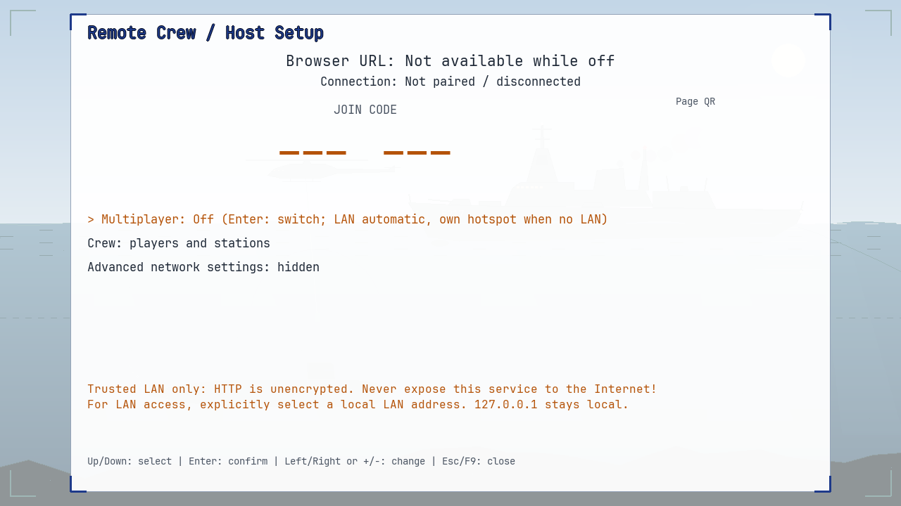

*Remote Crew administration (F9) on the uConsole*

**Crew** lists the players and their stations. **Advanced network settings** shows the network mode (LAN or hotspot), the address and the port for a manual choice; they change only while multiplayer is off. There, while multiplayer is off, **New hotspot password** makes a new hotspot password and keeps the name; every device then has to join again with the new Wi-Fi QR code.

A free station is taken at once with all of its rights (including direct fire and live sonar audio where the station has them); a station a crewmate holds is requested, and the holder (who sees the request with Hand over / Keep station buttons) or the host can hand it over. A station always carries its full rights; the host can revoke a station, grant or withdraw the SimLog (roster key `L`) at any time, and can make up to two browsers read-only observers (roster key `O`): they watch any station of either unit without holding it, cannot command, and get the SimLog with a debrief timeline and JSON export.

The crew pages open in the host's saved language (`F10` options on the uConsole); the English/Deutsch button in the browser's status bar switches that browser alone. The crew page is built for Chrome or Chromium (also Edge) on a desktop PC; another browser shows a hint above the pairing code, and a page that cannot start there says so instead of loading forever. After a host update an open browser page reloads itself once, so it always runs the web client that matches the host.

A browser station has three columns: the contact list on the left, the display in the middle, the station panel on the right with the contact detail below it. To give the controls room without scrolling, an empty contact list folds to a narrow rail and the contact detail to its title bar while no contact is chosen; both open again as soon as there is something to show, and keep any state you set by hand. The mission overview is one **Orders** line at the top of the station panel and opens with a click. A value with nothing reported yet shows as a grey dash; hovering it gives the reason. On a phone, language, sound, microphone, settings and tools sit behind the ☰ button.

### Crew mode, solo mode and the web host

Remote Crew normally runs in **crew mode**: each browser holds the stations the host grants it, and the AI or the uConsole crews the rest. Started with `--solo-crew`, it runs in **solo mode** for that launch only: one paired browser holds every station of its unit and may also use the host commands save, load and new game and the own-mission library (chapter Mission and unit editor). Editors, options, quit and the network settings stay on the uConsole, and there is no pause in either mode.

In solo mode the one browser holds all nine frigate stations, or with **Play the submarine** in the host bar all seven submarine stations (and back with **Play the frigate**). The host's **New game** dialog picks the **Side** too (*Frigate F-217* or *Submarine*); as the submarine the frigate, its helicopter and the patrol aircraft are run by the **AI hunters**. A solo browser (Remote Crew solo mode) chooses the side in the same way: its **New game** dialog has a *Side* field, and with *Submarine* the session takes the submarine's seven stations while the AI hunters crew the frigate.

`--web-host` runs one browser-only room behind a separate HTTPS reverse proxy (`--public-origin` names its address); it does not autosave. The setup is described in the web-host guide of the project documentation.

### Phone lookout and periscope

A phone can stand the watch as the frigate's bridge lookout or on the crewed submarine's periscope. `F9` shows a second QR code, **Phone lookout**, for the address `https://<address>:<port+1>/lookout`. Scan it, accept the certificate warning once, choose the watch station, and type the pairing code shown next to it (the code is never in the QR code). Type it as shown, with or without the space and in any case; look-alikes such as O and 0, I, l and 1 or S and 5 are read by position. "Wrong pairing code" means exactly that and shows the code the game received; if the game refuses the address itself, the page says so.

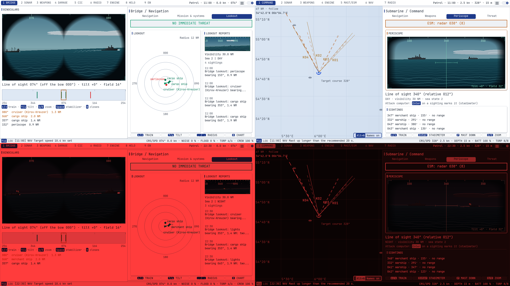

*Binoculars and periscope by day and at night (frigate left, submarine right)*

- **Certificate:** the game makes its own certificate for its LAN address (kept in `~/.u-jagd/tls/`, renewed when the address changes). The phone warns once because no authority signed it: on iPhone tap *Show Details*, then *visit this website*; on Android Chrome tap *Advanced*, then *Proceed*. Phones only hand the gyroscope and the microphone to such a secure page.
- **Looking around:** tap *Gyro* and turn the phone like binoculars; tilt it to look up or down. Without the gyroscope, swipe. *Ahead* looks at the bow again, *Zoom* cycles the magnification. On the periscope the phone trains the periscope itself, and *Range* takes a stadimeter range on what is in the crosshair.
- **Reporting:** tap *Report by voice* and say what you see, for example "Ship bearing 040, range 5 miles", "aircraft starboard 30" or "torpedo" (the line of sight then counts as the bearing). Categories: contact, ship, warship, merchant ship, aircraft, submarine, torpedo. Or tap the target in the picture and pick the category.
- **Confirmation:** a report counts only when the lookout really has something of that kind within 10° of the bearing (and, with a range, within 40 % or 1 NM of his estimate). Then it appears on the bridge as a lookout track and in the event log, and the crew browsers speak it. A report of nothing is refused, and the phone vibrates twice.

While a phone holds the bridge lookout, the lookout no longer reports ships, aircraft or torpedoes by himself: only what the player calls reaches the bridge (land is still reported automatically). On the submarine the periscope picture stays with the attack computer, and the crew's own "in sight" notices give way to the phone's reports. Speech recognition uses the phone browser's speech service (Chrome on Android, Safari on the iPhone with Siri and Dictation switched on; Firefox and the other iPhone browsers have none, tap the target there). When it fails the page names the reason. Nothing of the phone lookout is saved.

### Browser keys

In the Remote Crew browser (Commander, `F9`) stations are operated with buttons or with the same keys as on the uConsole; every control with a key shows it as a blue key cap after its label, and a key never acts while the cursor is in a field. Keys that send an order or fire only press the matching control, so they pass the same checks as a click:

| Key | Action |
|---|---|
| `1-9` | Open one of your own stations (submarine crew: 1-7) |
| `[ / ]` | Previous / next own station |
| `?` | Open guide and station help |
| `Arrow keys` | Move within focused tab bar, track list or chart |
| `Home / End` | First / last entry of the focused list |
| `+ / - · Q / E` | Zoom focused chart (Q / E as on the uConsole); Home fits the view |
| `K` | Chart follows the own ship on or off |
| `C / V / D · T` | Course, speed, depth, torpedo running depth: the cursor jumps to the field, Enter sends (bridge, engine, submarine) |
| `Shift+A · J` | Active ping · live sonar audio on or off (sonar, submarine command, helicopter dipping sonar) |
| `Ctrl+Enter` | Arm the shot (weapons, OPZ, helicopter, submarine weapons); the fire dialog asks once more |
| `R / Shift+R` | OPZ: surface / air radar on or off; Q / E change the radar display range |
| `H · B · Ctrl+R · Shift+M` | Helicopter: launch or recall, drop buoy, aircraft radar, MAD |
| `A · V · Ctrl+B` | Silent running (engine) · decoy (submarine weapons) · clear baffles (bridge, submarine command) |
| `Arrow keys (chart)` | Pan focused chart |
| `Mouse over map` | Details of the track, own ship, asset, wreck or chart position under the cursor |
| `0` | Open or close the weather & sonar analysis |
| `Page Up/Down` | Step through the pages: helicopter Acoustic analysis, Dipping sonar and Tactical map (8 again also steps), sonar pages |
| `Plot tool + click` | Draw on the shared plot: pick a tool above the map, click once (mark, bearing line) or twice (ruler, circle, DR line) |
| `, / .` | Collapse or expand the contact list (,) or the station panel (.) |
| `L` | Open or close the operational log |
| `Esc` | Close the guide, lookout or contact library and return to the station |

## After the mission

### End panel

When a mission ends, the end panel names the result, the score with the realism level's factor, a new best score and new awards. `R` restarts the mission with the same seed, `M` returns to the main menu and `D` opens the debrief. A mission started from the multiplayer lobby returns everyone to the lobby.

### Debrief

Debrief: after the mission ends, `D` on the end panel opens the debrief. It replays the mission with the truth beside what the crew knew: the true tracks of the ship and the hostile submarines, the crew's contacts where it had placed them (bearing-only contacts as bearing lines), weapons, buoys and aircraft.

Beside the chart it lists the time of the first contact, first fix and classification, weapons fired and submarines sunk, the mean error of the crew's fixes, and every event; a "missed chance" is a hostile submarine within 4 NM for at least 5 min without any contact, marked above or below the layer.

`Left`/`Right` step (Shift: 1 min), `Up`/`Down` or `PgUp`/`PgDn` jump between events, a click on the timeline jumps there, `Space` plays it back (`Tab`: 10x or 60x), `D` or `Esc` returns. The debrief is recorded every 10 s (coarser on long missions), is never shown during a mission and is not saved: after a load it covers the mission from the load onwards.

- **Debrief replay:** after the mission `Space` plays the debrief back and `Tab` switches between 10x and 60x; the tracks grow and shots, pings, hits and sinkings flash where they happened. The browser's **Play debrief** button (next to the mission state, only after the end) shows the same replay for its own side.

### Logbook and awards

**Logbook** (main menu): every finished mission (never a lesson) for the side the uConsole played, with date, mission, realism level, result, score and minutes; the best score per mission and five awards per side: first victory, one shot one kill (the enemy sunk with a single weapon), unscathed (no damage), never fired at, and realist (a victory on the Realistic level).

The frigate files its mission score; the submarine counts its outcome (sinking the frigate 1500, sinking the convoy 1200, breakthrough or report 1000, escape 800, surviving 600) plus up to 500 for an undamaged submarine and 100 per torpedo left, times the level's factor.

`Left`/`Right` or `Tab` switch frigate and submarine, `A` the language model's review, `B` the newest report, `L` the enemy's learning, `Enter` or `Esc` back; the footer names these keys and a click on one presses it. The end panel names the score, a new best and new awards. The logbook is `~/.u-jagd/logbook.json` (the newest 200 missions), never part of a save.

### The enemy learns

- After every mission of 5 min or more the logbook notes coarse habits of the side played. Frigate: **early pings** (first ping before or up to 2 min after the first contact), **fast search** (a mean of 18 kn or more without a position), **long shots** (torpedoes at a mean of 5 NM or more). Submarine: **periscope depth** (a quarter of the time), **above the layer** (half of the time), **high speed** (a mean of 10 kn or more).
- When more than half of the last five missions of a side (at least three) showed a habit, the enemy knows it in the next mission and adapts a little: against early pings the submarines go under the layer as soon as they hear the frigate, and all go deep after a ping; against a fast search they lie in wait instead of closing; against long shots they creep deep instead of closing. Against a submarine often at periscope depth the hunter frigate searches in sprints, against one above the layer too, against high speed it searches quietly.
- What the enemy knows is fixed at the start of the mission and saved. The debrief names it, the logbook page shows it per side. `L` on the logbook page switches the learning off and on. In the daily mission, lessons and two-crew play the enemy never learns.

## Tools

These aids work at every station of both units. None of them stops the simulation.

### Mouse and the game menu

The game runs at 1280x720 and is designed for the uConsole keyboard and trackball. Much of the uConsole can also be played with the mouse (or the trackball's buttons): a click on a key in a station's key bar presses that key (holding the button holds the key, for example for steering or the telegraph), the numbered tabs in the top bar switch stations, a click on the course, speed or depth dial orders that value, and a numeric entry shows a keypad. Status lamps, key hints in a station's text (for example "`Y` lower/retrieve" or the radar state), page tabs, list rows and the readings in the bottom status line are clickable too: a lamp or hint presses its key, a reading such as flooding or torpedoes opens the station that handles it. The element under the mouse gets a thin frame. A click does exactly what its key does, with the same checks.

The fire key `Ctrl+Enter` is clickable only at the weapons station (station 3) on both sides. Station orders that are not in the key bar have key chips of their own: classify, TMA, release to the CIC, target and the towed arrays under the sonar's contact cards, assign target, chaff and the missile track on the CIC's target page, the consort's orders on its group page, and flooding a tube and the decoy in the submarine's fire control (a dry tube's lamp floods it, an empty one's loads it). Missiles stay on their key: ESSM and the consort's ASROC are fired only with `Ctrl+Enter`.

Every key a station can use is shown as a blue key chip, never as plain text, and a click on the chip presses that key. Resting the mouse on a status lamp or indicator (for example LAUNCH NO-GO, DECK WAIT, a tube, the plant or the ESM receiver) opens a note that says why it is in its state, taken from the running game (deck motion, weather limits, reload time, depth under the keel), and what to do about it, with the keys as chips. The notes appear on both sides, on the uConsole and in the Remote Crew browser.

Menu rows, dialog rows, save slots and the hints under them are clickable too; the wheel moves through menus and scrolls the help, and a right click cancels like `Esc` in menus, dialogs, entries and at the mission end. On charts the wheel zooms, dragging pans and a click pins a tooltip.

The menu icon in the top bar, left of the dark/light switch, opens the game menu on both sides: help, options, save and load, the weather panel, the plot, the autocrew and crew assist, the simulation log, the executive officer, the unit analyzer, Remote Crew, nations and quit, each marked with its key; a click beside the menu or any key closes it. Every overlay (help, options, save/load, quit, nations, live traffic, the weather panel, the autocrew overview and the simulation log) has a close box in its top right corner that acts like `Esc`. `F1` lists every key of the station.

### Help (F1) and event log (F11)

`F1` (or `?`) opens the help overlay at any time. It has four categories: global keys, the current station (keys and standard procedure), sensors and tactics, and this manual. Menus and dialogs over a running mission (help, options, save/load, quit, nations, `F9`, mission end) show the start screen's night scene behind a console panel instead of the station; the mission keeps running behind them.

The bottom status ticker shows the newest event and key telemetry; `F11` opens the full event log and telemetry over the station without stopping it or taking its keys (on the submarine side the submarine log). The Remote Crew browsers show the same log, newest first, in their operational log (`L`): the frigate's stations the frigate's log, the submarine's stations the submarine log.

### Autocrew and crew assist (F2, F3, Shift+F2)

`F2` hands the current station to the autocrew; `F3` shows which stations run automatically. Use it when you want to concentrate on one or two stations. `Shift+F2` switches the crew assist: the AI mans every station of both units that nobody holds, and the station on screen stays yours. A mission started from the multiplayer lobby has it on when a browser takes part or the uConsole is host only; started there alone it is a solo game with the assist off.

#### Crew assist

`Shift+F2` (on in a mission started from the multiplayer lobby with a browser taking part or with the uConsole host only) lets the AI man every station nobody holds, on the frigate and on a crewed submarine, so each player can stay on one station. A station a browser holds, and the one the uConsole shows, stay with their player; a station released in the browser ("Hand over to AI") goes back to the AI at once. The assist is saved with the mission (save v41).

- **Frigate:** the AI hunters above work the Bridge, Sonar, Weapons and the helicopter, the autocrew the other stations, also against an AI submarine.
- **Submarine command:** evades a torpedo or a ping it has heard, otherwise follows the submarine mission's leg or, in a frigate mission, closes a frigate the submarine's own sonar has fixed within 12 NM and else patrols at 4 kn below the layer around its start point. It comes to snorkel depth when the battery falls below 35 % and nothing hunts the submarine.
- **Submarine weapons:** keeps the tubes loaded, floods quietly once a heard target has a fix within 8 NM and fires one torpedo at a time down a fix within 4 NM. A target is a contact whose signature the library knows only from warships (in the convoy attack, from merchants).
- **Engine room:** snorkels to charge up to 95 % while unhunted, keeps the trim automatic, answers foul air with absorbers and oxygen candles and sends the two damage-control teams where fire, leaks or water are worst.
- **Sonar and mast:** the sonar keeps the focus on the loudest fresh contact; the mast comes down on such an alarm. Navigation and the radio room only keep watch.
- **A player's order wins:** a station the AI mans never overrides what a player at another station commands. With a player at Navigation the AI command leaves course, depth and evasion alone; with one in the engine room it leaves speed and silent running; with one at command the AI engine room leaves the trim and the damage-control teams, and the AI mast station leaves a mast raised at command or in the radio room up even on an alarm. While a player at the mast or in the radio room holds the mast up, the AI command keeps the submarine at periscope depth; it dives again once the mast is down. On the frigate the AI Bridge does not steer while a player is in the engine room, and the AI weapons and patrol aircraft do not re-designate a current target a player chose at Sonar, OPZ or Weapons. A contact picked on the uConsole with `Up`/`Down` stays picked.

### Weather & sonar analysis (key 0)

Key `0` opens a full-screen analysis panel over any station (`0` or `Esc` closes it; the simulation keeps running). In the web client every station opens it with `0` or from the workstation menu. Over the ocean profile the mouse reads depth and sound speed; over the sound-path section it reads range, depth and sound speed and says whether that point lies in a shadow zone or a convergence zone.

- **Environment:** time, daylight (day, civil or nautical twilight, night), moon phase, weather and precipitation, visibility, wind with gusts and Beaufort force, sea state, barometer with its 3-hour tendency (rising, steady, falling, falling rapidly), air and sea temperature, cloud ceiling and icing. A rapidly falling glass below about 1004 hPa gives a storm warning. The weather system changes by at most one sea state per hour, so the barometer moves faster than a real one.
- **Weather effects:** sun (strong layer), wind (deeper mixed layer) and rain or snow (fresher surface water, rain noise) light up while they act.
- **Helicopter flight weather:** CLEAR, LIMITED (within 80 % of a limit, or light icing) or NO-GO, with wind, gusts, crosswind, visibility, ceiling, sea state, deck roll and pitch, icing and whether dipping is possible.
- **Submarine (crewed submarine stations, key 0 on the uConsole and the web client):** instead of the helicopter flight weather, cloud ceiling and icing, the submarine's stations show what the weather does to the submarine. *Mast on radar:* the range at which a surface-search radar like the frigate's detects a raised mast or snorkel head (half of all sweeps) in the current sea and rain, beside the calm-sea value; sea clutter hides the small echo, and the radar horizon caps it. *By eye:* how far a ship's lookout sights the submarine surfaced in the current light, moon, visibility and sea (5 NM on a clear, calm day); a raised mast at periscope depth is never sighted by eye. *Ambient noise:* wind and rain noise above a calm sea (sea state 1) in the four sonar bands (100, 400, 1600, 6400 Hz); it masks the submarine from passive sonar and dampens its own listening alike. *Snorkel:* at most 6 kn, +12 dB radiated level and diesel lines at 50 and 100 Hz that a sonar can hear.
- **Ocean profile:** appears only after the sonar has taken a bathythermograph (Sonar `E`): measured sound speed over depth, the layer, a SOFAR axis if present, nine sound rays from the hull sonar to 20 NM and the shadow zone below the layer (red) where the hull sonar hears little. The measurement is marked stale after 30 min or 10 NM.

### Chart plot tools (key P)

The crew keeps one shared grease-pencil plot. Every station and every Remote Crew browser sees the same drawing, and it is saved with the game. It is the crew's own drawing: nothing in it comes from a sensor, and it never changes the simulation.

- **Opening it:** press `P` on the Bridge, Weapons or Helicopter map or on the OPZ chart. A cursor appears on own ship. Arrow keys move it (Shift: faster), or click on the chart. `Enter` sets a point, `Esc` cancels a started object and then ends plot mode, and `P` also ends it. A hint bar at the top of the chart shows the active tool and keys on the left and the cursor's bearing and distance from own ship on the right.
- **Tools:** `M` mark (one point); `R` ruler (two points, shows bearing and distance); `B` bearing line from own ship through the cursor (own position and time are stored, so the line stays where it was laid); `C` circle (centre, then a point on the radius, at most 200 NM); `D` dead-reckoning line (start point, then a point in the direction of travel, then type the speed 0-60 kn). The DR line moves on with time and shows its CPA to own ship's present course and speed.
- **Erasing:** `Backspace` deletes the object nearest the cursor. `Shift+Backspace` clears the whole plot.
- **Labels:** objects are numbered M1, R2, B3 and so on. In the web client you can type a label before drawing or rename an object in the list under the map. An object outside the visible chart shows a small arrow on the chart edge pointing towards it, with its label beside the arrow; several such labels sit next to each other, never on top.
- **Web client:** choose a tool above the map, then click once (mark, bearing line) or twice (ruler, circle, DR line). "Plot track bearing" lays the selected track's measured bearing from its observer position.
- **Limits:** at most 64 objects and 24 characters per label.

On the submarine side `P` works the mast; the submarine's plot is drawn in the browser (chapter Submarine, Navigation).

### Chart history and labels

Every tactical chart (Bridge, Weapons, Helicopter, OPZ, the submarine's chart and plot, and the Remote Crew charts) shows where things were, not only where they are:

- **Own track:** a faint dotted line behind the own ship or submarine, one point every 30 s of simulation time, the last 2 hours.
- **Contact history:** earlier positions of a track as small dots that fade with age, one every minute, the last 12 per track.
- **Bearing history:** for a bearing-only contact the chart keeps its last 6 bearings; the selected contact's earlier bearings are drawn dashed from where each was taken, so their crossing shows where it may be.
- **Labels:** chart labels move aside instead of covering each other, the own ship or a symbol: first to the right, then down, up and to the left; bearing-line labels slide along their line.

The history is display only: it is built from what the sensors reported, is never saved and forgets a track 15 minutes after its last report.

### Simulation log (F4)

`F4` opens the simulation log over the station: a live list of the true state of the world (own ship, submarines, surface vessels, torpedoes, decoys, missiles, aircraft and buoys). It works only when **Simulation log** is switched on in the options, because it shows what no station knows: use it to study or debug the simulation, not to play. `M` shows a map of all contacts, and `F` on the map fits it to the units or the whole world. In the browser the host can grant the SimLog to a crew member.

### Analyser, executive officer and nations

- `F8` opens the Tactical Unit Analyzer, a read-only catalogue of every unit with its 3D model, sound and radar images (chapter Mission and unit editor). With a sonar contact selected, `Enter` assigns the browsed profile to it as your annotation (chapter 2 Sonar, Pro tips).
- `F7` opens the executive officer when the optional language model is switched on (chapter Language model).
- `N` opens the overview of nations and units (at the sonar and on the helicopter's acoustic page `N` is the notch filter instead).

## Mission and unit editor

The Mission Editor and the Unit Editor (both in the main menu) build your own missions and unit profiles. They run outside a mission; the simulation is not running while you edit.

### Mission Editor

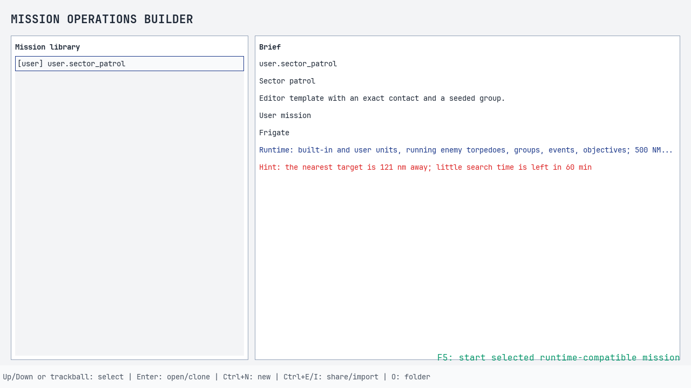

*Mission editor*

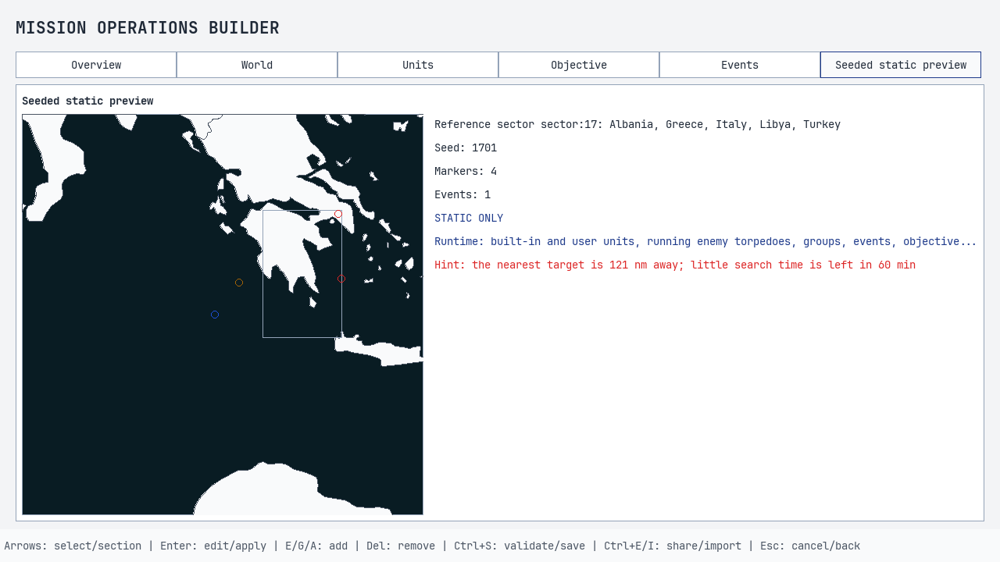

*Mission editor, unit details*

User missions start from the Mission Editor (`F5` in its browser). The runtime takes the editor's scope: a 500 NM fixed world or a packaged reference sector (`sector:0` to `sector:127`), the authored weather, placed submarines, surface ships, aircraft (patrolling a 10 NM box at profile speed), animals, static decoys and hostile torpedoes already running on their course, seeded random groups, timed events (message, spawn, weather, objective) and the objectives sink, survive, protect (keep the named units alive until the time limit) and reach (enter the objective point's radius).

Profiles saved in the Unit Editor can be placed like built-in ones and take effect in that mission (speeds, depth, torpedo load, behaviour, acoustics); a user submarine takes sensors, tubes, decoys and its battery, diesel or AIP plant from the built-in submarine of its propulsion. Frigate and helicopter torpedoes, missing user profiles and other world sizes are refused at start.

In the editor's World tab, `Enter` on Kind or Reference opens a pick list (`Up`/`Down`, `PgUp`/`PgDn`, `Enter` takes, `Esc` cancels); Reference lists the 128 sectors with their countries, and picking one makes the world a 500 NM reference world. The Preview tab then draws that sector's coast.

### Own missions and sharing

Own missions and sharing: in the Mission Editor's overview the player side is frigate or submarine. For the submarine, "Player's submarine" names one placed hostile submarine, which the player commands while the AI crews the frigate; its objectives are sink (only merchant ships can be targets, because the submarine's torpedoes hit civilian shipping), survive (hold out until the time limit) or reach, never protect. The submarine wins by sinking all targets, reaching the point or holding out, and loses when it is sunk or, on sink and reach, when time runs out. The editor's browser marks submarine missions with `[U]`, and its brief and preview give fairness hints: a submarine starting within 3 NM of the frigate, no hostile unit at all, or a reach point or nearest target that the side can hardly get to in the time limit (frigate 20 kn, submarine 8 kn).

`Ctrl+E` shares the selected mission as a file into the exchange folder `~/.u-jagd/share` (Windows: `%USERPROFILE%\.u-jagd\share`), with every user unit it references packed in; `Ctrl+Shift+E` still exports to a typed path. `Ctrl+I` lists the files in that folder with their missions (`Up`/`Down`, `Enter` imports, a second `Enter` overwrites existing items, `Tab` types a path instead, `O` opens the folder, `Esc` closes); items that are already identical are skipped. `O` in the editor's browser opens the folder in the file manager (Explorer on Windows). Copy a file into a friend's folder and they import it with `Ctrl+I`.

In the Remote Crew solo mode, "Own missions" in the browser's host bar lists the same missions with side, objective, hints or problems: Start (switches to the mission's side first), Edit, Download (the same share file) and Delete; "Upload file" takes a share file or a single mission (at most 1 MB). "New mission" or Edit opens the Mission Planner: tabs Overview, World, Units, Objective and Events and a map of the world or reference sector where a click places the frigate, the selected unit or the reach point. Save stores the mission on the uConsole after the same validation as the editor (problems are listed, an existing key asks before it is overwritten), Save and start starts it at once. Crew sessions have no access to the library.

### Unit analyser and Unit Editor

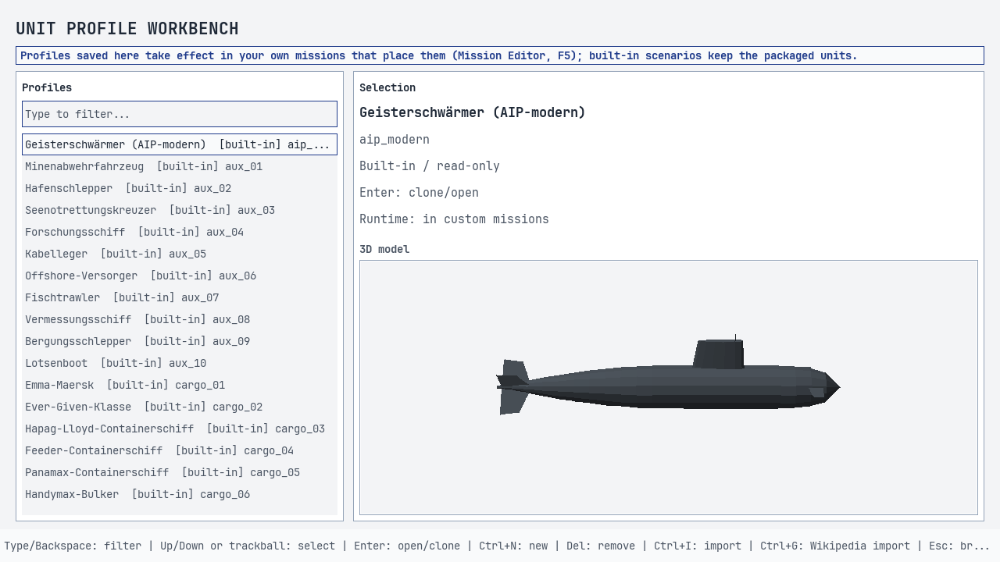

*Unit editor*

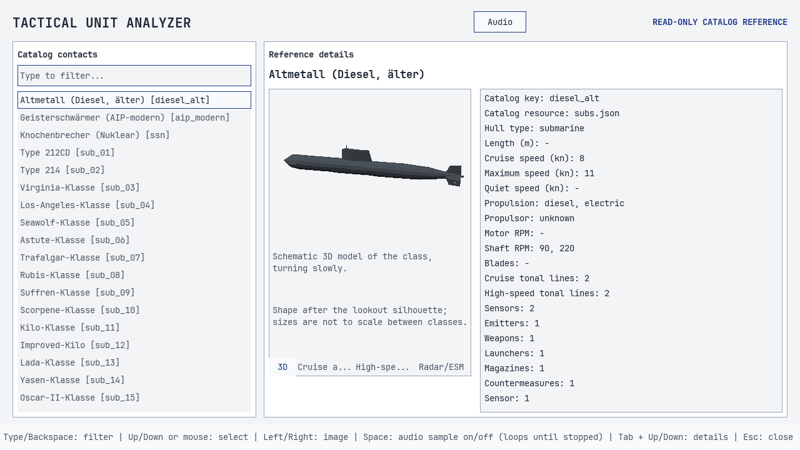

*Contact analyser (F8)*

Unit analyser (`F8`, main menu) and Unit Editor: the first page of every catalog profile in the analyser is a schematic 3D model of its type (tab `3D`, then the sound and radar images with `Left`/`Right`); it turns slowly, and in the Remote Crew browser it can also be turned by dragging. The Unit Editor shows the same model under the selected profile and beside the fields of an opened one.

Every ship, submarine and aircraft type of the catalog has its own model, built from the public main dimensions and general arrangement of the real class (Wikipedia; generic types such as a VLCC or a harbour tug use typical values): length, beam and draught, where bridge, masts, funnels, guns, missile cells, flight deck, cranes and cargo stand, the submarine's sail, planes, rudders and missile deck, the aircraft's wings, tail and engines. The same type always looks the same; unit-editor profiles and anything without a type of its own keep the model of their class (warship, merchant, small craft, submarine, the lookout's helicopter). Torpedoes, decoys, whales, fish schools and jellyfish have their own models.

The models are schematic and every one is drawn at the same length, so they are not to scale with each other. The same models stand in the eyepieces, turned by the judged angle on the bow (lookout, binoculars, periscope); the browser loads them in three groups on first use.

## Language model (optional)

### Setting it up

An OpenAI-compatible language model can make the game richer. It is off by default and the game plays exactly as without it: every job falls back to the game's own texts when the server is off, slow or unreachable.

Switch it on under `F10` Options, page 2, **Language model**: on/off, the server address (for example `http://localhost:11434/v1` for Ollama in the LAN, or a cloud service), the model name, the API key, worded radio traffic, the coach (off, rare, often) and the experimental opponent; **Test connection** sends one short request and shows the answer time. The API key is kept in `~/.u-jagd/llm_key` (readable only by you) or taken from the environment variable `U_JAGD_LLM_KEY`; it never enters the settings, saves, logs or a browser.

The model runs on a server, never on the uConsole itself. The key is typed as asterisks and afterwards shown only by its last characters. The game asks for answers without a reasoning phase (understood by Qwen3 on vLLM or SGLang; a server that refuses the switch is asked without it). If a reasoning model still sends only its thinking, the test says "only reasoning, no answer": switch its thinking off on the server or choose a model without one.

### What it does

- Radio traffic: every HQ message and the crewed submarine's radio orders are also shown worded like real traffic, beside the original. Numbers, bearings and positions stay as given; the original stays the reference.
- After-action report: when a mission ends the model writes a short report for each side from the debrief recording (now with the truth). `B` in the debrief shows it, the browser shows it in the debrief replay, and the logbook keeps it with the mission (`B` there).
- Executive officer (`F7` in a mission, the **Executive officer** button in the browser): situation report, a typed question (answered from your own picture and the manual), a typed order, help with the selected contact's classification and a briefing for your station. `Left`/`Right` or `1`-`5` choose the kind, `Enter` sends, `Up`/`Down` scroll, `Esc` closes. The officer sees only your own side's picture, like your stations.
- Typed orders: only course, speed, depth, quiet running and action stations, never weapons. The officer proposes the station commands, and nothing is given until you confirm (`Enter`; `Backspace` or `Esc` discards). In the browser the commands go only from a station allowed to give them.
- Coach: with the coach on (rare or often), a short tip from your own picture appears in the message line now and then.
- Logbook: `A` asks the model for a review of your service record, `B` shows the newest report. A mission in which situation reports, questions, orders, classification help or the coach were used is marked "with advisor" and earns no best score or award; the briefing alone does not count.
- Mission generator: `G` (frigate) or `Shift+G` (submarine) in the Mission Editor's list, and **Write mission** in the browser's Mission Planner, write a mission from a few words. The answer goes through the same check as every own mission (unknown fields dropped, a 500 NM fixed world, sink targets set to every placed hostile submarine); on problems the model gets one chance to fix them. The editor opens the mission unsaved for checking (`Ctrl+S` saves); the planner stores it as a new mission and opens it.
- Experimental opponent: every 3 min of mission time the model picks a plan for the AI side from a fixed list, from that side's own picture: for the AI submarines go deep and creep, close in, slip away or lie still (their evasion, lying in wait and attacks keep priority); for the AI hunters sprint and drift, a quiet or a fast search. It never steers, aims or fires itself. Such a mission is marked "experimental" in the logbook, earns no best score or award, and is not reproducible from its seed alone (the plan in force is saved). It never runs in the campaign, lessons or two-crew play.

### Not modelled

- Not modelled: voice commands, a model on the uConsole itself, model decisions about weapons or targets, and a model that sees hidden truth during a mission.

## Reference data

All values are the defaults of the current game version. Custom difficulty and missions can change stocks and time limits.

### Units

| Quantity | Unit |
|---|---|
| Distance, range | nautical miles (NM) |
| Speed | knots (kn) |
| Depth | metres (m) |
| Frequency | hertz (Hz) |
| Course, bearing | degrees true, 000 = north, clockwise |
| Time | simulation seconds; 1x only |

### Sensors

| Sensor | Range | Accuracy / note |
|---|---|---|
| Passive sonar (base) | 20 NM | bearing only; HMS +/-6 deg, TAS +/-2 deg, VDS +/-4 deg |
| Active ping | 18 NM (reference target, broadside-quarter aspect) | CW or LFM (`W`); range accuracy from pulse and SNR, depth +/-12 m; 30 s cooldown; heard to 60 NM |
| Dipping sonar | 18 NM passive / 14 NM active | +/-2 deg |
| Sonobuoy | 8 NM | 60 min battery |
| Surface radar | 30 NM (50 % per sweep) | 4 s antenna revolution; radar horizon; no submerged contacts |
| Air radar | 100 NM (50 % per sweep) | aircraft and missiles; jammers burn through close in |
| ESM | 150 NM (main beam) | +/-3 deg bearing; level and range estimate |
| HFDF | 120 NM ground wave at 15 MHz (about 95-150 NM by frequency) | +/-8 deg bearing (sky wave +/-16) |
| Lookout | 12 NM surface, 5 NM surfaced sub, 20 NM air, 20 NM land | x0.25 (new moon) to x0.45 (full moon) at night; fog and sea state reduce; class at 2, type at 3.2 resolved cycles over relative size (tanker about 7/5 NM, frigate 5/4 NM, speedboat 3/2 NM by clear day) |

### Weapons and countermeasures

| System | Data |
|---|---|
| Frigate torpedo | 45 kn, 12 NM (battery), wire-guided (ship <= 20 kn, <= 1.5 deg/s, 5 NM spool), 2 tubes, 60 s reload, depth 10-300 m, proximity fuze |
| Helicopter torpedo | 45 kn, 6 NM, 2 per sortie, no wire |
| Hostile torpedo | 40 kn, 20 NM, homes from 3 NM, explodes within about 90 m (at keel depth under a ship), damage falls with distance; faster than the frigate, so outrunning it alone rarely works; an AI submarine attacks a located frigate within 10 NM even when she runs quiet |
| Nixie towed decoy | 2 per mission, 600 s, 0.2 NM cable (10 m at 15 kn, deeper when slower, parts above 25 kn), 60 s reload |
| ESSM | 6 missiles, 30 NM, 2 fire channels |
| CIWS | 1.5 NM, 180 rounds, needs release; 115 deg/s slew, own track radar inside 3 NM |
| AA gun | 240 rounds, needs release |
| Chaff | 6 rounds, 8 NM, 40 % break-lock when bloomed; cloud drifts with the wind for 90 s |

### Own ship

| Item | Value |
|---|---|
| Speed | 4-31 kn; telegraph STOP 0, SLOW 6, HALF 10, FULL 16, FLANK 31 kn |
| Turn rate | about 0.075 deg/s per knot (1.2 deg/s at 16 kn); turning circle about 0.4 NM |
| Cavitation | from 15 kn in calm water, earlier in heavy seas; passive range x0.35 |
| QUIET mode | noise x0.65, max 12 kn |
| TAS handling | 3-12 kn, stream 360 s, recover 480 s, fault above 20 kn |
| TAS depth | 20-260 m, minus 4 m per knot |
| Damage | 9 compartments, 3 teams (about 20 s walk per compartment), 8 patch kits; sinks beyond reserve buoyancy, capsizes at 35 degrees heel or lost GM |

### Environment

| Process | Model |
|---|---|
| Tide | M2 (12.42 h) + S2 (12 h), 0.4-1.4 m amplitude, larger in shallow water |
| Surface layer | seasonal base depth; about 8 m shallower in the afternoon; deepens in wind above 12 kn; internal waves +/-6 m |
| Sound speed | Mackenzie equation from the temperature profile (sea surface 8-18 deg C by season) |
| Current | steady field up to 1 kn plus 3 % of the wind, 20 deg right of downwind |
| Seabed | rock, gravel, sand, silt or mud; affects bottom reflection |
| Hazards | up to 64 charted wrecks and submerged rocks (tops at least 15 m deep), shown on every chart (wreck: hull line with masts, rock: asterisk; depth of the top when zoomed in, details in the tooltip); both raise the seabed within their footprint and are obstacles for the ship, submarines and weapons |
| Shipping | cargo ships, tankers and passenger ships steam from destination to destination (the charted ports and exits at the edge of the sea area) on steady courses; they give way under the collision regulations (head-on, crossing from starboard or overtaking: alter 35 deg to starboard when the pass would be closer than 0.5 NM; any ship alters under 0.25 NM) and run from a detonation within 8 NM at full speed for 10 min; work boats and fishing vessels keep wandering, convoys and HQ task ships hold their course |
| Atmosphere | barometer 975-1025 hPa that falls ahead of rising seas; air temperature from the sea, season, day and cold northerly winds (below 0 deg C in winter storms: snow, icing); gusts; cloud ceiling; sun elevation with civil/nautical twilight; moon phase |
| Rain lens | rain freshens the top few metres (up to -1 PSU, mixed away by wind) and lowers the surface sound speed |
| SOFAR channel | an interior sound-speed minimum (about 400-500 m below the surface layer) exists only in deep enough water |

### Sea, weather and effects

What the sea and the weather do, and what the screens show of it:

- **Eyepieces:** the bridge binoculars, the periscope and the phone lookout show what happens at sea: water columns of torpedo and depth-charge hits, fire and smoke of a burning ship and a ship going down. Raising the periscope brings it up out of the water with the water running off the glass; in a sea of 3.5 or more waves wash over the head now and then and leave drops.
- **Charts:** marks move smoothly between sensor updates, a fresh ping or detonation rings out from where it happened.
- **Instruments:** needles and telegraph handles move with mass and settle; a new engine order rings the telegraph bell.
- **Bioluminescence:** at night in warm water (from 11 °C surface temperature, full from 16 °C) plankton lights up where water is stirred. Wakes, a periscope's feather and torpedo tracks glow blue-green and are seen farther: a fully glowing wake takes back 40 % of the night's penalty for lookouts on both sides. How strongly a sea area blooms is fixed by its seed.
- **Knuckles:** a hard turn (from 0.9 deg/s) at speed (from 12 kn) leaves a bubble slick of about 150 m where the stern swept round, at most one every 15 s per platform, fading over about 100 s and gone after 5 min. Sound through it loses up to 12 dB (passive and active, at most 20 dB for several), an active ping gets a false echo from it without Doppler, and a wake-homing torpedo close to a strong one may be drawn in and circle there. Frigate and submarines make and suffer them alike; the Bridge log notes the first knuckle of a turn.
- **Wrecks and rocks:** charted wrecks and rocks return active echoes like a stationary target. A helicopter or patrol aircraft passing over a wreck with MAD gets an anomaly without a contact (log: "wreck or submarine?").
- **Thunderstorms:** under a storm (rain 55 % or more) lightning strikes around the ship at random, about one every 12 s in the heaviest rain. A strike lights up the eyepieces and forks down at its bearing, the rain pours harder, and a strike within 10 NM is followed by thunder after the sound's run time (3 s per km). The sferics of the discharges crackle on the ESM roses (ELOKA and the submarine's ESM), on the HF/DF rose and in the browser (badge **Sferics**), and spread every HF/DF bearing, the frigate's on a submarine's call and a submarine's on the frigate's, by up to 75 %. The strikes follow the seed and sim time, so they need no save.
- **Deck motion:** see Helicopter deck, launch limits: launch and recovery need a quiet period of at least 6 s inside the roll and pitch limits.

### Opposing submarines

| Class | Quietness | Max depth | Torpedoes |
|---|---|---|---|
| Diesel (older) | 0.75 | 200 m | 4 |
| AIP (modern) | 0.85 | 250 m | 5 |
| Nuclear attack | 0.92 | 400 m | 8 |

Submarines evade for 240 s after hearing a ping or a torpedo (away from the bearing of the torpedo, rocket or charge they heard, else away from the frigate), may launch a decoy, lie in wait, snorkel (detectable by HFDF and ESM) and sometimes ping from 15 NM or less. Near the frigate a submarine may instead creep to a charted wreck within 8 NM and lie still on the bottom beside it for 15-30 minutes.

A submarine with its mast or snorkel raised that hears an aircraft radar (helicopter or patrol aircraft) goes deep and holds off snorkeling for 15 minutes. In the frigate scenarios (1 to 4) a patrol submarine that has heard no ping or torpedo for 10 minutes, keeps more than 2 torpedoes and is more than 10 NM from the frigate torpedoes a merchant passing within 4 NM on about one in seven of its once-a-minute fire windows; each merchant lost costs 300 points.

Submarine physics: the hull accelerates toward an ordered speed (no instant sprints); hydroplanes need speed (below about 4 kn depth changes are slow); radiated noise rises about 12 dB per doubling of speed and jumps when the screw cavitates, and the cavitation speed rises with depth; a torpedo launch makes an 8 s transient; a badly flooded submarine blows ballast once and rises fast and loud; operating below test depth fatigues the hull, and 1.5 x test depth crushes it; a lurking submarine holds its position against the current.

Submarines sense like you do: passive bearings from their own sonar, a range only after their own TMA legs (a few minutes), and a shot on that TMA only once its range error has converged (the difficulty field "enemy fire-control convergence": sigma over range at or below 0.25 in the patrol scenarios, 0.15 for the SSN; a solution older than 90 s or re-opened by your course change is not fired on), ESM only with the mast up, the datalink only at mast depth or snorkelling, and a torpedo alarm takes the crew a few seconds (2-15 s) before the submarine evades.

Surface ships lose top speed in heavy seas (small ships more).

### Enemy commanders

- Every computer submarine commander and the AI hunter frigate's captain has one of four characters, fixed by the seed: **daring** (attacks early, gives way briefly, rarely lies in wait), **fox** (lies in wait long and far, pings little), **cautious** (gives way long, holds fire, keeps its distance) and **hunter** (stubborn, runs a lost bearing down for long).
- Each character changes existing tactics only by factors (attack rate, evasion time, lurking distance; the hunter's closing speed, ping interval, firing range and lead time); across the four they average out.
- In about six of ten missions HQ hints at the character after 90 s (*Intelligence rates the enemy's commander ...*); the debrief names it.
- **Own plans:** every free AI submarine and the AI hunter frigate pick a plan of their own, without any language model. A submarine that hears the frigate closes in (daring, hunter), lies in wait under the layer (fox) or keeps its patrol (cautious); after a ping it goes deep and creeps or hovers listening under the layer; damaged or out of torpedoes it slips away. Without a datum the hunter frigate searches fast, quietly, in sprints with listening pauses or at normal speed, by its captain. Evasion, lying in wait and attacks keep priority.

### Shock, hit picture and seekers

- A detonation within 0.6 NM of the own ship shakes the picture and dims the light; within 0.15 NM the instrument glass cracks for a moment. Both are display only.
- When the own side sees a hit happen (a fireball, a torpedo's water column, a ship going down), a small window trained on its bearing opens for 8 s at every station; a hit only heard opens it with the bearing and the noise.
- Through the binoculars and the periscope a made-out ship shows its bow wave and wake: high and white when she is fast, hardly any when slow.
- A homing torpedo's seeker pings slowly while it searches and fast once it has locked on. Frigate and submarine hear it: *torpedo locked on*, *bearing steady* (collision course) and on the submarine's threat page a rough torpedo clock, the time to impact guessed by ear.

### Scoring

| Item | Points |
|---|---|
| Frigate: submarine sunk | 1000 each |
| Frigate: unused torpedo | 200 each |
| Frigate: no civilian losses | 500 |
| Frigate: time bonus | up to 500 |
| Submarine: frigate sunk | 1500 |
| Submarine: convoy sunk | 1200 |
| Submarine: breakthrough or report | 1000 |
| Submarine: escape | 800 |
| Submarine: survived | 600 |
| Submarine: undamaged | up to 500 |
| Submarine: torpedo left | 100 each |
| Realism factor | Beginner 75 %, Standard 100 %, Realistic 125 % |

## Glossary and abbreviations

### Glossary

| Term | Meaning |
|---|---|
| ASW | Anti-submarine warfare |
| HMS / TAS | Hull-mounted sonar / towed array sonar |
| VDS | Variable-depth sonar: towed body lowered below the layer |
| LOFAR | Low-frequency analysis and recording: frequency-time waterfall |
| DEMON | Demodulated noise: reveals blade and shaft rate |
| TMA | Target motion analysis from bearings |
| BT | Bathythermograph: measures the sound-speed profile and layer |
| CZ | Convergence zone |
| Datum | Last estimated target position used for weapons and search |
| CIC / OPZ | Combat information centre / Operationszentrale |
| ESM / ECM | Electronic support (passive intercept) / countermeasures (jamming) |
| HFDF | High-frequency direction finding |
| EMCON | Emission control: radars off |
| ROE | Rules of engagement |
| AIP | Air-independent propulsion: a conventional submarine that runs dived for days without snorkelling |
| AIS | Automatic identification system: civilian ships broadcast name, course and speed |
| ASM | Anti-ship missile |
| ASROC | Rocket that carries a lightweight torpedo to the target |
| CIWS | Close-in weapon system: the last-ditch gun against missiles |
| CW / LFM | Ping pulses: continuous-wave tone / linear frequency-modulated sweep |
| DR | Dead reckoning: position from course, speed and time |
| ESSM | Evolved Sea Sparrow Missile: the frigate's surface-to-air missile |
| GPS | Satellite position fix (submarine: mast up at periscope depth) |
| MAD | Magnetic anomaly detector: finds a submerged hull close below the aircraft |
| MPA | Maritime patrol aircraft |
| Nixie | Towed torpedo decoy of the frigate |
| PRF | Pulse repetition frequency of a radar |
| RAS | Replenishment at sea |
| SAR | Search and rescue |
| SSN | Nuclear attack submarine |

### Screen abbreviations

When a full label does not fit the 1280x720 screen, the station shows its catalogue abbreviation instead of cutting the text off. The F11 log and tooltips always show the full wording.

| Short | Meaning |
|---|---|
| CRS/SPD | Course / speed |
| NOISE, CAV | Own radiated noise in %, cavitating |
| SS/LAYER | Sea state / measured layer depth (BT) |
| FLOOD | Mean flooding |
| TORP, VLS/CHAFF | Torpedoes left, VLS cells / chaff reload |
| HELO/ROE, HGR | Helicopter state / rules of engagement, hangar |
| BRG, G, N | Bearing, gain, notch |
| BB, FILT, HET | Broadband, filtered, heterodyne audition |
| STOW, DEPLOY, RECOV, OUT, STAB | Towed array stowed, deploying, recovering, streamed, stability |
| RDY, N/RDY | Ready, not ready |
| UNK, FRD, NEU, HOS | Affiliation: unknown, friend, neutral, hostile |
| SFC, SUB, AIR, MSL, TRP | Domain: surface, subsurface, air, missile, torpedo |
| RDR S/A | Radar surface / air |
| D, W, CD | Dipping sonar depth, water depth, ping cooldown |
| B-rate, Tgt | Bearing rate, target |
